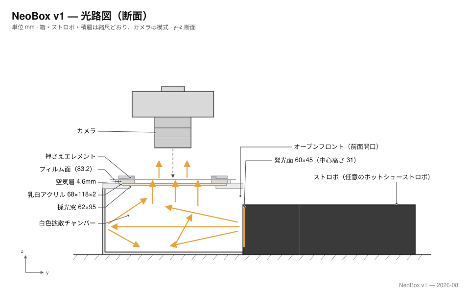

# NeoBox

[English](README.md) · [简体中文](README.zh-CN.md) · **日本語**

135 判および 120 判（最大 6×9）フィルムをカメラスキャン（デジタルデュープ）するための、小型かつ全パーツ 3D プリント可能なストロボ光源ボックスです。

ストロボは箱の底に**寝かせて**置き、**水平方向**に発光します。光が直接上へ抜けることはありません。白一色の内壁で数回拡散反射したのち、フィルムホルダー直下の乳白アクリル 1 枚を通ってフィルムに届きます。混光距離を垂直ではなく水平方向に取っているため、箱の高さはストロボの「高さ」ではなく「**厚み**」で決まります。これが本機を小型化できた理由です。

```
208 × 273 × 96 mm   ·   約 5.4 L   ·   プリント部品 8 点 + アクリル 1 枚 + 寸切りボルト 3 本
```

| | |
|---|---|
| **対応フォーマット** | 135 判、120 判（6×4.5 / 6×6 / 6×7 / 6×9） |
| **光源** | マニュアル発光可能なクリップオンストロボ（作例：NEEWER TT560 + ZENIKO T1 トリガー） |
| **筐体** | 一体プリントの本体 + スカート付き天板 + 差し込み式アクセスパネル |
| **拡散** | 乳白アクリル 1 枚、110 × 130 × 2 mm |
| **フィルムステージ** | 3 点支持で水平調整、200 × 230 mm、開口 100 × 120 mm |
| **フィルムホルダー** | 135 / 120 用スライド溝式サンドイッチホルダー、マグネット固定 |
| **組立時間** | 約 15 分、接着による構造接合なし |
| **ライセンス** | MIT |

---

## なぜストロボなのか、光はどう進むのか

**シャッターは「開けるだけ」。露光を決めるのはストロボの閃光です。** 閉じた箱の中では環境光の寄与はゼロなので、露光は閃光パルス（実用出力で約 1/1,000～1/20,000 秒）だけで決まります。複写台の振動もシャッターショックも床の揺れも無関係になります——マイクロ秒の間に動けるものは何もないからです。言い換えれば、閃光は **1/1,000 秒以上の実効シャッター**であり、ISO 100・f/8 の連続光 LED パネルが要求する 1/15～1/60 秒の実シャッターより 1～3 桁短いのです。これが LED パネルではなくストロボを選んだ核心的な理由です。加えて、ベース ISO と f/8 を余裕をもって使えること、ロール全コマで出力が完全に一致すること（反転プロファイルが 1 つで済む）、キセノン管の光が本物の連続スペクトルのデイライト（約 5600 K）であることも利点です。LED 案を見送った経緯は[設計ログ](docs/design-log.ja.md)に記録しています。



光がフィルムへ直接向かうことはありません。ストロボは奥の白壁へ水平に発光し（1）、白一色の内腔が積分球のように拡散反射を重ねて方向を完全にランダム化し（2）、フィルムの 4 mm 下にある乳白アクリル 1 枚がそれを均一な発光面に変えます（3）。拡散板より上はすべて黒く、迷光は反射されずに吸収されます（4）。カメラはその均一な発光面を透かしてフィルムを撮影します（5）。完全拡散照明には暗室の引き伸ばし機で知られた副次効果もあります——細かい傷や粒状感が指向性の光より目立ちにくくなるのです。

## この形状に至った理由

設計全体は 3 つの制約から導かれています。

**ストロボを寝かせたので、箱が低い。** 一般的なライトボックスではストロボを立てて上向きに発光させ、複数枚の拡散板を通します。そのため筐体には発光部の高さ**に加えて**長い混光距離が必要で、通常 300 mm 以上になります。本機ではストロボを寝かせて横向きに発光させ、混光を箱の奥行き方向で行います。その奥行きはもともとストロボ本体が占めている空間です。結果として高さは `ストロボの厚み + 41 mm` まで縮まります。

**白い内腔そのものが拡散器。** 反射板もバッフルも、内部調整パーツも一切ありません。白色 PLA の壁面が多重拡散反射によって混光を行い、アクリルは最終的な均し役に徹します。これは「アクリル 1 枚をフィルムのすぐ手前に置く」という作者の従来手法で十分な均一性が得られている、という実測に基づく判断です。

**画面領域には何も触れない。** フィルムは高さ 0.4 mm の溝に収まり、支持されるのは非画面領域のフィルム縁のみです。画面領域は下に 0.4 mm・上に約 0.25 mm 浮いているため、擦り傷もニュートンリングも発生しません。コマ送りはフィルムを溝に沿って横方向にスライドさせるだけで、1 本撮り終わるまでホルダーを開ける必要がありません。

## リポジトリ構成

```
stl/white-pla/     本体・天板・アクセスパネル          → 白フィラメントで出力
stl/black-pla/     フィルムホルダー・ステージ・小物    → 黒フィラメントで出力
cad/               Blender ソース、アルミ製ステージ DXF、旧・合板ルート DXF
drawings/          製造総図（SVG）
docs/              設計・出力・組立・部品表・設計判断ログ
```

## クイックスタート

1. **出力** — STL 8 点を 2 色で（ほかに 6×6 マスク 1 点のオプション）。設定は [docs/printing.ja.md](docs/printing.ja.md) を参照。本体は 280 × 300 mm 以上のビルドプレートが必要です。
2. **調達** — 乳白アクリル 110 × 130 × 2 mm を 1 枚、M6×35 寸切りボルト 3 本とナット 6 個、M6 熱圧入インサートナット 3 個。全リストは [docs/bom.ja.md](docs/bom.ja.md)。
3. **組立** — インサートナット 3 個を熱圧入し、外面をつや消し黒で塗装、ステージをボルトに乗せ、ストロボを入れるだけ。手順は [docs/assembly.ja.md](docs/assembly.ja.md)。
4. **キャリブレーション** — フィルムなしの発光面を撮影し、フラットフィールド補正後に四隅の差が ±0.1 EV 程度に収まることを確認します。

## 別のストロボを使う場合

作例は NEEWER TT560（190 × 75 × 55 mm）と ZENIKO T1 レシーバー（39 × 38 × 29.5 mm）の組み合わせです。他のマニュアルストロボを使う場合は、寝かせた状態の実測値から筐体寸法を再計算してください。

```
高さ = ストロボの厚み + 41 mm
奥行 = ストロボの長さ + レシーバーの長さ + 53 mm
幅   = 208 mm （固定：内腔 202 mm + 壁 3 mm × 2）
```

幅は発光窓とその周囲の白壁マージンで決まり、ストロボには依存しないため変わりません。天板より上（ステージ・拡散板・ホルダー）はストロボと完全に独立しています。寸法チェーンの全体は [docs/design.ja.md](docs/design.ja.md) にあります。

## ステータス

プロトタイプ公開段階です。形状は Blender ソース上で寸法検証済み、勘合クリアランスも数値で確認済みですが、実機の撮影と均一性テストはまだ行っていません。最初のキャリブレーションでは、ストロボ本体の上面に白紙を貼る必要があるか、拡散板の中央に減光ドットが必要かの 2 点が判明する見込みです。

## クレジット

設計：[ネオアナログラボ株式会社（Neo Analog Lab Inc.）](https://github.com/Neoanaloglab)。[MIT ライセンス](LICENSE) で公開しています。製作・販売・改変はいずれも許諾不要です。
