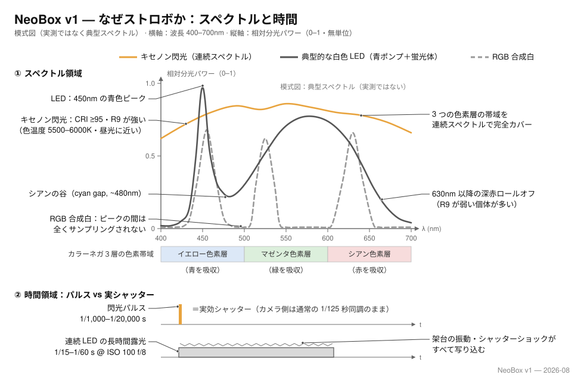
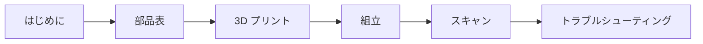

# NeoBox

[English](README.md) · [简体中文](README.zh-CN.md) · **日本語**

> 135 判・120 判フィルムをカメラスキャンするための、オープンハードウェアの 3D プリント可能な卓上ストロボライトボックスです。外形は約 125 × 155 × 83 mm、プリント部品 9 点で約 300–350 g。ねじなし・工具なしのマグネット組立。ホットシューストロボならどれでも、オープンフロント（前面開口）に寝かせるだけで使えます。フィルムはインサート式の押さえプラットフォームで平面に保ち、汎用アンチニュートンガラス 1 枚でアップグレードできます。

**目次：** [NeoBox とは](#neobox-とは) · [手に入るものと自分で用意するもの](#手に入るものと自分で用意するもの) · [なぜストロボなのか](#なぜストロボなのか) · [光がどう進むか](#光がどう進むか) · [ドキュメント](#ドキュメント) · [クイックスタート](#クイックスタート) · [リポジトリ構成](#リポジトリ構成) · [別のストロボに合わせる](#別のストロボに合わせる) · [ステータス](#ステータス) · [ライセンスとクレジット](#ライセンスとクレジット)

   

> [!IMPORTANT]
> これはプロトタイプ公開です。形状は Blender ソース上で寸法検証済み、書き出した STL も数値検証済みですが、**この箱はまだ一度も出力・撮影・実測・均一性テストをしていません。** お金を使う前に [ステータス](#ステータス) を読んでください。

## NeoBox とは

NeoBox は、前面が完全に開いた白い箱です。クリップオンストロボ 1 灯を均一に光る面に変え、フィルムをスキャナーではなくデジタルカメラで撮影する手法、[カメラスキャン（camera scanning）](docs/glossary.ja.md#カメラスキャン-camera-scanning)（DSLR スキャンとも呼ばれます）のための光源になります。

ストロボ本体は机の上に寝かせ、発光部をオープンフロント（前面開口）に向けて、白い拡散チャンバーへ**水平に**発光します。光がフィルムに届くのは、何度かの拡散反射と乳白アクリル拡散板 1 枚を経たあとだけです。

ストロボが筐体の外に出たため、箱に必要なのは拡散チャンバーとフィルムのプラットフォームだけになりました。プリント部品 9 点・PLA 約 300–350 g・160 × 160 mm のビルドプレートで足りるのはそのためです。

| 項目 | 仕様 |
|---|---|
| 外形寸法 | 約 125 × 155 × 83 mm（設置面 124.8 × 154.8 mm。フィルムホルダーを載せた総高は 87 mm） |
| 対応フォーマット | 135 判と 120 判、最大 6×9。6×6 はマスクインサートで、6×4.5 は後処理のトリミングで対応 |
| プリント部品 | STL 9 点（白 2 点・黒 7 点、6×6 マスクインサートを含む）。約 300–350 g、全点サポート不要 |
| 購入部品 | 乳白アクリル拡散板 1 枚、Ø8 × 2 mm マグネット 32 個、スチールワッシャー 4 枚。オプション：アンチニュートンガラス 1 枚、USB LED テープライト 1 本、植毛シート 1 枚 |
| 筐体 | 前面が完全に開いた一体プリントの本体と、4 か所の位置決めダボで載せるだけの天板ステージ |
| 拡散 | 乳白アクリル拡散板 1 枚、68 × 118 × 2 mm。62 × 95 mm の透光窓の下、フィルムの 4.6 mm 下 |
| フィルムの平面保持 | インサート式プラットフォーム：ホルダーベースのエレメント段（4.6 mm）にプリント製の押さえ窓インサートを載せ、汎用の 64 × 95 × 2 mm アンチニュートンガラス 1 枚にアップグレード可能 |
| フィルムホルダー | 135 判・120 判用のスライド溝式フィルムホルダー、Ø8 × 2 マグネットで閉じる。フォーマット切り替えは持ち上げて載せ替えるだけ |
| フィルム面 | 机上から 83.2 mm。どちらのフォーマットでも同じ |
| 光源 | マニュアル発光できるホットシューストロボなら何でも可。オープンフロントに寝かせて使う。作例は NEEWER TT560 ＋ ZENIKO T1 トリガーセット |
| 組立 | ねじなし・ねじ切りなし・工具なし。マグネットと重力だけ。水平出しは小さな鏡を使ってカメラ側で行います |
| ライセンス | MIT |

## 手に入るものと自分で用意するもの

NeoBox はスキャン装置の半分です。ライトテーブルを置き換えるものであって、その上に構えるカメラを置き換えるものではありません。

| このリポジトリで手に入るもの | すでに持っているか、買う必要があるもの |
|---|---|
| STL 9 点（白 2 点・黒 7 点）。どれも平らな面を下にしてサポートなしで出力できます | マニュアル露出と RAW 撮影ができるカメラボディ（ミラーレスまたは一眼レフ） |
| Blender ソース `cad/neobox.blend`、唯一の正であるジオメトリ | マクロ撮影ができるレンズ。等倍（1:1）マクロが 1 本あれば、本プロジェクトの全フォーマットをカバーできます |
| 図面（English・简体中文・日本語） | 箱の真上にカメラをまっすぐ保持できる[複写スタンド（copy stand）](docs/glossary.ja.md#複写スタンド-copy-stand)、または水平・反転可能なセンターポールを備えた三脚 |
| 買い物・出力・組立・スキャンまでを扱うドキュメント 10 種 | ストロボ本体とトリガーセット。送信機はカメラのホットシューに載せ、受信機は箱の外に置きます |
| リポジトリにコミット済みの STL 書き出しスクリプトとジオメトリ検証スクリプト | レリーズ、および[フラットフィールド補正（flat-field correction）](docs/glossary.ja.md#フラットフィールド補正-flat-field-correction)とネガの[反転（inversion）](docs/glossary.ja.md#反転-inversion)ができるソフトウェア |
| そのまま貼り付けられる[発注文面](docs/bom.ja.md#発注文面)（各部品の注文用） | [工具と消耗品](docs/bom.ja.md#工具と消耗品)に挙げたもの。組立自体にはドライバーもレンチもはんだごても不要です |

> [!IMPORTANT]
> 製作費はプリント部品と購入部品だけの金額です。ストロボ、トリガー、カメラ、レンズ、スタンド、レリーズ、ソフトウェアは含みません。これらをひとつも持っていない場合は、まずそちらの予算を立ててください。全リストは [はじめに](docs/getting-started.ja.md#すでに持っている必要があるもの) に挙げてあります。

## なぜストロボなのか

**露光を決めるのはストロボの閃光そのものです。** カメラのシャッターダイヤルは普通の同調速度のまま（推奨は 1/125 秒）で、その仕事は閃光の瞬間に開いていることだけです。1 コマを実際に決めるのは発光管のパルスで、実用出力での長さはわずか 1/1,000–1/20,000 秒。箱の前面は開いているので環境光はチャンバーに入り得ますが、閃光は室内光よりはるかに明るい。薄暗い部屋で撮影し、天井の照明が開口へ差し込まないようにすれば、環境光の寄与は見えないレベルになります。

**だから振動が問題にならなくなります。** この閃光は実効シャッターとして働き、その長さは、連続光の LED パネルが ISO 100・f/8 で必要とする実シャッター速度 1/15–1/60 秒より 1–3 桁短くなります。複写スタンドのたわみも、シャッターショックも、木の床を歩く振動も効きません。閃光の継続時間内に計測できるほど動くものが何もないからです。これが本プロジェクトの中心的な主張です。

第二の論拠はスペクトルで、フィルムは見かけ以上に光源を選びます。カラーネガは黄・マゼンタ・シアンの 3 つの色素層の積層で、それぞれ青・緑・赤を記録します。シアン層とオレンジマスクはどちらもスペクトルの赤端で仕事をします。スキャン用の光源は 3 つの帯域すべてに同時に十分なエネルギーを届けなければなりません。光源に欠けがあれば、その色素層はサンプリング不足になり、チャンネルの分離が崩れます。そのつけは反転後に届きます：交差したカラーカーブと、ホワイトバランス 1 回では抜けない頑固な色かぶりです。

**キセノン管はハロゲン化銀材料にとって「生まれつきの」光源です。** 放射は約 5600 K の本当に連続したスペクトルで、演色は昼光級（CRI は典型的に ≥ 95）、LED が苦手とする R9（深い赤）も十分に含みます。典型的な白色 LED は青のポンプと蛍光体の組み合わせです：450 nm 付近のピーク、480 nm 前後の谷（「シアンギャップ」）、蛍光体のなだらかな山、そして約 630 nm からのロールオフ。シアン層とオレンジマスクが最も光を必要とする場所を直撃します。下の図がその形を示します。曲線は 2 種の光源の典型を描いた模式図であり、実測ではありません。

3 色 LED を混ぜた「白」も駄目で、理由はちょうど逆です：スペクトルは 3 本の鋭いピークだけになり、その間にはほとんど何もなく、色素スペクトルのかなりの帯域がそもそも一度もサンプリングされません。ワンショットのカラーカメラではさらに悪化します。カメラのカラーマトリクスは連続光源を前提に較正されており、3 本のピークがベイヤーフィルターを通ると較正が想定していないクロストークが生じ、混合比に焼き込まれた白色点はオレンジマスクと衝突します。結果は、フィルム銘柄ごとに変わり、いくら調整しても抜けない色かぶりです。

理論上の最適解は別の場所にあり、それは率直に言っておくべきです：モノクロカメラと RGB の順次露光です。ベイヤー配列のないセンサーで狭帯域の赤・緑・青を 1 回ずつ露光して合成すれば、濃度計級の三色分解スキャンになります。全チャンネルがフル解像度で、分離はフィルター色素ではなく光源が定義します。ドラムスキャナーが歩んだ道です。その代償はニッチなモノクロ機と、1 コマ 3 露光、そして位置合わせのワークフローです。NeoBox はこの曲線の実用的な点にあえて立ちます：1 閃光・1 ショット・どのカメラでも。連続スペクトルがワンショット路線の誠実さを支えます。

一貫性が第三の論拠です。地味ですが効きます。マニュアルストロボは固定出力で 1 枚ごとに高い再現性で発光し、ロールのどのコマにも同じ光が当たるので、反転プロファイルは 1 つで足ります。ウォームアップによるドリフトも、撮影中の熱による色シフトもなく、PWM 調光もないので電子シャッターで縞も出ません。しかもそのすべてが f/8・[ベース ISO（base ISO）](docs/glossary.ja.md#ベース-iso)のまま、出力に余裕を残して手に入ります。

商用の先例もあります。リコーの [PENTAX FILM DUPLICATOR](https://ricohimagingstore.com/pentax-film-duplicator.html) はフィルムの血統を持つカメラメーカーによる複写のベンチマーク機で、公式構成がまさにこのレシピです：デジタルカメラとマクロレンズ、そして拡散スクリーン越しに発光させる外部ストロボ。NeoBox は同じ光学レシピの光箱を自宅でプリントできる形にし、独自のフィルム送りを加えたものです。

**LED パネルも検討したうえで見送りました。** パネルはそれ自体が面光源ですが、実効シャッターの論拠もスペクトルの論拠も取れません。判断の根拠は[設計](docs/design.ja.md#8-ストロボの運用)と [FAQ](docs/getting-started.ja.md#よくある質問) にあります。

## 光がどう進むか

1. **ストロボはチャンバーへ横向きに発光し、フィルムには決して向けません。** ストロボ本体は机に寝かせ、発光面を完全に開いた前面開口に付けて箱の中へ向けます。トリガーの受信機も一緒に箱の外に置きます。
2. **光を混ぜるのは拡散チャンバーです。** 無塗装の白いフィラメントの壁と天井が、何度かの拡散反射で光の方向をランダム化します。[積分キャビティ（integrating cavity）](docs/glossary.ja.md#積分キャビティ-integrating-cavity)と同じ働きです。反射板も、内部調整用の金物もありません。
3. **均すのは乳白アクリル拡散板 1 枚だけです。** 68 × 118 × 2 mm の拡散板が天板ステージの浅い凹みに収まり、62 × 95 mm の透光窓の下、フィルムの 4.6 mm 下に位置します。拡散板の上のほこりは像になりません。拡散板そのものが発光面だからです。ときどき拭けば十分です。
4. **拡散板より上はすべて黒です。** ホルダー、インサート、マスクは黒フィラメントで出力し、オプションの植毛シートがステージ面の最後の反射を消します。迷光は反射されずに吸収されるので、画像にベールがかかりません。
5. **画面領域には何も触れません。** フィルムは非画面領域の縁だけが細いランドに載り、その上にエレメント段（4.6 mm）に載った押さえ部品が来て、全画面にわたり 0.4 mm の通り道が残ります。プリント製の押さえ窓インサートなら反りは 0.28 mm 以内で、等倍・f/8 の被写界深度に収まります。オプションの[アンチニュートン](docs/glossary.ja.md#ニュートンリング-newton-rings)ガラスなら全画面を連続した面で押さえ、ニュートンリングも出ません。コマ送りはフィルムを引き抜くだけなので、1 本撮り終わるまでフィルムホルダーを開ける必要がありません。

なぜストロボを箱の外に置くのか

以前の NeoBox はストロボを筐体の中に密閉していたため、箱は対応する最大のストロボに合わせて寸法を決める必要があり、電池交換のたびに箱を開けることになりました。v5 は前壁を丸ごと取り払いました。ストロボは机に寝かせて箱の中へ発光するので、筐体はストロボのどの寸法にも依存しなくなり、どのブランドでも使え、無線の受信機は電波の通る箱の外に置けます。

完全拡散照明には、暗室の引き伸ばし機で知られた副次効果も残ります。細かい傷や粒状感が、指向性の光より軟らかく写ります。

## ドキュメント

この順に読んでください。区切りから下は、どこからでも参照できるリファレンスです。

| ドキュメント | こんなときに読む |
|---|---|
| [はじめに](docs/getting-started.ja.md#はじめに) | 初めてで、このプロジェクトが自分に向いているのか、実際いくらかかるのか、通しでどれだけ時間がかかるのかを知りたい。 |
| [部品表と調達](docs/bom.ja.md#部品表と調達) | これから買う。部品、工具と消耗品、日本・中国・その他の地域での調達先、コピペで使える発注文面。 |
| [3D プリント](docs/printing.ja.md#3d-プリント) | これから出力する、またはプリント代行に依頼する。設定は 1 か所に集約、部品ごとのカード、受け入れ検査。 |
| [組立](docs/assembly.ja.md#組立) | 部品が届いた。マグネットの圧入、積み上げの順序、各手順のチェックポイント、鏡を使った水平出し。 |
| [スキャン](docs/scanning.ja.md#スキャン) | 箱ができて、ネガをデータにしたい。カメラ、レンズ、撮影倍率（magnification ratio）、平行出し、ピント、露出、フィルムの装填、反転。 |
| [トラブルシューティング](docs/troubleshooting.ja.md#トラブルシューティング) | うまくいかない。症状・考えられる原因・対処を、出力・組立・光・撮影の 4 領域で。 |
| [用語集](docs/glossary.ja.md#用語集) | 本ドキュメントに出てくる言葉が分からない。1 行の定義と、本プロジェクトでなぜ効いてくるのか。 |
| [設計](docs/design.ja.md#設計) | 設計の中身を知りたい。寸法チェーン、光学上の判断、Blender ソースの扱い方。 |
| [設計ログ](docs/design-log.ja.md#設計ログ) | なぜこの形なのか、どんな代案を試して捨てたのかを知りたい。 |
| [コントリビューション（英語のみ）](CONTRIBUTING.md#contributing-to-neobox) | パッチを送りたい。どのファイルが生成物か、書き出しと検証のゲート、3 言語ルール。 |

## クイックスタート

- [ ] **1. 自分に向いているか確認する**：自分で用意するもの、現実的な所要期間。→ [はじめに](docs/getting-started.ja.md#はじめに)
- [ ] **2. 買う**：68 × 118 × 2 mm にカットした乳白アクリル拡散板 1 枚、Ø8 × 2 mm の N35 マグネット 32 個、スチールワッシャー 4 枚。オプションで 64 × 95 × 2 mm のアンチニュートンガラス 1 枚、USB LED テープライト、植毛シート。→ [部品表と調達](docs/bom.ja.md#工具と消耗品)
- [ ] **3. 出力する**：STL 9 点を 2 色で（白 2・黒 7）、通常の PLA、サポートなし。全部品とも平らな面を下にして出力します。白フィラメントは**つや消し**でなければなりません。シルクや光沢の白は、チャンバー内に鏡面反射を残します。→ [3D プリント](docs/printing.ja.md#3d-プリント)
- [ ] **4. 組んでキャリブレーションする**：マグネットを圧入し、部品を積み上げるだけ。ねじも工具も使いません。そのあとステージに小さな鏡を置き、ファインダー内でレンズ自身の映り込みが中央に来るようにします。これでセンサーはフィルム面と平行です。→ [組立](docs/assembly.ja.md#組立)
- [ ] **5. スキャンする**：粒子にピントを合わせ、露出を決めて 1 本撮ります。→ [スキャン](docs/scanning.ja.md#スキャン)

> [!TIP]
> **[ビルドプレート](docs/glossary.ja.md#ビルドプレートのサイズ-bed-size)のサイズはもう制約になりません。** 最大の部品でも長さ 154.8 mm なので、160 × 160 mm のビルドプレートで足ります。主流のプリンターはすべて合格で、以前のリビジョンにあった大型プレートの警告は過去のものです。

## リポジトリ構成

| パス | 内容 | 種別 |
|---|---|---|
| [`cad/neobox.blend`](cad/neobox.blend) | Blender ソース。全部品について唯一の正であるジオメトリ | ソース |
| [`cad/film-stage-aluminium-3mm.dxf`](cad/film-stage-aluminium-3mm.dxf) | v4 のアルミ製フィルムステージ。廃止。v5 ではその機能は天板ステージに統合された | 過去資料 |
| [`cad/legacy-plywood/`](cad/legacy-plywood/) | 廃案になった合板ルートの DXF 2 点。単体では完成品にならないが、記録として残してある | 過去資料 |
| [`stl/white-pla/`](stl/white-pla/) | `main-body.stl`、`cover-stage.stl` | 生成物 |
| [`stl/black-pla/`](stl/black-pla/) | フィルムホルダー 4 点、押さえ窓インサート 2 点、`mask-6x6.stl` | 生成物 |
| [`drawings/`](drawings/) | 光路図、断面図、印刷姿勢、分解図、撮影セットアップ、製造総図を 3 言語分。`tools/drawings/` のジェネレーターから生成 | 生成物 |
| [`docs/`](docs/) | ドキュメント一式。各ファイルに English・简体中文・日本語 | ソース |
| [`tools/export_stl.py`](tools/export_stl.py) | コミット済みの書き出しスクリプト。`cad/neobox.blend` から STL 9 点を再生成する | ソース |
| [`tools/drawings/`](tools/drawings/) | 図面ジェネレーター。`drawings/` 配下の SVG 18 点を再生成する | ソース |
| [`tools/verify_stl.py`](tools/verify_stl.py) | ジオメトリのゲート。水密性、0.2 mm の z グリッド、全バウンディングボックスを検査 | ソース |

## 別のストロボに合わせる

合わせる作業はもうありません。作例は NEEWER TT560 と ZENIKO T1 トリガーセットの組み合わせですが、ジオメトリのどの寸法もそれらに依存していません。ストロボ本体は机に寝かせて発光部を完全に開いた前面開口へ向け、受信機は箱の外（電波が遮られず、電池交換で箱に触れる必要もない場所）に置きます。

代替機を選ぶ基準はただひとつ、**マニュアルでの発光量調整**です。この使い方では TTL も HSS も役に立ちません。そこにお金を払わないでください。導出のやり直しも CAD の編集も不要です。ストロボを置き、発光部を開口に合わせ、露出を取り直して撮るだけです。筐体を実際に決めている寸法チェーン（透光窓、チャンバー、フィルム面）は[設計](docs/design.ja.md#2-寸法チェーン)にあります。

> [!TIP]
> 外形の高さを先に決めて層を逆算してはいけません。層を足し上げ、その結果として高さを読み取ります。逆順でやったために初稿は物理的に成立しませんでした。[設計ログ](docs/design-log.ja.md#設計ログ)の項目 1 です。

## ステータス

プロトタイプ公開、v5 ジオメトリ。

- **検証済み：** STL 9 点はすべて水密な単一ソリッドで、非多様体エッジは 0 です。印刷姿勢における水平面はすべて 0.2 mm の積層グリッドに乗っており、バウンディングボックスは公開寸法と一致します。`tools/verify_stl.py` を実行すれば再現できます。
- **未検証：** この設計は**一度も出力・撮影・実測・均一性テストをしていません。** 実物の箱は存在しません。
- ドキュメントで挙げている均一性の数値はすべて**設計目標**であって、実測値ではありません。
- 拡散板 1 枚という判断は、作者がライトパッドで行ってきた既存のワークフローに基づくものであり、この箱でのテストによるものではありません。
- 平面保持に関する数値（0.4 mm の通り道、プリント製インサート下で反り 0.28 mm 以内）は CAD の積み上げと公差解析によるもので、実物のホルダーで実フィルムを測った値ではありません。

実際に作った方がいれば、きつかった箇所・緩かった箇所・ムラが出た箇所を教えていただけると助かります。

## ライセンスとクレジット

設計：[ネオアナログラボ株式会社（Neo Analog Lab Inc.）](https://github.com/Neoanaloglab)。[MIT ライセンス](LICENSE) で公開しています。製作も販売も改変も、許諾は不要です。

---

[ドキュメント一覧](#ドキュメント) · [はじめに](docs/getting-started.ja.md#はじめに) →
