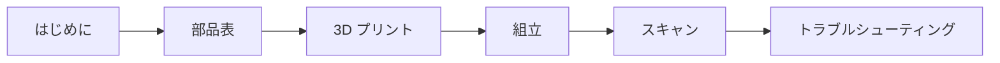

# NeoBox

[English](README.md) · [简体中文](README.zh-CN.md) · **日本語**

> 135 判・120 判フィルムをカメラスキャンするための、オープンハードウェアの 3D プリント可能なストロボ光源ボックスです。何をするものか、なぜ LED パネルではなくストロボなのか、そして次にどこを読めばよいかをまとめます。

**目次：** [NeoBox とは](#neobox-とは) · [手に入るものと自分で用意するもの](#手に入るものと自分で用意するもの) · [なぜストロボなのか](#なぜストロボなのか) · [光がどう進むか](#光がどう進むか) · [ドキュメント](#ドキュメント) · [クイックスタート](#クイックスタート) · [リポジトリ構成](#リポジトリ構成) · [別のストロボに合わせる](#別のストロボに合わせる) · [ステータス](#ステータス) · [ライセンスとクレジット](#ライセンスとクレジット)

   

> [!IMPORTANT]
> これはプロトタイプ公開です。形状は Blender ソース上で寸法検証済み、書き出した STL も数値検証済みですが、**この箱はまだ一度も出力・撮影・実測・均一性テストをしていません。** お金を使う前に [ステータス](#ステータス) を読んでください。

## NeoBox とは

NeoBox は、クリップオンストロボ 1 灯を均一に光る面に変える密閉された白い箱です。フィルムをスキャナーではなくデジタルカメラで撮影する手法——[カメラスキャン（camera scanning）](docs/glossary.ja.md#カメラスキャン-camera-scanning)、DSLR スキャンとも呼ばれます——のための光源になります。

ストロボは箱の底に寝かせてあり、白い拡散チャンバーへ**水平に**発光します。光がフィルムに届くのは、何度かの拡散反射と乳白アクリル拡散板 1 枚を経たあとだけです。

拡散に必要な距離を箱の高さ方向ではなく奥行き方向に取っているため、高さはストロボの「高さ」ではなく「*厚み*」で決まります。筐体をここまで小さくできたのはそのためです。

| 項目 | 仕様 |
|---|---|
| 外形寸法 | 208 × 273 × 96 mm（幅 × 奥行 × 高さ）、約 5.4 L |
| 対応フォーマット | 135 判と 120 判、最大 6×9（6×4.5 / 6×6 / 6×7 / 6×9） |
| プリント部品 | 標準ビルド 8 点 ＋ オプションの 6×6 マスク 1 点 = **STL 9 点** |
| 購入部品 | 乳白アクリル拡散板 1 枚、M6 × 35 寸切りボルト 3 本、ナット 6 個、インサートナット 3 個、EVA フォーム、ゴムグロメット 2 個、USB LED テープライト 1 本 |
| 筐体 | 一体プリントの本体、上から被せる天板、前壁に差し込むアクセスパネル |
| 拡散 | 乳白アクリル拡散板 1 枚、110 × 130 × 2 mm、フィルムの約 4.3 mm 下 |
| フィルムステージ | 200 × 230 mm の板、開口 100 × 120 mm、寸切りボルトとナットによる 3 点支持の水平調整 |
| フィルムホルダー | 135 判・120 判用のスライド溝式フィルムホルダー、Ø6 × 2 マグネットで閉じる |
| フィルム面 | 箱を置いた面から約 120.3 mm——どちらのフォーマットでも同じ |
| 光源 | マニュアル発光できるクリップオンストロボなら何でも可。作例は NEEWER TT560 ＋ ZENIKO T1 トリガーセット |
| 組立 | 約 15 分。構造用の接着剤はなく、筐体を留めるねじもありません |
| 製作費 | JPY 5,500–9,000 / CNY 250–420——ストロボとカメラ側一式は含みません |
| ライセンス | MIT |

## 手に入るものと自分で用意するもの

NeoBox はスキャン装置の半分です。ライトテーブルを置き換えるものであって、その上に構えるカメラを置き換えるものではありません。

| このリポジトリで手に入るもの | すでに持っているか、買う必要があるもの |
|---|---|
| STL 9 点——標準ビルド 8 点 ＋ オプションの 6×6 マスク | マニュアル露出と RAW 撮影ができるカメラボディ（ミラーレスまたは一眼レフ） |
| Blender ソース `cad/neobox.blend`——唯一の正であるジオメトリ | マクロ撮影ができるレンズ——等倍（1:1）マクロが 1 本あれば、本プロジェクトの全フォーマットをカバーできます |
| オプションのアルミ製フィルムステージ用 DXF | 箱の真上にカメラをまっすぐ保持できる[複写スタンド（copy stand）](docs/glossary.ja.md#複写スタンド-copy-stand)、または水平・反転可能なセンターポールを備えた三脚 |
| 図面（English・简体中文・日本語） | ストロボ本体とトリガーセット——送信機はカメラのホットシューに載せます |
| 買い物・出力・組立・スキャンまでを扱うドキュメント 10 種 | レリーズ、および[フラットフィールド補正（flat-field correction）](docs/glossary.ja.md#フラットフィールド補正-flat-field-correction)とネガの[反転（inversion）](docs/glossary.ja.md#反転-inversion)ができるソフトウェア |
| プリント代行にそのまま送れるバンドルと、ジオメトリ検証スクリプト | [工具と消耗品](docs/bom.ja.md#工具と消耗品)——[インサートナット（heat-set insert）](docs/glossary.ja.md#インサートナット-heat-set-insert)の熱圧入に使うはんだごてが、いちばん見落とされます |

> [!IMPORTANT]
> 製作費 **JPY 5,500–9,000 / CNY 250–420** は、プリント部品と購入部品だけの金額です。ストロボ、トリガー、カメラ、レンズ、スタンド、レリーズ、ソフトウェアは含みません。これらをひとつも持っていない場合は、まずそちらの予算を立ててください——全リストは [はじめに](docs/getting-started.ja.md#すでに持っている必要があるもの) に挙げてあります。

## なぜストロボなのか

**露光を決めるのはストロボの閃光そのものです。** 閉じた箱の中では環境光の寄与がゼロなので、1 コマは実用出力で 1/1,000–1/20,000 秒の閃光だけで決まります。カメラのシャッターは、その瞬間に開いてさえいれば役目を果たします。

**だから振動が問題にならなくなります。** この閃光は*実効シャッター*として働き、その長さは、連続光の LED パネルが ISO 100・f/8 で必要とする実シャッター速度 1/15–1/60 秒より 1–3 桁短くなります。複写スタンドのたわみも、シャッターショックも、木の床を歩く振動も効きません。閃光の継続時間内に計測できるほど動くものが何もないからです。これが本プロジェクトの中心的な主張です。

**副次的な理由が 3 つあります。** [ベース ISO（base ISO）](docs/glossary.ja.md#ベース-iso)のまま f/8 が使え、しかも出力に余裕が残ります。1 本のロールのどのコマにも同じ光が当たるので、反転プロファイルは 1 つで足ります。そしてキセノン管は約 5600 K の、本当に連続したデイライトスペクトルを出します。

**LED パネルも検討したうえで見送りました。** パネルはそれ自体が面光源なので、箱は高さ約 100 mm・約 4 L まで低くできます。しかし上に述べた実効シャッターの利点が失われます。アクセスパネルは、後から LED パネルに載せ替えてもフィルム面とカメラの高さを動かさずに済む寸法にしてあります。判断の根拠は[設計](docs/design.ja.md#8-ストロボの運用)と [FAQ](docs/getting-started.ja.md#よくある質問) にあります。

## 光がどう進むか


1. **ストロボは横向きに発光し、フィルムには決して向けません。** 発光部を 90° 回した状態で箱の底に寝かせ、奥の壁へ向けます。付属のワイドパネルは装着せず、ズームは 35–50 mm に設定します。
2. **光を混ぜるのは拡散チャンバーです。** 無塗装の白いフィラメント壁が、何度かの拡散反射で光の方向をランダム化します——[積分キャビティ（integrating cavity）](docs/glossary.ja.md#積分キャビティ-integrating-cavity)と同じ働きです。反射板も、内部調整用の金物もありません。
3. **均すのは乳白アクリル拡散板 1 枚だけです。** 110 × 130 × 2 mm の拡散板がフィルムステージの上、100 × 120 mm の開口を覆って載ります。フィルムの約 4.3 mm 下にあり、フィルムホルダーの自重だけで平らに押さえられます。
4. **拡散板より上はすべて黒です。** 迷光は反射されずに吸収されるので、画像にベールがかかりません。箱の外側はつや消し黒で塗装し、内側は無塗装の白のまま——ここは絶対に塗ってはいけません。
5. **画面領域には何も触れません。** フィルムストリップは 0.4 mm の溝に収まり、支えられるのは非画面領域の縁だけです。下に 0.4 mm、上に約 0.25 mm の隙間があるので、擦り傷も[ニュートンリング（Newton rings）](docs/glossary.ja.md#ニュートンリング-newton-rings)も出ません。コマ送りはフィルムを横にスライドさせるだけなので、1 本撮り終わるまでフィルムホルダーを開ける必要がありません。

<details>
<summary>なぜストロボを立てずに寝かせるのか</summary>

一般的なライトボックスでは、クリップオンストロボを立てて上向きに発光させ、重ねた拡散板を通します。そのため筐体には、発光部の高さ*に加えて*長い垂直方向の拡散距離が必要になります。この配置で描いた NeoBox の初期案は、約 32 L になりました。

ストロボを横に倒すと、拡散に使う距離は箱の長さ方向へ移ります。その長さは、もともとストロボ本体が占めている空間です。高さは `ストロボの厚み + 41 mm` まで縮み、96 mm・約 5.4 L になります。完全拡散照明には、暗室の引き伸ばし機で知られた副次効果もあります——細かい傷や粒状感が、指向性の光より軟らかく写ります。

</details>

## ドキュメント

この順に読んでください。区切りから下は、どこからでも参照できるリファレンスです。



| ドキュメント | こんなときに読む |
|---|---|
| [はじめに](docs/getting-started.ja.md#はじめに) | 初めてで、このプロジェクトが自分に向いているのか、実際いくらかかるのか、通しでどれだけ時間がかかるのかを知りたい。 |
| [部品表と調達](docs/bom.ja.md#部品表と調達) | これから買う。部品、工具と消耗品、日本・中国・その他の地域での調達先、コピペで使える発注文面。 |
| [3D プリント](docs/printing.ja.md#3d-プリント) | これから出力する、またはプリント代行に依頼する。設定は 1 か所に集約、部品ごとのカード、ビルドプレートの制限、受け入れ検査。 |
| [組立](docs/assembly.ja.md#組立) | 部品が届いた。工具、安全、各手順のチェックポイント、水平調整の全手順、キャリブレーション。 |
| [スキャン](docs/scanning.ja.md#スキャン) | 箱ができて、ネガをデータにしたい。カメラ、レンズ、撮影倍率（magnification ratio）、平行出し、ピント、露出、フィルムの装填、反転。 |
| [トラブルシューティング](docs/troubleshooting.ja.md#トラブルシューティング) | うまくいかない。症状・考えられる原因・対処を、出力・組立・光・撮影の 4 領域で。 |
| [用語集](docs/glossary.ja.md#用語集) | 本ドキュメントに出てくる言葉が分からない。1 行の定義と、本プロジェクトでなぜ効いてくるのか。 |
| [設計](docs/design.ja.md#設計) | 設計の中身を知りたい。寸法チェーン、光学上の判断、Blender ソースの扱い方。 |
| [設計ログ](docs/design-log.ja.md#設計ログ) | なぜこの形なのか、どんな代案を 20 件試して捨てたのかを知りたい。 |
| [コントリビューション（英語のみ）](CONTRIBUTING.md#contributing-to-neobox) | パッチを送りたい。どのファイルが生成物か、書き出しと検証のゲート、3 言語ルール。 |

## クイックスタート

- [ ] **1. 自分に向いているか確認する** — ビルドプレートのサイズ、自分で用意するもの、現実的な所要期間。→ [はじめに](docs/getting-started.ja.md#はじめに)
- [ ] **2. 買う** — 110 × 130 × 2 mm にカットした乳白アクリル拡散板 1 枚、M6 × 35 寸切りボルト 3 本、M6 ナット 6 個、M6 インサートナット 3 個、マグネット、フォーム、ゴムグロメット、LED テープライト、そして工具。→ [部品表と調達](docs/bom.ja.md#工具と消耗品)
- [ ] **3. 出力する** — STL 9 点を 2 色で、全部品とも積層ピッチ（layer height）0.2 mm。白フィラメントは**つや消し**でなければなりません。シルクや光沢の白は、ストロボの発光部をホットスポットとして写します。→ [3D プリント](docs/printing.ja.md#3d-プリント)
- [ ] **4. 組んで、水平を出して、キャリブレーションする** — 組立は約 15 分。そのあとフィルムステージを 3 個のナットで水平に出し、フィルムなしの発光面を撮影して均一性を確認します。→ [組立](docs/assembly.ja.md#組立)
- [ ] **5. スキャンする** — カメラをフィルム面と平行にし、粒子にピントを合わせ、露出を決めて 1 本撮ります。→ [スキャン](docs/scanning.ja.md#スキャン)

> [!WARNING]
> **[ビルドプレート](docs/glossary.ja.md#ビルドプレートのサイズ-bed-size)のサイズは可否の分かれ目です。** 最大の部品は天板の 214.6 × 279.6 mm、本体は 208 × 273 mm なので、このビルドには最低でも 280 × 300 mm のビルドプレートが必要です。220 × 220 mm や 256 × 256 mm のプリンター（Bambu Lab X1C / P1S、Prusa MK4）では、この 2 点は**出力できません**。その 2 点だけ外注し、残り 7 点を自宅で出力してください。本体と天板を除くすべての部品は 220 × 220 mm のビルドプレートに収まります。プリント版フィルムステージは 230 × 200 mm なので、220 × 220 mm のプレートでは実効エリアを実測してから判断してください。

## リポジトリ構成

| パス | 内容 | 種別 |
|---|---|---|
| [`cad/neobox.blend`](cad/neobox.blend) | Blender ソース——全部品について唯一の正であるジオメトリ | ソース |
| [`cad/film-stage-aluminium-3mm.dxf`](cad/film-stage-aluminium-3mm.dxf) | オプションのアルミ製フィルムステージ、5052 材 3 mm、黒アルマイト | ソース |
| [`cad/legacy-plywood/`](cad/legacy-plywood/) | 廃案になった合板ルートの DXF 2 点。単体では完成品にならないが、記録として残してある | 過去資料 |
| [`stl/white-pla/`](stl/white-pla/) | `main-body.stl`、`top-cover.stl`、`access-panel.stl` | 生成物 |
| [`stl/black-pla/`](stl/black-pla/) | フィルムホルダー 4 点、`film-stage-printed.stl`、オプションの `mask-6x6.stl` | 生成物 |
| [`drawings/`](drawings/) | 光路図、断面図、印刷姿勢、分解図、撮影セットアップ、製造総図を 3 言語分 | 生成物 |
| [`docs/`](docs/) | ドキュメント一式。各ファイルに English・简体中文・日本語 | ソース |
| [`taobao-order/`](taobao-order/) | 中国のプリント代行へそのまま送れるバンドル。STL を 3 つのフォルダに分け、中国語の発注文面を同梱 | 生成物 |
| [`tools/verify_stl.py`](tools/verify_stl.py) | ジオメトリのゲート——水密性、0.2 mm の z グリッド、全バウンディングボックスを検査 | ソース |

## 別のストロボに合わせる

作例は NEEWER TT560（190 × 75 × 55 mm、ガイドナンバー GN38）と ZENIKO T1 レシーバー（39 × 38 × 29.5 mm）の組み合わせです。代替機を選ぶときに効いてくるのは 2 点だけ——**マニュアルでの発光量調整**と、**90° 回る発光部**です。閉じた箱の中では TTL も HSS も役に立ちません。そこにお金を払わないでください。

筐体を導出し直すには、**発光部を 90° 回した状態で寝かせて**ストロボを実測します。

```
高さ = ストロボの厚み + 41        （底板 4 ＋ 拡散チャンバーのヘッドルーム 33 ＋ 天板 4）
奥行 = ストロボの長さ + レシーバーの長さ + 53
幅   = 208                        （固定：内寸 202 ＋ 壁 3 × 2）
```

幅は開口とその周囲の白いマージンで決まり、ストロボには依存しないので変わりません。天板より上——フィルムステージ、拡散板、フィルムホルダー——は、ストロボと完全に独立しています。定数 41 と 53 が何でできているかを含め、寸法チェーンの全体は[設計](docs/design.ja.md#2-寸法チェーン)にあります。

> [!WARNING]
> **公開している STL ファイルは TT560 専用です。** 上の式は新しい数値を出しますが、ファイルの寸法までは変えません。別のストロボを使うなら、`cad/neobox.blend` を編集して書き出し直すことになります。そのまま差し替えられるのは、発光部が 90° 回り、マニュアル発光ができ、寝かせた状態で長さ 190 mm 以下・厚み 55 mm 以下のストロボだけです。それを超えるなら、筐体を導出し直してください。

> [!TIP]
> 外形の高さを先に決めて層を逆算してはいけません。層を足し上げ、その結果として高さを読み取ります。逆順でやったために初稿は物理的に成立しませんでした——[設計ログ](docs/design-log.ja.md#設計ログ)の項目 1 です。

## ステータス

プロトタイプ公開、v6 ジオメトリ。

- **検証済み：** STL 9 点はすべて水密な単一ソリッドで、非多様体エッジは 0 です。印刷姿勢における水平面はすべて 0.2 mm の積層グリッドに乗っており、バウンディングボックスは公開寸法と一致します。`tools/verify_stl.py` を実行すれば再現できます。
- **未検証：** この設計は**一度も出力・撮影・実測・均一性テストをしていません。** 実物の箱は存在しません。
- 本ドキュメント全体で挙げている均一性の数値——フラットフィールド補正後に四隅間で約 ±0.1 [EV](docs/glossary.ja.md#ev-露出値)——は**設計目標**であって、実測値ではありません。
- 拡散板 1 枚という判断は、作者がライトパッドで行ってきた既存のワークフローに基づくものであり、この箱でのテストによるものではありません。
- ストロボ本体の上面に白紙を貼ることは最初から組立手順の一部であり、検討課題ではありません。最初のキャリブレーションで判明するのは、奥の壁にも白いカードを立てる必要があるかどうか、そして最後の手段として拡散板の中央に減光ドットが必要かどうかです。どちらも[トラブルシューティング](docs/troubleshooting.ja.md#トラブルシューティング)で扱います。

実際に作った方がいれば、きつかった箇所・緩かった箇所・ムラが出た箇所を教えていただけると助かります。

## ライセンスとクレジット

設計：[ネオアナログラボ株式会社（Neo Analog Lab Inc.）](https://github.com/Neoanaloglab)。[MIT ライセンス](LICENSE) で公開しています——製作も販売も改変も、許諾は不要です。

---

[ドキュメント一覧](#ドキュメント) · [はじめに](docs/getting-started.ja.md#はじめに) →
