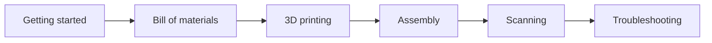

# NeoBox

**English** · [简体中文](README.zh-CN.md) · [日本語](README.ja.md)

> An open-hardware, 3D-printable flash light box for camera scanning 35 mm and 120 film — what it is, why it uses a flash rather than an LED panel, and where to go next.

**Contents:** [What NeoBox is](#what-neobox-is) · [What you get, and what you must already own](#what-you-get-and-what-you-must-already-own) · [Why a flash](#why-a-flash) · [How the light works](#how-the-light-works) · [Documentation](#documentation) · [Quick start](#quick-start) · [Repository layout](#repository-layout) · [Adapting to a different flash](#adapting-to-a-different-flash) · [Status](#status) · [Licence and credits](#licence-and-credits)

   

> [!IMPORTANT]
> This is a prototype release. The geometry is dimensionally verified in the Blender source and the exported STL files are numerically verified, but **the box has never been printed, photographed, measured or evenness-tested.** Read [Status](#status) before you spend money.

## What NeoBox is

NeoBox is a sealed white box that turns one bare speedlight into an evenly glowing surface, so you can photograph film with a digital camera instead of a scanner — a technique called [camera scanning](docs/glossary.md#camera-scanning) (also DSLR scanning).

The flash lies flat on the floor of the box and fires **horizontally** into the white cavity; light reaches the film only after several diffuse bounces and one opal acrylic diffuser.

Because the mixing distance runs along the box instead of up it, the height is set by the *thickness* of the flash rather than its height — which is what makes the enclosure this small.

| Item | Specification |
|---|---|
| Outer size | 208 × 273 × 96 mm (width × depth × height), ≈ 5.4 L |
| Formats | 35 mm and 120, up to 6×9 (6×4.5 / 6×6 / 6×7 / 6×9) |
| Printed parts | 8 for the default build, + 1 optional 6×6 mask = **9 STL files** |
| Bought parts | 1 opal acrylic diffuser, 3 M6 × 35 studs, 6 nuts, 3 heat-set inserts, EVA foam, 2 grommets, 1 USB LED strip |
| Enclosure | One-piece printed main body, a top cover that drops over it, and a plug-in access panel in the front wall |
| Diffusion | Single opal acrylic diffuser, 110 × 130 × 2 mm, ≈ 4.3 mm below the film |
| Film stage | 200 × 230 mm plate, 100 × 120 mm aperture, three-point levelling on studs and nuts |
| Film holders | Sliding-channel film holders for 135 and 120, closed by Ø6 × 2 magnets |
| Film plane | ≈ 120.3 mm above whatever the box stands on — identical for both formats |
| Light source | Any manual speedlight; reference build is a NEEWER TT560 with a ZENIKO T1 trigger set |
| Assembly | ≈ 15 minutes. No structural glue, and no screws hold the enclosure together |
| Build cost | CNY 250–420 / JPY 5,500–9,000 — excludes the flash and the whole camera side |
| Licence | MIT |

## What you get, and what you must already own

NeoBox is one half of a scanning rig. It replaces the light table; it does not replace the camera above it.

| This repository gives you | You must already own or buy |
|---|---|
| 9 STL files — 8 for the default build plus an optional 6×6 mask | A camera body with manual exposure and raw capture (mirrorless or DSLR) |
| The Blender source `cad/neobox.blend`, the authoritative geometry | A macro-capable lens — one 1:1 macro lens covers every format in this project |
| A DXF for the optional aluminium film stage upgrade | A [copy stand](docs/glossary.md#copy-stand), or a tripod with a horizontal or reversible column, that holds the camera squarely above the box |
| Drawings, in English, 简体中文 and 日本語 | The flash itself, plus a trigger set — the transmitter goes on the camera's hot shoe |
| Ten documents covering shopping, printing, building and scanning | A remote release, and software that does [flat-field correction](docs/glossary.md#flat-field-correction) and negative [inversion](docs/glossary.md#inversion) |
| A ready-to-send print-shop bundle and a geometry verification script | The tools and consumables in [Tools and consumables](docs/bom.md#tools-and-consumables) — a soldering iron for the [heat-set inserts](docs/glossary.md#heat-set-insert) is the one that catches people out |

> [!IMPORTANT]
> The **CNY 250–420 / JPY 5,500–9,000** build cost covers the printed and bought parts only. It excludes the flash, the trigger, the camera, the lens, the stand, the release and the software. If you own none of those, budget for them first — [Getting started](docs/getting-started.md#what-you-must-already-own) itemises the whole list.

## Why a flash

**The flash pulse *is* the exposure.** Inside a closed box ambient light contributes nothing, so the frame is defined entirely by a pulse lasting 1/1,000–1/20,000 s at working power. The camera's shutter only has to be open while it happens.

**That makes vibration irrelevant.** The pulse behaves as an *effective shutter* one to three orders of magnitude shorter than the 1/15–1/60 s of real shutter time a continuous LED panel needs at ISO 100 and f/8. Copy-stand flex, shutter shock and footsteps on a wooden floor stop mattering, because nothing moves measurably within the pulse. This is the project's central claim.

**Three smaller reasons follow.** You get f/8 at [base ISO](docs/glossary.md#base-iso) with power in reserve; every frame of a roll receives identical light, so one inversion profile fits the whole roll; and a xenon tube emits a genuinely continuous daylight spectrum at about 5600 K.

**An LED panel was considered and declined.** It would make the box shorter — about 100 mm tall and roughly 4 L, because a panel is already a surface emitter — but it loses the effective-shutter argument above. The access panel is deliberately sized so a panel could be retrofitted later without moving the film plane or the camera height. The reasoning is in [Design](docs/design.md#8-flash-operation) and the [FAQ](docs/getting-started.md#faq).

## How the light works


1. **The flash fires sideways, never at the film.** It lies flat on the floor with its head turned 90°, aimed at the far wall. Do not fit its wide-angle diffuser panel; set the zoom to 35–50 mm.
2. **The white cavity does the mixing.** Bare white filament walls randomise direction over several diffuse bounces, the way an [integrating cavity](docs/glossary.md#integrating-cavity) does. There is no reflector plate and no internal adjustment hardware.
3. **One opal acrylic diffuser does the smoothing.** A 110 × 130 × 2 mm diffuser rests on the film stage over the 100 × 120 mm aperture, about 4.3 mm below the film, held flat by the weight of the film holder alone.
4. **Everything above the diffuser is black,** so stray light is absorbed instead of veiling the image. The outside of the box is sprayed matte black; the inside is left bare white and must never be painted.
5. **Nothing touches the image area.** The film strip sits in a 0.4 mm channel supported only along its non-image edges, with 0.4 mm of clearance below and about 0.25 mm above — no scratching, and no [Newton rings](docs/glossary.md#newton-rings). Frames are advanced by sliding the film sideways, so the holder is never opened mid-roll.

<details>
<summary>Why the flash lies down instead of standing up</summary>

In a conventional light box the speedlight stands upright and fires up through a stack of diffusers, so the enclosure must be tall enough for the flash head *plus* a long vertical mixing distance. An early NeoBox draft in that layout came to roughly 32 L.

Turning the flash on its side moves the mixing distance into the length of the box, which the flash body already occupies. Height then collapses to `flash thickness + 41 mm`, giving 96 mm and about 5.4 L. Fully diffuse illumination brings a side benefit known from darkroom enlargers, too: fine scratches and grain render softer than under directional light.

</details>

## Documentation

Read in this order. Everything below the line is reference material you can reach from anywhere.



| Document | Read this if… |
|---|---|
| [Getting started](docs/getting-started.md#getting-started) | You are new to this and want to know whether the project suits you, what it really costs, and how long it takes end to end. |
| [Bill of materials](docs/bom.md#bill-of-materials-and-sourcing) | You are about to buy. Parts, tools and consumables, sourcing in China, Japan and elsewhere, and copy-paste vendor scripts. |
| [3D printing](docs/printing.md#printing) | You are about to print, or to brief a print service. One settings block, a card per part, bed-size limits, acceptance checks. |
| [Assembly](docs/assembly.md#assembly) | The parts have arrived. Tools, safety, a checkpoint at every step, levelling written out in full, and calibration. |
| [Scanning](docs/scanning.md#scanning) | The box is built and you want negatives. Camera, lens, magnification, parallelism, focus, exposure, loading film, inversion. |
| [Troubleshooting](docs/troubleshooting.md#troubleshooting) | Something is wrong. Symptom, likely cause and fix, across printing, assembly, light and capture. |
| [Glossary](docs/glossary.md#glossary) | A word in these documents means nothing to you. One line per term, plus why it matters here. |
| [Design](docs/design.md#design) | You want the engineering: the dimension chain, the optical decisions, and how to work with the Blender source. |
| [Design log](docs/design-log.md#design-log) | You want to know why it is shaped like this, and which twenty alternatives were tried and rejected. |
| [Contributing](CONTRIBUTING.md#contributing-to-neobox) | You want to send a patch. Which files are generated, the export and verify gate, and the three-language rule. |

## Quick start

- [ ] **1. Check that it suits you** — bed size, what you must already own, and the honest timeline. → [Getting started](docs/getting-started.md#getting-started)
- [ ] **2. Buy** — one opal acrylic diffuser cut to 110 × 130 × 2 mm, three M6 × 35 studs, six M6 nuts, three M6 heat-set inserts, magnets, foam, grommets, an LED strip, and the tools. → [Bill of materials](docs/bom.md#tools-and-consumables)
- [ ] **3. Print** — 9 STL files in two colours, 0.2 mm layers on every part. The white filament must be **matte**: silk or glossy white reproduces the flash head as a hot spot. → [3D printing](docs/printing.md#printing)
- [ ] **4. Assemble, level and calibrate** — about 15 minutes of building, then level the film stage on its three nuts and photograph the bare lit surface to check evenness. → [Assembly](docs/assembly.md#assembly)
- [ ] **5. Scan** — set the camera parallel to the film plane, focus on the grain, meter, and shoot a roll. → [Scanning](docs/scanning.md#scanning)

> [!WARNING]
> **[Bed size](docs/glossary.md#bed-size) is a go/no-go.** The largest part is the top cover at 214.6 × 279.6 mm, and the main body is 208 × 273 mm — so the build needs a build plate of at least 280 × 300 mm. On a 220 × 220 or 256 × 256 mm printer (Bambu Lab X1C or P1S, Prusa MK4) those two parts **cannot** be printed: outsource them, and print the other seven at home. Everything except the main body and the top cover fits a 220 × 220 mm bed, with one caveat: The printed film stage is 230 × 200 mm, so on a 220 × 220 mm plate measure your usable area before committing.

## Repository layout

| Path | Contents | Kind |
|---|---|---|
| [`cad/neobox.blend`](cad/neobox.blend) | Blender source — the authoritative geometry for every part | Source |
| [`cad/film-stage-aluminium-3mm.dxf`](cad/film-stage-aluminium-3mm.dxf) | Optional aluminium film stage, 3 mm 5052, black anodised | Source |
| [`cad/legacy-plywood/`](cad/legacy-plywood/) | Two DXFs left from the abandoned plywood route. Not a complete build; kept for the record | Historical |
| [`stl/white-pla/`](stl/white-pla/) | `main-body.stl`, `top-cover.stl`, `access-panel.stl` | Generated |
| [`stl/black-pla/`](stl/black-pla/) | Four film holder parts, `film-stage-printed.stl`, and the optional `mask-6x6.stl` | Generated |
| [`drawings/`](drawings/) | Optical path, cross-section, print orientation, exploded view, capture setup and manufacturing overview, in three languages | Generated |
| [`docs/`](docs/) | The documentation set, each file in English, 简体中文 and 日本語 | Source |
| [`taobao-order/`](taobao-order/) | A ready-to-send bundle for a Chinese print service: the STL files sorted into three folders, plus a Chinese ordering script | Generated |
| [`tools/verify_stl.py`](tools/verify_stl.py) | The geometry gate — checks watertightness, the 0.2 mm z-grid and every bounding box | Source |

## Adapting to a different flash

The reference build is a NEEWER TT560 (190 × 75 × 55 mm, GN38) with a ZENIKO T1 receiver (39 × 38 × 29.5 mm). Only two things matter when choosing a substitute: **manual power control** and a head that **turns 90°**. TTL and HSS are useless inside a closed box — do not pay for them.

To re-derive the enclosure, measure your flash **lying flat with its head already turned 90°**:

```
height = flash thickness + 41        (4 floor + 33 cavity headroom + 4 top cover)
depth  = flash length + receiver length + 53
width  = 208                         (fixed: 202 interior + 2 × 3 walls)
```

The width is set by the aperture and the white margin around it, not by the flash, so it never changes. Everything above the top cover — film stage, diffuser, film holders — is independent of the flash. The full chain, including what the constants 41 and 53 are made of, is in [Design](docs/design.md#2-dimension-chain).

> [!WARNING]
> **The published STL files fit the TT560 only.** The formulas give you the new numbers; they do not resize the files. A different flash means editing `cad/neobox.blend` and re-exporting. A drop-in substitute must rotate its head 90°, offer manual power, and measure no more than 190 mm long and 55 mm thick lying flat — otherwise the enclosure has to be re-derived.

> [!TIP]
> Never fix the outer height first and back-calculate the layers. Sum the layers, then read off the height. Doing it the other way round made the first draft physically unbuildable — it is entry 1 of the [design log](docs/design-log.md#design-log).

## Status

Prototype release, v6 geometry.

- **Verified:** all nine STL files are watertight single solids with zero non-manifold edges, every horizontal face sits on the 0.2 mm layer grid in its print orientation, and every bounding box matches the published dimensions. Run `tools/verify_stl.py` to reproduce this.
- **Not verified:** the design has **never been printed, photographed, measured or evenness-tested.** No physical box exists.
- The evenness figure quoted throughout — about ±0.1 [EV](docs/glossary.md#ev) corner to corner after flat-field correction — is a **design target**, not a measurement.
- The single-diffuser decision is informed by the author's existing light-pad workflow, not by testing this box.
- The flash body carries a white paper patch on its top face from the start — it is a build step, not an open question. Expect the first calibration pass to decide whether a white card is also needed at the far wall and, as a last resort, whether an attenuating dot is needed at the centre of the diffuser. [Troubleshooting](docs/troubleshooting.md#troubleshooting) covers both.

If you build one, the project would like to hear what came out tight, loose or uneven.

## Licence and credits

Designed by [Neo Analog Lab Inc. (ネオアナログラボ株式会社)](https://github.com/Neoanaloglab). Released under the [MIT License](LICENSE) — build it, sell it, modify it, no permission needed.

---

[Documentation index](#documentation) · [Getting started](docs/getting-started.md#getting-started) →
