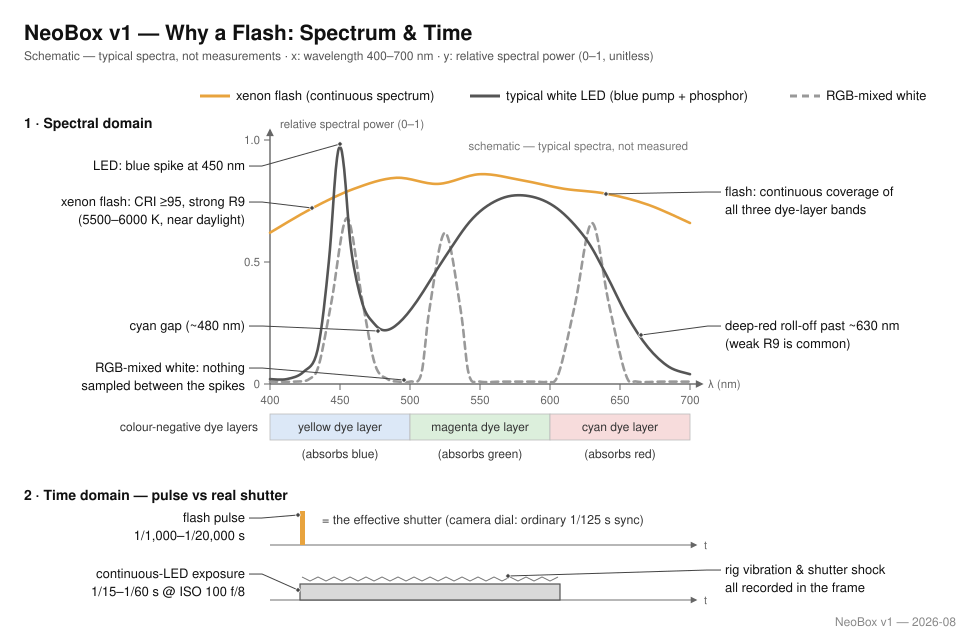

# NeoBox

**English** · [简体中文](README.zh-CN.md) · [日本語](README.ja.md)

> An open-hardware, 3D-printable desktop flash light box for camera scanning 135 and 120 film — about 125 × 155 × 83 mm, nine printed parts at roughly 300–350 g, assembled with magnets alone: no screws, no threads, no tools. Any hot-shoe flash lies at the fully open front and fires in; an insert platform keeps the film flat, with a single universal anti-Newton glass as the optional upgrade.

**Contents:** [What NeoBox is](#what-neobox-is) · [What you get, and what you must already own](#what-you-get-and-what-you-must-already-own) · [Why a flash](#why-a-flash) · [How the light works](#how-the-light-works) · [Documentation](#documentation) · [Quick start](#quick-start) · [Repository layout](#repository-layout) · [Adapting to a different flash](#adapting-to-a-different-flash) · [Status](#status) · [Licence and credits](#licence-and-credits)

   

> [!IMPORTANT]
> This is a prototype release. The geometry is dimensionally verified in the Blender source and the exported STL files are numerically verified, but **the box has never been printed, photographed, measured or evenness-tested.** Read [Status](#status) before you spend money.

## What NeoBox is

NeoBox is a white box, fully open at the front, that turns one bare speedlight into an evenly glowing surface, so you can photograph film with a digital camera instead of a scanner — a technique called [camera scanning](docs/glossary.md#camera-scanning) (also DSLR scanning).

The flash lies flat on the desk with its head at the open front and fires **horizontally** into the white cavity; light reaches the film only after several diffuse bounces and one opal acrylic diffuser.

Because the flash stays outside the enclosure, the box only has to contain the mixing cavity and the film platform — which is why nine printed parts, roughly 300–350 g of PLA and a 160 × 160 mm build plate are enough.

| Item | Specification |
|---|---|
| Outer size | ≈ 125 × 155 × 83 mm (footprint 124.8 × 154.8 mm; 87 mm to the top of a seated film holder) |
| Formats | 135 and 120 up to 6×9; 6×6 via a mask insert; 6×4.5 by cropping in post |
| Printed parts | 9 STL files — 2 white, 7 black, including the 6×6 mask insert; ≈ 300–350 g; all support-free |
| Bought parts | 1 opal acrylic diffuser, 32 Ø8 × 2 mm magnets, 4 steel washers; optional: 1 anti-Newton glass, 1 USB LED strip, 1 flocking sheet |
| Enclosure | A one-piece main body with a fully open front, and a cover-stage that drops on over four locating tenons |
| Diffusion | Single opal acrylic diffuser, 68 × 118 × 2 mm, under a 62 × 95 mm light window, 4.6 mm below the film |
| Film flatness | Insert platform: a 4.6 mm element ledge in the holder base carries a printed pressure-window insert, upgradable to one universal 64 × 95 × 2 mm anti-Newton glass |
| Film holders | Sliding-channel holders for 135 and 120, closed by Ø8 × 2 magnets, swapped by lifting one off and setting the other down |
| Film plane | 83.2 mm above the desk — identical for both formats |
| Light source | Any hot-shoe flash with manual power, lying flat at the open front; reference build is a NEEWER TT560 with a ZENIKO T1 trigger set |
| Assembly | No screws, no threads, no tools — magnets and gravity only; levelling is done on the camera side with a small mirror |
| Licence | MIT |

## What you get, and what you must already own

NeoBox is one half of a scanning rig. It replaces the light table; it does not replace the camera above it.

| This repository gives you | You must already own or buy |
|---|---|
| 9 STL files — 2 white, 7 black, every one printing support-free on a flat face | A camera body with manual exposure and raw capture (mirrorless or DSLR) |
| The Blender source `cad/neobox.blend`, the authoritative geometry | A macro-capable lens — one 1:1 macro lens covers every format in this project |
| Drawings, in English, 简体中文 and 日本語 | A [copy stand](docs/glossary.md#copy-stand), or a tripod with a horizontal or reversible column, that holds the camera squarely above the box |
| Ten documents covering shopping, printing, building and scanning | The flash itself, plus a trigger set — the transmitter goes on the camera's hot shoe, and the receiver stays outside the box |
| The committed STL exporter and the geometry verification script | A remote release, and software that does [flat-field correction](docs/glossary.md#flat-field-correction) and negative [inversion](docs/glossary.md#inversion) |
| A ready-to-send print-shop bundle | The consumables in [Tools and consumables](docs/bom.md#tools-and-consumables) — assembly itself needs no screwdriver, wrench or soldering iron |

> [!IMPORTANT]
> The build cost covers the printed and bought parts only. It excludes the flash, the trigger, the camera, the lens, the stand, the release and the software. If you own none of those, budget for them first — [Getting started](docs/getting-started.md#what-you-must-already-own) itemises the whole list.

## Why a flash

**The flash pulse *is* the exposure.** The camera's shutter dial stays at an ordinary sync speed (1/125 s is the recommendation); its only job is to be open when the flash fires. What actually defines the frame is the tube's pulse, which lasts just 1/1,000–1/20,000 s at working power. The front of the box is open, so ambient light can reach the cavity, but the pulse is far brighter than room light. Shoot in a dim room, keep ceiling lights out of the opening, and ambient contributes nothing visible.

**That makes vibration irrelevant.** The pulse behaves as an effective shutter one to three orders of magnitude shorter than the 1/15–1/60 s of real shutter time a continuous LED panel needs at ISO 100 and f/8. Copy-stand flex, shutter shock and footsteps on a wooden floor stop mattering, because nothing moves measurably within the pulse. This is the project's central claim.

The second argument is spectral, and film is pickier here than it looks. A colour negative is three stacked dye layers: yellow, magenta, cyan, recording blue, green and red respectively, with the cyan record and the orange mask both working at the red end of the spectrum. A scanning light has to deliver honest energy across all three bands at once. Wherever the source is weak or gapped, that dye layer is under-sampled, the channels stop separating cleanly, and the bill arrives after inversion: crossed colour curves and stubborn casts that no single white-balance click can fix.

**A xenon tube is the native light source for silver-halide materials.** Its emission is a genuinely continuous spectrum at roughly 5600 K, daylight-class colour rendering (CRI typically ≥ 95) with strong deep red, the R9 patch LEDs struggle with. A typical white LED is a blue pump plus phosphor: a spike near 450 nm, a dip around 480 nm (the "cyan gap"), a broad phosphor hump, then a roll-off past about 630 nm, landing exactly where the cyan layer and the orange mask need light most. The figure below shows the shape of the problem; the curves are schematic, typical of the two source classes, not measurements.

"White" mixed from three LEDs fares no better, for the opposite reason: the spectrum collapses to three narrow spikes with near-nothing between them, so whole bands of the dye spectra are simply never sampled. A one-shot colour camera makes it worse. Its colour matrix is calibrated for continuous illuminants, three spikes read through the Bayer filters produce cross-talk the calibration never anticipated, and the white point baked into the mixing ratios fights the orange mask. The result is casts that shift from film stock to film stock and refuse to grade out.

The honest optimum lives elsewhere, and it deserves saying plainly: a monochrome camera with sequential RGB. Three exposures under narrow red, green and blue on a sensor with no Bayer mosaic make a densitometer-grade trichromatic scan, full resolution in every channel, separation defined by the source instead of by filter dyes. That is the drum-scanner lineage. It costs a niche camera, three shots per frame and a registration workflow. NeoBox deliberately sits at the pragmatic point of that curve: one flash, one shot, any camera, with a continuous spectrum keeping the single-shot path honest.

Consistency is the third argument, quiet but real. A manual flash at a fixed power fraction repeats shot after shot: every frame of a roll receives the same light, so one inversion profile fits the whole roll. There is no warm-up drift, no thermal colour shift over a session, and no PWM dimming, so nothing bands against an electronic shutter. And all of it arrives at f/8 and [base ISO](docs/glossary.md#base-iso), with power in reserve.

The precedent is commercial. Ricoh's [PENTAX FILM DUPLICATOR](https://ricohimagingstore.com/pentax-film-duplicator.html) is the benchmark camera-scanning rig, from a camera maker with film heritage, and it is specified around exactly this recipe: a digital camera with a macro lens, and an external strobe fired through a diffusion screen. NeoBox is the same optical recipe, with the light box printed at home and a film path of its own.

**An LED panel was considered and declined.** A panel is already a surface emitter, but it takes neither the effective-shutter argument nor the spectral argument above. The reasoning is in [Design](docs/design.md#8-flash-operation) and the [FAQ](docs/getting-started.md#faq).

## How the light works

1. **The flash fires sideways into the cavity, never at the film.** It lies flat on the desk with its light face at the fully open front, aimed into the box. The trigger receiver stays outside with it.
2. **The white cavity does the mixing.** Bare white filament walls and ceiling randomise direction over several diffuse bounces, the way an [integrating cavity](docs/glossary.md#integrating-cavity) does. There is no reflector plate and no internal adjustment hardware.
3. **One opal acrylic diffuser does the smoothing.** A 68 × 118 × 2 mm diffuser sits in a shallow recess in the cover-stage under the 62 × 95 mm light window, 4.6 mm below the film. Dust on it never images, because the diffuser itself is the glowing surface — wipe it occasionally and move on.
4. **Everything above the diffuser is black.** The holders, inserts and mask print in black filament, and an optional flocking sheet on the stage face kills the last of the glare, so stray light is absorbed instead of veiling the image.
5. **Nothing touches the image area.** The film rides on narrow lands along its non-image edges, under a pressure element seated on the 4.6 mm element ledge, leaving a 0.4 mm channel across the full frame. With the printed pressure-window insert any bow stays within 0.28 mm — inside the depth of field at 1:1 and f/8 — and the optional [anti-Newton](docs/glossary.md#newton-rings) glass caps the whole frame continuously without ringing. Frames advance by pulling the strip through, so the holder is never opened mid-roll.

Why the flash stays outside the box

Earlier NeoBox revisions sealed the speedlight inside the enclosure, so the box had to be sized around the largest supported flash, and changing its batteries meant opening the box. v5 leaves the front wall entirely open: the flash lies on the desk and fires in, so the enclosure no longer depends on any flash dimension, any brand works, and the radio receiver sits outside where its signal is unobstructed.

Fully diffuse illumination keeps a side benefit known from darkroom enlargers, too: fine scratches and grain render softer than under directional light.

## Documentation

Read in this order. Everything below the line is reference material you can reach from anywhere.

| Document | Read this if… |
|---|---|
| [Getting started](docs/getting-started.md#getting-started) | You are new to this and want to know whether the project suits you, what it really costs, and how long it takes end to end. |
| [Bill of materials](docs/bom.md#bill-of-materials-and-sourcing) | You are about to buy. Parts, tools and consumables, sourcing in China, Japan and elsewhere, and copy-paste vendor scripts. |
| [3D printing](docs/printing.md#printing) | You are about to print, or to brief a print service. One settings block, a card per part, and acceptance checks. |
| [Assembly](docs/assembly.md#assembly) | The parts have arrived. Pressing in the magnets, the stack order, a checkpoint at every step, and the mirror levelling trick. |
| [Scanning](docs/scanning.md#scanning) | The box is built and you want negatives. Camera, lens, magnification, parallelism, focus, exposure, loading film, inversion. |
| [Troubleshooting](docs/troubleshooting.md#troubleshooting) | Something is wrong. Symptom, likely cause and fix, across printing, assembly, light and capture. |
| [Glossary](docs/glossary.md#glossary) | A word in these documents means nothing to you. One line per term, plus why it matters here. |
| [Design](docs/design.md#design) | You want the engineering: the dimension chain, the optical decisions, and how to work with the Blender source. |
| [Design log](docs/design-log.md#design-log) | You want to know why it is shaped like this, and which alternatives were tried and rejected. |
| [Contributing](CONTRIBUTING.md#contributing-to-neobox) | You want to send a patch. Which files are generated, the export and verify gate, and the three-language rule. |

## Quick start

- [ ] **1. Check that it suits you** — what you must already own, and the honest timeline. → [Getting started](docs/getting-started.md#getting-started)
- [ ] **2. Buy** — one opal acrylic diffuser cut to 68 × 118 × 2 mm, 32 Ø8 × 2 mm N35 magnets, 4 steel washers, and optionally one 64 × 95 × 2 mm anti-Newton glass, a USB LED strip and a flocking sheet. → [Bill of materials](docs/bom.md#tools-and-consumables)
- [ ] **3. Print** — 9 STL files in two colours (2 white, 7 black), plain PLA, no supports; every part prints on a flat face. The white filament must be **matte**: silk or glossy white keeps specular reflections alive in the cavity. → [3D printing](docs/printing.md#printing)
- [ ] **4. Assemble and calibrate** — press in the magnets, stack the parts; no screws, no tools. Then set a small mirror on the stage and centre the lens's own reflection in the viewfinder: the sensor is now parallel to the film plane. → [Assembly](docs/assembly.md#assembly)
- [ ] **5. Scan** — focus on the grain, meter, and shoot a roll. → [Scanning](docs/scanning.md#scanning)

> [!TIP]
> **[Bed size](docs/glossary.md#bed-size) is no longer a constraint.** The largest part is 154.8 mm long, so a 160 × 160 mm build plate is enough — every mainstream printer qualifies, and the large-bed warnings from earlier revisions no longer apply.

## Repository layout

| Path | Contents | Kind |
|---|---|---|
| [`cad/neobox.blend`](cad/neobox.blend) | Blender source — the authoritative geometry for every part | Source |
| [`cad/film-stage-aluminium-3mm.dxf`](cad/film-stage-aluminium-3mm.dxf) | The v4 aluminium film stage — superseded; in v5 the stage is merged into the cover-stage | Historical |
| [`cad/legacy-plywood/`](cad/legacy-plywood/) | Two DXFs left from the abandoned plywood route. Not a complete build; kept for the record | Historical |
| [`stl/white-pla/`](stl/white-pla/) | `main-body.stl`, `cover-stage.stl` | Generated |
| [`stl/black-pla/`](stl/black-pla/) | Four film-holder parts, two pressure-window inserts, and `mask-6x6.stl` | Generated |
| [`drawings/`](drawings/) | Optical path, cross-section, print orientation, exploded view, capture setup and manufacturing overview, in three languages — regenerated from the generators in `tools/drawings/` | Generated |
| [`docs/`](docs/) | The documentation set, each file in English, 简体中文 and 日本語 | Source |
| [`taobao-order/`](taobao-order/) | A bundle for a Chinese print service | Generated |
| [`tools/export_stl.py`](tools/export_stl.py) | The committed exporter — regenerates the nine STL files from `cad/neobox.blend` | Source |
| [`tools/drawings/`](tools/drawings/) | The drawing generators — regenerate the 18 SVG files under `drawings/` | Source |
| [`tools/verify_stl.py`](tools/verify_stl.py) | The geometry gate — checks watertightness, the 0.2 mm z-grid and every bounding box | Source |

## Adapting to a different flash

There is nothing to adapt. The reference build is a NEEWER TT560 with a ZENIKO T1 trigger set, but no dimension in the geometry depends on either: the flash lies flat on the desk with its head at the fully open front, and the receiver stays outside the box, where its radio signal is unobstructed and its batteries can be changed without touching anything.

Choosing a substitute takes one criterion: **manual power control**. TTL and HSS are useless here — do not pay for them. There is no re-derivation and no CAD edit: set the flash down, aim its head into the opening, re-meter, shoot. The dimension chain that actually sets the enclosure — window, cavity, film plane — is in [Design § 2](docs/design.md#2-dimension-chain).

> [!TIP]
> Never fix the outer height first and back-calculate the layers. Sum the layers, then read off the height. Doing it the other way round made the first draft physically unbuildable — it is entry 1 of the [design log](docs/design-log.md#design-log).

## Status

Prototype release, v5 geometry.

- **Verified:** all nine STL files are watertight single solids with zero non-manifold edges, every horizontal face sits on the 0.2 mm layer grid in its print orientation, and every bounding box matches the published dimensions. Run `tools/verify_stl.py` to reproduce this.
- **Not verified:** the design has **never been printed, photographed, measured or evenness-tested.** No physical box exists.
- Every evenness figure quoted in the documents is a **design target**, not a measurement.
- The single-diffuser decision is informed by the author's existing light-pad workflow, not by testing this box.
- The film-flatness figures — the 0.4 mm channel and the ≤ 0.28 mm bow under the printed insert — come from the CAD stack and tolerance analysis, not from measuring real film in a real holder.

If you build one, the project would like to hear what came out tight, loose or uneven.

## Licence and credits

Designed by [Neo Analog Lab Inc. (ネオアナログラボ株式会社)](https://github.com/Neoanaloglab). Released under the [MIT License](LICENSE) — build it, sell it, modify it, no permission needed.

---

[Documentation index](#documentation) · [Getting started](docs/getting-started.md#getting-started) →
