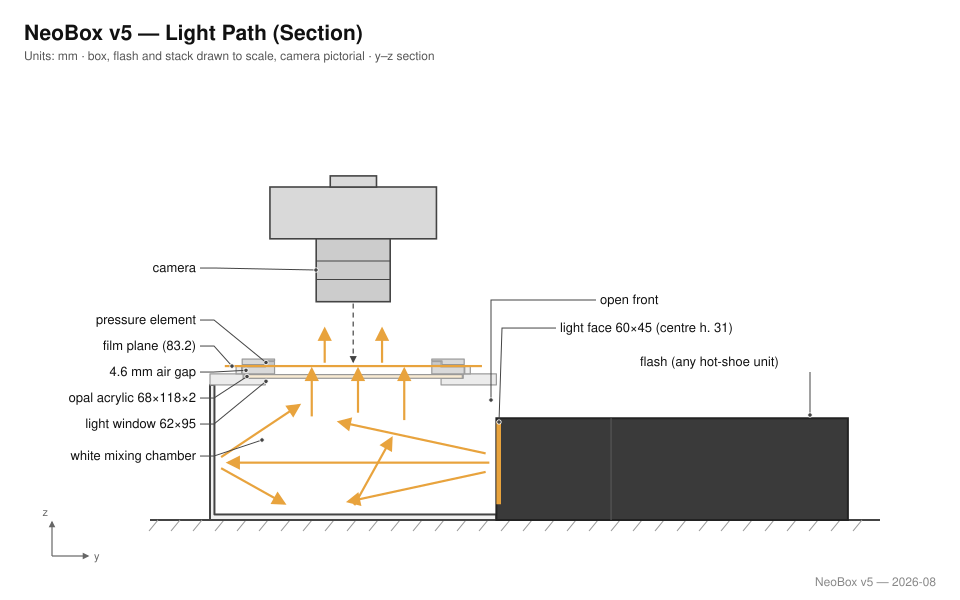

# NeoBox

**English** · [简体中文](README.zh-CN.md) · [日本語](README.ja.md)

A compact, 3D-printable flash light source for camera scanning (DSLR scanning) of 35 mm and 120 film, up to 6×9.

A bare speedlight lies flat on the floor of the box and fires **horizontally** into an all-white cavity. The light never travels straight up — it reaches the film only after several diffuse bounces off the white walls, then passes through a single opal acrylic sheet directly beneath the film holder. Because the mixing distance runs horizontally instead of vertically, the height of the box is set by the *thickness* of the flash rather than its height, which is what makes the enclosure this small.

```
208 × 273 × 96 mm   ·   ≈ 5.4 L   ·   8 printed parts + 1 acrylic sheet + 3 studs
```

| | |
|---|---|
| **Formats** | 35 mm, 120 (6×4.5 / 6×6 / 6×7 / 6×9) |
| **Light source** | Any manual speedlight (reference build: NEEWER TT560 + ZENIKO T1 trigger) |
| **Enclosure** | One-piece printed main body + skirted lid + plug-in access panel |
| **Diffusion** | Single opal acrylic sheet, 110 × 130 × 2 mm |
| **Film stage** | 3-point levelling, 200 × 230 mm, 100 × 120 mm aperture |
| **Film holders** | Sliding-channel sandwich holders for 135 and 120, magnet-closed |
| **Assembly time** | ~15 minutes, no glued structural joints |
| **License** | MIT |

---

## Why a flash, and how the light works

**The flash takes the picture — the shutter just lets it happen.** Inside the closed box, ambient light contributes nothing, so the exposure is defined entirely by the flash pulse: 1/1,000–1/20,000 s at working power. Copy-stand vibration, shutter shock and floor rumble all become irrelevant, because nothing moves measurably within the pulse. Put differently, the pulse is an *effective shutter* of 1/1,000 s or faster — one to three orders of magnitude shorter than the 1/15–1/60 s of real shutter time a continuous LED panel would demand at ISO 100 and f/8. That is the core reason for a speedlight over an LED panel — and it also buys base-ISO, f/8 exposures with power to spare, identical output on every frame of a roll (one inversion profile fits all), from a xenon tube whose light is genuinely continuous daylight spectrum at ≈ 5600 K. Why the LED option was declined anyway is recorded in the [design log](docs/design-log.md#things-deliberately-not-done).



The light is never aimed at the film. The flash fires horizontally at the far wall (1); the all-white cavity randomizes direction over several diffuse bounces, the way an integrating sphere does (2); a single opal sheet 4 mm under the film turns that into one evenly glowing surface (3). Everything above the diffuser is black, so stray light is absorbed instead of veiling the image (4), and the camera photographs the film against that uniform glow (5). Fully diffuse illumination also has a side benefit known from darkroom enlargers: fine scratches and grain render softer than under directional light.

## Why it is shaped like this

Three constraints drive the whole design.

**The flash lies down, so the box is short.** In a conventional light box the speedlight stands upright and fires up through a stack of diffusers, so the enclosure has to be tall enough for the flash head *plus* a long mixing distance — typically 300 mm or more. Here the flash lies flat and fires sideways, and the mixing happens across the length of the box, which the flash body already occupies. Height collapses to `flash thickness + 41 mm`.

**The white cavity is the diffuser.** There is no reflector plate, no baffle, no internal adjustment hardware. White PLA walls do the mixing by multiple diffuse reflection; the acrylic sheet only performs the final smoothing. This was validated against the author's existing workflow, where a single acrylic sheet close to the film already produced satisfactory evenness.

**Nothing touches the image area.** The film sits in a 0.4 mm channel and only its non-image edges are supported; the image area floats with at least 0.2 mm of clearance above and below, which prevents scratching and Newton rings. Frames are advanced by sliding the film sideways through the channel — the holder never has to be opened mid-roll.

## Repository layout

```
stl/white-pla/     main body, top cover, access panel      → print in white
stl/black-pla/     film holders, film stage, small parts   → print in black
cad/               Blender source, aluminium stage DXF, legacy plywood DXFs
drawings/          manufacturing overview (SVG)
docs/              design, printing, assembly, BOM, design log
```

## Quick start

1. **Print** — 8 STLs in two colours (plus an optional 6×6 mask). See [docs/printing.md](docs/printing.md) for settings; the main body needs a bed of at least 280 × 300 mm.
2. **Order** — one 110 × 130 × 2 mm opal acrylic sheet, three M6×35 studs with six nuts, three M6 heat-set inserts. Full list in [docs/bom.md](docs/bom.md).
3. **Assemble** — heat-set three inserts, spray the outside matte black, stack the film stage on its studs, drop the flash in. Step by step in [docs/assembly.md](docs/assembly.md).
4. **Calibrate** — photograph the bare lit surface, flat-field it, and confirm the corners fall within about ±0.1 EV.

## Adapting to a different flash

The reference build uses a NEEWER TT560 (190 × 75 × 55 mm) with a ZENIKO T1 receiver (39 × 38 × 29.5 mm). For any other manual speedlight, re-derive the enclosure from measurements of the flash lying flat:

```
height = flash thickness + 41 mm
depth  = flash length + receiver length + 53 mm
width  = 208 mm   (fixed: 202 mm inner cavity + 2 × 3 mm walls)
```

The width is set by the illuminated window and the white-wall margin around it, not by the flash, so it does not change. Everything above the top cover — stage, diffuser, holders — is independent of the flash entirely. The full dimension chain is in [docs/design.md](docs/design.md).

## Status

Prototype release. The geometry has been dimensionally verified in the Blender source and the mating clearances checked numerically, but the physical build has not been photographed or evenness-tested yet. Expect the first calibration pass to reveal whether the flash body needs a white paper patch on its top face and whether an attenuating dot is required at the centre of the diffuser.

## Credits

Designed by [Neo Analog Lab Inc. (ネオアナログラボ株式会社)](https://github.com/Neoanaloglab). Released under the [MIT License](LICENSE) — build it, sell it, modify it, no permission needed.
