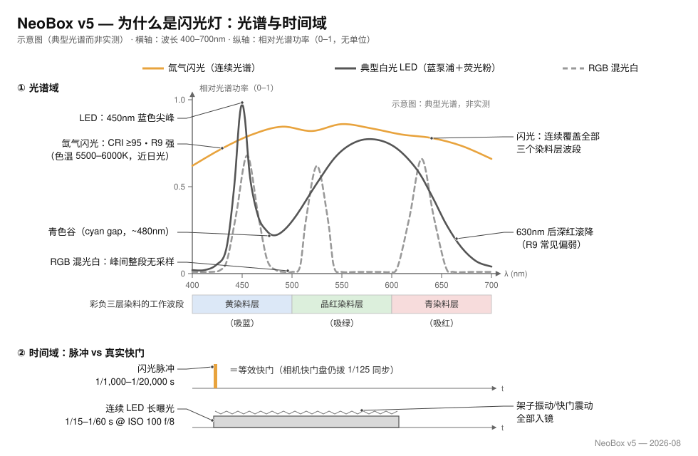
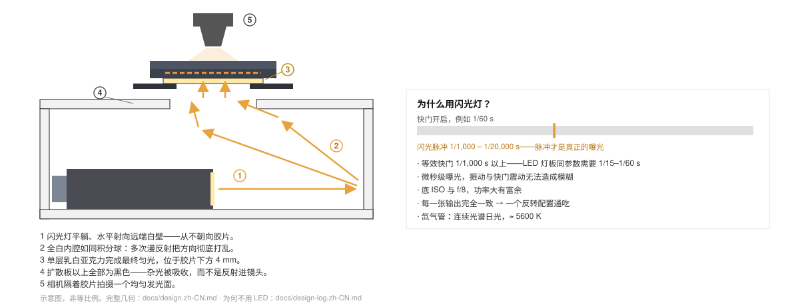

# NeoBox

[English](README.md) · **简体中文** · [日本語](README.ja.md)

> 一台开源硬件、全部零件可 3D 打印的桌面闪光翻拍光箱，用于相机翻拍 135 与 120 胶片：外形约 125 × 155 × 83 mm，9 个打印件约 300–350 g，全程无螺丝、无螺纹、无工具，纯磁吸组装。任意热靴闪光灯平放在敞开前口就能用；压片插片平台负责压平胶片，可选一片通用防牛顿环玻璃升级。

**目录：** [NeoBox 是什么](#neobox-是什么) · [本仓库提供什么，你需要自备什么](#本仓库提供什么你需要自备什么) · [为什么用闪光灯](#为什么用闪光灯) · [光是怎么走的](#光是怎么走的) · [文档](#文档) · [快速开始](#快速开始) · [仓库结构](#仓库结构) · [换用其他闪光灯](#换用其他闪光灯) · [当前状态](#当前状态) · [许可证与致谢](#许可证与致谢)

   

> [!IMPORTANT]
> 这是第一个正式发布版。几何尺寸已在 Blender 源文件中逐项核对，导出的 STL 文件也通过了数值验证，但**这套几何的箱子从未被打印、拍摄、实测，也没做过均匀度测试。** 花钱之前请先读[当前状态](#当前状态)。

## NeoBox 是什么

NeoBox 是一个前面完全敞开的白箱，把一支不加任何附件的机顶闪光灯变成一个均匀发光的面，于是你可以用数码相机代替扫描仪来拍胶片。这种做法叫[相机翻拍](docs/glossary.zh-CN.md#相机翻拍)（camera scanning，也叫 DSLR scanning）。

闪光灯平躺在桌面上、灯头对着敞开前口，**水平**射入白色混光腔；光要先经过若干次漫反射、再穿过一块乳白亚克力扩散板，才能到达胶片。

因为闪光灯留在箱体之外，箱子只需要装下混光腔和胶片平台，所以 9 个打印件、约 300–350 g 的 PLA、一块 160 × 160 mm 的打印床就够了。

| 项目 | 规格 |
|---|---|
| 外形尺寸 | 约 125 × 155 × 83 mm（占地 124.8 × 154.8 mm；放上胶片夹后总高 87 mm） |
| 支持画幅 | 135 与 120，最大到 6×9；6×6 用遮幅插片；6×4.5 靠后期裁切 |
| 打印件 | 9 个 STL 文件（白 2 件、黑 7 件，含 6×6 遮幅插片），约 300–350 g，全部免支撑 |
| 采购件 | 1 块乳白亚克力扩散板、32 颗 Ø8 × 2 mm 磁铁、4 片钢垫片；可选：1 片防牛顿环玻璃、1 张植绒贴 |
| 壳体 | 一体打印的主箱（前面完全敞开），加一件靠 4 个定位榫对位、直接搁上去的顶盖台 |
| 扩散 | 单层乳白亚克力扩散板，68 × 118 × 2 mm，位于 62 × 95 mm 透光窗之下、胶片下方 4.6 mm |
| 压平方式 | 插片平台：夹底座上的 4.6 mm 元件台阶承载打印压片窗插片，可升级为一片通用的 64 × 95 × 2 mm 防牛顿环玻璃 |
| 胶片夹 | 135 与 120 两副滑槽式胶片夹，用 Ø8 × 2 磁铁闭合；换幅面就是掀掉一副、放上另一副 |
| 胶片面 | 高于桌面 83.2 mm，两种画幅完全一致 |
| 光源 | 任意可手动调功率的热靴闪光灯，平躺在敞开前口；参考配置为 NEEWER TT560 配 ZENIKO T1 引闪套装 |
| 装配 | 无螺丝、无螺纹、无工具，只靠磁铁和重力；调平在相机端用一面小镜子完成 |
| 许可证 | MIT |

## 本仓库提供什么，你需要自备什么

NeoBox 只是翻拍装置的一半。它替代的是观片灯板，不是架在它上面的那台相机。

| 本仓库提供 | 你必须自备或另行购买 |
|---|---|
| 9 个 STL 文件（白 2 件、黑 7 件），每一件都平面朝下、免支撑打印 | 一台支持手动曝光和 raw 拍摄的相机（微单或单反皆可） |
| Blender 源文件 `cad/neobox.blend`，权威的几何来源 | 一支有微距能力的镜头；一支 1:1 微距镜头就能覆盖本项目的全部画幅 |
| 英文、简体中文、日文三语图纸 | 一台[翻拍台](docs/glossary.zh-CN.md#翻拍台)（copy stand），或者带横臂／可倒装中轴的三脚架，能把相机端端正正架在箱子正上方 |
| 覆盖采购、打印、装配和翻拍的十份文档 | 闪光灯本身，外加一套引闪器：发射端装在相机热靴上，接收端留在箱外 |
| 随仓库提交的 STL 导出脚本和几何验证脚本 | 一根快门线，以及能做[平场校正](docs/glossary.zh-CN.md#平场校正)（flat-field correction）和负片[反相](docs/glossary.zh-CN.md#反相)（inversion）的软件 |
| 可直接复制[给店家的话术](docs/bom.zh-CN.md#给店家的话术)，逐件下单用 | [物料清单](docs/bom.zh-CN.md#工具与耗材)里"工具与耗材"一节列的东西；装配本身不需要螺丝刀、扳手或电烙铁 |

> [!IMPORTANT]
> 构建成本只包含打印件和采购件，不含闪光灯、引闪器、相机、镜头、支架、快门线和软件。如果这些你一样都没有，请先给它们留预算；[从这里开始](docs/getting-started.zh-CN.md#你需要自备的器材)把整份清单逐项列了出来。

## 为什么用闪光灯

**曝光是那一记闪光脉冲完成的。** 相机快门盘上拨的仍是普通的同步速度（推荐 1/125 秒），它只负责在闪光发生的瞬间开着。真正定义画面的是闪光管的那记脉冲：在工作功率下只持续 1/1,000–1/20,000 秒。箱子前面是敞开的，环境光当然进得来，但脉冲远比室内光亮。在昏暗的房间里拍摄、别让顶灯直射箱口，环境光的贡献就小到看不见。

**于是振动不再重要。** 这记脉冲相当于一道等效快门，比连续光 LED 灯板在 ISO 100、f/8 下所需的 1/15–1/60 秒真实快门短一到三个数量级。翻拍台的挠曲、快门震动、木地板上的脚步声全都失效，因为在脉冲持续的这点时间里，没有任何东西来得及移动。这是本项目最核心的论点。

第二个论点在光谱上，而胶片在这里比看上去挑剔。彩色负片是三层叠置的染料：黄、品红、青，分别记录蓝、绿、红，其中青色层和橙色罩色掩膜都工作在光谱的红端。扫描光源必须同时在三个波段给足能量。光源在哪里有缺口，哪一层染料就被欠采样，三个通道就分不干净，这笔账会在反相之后送到：颜色曲线交叉、顽固的偏色，一次白平衡救不回来。

**氙气闪光管是卤化银材料的"原生"光源。** 它发出真正连续的光谱，色温约 5600 K，显色达到日光级（CRI 典型 ≥ 95），深红充足，而深红正是 LED 普遍偏弱的 R9 色块。典型白光 LED 是蓝色泵浦加荧光粉：450 nm 附近一根尖峰，480 nm 上下一个凹谷（"青色谷"），荧光粉的宽包过后从约 630 nm 起滚降，恰好砸在青色层和橙色掩膜最需要光的地方。下图画出了问题的形状；曲线为两类光源的典型示意，非实测。

用三色 LED 合成的"白光"也不行，原因正好相反：光谱只剩三根窄尖峰，峰与峰之间几乎空无一物，染料光谱里成段的波段从未被采样。单张拍摄的彩色相机还会让事情更糟。它的颜色矩阵按连续光源标定，三根尖峰穿过拜耳滤色片会产生标定从未预期的通道串扰，混光配比里焊死的白点又和橙色掩膜相冲。结果是随片基而变、怎么调都调不干净的偏色。

要说理论上限，得坦率承认在别处：黑白相机加 RGB 分次曝光。在没有拜耳阵列的传感器上用窄带红、绿、蓝各拍一次再合成，就是密度计级的三色分离扫描，每个通道全分辨率，通道分离由光源而不是滤色片染料定义。鼓式扫描仪走的就是这条路。代价是小众的黑白机身、每格三次曝光和一套对齐流程。NeoBox 刻意选在这条曲线的务实点位：一闪、一张、任何相机，再靠连续光谱让单张路线保持诚实。

一致性是第三个论点，安静但重要。手动闪光在固定功率档位下逐张高度可重复，整卷每一张接受的光完全相同，一套反相配置通吃全卷。没有预热漂移，没有热致色移，也没有 PWM 调光，电子快门下不会出现条带。而这一切是在 f/8、[基准 ISO](docs/glossary.zh-CN.md#基准-iso)（base ISO）下拿到的，功率还有富余。

这个选择有商业先例。理光的 [PENTAX FILM DUPLICATOR](https://ricohimagingstore.com/pentax-film-duplicator.html) 是翻拍领域的标杆设备，出自胶片血统的相机厂，官方配置就是这一套配方：数码相机加微距镜头，外接闪光灯隔着扩散屏打光。NeoBox 用同一套光学配方，把光箱换成在家能打印的东西，再配上自己的走片系统。

**LED 灯板方案考虑过，被否决了。** 灯板本身就是一个现成的发光面，但等效快门和光谱这两条论据它一条都拿不到。完整推理见[设计](docs/design.zh-CN.md#8-闪光灯用法)和[常见问题](docs/getting-started.zh-CN.md#常见问题)。

## 光是怎么走的

1. **闪光灯朝腔内打，绝不对着胶片。** 它平躺在桌面上，发光面贴着完全敞开的前口，向箱内发光。引闪接收端跟它一起留在箱外。
2. **混光交给白色混光腔。** 裸露的白色耗材壁面和顶面经数次漫反射把光的方向彻底打乱，这正是[混光腔](docs/glossary.zh-CN.md#混光腔)（integrating cavity）的工作方式。箱内没有反射板，也没有任何可调硬件。
3. **平滑交给一块乳白亚克力扩散板。** 一块 68 × 118 × 2 mm 的扩散板嵌在顶盖台的浅槽里、位于 62 × 95 mm 透光窗之下、胶片下方 4.6 mm。它上面的灰尘不会成像（扩散板本身就是那个发光面），偶尔擦一擦就行。
4. **扩散板以上的一切都是黑的。** 胶片夹、插片和遮幅都用黑色耗材打印，可选的植绒贴再压掉台面最后一点反光，杂光被吸收，而不是漫进画面变成灰雾。
5. **没有任何东西接触影像区。** 胶片只有非影像区的片边骑在窄承台上，上方是坐在 4.6 mm 元件台阶上的压片元件，整个画幅上留出 0.4 mm 的通道。用打印压片窗插片时，起伏不超过 0.28 mm，在 1:1、f/8 的景深之内；可选的[防牛顿环](docs/glossary.zh-CN.md#牛顿环)玻璃则给全画幅一个连续的封顶，而且不起牛顿环。过片就是把片条直接抽过去，整卷拍完都不用开夹。

为什么闪光灯留在箱外

NeoBox 之前的版本把闪光灯封在箱体里，箱子必须围着所支持的最大号闪光灯来定尺寸，换电池也得开箱。v1 把前壁整个去掉：闪光灯躺在桌面上向箱内发光，壳体从此不依赖任何闪光灯尺寸，任何品牌都能用，无线接收端也留在信号最通畅的箱外。

全漫射照明还保留了一个暗房放大机时代就已知的附带好处：细划痕和颗粒比在定向光下柔和。

## 文档

按这个顺序读。表格下半部分是参考资料，随时都可以回来查。

| 文档 | 什么时候读它 |
|---|---|
| [从这里开始](docs/getting-started.zh-CN.md#从这里开始) | 你是新手，想先弄清这个项目适不适合自己、真实要花多少钱、从头到尾要多久。 |
| [物料清单](docs/bom.zh-CN.md#物料清单与采购) | 你准备下单了。零件、工具与耗材，中国／日本／其他地区的采购渠道，以及可直接复制的下单话术。 |
| [3D 打印](docs/printing.zh-CN.md#3d-打印) | 你准备开印，或者要向打印服务商交代需求。一套参数、每个零件一张卡片、验收检查。 |
| [装配](docs/assembly.zh-CN.md#装配) | 零件到货了。压入磁铁、堆叠顺序、每一步的检查点，以及镜面调平法。 |
| [翻拍扫描](docs/scanning.zh-CN.md#翻拍扫描) | 箱子建好了，你想要底片文件。相机、镜头、放大倍率（magnification）、平行度、对焦、曝光、装片、反相。 |
| [故障排查](docs/troubleshooting.zh-CN.md#故障排查) | 出问题了。现象、可能原因和处理办法，覆盖打印、装配、光线和拍摄四类。 |
| [术语表](docs/glossary.zh-CN.md#术语表) | 文档里的某个词你完全看不懂。每个词一行解释，外加它在这个项目里为什么重要。 |
| [设计](docs/design.zh-CN.md#设计) | 你想看工程细节：尺寸链、光学决策，以及怎么动 Blender 源文件。 |
| [设计日志](docs/design-log.zh-CN.md#设计日志) | 你想知道它为什么长成这样，以及哪些方案被试过又被否掉。 |
| [贡献指南（英文）](CONTRIBUTING.md#contributing-to-neobox) | 你想提交补丁。哪些文件是生成物、导出与验证关卡，以及三语同步规则。 |

## 快速开始

- [ ] **1. 先确认它适合你**：必须自备的东西，以及一份不打折扣的时间表。→ [从这里开始](docs/getting-started.zh-CN.md#从这里开始)
- [ ] **2. 采购**：一块裁成 68 × 118 × 2 mm 的乳白亚克力扩散板、32 颗 Ø8 × 2 mm N35 磁铁、4 片钢垫片；可选一片 64 × 95 × 2 mm 防牛顿环玻璃和一张植绒贴。→ [物料清单](docs/bom.zh-CN.md#工具与耗材)
- [ ] **3. 打印**：9 个 STL 文件、两种颜色（白 2 黑 7），普通 PLA，免支撑；每一件都平面朝下打印。白色耗材必须是**哑光**的：丝绸白或亮面白会在腔内留下镜面反光。→ [3D 打印](docs/printing.zh-CN.md#3d-打印)
- [ ] **4. 装配与校准**：压入磁铁、把零件叠上去；无螺丝、无工具。然后在台面上放一面小镜子，在取景器里让镜头自己的倒影居中：传感器就与片平面平行了。→ [装配](docs/assembly.zh-CN.md#装配)
- [ ] **5. 翻拍**：对着颗粒对焦，测光，然后拍完一整卷。→ [翻拍扫描](docs/scanning.zh-CN.md#翻拍扫描)

> [!TIP]
> **[打印床](docs/glossary.zh-CN.md#打印床尺寸)尺寸不再是门槛。** 最大的零件长 154.8 mm，160 × 160 mm 的打印床就够，主流机器全部合格，早期版本关于大打印床的警告已经过时。

## 仓库结构

| 路径 | 内容 | 类型 |
|---|---|---|
| [`cad/neobox.blend`](cad/neobox.blend) | Blender 源文件，所有零件的权威几何 | 源文件 |
| [`cad/film-stage-aluminium-3mm.dxf`](cad/film-stage-aluminium-3mm.dxf) | 原型机的铝制胶片台，已废弃；v1 中它的功能并入顶盖台 | 历史存档 |
| [`cad/legacy-plywood/`](cad/legacy-plywood/) | 已放弃的胶合板路线留下的两个 DXF。不构成完整方案，仅作存档 | 历史存档 |
| [`stl/white-pla/`](stl/white-pla/) | `main-body.stl`、`cover-stage.stl` | 生成物 |
| [`stl/black-pla/`](stl/black-pla/) | 四个胶片夹零件、两个压片窗插片，以及 `mask-6x6.stl` | 生成物 |
| [`drawings/`](drawings/) | 光路、剖面、打印方向、爆炸图、拍摄布置和制造总图，三种语言，由 `tools/drawings/` 里的生成器生成 | 生成物 |
| [`docs/`](docs/) | 文档集，每份都有英文、简体中文和日文三个版本 | 源文件 |
| [`tools/export_stl.py`](tools/export_stl.py) | 随仓库提交的导出脚本，从 `cad/neobox.blend` 重新生成九个 STL 文件 | 源文件 |
| [`tools/drawings/`](tools/drawings/) | 图纸生成器，重新生成 `drawings/` 下的 18 张 SVG | 源文件 |
| [`tools/verify_stl.py`](tools/verify_stl.py) | 几何关卡，检查水密性、0.2 mm 的 z 向栅格，以及每一个包围盒 | 源文件 |

## 换用其他闪光灯

没有什么需要"换用适配"的。参考配置是 NEEWER TT560 配 ZENIKO T1 引闪套装，但几何上没有任何一个尺寸依赖它们：闪光灯平躺在桌面上、灯头对着完全敞开的前口，接收端留在箱外，信号不受遮挡，换电池也不用碰箱子。

挑替代品只有一条标准：**能手动调功率**。TTL 和高速同步（HSS）在这里毫无用处，别为它们多花钱。不需要重新推导，也不需要改 CAD：把灯放好、灯头对准箱口、重新测光、开拍。真正决定壳体的那条尺寸链（透光窗、混光腔、胶片面）见[设计](docs/design.zh-CN.md#2-尺寸链)。

> [!TIP]
> 绝对不要先定死外形高度再倒推各层。要先把各层加起来，再读出高度。反过来做，第一版草案在物理上根本造不出来，这是[设计日志](docs/design-log.zh-CN.md#设计日志)的第 1 条。

## 当前状态

v1 几何，尚未实机验证。

- **已验证：** 九个 STL 文件全部是水密的单一实体，非流形边为零；在各自的打印方向上，每一个水平面都落在 0.2 mm 的层栅格上；每个包围盒都与公布的尺寸一致。运行 `tools/verify_stl.py` 可以复现这些结果。
- **未验证：** 这套几何**从未被打印、拍摄、实测，也没做过均匀度测试**；打印过的只有旧原型机，它和 v1 几乎没有共同零件。
- 文档中引用的所有均匀度数字都是**设计目标**，不是测量值。
- 只用单层扩散板这个决定，依据的是作者既有的观片灯板（light pad）工作方式，不是对这个箱子的测试。
- 压平相关的数字（0.4 mm 通道、打印插片下起伏不超过 0.28 mm）来自 CAD 叠层和公差分析，不是拿真实胶片在真实夹子里量出来的。

如果你真的做了一台，项目方很想知道哪里紧、哪里松、哪里不匀。

## 许可证与致谢

由 [Neo Analog Lab Inc.（ネオアナログラボ株式会社）](https://github.com/Neoanaloglab)设计，以 [MIT 许可证](LICENSE)发布：随便做、随便卖、随便改，无需另行授权。

---

[文档索引](#文档) · [从这里开始](docs/getting-started.zh-CN.md#从这里开始) →
