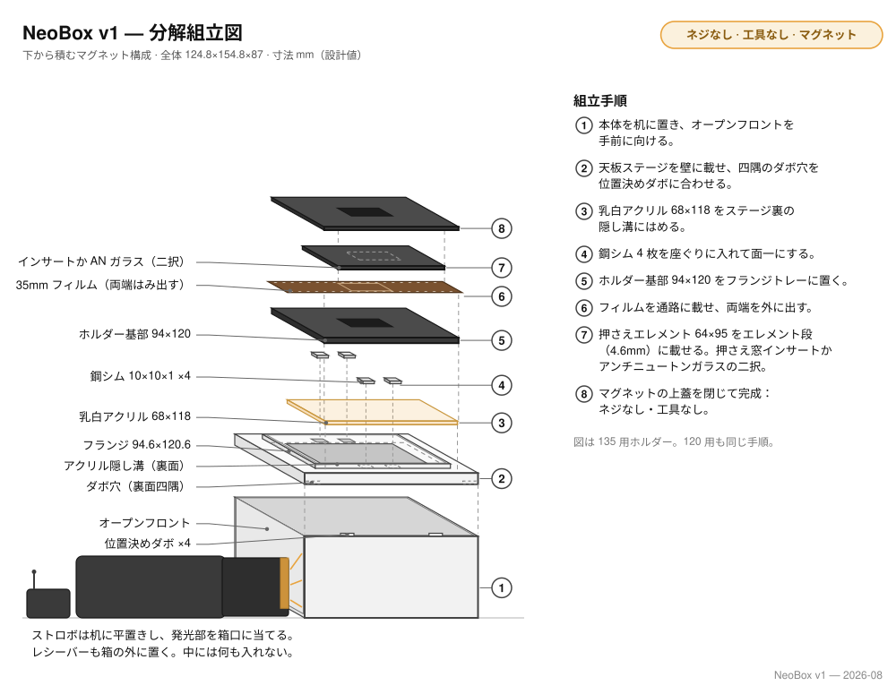
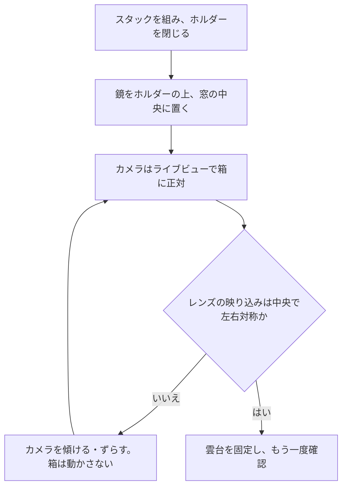

# 組立

[English](assembly.md) · [简体中文](assembly.zh-CN.md) · **日本語**

> プリントパーツ 9 個、マグネット 32 個、鉄ワッシャー 4 枚、乳白アクリル 1 枚を、実際に使える光源に変えるまで。道具はひとつも使いません。極性を合わせて圧入するマグネット、本体から天板ステージ、フィルムホルダーへと重力だけで積み上がるスタック、そしてフィルム面をセンサーと平行にする鏡の方法を扱います。

**目次：** [始める前に](#始める前に) · [工具と安全](#工具と安全) · [何が何を固定するか](#何が何を固定するか) · [組立手順](#組立手順) · [フォーマット切り替えと日常の扱い](#フォーマット切り替えと日常の扱い) · [うまくいかないとき](#うまくいかないとき)

## 始める前に

このビルドには、ねじが 1 本もなく、ねじ山も、接着剤のひと滴も、塗装のひと吹きもありません。だから工具も要りません。どの結合もマグネットか、位置決めの形状か、重力のどれかで、しかもすべての手順が可逆です——載せたのと同じ動きで、そのまま持ち上げて外せます。硬化や乾燥の待ち時間はどこにもないので、組立はひと息で終わります。ゆっくりやる価値があるのはマグネットの圧入だけです。全工程でそこだけが、やり直しの利かない操作だからです。

手をつける前に、パーツを確認してください。パーツごとの完全な一覧は [printing.ja.md](printing.ja.md#組み立てる前に各パーツを確認する) に、購入部品は[部品表](bom.ja.md)にあります。次の 4 つは、通らなければそこで止まるものです。

- [ ] **天板ステージ**が、四隅のダボ穴を壁上端の位置決めダボに合わせて、自重だけで**本体**に落ち、がたつかずに座る。
- [ ] **Ø8 × 2 mm のマグネット**が座ぐり穴に手で入り始め、しっかり押すと底まで届く。しまりばめなので、きついのが正解です。
- [ ] **鉄ワッシャー**がマグネットに吸い付く。ステンレスは吸い付かず、あとになっても何も警告してくれません。
- [ ] **フィルムストリップ**が無理なく**ホルダー底**の溝を通り、**ホルダー蓋**ががたつかずに載る。

## 工具と安全

工具の一覧はありません。工具そのものがないからです。こても、スパナも、ナイフも、接着剤も、塗料も使いません。あると便利なのは 2 つだけ——ホコリを飛ばすブロアーと、最後のステップで使う 30 mm 程度の小さな平面鏡です。マグネットが親指で押し切れないときは、マグネットを机に置いてパーツのほうを上から押し付けてください。この机が、このビルドで「工具」にいちばん近いものです。

> [!WARNING]
> - **Ø8 × 2 mm のマグネット**は小さく強力で、誤飲の危険が本当にあります。子どもとペットから遠ざけてください。2 個が吸着するときに皮膚を挟み、磁気カードのデータを消し、ハードディスクにも悪影響を与えます。
> - 圧入したマグネットは簡単には抜けません。極性の確認は、毎回**押し込む前に**行ってください。
>
> 箱の中に電気製品は何ひとつ入りません。ストロボはオープンフロント（前面開口）の外に寝かせて中へ発光させ、受信機もその横に置いたままです。

## 何が何を固定するか

| インターフェース | 方式 |
|---|---|
| 本体 | 一体プリントの 1 部品——組み立てる箇所はない |
| 天板ステージ → 本体 | 壁の上端に載り、四隅のダボ穴が位置決めダボに掛かる。重力のみ、ねじなし |
| 鉄ワッシャー → 天板ステージ | ステージ面（天板ステージの上面）の座ぐり穴 4 か所に落とし、面一に納まる。接着なし——座ぐりが位置を決め、真上のマグネットが押さえる |
| 乳白アクリル → 天板ステージ | 透過窓に被さる凹部に納まり、上面はステージ面より 0.4 mm 低い。固定なし |
| ホルダー底 → 天板ステージ | トレイフランジが位置を決め、底のマグネットが鉄ワッシャーに吸着して引き付ける |
| 押さえエレメント → ホルダー底 | インサートまたはアンチニュートンガラスがエレメント段（4.6 mm）に載る。意図して緩い |
| ホルダー蓋 → ホルダー底 | マグネット 8 ペア |
| ストロボ → 箱 | 箱には決して入れない。オープンフロントの外の机に寝かせ、発光部を庫内へ向ける |

## 組立手順

### ステップ 1 — マグネットを圧入する

**必要なもの：** ホルダーの 4 部品（ホルダー底 2 枚、ホルダー蓋 2 枚）、Ø8 × 2 mm マグネット 32 個、マーカーペン。

各部品にマグネットを 8 個ずつ圧入します。ホルダー底は**上から**、上面の座ぐり穴へ。ホルダー蓋は**下から**、裏面の座ぐり穴へ。このステップの中身は極性がすべてです——底の各マグネットは、将来向かい合う蓋のマグネットと引き合わなければなりません。しかも押し込む前に合わせておく必要があります。圧入は、このビルドでいちばん「取り消し」から遠い操作だからです。

1. マグネットは 1 本のスタックのまま持ち、端から 1 個ずつ、途中で裏返さずに取ります。こうすればどのマグネットも同じ向きでスタックを離れます。
2. ホルダー底を平らに置き、8 個を同じ向きのまま上面から 1 個ずつ、それぞれ穴の底まで圧入します。たいてい親指で足ります。足りなければマグネットを机に置き、パーツのほうを押し付けてください。
3. ホルダー蓋を裏返して、裏面を上に向けます。各座ぐり穴について、まずばらのマグネットを、向かい合うことになる圧入済みの底マグネットに触れさせます——引き合う向きでぱちんと付きます。露出している面にペンで印を付け、引きはがし、**印の面から先に**蓋の穴へ圧入します。印のない面——引き合う面——が見える状態で仕上がります。
4. もう一方のフォーマットの底と蓋にも同じことをします。

**チェックポイント：** どの蓋も底にぱちんと吸い付き、閉じたホルダーを片端で持っても閉じたまま。蓋のマグネットは蓋の裏面と面一で仕上がります。底のマグネットは板面から 0.4 mm 出っ張りますが、これは設計どおりで、押し込みが足りないのではありません。沈めようとしないでください。

**失敗の形：** 逆向きのマグネットが 1 個あると、その角で蓋が押し開かれます。そして圧入済みのマグネットは、おとなしくは出てきません。手順 3 の「触れさせて印を付ける」確認は 1 個あたり数秒。省くと部品ごと失いかねません。

> [!IMPORTANT]
> このサンドイッチを閉じているのは 8 ペアのマグネットだけで、その後ろにクリップもねじもありません。どの底にも、どの蓋にも 8 個すべてを入れます。v5 に「省略できるマグネット」はありません。

### ステップ 2 — 鉄ワッシャーを座ぐりに落とす

**必要なもの：** 天板ステージ、鉄ワッシャー 4 枚（10 × 10 × 1 mm の角形、または Ø10 × 1 mm の円形）。

1. ステージ面の座ぐり穴 4 か所に、ワッシャーを 1 枚ずつ落とします。

このステップはこれで全部です。接着はしません。座ぐりがワッシャーをステージ面と面一に位置決めし、使用時には真上に来るホルダー底のマグネットが押さえます。

**チェックポイント：** ステージ面を指先でなぞって、どのワッシャーの縁にも段差を感じないこと。予備のマグネットで、どのワッシャーもまっすぐ吊り上げられること。吊り上がらないワッシャーはステンレスです——今ここで交換してください。あとになっても何も教えてくれません。

**失敗の形：** ステンレスのワッシャーは見た目がまったく同じで、音もなく失敗します。ホルダー底が定位置に引き込まれなくなるだけです。ステージ面から出っ張ったワッシャーは、上に載る底を傾けます。

### ステップ 3 — アクリルを凹部に収める

**必要なもの：** 68 × 118 × 2 mm の[乳白](glossary.ja.md#乳白-opal)アクリル、ブロアー。

1. **両面の保護フィルムを剥がします。** アクリル板は両面ともフィルム付きで届きます。
2. 両面をブロアーで払います。
3. トレイ中央、透過窓に被さる凹部へ板を置きます。落とし込むと、上面はステージ面より 0.4 mm 低いところで止まります。

**チェックポイント：** 板の全周がステージ面より低く、凹部の中で少し動かせること。緩いのが正解です——何も固定していませんし、この 0.4 mm の段差のおかげで、上に載るホルダーさえ板には触れません。

**失敗の形：** 面に残った保護フィルムは拡散のしかたを変えますが、乳白の板の上では実によく隠れます。収める前に、四隅で剥がし残しの端を探してください。

> [!NOTE]
> アクリルに載ったホコリはコマには写りません。この板そのものが拡散して光る面であって、レンズが結像する対象ではないからです。手入れはときどきの拭き取りで十分——乾いた布で。アルコール、アンモニア、ガラスクリーナーは使わないでください。3 つともアクリルにクレーズ（微細なひび）を生じさせます。

### ステップ 4 — 天板ステージを本体に載せる

**必要なもの：** 本体、ワッシャーとアクリルを収めた天板ステージ。

1. トレイフランジをつまんで天板ステージを持ち、四隅のダボ穴を壁上端の位置決めダボに合わせ、まっすぐ下ろします。自重で座ります。
2. 浮いたりがたついたりするなら、どこかのダボが穴の横に乗り上げています。まっすぐ持ち上げて、載せ直してください。押さない、ひねらない。

**チェックポイント：** 天板ステージが壁の上端に全周すきまなく平らに座り、がたつかないこと——そして同じくらい軽く、まっすぐ持ち上げて外せること。

**失敗の形：** ダボが穴に入らないのはプリントの問題——どちらかのパーツの最初の数層の[エレファントフット](glossary.ja.md#エレファントフット-elephant-foot)——であって、力で解決するものではありません。[printing.ja.md](printing.ja.md#きつい場合と緩い場合の対処) を参照してください。

### ステップ 5 — ホルダー底をトレイに収める

**必要なもの：** 載せ終えた天板ステージ、使うフォーマットのホルダー底——6×6 を撮るなら 6×6 マスクも。

1. トレイフランジの内側へ底を下ろします。すきまは片側 0.3 mm。気になるほどの遊びもなく収まります。
2. 手を離して落ち着かせます。底のマグネットがステージ面の鉄ワッシャーを見つけ、底を平らに、定位置へ引き込みます。

**チェックポイント：** 底がトレイの床に平らに座ってがたつかず、着地の瞬間にマグネットが受け取る感触があるはずです。持ち上げてもう一度落としてみてください——毎回同じ収まり方をするはずです。

**失敗の形：** 落としても無反応——吸着も、位置決めの感触もない——なら、ステップ 2 のワッシャーがステンレスか、そもそも入っていません。フランジに入らない底は、これもエレファントフットで、力を入れる理由にはなりません。

> [!NOTE]
> 6×6 を撮るときは、先に **6×6 マスク**をトレイに敷き、その上に 120 の底を載せます。ホルダー全体が 1 mm 高く座りますが、それで正常です。6×4.5 の専用マスクはありません。120 の窓のまま撮って、あとでトリミングしてください。

### ステップ 6 — 押さえエレメントを載せ、蓋を閉じる

**必要なもの：** 使うフォーマットの押さえ窓インサート——またはアンチニュートンガラス 64 × 95 × 2 mm（1 枚で両フォーマット兼用）——対応するホルダー蓋、ブロアー。

1. エレメントを外側レールのエレメント段（4.6 mm）に載せます。段はエレメントをフィルムの通り道の 0.4 mm 上に構え、この 0.4 mm が押さえ設計のすべてです。フィルムはエレメントの下をすべって送られ、浮き上がった部分はエレメントの下面に沿って平らにならされます。エレメントは一度収めたら、以後は触りません。
2. ガラスの場合：**つや消し（AN）面を下**、フィルム側へ向けます。つや消し面がフィルムベースの光沢面に接することで、ニュートンリングを防ぎます。収める直前に下面をブロアーで払ってください。焦点面まで 0.2 mm しかなく、そこのホコリは写ります。
3. 蓋を載せます。8 ペアのマグネットが引き込んで閉じます。

**チェックポイント：** 蓋が全周で座り、浮いた角がないこと。そして閉じた蓋の下で、エレメントにかすかな遊びが残っていること——蓋の内側の空間には 0.4 mm の余裕を持たせてあり、浮いているのが正解です。エレメントががっちり挟まっているなら、どこかが出っ張っています。強く押さず、開けて確かめてください。

**失敗の形：** ガラスを光沢面を下にして入れると、フィルムベースとのあいだにニュートンリングを招きます。閉じない角が 1 つあるなら、ステップ 1 で逆向きに入れたマグネットの、遅れて届いた報告です。

### ステップ 7 — カメラ側で平行を出す：鏡の方法

箱には水平調整の機構がありませんが、欠けているのではありません。大事な関係はただひとつ——**フィルム面とセンサーの平行**——で、それを合わせる正しい場所がカメラ側だからです。カメラ側でのひと調整が、プリントパーツの公差まで含めて、連鎖全体を一度に修正します。

**必要なもの：** カメラの下に据えた組み上がりの箱、30 mm 程度の小さな平面鏡。

1. 閉じたホルダーの上、フィルム窓の中央に鏡を平らに置きます。
2. ライブビューを見ます。レンズとカメラが映り込んでいるはずです。
3. **箱ではなくカメラを**傾け、ずらして、レンズの映り込みが画面のちょうど中央に来て左右対称に見えるようにします。
4. 映り込みが中央に来たとき、センサーは鏡と平行で、その鏡はフィルム面に載っています。これで完了です。
5. 雲台を固定して、もう一度確認します——締めると動きます。

**チェックポイント：** 雲台を固定した状態でも映り込みが中央にあること。箱かカメラを動かしたら、そのたびに確認し直してください——数秒で済みます。

なぜカメラ側で、なぜ鏡なのか

水準器は重力に対する水平を測りますが、重力は光路の中にいません。床に対して完璧に水平な面でも、センサーに対しては傾いていられます。鏡が測るのは、まさにその唯一大事な関係で、しかも 2 倍にして見せてくれます。センサーの光軸と鏡面のあいだの角度は、映り込みの位置のずれとして 2 倍で現れるので、「レンズ自身の映り込みを中央に置く」ことは感度の高いゼロ合わせになります。

箱ではなくカメラ側で調整することは、鏡より下にあるすべて——壁上端の平面度、ダボの座り、積み重なったプリント公差——を同じひと動作で吸収することでもあります。箱に何かを噛ませても、直せるのは箱だけです。v5 が箱側の水平調整機構を改良せずに削除したのは、これが理由です。

カメラ側のセットアップ——スタンドは[平行出し](scanning.ja.md#平行出し)、フォーマットごとの高さは[カメラの高さとスタンド](scanning.ja.md#カメラの高さとスタンド)を参照してください。

## フォーマット切り替えと日常の扱い

- **フォーマットの切り替えは、ホルダーの交換です。** ホルダーを丸ごと持ち上げ——マグネットで載っているだけです——もう一方のフォーマットのホルダーを収めます。インサートはそれぞれのホルダーに入れたまま。アンチニュートンガラスを使うなら、1 枚で両フォーマット兼用なので、ガラスだけを相手のエレメント段へ移します。
- **フィルム送り：** ホルダーの外に出ている先端をつまんで、そのまま引きます。末端はトレイフランジの上端——フィルム面より 0.2 mm 低い——に載って支えられて進みます。長いストリップは、反対の手で末端側を支えてください。
- **装填の向き：** ガラスなら反りの凸面を上に、インサートなら凸面を下にします。
- **アクリルの取り出し：** ホルダーを外し、オープンフロントから手を入れて、透過窓越しに板を上へ押し出します。
- **天板ステージは丸ごと持ち上げられます**——トレイフランジをつまんで、まっすぐ上へ。
- **ストロボは常に箱の外：** オープンフロントに寝かせ、発光部を庫内へ向けます。受信機も外に置いたまま——電波はクリアで、電池交換に箱を開ける必要もありません。撮影は薄暗い部屋で行い、天井の照明が開口へ直接差し込まないようにしてください。

> [!IMPORTANT]
> 組み上がった箱は、重力で積んであるだけのスタックです。どの部品も、ほかのどの部品にも固定されていません。傾けないでください。組んだまま運ばないでください。ホルダーと天板ステージを外し、部品ごとに分けて運びます。

## うまくいかないとき

| この段階での症状 | 見に行く先 |
|---|---|
| 天板ステージが浮く・がたつく、ホルダー底がトレイに落ち着かない | [組み立ての問題](troubleshooting.ja.md#組み立て) |
| 暗い染み、片側だけ明るい、全コマに走る輪郭のはっきりした暗い帯 | [光と均一性](troubleshooting.ja.md#光と均一性) |
| フィルムの溝がきつすぎる／ゆるすぎる、パーツが反って出てきた | [printing.ja.md](printing.ja.md#きつい場合と緩い場合の対処) |

---

← [3D プリント](printing.ja.md) · [ドキュメント一覧](../README.ja.md#ドキュメント) · [スキャン](scanning.ja.md) →
