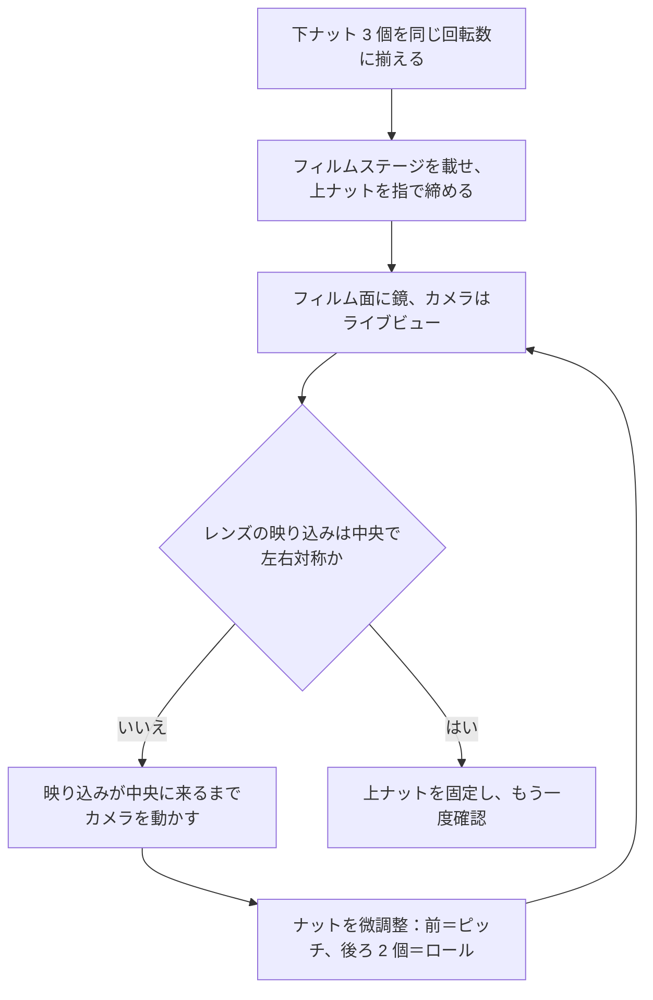

# 組立

[English](assembly.md) · [简体中文](assembly.zh-CN.md) · **日本語**

> プリントしたパーツの山と金物の袋を、実際に光る光源に変えるまで。インサートナット 3 個、塗装、マグネット、フィルムステージと 3 点水平出し、そしてフィルム面をセンサーと平行にする鏡の方法を扱います。

**目次：** [始める前に](#始める前に) · [工具と安全](#工具と安全) · [何が何を固定するか](#何が何を固定するか) · [組立手順](#組立手順) · [フィルムステージの水平出し](#フィルムステージの水平出し) · [キャリブレーション](#キャリブレーション) · [電源](#電源) · [毎セッションの手順](#毎セッションの手順) · [縦置きで使う](#縦置きで使う) · [うまくいかないとき](#うまくいかないとき)

## 始める前に

公称の**約 15 分**という数字は誇張ではありません。ただし機械的な工程の実働時間だけを指していて、待ち時間はひとつも含んでいません。インサートの圧入、外面の塗装、マグネットと鉄ワッシャーの接着には、それぞれ冷却・硬化・乾燥の時間があって短縮できないので、1 回で終わらせるつもりではなく 2 回に分けて計画してください。

筐体はねじで留めておらず、構造用の接着剤もどこにも使いません。ビルド全体で使う接着剤は、マグネット 1 個と鉄ワッシャー 1 枚のそれぞれの下に落とす瞬間接着剤ひと滴だけです。

何かに手をつける前に、パーツを確認してください。パーツごとの完全な一覧は [printing.ja.md](printing.ja.md#組み立てる前に各パーツを確認する) にありますが、この 4 つはビルドをその場で止めてしまうものです。

- [ ] **天板**が自重だけで**本体**に落ち込み、がたつかずに座る。側面のすきまは公称 0.3 mm——ビルド中でいちばん厳しい嵌合です。
- [ ] M6 × 35 の**寸切りボルト**が、**フィルムステージ**の Ø6.5 mm 穴 3 か所を、押し込まずに通り抜ける。これらはタップを立てた穴ではなく[バカ穴 (clearance hole)](glossary.ja.md#バカ穴とタップ穴-clearance-hole-vs-tapped-hole) です。
- [ ] **鉄ワッシャー**がマグネットに吸い付く。ステンレスのワッシャーは吸い付かず、縦置き機能は最後の工程で何も言わずに失敗します。
- [ ] **フィルムストリップ**が無理なく**フィルムホルダー**の溝に入り、**ホルダー蓋**ががたつかずに閉じる。

## 工具と安全

工具と消耗品は、用途と仕様を添えて[部品表](bom.ja.md#工具と消耗品)にすべて載っています。このドキュメントに必要なものだけ挙げると、はんだごて、M6 のスパナ 2 本（またはスパナとプライヤー）、デザインナイフ、瞬間接着剤、弱粘着のマスキングテープ、PLA に使えるつや消し黒のスプレー塗料、ブロアー、そして 30 mm 程度の小さな平面鏡です。

> [!WARNING]
> このビルドには、けがにつながる箇所が 3 つあります。
> - **はんだごては 200–250 °C** で作業し、PLA は軟化するとガスを出します。窓を開けた場所で作業し、こては毎回スタンドに戻し、パーツは冷えてから持ってください。
> - **スプレー塗装**は屋外か、実際に換気の効く場所で。あとでフィルムを扱う部屋では絶対に行わないでください。
> - **Ø6 × 2 mm のマグネット**は小さく強力で、誤飲の危険が本当にあります。子どもとペットから遠ざけてください。マグネット同士が吸着するときに皮膚を挟み込むこともあり、磁気カードのデータを消し、ハードディスクにも悪影響を与えます。
>
> ニッケル水素電池の充電は筐体の外で行ってください。商用電源につながるものは、何ひとつ箱の中に入れません。

## 何が何を固定するか

| インターフェース | 方式 |
|---|---|
| 本体 | 一体プリントの 1 部品——組み立てる箇所はない |
| 天板 → 本体 | 上から載せるだけ。10 mm のスカートが壁に重なり、位置決めと遮光を兼ねる。ねじなし |
| フィルムステージ → 天板 | M6 × 35 寸切りボルト 3 本を[インサートナット](glossary.ja.md#インサートナット-heat-set-insert) (heat-set insert) にねじ込み、ステージを下ナットと上ナットで挟持 |
| 拡散板 → フィルムステージ | 開口の上に載せるだけ。フィルムホルダーの自重で平らに保たれる。固定具なし |
| フィルムホルダー → フィルムステージ | コーナーブロック 4 個が X・Y を決め、ホルダー底のマグネット 4 個が鉄ワッシャーに吸着して押さえる |
| ホルダー蓋 → ホルダー底 | 閉じ用マグネット 4 ペア |
| アクセスパネル → 本体 | プラグに EVA フォームテープを巻いた摩擦嵌合 |

## 組立手順

### ステップ 1 — インサートナット 3 個を熱圧入する

**必要なもの：** 天板、M6 インサートナット 3 個、円錐形またはインサート用のこて先を付けた 200–250 °C のはんだごて。

1. 天板を、**3 本の丸いポストが上を向く向き**で作業台に置きます。大きな平らな面が台に接します。
2. インサートを 1 個、手でポストに仮合わせします。下穴に自然に入り、押し込まなくてもまっすぐ立つはずです。
3. インサートをポストに載せ、こてを真上から当て、こての自重だけで沈むのに任せます。こては垂直に保ってください——インサートはこてが傾いたほうへ付いていきます。
4. フランジがポスト上面と面一になった瞬間に止めます。こてを離し、完全に冷えるまでパーツに触らないでください。

**チェックポイント：** 3 個ともフランジが面一かつ直角で、M6 × 35 寸切りボルトがそれぞれに手でねじ込み始められること。寸切りボルト 3 本を横から見通すと、平行に立っているはずです。

**失敗の形：** 傾いて入ったインサートは寸切りボルトを傾け、下ナットが斜めに座って、水平出しでは取り切れない誤差が残ります。熱を入れすぎるか押し込みすぎればポストが崩れます。どちらも、ビルド中で最大の白いパーツの上では取り返しがつきません。

> [!NOTE]
> インサートの外径と、それに合うポストの下穴径は設計として公開していません。M6 のインサートナットは複数の外径で流通しています。加熱する前に、手持ちのものを必ず仮合わせしてください。冷えた状態で下穴に入らないインサートを、熱してから無理に押し込まないこと——まず仕入れ先の図面でサイズを確認してください。

### ステップ 2 — 外面を塗装する

**必要なもの：** 本体と天板だけ——アクセスパネルは塗装しないので外しておきます。ほかに弱粘着のマスキングテープと、PLA に使えるつや消し黒のスプレー塗料（アクリルまたはエナメル）。

1. 白い[拡散チャンバー](glossary.ja.md#積分キャビティ-integrating-cavity) (integrating cavity) の全体と、100 × 120 mm の開口をマスキングします。内側は**白フィラメントの生地のまま**です——ここは装飾する面ではなく、光源そのものです。
2. すきまがシビアな嵌合部もマスキングします。天板スカートの内側と、そこが重なる壁の上端（公称で片側 0.3 mm）です。塗膜には厚みがあり、この嵌合はそれを丸ごと飲み込みます。
3. **本体の外面**と**天板の上面**を、つや消し黒で薄く重ねて吹きます。塗装するのはこの 2 面だけです。**天板スカートの外側**と**アクセスパネル**は吹きません——白いまま残し、どちらの嵌合もすきまを丸ごと確保します。
4. 缶の指示どおりに乾燥させてから扱ってください。乾き切らない塗料は、触れたものすべてに移ります。

**チェックポイント：** 吹いた 2 面がどこにも光沢なく均一につや消しで、拡散チャンバーは白いまま、そして天板が依然として自重だけで本体に落ち込むこと。

**失敗の形：** 拡散チャンバーへのミストの回り込みは元に戻せず、光学的な役割を担っているパーツそのものを失います——下の CAUTION を参照してください。もう 1 つはスカート嵌合の塗膜です。片側公称 0.3 mm がすきまのすべてで、合わせ面の両方に 1 層ずつ乗ればそれで埋まり、天板は押し込まないと入らなくなります。

**なぜそうするのか：** この箱が密閉されていて換気孔を持たないのは、穴という穴が光漏れだからです。外側の黒は、薄い壁を透けて室内光が入るのを止め、箱が作業空間へ光を返すのを止めます。内側の白は、拡散チャンバーを成立させているものです。

> [!CAUTION]
> 内側は塗装しないでください。研磨も磨きもしないでください。拡散する白いフィラメントの表面こそが、1 回の閃光を均一な面光源に変える光学部品です。

### ステップ 3 — 天板を載せる

**必要なもの：** 本体、塗装済みの天板、必要なら 2 mm の EVA フォームテープ 1 本。

1. 遮光をより厳密にしたい場合のオプション：壁の上端に EVA フォームテープを一周貼ります——およそ 2 × (208 + 273) = 962 mm。天板を載せる前に貼っておく必要があります。
2. 天板を本体に落とし込みます。スカートで位置が決まります。

**チェックポイント：** 天板が最後まで座り、がたつかず、どの角にもすきまが見えないこと。

**失敗の形：** 天板が入らないなら、嵌合が塗膜の厚み、[エレファントフット (elephant foot)](glossary.ja.md#エレファントフット-elephant-foot)——出力物の最初の数層が外へ膨らむ現象——または反りに食われています。刃物を当てる前に [printing.ja.md](printing.ja.md#きつい場合と緩い場合の対処) の対処を読んでください。

### ステップ 4 — フィルムステージを組む

**必要なもの：** M6 × 35 寸切りボルト 3 本、M6 ナット 6 個、フィルムステージ、スパナ 2 本。

1. 寸切りボルト 3 本をインサートナットへ手締めでねじ込み、最後に軽く増し締めします。
2. 各ボルトに**下ナット**を 1 個ずつ、3 本とも同じ回転数まで下ろします。このナットがフィルムステージの高さを決めます。
3. フィルムステージを、Ø6.5 mm のバカ穴で寸切りボルト 3 本に落とし込みます。
4. **上ナット**3 個を指で締めます。まだ固定しないでください——次が水平出しです。

**チェックポイント：** フィルムステージが自重で落ち込んで下ナット 3 個すべてに載り、上面が z = 114 mm、コーナーブロック 4 個が上を向いていること。

**失敗の形：** Ø6.5 mm 穴を通らない寸切りボルトに当たると、つい穴にねじを切りたくなります——そうせずに 6.5 mm で手リーマー加工してください。その前に下の CAUTION を読むこと。もう 1 つは静かな失敗で、下ナット 3 個の回転数が揃っていない場合です。フィルムステージが最初から傾いた状態で始まり、この時点ならただで避けられた誤差を、水平出しで吸収させることになります。

> [!CAUTION]
> フィルムステージの 3 か所の穴には、絶対にタップを立てないでください。ねじを切った板と、ねじの立った寸切りボルトの組み合わせは[差動ねじ (differential screw)](glossary.ja.md#差動ねじ-differential-screw) になります。両方のねじが一緒に進むので、ナットを回しても高さが反応しなくなります。Ø6.5 mm のバカ穴が必須です。寸切りボルトが通らないなら 6.5 mm で手リーマー加工を——ねじは切らないでください。

寸切りボルト 3 本は、意図的に非対称に配置してあります。

| 寸切りボルト | ステージ中心からの位置 (X, Y) | 調整する軸 |
|---|---|---|
| 前 | (45, −100) | ピッチ |
| 後ろ左 | (−70, +65) | ロール |
| 後ろ右 | (+70, +65) | ロール |

前の寸切りボルトが X 方向にずらしてあるのは、フィルムの走行路を空けておくためです——フィルムストリップはフィルムホルダーを端から端まで通り抜けられる必要があります。誤りではないので「修正」しないでください。またこの非対称のため、フィルムステージは 1 方向にしか載りません。

### ステップ 5 — ホルダーのマグネットを取り付ける

**必要なもの：** Ø6 × 2 mm ネオジムマグネット、瞬間接着剤、マーカーペン。

| 役割 | ポケット | ホルダー 1 台あたり | 必要か |
|---|---|---|---|
| 閉じ | ホルダー底の (±45, ±75) に 4 か所、ホルダー蓋にそれと向かい合う 4 か所 | 8 個 | すべてのビルドで推奨 |
| ホルダー底 → フィルムステージ | ホルダー底の (±25, ±75) に 4 か所 | 4 個 | 箱を縦置きする場合のみ |

1. **接着剤を出す前に極性を確認します。** 閉じ用マグネット 4 個をホルダー底のポケットに軽く落とし込み、ホルダー蓋側のマグネットを 1 個ずつ順に近づけます。どのペアも引き合わなければなりません。まだ動かせるうちに、各マグネットの上向きの面にペンで印を付けてください。
2. 接着剤はポケットの中にひと滴——合わせ面ではありません——落として、マグネットを押し込みます。表面と面一で終わるはずです。出っ張っても沈んでもいけません。
3. ホルダー底 → フィルムステージのマグネットも同じ手順で。こちらは極性を問いません。相手はただの鉄ワッシャーで、それ自体には極がないからです。
4. ホルダー底と蓋を合わせる前に、接着剤を完全に硬化させてください。

**チェックポイント：** ホルダー底と蓋がぱちんと閉じ、閉じたホルダーを片端で持っても閉じたままであること。どちらの面からも何も出っ張っていないこと——出っ張ったマグネットはフィルムホルダーを拡散板から浮かせ、フィルム面を傾けます。

**失敗の形：** 1 ペアでも逆向きだと、その角で蓋が押し開かれます。硬化した瞬間接着剤は元に戻せません。接着剤が固まる前にホルダーを閉じると、マグネットが飛び移ってポケットから抜けてきます。

> [!IMPORTANT]
> このサンドイッチを閉じた状態に保っているのは、閉じ用マグネットです。これがないとホルダー蓋は自重だけで載っていることになります——箱を寝かせて使うなら足りますが、縦置きでは足りず、スタンドをぶつけたときにも足りません。閉じ用 16 個（ホルダー 1 台あたり 8 個）は、すべてのビルドに含まれるものとして扱ってください。本当にオプションなのは、ホルダー底 → フィルムステージのマグネット 8 個と鉄ワッシャー 4 枚だけです。

### ステップ 6 — 鉄ワッシャー 4 枚を接着する

箱を縦置きしないのであれば、このステップはまるごと飛ばしてください。

**必要なもの：** Ø12 mm 鉄ワッシャー 4 枚、瞬間接着剤。

1. ホルダー底の、ホルダー底 → フィルムステージ用マグネット 4 個それぞれの上に、ワッシャーを 1 枚ずつ載せます。
2. フィルムホルダーをコーナーブロック 4 個の内側へ収めるようにフィルムステージへ下ろし、ワッシャーが本来の位置——ホルダー中心から (±25, ±75)——に着地するようにします。
3. 各ワッシャーの周囲に印を付け、フィルムホルダーを持ち上げ、ワッシャーをフィルムステージの上面に接着します。

**チェックポイント：** 接着剤が硬化した状態で、フィルムホルダーがはっきりしたクリック感でフィルムステージに引き寄せられ、手ではコーナーブロックの外へ横滑りさせられないこと。

**失敗の形：** ステンレスのワッシャーは磁性を持ちません。フィルムホルダーは一度もクリックせず、何の警告も出ないまま、縦置き機能が最後の工程で失敗します。印からずれて接着したワッシャーは真上のマグネットと合わなくなり、気づいたときには接着剤が硬化しています。

> [!NOTE]
> コーナーブロックはプリント版フィルムステージに一体で出力されているので、取り付ける作業はありません。アルミ製フィルムステージは平板で、開口とバカ穴 3 か所は持ちますがコーナーブロックはなく、現在のファイル一式に、後から足せる単体のブロック部品も含まれていません。どちらのステージも上面が z = 114 mm に来るので、その点を除けば互換です。

### ステップ 7 — 拡散板とフィルムホルダー

**必要なもの：** 110 × 130 × 2 mm の[乳白 (opal)](glossary.ja.md#乳白-opal) アクリル拡散板、フィルムホルダー、ブロアー。

1. **両面の保護フィルムを剥がします。** アクリル板は両面に保護フィルムが貼られた状態で届きます。裏面にフィルムが残っていると拡散のしかたが変わり、しかもネガの 4.3 mm 手前で静電気によるホコリを集めます。
2. 両面をブロアーで清掃します。
3. 拡散板を開口の上に置きます。何にも固定しません——100 × 120 mm の開口に対して 110 × 130 mm なので四周に 5 mm の掛かりが残り、フィルムホルダーの自重が平らに保ちます。
4. その上、コーナーブロック 4 個の内側にフィルムホルダーを置きます。

**チェックポイント：** 拡散板が開口を均等な掛かりで覆い、フィルムホルダーがその上に平らに座ってがたつかず、ホルダー底が全面で拡散板に接していること。

**失敗の形：** 裏面に残った保護フィルムが、いちばん見つけにくい失敗です——拡散のしかたが変わり、そのうえネガの 4.3 mm 手前で静電気によるホコリを集めるので、その結果を光ムラだと誤解してしまいます。もう 1 つは恒久的な失敗です。間違ったもので清掃した拡散板はクレーズを起こします——下の CAUTION のとおりです。

> [!CAUTION]
> 拡散板をアルコール、アンモニア、家庭用ガラスクリーナーで清掃しないでください。3 つともアクリルにクレーズ（微細なひび）を生じさせ、クレーズした拡散板は永久にざらついた拡散板になります。清掃用具はブロアーと、せいぜい乾いたマイクロファイバークロスだけです。部品表が 2–3 枚買うよう指示しているのは、このためです。

### ステップ 8 — 光源

**必要なもの：** ストロボ、トリガーの受信機、白い紙、テープ、USB LED ストリップ、Ø12 mm グロメット。

1. ストロボを箱の底に寝かせ、**発光部を 90° 回して**奥の壁へ水平に発光させます。フィルムに向けて光を当てるものは何もなく、光は数回の拡散反射を経てはじめてフィルムに届きます。
2. ストロボ付属の広角パネル（ワイドパネル）は使わないでください。ズームは 35–50 mm に設定します。
3. ストロボのシュー（取付脚）をアクセス開口側に向け、そこで受信機と結合します。奥行の寸法配分では、ストロボ本体とアクセスパネルのあいだに受信機用の 30 mm を確保してあるので、受信機はストロボの上ではなく横一列に並びます。
4. **ストロボ本体の上面に白い紙をテープで貼ります**——発光部にはかけません。この黒いボディは開口の真下にあり、貼らないと全コマの中央に暗い染みとして写ります。
5. 190 × 76 mm のアクセス開口から手を入れ、LED ストリップを側壁の z = 50 mm 付近——外底から 50 mm 上——に貼ります。ストロボ本体の脇、開口より下で、フィルムから直接見えない位置です。ケーブルは右側壁の Ø12 mm のケーブル穴から、ゴムグロメットを介して外へ出します。インライン調光器は箱の**外**に置きます。

**チェックポイント：** 箱を閉じた状態で送信機からストロボが発光し、暗い部屋で天板の合わせ目から光が漏れないこと。LED ストリップは暗めで運用してください——ストロボの光のほうが圧倒的に強く、これはピントを合わせるためだけのものだからです。

**失敗の形：** ストロボ本体に白い紙がないと、開口の真下にある黒いボディが全コマの中央に暗い染みとして写ります。発光部を上に向けたままだと、奥の壁ではなくフィルムに向けて発光することになり、拡散チャンバーが生み出すはずの拡散反射が一度も起きません。

ストロボの位置が決まったら、箱の底にその輪郭線を引いておくと、毎回同じ場所に戻せます。

### ステップ 9 — 閉じる

**必要なもの：** アクセスパネル、2 mm の粘着付き EVA フォームテープ。

1. 186 × 72 × 4 mm のプラグの周囲にテープを一周巻きます——2 × (186 + 72) = 516 mm、1 周ぶんです。
2. プラグを 190 × 76 mm のアクセス開口へ押し込みます。フォームが四周およそ 2 mm のすきまを埋め、パネルは摩擦だけで保持されます。

**チェックポイント：** 箱を傾けてもパネルが動かず、LED ストリップを点けた暗い部屋で、パネルの縁に光の線が出ないこと。

**失敗の形：** この嵌合はフォームがすべてです。四周およそ 2 mm のすきまに対して薄すぎれば、箱を傾けたときにパネルが落ちます。厚すぎたり 2 周巻いたりすれば入り切らず、出っ張ったパネルは、2 mm 逃がしてあるはずの天板スカートに干渉します。

パネルの上端は天板スカートを 2 mm 逃げているので、ストロボに手を伸ばすために天板を持ち上げる必要は一度もありません。電池交換も発光量の変更も、この開口から行います。

## フィルムステージの水平出し

ここでは 2 つの別々のことがよく混同されますが、重要なのは片方だけです。重力に対して水平を出しているのではありません。**フィルム面をセンサーと平行にしている**のであって、これはフィルムステージとカメラのあいだの関係です——水準器には見えません。ストロボは振動を凍結しますが、センサーに対して傾いたフィルム面は箱の中の何をもっても救えないので、平行が先、均一性が後です。

### 鏡を使う方法

1. フィルムホルダーの上、フィルム面に小さな平面鏡を置きます。
2. カメラのライブビューで鏡を見ます。
3. レンズとカメラが映って見えるはずです。その映り込みが画面のちょうど中央に来て、左右対称に見えるまでカメラを動かします。
4. レンズの映り込みが真ん中に来たとき、センサーはフィルム面と平行です。
5. そのうえで 3 個のナット——前がピッチ、後ろ 2 個がロール——を微調整し、もう一度確認します。

2 巡で収束します。納得したら上ナットを固定し、それからもう一度見てください。締めると動きます。

同じ方法をカメラ側から、スタンドの寸法関係まで含めて説明したものが[スキャン](scanning.ja.md#平行出し)にあります。

なぜ 4 点ではなく 3 点なのか

3 点は平面を一意に決めます。3 か所の調整があれば、剛性のある板を求めたとおりの姿勢に置くことができ、しかもそれぞれの姿勢に対応する高さの組み合わせはちょうど 1 通りです——拘束が過不足ない、という意味です。

4 点目は過拘束になります。解が 1 つに定まらなくなるので、板は 2 本の対角線のあいだでがたつくか、全部締め込んだ結果 4 点すべてに合わせて曲がるかのどちらかになります。曲がるほうが悪い結果です。4 点目を足して守ろうとした平面度そのものを壊すからです。

測量機器や光学定盤が 3 本脚なのと同じ理由であり、水平出しを前ナット 1 個のピッチと後ろ 2 個のロールに分けてあるのもこのためです——2 つの軸が独立を保つので、2 巡が互いを追いかけ回さずに収束します。

## キャリブレーション

1. フィルムホルダーにフィルムを入れない状態で、実際に使う絞りで、発光面そのものを [RAW](glossary.ja.md#raw) 撮影します。
2. **まず**[フラットフィールド補正 (flat-field correction)](glossary.ja.md#フラットフィールド補正-flat-field-correction) をかけます。レンズの周辺減光と光源本来のムラを分離するためで、これをやらないと、レンズ由来の暗い隅を一晩追いかけることになります。光源自体の目標は**四隅の差でおよそ ±0.1 [EV](glossary.ja.md#ev-露出値)**。手順とソフトウェアの選択肢は[スキャン](scanning.ja.md#フラットフィールド補正と反転)にあります。
3. 目標に届かない場合は、この順で、一度に 1 つずつ変えてください。
   - ストロボを輪郭線の中央に戻し、ボディ上面の白い紙を確認する。
   - 手前より奥が明るく出るなら、奥の壁に白いカードを立てて角度を変える。
   - 最終手段として、拡散板の下面中央に小さな半透明の減光ドットを貼る。
4. セットアップを再現可能にします。ベースボード上の箱の位置に印を付けて毎回同じ場所に戻せるようにし、フォーマットごとのカメラ高さを書き留めてください。

フィルム面は動きません。135 でも 120 でも、箱が載っている面から約 120.3 mm 上のままです。フォーマットによってカメラの高さが変わるのは、[撮影倍率 (magnification ratio)](glossary.ja.md#撮影倍率-magnification-ratio)——コマの実寸に対してセンサー上でどれだけの大きさになるか——が変わるからにすぎません。フォーマットごとの高さは[スキャン](scanning.ja.md#カメラの高さとスタンド)の表を参照してください。

## 電源

商用電源につながるものは、筐体の中に入れません。

| 機器 | 電源 |
|---|---|
| TT560 | 単 3 × 4、外部電源端子なし。ニッケル水素電池を 2 セット用意してローテーションするのが実用的 |
| ZENIKO T1 | 内蔵電池——個体により USB-C またはボタン電池 |
| LED ストリップ | モバイルバッテリーか充電器からの USB 5 V、インライン調光器は箱の外 |
| カメラ | バッテリー。長時間の作業ならダミーバッテリーの価値がある |

受信機はストロボの発光量をリモートで変えられません。実際には、キャリブレーションのときに発光量を一度決めてそのままにします。どうしても変える必要があるときは、天板を持ち上げるのではなくアクセスパネルを抜いてください。

## 毎セッションの手順

- 始める前に毎回、拡散板の両面と[フィルムゲート (film gate)](glossary.ja.md#フィルムゲート-film-gate) をブロアーで払う。
- ストロボが輪郭線の中にあること、アクセスパネルが座っていることを確認する。
- フィルムは、清潔な手か木綿の手袋で、縁を持って扱う。

フィルムは拡散板の約 4.3 mm 上にあるので、そこに付いたホコリの粒は、f/8・0.43×（フルサイズセンサーに 6×6 のコマ）でフィルム面に直径約 0.2 mm の淡い斑として投影されます——ネガを[反転 (inversion)](glossary.ja.md#反転-inversion) すれば見えませんが、ポジでは見えます。現在の設計にこれを機械的に解決する手段はなく、対策は毎セッションのブロアーです。

## 縦置きで使う

この設計は、筐体を縦に立てて使うことに対応しています。

| パーツ | 何が保持するか |
|---|---|
| フィルムホルダー | ホルダー底のマグネット 4 個が鉄ワッシャーに吸着し、加えてコーナーブロック 4 個。**マグネットを省略したなら、箱を縦置きしないでください。** |
| フィルムステージ | インサートナットにねじ込んだ寸切りボルトを、下ナットと上ナットで挟持——どの向きでも剛 |
| アクセスパネル | 脱落防止にテープを 1 本、ストロボが動かないようにその脇にフォームを 1 個 |
| 拡散板 | フィルムホルダーが押さえている |

## うまくいかないとき

| この段階での症状 | 見に行く先 |
|---|---|
| 天板が座らない、寸切りボルトが通らない、フィルムステージががたつく | [組み立ての問題](troubleshooting.ja.md#組み立て) |
| 明るい隅がある、開口の下に暗い染みが出る、合わせ目から光が漏れる | [光と均一性](troubleshooting.ja.md#光と均一性) |
| 溝がきつすぎる／ゆるすぎる、パーツが反って出てきた | [printing.ja.md](printing.ja.md#きつい場合と緩い場合の対処) |

---

← [3D プリント](printing.ja.md) · [ドキュメント一覧](../README.ja.md#ドキュメント) · [スキャン](scanning.ja.md) →
