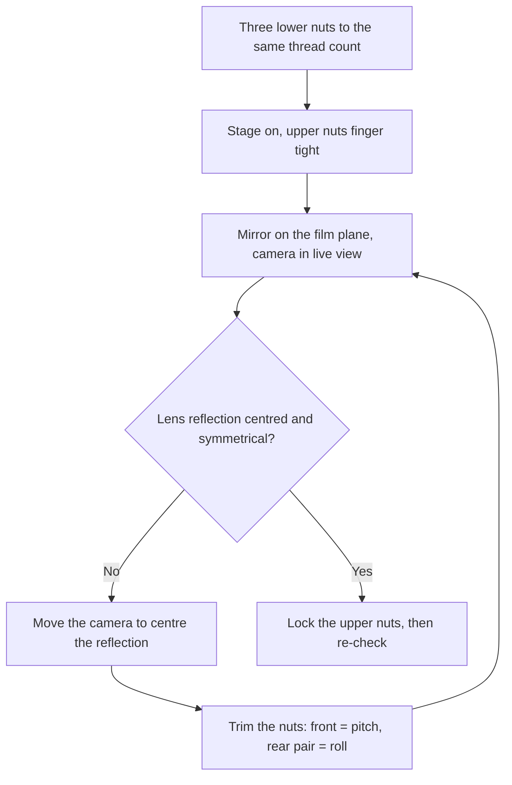

# Assembly

**English** · [简体中文](assembly.zh-CN.md) · [日本語](assembly.ja.md)

> How to turn a box of printed parts and a bag of hardware into a working light source: the three inserts, the paint, the magnets, the stage and its three-point levelling, and the mirror method that makes the film plane parallel to your sensor.

**Contents:** [Before you start](#before-you-start) · [Tools and safety](#tools-and-safety) · [What connects to what](#what-connects-to-what) · [Assembly steps](#assembly-steps) · [Levelling the stage](#levelling-the-stage) · [Calibration](#calibration) · [Power](#power) · [Session routine](#session-routine) · [Using the box on end](#using-the-box-on-end) · [If something is wrong](#if-something-is-wrong)

## Before you start

The headline figure is **about 15 minutes**, and it is honest — but it is hands-on time across the mechanical steps only, and it excludes every wait. Setting the inserts, painting the outside and gluing the magnets and the washers each come with a cool, cure or dry time that you cannot rush, so plan the build across two sessions rather than one.

Nothing in the enclosure is held by screws, and no structural glue is used anywhere. The only adhesive in the whole build is a drop of cyanoacrylate under each magnet and each steel washer.

Check the parts before you commit to any of it. The full per-part list is in [printing.md](printing.md#check-each-part-before-you-assemble); these four are the ones that stop the build dead:

- [ ] The **top cover** drops onto the **main body** under its own weight and sits flat. The nominal side clearance is 0.3 mm — the tightest fit in the build.
- [ ] An M6 × 35 **stud** falls through each of the three Ø6.5 holes in the **film stage** without being pushed. These are [clearance holes, not tapped holes](glossary.md#clearance-hole-vs-tapped-hole).
- [ ] A **steel washer** sticks to a magnet. A stainless washer will not, and the box-on-end feature fails silently at the last step.
- [ ] A **film strip** slides into the **holder** channel without being forced, and the **holder lid** closes without rocking.

## Tools and safety

Every tool and consumable is listed with what it is for and its specification in [bom.md](bom.md#tools-and-consumables). The short version for this document: a soldering iron, two M6 spanners or a spanner and pliers, a hobby knife, cyanoacrylate glue, low-tack masking tape, PLA-safe matte black spray paint, a rocket blower, and a small flat mirror about 30 mm across.

> [!WARNING]
> Three parts of this build can hurt you.
> - **The iron runs at 200–250 °C** and PLA gives off fumes when it softens. Work near an open window, park the iron in its stand every time, and let parts cool before you pick them up.
> - **Spray paint** goes on outdoors or in real ventilation, never in the room where you will later handle film.
> - **The Ø6 × 2 magnets** are small, strong and a genuine swallowing hazard — keep them away from children and pets. They will also pinch skin between two magnets, and they will wipe cards and disturb drives.
>
> Charge NiMH cells outside the enclosure. Nothing mains-powered ever goes inside the box.

## What connects to what

| Interface | Method |
|---|---|
| Main body | One printed piece — nothing to assemble |
| Top cover → main body | Drops on. The 10 mm skirt laps the wall, locates the cover and traps light. No screws. |
| Film stage → top cover | Three M6 × 35 studs into [heat-set inserts](glossary.md#heat-set-insert), the stage clamped between a lower nut and an upper nut |
| Diffuser → film stage | Rests on the aperture, held flat by the weight of the film holder. No fixings. |
| Film holder → film stage | Four corner blocks locate it in X and Y; four base magnets onto steel washers hold it down |
| Holder lid → holder base | Four pairs of closure magnets |
| Access panel → main body | Plug wrapped in EVA foam tape, friction fit |

## Assembly steps

### Step 1 — Set the three heat-set inserts

**You need:** the top cover, three M6 heat-set inserts, a soldering iron at 200–250 °C with a conical or insert tip.

1. Rest the top cover on the bench **with its three round posts pointing up**. The large flat face lies on the bench.
2. Dry-fit an insert into a post by hand. It should start in the bore and stand square without being pushed.
3. Sit the insert on the post, bring the iron down onto it, and let it sink under the weight of the iron alone. Keep the iron vertical — the insert follows wherever the iron leans.
4. Stop the moment the flange is flush with the top of the post. Lift the iron away and leave the part alone until it is cold.

**Checkpoint:** all three flanges are flush and square, and an M6 × 35 stud starts by hand in each one. Sight across the three studs — they should stand parallel.

**Failure mode:** an insert pressed in crooked leaves the stud leaning, and the lower nut then seats on an angle that levelling cannot fully take out. Too much heat or too much push slumps the post. Both are hard to undo on the largest white part in the build.

> [!NOTE]
> The insert's outside diameter and the matching post bore are not published with the design, and M6 heat-set inserts ship in several diameters. Dry-fit yours before you heat anything. If the insert will not start in the bore cold, do not force it hot — check the size against your supplier's drawing first.

### Step 2 — Paint the outside

**You need:** the main body and the top cover only — the access panel is not painted, so leave it aside. Also low-tack masking tape and PLA-safe matte black spray paint (acrylic or enamel).

1. Mask the whole cavity and the 100 × 120 aperture. The interior stays **bare white filament** — it is the light source, not a surface to be decorated.
2. Mask the clearance-critical fit as well: the inside of the cover skirt with the top edge of the walls it laps (0.3 mm per side nominal). Paint has thickness, and that fit can absorb all of it.
3. Spray the **outside of the main body** and the **top face of the top cover** matte black, in thin coats. Those two surfaces are the entire paint job. The **outside of the cover skirt** and the **access panel** are not sprayed — they stay bare white, and both fits keep their full clearance.
4. Cure as the can instructs before handling. Fresh paint transfers onto everything it touches.

**Checkpoint:** the two sprayed surfaces are uniformly matte with no gloss anywhere, the cavity is still bare white, and the cover still drops onto the body under its own weight.

**Failure mode:** overspray into the cavity cannot be undone, and it costs you the part that does the optical work — see the caution below. The other one is paint in the skirt fit: 0.3 mm per side nominal is all the clearance there is, and a coat on each mating face can swallow it, leaving a cover that has to be forced on.

**Why:** the box is sealed and has no ventilation holes precisely because every hole is a light leak. Black on the outside stops room light entering through thin walls and stops the box glowing back into your working space. White on the inside is what makes the cavity work.

> [!CAUTION]
> Do not paint the inside, and do not sand or polish it either. The diffuse white filament surface is the optical component that turns one flash pop into an even field.

### Step 3 — Fit the top cover

**You need:** the main body, the painted top cover, optionally a strip of 2 mm EVA foam tape.

1. Optional, for a tighter light seal: run a strip of EVA foam tape along the top edge of the walls — about 2 × (208 + 273) = 962 mm. It has to go on before the cover does.
2. Drop the cover onto the body. It locates on the skirt.

**Checkpoint:** the cover seats fully, does not rock, and shows no gap at any corner.

**Failure mode:** if the cover will not go on, the fit has been eaten by paint thickness, by [elephant foot](glossary.md#elephant-foot) — the outward bulge of a print's first few layers — or by warp. See the remedies in [printing.md](printing.md#if-it-came-out-tight-or-loose) before you take a knife to anything.

### Step 4 — Build the film stage

**You need:** three M6 × 35 studs, six M6 nuts, the film stage, two spanners.

1. Screw the three studs into the inserts, finger tight, then a gentle nip.
2. Run one **lower nut** down each stud, all three to the same thread count. This nut sets the height of the stage.
3. Drop the film stage over the three studs, through its Ø6.5 clearance holes.
4. Fit the three **upper nuts** finger tight. Do not lock them yet — levelling comes next.

**Checkpoint:** the stage drops on under its own weight and rests on all three lower nuts, with its top face at z = 114 and the four corner blocks pointing up.

**Failure mode:** a stud that will not drop through its Ø6.5 hole is the one that tempts people into cutting a thread — hand-ream to 6.5 mm instead, and read the caution below first. The quieter one is three lower nuts run down to different thread counts: the stage starts out tilted, and levelling then has to absorb an error that costs nothing to avoid at this point.

> [!CAUTION]
> Never tap the three holes in the film stage. A threaded plate on a threaded stud makes a [differential screw](glossary.md#differential-screw): both threads advance together and the height stops responding to the nuts. Ø6.5 clearance holes are mandatory. If a stud will not drop through, hand-ream to 6.5 mm — do not cut a thread.

The three studs are deliberately not symmetric:

| Stud | Position from the stage centre (X, Y) | Adjusts |
|---|---|---|
| Front | (45, −100) | Pitch |
| Rear left | (−70, +65) | Roll |
| Rear right | (+70, +65) | Roll |

The front stud is offset in X so that it stays clear of the film run-out corridor — the strip has to be able to pass right through the holder. It is not an error; do not "correct" it, and note that the stage therefore only goes on one way round.

### Step 5 — Fit the holder magnets

**You need:** Ø6 × 2 neodymium magnets, cyanoacrylate glue, a marker pen.

| Role | Pockets | Per holder | Needed? |
|---|---|---|---|
| Closure | 4 in the holder base at (±45, ±75), 4 facing them in the holder lid | 8 | Recommended for every build |
| Base-to-stage | 4 in the holder base at (±25, ±75) | 4 | Only if you will stand the box on end |

1. **Check polarity before any glue.** Drop the four closure magnets loosely into the base pockets, then offer a lid magnet up to each one in turn. Each pair must attract. Mark the up-face of every magnet with the pen while you can still move it.
2. Put one drop of glue in the pocket — not on the mating face — and press the magnet home. It should finish flush with the surface, neither proud nor sunk.
3. Do the base-to-stage magnets the same way. Their polarity does not matter: they pull on plain steel washers, which have no poles of their own.
4. Let the glue cure fully before you bring the two halves together.

**Checkpoint:** base and lid snap shut and stay shut when you hold the closed holder by one end. Nothing stands proud of either face — a proud magnet lifts the holder off the diffuser and tilts the film plane.

**Failure mode:** one reversed pair pushes the lid open at that corner, and cured cyanoacrylate is not reversible. If you close the holder before the glue sets, the magnets jump across and pull themselves out of their pockets.

> [!IMPORTANT]
> The closure magnets are what hold the sandwich shut. Without them the holder lid is held by its own weight alone — enough with the box lying flat, not enough on end, and not enough if you ever knock the stand. Treat the 16 closure magnets (8 per holder) as part of every build; only the 8 base-to-stage magnets and the 4 washers are genuinely optional.

### Step 6 — Glue the four steel washers

Skip this step entirely if you will never stand the box on end.

**You need:** four Ø12 steel washers, cyanoacrylate glue.

1. Drop a washer onto each of the four base-to-stage magnets in the holder base.
2. Lower the holder onto the film stage, inside the four corner blocks, so the washers land where they belong — at (±25, ±75) from the holder centre.
3. Mark round each washer, lift the holder off, and glue the washers to the top face of the stage.

**Checkpoint:** with the glue cured, the holder pulls down onto the stage with a definite click and cannot be slid sideways out of the corner blocks by hand.

**Failure mode:** a stainless washer is not magnetic. The holder never clicks down, nothing warns you, and the box-on-end feature fails at the last step. A washer glued away from its mark misses the magnet above it, and by then the glue has cured.

> [!NOTE]
> The corner blocks are printed integral to the printed film stage, so there is nothing to fit. The aluminium film stage is a flat plate — it carries the aperture and the three clearance holes but no corner blocks, and the current file set contains no separate block part to add. Both stages present their top face at z = 114, so they are otherwise interchangeable.

### Step 7 — Diffuser and holder

**You need:** the 110 × 130 × 2 [opal](glossary.md#opal) acrylic diffuser, the film holder, a blower.

1. **Peel the protective film off both faces.** Sheet acrylic ships masked on both sides, and a film left on the underside changes the diffusion and collects static dust 4.3 mm from your negatives.
2. Blow both faces clean.
3. Lay the diffuser over the aperture. It is not fixed to anything — 110 × 130 over a 100 × 120 aperture leaves 5 mm of overlap all round, and the holder's weight keeps it flat.
4. Set the film holder on top of it, inside the four corner blocks.

**Checkpoint:** the diffuser covers the aperture with even overlap, the holder sits flat on it and does not rock, and the holder base is in contact with the diffuser across its whole area.

**Failure mode:** the protective film left on the underside is the one that hides — it changes the diffusion and sits 4.3 mm from your negatives collecting static dust, and you will read the result as uneven light. The other is permanent: a diffuser cleaned with the wrong thing crazes, as the caution below explains.

> [!CAUTION]
> Never clean the diffuser with alcohol, ammonia or household glass cleaner. All three craze acrylic, and a crazed diffuser is a permanently textured one. A blower, and at most a dry microfibre cloth, is the entire cleaning kit. This is why the bill of materials tells you to buy two or three sheets.

### Step 8 — Light source

**You need:** the flash, the trigger receiver, white paper, tape, the USB LED strip, a Ø12 grommet.

1. Lay the flash flat on the floor of the box with its **head rotated 90°** so it fires horizontally at the far wall. Nothing is aimed at the film; the light reaches it only after several diffuse bounces.
2. Do not fit the flash's own wide-angle diffuser panel. Set the zoom to 35–50 mm.
3. Put the flash foot toward the access opening and mate the receiver with it there. The depth budget reserves 30 mm between the flash body and the access panel for the receiver, so it lies in line with the flash, not on top of it.
4. **Tape a piece of white paper to the top face of the flash body** — not over the head. That black body sits directly under the aperture and otherwise reproduces as a dark patch in the middle of every frame.
5. Reach in through the 190 × 76 access opening and stick the LED strip to the side wall at about z = 50, which is 50 mm above the outside of the floor — beside the flash body, below the aperture and out of direct line to the film. Run the cable out through the Ø12 gland in the right wall, fitted with a rubber grommet. The inline dimmer stays **outside** the box.

**Checkpoint:** with the box closed, the flash fires from the transmitter, and in a dark room no light escapes at the cover seam. Run the LED strip low — the flash overwhelms it, and it is only there so you can focus.

**Failure mode:** no white paper on the flash body, and that black body sitting directly under the aperture reproduces as a dark patch in the middle of every frame. A head left facing up fires at the film instead of at the far wall, and the diffuse bounces the cavity exists to produce never happen.

Once the flash is where you want it, draw a line on the floor of the box around it so it goes back in the same place every time.

### Step 9 — Close up

**You need:** the access panel, 2 mm self-adhesive EVA foam tape.

1. Wrap the tape around the 186 × 72 × 4 plug — 2 × (186 + 72) = 516 mm of it, one lap.
2. Push the plug into the 190 × 76 access opening. The foam takes up the roughly 2 mm of clearance all round and the panel is held by friction alone.

**Checkpoint:** the panel stays put when you tip the box, and shows no line of light at its edge in a dark room with the LED strip on.

**Failure mode:** the foam is the whole fit. Too thin for the roughly 2 mm of clearance all round and the panel falls out when you tip the box; too thick, or wrapped twice, and it will not seat — and a panel standing proud fouls the cover skirt it is meant to clear by 2 mm.

The panel's top edge clears the cover skirt by 2 mm, so you never have to lift the top cover to reach the flash — battery changes and power changes go through this opening.

## Levelling the stage

Two different things are often confused here, and only one of them matters. You are not levelling against gravity. You are making the **film plane parallel to the sensor**, which is a relationship between the stage and the camera — a spirit level cannot see it. A flash freezes vibration, but nothing in the box can rescue a film plane that is tilted relative to the sensor, so parallelism comes first and evenness second.

### The mirror method

1. Lay a small flat mirror on the film plane, on top of the film holder.
2. Look at the mirror through the camera in live view.
3. You will see the lens and the camera reflected back. Move the camera until that reflection sits exactly in the centre of the frame and looks symmetrical.
4. When the reflection of the lens is dead centre, the sensor is parallel to the film plane.
5. Then trim the three stage nuts — front nut for pitch, rear pair for roll — and re-check.

Two passes converge. Lock the upper nuts when you are happy, then look once more: tightening moves things.

The same method is used from the camera's side of the setup, with the stand geometry spelled out, in [scanning.md](scanning.md#parallelism).

Why three points and not four

Three points define a plane. Three adjusters can put a rigid plate into any orientation you ask for, and exactly one combination of heights produces each orientation — the constraint is exact.

A fourth adjuster over-constrains it. There is no longer a single solution, so the plate either rocks between two diagonals or, once you tighten everything down, bends to meet all four. Bending is the worse outcome: it destroys the flatness you added the fourth point to protect.

This is the same reason surveying instruments and optical tables use three feet, and it is why the levelling is split into one front nut for pitch and a rear pair for roll — the two axes stay independent, so the two passes converge instead of chasing each other.

## Calibration

1. Photograph the bare lit surface, with no film in the holder, in [raw](glossary.md#raw), at the aperture you will actually use.
2. Apply [flat-field correction](glossary.md#flat-field-correction) **first**. It separates your lens's vignetting from genuine unevenness in the source, and without it you will spend an evening chasing a dark corner that belongs to the lens. The target for the source itself is about **±0.1 [EV](glossary.md#ev) corner to corner**. The procedure and the software options are in [scanning.md](scanning.md#flat-field-and-inversion).
3. If it misses that target, work in this order and change one thing at a time:
   - Centre the flash on its outline and check the white paper patch on its body.
   - If the far end reads brighter than the near end, stand a white card at the far wall and change its angle.
   - As a last resort, stick a small translucent attenuating dot at the centre of the underside of the diffuser.
4. Make the setup repeatable. Mark where the box sits on the baseboard so it returns to the same place, and write down the camera height for each format.

The film plane does not move: it stays at about 120.3 mm above whatever the box is standing on, for both 135 and 120. The camera height changes between formats only because the [magnification](glossary.md#magnification-ratio) does — how large the frame lands on the sensor relative to its real size — so see the table in [scanning.md](scanning.md#camera-height-and-the-stand).

## Power

Nothing mains-powered goes inside the enclosure.

| Device | Power |
|---|---|
| TT560 | 4 × AA, no external port. Two sets of NiMH cells in rotation is the practical setup. |
| ZENIKO T1 | Own battery — USB-C or coin cell depending on the unit |
| LED strip | USB 5 V from a power bank or charger, inline dimmer outside the box |
| Camera | Batteries; a dummy battery is worth it for long sessions |

The receiver cannot change flash power remotely. In practice you set the power once during calibration and leave it; if you do need to change it, pull the access panel rather than lifting the top cover.

## Session routine

- Blow both faces of the diffuser and the [film gate](glossary.md#film-gate) before you start, every time.
- Check that the flash is on its outline and the access panel is seated.
- Handle film by the edges, with clean hands or cotton gloves.

The film sits about 4.3 mm above the diffuser, so a dust particle there projects as a soft blob about 0.2 mm across at the film plane at f/8 and 0.43× (a 6×6 frame on a full-frame sensor) — invisible once a negative is inverted, visible on a slide. There is no mechanical fix for this in the current design; the mitigation is the blower, used every session.

## Using the box on end

The design supports standing the enclosure vertically.

| Part | What holds it |
|---|---|
| Film holder | Four base magnets onto the steel washers, plus the four corner blocks. **If you skipped the magnets, do not stand the box on end.** |
| Film stage | Studs into inserts, clamped by the lower and upper nuts — rigid in any orientation |
| Access panel | Add a strip of tape so it cannot fall out, and a piece of foam beside the flash so the flash cannot shift |
| Diffuser | Held by the holder |

## If something is wrong

| Symptom at this stage | Where to look |
|---|---|
| Cover will not seat, stud will not pass, stage rocks | [Assembly problems](troubleshooting.md#assembly) |
| A bright corner, a dark patch under the aperture, or a light leak at a seam | [Light and evenness](troubleshooting.md#light-and-evenness) |
| The channel is too tight or too loose, or a part came out warped | [printing.md](printing.md#if-it-came-out-tight-or-loose) |

---

← [Printing](printing.md) · [Documentation index](../README.md#documentation) · [Scanning](scanning.md) →
