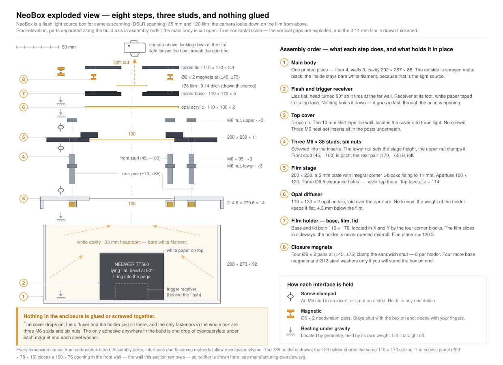
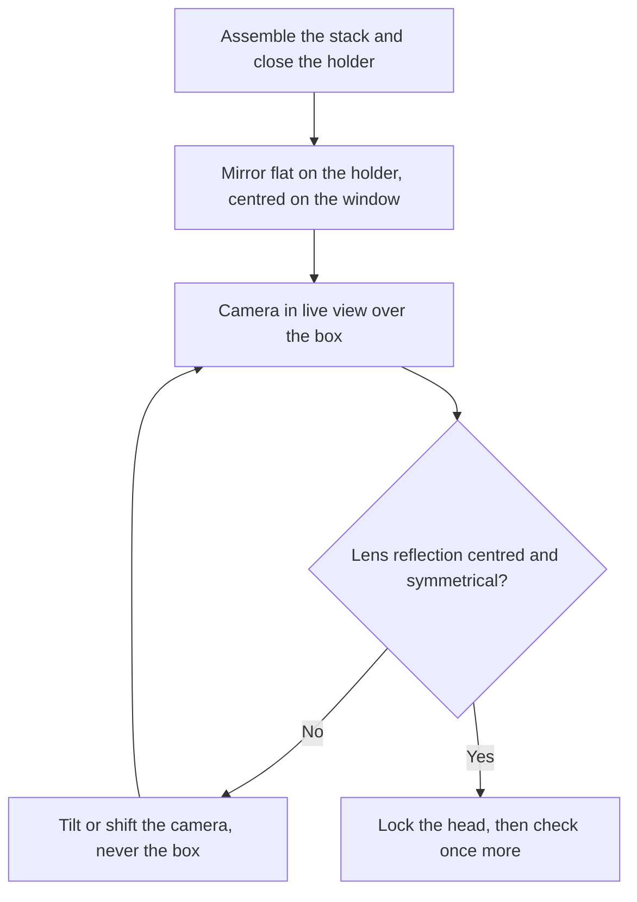

# Assembly

**English** · [简体中文](assembly.zh-CN.md) · [日本語](assembly.ja.md)

> How to turn nine printed parts, thirty-two magnets, four steel washers and a sheet of opal acrylic into a working light source, with no tools at all: magnets pressed in with paired polarity, a gravity stack from main body to cover-stage to film holder, and the mirror method that makes the film plane parallel to your sensor.

**Contents:** [Before you start](#before-you-start) · [Tools and safety](#tools-and-safety) · [What connects to what](#what-connects-to-what) · [Assembly steps](#assembly-steps) · [Formats and everyday handling](#formats-and-everyday-handling) · [If something is wrong](#if-something-is-wrong)

## Before you start

There is not a single screw, thread, drop of glue or coat of paint in this build, and therefore not a single tool. Every joint is a magnet, a locating feature or gravity, and every step is reversible: parts lift apart the same way they went together. Nothing cures and nothing dries, so the whole assembly is one sitting; the only part worth doing slowly is the magnets, because they are the one thing that is hard to undo.

Check the parts before you start. The full per-part list is in [printing.md](printing.md#check-each-part-before-you-assemble), and the purchased parts are in [bom.md](bom.md); these four checks are the ones that stop the build:

- [ ] The **cover-stage** drops onto the **main body** with its four corner notches over the locating tenons on the wall tops, and sits flat without rocking.
- [ ] A **Ø8 × 2 magnet** starts in its counterbore by hand and needs a firm push to seat. It is an interference fit; snug is correct.
- [ ] A **steel washer** sticks to a magnet. A stainless one will not, and nothing later ever warns you.
- [ ] A **film strip** slides through the **holder base** channel without being forced, and the **holder lid** sits on the base without rocking.

## Tools and safety

There is no tool list, because there are no tools: no iron, no spanners, no knife, no glue, no paint. The two useful extras are a blower for dust and a small flat mirror about 30 mm across for the last step. If a magnet is too stiff for a thumb, set the magnet on the tabletop and press the part down over it. The table is as close to a tool as this build gets.

> [!WARNING]
> - The **Ø8 × 2 magnets** are small, strong and a genuine swallowing hazard: keep them away from children and pets. A pair snapping together pinches skin, and they will wipe cards and disturb drives.
> - A pressed-in magnet is hard to get back out. Check polarity **before** you press, every single time.
>
> Nothing electrical ever goes inside the box: the flash lies outside at the open front and fires in, and the receiver stays out there with it.

## What connects to what

| Interface | Method |
|---|---|
| Main body | One printed piece, nothing to assemble |
| Cover-stage → main body | Rests on the wall tops, four corner notches over the locating tenons. Gravity only, no screws |
| Steel washers → cover-stage | Dropped into four counterbores, flush with the deck (the stage's top face). No glue: the counterbores and the magnets above them do the holding |
| Opal acrylic → cover-stage | Lies in its recess over the light window, top face 0.4 mm below the deck. Loose |
| Holder base → cover-stage | The tray flange locates it; its base magnets pull it down onto the steel washers |
| Pressure element → holder base | The insert or the AN glass rests on the 4.6 mm element ledge. Deliberately loose |
| Holder lid → holder base | Eight magnet pairs |
| Flash → box | Never inside. It lies on the table at the open front with its head firing into the cavity |

## Assembly steps

### Step 1 — Press in the magnets

**You need:** the four clamp parts (two holder bases, two holder lids), the 32 Ø8 × 2 magnets, a marker pen.

Every clamp part takes eight magnets: bases from **above**, into the counterbores in the top face; lids from **below**, into the underside. Polarity is the whole game: each base magnet must attract the lid magnet that will face it, and it has to be right before pressing, because pressing is the nearest thing to permanent in this build.

1. Keep the magnets as one stack and peel them off one end without flipping any, so every magnet leaves the stack the same way up.
2. Lay a holder base flat and press its eight magnets in from the top face, all the same way up, each to the bottom of its pocket. Thumb pressure usually seats them; if not, put the magnet on the table and press the part down over it.
3. Turn a holder lid underside-up. For each pocket, first touch the loose magnet to the pressed base magnet it will face; it snaps on in the attracting orientation. Mark the exposed face with the pen, pull it off, and press it into the lid pocket **marked face first**, leaving the unmarked, attracting face showing.
4. Repeat for the other format's base and lid.

**Checkpoint:** each lid snaps shut onto its base and stays shut when you hold the closed holder by one end. The lid magnets finish flush with the lid's underside; the base magnets stand 0.4 mm proud of the base's plate face. That is the design, not a bad press, so do not try to sink them.

**Failure mode:** one reversed magnet pushes its corner of the lid open, and a pressed-in magnet does not come out willingly. The touch-and-mark check in sub-step 3 costs seconds per magnet; skipping it can cost the part.

> [!IMPORTANT]
> The eight magnet pairs are all that holds the sandwich shut; there are no clips or screws behind them. Every base and every lid gets its full eight; no magnet in v1 is optional.

### Step 2 — Drop the steel washers into the cover-stage

**You need:** the cover-stage, the four steel washers (10 × 10 × 1 mm squares or Ø10 × 1 discs).

1. Drop one washer into each of the four counterbores in the deck.

That is the whole step. No glue: each counterbore locates its washer flush with the deck, and in use the holder-base magnets above press it home.

**Checkpoint:** a fingertip drawn across the deck feels no edge at any washer, and a spare magnet lifts each one straight back out. If the magnet will not lift a washer, that washer is stainless. Swap it now, because nothing later will tell you.

**Failure mode:** a stainless washer looks identical and fails silently: the holder base never gets pulled into register. A washer riding proud of the deck tilts the base above it.

### Step 3 — Acrylic into its recess

**You need:** the 68 × 118 × 2 mm [opal](glossary.md#opal) acrylic, a blower.

1. **Peel the protective film off both faces.** Sheet acrylic ships masked on both sides.
2. Blow both faces clean.
3. Lay the sheet into the recess over the light window, in the middle of the tray floor. It drops in and stops with its top face 0.4 mm below the deck.

**Checkpoint:** the sheet sits below deck level all round and can be nudged slightly in its recess. Loose is correct: nothing fixes it, and the 0.4 mm step means even the holder above never touches it.

**Failure mode:** protective film left on a face changes the diffusion, and on opal sheet it hides well. Look for a peel edge at the corners before the sheet goes in.

> [!NOTE]
> Dust on the acrylic never shows in a frame: the sheet is itself the diffuse glowing surface, not something the lens images. An occasional wipe with a dry cloth is all it needs. Never use alcohol, ammonia or glass cleaner, all of which craze acrylic.

### Step 4 — Cover-stage onto the main body

**You need:** the main body, the cover-stage with its washers and acrylic in place.

1. Hold the cover-stage by the tray flange, line up its four corner notches with the locating tenons on the wall tops, and lower it straight down. It seats under its own weight.
2. If it stands high or rocks, a tenon is riding beside its notch: lift straight off and re-seat. Never press, never twist.

**Checkpoint:** the stage sits flat on the wall tops with no gap and no rocking, and lifts straight back off just as freely.

**Failure mode:** a notch that will not take its tenon is a printing artefact ([elephant foot](glossary.md#elephant-foot) on the first layers of either part), not something to force. See [printing.md](printing.md#if-it-came-out-tight-or-loose).

### Step 5 — Holder base into the tray

**You need:** the cover-stage in place, the holder base for your format, and the 6×6 mask if that is your frame.

1. Lower the base inside the tray flange. At 0.3 mm of clearance per side it goes in without play worth noticing.
2. Let it settle: the base magnets find the steel washers in the deck and pull the base flat into register.

**Checkpoint:** the base lies flat on the tray floor and does not rock, and you should feel the magnets take it as it lands. Lift it out and drop it again; it should land the same way every time.

**Failure mode:** a base that stays indifferent, with no settle and no grip, means Step 2's washers are stainless or missing. A base that will not enter the flange without force is elephant foot again, not a reason to push.

> [!NOTE]
> For 6×6 frames, lay the **6×6 mask** in the tray first and the 120 base on top of it. The whole clamp then rides 1 mm higher; that is normal. There is no 6×4.5 mask: shoot through the 120 window and crop afterwards.

### Step 6 — Pressure element in, lid on

**You need:** the pressure-window insert for your format (or the 64 × 95 × 2 mm AN glass, one sheet serving both formats), the matching holder lid, a blower.

1. Set the element down on the 4.6 mm element ledge in the outer rails. The ledge holds it 0.4 mm above the film path, and that 0.4 mm is the whole pressure design: film advances by sliding underneath, and any bow in the strip is smoothed flat against the element's underside on the way through. The element is fitted once and then left alone.
2. If it is the glass: **matte (AN) face down**, toward the film: the matte face against the film base's glossy side is what prevents Newton's rings. Blow the underside just before it goes in: it will sit 0.2 mm from the focal plane, and dust *there* does image.
3. Set the lid on. The eight magnet pairs snap it down.

**Checkpoint:** the lid seats all round with no corner standing open, and the element keeps a whisper of float under the closed lid: the lid cavity leaves it 0.4 mm, and floating is correct. An element clamped rigid means something is proud somewhere; open up and look rather than pressing harder.

**Failure mode:** the glass put in glossy face down invites Newton's rings against the film base. A corner that will not close is a reversed magnet from Step 1, reporting late.

### Step 7 — Level at the camera: the mirror method

The box has no levelling hardware, and none is missing. Only one relationship matters, **the film plane parallel to the sensor**, and the camera end is the right end to set it, because one adjustment there corrects the whole chain at once, printed tolerances included.

**You need:** the assembled box under your camera, a small flat mirror about 30 mm across.

1. Lay the mirror flat on the closed holder, centred over the film window.
2. Watch live view. You will see the lens and the camera reflected back.
3. Tilt and shift **the camera, not the box,** until the reflection of the lens sits dead centre in the frame and looks symmetrical.
4. When the reflection is centred, the sensor is parallel to the mirror, and the mirror is lying on the film plane. Done.
5. Lock the head, then look once more; tightening moves things.

**Checkpoint:** with the head locked, the reflection is still centred. Repeat the check whenever the box or the camera has moved; it costs seconds.

Why the camera, and why a mirror

A spirit level measures against gravity, and gravity is not in the optical chain: a stage perfectly level to the floor can still be tilted relative to the sensor. The mirror measures the one relationship that matters, and doubles it: any angle between the sensor's axis and the mirror shows up twice over in where the reflection lands, which makes centring the lens's own reflection a sensitive null test.

Adjusting at the camera rather than the box also absorbs everything below the mirror in the same move: wall-top flatness, tenon seating, the stack of printed tolerances. Shimming the box could only ever correct the box. That is why v1 deleted the box-side levelling hardware instead of refining it.

For the camera side of the setup, the stand is in [parallelism](scanning.md#parallelism), and the height for each format in [camera height and the stand](scanning.md#camera-height-and-the-stand).

## Formats and everyday handling

- **Changing format is changing the clamp.** Lift the whole clamp off (it is held by magnets alone) and drop the other format's clamp in. Each clamp keeps its own insert fitted; if you use the AN glass, that one sheet serves both formats, so only the glass moves across to the other clamp's ledge.
- **Advancing film:** pinch the leader where it sticks out of the clamp and pull. The tail rides on the top of the tray flange, 0.2 mm below the film plane, which supports it on the way; with a long strip, steady the far end with your free hand.
- **Loading direction:** with the glass, load the strip curl-up; with the insert, curl-down.
- **Getting the acrylic out:** lift the clamp off, reach in through the open front, and push the sheet up through the light window.
- **The cover-stage comes off as one piece:** grip it by the tray flange and lift straight up.
- **The flash never moves in:** it lies at the open front with its head firing into the cavity, and the receiver stays outside where its signal is clean and its batteries are reachable. Work in a dim room and keep ceiling light out of the box mouth.

> [!IMPORTANT]
> The assembled box is a gravity stack: no part is fastened to any other. Never tilt it, and never carry it assembled: take the clamp and the cover-stage off and move the pieces separately.

## If something is wrong

| Symptom at this stage | Where to look |
|---|---|
| The cover-stage stands high or rocks, or the holder will not settle in the tray | [Assembly problems](troubleshooting.md#assembly) |
| A dark patch, a bright side, or a clean dark band across frames | [Light and evenness](troubleshooting.md#light-and-evenness) |
| The film channel is too tight or too loose, or a part came out warped | [printing.md](printing.md#if-it-came-out-tight-or-loose) |

---

← [Printing](printing.md) · [Documentation index](../README.md#documentation) · [Scanning](scanning.md) →
