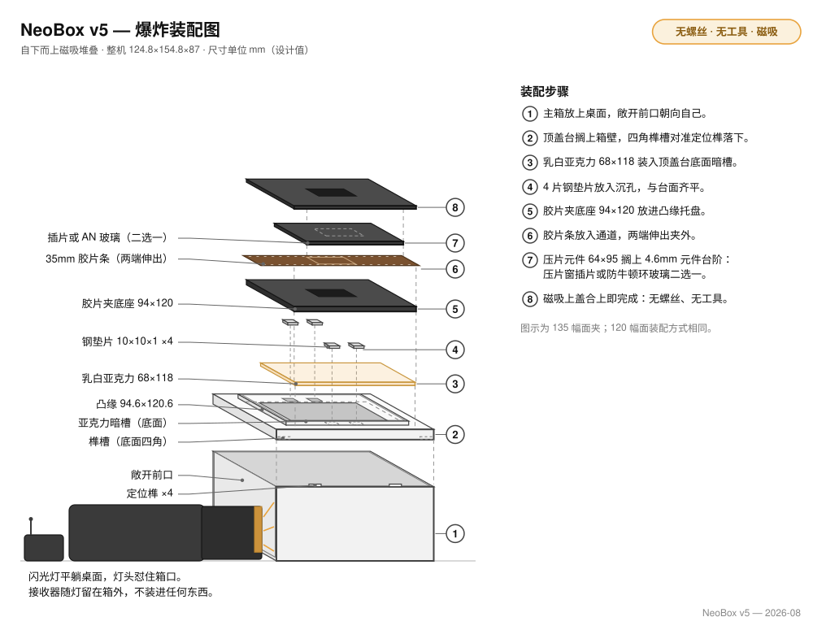
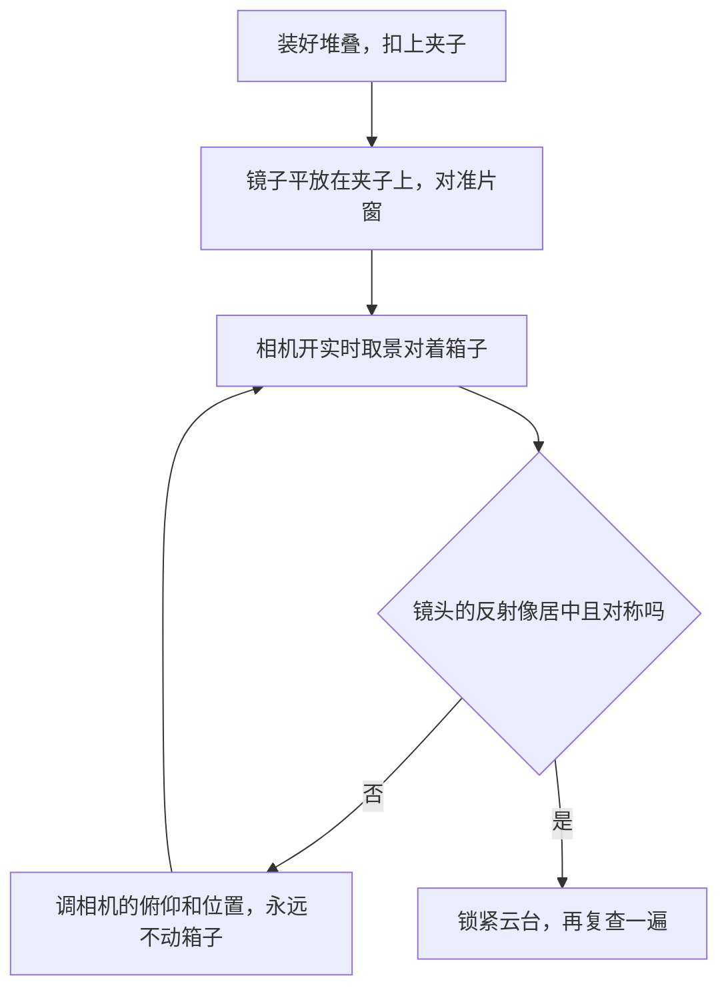

# 装配

[English](assembly.md) · **简体中文** · [日本語](assembly.ja.md)

> 怎么把九个打印件、三十二颗磁铁、四片钢垫片和一片乳白亚克力变成一台能用的光源，全程没有一件工具：按极性配对压入的磁铁，从主箱到顶盖台再到胶片夹的重力堆叠，以及让胶片面与传感器平行的镜子法。

**目录：**[开工之前](#开工之前) · [工具与安全](#工具与安全) · [什么固定什么](#什么固定什么) · [装配步骤](#装配步骤) · [换幅面与日常操作](#换幅面与日常操作) · [出问题的时候](#出问题的时候)

## 开工之前

这台机器上没有一颗螺丝、一段螺纹、一滴胶、一层漆，所以也不需要任何工具。每一处连接不是磁铁、就是定位结构，再不然就是重力，而且每一步都可逆：零件怎么落上去，就能怎么提下来。没有任何固化或晾干的等待，整台一口气装完；唯一值得放慢的是压磁铁，因为那是全程里唯一难以反悔的动作。

动手之前先验件。逐件检查的完整清单在[打印文档](printing.zh-CN.md#装配前逐件检查)里，外购件在[物料清单](bom.zh-CN.md)里；下面这四项是不合格就干不下去的：

- [ ] **顶盖台**四角的榫槽对准箱壁顶上的定位榫，靠自重落到**主箱**上，坐平不晃。
- [ ] 一颗 **Ø8 × 2 磁铁**能用手在沉孔里起头，用力一按才到底。这是过盈配合，紧是对的。
- [ ] **钢垫片**能被磁铁吸住。不锈钢的吸不住，而且之后不会有任何东西提醒你。
- [ ] **片条**不用硬塞就能滑过**夹底座**的通道，**夹上盖**放上去不晃。

## 工具与安全

没有工具清单，因为没有工具：不用烙铁，不用扳手，不用刀，不用胶，不用漆。值得备的只有两样：一只吹灰的气吹球，和最后一步用的一面约 30 mm 的小平面镜。磁铁用拇指压不到底时，把磁铁放在桌面上、按着零件往下压。这张桌子就是全程最接近"工具"的东西。

> [!WARNING]
> - **Ø8 × 2 磁铁**又小又强，误吞是真实的风险，放到小孩和宠物够不到的地方。两颗相吸时会夹住皮肉，也会抹掉磁卡、干扰硬盘。
> - 压进去的磁铁很难再取出来。每一颗都要在**压入之前**验好极性。
>
> 箱体里永远不进任何带电的东西：闪光灯躺在箱外的敞开前口处朝里打光，引闪接收器也跟它一起留在外面。

## 什么固定什么

| 接口 | 方式 |
|---|---|
| 主箱 | 一体打印件，没有需要装配的地方 |
| 顶盖台 → 主箱 | 搁在箱壁顶上，四角榫槽套住定位榫。只靠重力，无螺丝 |
| 钢垫片 → 顶盖台 | 落进台面（顶盖台上表面）的四个沉孔，与台面齐平。不用胶：沉孔定位，上方的磁铁负责按住 |
| 乳白亚克力 → 顶盖台 | 躺在透光窗上方的暗槽里，顶面低于台面 0.4 mm。不固定 |
| 夹底座 → 顶盖台 | 托盘凸缘管定位，底座磁铁把它吸到钢垫片上 |
| 压片元件 → 夹底座 | 插片或防牛顿环玻璃搁在 4.6 mm 元件台阶上。故意做成松的 |
| 夹上盖 → 夹底座 | 八对磁铁 |
| 闪光灯 → 箱体 | 永远不进箱。灯平躺在敞开前口外的桌面上，灯头朝腔内打光 |

## 装配步骤

### 第 1 步——压入磁铁

**需要：**四个夹件（两个夹底座、两个夹上盖），32 颗 Ø8 × 2 磁铁，一支记号笔。

每个夹件压八颗磁铁：底座**从上面**压进顶面的沉孔，上盖**从下面**压进底面的沉孔。极性是这一步的全部：每颗底座磁铁必须和将来正对它的上盖磁铁相吸，而且必须在压入之前就对好，因为压入是全程里最接近"不可逆"的动作。

1. 把磁铁保持成一摞，从一端逐颗取用，途中不翻面，这样每颗磁铁离开摞时朝向都一样。
2. 夹底座平放，八颗磁铁同一朝向从顶面逐颗压入，每颗压到孔底。拇指通常够用；不够就把磁铁放在桌面上，按着零件往下压。
3. 夹上盖翻过来、底面朝上。每个沉孔先拿散磁铁去碰将来正对它的那颗底座磁铁，它会按相吸的朝向"啪"地贴上去。用笔在露出的那一面做记号，取下来，**记号面朝里**压进上盖的沉孔，让没做记号的相吸面留在外面。
4. 另一个幅面的底座和上盖照做。

**检查点：**每副夹子都能"啪"地吸合，捏住合好的夹子一端提起来也不散。上盖磁铁与盖底齐平；底座磁铁凸出板面 0.4 mm。这是设计如此，不是没压到位，不要试图把它按平。

**失败模式：**一颗装反的磁铁会把那个角的上盖顶开，而压进去的磁铁不会痛快地出来。第 3 小步的"碰一下、做记号"每颗只花几秒；省掉它可能赔上整个零件。

> [!IMPORTANT]
> 把这个三明治合紧的只有这八对磁铁，它们背后没有卡扣也没有螺丝。每个底座、每个上盖都要压满八颗；v5 里没有"可选磁铁"。

### 第 2 步——钢垫片入沉孔

**需要：**顶盖台，四片钢垫片（10 × 10 × 1 mm 方片或 Ø10 × 1 圆片）。

1. 每片垫片落进台面上的一个沉孔。

这一步就这么多。不用胶：沉孔让垫片与台面齐平地定位，用起来时上方夹底座的磁铁会把它按住。

**检查点：**指尖扫过台面，任何一片垫片处都摸不到台阶；拿一颗备用磁铁能把每片垫片直接吸出来。吸不起来的那片是不锈钢，现在就换掉，因为之后不会有任何东西提醒你。

**失败模式：**不锈钢垫片看着一模一样，坏起来无声无息：夹底座永远不会被吸进定位。凸出台面的垫片会把上面的底座垫歪。

### 第 3 步——亚克力入暗槽

**需要：**68 × 118 × 2 mm [乳白](glossary.zh-CN.md#乳白)亚克力，气吹球。

1. **两面的保护膜都撕掉。**亚克力板出厂时两面都贴着膜。
2. 两面吹干净。
3. 把板放进托盘中央、透光窗上方的暗槽。它落进去之后，顶面比台面低 0.4 mm。

**检查点：**整片板四周都低于台面，在槽里能被轻轻拨动。松是对的：没有任何东西固定它，而那 0.4 mm 的落差意味着连上方的夹子都碰不到它。

**失败模式：**留在面上的保护膜会改变扩散效果，而它在乳白板上极难看出来。放进去之前先在四角找一找揭膜的翘边。

> [!NOTE]
> 亚克力上的灰尘不会出现在片子里：这块板本身就是漫射发光面，不是镜头拍摄的对象。偶尔用干布擦一次就够，绝不要用酒精、氨水或玻璃清洁剂，这三样都会让亚克力龟裂。

### 第 4 步——顶盖台落上主箱

**需要：**主箱，装好垫片和亚克力的顶盖台。

1. 捏住托盘凸缘端起顶盖台，四角榫槽对准箱壁顶上的定位榫，竖直放下。它靠自重落座。
2. 如果架高了或者发晃，是某个榫骑在了槽旁边：竖直提起、重新落。不压，不拧。

**检查点：**顶盖台平贴箱壁顶、四周无缝不晃，而且同样轻松地就能竖直提起来。

**失败模式：**榫进不了槽是打印问题（两边零件头几层的[象足](glossary.zh-CN.md#象足)），不是用力的理由。见[打印文档](printing.zh-CN.md#打紧了或打松了怎么办)。

### 第 5 步——夹底座入托盘

**需要：**已就位的顶盖台，你这个幅面的夹底座；拍 6×6 的再加遮幅插片。

1. 把底座放进托盘凸缘里。单边 0.3 mm 的间隙，落进去几乎没有可察觉的旷量。
2. 松手让它落定：底座磁铁会找到台面里的钢垫片，把底座吸平、吸进定位。

**检查点：**底座平贴托盘底、不晃，落下去那一刻应当能感觉到磁铁"接住"了它。提出来再放一次，每次都应当落成同一个样子。

**失败模式：**落下去无动于衷，没有吸附感也没有定位感，说明第 2 步的垫片是不锈钢的或者根本没放。进不了凸缘的底座又是象足，不是用力的理由。

> [!NOTE]
> 拍 6×6 时，先把**遮幅插片**平放进托盘，再把 120 底座压在它上面。整副夹子因此抬高 1 mm，这是正常的。没有 6×4.5 的专用遮幅：直接用 120 的窗口拍，后期裁切。

### 第 6 步——放压片元件、扣上盖

**需要：**你这个幅面的压片窗插片（或者 64 × 95 × 2 mm 防牛顿环玻璃，一片通用两个幅面），对应的夹上盖，气吹球。

1. 把元件放到外轨的 4.6 mm 元件台阶上。台阶把它架在片路上方 0.4 mm 处，而这 0.4 mm 就是整个压平设计：过片时片条从元件底下滑过，拱起的部位贴着元件底面被压平。元件装这一次，以后不再动它。
2. 用玻璃的话：**磨砂（AN）面朝下**，朝着胶片：磨砂面贴着片基的亮面，牛顿环就起不来。放进去之前把底面吹一遍：它离焦平面只有 0.2 mm，那里的灰尘是会入镜的。
3. 扣上盖。八对磁铁把它吸到位。

**检查点：**上盖四周落实、没有翘起的角，而元件在扣好的盖子下面还留有一丝浮动：上盖的限位腔给它留了 0.4 mm，能浮才是对的。元件被夹死说明哪里凸了：掀开来看，别硬压。

**失败模式：**玻璃亮面朝下就是在片基上招牛顿环。有一个角合不拢，是第 1 步装反的那颗磁铁迟到的报告。

### 第 7 步——相机端调平：镜子法

箱体上没有任何调平机构，也不缺这个机构：要紧的只有一层关系，就是**胶片面与传感器平行**，而相机端正是设定这层关系的正确一端，因为在那里动一次，整条链一起被修正，打印件的公差也包括在内。

**需要：**已装好、摆在相机下方的箱子，一面约 30 mm 的小平面镜。

1. 把镜子平放在扣好的夹子上，对准片窗的中央。
2. 开实时取景。你会看到镜头和相机的反射像。
3. 调**相机（不是箱子）**的俯仰和位置，直到镜头的反射像正好居中、看上去对称。
4. 反射像居中的那一刻，传感器就与镜面平行，而镜子正躺在胶片面上。完成。
5. 锁紧云台，再看一眼：拧紧这个动作本身会让东西移位。

**检查点：**云台锁紧之后，反射像仍然居中。箱子或相机被动过就再查一次，只花几秒钟。

为什么调相机、为什么用镜子

水平仪量的是相对重力的水平，而重力不在光路里：一块对地绝对水平的台面，仍然可以相对传感器是歪的。镜子量的正是那层唯一要紧的关系，而且把它放大了一倍：传感器轴线与镜面之间的任何夹角，都会以两倍的量体现在反射像的位置上，所以"让镜头自己的反射像居中"是一个灵敏的归零判据。

在相机端调而不是在箱体上调，还把镜子以下的一切（箱壁顶的平整度、榫的落座、打印件层层叠叠的公差）在同一次动作里全部吸收掉了。垫箱子只能修箱子。这就是 v5 直接删掉箱体调平机构、而不是改良它的原因。

相机那一侧的设置：支架见[平行度](scanning.zh-CN.md#平行度)，各幅面的相机高度见[相机高度与支架](scanning.zh-CN.md#相机高度与支架)。

## 换幅面与日常操作

- **换幅面就是换夹子。**整副夹子提起来（它只靠磁铁吸着），再把另一个幅面的夹子放进去。插片各归各的夹子常驻不动；用防牛顿环玻璃的话，一片通用两个幅面，只把玻璃移到另一副夹子的台阶上。
- **过片：**捏住伸出夹外的片头直接抽。片尾搭在托盘凸缘顶上，比胶片面低 0.2 mm，一路托着它走；片条长就用另一只手托住远端。
- **装片方向：**用玻璃，拱面朝上装；用插片，拱面朝下装。
- **取亚克力：**掀掉夹子，从敞开前口伸手进去，经透光窗把板向上顶出来。
- **顶盖台整体可提起：**捏住托盘凸缘，竖直上提。
- **闪光灯永远在箱外：**平躺在敞开前口处，灯头朝腔内，接收器留在外面，信号干净，换电池也不用开箱。在昏暗的房间里拍，别让顶灯直射箱口。

> [!IMPORTANT]
> 组装好的箱子是一摞靠重力叠着的零件，没有任何一件固定在另一件上。不要倾斜它，更不要整机搬运：把夹子和顶盖台取下来，分开拿。

## 出问题的时候

| 这个阶段的现象 | 去哪里看 |
|---|---|
| 顶盖台架高或发晃，夹底座在托盘里落不定 | [故障排查：装配](troubleshooting.zh-CN.md#装配) |
| 有暗斑、有一侧偏亮，或者每张都有一条边界干净的暗带 | [故障排查：光线与均匀性](troubleshooting.zh-CN.md#光线与均匀性) |
| 走片通道太紧或太松，或者零件打翘了 | [打印文档里的偏紧偏松处理](printing.zh-CN.md#打紧了或打松了怎么办) |

---

← [3D 打印](printing.zh-CN.md) · [文档索引](../README.zh-CN.md#文档) · [翻拍扫描](scanning.zh-CN.md) →
