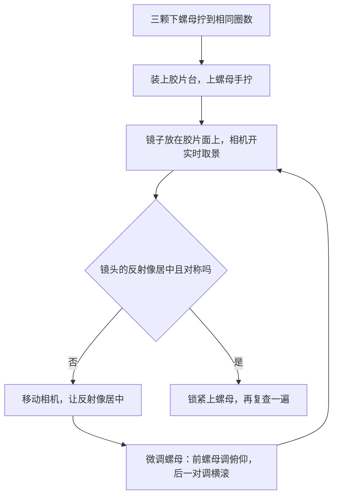

# 装配

[English](assembly.md) · **简体中文** · [日本語](assembly.ja.md)

> 怎么把一堆打印件和一袋五金变成一台能用的光源：三颗热熔铜螺母、外表面的喷漆、磁铁、胶片台和它的三点调平，以及让胶片面与传感器平行的镜子法。

**目录：**[开工之前](#开工之前) · [工具与安全](#工具与安全) · [什么固定什么](#什么固定什么) · [装配步骤](#装配步骤) · [调平胶片台](#调平胶片台) · [校准](#校准) · [供电](#供电) · [每次开工](#每次开工) · [把箱子立起来用](#把箱子立起来用) · [出问题的时候](#出问题的时候)

## 开工之前

标称的**约 15 分钟**是实话，但那只是几个机械步骤的动手时间，不含任何等待。热熔铜螺母要冷透，外表面的漆要干，磁铁和铁垫片下面的胶要固化，这几样都急不得——所以把整台装配拆成两次来做，比一口气做完更现实。

壳体上没有一颗螺丝，全程也不用任何结构胶。整台机器里唯一的胶，就是每颗磁铁和每片铁垫片下面的那一滴快干胶。

动手之前先验件。逐件检查的完整清单在[打印文档](printing.zh-CN.md#装配前逐件检查)里；下面这四项是不合格就干不下去的：

- [ ] **顶盖**靠自重就能落到**主箱**上，落到底不翘。侧向间隙名义 0.3 mm，是全机最紧的一处配合。
- [ ] M6 × 35 **螺杆**能自己落穿**胶片台**上的三个 Ø6.5 孔，不用往里推。这三个是[光孔（clearance hole），不是螺纹孔](glossary.zh-CN.md#光孔与螺纹孔)。
- [ ] **铁垫片**能被磁铁吸住。不锈钢垫片吸不住，而且要到最后一步竖箱的时候才会暴露。
- [ ] **片条**不用硬塞就能滑进**胶片夹**的滑槽，**夹上盖**盖上去不晃。

## 工具与安全

每一件工具和耗材的用途与规格都列在[物料清单的工具与耗材](bom.zh-CN.md#工具与耗材)一节。这里只给一份短清单：烙铁，两把 M6 扳手，或者一把扳手加一把钳子，美工刀，快干胶，低粘性遮蔽胶带，不侵蚀 PLA 的哑光黑喷漆，气吹球，以及一面约 30 mm 见方的小平面镜。

> [!WARNING]
> 这套装配里有三处会伤到人。
> - **烙铁工作在 200–250 °C**，PLA 软化时会释放刺激性烟气。开着窗操作，烙铁每次放手都归架，零件冷透了再拿。
> - **喷漆**在室外或者真正通风的地方做，绝不要在之后要碰胶片的房间里喷。
> - **Ø6 × 2 磁铁**又小又强，误吞是真实的风险——放到小孩和宠物够不到的地方。两颗磁铁相吸时会夹住皮肉，也会抹掉磁卡、干扰硬盘。
>
> 镍氢电池在箱外充电。任何接市电的东西都不进箱体。

## 什么固定什么

| 接口 | 方式 |
|---|---|
| 主箱 | 一体打印件——没有需要装配的地方 |
| 顶盖 → 主箱 | 直接扣上。10 mm 裙边搭住箱壁，既定位又遮光。无螺丝。 |
| 胶片台 → 顶盖 | 三根 M6 × 35 螺杆旋入[热熔铜螺母（heat-set insert）](glossary.zh-CN.md#热熔铜螺母)，台面被下螺母和上螺母夹住 |
| 扩散板 → 胶片台 | 平搁在开口上，靠胶片夹的自重压平。没有任何固定件。 |
| 胶片夹 → 胶片台 | 四角挡块管 X、Y 方向的定位，底面四颗磁铁吸住铁垫片把它压住 |
| 夹上盖 → 夹底座 | 四对闭合磁铁 |
| 抽口盖板 → 主箱 | 塞块缠一圈 EVA 海绵条，靠摩擦固定 |

## 装配步骤

### 第 1 步——压入三颗热熔铜螺母

**需要：**顶盖，三颗 M6 热熔铜螺母，一把设在 200–250 °C 的烙铁，锥形头或专用压嵌头。

1. 顶盖放在工作台上，**三根圆柱朝上**，大平面贴工作台面。
2. 先冷装试一下：铜螺母应当能自己坐进柱子的孔里、站得端正，不用往下按。
3. 把铜螺母放到柱子上，烙铁压下去，只靠烙铁自身的重量让它沉下去。烙铁保持垂直——烙铁往哪边歪，铜螺母就往哪边走。
4. 法兰面与柱顶齐平的那一刻立刻停手，抬起烙铁，让零件彻底冷透再动它。

**检查点：**三个法兰都齐平、都端正，M6 × 35 螺杆能用手在每一个里起头。从侧面平视三根螺杆，它们应当互相平行。

**失败模式：**铜螺母压歪，螺杆就是斜的，下螺母跟着坐出一个角度，后面调平也吃不掉。温度太高或者压得太狠会让柱子塌陷。这两种都很难挽回，而且都发生在全机最大的那个白色件上。

> [!NOTE]
> 铜螺母的外径和柱子的孔径没有随设计一起公布，而市面上的 M6 热熔铜螺母有好几种外径。加热之前先冷装比一比。如果冷的时候铜螺母根本进不去，不要加热硬压——先拿供应商的图纸核一下尺寸。

### 第 2 步——喷外表面

**需要：**只用主箱和顶盖——抽口盖板不喷，先放到一边。另外还要低粘性遮蔽胶带，以及不侵蚀 PLA 的哑光黑喷漆（丙烯酸或瓷漆都行）。

1. 把整个混光腔和 100 × 120 的开口遮起来。内部保持**耗材本来的白色**——它是光源，不是拿来装饰的表面。
2. 对间隙敏感的配合面也要遮：顶盖裙边的内侧，以及它搭住的那圈箱壁上沿（名义单边 0.3 mm）。漆是有厚度的，这处配合能被漆吃光。
3. 把**主箱的外表面**和**顶盖的上表面**喷成哑光黑，薄涂多遍。整个喷漆工序就只有这两个面。**顶盖裙边的外侧**和**抽口盖板**不喷——它们保持白色原样，两处配合才留得住全部间隙。
4. 按漆罐说明干透了再上手。没干的漆会蹭到它碰过的每一样东西上。

**检查点：**喷过的两个面均匀哑光、没有一处返光，混光腔仍是白色原样，顶盖仍然靠自重就能落到主箱上。

**失败模式：**漆雾飘进混光腔是不可逆的，而且毁掉的正是干光学活的那个面——见下面的警告。另一个是漆进了裙边配合：名义单边 0.3 mm 就是全部的余量，两个贴合面各喷一层就能把它吃完，结果是顶盖得硬按才下得去。

**为什么：**这个箱子是密封的，一个通风孔都不开，就是因为每一个孔都是一处漏光。外面涂黑，挡住室内光透过薄壁进来，也挡住箱子往工作环境里发亮。里面留白，才是混光腔能工作的原因。

> [!CAUTION]
> 不要给内部喷漆，也不要打磨或抛光内部。那层漫反射的白色耗材表面就是把一次闪光变成一片均匀光场的光学元件。

### 第 3 步——扣上顶盖

**需要：**主箱，喷好的顶盖，可选一条 2 mm EVA 海绵条。

1. 可选，想要更严的遮光：沿箱壁上沿贴一圈 EVA 海绵条，长度约 2 × (208 + 273) = 962 mm。这一步必须在扣顶盖之前做。
2. 把顶盖扣到主箱上，它靠裙边定位。

**检查点：**顶盖落到底、不晃，四个角都看不到缝。

**失败模式：**顶盖扣不上，说明这处配合被漆的厚度、被[象足（elephant foot）](glossary.zh-CN.md#象足)——打印件最初几层向外鼓出的那一圈——或者被翘曲吃掉了。动刀之前先看[打印文档里的偏紧偏松处理](printing.zh-CN.md#打紧了或打松了怎么办)。

### 第 4 步——搭起胶片台

**需要：**三根 M6 × 35 螺杆，六颗 M6 螺母，胶片台，两把扳手。

1. 三根螺杆旋进铜螺母，手拧到底，再轻轻带一下。
2. 每根螺杆上旋一颗**下螺母**，三颗拧到相同的圈数。这颗螺母决定胶片台的高度。
3. 胶片台从三根螺杆上落下去，Ø6.5 光孔套过螺杆。
4. 三颗**上螺母**手拧上。先别锁死——下一步就是调平。

**检查点：**胶片台靠自重落到位、三颗下螺母都受力，顶面在 z = 114，四角挡块朝上。

**失败模式：**某根螺杆穿不过它那个 Ø6.5 孔的时候，人最容易动攻丝的念头——正确做法是手工铰到 6.5 mm，而且先把下面的警告读完。另一种更隐蔽：三颗下螺母拧到了不同的圈数，胶片台一上来就是斜的，调平于是要去吃一个本来根本不必产生的误差。

> [!CAUTION]
> 绝对不要给胶片台上的三个孔攻丝。带螺纹的板配带螺纹的螺杆，构成的是[差动螺旋（differential screw）](glossary.zh-CN.md#差动螺旋)：两段螺纹一起走，高度就不再随螺母变化。Ø6.5 光孔是强制要求。螺杆穿不过去就手工铰到 6.5 mm——不要攻丝。

三根螺杆是有意做成不对称的：

| 螺杆 | 相对台面中心的位置 (X, Y) | 调什么 |
|---|---|---|
| 前 | (45, −100) | 俯仰 |
| 后左 | (−70, +65) | 横滚 |
| 后右 | (+70, +65) | 横滚 |

前螺杆在 X 方向偏置，是为了让开走片通道——片条必须能从胶片夹里一路穿过去。这不是画错了，不要去"改正"它；也正因为这个偏置，胶片台只有一个装法。

### 第 5 步——装胶片夹的磁铁

**需要：**Ø6 × 2 钕磁铁，快干胶，一支记号笔。

| 用途 | 磁铁槽 | 每副夹子 | 要不要装 |
|---|---|---|---|
| 闭合 | 夹底座上 4 个，位于 (±45, ±75)；夹上盖上 4 个与之相对 | 8 | 每一台都建议装 |
| 底座吸台面 | 夹底座上 4 个，位于 (±25, ±75) | 4 | 只有要把箱子立起来用时才需要 |

1. **上胶之前先验极性。** 四颗闭合磁铁松松地放进夹底座的槽里，再拿夹上盖那边的磁铁逐一凑过去。每一对都必须相吸。趁磁铁还能动，用记号笔在每颗磁铁朝上的那一面做个记号。
2. 胶滴在槽底——不是滴在贴合面上——然后把磁铁按到底。装好应当与表面齐平，既不凸出也不下陷。
3. 底座吸台面的磁铁同样处理。它们的极性无所谓：吸的是普通铁垫片，铁垫片本身没有极性。
4. 胶完全固化之后再把两半合到一起。

**检查点：**夹底座和夹上盖能"啪"地吸合，捏住合好的胶片夹的一端提起来也不散。两个面上都没有凸出来的东西——一颗凸出的磁铁会把胶片夹从扩散板上顶起来，把胶片面顶歪。

**失败模式：**只要有一对装反，那个角上的夹上盖就会被顶开，而固化了的快干胶是拆不掉的。如果胶还没干就把夹子合上，磁铁会跳过去，把自己从槽里拔出来。

> [!IMPORTANT]
> 把这个三明治压紧的就是闭合磁铁。没有它们，夹上盖只靠自身重量压着——箱子平放时够用，立起来不够用，支架被碰一下也不够用。16 颗闭合磁铁（每副夹子 8 颗）应当算作每一台的标配；真正可选的只有 8 颗底座吸台面的磁铁和 4 片铁垫片。

### 第 6 步——粘四片铁垫片

如果你永远不会把箱子立起来用，这一步整个跳过。

**需要：**四片 Ø12 铁垫片，快干胶。

1. 夹底座上那四颗吸台面的磁铁，每颗上面放一片铁垫片。
2. 把胶片夹落到胶片台上、落进四角挡块之间，让铁垫片落到它们该在的位置——相对夹子中心的 (±25, ±75)。
3. 沿每片铁垫片描一圈，把胶片夹拿开，再把铁垫片粘到胶片台的顶面上。

**检查点：**胶固化之后，胶片夹会"咔"一下被吸到台面上，用手也不能把它从四角挡块之间横着推出去。

**失败模式：**不锈钢垫片不导磁。夹子永远吸不下去，过程中没有任何提示，竖箱这个功能要到最后一步才失效。粘偏了的垫片对不上它上面的磁铁，而发现的时候胶已经固化了。

> [!NOTE]
> 四角挡块是和打印版胶片台一体打印出来的，没有需要另外装的东西。铝制胶片台是一块平板——它带开口和三个光孔，但没有四角挡块，而且目前的文件里也没有可以另外加装的挡块零件。两种胶片台的顶面都在 z = 114，除此之外可以互换。

### 第 7 步——扩散板与胶片夹

**需要：**110 × 130 × 2 的[乳白（opal）](glossary.zh-CN.md#乳白)亚克力扩散板，胶片夹，气吹球。

1. **两面的保护膜都要撕掉。** 亚克力板出厂时两面都贴膜，留在下表面的那一层会改变扩散效果，而且就在离底片 4.3 mm 的地方靠静电吸灰。
2. 两面都吹干净。
3. 把扩散板盖到开口上。它不固定在任何东西上——110 × 130 盖 100 × 120 的开口，四周各留 5 mm 搭边，胶片夹的重量把它压平。
4. 胶片夹放到扩散板上，落进四角挡块之间。

**检查点：**扩散板盖住开口、四周搭边均匀，胶片夹平放在上面不晃，夹底座整片都与扩散板贴合。

**失败模式：**留在下表面的那层保护膜最会藏——它改变扩散效果，又在离底片 4.3 mm 的地方吸静电灰，而你会误判成"光不均匀"。另一种是不可逆的：擦错东西的扩散板会龟裂，见下面的警告。

> [!CAUTION]
> 绝对不要用酒精、氨水或家用玻璃清洁剂擦扩散板。这三样都会让亚克力龟裂，龟裂过的扩散板就永远带上了一层纹理。全部清洁工具就是一只气吹球，最多再加一块干的超细纤维布。物料清单让你一次买两三片，就是为了这个。

### 第 8 步——光源

**需要：**闪光灯，触发接收器，白纸，胶带，USB LED 灯带，一个 Ø12 过线圈。

1. 闪光灯平躺在箱底，**灯头转 90°**，让它水平朝远端箱壁打。没有任何东西对着胶片；光要经过若干次漫反射才到得了胶片。
2. 不要装闪光灯自带的广角扩散片。变焦设到 35–50 mm。
3. 灯脚朝抽口那一侧放，触发接收器就在那里接上。深度预算在灯身和抽口盖板之间留了 30 mm 给接收器，所以它是和闪光灯一条线排开的，不是叠在灯上面。
4. **在灯身的上表面贴一张白纸**——不要盖住灯头。那块黑色的灯身正好在开口的正下方，不贴的话每一张片子中间都会有一块暗斑。
5. 从 190 × 76 的抽口伸手进去，把 LED 灯带贴到侧壁上大约 z = 50 的位置，也就是箱底外表面往上 50 mm——在灯身旁边、在开口下方，而且不在直照胶片的路径上。线从右侧壁上装了橡胶过线圈的 Ø12 孔引出去。线控调光器留在**箱外**。

**检查点：**箱子合上之后，用发射器能引闪；在暗室里，顶盖接缝处不漏光。LED 灯带开在低亮度——闪光会完全压过它，它存在的唯一目的是让你能对焦。

**失败模式：**灯身上没贴白纸，那块正对开口下方的黑色灯身就会在每一张片子中间拍成一块暗斑。灯头忘了转、仍然朝上，就是直接打在胶片上，混光腔要制造的那几次漫反射根本不会发生。

闪光灯摆到位之后，在箱底沿着灯身画一圈线，以后每次都放回同一个位置。

### 第 9 步——封口

**需要：**抽口盖板，2 mm 背胶 EVA 海绵条。

1. 沿 186 × 72 × 4 的塞块缠一圈海绵条——2 × (186 + 72) = 516 mm，只缠一层。
2. 把塞块推进 190 × 76 的抽口。海绵吃掉四周约 2 mm 的间隙，盖板只靠摩擦固定。

**检查点：**把箱子侧过来，盖板不掉；暗室里开着 LED 灯带，盖板边缘看不到一条光线。

**失败模式：**这处配合全靠海绵。相对四周约 2 mm 的间隙太薄，一翻箱盖板就掉；太厚，或者缠了两层，就压不进去——而凸出来的盖板会顶上它本该让开 2 mm 的顶盖裙边。

盖板的上边缘比顶盖裙边低 2 mm，所以要够到闪光灯永远不用掀顶盖——换电池、改功率都从这个口进出。

## 调平胶片台

这里有两件事经常被混为一谈，而只有其中一件是重要的。你要调的不是相对重力的水平，而是让**胶片面与传感器平行**——这是胶片台和相机之间的关系，水平仪看不到它。闪光能冻结振动，但箱子里没有任何东西救得了一个相对传感器倾斜的胶片面，所以先解决平行度，再解决均匀性。

### 镜子法

1. 把一面小平面镜放在胶片面上，也就是放在胶片夹上面。
2. 用相机的实时取景看这面镜子。
3. 你会看到镜头和相机的反射像。移动相机，直到这个反射像正好落在画面中央、看上去左右对称。
4. 镜头的反射像正对画面中心时，传感器就与胶片面平行了。
5. 然后微调三颗台面螺母——前螺母管俯仰，后面一对管横滚——再复查一遍。

两轮就能收敛。满意之后锁紧上螺母，然后再看一眼：拧紧这个动作本身就会让东西移位。

同一套方法从相机那一侧怎么做，连同支架的几何关系，写在[翻拍扫描的平行度](scanning.zh-CN.md#平行度)一节。

为什么是三点而不是四点

三点决定一个平面。三个调节点能把一块刚性板摆成你要的任何姿态，而且每一种姿态只对应唯一一组高度——约束刚好完备。

第四个调节点就成了过约束。解不再唯一，于是板要么在两条对角线之间来回晃，要么在你全部拧紧之后弯曲，去同时迁就四个点。弯曲是更糟的那一种：它毁掉的正是你加第四个点想要保住的平面度。

测量仪器和光学平台用三只脚是同一个道理；把调平拆成"前一颗螺母管俯仰、后面一对管横滚"也是同一个道理——两个轴保持独立，两轮才会收敛，而不是互相追着跑。

## 校准

1. 夹子里不放胶片，用你实际会用的光圈，以 [raw](glossary.zh-CN.md#raw) 格式拍摄发光面。
2. **先**做[平场校正（flat-field correction）](glossary.zh-CN.md#平场校正)。它把镜头的暗角和光源本身的不均分开；不做这一步，你会花一整晚去追一个其实属于镜头的暗角。光源本身的目标是**四角之间约 ±0.1 [EV](glossary.zh-CN.md#ev)**。具体步骤和软件选择在[翻拍扫描的平场校正与反相](scanning.zh-CN.md#平场校正与反相)一节。
3. 达不到这个目标时，按下面的顺序来，一次只改一个变量：
   - 把闪光灯摆回它的定位线中央，检查灯身上的那张白纸。
   - 如果远端比近端亮，在远端箱壁立一张白卡，调它的角度。
   - 最后手段：在扩散板下表面的中心贴一小片半透明的减光点。
4. 让整套设置可复现。在底板上标出箱子的位置，让它每次都回到同一处；每种画幅对应的相机高度都记下来。

胶片面本身不动：不管 135 还是 120，它都在箱子所站平面往上约 120.3 mm 处。相机高度在不同画幅之间要变，只是因为[放大倍率（magnification）](glossary.zh-CN.md#放大倍率)变了——也就是画幅落在传感器上的大小相对它实际尺寸的比例——具体见[翻拍扫描的相机高度与支架](scanning.zh-CN.md#相机高度与支架)一节的表。

## 供电

任何接市电的东西都不进箱体。

| 设备 | 供电 |
|---|---|
| TT560 | 4 × AA，没有外接电源口。两组镍氢电池轮换是实际可行的做法。 |
| ZENIKO T1 | 自带电池——USB-C 或纽扣电池，视具体型号而定 |
| LED 灯带 | USB 5 V，充电宝或充电头供电，线控调光器留在箱外 |
| 相机 | 电池；长时间连续拍摄值得配一个假电池 |

接收器不能远程改闪光功率。实际用法是校准时把功率定一次就不再动；真要改，从抽口把盖板拉出来，不用掀顶盖。

## 每次开工

- 每次开工前，都要吹一遍扩散板的两个面和[片门（film gate）](glossary.zh-CN.md#片门)。
- 确认闪光灯在它的定位线上，抽口盖板已经压到位。
- 把手洗干净或者戴上棉手套，只捏胶片的边缘。

胶片在扩散板上方约 4.3 mm 处，所以扩散板上的一粒灰，在 f/8、0.43×（全画幅拍 6×6）下会在胶片面上投出一块直径约 0.2 mm 的柔斑——负片[反相（inversion）](glossary.zh-CN.md#反相)之后看不出来，正片上看得见。目前的设计对此没有机械上的解法；对策就是那只气吹球，每次开工都用。

## 把箱子立起来用

这个设计支持把箱体竖起来使用。

| 部件 | 靠什么固定 |
|---|---|
| 胶片夹 | 底面四颗磁铁吸住铁垫片，加上四角挡块。**如果你跳过了磁铁，就不要把箱子立起来。** |
| 胶片台 | 螺杆旋进铜螺母，被下螺母和上螺母夹紧——任何姿态都是刚性的 |
| 抽口盖板 | 加一条胶带防止脱出，闪光灯旁边塞一块泡棉防止灯移位 |
| 扩散板 | 被胶片夹压住 |

## 出问题的时候

| 这个阶段的现象 | 去哪里看 |
|---|---|
| 顶盖扣不上、螺杆穿不过、胶片台晃 | [故障排查：装配](troubleshooting.zh-CN.md#装配) |
| 某个角偏亮、开口下方有暗斑，或者接缝漏光 | [故障排查：光线与均匀性](troubleshooting.zh-CN.md#光线与均匀性) |
| 滑槽太紧或太松，或者零件打翘了 | [打印文档里的偏紧偏松处理](printing.zh-CN.md#打紧了或打松了怎么办) |

---

← [3D 打印](printing.zh-CN.md) · [文档索引](../README.zh-CN.md#文档) · [翻拍扫描](scanning.zh-CN.md) →
