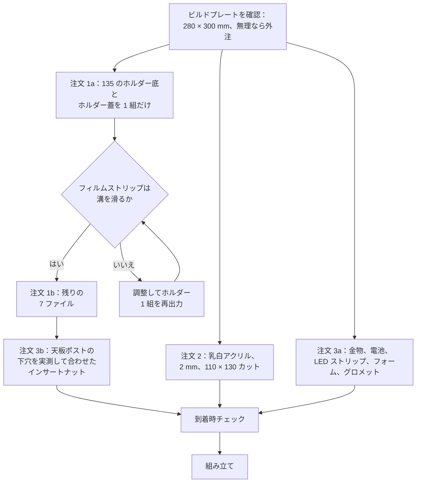

# 部品表と調達

[English](bom.md) · [简体中文](bom.zh-CN.md) · **日本語**

> NeoBox を作るために買うものすべて——部品、工具、消耗品——を、「間違ったほうを買わずに済む仕様」つきでまとめたページです。日本・中国・その他の地域の店舗にそのまま貼り付けられる発注文面も収めています。

**目次：** [費用](#費用) · [このリポジトリが用意しないもの](#このリポジトリが用意しないもの) · [工具と消耗品](#工具と消耗品) · [プリントパーツ](#プリントパーツ) · [購入部品](#購入部品) · [磁石](#磁石) · [正しい部品を選ぶ](#正しい部品を選ぶ) · [光源](#光源) · [アルミ製フィルムステージ](#アルミ製フィルムステージ) · [発注の順番](#発注の順番) · [発注文面](#発注文面) · [部品が届いたら](#部品が届いたら)

---

## 費用

価格は 2026 年 7 月時点の中国 EC（タオバオ／1688）の実勢価格に基づく目安で、CNY 表記です。

| 区分 | 含まれるもの | 価格（CNY） |
|---|---|---|
| 3D プリント | 標準ビルドのプリントパーツ 8 点、白と黒の PLA | 150–280 |
| 拡散板 | 乳白アクリル、2 mm、110 × 130 mm カット | 8–15 |
| 金物 | 寸切りボルト 3 本、ナット 6 個、インサートナット 3 個、EVA フォームテープ、グロメット 2 個、USB LED ストリップ | 46–80 |
| 電池 | ニッケル水素単 3 形 8 本——ストロボ用に 2 セット | 60–100 |
| **ストロボを除くビルド全体** | 上記すべてを一度ずつ | **JPY 5,500–9,000 · CNY 250–420** |

> [!NOTE]
> 各行の上限どうし・下限どうしを単純に足すと CNY 264–475 になりますが、**現実的な合計は CNY 250–420** です。すべての行が同時に最安・最高になることはないからです。振れ幅のほとんどは 3 行に集中しています——出力代行（上下で CNY 130 の差）、電池（CNY 40）、金物（CNY 34）。手持ちの電池と充電器を流用すれば CNY 60–100 が丸ごと落ち、この範囲より下のおよそ CNY 190–320 になります。JPY の数字は同じビルドを円で表したもので、**すべての部品を日本国内で買った場合の見積もりではありません**。

この合計に含めず、別に見積もる項目が 2 つあります——[アルミ製フィルムステージ](#アルミ製フィルムステージ)（CNY 80–200）と、[磁石と鉄ワッシャー](#磁石)（CNY 5–10 と CNY 3–5）です。

---

## このリポジトリが用意しないもの

NeoBox は光源です。フィルムをスキャナに通す代わりにデジタルカメラで複写する[カメラスキャン](glossary.ja.md#カメラスキャン-camera-scanning)（camera scanning、DSLR スキャンとも）のセットアップの片側でしかありません。もう片側は自分で用意することになります。

| すでに持っているか、買う必要があるもの | 役割 |
|---|---|
| カメラ本体 | マニュアル露出と raw が使えるものなら何でも |
| マクロ撮影のできるレンズ | 24 × 36 mm という小さなコマを画面いっぱいに写す。普通のレンズはそこまで寄れない |
| 複写スタンド（copy stand）、または水平アーム・反転可能なセンターポールを持つ三脚 | カメラをフィルムの真上に、再現性のある高さで保持する |
| ストロボとトリガーのセット | 基準にした組み合わせと価格は[光源](#光源)に記載 |
| カメラのホットシューに載せるトリガー送信機 | 基準にしたトリガーセットに同梱——ただしそのセットはビルド費用に含まれない |
| レリーズ | 露光中にカメラを押してしまわないため |
| 反転（inversion）ソフト | raw のネガを陽画に変換する |

> [!IMPORTANT]
> CNY 250–420 で買えるのは箱だけです。ストロボとトリガー（基準にした組み合わせで 2 点合計 CNY 350–550）も、上の表のカメラ側の機材も、いっさい含まれていません。何かを発注する前に、[はじめに の「すでに持っている必要があるもの」](getting-started.ja.md#すでに持っている必要があるもの)を読んでください。

カメラ側の選び方と使い方は [scanning.ja.md](scanning.ja.md#カメラ側の機材) が扱います。このページは箱を作る部品で終わりです。

---

## 工具と消耗品

特殊なものは 1 つもなく、ほとんどは手元にあるかもしれませんが、どの行もビルド中に最低一度は必要になります。

| 工具・消耗品 | 用途 | 仕様 |
|---|---|---|
| はんだごて | 天板のポストに[インサートナット](glossary.ja.md#インサートナット-heat-set-insert)（heat-set insert）3 個を熱圧入する | PLA なら約 200–250 ℃。円錐チップでも可、インサート専用チップならなお良い |
| スパナまたはプライヤー、M6（対辺 10 mm） | 各寸切りボルトの下ナットと上ナット | 1 本より 2 本——片方を押さえてもう片方を回す |
| デザインナイフ | 各ホルダー底の[溝](glossary.ja.md#溝-channel)の入口のバリ取り | 刃を新しくしたものなら何でも |
| 瞬間接着剤 | 鉄ワッシャーと磁石の固定 | 小瓶 1 本 |
| 弱粘着のマスキングテープ | 塗装前に拡散チャンバーと開口を養生する | 100 × 120 mm の開口を一枚で覆える幅 |
| つや消し黒スプレー（PLA に使えるもの） | 本体の外側と天板の上面 | アクリル系またはエナメル系 |
| ブロアー | 毎セッション、拡散板の両面と[フィルムゲート](glossary.ja.md#フィルムゲート-film-gate)の清掃 | エアダスターではなくゴム球のブロアー |
| 小さな平面鏡（30 mm 程度） | 組立と撮影で使う平行出しの手順 | 平らな鏡の端材で可 |
| 綿手袋、または清潔な手 | フィルムを縁だけで持つ | — |
| 金尺またはノギス | このページ末尾の到着時チェック | 300 mm の金尺なら 279.6 mm の天板を測り切れる |
| ニッケル水素充電器 | 電池は充電式で、放電状態で届く | **上の合計には入っていません**——持っていなければ金物の注文に足してください |

熱いこて、スプレー塗料、そして 24 個の強力な小型磁石は、始める前に読んでおく価値があります：[組み立ての「工具と安全」](assembly.ja.md#工具と安全)へ。

---

## プリントパーツ


標準ビルドは**プリントパーツ 8 点**です。9 番目のファイルであるオプションの 6×6 マスクを加えると、リポジトリの STL は **9 ファイル**——必須 8 点＋オプション 1 点——になります。

| 色 | パーツ | ファイル数 | フィラメント |
|---|---|---|---|
| 白・マット | 本体、天板、アクセスパネル | 3 | ≈ 0.7–0.95 kg |
| 黒 | ホルダー底 ×2、ホルダー蓋 ×2、フィルムステージ | 5 | ≈ 0.25–0.4 kg |
| 黒・オプション | 6×6 マスク | 1 | 5.6 cm³——無視できる量 |
| **合計** | 必須 8 点、オプション 1 点 | **9** | **≈ 1–1.3 kg** |

> [!IMPORTANT]
> 自宅で出力できるかどうかは 2 点のパーツで決まります。本体と天板には **280 × 300 mm 以上**の[ビルドプレート](glossary.ja.md#ビルドプレートのサイズ-bed-size)が必要で、しかも効いてくるのは本体ではなく **214.6 × 279.6 mm の天板**のほうです。残り 7 ファイルは 256 × 256 mm のプレートに収まり、220 × 220 mm のプレートでは長辺 230 mm のプリント版フィルムステージ以外がすべて収まります——実際に使える範囲は自分の機体で測ってから判断してください。ホビー機で一般的な 220 × 220 mm や 256 × 256 mm では、この 2 点はそもそも出力できません。2 点だけ外注するか、8 点まとめて外注してください。

> [!WARNING]
> 白フィラメントは**マット必須**です。シルクや光沢の白は、ストロボの発光部をホットスポットとしてそのままフィルムに写し込みます。拡散チャンバーの内側は無塗装のフィラメント面のまま——内側は塗装もコーティングもしません——なので、光沢で出力してしまうと後から直す方法はなく、マットで刷り直すしかありません。ショップには「希望」ではなく「要件」として伝えてください。「できればマットで」と言うと、機械に今かかっているフィラメントが出てきます。

黒いパーツは PLA でも PETG でも構いません。PETG はホルダーに使うと丈夫、PLA は平面が出やすい、という違いです。積層ピッチ（layer height）、[インフィル](glossary.ja.md#インフィル-infill)、[サポート](glossary.ja.md#サポート-supports)、パーツごとの出力カードは [printing.ja.md](printing.ja.md#プリント設定) にあります。このページは「何を発注するか」だけを扱います。

白と黒を 1 回の注文にまとめるのは普通のことで、用意してあるバンドルもその構成です——1 店舗、1 注文、2 色。支払う前に、フィラメント交換が別料金になるのか、それとも 2 バッチ目に回されるのかを確認してください。

---

## 購入部品

### 買うもの

| 項目 | 仕様 | 数量 | 価格（CNY） |
|---|---|---|---|
| 乳白アクリル拡散板 | 2 mm、110 × 130 mm カット | 1（2–3 枚発注） | 8–15 |
| 全ねじ寸切りボルト | M6 × 35 mm、頭なし、端から端までねじ | 3 | 10–20 |
| 六角ナット | M6 | 6 | 上に込み |
| インサートナット | M6 真鍮、外径は天板ポストの下穴に合わせる——最後に発注すること。[正しい部品を選ぶ](#正しい部品を選ぶ)を参照 | 3 | 10–15 |
| EVA フォームテープ | 片面粘着、厚さ 2 mm | 1 巻 | 8–15 |
| ゴムグロメット | 取付穴径 Ø12 mm | 2 | 3–5 |
| USB LED ストリップ | 5 V、インライン調光、昼白色、白ケーブル | 1 | 15–25 |
| ニッケル水素単 3 形 | ストロボ用に 2 セット | 8 | 60–100 |

寸切りボルト 3 本、ナット 6 個、インサートナット 3 個——このビルドの構造用金物はこれで全部です。筐体をねじで締めている箇所はありません。天板は載せるだけ、アクセスパネルは摩擦で留まり、寸切りボルトはフィルムステージを支えて水平を出すためだけに存在します。

数量が 2 つだけ不自然に見えますが、いずれも間違いではありません。**拡散板は 2–3 枚**：乳白アクリルは輸送中にカット端が欠けやすく、しかも光路のど真ん中に置かれるので傷がそのまま写ります。2 枚目のカット代はほとんどかかりませんが、送り直すと 1 週間かかります。**グロメットは 2 個**：Ø12 mm のケーブルグランド穴は右側の壁に 1 か所だけですが、コネクタで 1 個目を裂いたときに予備が欲しくなります。

EVA フォームテープの必要量はどこまでやるかによります。アクセスパネルのプラグ（186 × 72 mm）を一周させると約 516 mm、壁の上端に任意のシールを回すなら 208 × 273 mm の外周に沿ってさらに約 960 mm です。両方をまかなえる長さの巻きを買ってください。幅はプラグの厚み 4 mm 分あれば足り、余分はデザインナイフで切り落とします。

### 地域別の検索ワード

同じ部品でも言葉が違うと見つかりません。各行に 3 地域分を並べてあります。

| 項目 | 日本（Amazon.jp／モノタロウ／ヨドバシ） | 中国（タオバオ／1688） | その他の地域（英語） |
|---|---|---|---|
| 乳白アクリル拡散板 | `乳半アクリル板 2mm 切断` | `乳白亚克力板 定制 2mm` | `opal acrylic sheet 2 mm cut to size` |
| 全ねじ寸切りボルト | `寸切ボルト M6×35` | `M6牙条 35mm` または `全螺纹螺柱 M6×35` | `M6 × 35 fully threaded stud` / `M6 studding` |
| 六角ナット | `六角ナット M6` | `M6螺母` | `M6 hex nut` |
| インサートナット | `インサートナット 熱圧入 M6 真鍮` | `热熔铜螺母 M6` | `M6 brass heat-set insert` |
| EVA フォームテープ | `EVA スポンジテープ 片面粘着 厚2mm` | `EVA海绵条 背胶 2mm` | `self-adhesive EVA foam tape 2 mm` |
| ゴムグロメット | `配線用グロメット 取付穴径12mm` | `橡胶过线圈 12mm` | `rubber cable grommet, 12 mm mounting hole` |
| USB LED ストリップ | `USB LEDテープライト 5V 調光 昼白色` | `USB LED灯带 5V 线控调光 自然白` | `USB LED strip 5 V dimmable neutral white` |
| ニッケル水素単 3 形 | `エネループ 単3形 8本` | `爱乐普 AA` | `NiMH AA rechargeable, 8 cells` |
| ニッケル水素充電器 | `ニッケル水素 充電器 単3` | `镍氢电池 充电器 4槽` | `NiMH AA charger` |
| ネオジム磁石 | `ネオジム磁石 丸型 6×2` | `钕磁铁 6x2mm` | `neodymium disc magnet 6 × 2 mm` |
| 鉄ワッシャー | `平座金 M6 外径12 鉄・ユニクロ` | `铁垫片 M6 Ø12` | `M6 steel washer, 12 mm OD, zinc plated` |
| 3D プリント出力代行 | `3Dプリント 出力代行 大型 PLA` | `3D打印 代打 大尺寸 PLA` | JLC3DP、PCBWay、Craftcloud、または地元のメイカースペース |
| アルミ製フィルムステージ | `アルミ板 A5052 t3 レーザー切断 黒アルマイト` | `5052铝板 CNC 定制 阳极氧化` | `5052 aluminium 3 mm laser cut, black anodised` |

> [!WARNING]
> 中国側で検索するとき、`M6全牙螺丝`——一見それらしく、古い発注メモにも書かれていた語——では六角頭やキャップボルトばかりが出てきて、そのままでは使えません。この部品は**頭のない**寸切りである必要があります。下端はインサートナットにねじ込み、上端は下ナットと上ナットを受ける、という具合に両端とも使うからです。`M6牙条` または `全螺纹螺柱` で検索してください。

---

## 磁石

Ø6 × 2 mm の磁石が 24 個、フィルムホルダー 1 台あたり 12 個。役割はまったく違う 2 種類に分かれます。以前の部品表はこれを全部「箱を縦置きするときだけ」に分類していましたが、これは誤りでした。大半はホルダーを閉じておくための磁石です。

| 役割 | 個数 | 入る場所 | 買うべきか |
|---|---|---|---|
| 閉じ込み用 | **16**——ホルダー 1 台あたり 8 個、引き合う 4 組 | ホルダー底の (±45, ±75) に 4 か所、ホルダー蓋にそれと向き合う 4 か所 | **どのビルドでも推奨。** これがないとホルダー蓋は自重だけで押さえられることになり、平置きなら足りますが縦置きでは足りません。 |
| 底–ステージ間 | **8**——ホルダー 1 台あたり 4 個、＋ **Ø12 鉄ワッシャー 4 枚** | ホルダー底の (±25, ±75) のポケット。ワッシャーはフィルムステージの上面に接着 | 箱を縦置きする場合のみ。 |

24 個すべてで CNY 5–10、鉄ワッシャー 4 枚で CNY 3–5 ですから、閉じ込み用の 16 個だけを注文しても節約になりません。底–ステージ間の磁石を省くならワッシャーも不要になり、その代わり箱は平置きのまま使うことになります。

> [!WARNING]
> この磁石は皮膚を挟んで合わさると強く挟み込みますし、ばらのネオジム磁石は子どもやペットにとって深刻な誤飲事故のもとです。予備は蓋つきの容器に入れて保管してください。極性は表示されていません。ホルダー底用とホルダー蓋用を 1 個ずつ合わせて引き合うことを確かめ、接着剤を開ける**前に**それぞれの上面に印を付けてください。向きを逆に接着すると、ホルダー蓋を押さえるどころか押し上げてしまい、そのパーツは元に戻せません。手順は[ステップ 5 — ホルダーのマグネットを取り付ける](assembly.ja.md#ステップ-5--ホルダーのマグネットを取り付ける)にあります。

---

## 正しい部品を選ぶ

お金を払ったのに使えないものが届く、代表的な 7 パターンです。

| 部品 | ありがちな失敗 | 何を指定するか |
|---|---|---|
| [乳白](glossary.ja.md#乳白-opal)（オパール）アクリル拡散板 | フロスト（つや消し）アクリルを買ってしまう | 乳白は板そのものが乳白色で、板の内部で光を散らします。フロストは透明アクリルの片面を荒らしただけで、ストロボの発光部が写ります。「乳半、光拡散用、2 mm」と伝えたうえでカット寸法を指定してください。ショップがグレードを選ばせる場合、密度の高い板ほど光量を食う代わりに均一性が上がります。ストロボの出力には余裕がありますが、このプロジェクトは透過率の数値を確定していないので、価格が許すなら 2 グレード頼んで良かったほうを残してください。 |
| 全ねじ寸切りボルト | 頭付きのボルトを買ってしまう | 頭なし、端から端までねじ。両端とも使います。 |
| インサートナット | 外径を間違える | M6 のインサートナットは外径も長さも複数あり、それぞれ必要な下穴が違います。公開ファイルには天板ポストの下穴径を記載していません。**天板が届いてから**インサートを発注し、ポスト 3 本の穴を実測して、その寸法に合うものを選んでください。 |
| 鉄ワッシャー | ステンレスを買ってしまう | ステンレスのワッシャーはほとんど磁石に付きませんが、この部品は磁石に吸い付かせるためだけに存在します。鉄（ユニクロめっき）を指定し、届いた日に磁石を当てて確かめてください。 |
| ゴムグロメット | Ø12 をケーブル径だと読む | Ø12 mm は**取付穴**の径で、右側の壁のケーブルグランド穴に合わせた数字です。その壁の厚さは 3 mm です。 |
| USB LED ストリップ | 12 V 用を買ってしまう | USB から 5 V で動くものであること。AC 電源で動くものを筐体の中に入れてはいけませんし、インライン調光器は箱の外に出したままにします。貼り付ける壁は内側で 267 mm あるので、どの店でも最短の長さで十分足ります。 |
| EVA フォームテープ | 厚さを間違える | 効くのは 2 mm という数字です。アクセスパネルのプラグ（186 × 72 × 4 mm）と 190 × 76 mm のアクセス開口のあいだにある約 2 mm の隙間を埋めるのがこのテープで、その摩擦だけがパネルを保持しています。 |

---

## 光源

| 項目 | 仕様 | 価格（CNY） |
|---|---|---|
| NEEWER TT560 スピードライト | 190 × 75 × 55 mm、[ガイドナンバー（GN）](glossary.ja.md#ガイドナンバー-gn)38、[マニュアル 1/1–1/128](glossary.ja.md#マニュアル発光量-manual-power-fraction)（1 段刻み）、≈ 5600 K | 200–300 |
| ZENIKO T1 トリガーセット | 39 × 38 × 29.5 mm、2.4 GHz 送信機＋受信機 | 150–250 |

ストロボ選びで効いてくるのは 2 点だけです——**マニュアルで発光量を決められること**と、発光部が 90° 回ること。閉じた箱の中では [TTL](glossary.ja.md#ttl-through-the-lens-調光) も [HSS](glossary.ja.md#hss-ハイスピードシンクロ) も何もしません。そこにお金を払わないでください。

T1 は発光量を遠隔で変えられないので、出力を変えるたびにアクセスパネルを抜くことになります。実際にはこれはキャリブレーションのときに一度きりです。TT560 は 1 段刻みで 8 段しかないため、露出の微調整はレンズ側の 1/3 段で行います。

> [!WARNING]
> **公開している STL は TT560 専用です。** [design.ja.md](design.ja.md#別のストロボへの一般化) の式は別のストロボ用の寸法を出してくれますが、ファイルの寸法までは変えてくれません。ストロボを差し替えるということは、`cad/neobox.blend` を編集して再エクスポートするということです。差し替える前に、発光部が 90° 回ること、発光量がマニュアルで決められること、そして横に寝かせた状態でストロボ本体が長さ 190 mm 以下・厚さ 55 mm 以下であることを確認してください。どれか 1 つでも外れたら、筐体の寸法から導き直すことになります。

---

## アルミ製フィルムステージ

任意のアップグレードで、このビルドで唯一、機械加工の業者が絡む部品です。

| 項目 | 仕様 | ファイル | 価格（CNY） |
|---|---|---|---|
| アルミ製フィルムステージ | 5052、3 mm、黒アルマイト、外形 200 × 230 mm、開口 100 × 120 mm、Ø6.5 mm のバカ穴（clearance hole）3 か所 | `cad/film-stage-aluminium-3mm.dxf` | 80–200 |

プリント版とアルミ版は上面の高さが同じなので、そのまま入れ替えられます。まずプリント版のフィルムステージで組み、後から交換しても構いません。アルミは平面度が高く、そのまま保たれます。フィルムステージはシステム全体の基準平面なので、これは効いてきます。

> [!CAUTION]
> 3 つの穴に絶対にタップを立てないでください。ねじの切られた板が、同じピッチのインサートナットの上で回ると[差動ねじ](glossary.ja.md#差動ねじ-differential-screw)（differential screw）になります——2 つのねじが打ち消し合い、ナットを回してもステージの高さが動かなくなります。Ø6.5 mm の[バカ穴](glossary.ja.md#バカ穴とタップ穴-clearance-hole-vs-tapped-hole)のままでなければなりません。

業者が「変えましょうか」と提案してくることが 2 つあり、どちらも断ってください。

- 手前の穴は DXF 座標で (145, 15) にあります。この非対称は意図的で、その寸切りボルトをフィルムの抜き取り通路から外すためのものです。「対称に直しておきますね」を許さないでください。
- 3 mm 板に長方形の開口 1 か所と丸穴 3 か所——これはレーザーかウォータージェットの仕事です。CNC で見積もっても、同じ結果に余計なお金を払うだけです。

アルミ版にコーナーブロックはありません。プリント版のフィルムステージはコーナーブロックを一体で出力します。コーナーブロック単体の STL は用意されていません——`cad/neobox.blend` の中でブロックはステージのオブジェクトに融合しているので、切り替えるなら Blender でその形状を分離して単体でエクスポートするか、5 mm の端材から L 字を 4 個切り出して接着するかのどちらかになります。座標を含めた両方の手順は [design.ja.md](design.ja.md#4-フィルムステージ) にあります。業者から「5052 はアルマイトのムラが出る」と言われたら、同じ板につや消し黒の塗装でも構いません。ここで買っているのは平面度であって、表面処理ではありません。

---

## 発注の順番

注文は 3 系統、納期はまるで違い、そのうち 2 つは 2 回に分けたほうが得です。



| 注文 | 標準的な納期 | いつ出すか |
|---|---|---|
| 1a — 135 のホルダー底とホルダー蓋を 1 組 | 2–5 日＋輸送 | 最初 |
| 1b — 残りの 7 ファイル | 2–5 日＋輸送 | 溝の寸法が合ってから |
| 2 — 乳白アクリル、カット指定 | 3–7 日 | 最初、1a と並行して |
| 3a — 金物と電池、**インサートナットを除く** | 翌日〜数日 | いつでも |
| 3b — インサートナット 3 個 | 翌日〜数日 | 天板が届き、ポスト 3 本の下穴を実測してから——[正しい部品を選ぶ](#正しい部品を選ぶ)を参照 |
| アルミ製フィルムステージ（任意） | いちばん長い——見積り、切断、アルマイトが別々の工程になる | 箱が動くようになってから |

フィルムの溝は 0.4 mm で、成立するかしないかがはっきり分かれる唯一の嵌合です。ホルダー 1 組でそれを確かめておけば、余分にかかるのは輸送 1 往復だけで、7 点の刷り直しを避けられます。何を見るかは [まず 135 ホルダーを 1 組だけ出力する](printing.ja.md#まず-135-ホルダーを-1-組だけ出力する) にあります。

出力代行に支払う前に確認したい質問が 3 つあります。

- [ ] どの機械で出力しますか。実際に使えるビルドボリュームはいくつですか。
- [ ] 本体を 208 × 273 × 92 mm のまま、分割せずに一体で出力できますか。
- [ ] **マット**の白 PLA の在庫はありますか。

> [!TIP]
> このプロジェクトでは梱包が普段以上に重要です。プリントパーツには厚めのプチプチを巻いてもらってください——本体は壁 3 mm で、圧力で変形します。アクリルはその内側に挟んで送ってもらってください。乳白アクリルは端が欠けます。

---

## 発注文面

そのまま貼り付けられる発注文面です。それぞれ、店が読む言語で書いてあります。内容は [printing.ja.md の「出力サービスへの発注」](printing.ja.md#出力サービスへの発注)と一致しています。あちらはパーツごとのリファレンスとして同じ指示を載せているので、片方の設定を変えたらもう片方も直してください。

9 ファイルのうち 3 つは読み込んだ姿勢が出力姿勢と違い、スライサーは自動では回してくれません。以下の文面はどれも、必要な回転を明示し、上に向ける面を作業者が画面上で見て分かる特徴で指定しています。

> [!TIP]
> 中国で発注する場合、`stl/` から自分でファイルを選び出す必要はありません。`taobao-order/打印.zip` に必須の 8 点がすでに白フォルダと黒フォルダに分けて入っています。ショップに送るのはこのファイルです。リポジトリ直下の `taobao-order.zip` はバンドル一式で、同じファイルにオプションのマスクと元の発注メモが加わったものです。

<details>
<summary>3D プリント発注文面——日本の出力代行向け、日本語</summary>

```
必須 8 点、任意 1 点（mask-6x6）、合計 9 ファイルです。
単位はミリ、スケール変更は不可。積層ピッチは全ファイル 0.2 mm。
白はマット必須です（シルク／光沢はストロボの発光部が
明るい斑点として写り込みます）。

白 PLA 3 点：
  - main-body.stl（箱の本体、外形 273×208×92、
    ビルドプレート 280×300 mm 以上が必要）
    置き方：平らな底面をプレートに、大きな開口を上。
            読み込んだ状態のままで回転不要。
    サポート：前面の壁にある幅 190 mm の角穴の上辺のみ。
  - top-cover.stl（天板 214.6×279.6、
    ビルドプレート 280×300 mm 以上が必要）
    置き方：読み込むと 10 mm の立ち上がり縁と 3 本の丸い柱が下向きです。
            X 軸まわりに 180° 回転し、大きな平面をプレートに、
            立ち上がり縁と 3 本の柱を上にしてください。サポート不要。
  - access-panel.stl（アクセスパネル 200×78）
    置き方：読み込むと立っています。寝かせて、裏面の四角い出っ張り
            （186×72×4）をプレートに、取っ手を上にしてください。
    サポート：フェイス板が出っ張りより一回り大きく、
            その庇になっている部分に必要です。

黒 PLA 5 点：
  - film-holder-135-base.stl / film-holder-120-base.stl（ホルダー底 2 点）
    置き方：平らな面をプレートに、2 本の長いレールがある面を上。
            サポート不要。
  - film-holder-135-lid.stl / film-holder-120-lid.stl（ホルダー蓋 2 点）
    置き方：読み込むと 2 本の短い押さえリブが下向きです。X 軸まわりに
            180° 回転し、大きな平面をプレートに、押さえリブを上に。
            サポート不要。
  - film-stage-printed.stl（フィルムステージ 200×230、インフィル 30 % 以上）
    置き方：平面をプレートに、四隅のコーナーブロックを上
            （設計上の突起で、欠陥ではありません）。

任意：mask-6x6.stl（6×4.5 / 6×6 の撮影時のみ）。黒、平置き、サポート不要。

その他：外周 3 周以上、インフィル 15–25 %。
```

先方が細かい指定を嫌う場合は、この二点だけ守ってもらってください。

```
積層ピッチは全ファイル 0.2 mm、置き方は上記のとおり。
サポートが必要なのは 2 か所だけです。main-body 前面の角穴の上辺と、
access-panel のフェイス板が庇になっている部分。
```

まず 135 のホルダー底＋ホルダー蓋を 1 組だけ出力し、溝の寸法を確認してから残りを発注してください。検索ワード：`3Dプリント 出力代行 大型 PLA`

</details>

<details>
<summary>3D プリント発注文面——中国のショップ（タオバオ／1688）に送る中国語の文面</summary>

```
必打 8 个 STL，另有 1 个可选（mask-6x6），共 9 个文件。
单位毫米，请勿缩放。全部用默认 0.2 层高。
白色必须是哑光料（丝面／亮面会把灯头映成亮斑）。

白色 PLA 3 件：
  - main-body.stl（主箱，外框 273×208×92，需要 ≥280×300 打印床）
    摆放：平底朝下、大开口朝上。导入即是这个朝向，不用旋转。
    支撑：只有正面竖墙上那个 190mm 宽方口的上边缘要支撑。
  - top-cover.stl（顶盖 214.6×279.6，需要 ≥280×300 打印床）
    摆放：导入时裙边和 3 个圆柱朝下，请绕 X 轴旋转 180°；
          平的大面朝下贴床，裙边和 3 个圆柱朝上。免支撑。
  - access-panel.stl（抽口盖板 200×78）
    摆放：导入时是立着的，请放倒；背面凸起的方台朝下贴床，把手朝上。
    支撑：面板比方台宽一圈，这一圈悬空要支撑。

黑色 PLA 5 件：
  - film-holder-135-base.stl / film-holder-120-base.stl（两个夹底座）
    摆放：平的那面朝下，带两条长导轨（长凸条）的面朝上。免支撑。
  - film-holder-135-lid.stl / film-holder-120-lid.stl（两个夹上盖）
    摆放：导入时两条短压条朝下，请绕 X 轴旋转 180°；
          平的大面朝下，压条朝上。免支撑。
  - film-stage-printed.stl（胶片台 200×230，填充 ≥30%）
    摆放：平面朝下，四角 L 形挡块朝上（挡块是设计特征，不是缺陷）。

可选：mask-6x6.stl（拍 6×4.5 / 6×6 才用），黑色，平放，免支撑。

其余默认：壁 ≥3 圈、填充 15–25%。
```

店家嫌啰嗦时，只需咬住这两句：

```
全部默认 0.2 层高、按上面写的朝向摆。
要支撑的只有两处：main-body 正面方口的上边缘，
和 access-panel 面板悬空的那一圈。
```

先让店家打一副 135 夹（夹底座＋夹上盖）试装滑槽，合适再打其余。搜索词：`3D打印 代打 大尺寸 PLA`

</details>

<details>
<summary>3D プリント発注文面——その他の地域、英語</summary>

```
9 STL files: 8 required, 1 optional (mask-6x6). Millimetres. Do not scale.
0.2 mm layers on every file. White must be MATTE - silk or gloss reproduces
the flash head as a bright spot on the film.

White PLA, 3 parts:
  main-body.stl (bounding box 273 x 208 x 92; needs a build plate of
    280 x 300 mm or more)
    Placement: flat floor on the plate, big open mouth up. It loads in this
    orientation already - do not rotate it.
    Supports: only the top edge of the 190 mm wide rectangular opening in
    the front wall.
  top-cover.stl (214.6 x 279.6; needs a build plate of 280 x 300 mm or more)
    Placement: it loads with the 10 mm downstand rim and the three round
    pillars pointing DOWN. Rotate 180 degrees about X so the large flat face
    is on the plate and the rim and pillars point up. No supports.
  access-panel.stl (200 x 78)
    Placement: it loads standing on edge. Lay it down, with the face carrying
    the raised rectangular plug (186 x 72 x 4) on the plate and the handle
    pointing up.
    Supports: under the lip where the face plate overhangs that plug.

Black PLA, 5 parts:
  film-holder-135-base.stl / film-holder-120-base.stl
    Placement: flat face on the plate, the face with the two long ridges up.
    No supports.
  film-holder-135-lid.stl / film-holder-120-lid.stl
    Placement: they load with the two short pressure ribs pointing DOWN.
    Rotate 180 degrees about X: large flat face on the plate, ribs up.
    No supports.
  film-stage-printed.stl (200 x 230; infill 30 % or more)
    Placement: flat face on the plate, the four corner blocks up. Those
    blocks are a design feature, not a defect.

Optional: mask-6x6.stl - only for 6x4.5 and 6x6. Black, flat, no supports.

Everything else default: 3 or more perimeters, 15-25 % infill.
```

135 のホルダー底とホルダー蓋を 1 組だけ先に出力して溝を確認し、それから残りの 7 ファイルを発注してください。

</details>

<details>
<summary>乳白アクリルのカット発注文面——日本語、中国語、英語</summary>

日本（アクリル通販・レーザー加工ショップ）：

```
乳半（乳白半透明）アクリル 厚 2 mm、110×130 mm に 3 枚切断してください。
表面をつや消しにした透明板ではなく、板そのものが光を拡散する
乳半材でお願いします。
```

中国（タオバオ／1688）：

```
乳白半透明亚克力 2mm 厚，110×130mm，切 3 块。
要乳白（板体本身扩散），不要磨砂透明板。
```

その他の地域：

```
Opal (white translucent, light-diffusing) acrylic, 2 mm thick,
cut 3 pieces at 110 x 130 mm.
Opal, not frosted clear - the sheet itself must diffuse, not just its surface.
```

いずれの場合も図面は不要です。カット寸法が仕様のすべてです。

</details>

<details>
<summary>アルミ製フィルムステージの発注文面——日本語、中国語、英語</summary>

日本（板金・レーザー加工ショップ。`cad/film-stage-aluminium-3mm.dxf` を添付）：

```
A5052 アルミ板 t3.0、外形 200×230 mm、中央に 100×120 mm の開口。
Ø6.5 の穴 3 か所はバカ穴です。タップは立てないでください
（前側の穴は (145, 15)。非対称は設計意図なので「修正」しないでください）。
表面は黒アルマイト（アルマイトが難しい場合はつや消し黒塗装で可）。
図面：cad/film-stage-aluminium-3mm.dxf
```

中国（タオバオ／1688。検索ワード `5052铝板 CNC 定制 阳极氧化`、`cad/film-stage-aluminium-3mm.dxf` を添付）：

```
5052 铝板 3mm，外形 200×230，中间开口 100×120。
图上 3 个 Ø6.5 孔是光孔，请勿攻丝
（前孔在 (145,15)，非对称是设计意图，勿"修正"为对称）。
表面黑色阳极氧化（做不了阳极就哑光黑喷涂）。
```

その他の地域：

```
5052 aluminium, 3 mm thick. Outline 200 x 230 mm, central aperture
100 x 120 mm.
The three 6.5 mm diameter holes are CLEARANCE holes - do not tap them.
The front hole at (145, 15) is deliberately off-centre. Do not "correct" it
to a symmetrical layout.
Finish: black anodised. If anodising is not available, matte black paint.
Drawing: cad/film-stage-aluminium-3mm.dxf
```

</details>

### 店から難色を示されたら

| 言われること | 実際の意味 | どうするか |
|---|---|---|
| 「うちのプレートは 256 × 256 ですが、入りますよ」 | 縮小するか分割するかしかない | どちらも受け入れられません。残り 7 ファイルだけ出力してもらい、本体と天板は別の店へ。 |
| 「白は光沢しか在庫がありません」 | その表面が全コマにホットスポットとして写る | マットが入るまで待つか、白の 3 点を別の店に移してください。黒のパーツは影響を受けません。 |
| 「中を肉抜き／壁を薄くして材料を節約しましょうか」 | 頼んでいないモデル改変 | 断ってください。壁 3 mm、床 4 mm は設計値です。 |
| 「0.12 か 0.16 の積層のほうがきれいに出ますよ」 | その積層ピッチではホルダーの 0.4 mm 形状が割り切れない | 全ファイル 0.2 mm。代替は 0.1 mm だけです。 |
| 「念のため全体にサポートを入れておきます」 | フィルムに面する面に傷が残る | サポートは 2 か所だけです。アクセス開口の上辺と、アクセスパネルの庇になっている部分。 |
| 「5052 はアルマイトが均一に乗らないので 6061 で」 | 合金の実際の制約 | 5052 のまま、つや消し黒塗装で妥協してください。ここで効くのは平面度で、表面処理ではありません。 |

---

## 部品が届いたら

接着・塗装・ねじ止めのどれかを始める前に、以下を確認してください。出力代行でいちばん多い事故はスライサーが「プレートに合わせて縮小」のままだったというもので、279.6 mm のパーツはまさにそれを誘発します。

- [ ] **天板**——長辺が 279.6 mm あること。短ければファイルが縮小されています。そのパーツだけでなく、出力全体を突き返してください。
- [ ] **本体**——外側で 208 × 273 mm、床から壁の上端まで 92 mm。
- [ ] **アクセス開口**——前面の壁の角穴が 190 × 76 mm。
- [ ] **フィルムステージ**——外形 200 × 230 mm。板の厚さは 5 mm で、コーナーブロックが全体で 11 mm まで立ち上がっていること。
- [ ] **ステージの穴**——M6 の寸切りボルトが 3 か所とも自重で落ちること。Ø6.5 mm のバカ穴です。きつい穴は 6.5 mm のドリルで手回しして揉んでください。絶対にタップを立てないこと。
- [ ] **嵌合**——天板が力を入れずに本体へ落ちること。
- [ ] **拡散板**——明かりに透かすと、透明に抜けた部分も明るい斑もなく、全面が均一に乳白であること。保護フィルムは組立まで貼ったままにし、そのとき**両面とも**剥がします。
- [ ] **鉄ワッシャー**——磁石が吸い付くこと。付かなければステンレスなので返品してください。
- [ ] **磁石**——ホルダー底用とホルダー蓋用を合わせて引き合うことを確かめ、接着剤を開ける前にそれぞれの上面に印を付けること。
- [ ] **LED ストリップ**——USB モバイルバッテリーで点灯し、インライン調光器が実際に効くこと。

どれか 1 つでも落ちたものは、ビルドに入る前に[トラブルシューティング](troubleshooting.ja.md#プリント)行きです。全部にチェックが入ったら、自宅で出力する人は [printing.ja.md](printing.ja.md#組み立てる前に各パーツを確認する) のパーツごとの確認へ、外注した人はそのまま[組み立て](assembly.ja.md)へ進んでください。

---

← [はじめに](getting-started.ja.md) · [ドキュメント一覧](../README.ja.md#ドキュメント) · [3D プリント](printing.ja.md) →
