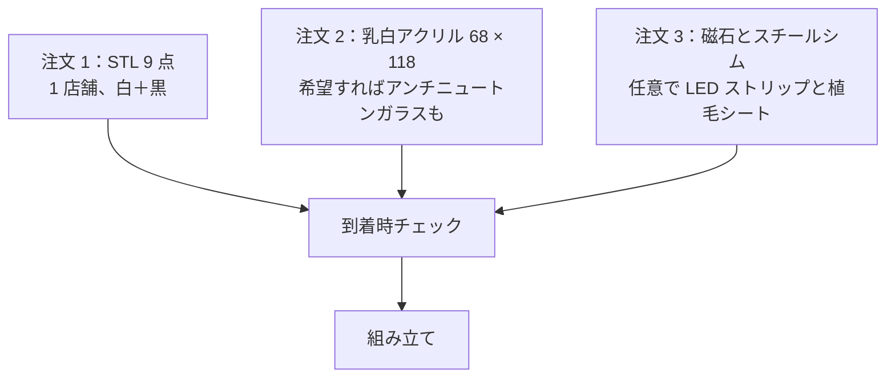

# 部品表と調達

[English](bom.md) · [简体中文](bom.zh-CN.md) · **日本語**

> NeoBox を作るために買うものすべてをまとめたページです。v5 ではリストが短くなりました。工具も締結部品もいっさい不要になったからです。「間違ったほうを買わずに済む仕様」と、日本・中国・その他の地域の店舗にそのまま貼り付けられる発注文面つきです。

**目次：** [費用](#費用) · [このリポジトリが用意しないもの](#このリポジトリが用意しないもの) · [工具と消耗品](#工具と消耗品) · [プリントパーツ](#プリントパーツ) · [購入部品](#購入部品) · [磁石](#磁石) · [正しい部品を選ぶ](#正しい部品を選ぶ) · [光源](#光源) · [発注の順番](#発注の順番) · [発注文面](#発注文面) · [部品が届いたら](#部品が届いたら)

---

## 費用

価格は 2026 年 8 月時点の中国 EC（タオバオ／1688）の実勢価格に基づく目安で、CNY 表記です。

| 区分 | 含まれるもの | 価格（CNY） |
|---|---|---|
| 3D プリント | プリントパーツ 9 点、白と黒の PLA | 50–110 |
| 拡散板 | 乳白アクリル、2 mm、68 × 118 mm カット | 5–10 |
| 磁石とシム | ネオジム磁石 32 個、スチールシム 4 枚 | 10–20 |
| **ストロボを除くビルド全体** | 上記すべてを一度ずつ | **JPY 1,500–3,000 · CNY 65–140** |

> [!NOTE]
> 各行を極値どうしで足すとちょうど CNY 65–140 になり、その大半は出力代行の代金です。これは v4（CNY 250–420）のおよそ 3 分の 1 です。寸切りボルト、ナット、インサートナット、フォームテープ、グロメット、塗装がすべてなくなり、プリントパーツもすべて小さくなりました。v4 をお持ちなら、旧拡散板を裁ち直せばアクリルの行は 0 になります。JPY の数字は同じビルドを円で表したもので、すべての部品を日本国内で買った場合の見積もりではありません。

この合計に含めず、別に見積もる項目が 3 つあります。任意アップグレードの[アンチニュートンガラス](#購入部品)（CNY 15–30）、[USB LED ストリップ](#購入部品)（CNY 10–20）、[植毛シート](#購入部品)（CNY 5–10）です。3 つ全部でおよそ CNY 30–60 です。

---

## このリポジトリが用意しないもの

NeoBox は光源です。フィルムをスキャナに通す代わりにデジタルカメラで複写する[カメラスキャン](glossary.ja.md#カメラスキャン-camera-scanning)（camera scanning、DSLR スキャンとも）のセットアップの片側でしかありません。もう片側は自分で用意することになります。

| すでに持っているか、買う必要があるもの | 役割 |
|---|---|
| カメラ本体 | マニュアル露出と raw が使えるものなら何でも |
| マクロ撮影のできるレンズ | 24 × 36 mm という小さなコマを画面いっぱいに写す。普通のレンズはそこまで寄れない |
| 複写スタンド（copy stand）、または水平アーム・反転可能なセンターポールを持つ三脚 | カメラをフィルムの真上に、再現性のある高さで保持する |
| ストロボとトリガーのセット | マニュアルで発光量を決められるホットシューストロボなら何でも。基準にした組み合わせと価格は[光源](#光源)に記載 |
| カメラのホットシューに載せるトリガー送信機 | 基準にしたトリガーセットに同梱。ただしそのセットはビルド費用に含まれない |
| レリーズ | 露光中にカメラを押してしまわないため |
| 反転（inversion）ソフト | raw のネガを陽画に変換する |

> [!IMPORTANT]
> CNY 65–140 で買えるのは箱だけです。ストロボとトリガー（基準にした組み合わせで 2 点合計 CNY 350–550）も、上の表のカメラ側の機材も、いっさい含まれていません。何かを発注する前に、[はじめに の「すでに持っている必要があるもの」](getting-started.ja.md#すでに持っている必要があるもの)を読んでください。

カメラ側の選び方と使い方は [scanning.ja.md](scanning.ja.md#カメラ側の機材) が扱います。このページは箱を作る部品で終わりです。

---

## 工具と消耗品

このセクションに「必須」の項目は、今回初めて 1 つもありません。v5 のビルドにはねじも接着剤も塗装も工具もありません。磁石は手で圧入し、それ以外のパーツはすべて置くだけで収まります。机に残るのは、箱を「作る」ためではなく「使う」ための品だけです。

| 工具・消耗品 | 用途 | 仕様 |
|---|---|---|
| ブロアー | 拡散板、インサート、[フィルムゲート](glossary.ja.md#フィルムゲート-film-gate)の清掃。アンチニュートンガラスを買った場合は、取り付け前の除塵にも | エアダスターではなくゴム球のブロアー |
| 小さな平面鏡（30 mm 程度） | 平行出しの手順：ステージに鏡を置き、ファインダーでレンズ自身の映り込みを中央に合わせる | 平らな鏡の端材で可 |
| 綿手袋、または清潔な手 | フィルムを縁だけで持つ | — |
| 金尺またはノギス | このページ末尾の到着時チェック | 200 mm あれば 154.8 mm のパーツを測り切れる |

32 個の強力な小型磁石については、始める前に読んでおく価値があります。[組み立ての「工具と安全」](assembly.ja.md#工具と安全)へ。

---

## プリントパーツ


ビルドは**プリントパーツ 9 点**。白 2 点、黒 7 点、すべてサポートレスです。

| ファイル | 色 | 外形（mm） | 内容 |
|---|---|---|---|
| main-body.stl | 白 | 124.8 × 154.8 × 75.6 | 本体：床と三方の壁、前面は全開 |
| cover-stage.stl | 白 | 124.8 × 154.8 × 10.0 | 天板ステージ：天板とフィルムステージを 1 パーツに統合したもの |
| film-holder-135-base.stl | 黒 | 94 × 120 × 5 | 135 ホルダー底、開口 25 × 37 |
| film-holder-135-lid.stl | 黒 | 94 × 120 × 3 | 135 ホルダー蓋 |
| film-holder-120-base.stl | 黒 | 94 × 120 × 5 | 120 ホルダー底、開口 57 × 85（6×9 フルフレーム） |
| film-holder-120-lid.stl | 黒 | 94 × 120 × 3 | 120 ホルダー蓋 |
| pressure-window-135.stl | 黒 | 64 × 95 × 2 | 135 用の押さえ窓インサート |
| pressure-window-120.stl | 黒 | 64 × 95 × 2 | 120 用の押さえ窓インサート |
| mask-6x6.stl | 黒 | 94 × 80 × 1 | 6×6 マスク。120 ホルダー底の下に敷く |

出力仕様は注文にそのまま書き込みます：普通の PLA、積層ピッチは全パーツ 0.2 mm、インフィル 15 %、どのファイルにも[サポート](glossary.ja.md#サポート-supports)なし。すべてのパーツは平らな面をプレートに向けて出力し、ホルダー蓋の 2 点だけは仕上がりの上面を下に向けます。積層ピッチ、[インフィル](glossary.ja.md#インフィル-infill)、パーツごとの出力カードは [printing.ja.md](printing.ja.md#プリント設定) にあります。このページは「何を発注するか」だけを扱います。

> [!IMPORTANT]
> どのファイルも **160 × 160 mm** の[ビルドプレート](glossary.ja.md#ビルドプレートのサイズ-bed-size)に収まります。最大のパーツでも 154.8 mm です。v4 の「280 × 300 mm 以上」という条件はなくなり、220 mm プレートに関する旧ドキュメントの警告も過去のものになりました。一般的なホビー機なら、全パーツを自宅で出力できます。

> [!WARNING]
> 白フィラメントは**マット必須**です。白の 2 点は拡散チャンバーそのもので、ストロボの光は拡散板に届くまでにこの壁で何度も反射します。シルクや光沢の白は発光部をホットスポットとして写し込みます。内側は塗装もコーティングもしないので、光沢で出力してしまうと後から直す方法はなく、マットで刷り直すしかありません。ショップには「希望」ではなく「要件」として伝えてください。「できればマットで」と言うと、機械に今かかっているフィラメントが出てきます。

白と黒を 1 回の注文にまとめるのは普通のことです。1 店舗、1 注文、2 色。支払う前に、フィラメント交換が別料金かどうかを確認してください。mask-6x6.stl は 6×6 を撮るときにしか使いませんが、フィラメント 1 g 程度なので、同じ注文から外す理由はありません。

---

## 購入部品

### 買うもの

| 項目 | 仕様 | 数量 | 価格（CNY） |
|---|---|---|---|
| 乳白アクリル拡散板 | 2 mm、68 × 118 mm カット | 1（2 枚発注） | 5–10 |
| ネオジム磁石 | Ø8 × 2 mm、N35、普通の軸方向磁化の円板 | 32（予備を数個） | 8–15 |
| スチールシム | 10 × 10 × 1 mm の角板、または Ø10 × 1 mm の円板 | 4 | 2–5 |
| アンチニュートンガラス（任意） | 64 × 95 × 2 mm、片面 AN 処理。1 枚で両判型共用 | 1 | 15–30 |
| USB LED ストリップ（任意） | 5 V USB、120 mm × 2 本 | 1 | 10–20 |
| 黒の植毛シート（任意） | 粘着つき、A5 | 1 | 5–10 |

最初の 3 行が標準ビルドの購入部品のすべてで、ねじは 1 か所もありません。残りの 3 行は、なくても箱が成立するアップグレードです。アンチニュートンガラスはプリントの押さえ窓インサート 2 枚をガラス 1 枚（両判型共用）で置き換えるもの、LED ストリップは内壁に貼る常時点灯の位置決めライト、植毛シートは窓のまわりのステージ面の反射を消すものです。

発注上の注意が 2 つ。**拡散板は 2 枚**：乳白アクリルは輸送中にカット端が欠けやすく、しかも光路のど真ん中に置かれます。2 枚目のカット代はほとんどかかりませんが、送り直すと 1 週間かかります。v4 からのアップグレードなら、旧拡散板（110 × 130 mm）は同じ 2 mm の乳半材です。アクリルを扱う店ならどこでも 68 × 118 mm に裁ち直してくれるので、この行は注文から消えます。**磁石は数個の予備を**：圧入は縁の欠けた磁石に容赦がなく、N35 の円板は 1 個数円です。

### 地域別の検索ワード

同じ部品でも言葉が違うと見つかりません。各行に 3 地域分を並べてあります。

| 項目 | 日本（Amazon.jp／モノタロウ／ヨドバシ） | 中国（タオバオ／1688） | その他の地域（英語） |
|---|---|---|---|
| 乳白アクリル拡散板 | `乳半アクリル板 2mm 切断` | `乳白亚克力板 定制 2mm` | `opal acrylic sheet 2 mm cut to size` |
| ネオジム磁石 | `ネオジム磁石 丸型 8×2` | `钕磁铁 8x2mm N35` | `neodymium disc magnet 8 × 2 mm N35` |
| スチールシム | `平座金 M5 外径10 鉄・ユニクロ` | `铁片 10x10x1` または `M5平垫片 外径10 铁` | `mild steel shim 10 × 10 × 1 mm` / `M5 steel washer, 10 mm OD` |
| アンチニュートンガラス | `アンチニュートンガラス` | `防牛顿环玻璃 定制` | `anti-Newton glass, cut to size` |
| USB LED ストリップ | `USB LEDテープライト 5V 調光 昼白色` | `USB LED灯带 5V 线控调光 自然白` | `USB LED strip 5 V dimmable neutral white` |
| 植毛シート | `植毛シート 黒 粘着` | `黑色植绒布 背胶 A5` | `self-adhesive black flocking sheet` |
| 3D プリント出力代行 | `3Dプリント 出力代行 PLA` | `3D打印 代打 PLA` | JLC3DP、PCBWay、Craftcloud、または地元のメイカースペース |

---

## 磁石

Ø8 × 2 mm・N35 のネオジム磁石が 32 個。ホルダーの 4 パーツ（底 2 点、蓋 2 点）にそれぞれ 8 個ずつ入ります。すべて手で圧入する締まりばめで、このビルドに接着剤は一滴も登場しません。

| 役割 | 仕組み |
|---|---|
| ホルダーを閉じておく | 蓋の 8 個と底の 8 個が向かい合い、ホルダー 1 台につき 8 組の引き合うペアになる |
| ホルダーを天板ステージに留める | 底の磁石が、天板ステージの座ぐりに面一で収まる 4 枚のスチールシムを底板越しに引き付ける。持ち上げれば外れ、判型の交換は数秒 |

32 個は予備込みで CNY 8–15 です。底の磁石が吸い付く相手が[スチールシム 4 枚](#購入部品)なので、この 2 行は同じ注文にまとめてください。シムを省くと、ホルダーをステージに留めるものが何もなくなります。

> [!WARNING]
> この磁石は皮膚を挟んで合わさると強く挟み込みますし、ばらのネオジム磁石は子どもやペットにとって深刻な誤飲事故のもとです。予備は蓋つきの容器に入れて保管してください。極性は表示されておらず、圧入は接着剤と大差ないほど外しにくいものです。底用と蓋用の磁石を 1 組ずつ合わせて引き合うことを確かめ、どれか 1 個でも押し込む**前に**それぞれの上面へ印を付けてください。向きを逆に圧入すると、蓋を押さえるどころか押し上げてしまい、掘り出そうとすればたいてい穴ごと駄目になります。手順は[ステップ 1 — マグネットを圧入する](assembly.ja.md#ステップ-1--マグネットを圧入する)にあります。

---

## 正しい部品を選ぶ

お金を払ったのに使えないものが届く、代表的な 6 パターンです。

| 部品 | ありがちな失敗 | 何を指定するか |
|---|---|---|
| [乳白](glossary.ja.md#乳白-opal)（オパール）アクリル拡散板 | フロスト（つや消し）アクリルを買ってしまう | 乳白は板そのものが乳白色で、板の内部で光を散らします。フロストは透明アクリルの片面を荒らしただけで、ストロボの発光部が写ります。「乳半、光拡散用、2 mm」と伝え、68 × 118 mm のカット寸法を指定してください。密度の高い板ほど光量を食う代わりに均一性が上がります。ストロボの出力には余裕があります。 |
| ネオジム磁石 | 厚さを間違える | ポケットは Ø8 × 2 mm の普通の軸方向磁化円板に合わせてあります。3 mm では飛び出して蓋を押し上げ、1 mm では深く沈みすぎて吸着しません。N35 が普通のグレードで、それで十分です。N52 は高いだけで、余分な吸着力の使い道がありません。 |
| スチールシム | ステンレスを買ってしまう | ステンレスの多くはほとんど磁石に付きませんが、この 4 枚は磁石に吸い付かせるためだけに存在します。鉄（ユニクロめっき等）を指定し、厚さは 1 mm まで。座ぐりの深さが 1 mm で、シムは面一に収まる必要があります。10 × 10 mm の角板でも Ø10 mm の円板でも入ります。 |
| アンチニュートンガラス | すりガラスを買ってしまう | アンチニュートンガラスはスキャナや引き伸ばし機の部品で、片面に目でほとんど分からないほど薄い処理があり、像を拡散させずにニュートンリングを抑えます。すりガラスは拡散板なので、シャープネスが壊れます。「片面アンチニュートン処理、64 × 95 × 2 mm」と指定してください。 |
| USB LED ストリップ | 12 V 用を買ってしまう | USB から 5 V で動くものであること。AC 電源で動くものを箱に近づけてはいけません。120 mm を 2 本、内壁に貼って常時点灯の位置決めライトにします。カットできる 5 V ストリップなら何でも使えます。 |
| 黒の植毛シート | フェルトや光沢のシートを買ってしまう | 植毛シートは表面がベルベット状の粘着シートです。フェルトは厚すぎ、光沢のシートは反射します。つや消し黒・粘着つき。A5 が 1 枚あれば窓のまわりのステージ面を覆えます。 |

---

## 光源

| 項目 | 仕様 | 価格（CNY） |
|---|---|---|
| ホットシューストロボ、ブランド不問（基準機：NEEWER TT560） | 必須条件はマニュアル発光量のみ。基準機 TT560 は[ガイドナンバー（GN）](glossary.ja.md#ガイドナンバー-gn)38、[マニュアル 1/1–1/128](glossary.ja.md#マニュアル発光量-manual-power-fraction)（1 段刻み）、≈ 5600 K | 200–300 |
| ZENIKO T1 トリガーセット、または任意の 2.4 GHz セット | 送信機＋受信機 | 150–250 |

ストロボ本体は箱の中に入りません。机の上に平置きし、発光部を本体の完全に開いた前面開口に当てて、白い拡散チャンバーへ向けて発光させます。受信機もストロボに付けたまま、箱の外です。旧版の制約が消えたのはこの置き方のおかげです。電波はさえぎられず、電池交換で箱に触れる必要はなく、発光量の変更はストロボ本体のダイヤルでそのまま行えます。

ストロボ選びで本当に効くのは 1 点だけ、**発光量をマニュアルで決められること**です。[TTL](glossary.ja.md#ttl-through-the-lens-調光) も [HSS](glossary.ja.md#hss-ハイスピードシンクロ) もここでは何の役にも立ちません。そこにお金を払わないでください。v4 のもう 1 つの条件だった「発光部が 90° 回ること」は、密閉筐体と一緒になくなりました。ストロボは寝かせたまま水平に発光します。

> [!NOTE]
> 「公開している STL は TT560 専用」という v4 の警告はなくなりました。箱のどの寸法もストロボ本体に依存しないので、確認すべき長さ・厚さの上限もありません。表に TT560 が残っているのは、安価で入手しやすい基準機としてであって、要件ではありません。手元にマニュアル発光のストロボがあるならそれを使ってください。

---

## 発注の順番

注文は 3 系統。すべて同じ日に出せて、互いに待つ必要はありません。



| 注文 | 標準的な納期 | いつ出すか |
|---|---|---|
| 1：STL 9 点 | 2–5 日＋輸送 | 最初。いちばん時間がかかる |
| 2：乳白アクリル、カット指定 | 3–7 日 | 同じ日に、1 と並行して |
| 3：磁石とスチールシム | 翌日〜数日 | いつでも |
| アンチニュートンガラス、LED ストリップ、植毛シート（任意） | 3–7 日 | 注文 2・3 と一緒に。箱が動いてからでも（プリントのインサートが標準構成） |

何かが何かを待つ工程はもうありません。「天板のポスト穴を実測してからインサートナットを買う」という v4 のルールは、インサートナットもろとも消えました。外注で保険を掛けたければ、先に 135 のホルダーを 1 組だけ出力してもらい、フィルムが滑るか確かめてください（[まず 135 ホルダーを 1 組だけ出力する](printing.ja.md#まず-135-ホルダーを-1-組だけ出力する)）。ここまでパーツが小さくなった今、これは念のためであって、かつてのような関門ではありません。

出力代行に支払う前に確認したい質問が 3 つあります。

- [ ] **マット**の白 PLA の在庫はありますか。
- [ ] 積層ピッチは店の標準に置き換えず、指定どおり 0.2 mm で出力してもらえますか。
- [ ] 白と黒を 1 注文にまとめた場合、フィラメント交換は別料金ですか。

> [!TIP]
> 梱包は引き続き重要です。プリントパーツには厚めのプチプチを頼み（壁は 2.4 mm しかありません）、アクリルはその内側に挟んで送ってもらってください。乳白アクリルは端が欠けます。

---

## 発注文面

そのまま貼り付けられる発注文面です。それぞれ、店が読む言語で書いてあります。内容は [printing.ja.md の「出力サービスへの発注」](printing.ja.md#出力サービスへの発注)と一致しています。あちらはパーツごとのリファレンスとして同じ指示を載せているので、片方の設定を変えたらもう片方も直してください。

9 ファイルはすべてサポート不要で、直感に反する置き方はホルダー蓋 2 点だけ。仕上がりの上面をプレートに向けます。以下の文面はどれもその点を明記しています。スライサーは自動では置き直してくれません。

<details>
<summary>3D プリント発注文面：日本の出力代行向け、日本語</summary>

```
合計 9 ファイルです。単位はミリ、スケール変更は不可。
普通の PLA：白 2 点、黒 7 点。白はマット必須です
（シルク／光沢はストロボの発光部が明るい斑点として写り込みます）。
積層ピッチは全ファイル 0.2 mm、
インフィル 15 %、全ファイル サポート不要。
置き方：すべて平らな面をプレートに。ただしホルダー蓋 2 点
（film-holder-135-lid / film-holder-120-lid）のみ、
仕上がりの上面をプレートに向けてください。

白 PLA 2 点：
  main-body.stl        124.8×154.8×75.6
  cover-stage.stl      124.8×154.8×10
黒 PLA 7 点：
  film-holder-135-base.stl   94×120×5
  film-holder-135-lid.stl    94×120×3
  film-holder-120-base.stl   94×120×5
  film-holder-120-lid.stl    94×120×3
  pressure-window-135.stl    64×95×2
  pressure-window-120.stl    64×95×2
  mask-6x6.stl               94×80×1

最大のパーツは 154.8 mm。ビルドプレートは 160×160 mm で足ります。
```

先方が細かい指定を嫌う場合は、この二点だけ守ってもらってください。

```
積層ピッチは全ファイル 0.2 mm、インフィル 15 %、サポート不要、
すべて平面をプレートに（ホルダー蓋 2 点のみ上面を下に）。白はマット必須。
```

念のため、まず 135 のホルダー底＋蓋を 1 組だけ出力し、フィルムが滑ることを確認してから残りを発注するのも手です。検索ワード：`3Dプリント 出力代行 PLA`

</details>

<details>
<summary>3D プリント発注文面：中国のショップ（タオバオ／1688）に送る中国語の文面</summary>

```
共 9 个 STL 文件，单位毫米，请勿缩放。
普通 PLA：白色 2 件、黑色 7 件。白色必须是哑光料
（丝面／亮面会把灯头映成亮斑）。
层高一律 0.2，填充 15%，全部免支撑。
摆放：全部平面朝下；只有两个夹上盖
（film-holder-135-lid / film-holder-120-lid）成品顶面朝下贴床。

白色 PLA 2 件：
  main-body.stl        124.8×154.8×75.6
  cover-stage.stl      124.8×154.8×10
黑色 PLA 7 件：
  film-holder-135-base.stl   94×120×5
  film-holder-135-lid.stl    94×120×3
  film-holder-120-base.stl   94×120×5
  film-holder-120-lid.stl    94×120×3
  pressure-window-135.stl    64×95×2
  pressure-window-120.stl    64×95×2
  mask-6x6.stl               94×80×1

最大件 154.8mm，160×160 打印床即可，不需要大尺寸机器。
```

店家嫌啰嗦时，只需咬住这两句：

```
层高 0.2、填充 15%、全部免支撑、平面朝下
（只有两个夹上盖顶面朝下）。白色必须哑光。
```

如需保险，可先让店家打一副 135 夹（夹底座＋夹上盖）试片条滑动，合适再打其余。搜索词：`3D打印 代打 PLA`

</details>

<details>
<summary>3D プリント発注文面：その他の地域、英語</summary>

```
9 STL files. Millimetres. Do not scale.
Plain PLA: 2 white parts, 7 black parts. White must be MATTE -
silk or gloss reproduces the flash head as a bright spot on the film.
0.2 mm layers on every file, 15% infill,
no supports on any file.
Placement: every part flat face down, except the two lids
(film-holder-135-lid, film-holder-120-lid): their finished TOP face
goes on the plate.

White PLA, 2 parts:
  main-body.stl        124.8 x 154.8 x 75.6
  cover-stage.stl      124.8 x 154.8 x 10
Black PLA, 7 parts:
  film-holder-135-base.stl   94 x 120 x 5
  film-holder-135-lid.stl    94 x 120 x 3
  film-holder-120-base.stl   94 x 120 x 5
  film-holder-120-lid.stl    94 x 120 x 3
  pressure-window-135.stl    64 x 95 x 2
  pressure-window-120.stl    64 x 95 x 2
  mask-6x6.stl               94 x 80 x 1

Largest part 154.8 mm: a 160 x 160 mm bed is enough.
```

保険を掛けるなら、まず 135 のホルダー底と蓋を 1 組だけ出力し、フィルムストリップが滑るのを確認してから残り 7 ファイルを発注してください。

</details>

<details>
<summary>乳白アクリルとアンチニュートンガラスのカット発注文面：日本語、中国語、英語</summary>

日本（アクリル通販・レーザー加工ショップ）、アクリル：

```
乳半（乳白半透明）アクリル 厚 2 mm、68×118 mm に 2 枚切断してください。
表面をつや消しにした透明板ではなく、板そのものが光を拡散する
乳半材でお願いします。
```

日本、アンチニュートンガラス（任意）：

```
アンチニュートンガラス（片面 AN 処理）、厚 2 mm、64×95 mm に 1 枚。
すりガラスではなく、スキャナや引き伸ばし機に使う
アンチニュートンガラスでお願いします。
```

中国（タオバオ／1688）、アクリル：

```
乳白半透明亚克力 2mm 厚，68×118mm，切 2 块。
要乳白（板体本身扩散），不要磨砂透明板。
```

中国、アンチニュートンガラス（任意）：

```
防牛顿环玻璃，单面 AN 处理，2mm 厚，裁 64×95mm 一片。
要扫描仪／放大机用的防牛顿环玻璃，不是磨砂玻璃。
```

その他の地域、アクリル：

```
Opal (white translucent, light-diffusing) acrylic, 2 mm thick,
cut 2 pieces at 68 x 118 mm.
Opal, not frosted clear - the sheet itself must diffuse, not just its surface.
```

その他の地域、アンチニュートンガラス（任意）：

```
Anti-Newton glass, single-side AN treatment, 2 mm thick,
one piece cut to 64 x 95 mm.
Scanner / enlarger AN glass - not ground or frosted glass.
```

いずれの場合も図面は不要です。カット寸法が仕様のすべてです。

</details>

### 店から難色を示されたら

| 言われること | 実際の意味 | どうするか |
|---|---|---|
| 「白は光沢しか在庫がありません」 | その表面が全コマにホットスポットとして写る | マットが入るまで待つか、白の 2 点を別の店へ。黒のパーツは影響を受けません。 |
| 「中を肉抜き／壁を薄くして材料を節約しましょうか」 | 頼んでいないモデル改変 | 断ってください。壁 2.4 mm、床 3.0 mm は設計値です。 |
| 「0.12 か 0.16 の積層のほうがきれいに出ますよ」 | 無断の仕様変更 | 全ファイル 0.2 mm。設計の高さグリッドが 0.2 mm なので、これより粗い積層では段差が層境界に載りません。それ以外は変えないでください。 |
| 「念のため全体にサポートを入れておきます」 | フィルムに面する面に傷が残る | どのファイルにもサポートは不要です。すべてサポートレスで設計されています。 |

---

## 部品が届いたら

磁石を 1 個でも圧入する前に、以下を確認してください。出力代行でいちばん多い事故は今も、スライサーの「プレートに合わせて縮小」が入ったままというものです。金尺で測れば捕まえられます。

- [ ] **本体**：外形 124.8 × 154.8 mm、床から壁の上端まで 75.6 mm。短ければファイルが縮小されています。出力全体を突き返してください。
- [ ] **天板ステージ**：124.8 × 154.8 mm。力を入れずに壁の上に載り、4 つの位置決めダボがそれぞれのダボ穴に収まること。
- [ ] **フィルムホルダー**：蓋が底に平らに載り、フィルムストリップが底の[溝](glossary.ja.md#溝-channel)を滑らかに通ること。
- [ ] **押さえ窓インサート**：それぞれのホルダー底のエレメント段に収まり、平らに座ること。
- [ ] **拡散板**：全面が均一に乳白で、透明に抜けた部分も明るい斑もないこと。天板ステージ裏面の受け溝に収まること。保護フィルムは組立まで貼ったままにし、そのとき**両面とも**剥がします。
- [ ] **スチールシム**：磁石が吸い付くこと（付かなければステンレスなので返品）。座ぐりに入れて面一になり、ステージ面から飛び出さないこと。
- [ ] **磁石**：底用と蓋用を 1 組ずつ合わせて引き合うことを確かめ、どれか 1 個でも圧入する前に上面へ印を付けること。
- [ ] **アンチニュートンガラス（買った場合）**：64 × 95 mm で、片面にごく薄いマットの AN 処理があること。
- [ ] **LED ストリップ（買った場合）**：USB モバイルバッテリーで点灯すること。

どれか 1 つでも落ちたものは、ビルドに入る前に[トラブルシューティング](troubleshooting.ja.md#プリント)行きです。全部にチェックが入ったら、自宅で出力する人は [printing.ja.md](printing.ja.md#組み立てる前に各パーツを確認する) のパーツごとの確認へ、外注した人はそのまま[組み立て](assembly.ja.md)へ進んでください。

---

← [はじめに](getting-started.ja.md) · [ドキュメント一覧](../README.ja.md#ドキュメント) · [3D プリント](printing.ja.md) →
