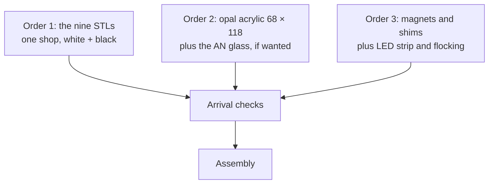

# Bill of materials and sourcing

**English** · [简体中文](bom.zh-CN.md) · [日本語](bom.ja.md)

> Everything you have to buy for a NeoBox. The v5 list is short, because the build needs no tools and no fasteners; each part comes with the specification that stops you buying the wrong version, plus copy-paste ordering text for shops in China, Japan and everywhere else.

**Contents:** [What it costs](#what-it-costs) · [What this repo does not buy for you](#what-this-repo-does-not-buy-for-you) · [Tools and consumables](#tools-and-consumables) · [Printed parts](#printed-parts) · [Parts you buy](#parts-you-buy) · [Magnets](#magnets) · [Getting the right part](#getting-the-right-part) · [Light source](#light-source) · [Ordering sequence](#ordering-sequence) · [Vendor scripts](#vendor-scripts) · [When the parts arrive](#when-the-parts-arrive)

---

## What it costs

Prices are indicative, in CNY, from Chinese marketplaces (Taobao / 1688) as of August 2026.

| Group | What it covers | Price (CNY) |
|---|---|---|
| 3D printing | the 9 printed parts, white and black PLA | 50–110 |
| Diffuser | opal acrylic, 2 mm, cut 68 × 118 mm | 5–10 |
| Magnets and shims | 32 neodymium magnets, 4 steel shims | 10–20 |
| **Whole build, excluding the flash** | everything above, once | **CNY 65–140 · JPY 1,500–3,000** |

> [!NOTE]
> Added line by line, the extremes bracket exactly CNY 65–140, and the print order is most of it. That is roughly a third of what a v4 cost (CNY 250–420): the studs, nuts, heat-set inserts, foam, grommets and paint are all gone, and every printed part shrank. If you own a v4, re-cutting its diffuser takes the acrylic line to zero. The JPY figure is the same build expressed in yen, not a quote for buying every line inside Japan.

The three optional upgrades are priced separately and never inside that total: [anti-Newton glass](#parts-you-buy) at CNY 15–30, the [USB LED strip](#parts-you-buy) at CNY 10–20 and the [flocking sheet](#parts-you-buy) at CNY 5–10. All three together come to about CNY 30–60.

---

## What this repo does not buy for you

NeoBox is a light source. It is one half of a [camera scanning](glossary.md#camera-scanning) setup (photographing film with a digital camera instead of running it through a scanner), and the other half is yours.

| You must already own or buy | What it does |
|---|---|
| Camera body | any body with manual exposure and raw files |
| Macro-capable lens | you photograph a frame as small as 24 × 36 mm; an ordinary lens will not focus that close |
| Copy stand, or a tripod with a horizontal or reversible column | holds the camera square above the film at a repeatable height |
| Flash and trigger set | any hot-shoe flash with manual power control; the reference pair is specified and priced under [Light source](#light-source) |
| Trigger transmitter for the camera hot shoe | supplied with the reference trigger set, but that set is not in the build cost |
| Remote release | so you do not push the camera while it exposes |
| Inversion software | turns the raw negative into a positive image |

> [!IMPORTANT]
> CNY 65–140 buys the box and nothing else. It excludes the flash and trigger (CNY 350–550 together for the reference pair) and every camera-side item above. Read [what you must already own](getting-started.md#what-you-must-already-own) before you order anything.

Choosing and using the camera side is [scanning.md](scanning.md#camera-side-equipment). This document stops at the parts that make the box.

---

## Tools and consumables

For the first time, this section lists no requirements. The v5 build has no screws, no glue, no paint and no tools: the magnets press in by hand and everything else drops into place. What stays on the desk is for using the box, not building it.

| Tool or consumable | What it is for | Specification |
|---|---|---|
| Rocket blower | dusting the diffuser, the inserts and the [film gate](glossary.md#film-gate), and the AN glass before it goes in, if you bought one | a bulb blower, not canned air |
| Small flat mirror, about 30 mm | the parallelism method: it sits on the stage while you centre the lens's own reflection in the viewfinder | any flat mirror offcut |
| Cotton gloves, or clean hands | handling film by its edges | — |
| Steel rule or calipers | the arrival checks at the foot of this page | 200 mm reaches across the 154.8 mm parts |

Thirty-two small, strong magnets still want reading about before you start: [Tools and safety](assembly.md#tools-and-safety).

---

## Printed parts


The build is **9 printed parts**: 2 white, 7 black, all of them support-free.

| File | Colour | Footprint (mm) | What it is |
|---|---|---|---|
| main-body.stl | white | 124.8 × 154.8 × 75.6 | main box: floor and three walls, front fully open |
| cover-stage.stl | white | 124.8 × 154.8 × 10.0 | cover-stage: lid and film stage merged into one part |
| film-holder-135-base.stl | black | 94 × 120 × 5 | 135 holder base, 25 × 37 gate |
| film-holder-135-lid.stl | black | 94 × 120 × 3 | 135 holder lid |
| film-holder-120-base.stl | black | 94 × 120 × 5 | 120 holder base, 57 × 85 gate (full 6×9 frame) |
| film-holder-120-lid.stl | black | 94 × 120 × 3 | 120 holder lid |
| pressure-window-135.stl | black | 64 × 95 × 2 | 135 pressure-window insert |
| pressure-window-120.stl | black | 64 × 95 × 2 | 120 pressure-window insert |
| mask-6x6.stl | black | 94 × 80 × 1 | 6×6 mask, sits under the 120 base |

The print spec, written straight into the order: ordinary PLA, 0.2 mm layers on every file, 15 % infill, no [supports](glossary.md#supports) on any file. Every part prints flat face down except the two holder lids, which print top face down. Layer height, [infill](glossary.md#infill) and the per-part cards are in [printing.md](printing.md#print-settings); this page only tells you what to order.

> [!IMPORTANT]
> Every file fits a **160 × 160 mm** [bed](glossary.md#bed-size): the largest footprint in the build is 154.8 mm. v4's 280 × 300 mm requirement is gone, and so are the old warnings about 220 mm beds. Any common hobby printer prints the whole set at home.

> [!WARNING]
> White filament must be **matte**. The two white parts are the diffusion cavity: the flash bounces off those walls several times before it reaches the diffuser, and silk or glossy white reproduces the flash head as a hot spot. The inside is never painted or coated, so a glossy part cannot be fixed after it is printed, only reprinted in matte. Tell the shop this is a requirement, not a preference: "matte preferred" gets you whatever is already loaded on the machine.

White and black in one order is normal: one shop, one order, two colours. Ask before you pay whether the filament change is charged separately. mask-6x6.stl is only used when shooting 6×6, but at a gram of filament there is no reason to leave it out of the order.

---

## Parts you buy

### What to buy

| Item | Specification | Qty | Price (CNY) |
|---|---|---|---|
| Opal acrylic diffuser | 2 mm, cut 68 × 118 mm | 1 (order 2) | 5–10 |
| Neodymium magnet | Ø8 × 2 mm, N35, plain axially-magnetised disc | 32 (order a few spares) | 8–15 |
| Steel shim | 10 × 10 × 1 mm square, or Ø10 × 1 mm round | 4 | 2–5 |
| Anti-Newton glass (optional) | 64 × 95 × 2 mm, one face AN; one sheet serves both formats | 1 | 15–30 |
| USB LED strip (optional) | 5 V USB, two 120 mm runs | 1 | 10–20 |
| Black flocking sheet (optional) | self-adhesive, A5 | 1 | 5–10 |

The first three lines are the entire bought-parts list of the default build, with nothing threaded anywhere. The last three are upgrades the box works without: the AN glass replaces the two printed pressure-window inserts with one sheet that serves both formats, the LED strip is a dim always-on positioning light for the inside walls, and the flocking sheet kills glare on the stage surface around the window.

Two ordering notes. **Order 2 diffusers**: opal acrylic chips at the cut edges in transit, it sits directly in the optical path, and a second cut costs almost nothing while a second shipping cycle costs a week. And if you are upgrading from a v4, its 110 × 130 mm diffuser is the same 2 mm opal; any acrylic shop will trim it to 68 × 118 mm, and the line drops out of the order. **Order a few spare magnets**: press-fitting is unforgiving of a chipped edge, and N35 discs cost pennies each.

### Search terms by region

The same part is unfindable with the wrong words, so each row carries all three.

| Item | China (Taobao / 1688) | Japan (Amazon.jp / Monotaro / Yodobashi) | Elsewhere (English) |
|---|---|---|---|
| Opal acrylic diffuser | `乳白亚克力板 定制 2mm` | `乳半アクリル板 2mm 切断` | `opal acrylic sheet 2 mm cut to size` |
| Neodymium magnet | `钕磁铁 8x2mm N35` | `ネオジム磁石 丸型 8×2` | `neodymium disc magnet 8 × 2 mm N35` |
| Steel shim | `铁片 10x10x1` or `M5平垫片 外径10 铁` | `平座金 M5 外径10 鉄・ユニクロ` | `mild steel shim 10 × 10 × 1 mm` / `M5 steel washer, 10 mm OD` |
| Anti-Newton glass | `防牛顿环玻璃 定制` | `アンチニュートンガラス` | `anti-Newton glass, cut to size` |
| USB LED strip | `USB LED灯带 5V 线控调光 自然白` | `USB LEDテープライト 5V 調光 昼白色` | `USB LED strip 5 V dimmable neutral white` |
| Black flocking sheet | `黑色植绒布 背胶 A5` | `植毛シート 黒 粘着` | `self-adhesive black flocking sheet` |
| 3D printing service | `3D打印 代打 PLA` | `3Dプリント 出力代行 PLA` | JLC3DP, PCBWay, Craftcloud, or a local makerspace |

---

## Magnets

Thirty-two Ø8 × 2 mm N35 magnets, eight in each of the four holder parts: both bases, both lids. They press into their pockets by hand, interference-fit, with no glue anywhere.

| What they do | How |
|---|---|
| Hold each holder shut | the 8 lid magnets face the 8 base magnets: 8 attracting pairs per holder |
| Hold the holder on the cover-stage | the base magnets pull, through the holder floor, on the 4 steel shims sitting flush in the cover-stage; lift and it pops free, so the format swap takes seconds |

CNY 8–15 buys all 32 with spares. What the base magnets grip is the [4 steel shims](#parts-you-buy), so the two lines belong in one order: skip the shims and nothing holds the holder to the stage.

> [!WARNING]
> Two of these magnets meeting across a fold of skin pinch hard, and loose neodymium magnets are a serious swallowing hazard for children and pets. Keep the spares in a closed container. Polarity is not marked, and a press-fit is not much easier to undo than glue: pair each base magnet with its lid magnet, confirm they attract, and mark the up-face of each **before** pressing any of them home. A magnet pressed in the wrong way round pushes the lid off instead of holding it shut, and digging it out usually wrecks the pocket. The procedure is [Step 1 — Press in the magnets](assembly.md#step-1--press-in-the-magnets).

---

## Getting the right part

Six ways to spend the money and receive something that does not work.

| Part | The mistake | What to specify |
|---|---|---|
| [Opal](glossary.md#opal) acrylic diffuser | Buying frosted acrylic | Opal is milky right through and scatters inside the sheet. Frosted is clear acrylic with one surface roughened, and it will show the flash head. Say "opal, light-diffusing, 2 mm" and give the 68 × 118 mm cut size. A denser grade costs light and buys evenness; the flash has power to spare. |
| Neodymium magnet | Buying the wrong thickness | The pockets fit Ø8 × 2 mm plain, axially magnetised discs. A 3 mm disc stands proud and holds the lid open; a 1 mm disc sits too deep to grip. N35 is the ordinary grade and is enough; N52 costs more and adds pull you do not need. |
| Steel shim | Buying stainless | Most stainless is barely magnetic, and these four exist only to give the magnets something to grip. Carbon steel or zinc-plated, 1 mm thick and no more: the counterbore is 1 mm deep and the shim must sit flush. 10 × 10 mm square or Ø10 mm round both fit. |
| Anti-Newton glass | Buying ground or frosted glass | AN glass is a scanner and enlarger part: one face carries an etch so faint you can barely see it, which stops Newton's rings without diffusing the image. Ground or frosted glass is a diffuser and destroys sharpness. Specify single-side anti-Newton, 64 × 95 × 2 mm. |
| USB LED strip | Buying a 12 V strip | It must run on 5 V from USB; nothing mains-powered goes anywhere near the box. Two 120 mm runs stick to the inside walls as a dim positioning light; any cuttable 5 V strip does it. |
| Black flocking sheet | Buying felt or glossy vinyl | Flocking is a velvet-surfaced self-adhesive sheet; felt is too thick and vinyl is shiny. Matte black, self-adhesive; one A5 sheet covers the stage surface around the window. |

---

## Light source

| Item | Specification | Price (CNY) |
|---|---|---|
| Hot-shoe flash, any brand (reference: NEEWER TT560) | manual power control is the only hard requirement; the reference TT560: [GN38](glossary.md#guide-number), [manual 1/1–1/128](glossary.md#manual-power-fraction) in full stops, ≈ 5600 K | 200–300 |
| ZENIKO T1 trigger set, or any 2.4 GHz set | transmitter + receiver | 150–250 |

The flash never goes inside the box. It lies flat on the desk with its head against the fully open front of the main body and fires into the white cavity; the receiver stays on it, outside. That placement is why the old constraints are gone: the radio signal is unobstructed, batteries change without touching the box, and power changes are made on the flash itself, in the open.

Only one thing matters when you choose a flash: **manual power control**. [TTL](glossary.md#ttl) and [HSS](glossary.md#hss) do nothing here, so do not pay for them. And v4's second requirement, a head that turns 90°, went away with the enclosure: the flash fires level, lying flat.

> [!NOTE]
> v4's warning that "the published STL files fit the TT560 and nothing else" is gone. No dimension of the box depends on the flash body, so there is no length or thickness limit to check. The TT560 stays in the table as a cheap, widely available reference, not a requirement; use whatever manual flash you own.

---

## Ordering sequence

Three orders, and all of them can go out on the same day. Nothing waits on anything else.



| Order | Typical lead time | When to place it |
|---|---|---|
| 1: the nine STLs | 2–5 days plus shipping | first; it is the long pole |
| 2: opal acrylic, cut to size | 3–7 days | the same day, in parallel |
| 3: magnets and shims | next day to a few days | any time |
| AN glass, LED strip, flocking (optional) | 3–7 days | with orders 2 and 3, or after the box works; the printed inserts are the default |

Nothing gates anything: v4's measure-first rule for heat-set inserts vanished with the inserts themselves. Outsourcing and want insurance anyway? Have the shop run one 135 holder base and lid first and check that a film strip slides: [Print one 135 holder first](printing.md#print-one-135-holder-first). With parts this small it is a nicety, not the gate it used to be.

Three questions to ask a print shop before you pay:

- [ ] Do you have **matte** white PLA in stock?
- [ ] Will you keep the 0.2 mm layer height as written, rather than switching to your house default?
- [ ] White and black in one order: is the filament change charged separately?

> [!TIP]
> Packing still matters. Ask for bubble wrap around the printed parts (the walls are 2.4 mm), and ask for the acrylic to travel sandwiched between them, because opal acrylic chips at the edges.

---

## Vendor scripts

Copy-paste briefs, each written in the language the shop reads. They agree with [Ordering from a print service](printing.md#ordering-from-a-print-service), which carries the same instructions as a per-part reference; change a setting in one place and change it in the other.

All nine files print support-free, and the only non-obvious placement is the two holder lids: finished top face down on the plate. Every brief below says so; slicers will not place parts for you.

<details>
<summary>3D printing brief: China (Taobao / 1688), in Chinese</summary>

```
共 9 个 STL 文件，单位毫米，请勿缩放。
普通 PLA：白色 2 件、黑色 7 件。白色必须是哑光料
（丝面／亮面会把灯头映成亮斑）。
层高一律 0.2，填充 15%，全部免支撑。
摆放：全部平面朝下；只有两个夹上盖
（film-holder-135-lid / film-holder-120-lid）成品顶面朝下贴床。

白色 PLA 2 件：
  main-body.stl        124.8×154.8×75.6
  cover-stage.stl      124.8×154.8×10
黑色 PLA 7 件：
  film-holder-135-base.stl   94×120×5
  film-holder-135-lid.stl    94×120×3
  film-holder-120-base.stl   94×120×5
  film-holder-120-lid.stl    94×120×3
  pressure-window-135.stl    64×95×2
  pressure-window-120.stl    64×95×2
  mask-6x6.stl               94×80×1

最大件 154.8mm，160×160 打印床即可，不需要大尺寸机器。
```

店家嫌啰嗦时，只需咬住这两句：

```
层高 0.2、填充 15%、全部免支撑、平面朝下
（只有两个夹上盖顶面朝下）。白色必须哑光。
```

如需保险，可先让店家打一副 135 夹（夹底座＋夹上盖）试片条滑动，合适再打其余。搜索词：`3D打印 代打 PLA`

</details>

<details>
<summary>3D printing brief: Japan, in Japanese</summary>

```
合計 9 ファイルです。単位はミリ、スケール変更は不可。
普通の PLA：白 2 点、黒 7 点。白はマット必須です
（シルク／光沢はストロボの発光部が明るい斑点として写り込みます）。
積層ピッチは全ファイル 0.2 mm、
インフィル 15 %、全ファイル サポート不要。
置き方：すべて平らな面をプレートに。ただしホルダー蓋 2 点
（film-holder-135-lid / film-holder-120-lid）のみ、
仕上がりの上面をプレートに向けてください。

白 PLA 2 点：
  main-body.stl        124.8×154.8×75.6
  cover-stage.stl      124.8×154.8×10
黒 PLA 7 点：
  film-holder-135-base.stl   94×120×5
  film-holder-135-lid.stl    94×120×3
  film-holder-120-base.stl   94×120×5
  film-holder-120-lid.stl    94×120×3
  pressure-window-135.stl    64×95×2
  pressure-window-120.stl    64×95×2
  mask-6x6.stl               94×80×1

最大のパーツは 154.8 mm。ビルドプレートは 160×160 mm で足ります。
```

先方が細かい指定を嫌う場合は、この二点だけ守ってもらってください。

```
積層ピッチは全ファイル 0.2 mm、インフィル 15 %、サポート不要、
すべて平面をプレートに（ホルダー蓋 2 点のみ上面を下に）。白はマット必須。
```

念のため、まず 135 のホルダー底＋蓋を 1 組だけ出力し、フィルムが滑ることを確認してから残りを発注するのも手です。検索ワード：`3Dプリント 出力代行 PLA`

</details>

<details>
<summary>3D printing brief: everywhere else, in English</summary>

```
9 STL files. Millimetres. Do not scale.
Plain PLA: 2 white parts, 7 black parts. White must be MATTE -
silk or gloss reproduces the flash head as a bright spot on the film.
0.2 mm layers on every file, 15% infill,
no supports on any file.
Placement: every part flat face down, except the two lids
(film-holder-135-lid, film-holder-120-lid): their finished TOP face
goes on the plate.

White PLA, 2 parts:
  main-body.stl        124.8 x 154.8 x 75.6
  cover-stage.stl      124.8 x 154.8 x 10
Black PLA, 7 parts:
  film-holder-135-base.stl   94 x 120 x 5
  film-holder-135-lid.stl    94 x 120 x 3
  film-holder-120-base.stl   94 x 120 x 5
  film-holder-120-lid.stl    94 x 120 x 3
  pressure-window-135.stl    64 x 95 x 2
  pressure-window-120.stl    64 x 95 x 2
  mask-6x6.stl               94 x 80 x 1

Largest part 154.8 mm: a 160 x 160 mm bed is enough.
```

If you want the insurance step: print one 135 holder base and lid first, check that a film strip slides, then order the remaining seven files.

</details>

<details>
<summary>Opal acrylic and anti-Newton glass cutting briefs: Chinese, Japanese and English</summary>

China (Taobao / 1688), acrylic:

```
乳白半透明亚克力 2mm 厚，68×118mm，切 2 块。
要乳白（板体本身扩散），不要磨砂透明板。
```

China, AN glass (optional):

```
防牛顿环玻璃，单面 AN 处理，2mm 厚，裁 64×95mm 一片。
要扫描仪／放大机用的防牛顿环玻璃，不是磨砂玻璃。
```

Japan, acrylic:

```
乳半（乳白半透明）アクリル 厚 2 mm、68×118 mm に 2 枚切断してください。
表面をつや消しにした透明板ではなく、板そのものが光を拡散する
乳半材でお願いします。
```

Japan, AN glass (optional):

```
アンチニュートンガラス（片面 AN 処理）、厚 2 mm、64×95 mm に 1 枚。
すりガラスではなく、スキャナや引き伸ばし機に使う
アンチニュートンガラスでお願いします。
```

Everywhere else, acrylic:

```
Opal (white translucent, light-diffusing) acrylic, 2 mm thick,
cut 2 pieces at 68 x 118 mm.
Opal, not frosted clear - the sheet itself must diffuse, not just its surface.
```

Everywhere else, AN glass (optional):

```
Anti-Newton glass, single-side AN treatment, 2 mm thick,
one piece cut to 64 x 95 mm.
Scanner / enlarger AN glass - not ground or frosted glass.
```

No drawing is needed for any of these; the cut size is the whole specification.

</details>

### If the shop pushes back

| What you hear | What it means | What to do |
|---|---|---|
| "I only have glossy white in stock" | The finish becomes a hot spot on every frame | Wait for matte, or move the two white parts to another shop. Black parts are unaffected. |
| "Shall I hollow it out / thin the walls to save material?" | An unrequested model edit | No. Walls are 2.4 mm and the floor is 3.0 mm by design. |
| "0.12 or 0.16 layers will look nicer" | A silent spec change | 0.2 mm on every file: the design's height grid is 0.2 mm, and coarser layers land the steps between boundaries. Nothing else changes. |
| "Supports everywhere, to be safe" | Scars on the film-facing surfaces | No supports on any file. Every part is designed to print support-free. |

---

## When the parts arrive

Check these before you press in a single magnet. The commonest print-service accident is still a slicer left on "scale to fit the plate", and a steel rule catches it.

- [ ] **Main body**: outside 124.8 × 154.8 mm, 75.6 mm from the floor to the wall tops. If it is short, the file was scaled: reject the whole print.
- [ ] **Cover-stage**: 124.8 × 154.8 mm, and it drops onto the wall tops with the four locating tenons finding their notches without force.
- [ ] **Holders**: each lid sits flat on its base, and a strip of film slides through the base [channel](glossary.md#channel).
- [ ] **Pressure-window inserts**: each drops onto the element ledge in its holder base and sits flat.
- [ ] **Diffuser**: evenly milky right through, with no clear window and no bright patch; it fits the recess on the underside of the cover-stage. Leave the protective film on until assembly, then peel it from **both** faces.
- [ ] **Steel shims**: a magnet sticks to them (if not, they are stainless: return them), and each sits flush in its counterbore, not proud of the stage surface.
- [ ] **Magnets**: pair each base magnet with a lid magnet, confirm they attract, and mark the up-face of each before pressing any of them in.
- [ ] **AN glass, if bought**: 64 × 95 mm, and one face carries the faint matte AN sheen.
- [ ] **LED strip, if bought**: it lights from a USB power bank.

Anything that fails one of these belongs in [Troubleshooting](troubleshooting.md#printing) before it goes anywhere near the build. With every box ticked, go on to [printing](printing.md#check-each-part-before-you-assemble) if you are printing at home, or straight to assembly if you are not.

---

← [Getting started](getting-started.md) · [Documentation index](../README.md#documentation) · [Printing](printing.md) →
