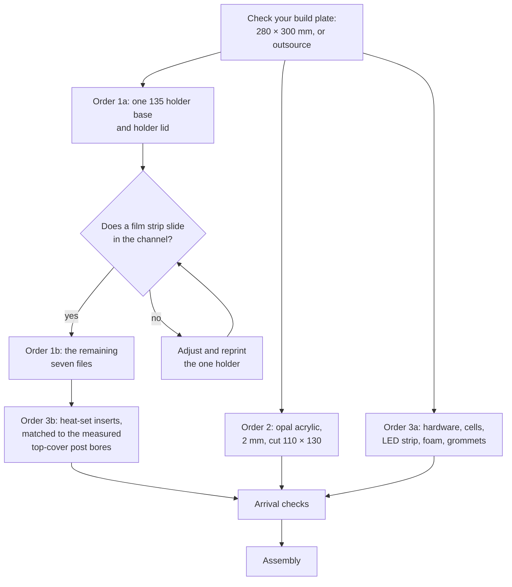

# Bill of materials and sourcing

**English** · [简体中文](bom.zh-CN.md) · [日本語](bom.ja.md)

> Everything you have to buy for a NeoBox — parts, tools and consumables — with the specification that stops you buying the wrong version of each one, and copy-paste ordering text for shops in China, Japan and everywhere else.

**Contents:** [What it costs](#what-it-costs) · [What this repo does not buy for you](#what-this-repo-does-not-buy-for-you) · [Tools and consumables](#tools-and-consumables) · [Printed parts](#printed-parts) · [Parts you buy](#parts-you-buy) · [Magnets](#magnets) · [Getting the right part](#getting-the-right-part) · [Light source](#light-source) · [Aluminium film stage](#aluminium-film-stage) · [Ordering sequence](#ordering-sequence) · [Vendor scripts](#vendor-scripts) · [When the parts arrive](#when-the-parts-arrive)

---

## What it costs

Prices are indicative, in CNY, from Chinese marketplaces (Taobao / 1688) as of July 2026.

| Group | What it covers | Price (CNY) |
|---|---|---|
| 3D printing | the 8 printed parts of the default build, white and black PLA | 150–280 |
| Diffuser | opal acrylic, 2 mm, cut 110 × 130 mm | 8–15 |
| Hardware | 3 studs, 6 nuts, 3 heat-set inserts, EVA foam tape, 2 grommets, USB LED strip | 46–80 |
| Cells | 8 NiMH AA — two sets for the flash | 60–100 |
| **Whole build, excluding the flash** | everything above, once | **CNY 250–420 · JPY 5,500–9,000** |

> [!NOTE]
> Added line by line at their extremes, the ranges above bracket CNY 264–475. **CNY 250–420 is the realistic total**, because the extremes do not all land in the same order. Three lines carry almost all of that movement: the print order (CNY 130 between its extremes), the cells (CNY 40) and the hardware (CNY 34). Reuse cells and a charger you already own and you take CNY 60–100 off, which puts the build under this range at roughly CNY 190–320. The JPY figure is the same build expressed in yen — it is not a quote for buying every line inside Japan.

Priced separately and never inside that total: the [aluminium film stage](#aluminium-film-stage) at CNY 80–200, and the [magnets and steel washers](#magnets) at CNY 5–10 and CNY 3–5.

---

## What this repo does not buy for you

NeoBox is a light source. It is one half of a [camera scanning](glossary.md#camera-scanning) setup — photographing film with a digital camera instead of running it through a scanner — and the other half is yours.

| You must already own or buy | What it does |
|---|---|
| Camera body | any body with manual exposure and raw files |
| Macro-capable lens | you photograph a frame as small as 24 × 36 mm; an ordinary lens will not focus that close |
| Copy stand, or a tripod with a horizontal or reversible column | holds the camera square above the film at a repeatable height |
| Flash and trigger set | the reference pair is specified and priced under [Light source](#light-source) |
| Trigger transmitter for the camera hot shoe | supplied with the reference trigger set — but that set is not in the build cost |
| Remote release | so you do not push the camera while it exposes |
| Inversion software | turns the raw negative into a positive image |

> [!IMPORTANT]
> CNY 250–420 buys the box and nothing else. It excludes the flash and trigger (CNY 350–550 together for the reference pair) and every camera-side item above. Read [what you must already own](getting-started.md#what-you-must-already-own) before you order anything.

Choosing and using the camera side is [scanning.md](scanning.md#camera-side-equipment). This document stops at the parts that make the box.

---

## Tools and consumables

None of this is exotic and you may own most of it, but every line is needed at least once during the build.

| Tool or consumable | What it is for | Specification |
|---|---|---|
| Soldering iron | melting the three [heat-set inserts](glossary.md#heat-set-insert) into the top-cover posts | about 200–250 °C for PLA; a conical tip works, a dedicated insert tip is better |
| Spanner or pliers, M6 (10 mm) | the lower nut and upper nut on each stud | two are better than one — you hold one and turn the other |
| Hobby knife | deburring the [channel](glossary.md#channel) mouths on each holder base | any craft knife with a fresh blade |
| Cyanoacrylate glue | steel washers, and the magnets | a small bottle |
| Low-tack masking tape | masking the cavity and the aperture before spraying | wide enough to cover the 100 × 120 mm aperture in one strip |
| Matte black spray paint, PLA-safe | outside of the main body, top of the top cover | acrylic or enamel |
| Rocket blower | both faces of the diffuser and the [film gate](glossary.md#film-gate), every session | a bulb blower, not canned air |
| Small flat mirror, about 30 mm | the parallelism method, in assembly and again in scanning | any flat mirror offcut |
| Cotton gloves, or clean hands | handling film by its edges | — |
| Steel rule or calipers | the arrival checks at the foot of this page | a 300 mm rule reaches across the 279.6 mm top cover |
| NiMH charger | the cells are rechargeable and arrive flat | **not counted in the total above** — add it to the hardware order if you do not own one |

A hot iron, aerosol paint and 24 small strong magnets all want reading about before you start: [Tools and safety](assembly.md#tools-and-safety).

---

## Printed parts


The default build is **8 printed parts**. A ninth file, the optional 6×6 mask, brings the repository to **9 STL files** — 8 required plus 1 optional.

| Colour | Parts | Files | Filament |
|---|---|---|---|
| White, matte | main body, top cover, access panel | 3 | ≈ 0.7–0.95 kg |
| Black | 2 × holder base, 2 × holder lid, film stage | 5 | ≈ 0.25–0.4 kg |
| Black, optional | 6×6 mask | 1 | 5.6 cm³ — negligible |
| **Total** | 8 required, 1 optional | **9** | **≈ 1–1.3 kg** |

> [!IMPORTANT]
> Two parts decide whether you can print at home. Your printer's [bed size](glossary.md#bed-size) must be at least **280 × 300 mm** for the main body and the top cover, and the binding part is the **top cover at 214.6 × 279.6 mm** — not the main body. The other seven files fit a 256 × 256 plate; on a 220 × 220 plate everything fits except the printed film stage, whose long axis is 230 mm — measure your own usable area before committing. On a 220 × 220 or 256 × 256 machine — the common hobby sizes — those two parts cannot be printed at all. Outsource the two, or outsource all eight.

> [!WARNING]
> White filament must be **matte**. Silk and glossy white reproduce the flash head as a hot spot straight through onto the film. The cavity is bare filament and stays that way — the inside is never painted or coated — so a glossy part cannot be fixed after it is printed, only reprinted in matte. Tell the shop this is a requirement, not a preference — "matte preferred" gets you whatever is already loaded on the machine.

Black parts can be PLA or PETG: PETG is tougher for the holders, PLA stays flatter. Layer height, [infill](glossary.md#infill), [supports](glossary.md#supports) and the per-part cards are in [printing.md](printing.md#print-settings). This page only tells you what to order.

White and black in one order is normal, and the prepared bundle is arranged that way — one shop, one order, two colours. Ask before you pay whether the filament change is charged separately or pushed into a second batch.

---

## Parts you buy

### What to buy

| Item | Specification | Qty | Price (CNY) |
|---|---|---|---|
| Opal acrylic diffuser | 2 mm, cut 110 × 130 mm | 1 (order 2–3) | 8–15 |
| Fully-threaded stud | M6 × 35 mm, headless, threaded end to end | 3 | 10–20 |
| Hex nut | M6 | 6 | included above |
| Heat-set insert | M6 brass, outer diameter matched to the top-cover post bore — order these last, see [Getting the right part](#getting-the-right-part) | 3 | 10–15 |
| EVA foam tape | self-adhesive, 2 mm thick | 1 roll | 8–15 |
| Rubber grommet | Ø12 mm mounting hole | 2 | 3–5 |
| USB LED strip | 5 V, inline dimmer, neutral white, white cable | 1 | 15–25 |
| NiMH AA cells | two sets for the flash | 8 | 60–100 |

Three studs, six nuts and three heat-set inserts are the entire structural hardware of the build. Nothing screws the enclosure together: the top cover drops on, the access panel is a friction fit, and the studs exist only to carry and level the film stage.

Two quantities look odd and are not mistakes. **Order 2–3 diffusers**: opal acrylic chips at the cut edges in transit, it sits directly in the optical path where a scratch shows, and a second cut costs almost nothing while a second shipping cycle costs a week. **Order 2 grommets**: there is one Ø12 cable-gland hole, in the right wall, and the second grommet is the spare you will want the first time a connector tears one.

How much EVA foam tape depends on how far you go: one lap around the access-panel plug (186 × 72 mm) is about 516 mm, and the optional seal along the wall tops follows the 208 × 273 mm outline for about another 960 mm. Buy a roll that covers both. The tape only has to be as wide as the 4 mm plug edge; anything wider is trimmed with the hobby knife.

### Search terms by region

The same part is unfindable with the wrong words, so each row carries all three.

| Item | China (Taobao / 1688) | Japan (Amazon.jp / Monotaro / Yodobashi) | Elsewhere (English) |
|---|---|---|---|
| Opal acrylic diffuser | `乳白亚克力板 定制 2mm` | `乳半アクリル板 2mm 切断` | `opal acrylic sheet 2 mm cut to size` |
| Fully-threaded stud | `M6牙条 35mm` or `全螺纹螺柱 M6×35` | `寸切ボルト M6×35` | `M6 × 35 fully threaded stud` / `M6 studding` |
| Hex nut | `M6螺母` | `六角ナット M6` | `M6 hex nut` |
| Heat-set insert | `热熔铜螺母 M6` | `インサートナット 熱圧入 M6 真鍮` | `M6 brass heat-set insert` |
| EVA foam tape | `EVA海绵条 背胶 2mm` | `EVA スポンジテープ 片面粘着 厚2mm` | `self-adhesive EVA foam tape 2 mm` |
| Rubber grommet | `橡胶过线圈 12mm` | `配線用グロメット 取付穴径12mm` | `rubber cable grommet, 12 mm mounting hole` |
| USB LED strip | `USB LED灯带 5V 线控调光 自然白` | `USB LEDテープライト 5V 調光 昼白色` | `USB LED strip 5 V dimmable neutral white` |
| NiMH AA cells | `爱乐普 AA` | `エネループ 単3形 8本` | `NiMH AA rechargeable, 8 cells` |
| NiMH charger | `镍氢电池 充电器 4槽` | `ニッケル水素 充電器 単3` | `NiMH AA charger` |
| Neodymium magnet | `钕磁铁 6x2mm` | `ネオジム磁石 丸型 6×2` | `neodymium disc magnet 6 × 2 mm` |
| Steel washer | `铁垫片 M6 Ø12` | `平座金 M6 外径12 鉄・ユニクロ` | `M6 steel washer, 12 mm OD, zinc plated` |
| 3D printing service | `3D打印 代打 大尺寸 PLA` | `3Dプリント 出力代行 大型 PLA` | JLC3DP, PCBWay, Craftcloud, or a local makerspace |
| Aluminium film stage | `5052铝板 CNC 定制 阳极氧化` | `アルミ板 A5052 t3 レーザー切断 黒アルマイト` | `5052 aluminium 3 mm laser cut, black anodised` |

> [!WARNING]
> `M6全牙螺丝` — the obvious Chinese term, and the one in the older ordering notes — mostly returns hex-head and socket-head bolts, which cannot be fitted. The stud must be **headless**, because both ends are used: the lower end screws into the heat-set insert, the upper end carries the lower nut and the upper nut. Search `M6牙条` or `全螺纹螺柱` instead.

---

## Magnets

Twenty-four Ø6 × 2 mm magnets, twelve per film holder, doing two completely different jobs. Earlier versions of this list filed all of them under "only if you use the box on end". That was wrong: most of them are what holds the holder shut.

| Role | Magnets | Where they go | Buy them? |
|---|---|---|---|
| Closure | **16** — 8 per holder, as 4 attracting pairs | 4 pockets in the holder base at (±45, ±75), 4 facing them in the holder lid | **Recommended for every build.** Without them the holder lid is held down by its own weight alone — enough lying flat, not enough on end. |
| Base-to-stage | **8** — 4 per holder, plus **4 Ø12 steel washers** | pockets in the holder base at (±25, ±75); the washers glue to the top of the film stage | Only if you will stand the box on end. |

CNY 5–10 buys all 24 magnets and CNY 3–5 buys the 4 steel washers, so there is nothing to save by ordering only the 16 closure magnets. If you skip the base-to-stage magnets, you also skip the washers, and the box then has to stay flat.

> [!WARNING]
> Two of these magnets meeting across a fold of skin pinch hard, and loose neodymium magnets are a serious swallowing hazard for children and pets. Keep the spares in a closed container. Polarity is not marked: pair a base magnet with a lid magnet, confirm they attract, and mark the up-face of each **before** any glue is opened. A pair glued the wrong way round pushes the holder lid off instead of holding it down, and the part cannot be recovered. The procedure is [Step 5 — Fit the holder magnets](assembly.md#step-5--fit-the-holder-magnets).

---

## Getting the right part

Seven ways to spend the money and receive something that does not work.

| Part | The mistake | What to specify |
|---|---|---|
| [Opal](glossary.md#opal) acrylic diffuser | Buying frosted acrylic | Opal is milky right through and scatters inside the sheet. Frosted is clear acrylic with one surface roughened, and it will show the flash head. Say "opal, light-diffusing, 2 mm" and give the cut size. If the shop offers grades, remember a denser sheet costs light and buys evenness; the flash has power in hand, but this project has not fixed a transmission figure, so order two grades if the price allows and keep the better one. |
| Fully-threaded stud | Buying a headed bolt | Headless, threaded end to end. Both ends are used. |
| Heat-set insert | Buying the wrong outer diameter | M6 inserts ship in several outer diameters and lengths, each wanting a different pilot bore, and the published files do not state the top-cover post bore. Order the inserts **after** the top cover arrives, measure the three post bores, and match the insert to what you measured. |
| Steel washer | Buying stainless | Most stainless washers are barely magnetic, and these exist only to give the magnets something to grip. Specify carbon steel or zinc-plated, and hold a magnet to one the day it arrives. |
| Rubber grommet | Reading Ø12 as the cable diameter | Ø12 mm is the **mounting-hole** diameter, matching the cable-gland hole in the right wall. That wall is 3 mm thick. |
| USB LED strip | Buying a 12 V strip | It must run on 5 V from USB. Nothing mains-powered goes inside the enclosure, and the inline dimmer stays outside it. The wall it sticks to is 267 mm long inside, so the shortest length any shop sells is more than enough. |
| EVA foam tape | Buying the wrong thickness | 2 mm is the number that matters: it takes up the roughly 2 mm clearance between the access-panel plug (186 × 72 × 4 mm) and the 190 × 76 mm access opening, and that friction is the only thing holding the panel in. |

---

## Light source

| Item | Specification | Price (CNY) |
|---|---|---|
| NEEWER TT560 speedlight | 190 × 75 × 55 mm, [GN38](glossary.md#guide-number), [manual 1/1–1/128](glossary.md#manual-power-fraction) in full stops, ≈ 5600 K | 200–300 |
| ZENIKO T1 trigger set | 39 × 38 × 29.5 mm, 2.4 GHz transmitter + receiver | 150–250 |

Only two things matter when you choose a flash: **manual power control**, and a head that turns 90°. [TTL](glossary.md#ttl) and [HSS](glossary.md#hss) do nothing inside a closed box — do not pay for them.

The T1 cannot change power remotely, so changing power means pulling the access panel. In practice that happens once, during calibration. The TT560 gives eight full-stop steps, so fine exposure adjustment is made on the lens in 1/3 stops.

> [!WARNING]
> **The published STL files fit the TT560 and nothing else.** The formulas in [design.md](design.md#generalising-to-another-flash) give you the numbers for a different flash, but they do not resize the files: a substitute flash means editing `cad/neobox.blend` and re-exporting. Before you substitute, check that the head rotates 90°, that power is manual, and that lying flat the body is no longer than 190 mm and no thicker than 55 mm. Fail any of those and the enclosure has to be re-derived.

---

## Aluminium film stage

An optional upgrade, and the only part of the build that involves a machine shop.

| Item | Specification | File | Price (CNY) |
|---|---|---|---|
| Aluminium film stage | 5052, 3 mm, black anodised, outline 200 × 230 mm, aperture 100 × 120 mm, 3 × Ø6.5 mm clearance holes | `cad/film-stage-aluminium-3mm.dxf` | 80–200 |

Both versions present their top face at the same height, so they are interchangeable: build with the printed film stage and swap later if you want to. Aluminium is flatter and stays flat, which matters because the film stage is the reference plane for the whole system.

> [!CAUTION]
> Never tap the three holes. A threaded plate turning on a same-pitch heat-set insert forms a [differential screw](glossary.md#differential-screw) — the two threads cancel and the stage height stops responding to the nuts. They must stay [clearance holes](glossary.md#clearance-hole-vs-tapped-hole) at Ø6.5 mm.

Two things a shop will offer to change, and must not:

- The front hole sits at (145, 15) in DXF coordinates. The asymmetry is deliberate — it keeps that stud out of the film run-out corridor. Do not let anyone "correct" it to a symmetrical layout.
- A 3 mm plate with one rectangular aperture and three round holes is laser or waterjet work. A CNC quote buys the same result for more money.

The aluminium stage has no corner blocks; the printed film stage prints them integral. There is no separate corner-block STL to export — in `cad/neobox.blend` the blocks are fused into the single stage object — so if you switch you either separate that geometry in Blender and export it on its own, or cut four L-pieces from 5 mm scrap and glue them on. Both routes, with the coordinates, are in [design.md](design.md#4-film-stage). If the shop says 5052 will not anodise evenly, matte black paint on the same plate is an acceptable finish — flatness is what you are buying, not the anodising.

---

## Ordering sequence

Three orders, very different lead times, and two of them want to be split in two.



| Order | Typical lead time | When to place it |
|---|---|---|
| 1a — one 135 holder base and holder lid | 2–5 days plus shipping | first |
| 1b — the remaining seven files | 2–5 days plus shipping | once the channel fits |
| 2 — opal acrylic, cut to size | 3–7 days | first, in parallel |
| 3a — hardware and cells, **without the heat-set inserts** | next day to a few days | any time |
| 3b — the 3 heat-set inserts | next day to a few days | only after the top cover arrives and you have measured the three post bores — see [Getting the right part](#getting-the-right-part) |
| Aluminium film stage (optional) | longest of all — quoting, cutting and anodising are three separate steps | only once the box works |

The film channel is 0.4 mm, and it is the one fit that either works or does not. Proving it on a single holder costs one extra shipping cycle and saves reprinting seven parts; what to check is in [Print one 135 holder first](printing.md#print-one-135-holder-first).

Three questions to ask a print shop before you pay:

- [ ] What machine will you print this on, and what is its usable build volume?
- [ ] Can the main body be printed in one piece at 208 × 273 × 92 mm, without splitting it?
- [ ] Do you have **matte** white PLA in stock?

> [!TIP]
> Packing matters more than usual here. Ask for thick bubble wrap around the printed parts — the main body has 3 mm walls and deforms under pressure — and ask for the acrylic to travel sandwiched between them, because opal acrylic chips at the edges.

---

## Vendor scripts

Copy-paste briefs, each written in the language the shop reads. They agree with [Ordering from a print service](printing.md#ordering-from-a-print-service), which carries the same instructions as a per-part reference; change a setting in one place and change it in the other.

Three of the nine files do not arrive in their print orientation and slicers do not rotate them for you, so every script below states the required rotation and names the up-face by a feature the operator can see on screen.

> [!TIP]
> If you are ordering in China you do not have to pick files out of `stl/` yourself. `taobao-order/打印.zip` holds the eight required STLs already sorted into a white folder and a black folder — that is the file to send a shop. `taobao-order.zip` at the repository root is the whole bundle: the same files plus the optional mask and the original ordering notes.

<details>
<summary>3D printing brief — China (Taobao / 1688), in Chinese</summary>

```
必打 8 个 STL，另有 1 个可选（mask-6x6），共 9 个文件。
单位毫米，请勿缩放。全部用默认 0.2 层高。
白色必须是哑光料（丝面／亮面会把灯头映成亮斑）。

白色 PLA 3 件：
  - main-body.stl（主箱，外框 273×208×92，需要 ≥280×300 打印床）
    摆放：平底朝下、大开口朝上。导入即是这个朝向，不用旋转。
    支撑：只有正面竖墙上那个 190mm 宽方口的上边缘要支撑。
  - top-cover.stl（顶盖 214.6×279.6，需要 ≥280×300 打印床）
    摆放：导入时裙边和 3 个圆柱朝下，请绕 X 轴旋转 180°；
          平的大面朝下贴床，裙边和 3 个圆柱朝上。免支撑。
  - access-panel.stl（抽口盖板 200×78）
    摆放：导入时是立着的，请放倒；背面凸起的方台朝下贴床，把手朝上。
    支撑：面板比方台宽一圈，这一圈悬空要支撑。

黑色 PLA 5 件：
  - film-holder-135-base.stl / film-holder-120-base.stl（两个夹底座）
    摆放：平的那面朝下，带两条长导轨（长凸条）的面朝上。免支撑。
  - film-holder-135-lid.stl / film-holder-120-lid.stl（两个夹上盖）
    摆放：导入时两条短压条朝下，请绕 X 轴旋转 180°；
          平的大面朝下，压条朝上。免支撑。
  - film-stage-printed.stl（胶片台 200×230，填充 ≥30%）
    摆放：平面朝下，四角 L 形挡块朝上（挡块是设计特征，不是缺陷）。

可选：mask-6x6.stl（拍 6×4.5 / 6×6 才用），黑色，平放，免支撑。

其余默认：壁 ≥3 圈、填充 15–25%。
```

店家嫌啰嗦时，只需咬住这两句：

```
全部默认 0.2 层高、按上面写的朝向摆。
要支撑的只有两处：main-body 正面方口的上边缘，
和 access-panel 面板悬空的那一圈。
```

先让店家打一副 135 夹（夹底座＋夹上盖）试装滑槽，合适再打其余。搜索词：`3D打印 代打 大尺寸 PLA`

</details>

<details>
<summary>3D printing brief — Japan, in Japanese</summary>

```
必須 8 点、任意 1 点（mask-6x6）、合計 9 ファイルです。
単位はミリ、スケール変更は不可。積層ピッチは全ファイル 0.2 mm。
白はマット必須です（シルク／光沢はストロボの発光部が
明るい斑点として写り込みます）。

白 PLA 3 点：
  - main-body.stl（箱の本体、外形 273×208×92、
    ビルドプレート 280×300 mm 以上が必要）
    置き方：平らな底面をプレートに、大きな開口を上。
            読み込んだ状態のままで回転不要。
    サポート：前面の壁にある幅 190 mm の角穴の上辺のみ。
  - top-cover.stl（天板 214.6×279.6、
    ビルドプレート 280×300 mm 以上が必要）
    置き方：読み込むと 10 mm の立ち上がり縁と 3 本の丸い柱が下向きです。
            X 軸まわりに 180° 回転し、大きな平面をプレートに、
            立ち上がり縁と 3 本の柱を上にしてください。サポート不要。
  - access-panel.stl（アクセスパネル 200×78）
    置き方：読み込むと立っています。寝かせて、裏面の四角い出っ張りを
            プレートに、取っ手を上にしてください。
    サポート：面板が出っ張りより一回り大きく、その庇の部分に必要です。

黒 PLA 5 点：
  - film-holder-135-base.stl / film-holder-120-base.stl（ホルダー底 2 点）
    置き方：平らな面をプレートに、2 本の長いレール（長い凸）がある面を上。
            サポート不要。
  - film-holder-135-lid.stl / film-holder-120-lid.stl（ホルダー蓋 2 点）
    置き方：読み込むと 2 本の短い押さえリブが下向きです。X 軸まわりに
            180° 回転し、大きな平面をプレートに、押さえリブを上に。
            サポート不要。
  - film-stage-printed.stl（フィルムステージ 200×230、インフィル 30 % 以上）
    置き方：平面をプレートに、四隅のコーナーブロックを上
            （設計上の突起で、欠陥ではありません）。

任意：mask-6x6.stl（6×4.5 / 6×6 の撮影時のみ）。黒、平置き、サポート不要。

その他：外周 3 周以上、インフィル 15–25 %。
```

先方が細かい指定を嫌う場合は、この二点だけ守ってもらってください。

```
積層ピッチは全ファイル 0.2 mm、置き方は上記のとおり。
サポートが必要なのは 2 か所だけです。main-body 前面の角穴の上辺と、
access-panel の面板が庇になっている部分。
```

まず 135 のホルダー底＋ホルダー蓋を 1 組だけ出力し、溝の寸法を確認してから残りを発注してください。検索ワード：`3Dプリント 出力代行 大型 PLA`

</details>

<details>
<summary>3D printing brief — everywhere else, in English</summary>

```
9 STL files: 8 required, 1 optional (mask-6x6). Millimetres. Do not scale.
0.2 mm layers on every file. White must be MATTE - silk or gloss reproduces
the flash head as a bright spot on the film.

White PLA, 3 parts:
  main-body.stl (bounding box 273 x 208 x 92; needs a build plate of
    280 x 300 mm or more)
    Placement: flat floor on the plate, big open mouth up. It loads in this
    orientation already - do not rotate it.
    Supports: only the top edge of the 190 mm wide rectangular opening in
    the front wall.
  top-cover.stl (214.6 x 279.6; needs a build plate of 280 x 300 mm or more)
    Placement: it loads with the 10 mm downstand rim and the three round
    pillars pointing DOWN. Rotate 180 degrees about X so the large flat face
    is on the plate and the rim and pillars point up. No supports.
  access-panel.stl (200 x 78)
    Placement: it loads standing on edge. Lay it down, with the face carrying
    the raised rectangular plug (186 x 72 x 4) on the plate and the handle
    pointing up.
    Supports: under the lip where the face plate overhangs that plug.

Black PLA, 5 parts:
  film-holder-135-base.stl / film-holder-120-base.stl
    Placement: flat face on the plate, the face with the two long ridges up.
    No supports.
  film-holder-135-lid.stl / film-holder-120-lid.stl
    Placement: they load with the two short pressure ribs pointing DOWN.
    Rotate 180 degrees about X: large flat face on the plate, ribs up.
    No supports.
  film-stage-printed.stl (200 x 230; infill 30 % or more)
    Placement: flat face on the plate, the four corner blocks up. Those
    blocks are a design feature, not a defect.

Optional: mask-6x6.stl - only for 6x4.5 and 6x6. Black, flat, no supports.

Everything else default: 3 or more perimeters, 15-25 % infill.
```

Print one 135 holder base and one holder lid first, and check the channel, before ordering the remaining seven files.

</details>

<details>
<summary>Opal acrylic cutting brief — Chinese, Japanese and English</summary>

China (Taobao / 1688):

```
乳白半透明亚克力 2mm 厚，110×130mm，切 3 块。
要乳白（板体本身扩散），不要磨砂透明板。
```

Japan:

```
乳半（乳白半透明）アクリル 厚 2 mm、110×130 mm に 3 枚切断してください。
表面をつや消しにした透明板ではなく、板そのものが光を拡散する
乳半材でお願いします。
```

Everywhere else:

```
Opal (white translucent, light-diffusing) acrylic, 2 mm thick,
cut 3 pieces at 110 x 130 mm.
Opal, not frosted clear - the sheet itself must diffuse, not just its surface.
```

No drawing is needed for any of these; the cut size is the whole specification.

</details>

<details>
<summary>Aluminium film stage brief — Chinese, Japanese and English</summary>

China (Taobao / 1688), search `5052铝板 CNC 定制 阳极氧化`, attach `cad/film-stage-aluminium-3mm.dxf`:

```
5052 铝板 3mm，外形 200×230，中间开口 100×120。
图上 3 个 Ø6.5 孔是光孔，请勿攻丝
（前孔在 (145,15)，非对称是设计意图，勿"修正"为对称）。
表面黑色阳极氧化（做不了阳极就哑光黑喷涂）。
```

Japan:

```
A5052 アルミ板 t3.0、外形 200×230 mm、中央に 100×120 mm の開口。
Ø6.5 の穴 3 か所はバカ穴です。タップは立てないでください
（前側の穴は (145, 15)。非対称は設計意図なので「修正」しないでください）。
表面は黒アルマイト（アルマイトが難しい場合はつや消し黒塗装で可）。
図面：cad/film-stage-aluminium-3mm.dxf
```

Everywhere else:

```
5052 aluminium, 3 mm thick. Outline 200 x 230 mm, central aperture
100 x 120 mm.
The three 6.5 mm diameter holes are CLEARANCE holes - do not tap them.
The front hole at (145, 15) is deliberately off-centre. Do not "correct" it
to a symmetrical layout.
Finish: black anodised. If anodising is not available, matte black paint.
Drawing: cad/film-stage-aluminium-3mm.dxf
```

</details>

### If the shop pushes back

| What you hear | What it means | What to do |
|---|---|---|
| "My bed is 256 × 256, I can still fit it" | Only if the part is scaled or split | Neither is acceptable. Ask them to print the other seven files and send the main body and top cover elsewhere. |
| "I only have glossy white in stock" | The finish becomes a hot spot on every frame | Wait for matte, or move the three white parts to another shop. Black parts are unaffected. |
| "Shall I hollow it out / thin the walls to save material?" | An unrequested model edit | No. Walls are 3 mm and the floor is 4 mm by design. |
| "0.12 or 0.16 layers will look nicer" | Those heights do not divide the 0.4 mm holder features | 0.2 mm on every file. 0.1 mm is the only alternative. |
| "Supports everywhere, to be safe" | Scars on the film-facing surfaces | Two support locations only: the top edge of the access opening, and the overhanging lip of the access panel. |
| "5052 will not anodise evenly, use 6061" | A real limitation of the alloy | Keep 5052 and accept matte black paint instead. Flatness matters here; the coating does not. |

---

## When the parts arrive

Check these before anything is glued, painted or bolted. The commonest print-service accident is a slicer left on "scale to fit the plate", and a 279.6 mm part is exactly what triggers it.

- [ ] **Top cover** — the long side measures 279.6 mm. If it is short, the file was scaled: reject the whole print, not just that part.
- [ ] **Main body** — 208 × 273 mm across the outside, 92 mm from the floor to the wall tops.
- [ ] **Access opening** — the rectangular hole in the front wall measures 190 × 76 mm.
- [ ] **Film stage** — outline 200 × 230 mm; the plate is 5 mm thick and the corner blocks rise to 11 mm overall.
- [ ] **Stage holes** — an M6 stud drops through all three under its own weight. They are Ø6.5 mm clearance holes. Ream a tight one by hand with a 6.5 mm drill; never tap it.
- [ ] **Fit** — the top cover drops onto the main body without being forced.
- [ ] **Diffuser** — held up to a lamp it looks evenly milky right through, with no clear window and no bright patch. Leave the protective film on until assembly, then peel it from **both** faces.
- [ ] **Steel washers** — a magnet sticks to them. If it does not, they are stainless: return them.
- [ ] **Magnets** — offer a base magnet up to a lid magnet, confirm they attract, and mark the up-face of each before any glue is opened.
- [ ] **LED strip** — it lights from a USB power bank and the inline dimmer actually dims.

Anything that fails one of these belongs in [Troubleshooting](troubleshooting.md#printing) before it goes anywhere near the build. With every box ticked, go on to [printing](printing.md#check-each-part-before-you-assemble) if you are printing at home, or straight to assembly if you are not.

---

← [Getting started](getting-started.md) · [Documentation index](../README.md#documentation) · [Printing](printing.md) →
