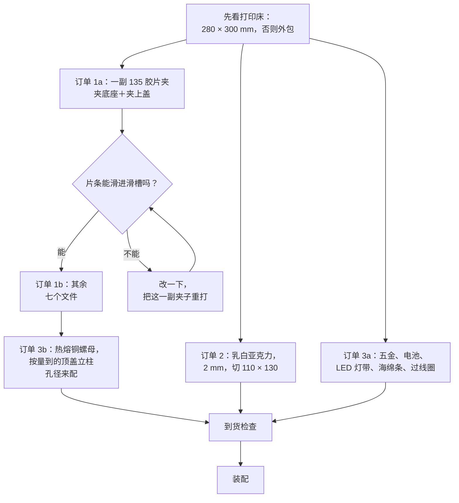

# 物料清单与采购

[English](bom.md) · **简体中文** · [日本語](bom.ja.md)

> 做一台 NeoBox 要买的全部东西——零件、工具和耗材——每一项都写清了能让你避开错误版本的规格，并附上可直接复制给中国、日本及其他地区店家的下单话术。

**目录：**[造价](#造价) · [本仓库不替你买的东西](#本仓库不替你买的东西) · [工具与耗材](#工具与耗材) · [打印件](#打印件) · [采购件](#采购件) · [磁铁](#磁铁) · [买对规格](#买对规格) · [光源](#光源) · [铝制胶片台](#铝制胶片台) · [下单顺序](#下单顺序) · [给店家的话术](#给店家的话术) · [到货检查](#到货检查)

---

## 造价

价格为参考价，取自 2026 年 7 月的中国电商平台（淘宝／1688），单位人民币。

| 分组 | 包含内容 | 价格（CNY） |
|---|---|---|
| 3D 打印 | 默认构型的 8 个打印件，白色与黑色 PLA | 150–280 |
| 扩散板 | 乳白亚克力，2 mm，切 110 × 130 mm | 8–15 |
| 五金 | 3 根螺杆、6 个螺母、3 个热熔铜螺母、EVA 海绵条、2 个过线圈、USB LED 灯带 | 46–80 |
| 电池 | 8 节镍氢 AA——供闪光灯两组轮换 | 60–100 |
| **整台箱子，不含闪光灯** | 以上全部，各一份 | **CNY 250–420 · JPY 5,500–9,000** |

> [!NOTE]
> 把上表逐行按两端极值相加，区间是 CNY 264–475。**CNY 250–420 才是符合实际的总价**，因为各行的极值不会同时落在一单里。波动几乎全部来自三行：打印单（两端相差 CNY 130）、电池（CNY 40）和五金（CNY 34）。电池和充电器用手头现成的，就能省下 CNY 60–100，总价会落到这个区间以下，大约 CNY 190–320。JPY 那个数字是同一台箱子折成日元的结果，不是在日本本地逐项采购的报价。

另计、且从不含在上述总价里的两项：[铝制胶片台](#铝制胶片台) CNY 80–200，以及[磁铁与铁垫片](#磁铁) CNY 5–10 和 CNY 3–5。

---

## 本仓库不替你买的东西

NeoBox 只是一个光源。它是[相机翻拍](glossary.zh-CN.md#相机翻拍)（camera scanning，用数码相机拍摄胶片，而不是把胶片送进扫描仪）这套方案的一半，另一半得你自己准备。

| 你必须已经有、或者另外去买 | 它负责什么 |
|---|---|
| 机身 | 任何能手动曝光、能出 raw 的机身 |
| 具备微距能力的镜头 | 你要拍的画幅最小只有 24 × 36 mm，普通镜头对不到这么近 |
| 翻拍台（copy stand），或带横臂或可倒置中轴的三脚架 | 把相机端正地架在胶片正上方，而且高度可重复 |
| 闪光灯与引闪套装 | 参考型号与价格见[光源](#光源) |
| 装在相机热靴上的引闪发射器 | 参考引闪套装自带——但那套本来就不算在箱子的造价里 |
| 快门线或遥控器 | 曝光的时候不至于碰到相机 |
| 反相（inversion）软件 | 把 raw 负片转成正像 |

> [!IMPORTANT]
> CNY 250–420 买到的只有箱子。它不含闪光灯和引闪（参考组合两件合计 CNY 350–550），也不含上表里任何相机端的器材。下任何一单之前，先读[入门指南](getting-started.zh-CN.md#你需要自备的器材)里"你需要自备的器材"一节。

相机端怎么选、怎么用，写在[扫描文档](scanning.zh-CN.md#相机端器材)里。本页只管构成箱子的那些零件。

---

## 工具与耗材

这些都不是什么稀罕东西，大半你可能已经有了，但每一行在装配过程中至少要用到一次。

| 工具或耗材 | 用来做什么 | 规格 |
|---|---|---|
| 电烙铁 | 把 3 个[热熔铜螺母](glossary.zh-CN.md#热熔铜螺母)烫进顶盖的立柱里 | PLA 用约 200–250 °C；锥形头能用，专用的嵌件头更好 |
| M6（10 mm）扳手或钳子 | 每根螺杆上的下螺母和上螺母 | 两把比一把强——一把按住，一把转 |
| 美工刀 | 给每个夹底座的[滑槽](glossary.zh-CN.md#滑槽)口去毛刺 | 任何换过新刀片的美工刀 |
| 氰基丙烯酸酯胶（502） | 粘铁垫片和磁铁 | 一小瓶 |
| 低粘性美纹纸胶带 | 喷漆前遮蔽混光腔和开口 | 宽度够用一条盖住 100 × 120 mm 的开口 |
| 哑光黑喷漆，不侵蚀 PLA | 主箱外表面、顶盖顶面 | 丙烯漆或瓷漆均可 |
| 吹气球 | 每次使用前吹扩散板两面和[片门](glossary.zh-CN.md#片门)（film gate） | 皮吹球，不要用高压气罐 |
| 约 30 mm 的小平面镜 | 装配时和扫描时都要用的平行度校准法 | 任何平整的镜子边角料 |
| 棉手套，或者洗干净的手 | 只捏片条的边缘 | — |
| 钢尺或卡尺 | 本页末尾的到货检查 | 300 mm 直尺才够量 279.6 mm 的顶盖 |
| 镍氢充电器 | 电池是充电电池，到手是空的 | **不计入上面的总价**——手上没有的话，加进五金那一单 |

烧热的烙铁、喷漆罐，还有 24 颗又小又强的磁铁，动手之前都值得先读一遍：[装配文档](assembly.zh-CN.md#工具与安全)里的"工具与安全"。

---

## 打印件


默认构型是 **8 个打印件**。第 9 个文件是可选的 6×6 遮片（mask），所以仓库里一共 **9 个 STL 文件**——8 个必打，加 1 个可选。

| 颜色 | 零件 | 文件数 | 耗材 |
|---|---|---|---|
| 白色，哑光 | 主箱、顶盖、抽口盖板 | 3 | ≈ 0.7–0.95 kg |
| 黑色 | 2 个夹底座、2 个夹上盖、胶片台 | 5 | ≈ 0.25–0.4 kg |
| 黑色，可选 | 6×6 遮片 | 1 | 5.6 cm³——可以忽略 |
| **合计** | 8 个必打，1 个可选 | **9** | **≈ 1–1.3 kg** |

> [!IMPORTANT]
> 有两个零件决定你能不能在家打。打印机的[打印床](glossary.zh-CN.md#打印床尺寸)（build plate）至少要 **280 × 300 mm** 才放得下主箱和顶盖，而卡尺寸的是**顶盖的 214.6 × 279.6 mm**，不是主箱。其余七个文件放得进 256 × 256 的床；220 × 220 的床上，除了长边 230 mm 的打印版胶片台之外都放得下——动手前先量一下自己机器的实际可用范围。220 × 220 和 256 × 256 这两种最常见的爱好级尺寸，都根本打不了那两个零件。要么把这两件外包，要么八件全部外包。

> [!WARNING]
> 白色耗材必须是**哑光**的。丝面和亮面白料会把灯头映成一块亮斑，径直透到胶片上。混光腔里就是耗材的本色，而且一直如此——内壁永远不喷漆、不做涂层——所以亮面的件打出来没法补救，只能换哑光料重打。要明确告诉店家这是硬性要求，不是偏好：说"最好用哑光"，机器上装着什么料就给你打什么料。

黑色件用 PLA 或 PETG 都行：PETG 做胶片夹更结实，PLA 更不容易翘。层高（layer height）、[填充](glossary.zh-CN.md#填充)（infill）、[支撑](glossary.zh-CN.md#支撑)（supports）以及每个零件的参数卡，都在[打印文档](printing.zh-CN.md#打印参数)里。本页只告诉你要下什么单。

白色和黑色放在同一单里打是常规做法，准备好的打印包也是照这个分的——一家店、一个订单、两种颜色。付款前先问清楚：换料是另外收费，还是并到第二批一起打。

---

## 采购件

### 要买什么

| 项目 | 规格 | 数量 | 价格（CNY） |
|---|---|---|---|
| 乳白亚克力扩散板 | 2 mm，切 110 × 130 mm | 1（下单买 2–3 片） | 8–15 |
| 全牙螺杆 | M6 × 35 mm，无头，两端通丝 | 3 | 10–20 |
| 六角螺母 | M6 | 6 | 含在上一行 |
| 热熔铜螺母 | M6 黄铜，外径要与顶盖立柱的孔配得上——这一项最后再下单，见[买对规格](#买对规格) | 3 | 10–15 |
| EVA 海绵条 | 背胶，厚 2 mm | 1 卷 | 8–15 |
| 橡胶过线圈 | 安装孔径 Ø12 mm | 2 | 3–5 |
| USB LED 灯带 | 5 V、线控调光、自然白、白色线材 | 1 | 15–25 |
| 镍氢 AA 电池 | 供闪光灯两组轮换 | 8 | 60–100 |

3 根螺杆、6 个螺母、3 个热熔铜螺母，就是整台箱子全部的结构性五金。箱体本身没有一颗螺丝：顶盖是扣上去的，抽口盖板靠摩擦塞住，螺杆的唯一用处是托住胶片台并把它调平。

有两处数量看着不对，其实不是笔误。**扩散板买 2–3 片**：乳白亚克力在运输途中容易崩边，而它正好处在光路上，一道划痕就会显出来；多切一片几乎不要钱，重走一轮物流却要一周。**过线圈买 2 个**：右侧墙上只有一个 Ø12 出线孔，第二个是备件——第一次被接头扯坏的时候你就会想要它。

EVA 海绵条买多长，取决于你做到哪一步：绕抽口盖板的插塞（186 × 72 mm）一圈约 516 mm，沿墙顶做那道可选的密封，还要顺着 208 × 273 mm 的外形再走约 960 mm。买一卷把两处都覆盖住。胶条只需要和 4 mm 厚的插塞侧边一样宽，多出来的用美工刀裁掉。

### 分地区搜索词

同一个零件，词用错就搜不出来，所以每一行都给了三地的说法。

| 项目 | 中国（淘宝／1688） | 日本（Amazon.jp／Monotaro／Yodobashi） | 其他地区（英文） |
|---|---|---|---|
| 乳白亚克力扩散板 | `乳白亚克力板 定制 2mm` | `乳半アクリル板 2mm 切断` | `opal acrylic sheet 2 mm cut to size` |
| 全牙螺杆 | `M6牙条 35mm` 或 `全螺纹螺柱 M6×35` | `寸切ボルト M6×35` | `M6 × 35 fully threaded stud` / `M6 studding` |
| 六角螺母 | `M6螺母` | `六角ナット M6` | `M6 hex nut` |
| 热熔铜螺母 | `热熔铜螺母 M6` | `インサートナット 熱圧入 M6 真鍮` | `M6 brass heat-set insert` |
| EVA 海绵条 | `EVA海绵条 背胶 2mm` | `EVA スポンジテープ 片面粘着 厚2mm` | `self-adhesive EVA foam tape 2 mm` |
| 橡胶过线圈 | `橡胶过线圈 12mm` | `配線用グロメット 取付穴径12mm` | `rubber cable grommet, 12 mm mounting hole` |
| USB LED 灯带 | `USB LED灯带 5V 线控调光 自然白` | `USB LEDテープライト 5V 調光 昼白色` | `USB LED strip 5 V dimmable neutral white` |
| 镍氢 AA 电池 | `爱乐普 AA` | `エネループ 単3形 8本` | `NiMH AA rechargeable, 8 cells` |
| 镍氢充电器 | `镍氢电池 充电器 4槽` | `ニッケル水素 充電器 単3` | `NiMH AA charger` |
| 钕磁铁 | `钕磁铁 6x2mm` | `ネオジム磁石 丸型 6×2` | `neodymium disc magnet 6 × 2 mm` |
| 铁垫片 | `铁垫片 M6 Ø12` | `平座金 M6 外径12 鉄・ユニクロ` | `M6 steel washer, 12 mm OD, zinc plated` |
| 3D 打印代打 | `3D打印 代打 大尺寸 PLA` | `3Dプリント 出力代行 大型 PLA` | JLC3DP、PCBWay、Craftcloud，或者本地的创客空间 |
| 铝制胶片台 | `5052铝板 CNC 定制 阳极氧化` | `アルミ板 A5052 t3 レーザー切断 黒アルマイト` | `5052 aluminium 3 mm laser cut, black anodised` |

> [!WARNING]
> `M6全牙螺丝`——中文里最顺手的那个词，也是旧版下单说明用的词——搜出来大多是六角头和内六角头螺栓，装不上去。螺杆必须**无头**，因为两端都要用：下端拧进热熔铜螺母，上端装下螺母和上螺母。改搜 `M6牙条` 或 `全螺纹螺柱`。

---

## 磁铁

24 颗 Ø6 × 2 mm 磁铁，每个胶片夹 12 颗，干的是两件完全不同的活。这份清单的早期版本把它们全都归进了"箱子竖着用才需要"，那是错的：其中大部分是用来把胶片夹合紧的。

| 作用 | 数量 | 装在哪儿 | 要不要买？ |
|---|---|---|---|
| 合盖 | **16** 颗——每个胶片夹 8 颗，构成 4 对相吸的磁铁 | 夹底座上位于 (±45, ±75) 的 4 个磁槽，夹上盖上与之相对的 4 个 | **每一台都建议装。** 没有它们，夹上盖只靠自重压着——平放够用，竖起来就不够。 |
| 底座吸胶片台 | **8** 颗——每个胶片夹 4 颗，另加 **4 片 Ø12 铁垫片** | 夹底座上位于 (±25, ±75) 的磁槽；铁垫片粘在胶片台的顶面 | 只有打算把箱子竖起来用才需要。 |

CNY 5–10 就买齐了全部 24 颗磁铁，CNY 3–5 买齐 4 片铁垫片，所以只买 16 颗合盖磁铁根本省不下什么。要是不装底座吸胶片台的那 8 颗，铁垫片也就一并不用买，代价是箱子只能平着用。

> [!WARNING]
> 这种磁铁隔着一层皮肉相吸时夹得很疼，散落的钕磁铁对儿童和宠物更是严重的误吞风险。备用的请放进有盖的盒子。磁铁不标极性：先拿一颗底座磁铁去凑一颗上盖磁铁，确认它们相吸，在**开胶水之前**把每颗朝上的那一面做好标记。粘反了的一对会把夹上盖顶开而不是压住，而且零件救不回来。具体步骤见[装配文档](assembly.zh-CN.md#第-5-步装胶片夹的磁铁)里的"第 5 步——装胶片夹的磁铁"。

---

## 买对规格

七种把钱花出去、收到的东西却用不了的方式。

| 零件 | 常犯的错 | 下单时要讲明什么 |
|---|---|---|
| [乳白](glossary.zh-CN.md#乳白)亚克力扩散板 | 买成磨砂亚克力 | 乳白是整块板体都呈乳浊状，光在板内散射；磨砂只是透明亚克力把一面打毛，它会把灯头映出来。要说"乳白、导光扩散、2 mm"，并给出切割尺寸。如果店家分等级，记住：板越浓，损失的光越多，匀度越好；闪光灯功率有富余，但本项目还没有定下透光率指标，所以价格允许的话买两种等级，留效果好的那片。 |
| 全牙螺杆 | 买成带头的螺栓 | 无头，两端通丝。两端都要用。 |
| 热熔铜螺母 | 外径买错 | M6 热熔铜螺母有好几种外径和长度，各自要配不同的预留孔，而公开的文件里并没有给出顶盖立柱的孔径。请等顶盖到货**之后**再下单：量出三个立柱孔，按量到的尺寸配。 |
| 铁垫片 | 买成不锈钢的 | 多数不锈钢垫片几乎不被磁铁吸住，而这几片存在的唯一意义就是给磁铁一个吸附面。要指明碳钢或镀锌件，到货当天就拿磁铁试一下。 |
| 橡胶过线圈 | 把 Ø12 当成线径 | Ø12 mm 是**安装孔**的直径，对应右侧墙上的出线孔。那面墙厚 3 mm。 |
| USB LED 灯带 | 买成 12 V 的 | 必须是 USB 供电的 5 V。箱内不放任何接市电的东西，线控调光器留在箱外。灯带要贴的那面墙内长 267 mm，所以店家卖的最短一档也绰绰有余。 |
| EVA 海绵条 | 厚度买错 | 关键数字是 2 mm：抽口盖板的插塞（186 × 72 × 4 mm）与 190 × 76 mm 的抽口之间大约有 2 mm 间隙，全靠它填满，而这份摩擦力是盖板唯一的固定方式。 |

---

## 光源

| 项目 | 规格 | 价格（CNY） |
|---|---|---|
| NEEWER TT560 机顶闪光灯 | 190 × 75 × 55 mm，[闪光指数](glossary.zh-CN.md#闪光指数) GN38，[手动 1/1–1/128](glossary.zh-CN.md#手动出力档位) 整档可调，≈ 5600 K | 200–300 |
| ZENIKO T1 引闪套装 | 39 × 38 × 29.5 mm，2.4 GHz 发射器＋接收器 | 150–250 |

选闪光灯真正要紧的只有两条：**功率能手动调**，以及灯头能转 90°。[TTL](glossary.zh-CN.md#ttl) 和 [HSS](glossary.zh-CN.md#hss) 在一个封闭的箱子里什么用都没有——别为它们花钱。

T1 不能遥控改功率，所以要调功率就得把抽口盖板拔下来。实际上这件事只在校准时做一次。TT560 只有 8 个整档，所以曝光的细调放到镜头上，按 1/3 档来。

> [!WARNING]
> **公开的 STL 文件只适配 TT560，别的灯都不行。**[设计文档](design.zh-CN.md#换用其他闪光灯)里的公式能算出换灯之后的新尺寸，但它们不会改动文件：换一支灯就意味着要改 `cad/neobox.blend` 并重新导出。换之前先确认三件事：灯头能转 90°、功率手动可调、平放时机身长度不超过 190 mm 且厚度不超过 55 mm。任何一条不满足，箱体都得重新推导。

---

## 铝制胶片台

一件可选升级，也是整台箱子里唯一要找加工厂的零件。

| 项目 | 规格 | 文件 | 价格（CNY） |
|---|---|---|---|
| 铝制胶片台 | 5052、3 mm、黑色阳极氧化，外形 200 × 230 mm，开口 100 × 120 mm，3 × Ø6.5 mm 光孔 | `cad/film-stage-aluminium-3mm.dxf` | 80–200 |

两种胶片台的台面高度相同，可以互换：先用打印版装起来，以后想换再换。铝板更平，而且长期保持平整——胶片台是整个系统的基准平面，这一点很要紧。

> [!CAUTION]
> 这三个孔绝对不能攻丝。攻了丝的板在同螺距的热熔铜螺母上转动，就构成了一套[差动螺旋](glossary.zh-CN.md#差动螺旋)（differential screw）——两段螺纹互相抵消，再怎么转螺母，胶片台的高度也不会变。它们必须保持 Ø6.5 mm 的[光孔](glossary.zh-CN.md#光孔与螺纹孔)（clearance hole）。

加工厂会主动提出、但绝对不能改的两件事：

- 前孔在 DXF 坐标系里位于 (145, 15)。这个不对称是刻意的——它把那根螺杆挪出了胶片的走片通道。别让任何人把它"修正"成对称布局。
- 一块 3 mm 板、一个矩形开口、三个圆孔，这是激光或水刀的活。报 CNC 只是花更多的钱买同一个结果。

铝制胶片台上没有四角挡块；打印版的挡块是和台面一体打出来的。仓库里也没有单独的挡块 STL 可导出——在 `cad/neobox.blend` 里，挡块和台面已经融合成同一个物体——所以换成铝板之后，要么在 Blender 里把这部分几何分出来单独导出，要么拿 5 mm 边角料切四个 L 形块粘上去。两条路子连同坐标都写在[设计文档](design.zh-CN.md#4-胶片台)的"胶片台"一节。如果店家说 5052 阳极氧化上色不匀，同一块板改用哑光黑喷涂也可以接受——你买的是平整度，不是那层氧化膜。

---

## 下单顺序

三个订单，货期差别很大，其中两个还要各拆成两批。



| 订单 | 常见货期 | 什么时候下 |
|---|---|---|
| 1a——一副 135 夹底座和夹上盖 | 2–5 天，加物流 | 最先下 |
| 1b——其余七个文件 | 2–5 天，加物流 | 滑槽合适之后 |
| 2——乳白亚克力，按尺寸切 | 3–7 天 | 最先下，与 1a 并行 |
| 3a——五金和电池，**不含热熔铜螺母** | 次日到几天 | 随时 |
| 3b——3 个热熔铜螺母 | 次日到几天 | 顶盖到货、量过三个立柱孔之后再下——见[买对规格](#买对规格) |
| 铝制胶片台（可选） | 最久——报价、切割、阳极氧化是三道分开的工序 | 等箱子整套跑通了再说 |

滑槽只有 0.4 mm，这是全机唯一一处"要么行、要么不行"的配合。先用一副夹子把它验证掉，代价是多走一轮物流，省下的是重打七个零件；要检查什么，写在[打印文档](printing.zh-CN.md#先打一副-135-胶片夹)的"先打一副 135 胶片夹"一节。

付款前要问打印店的三个问题：

- [ ] 这单用哪台机器打，实际可用的成型尺寸是多少？
- [ ] 主箱能不能按 208 × 273 × 92 mm 一体打出来，不切分？
- [ ] 有没有**哑光**白色 PLA 的现货？

> [!TIP]
> 这里的包装比一般情况更要紧。让店家给打印件裹厚气泡膜——主箱壁厚只有 3 mm，受压会变形——再让亚克力夹在打印件中间运输，因为乳白亚克力最容易崩边。

---

## 给店家的话术

可以直接复制粘贴的下单说明，每一份都用店家读得懂的语言写成。它们与[打印文档](printing.zh-CN.md#找代打服务下单)里"找代打服务下单"一节是一致的，那边把同一套要求按零件逐个列了一遍；改了一处，另一处也要跟着改。

九个文件里有三个导入时并不处在打印朝向，而切片软件不会替你转，所以下面每一份话术都写明了需要旋转多少，并用操作员在屏幕上看得见的特征来指认朝上的那一面。

> [!TIP]
> 在国内下单的话，用不着自己去 `stl/` 里挑文件。`taobao-order/打印.zip` 里已经把 8 个必打 STL 分好了白色文件夹和黑色文件夹——发这个给店家就行。仓库根目录的 `taobao-order.zip` 是完整包：同样的文件，外加可选的遮片和原始的下单说明。

<details>
<summary>3D 打印下单说明——中国（淘宝／1688），中文</summary>

```
必打 8 个 STL，另有 1 个可选（mask-6x6），共 9 个文件。
单位毫米，请勿缩放。全部用默认 0.2 层高。
白色必须是哑光料（丝面／亮面会把灯头映成亮斑）。

白色 PLA 3 件：
  - main-body.stl（主箱，外框 273×208×92，需要 ≥280×300 打印床）
    摆放：平底朝下、大开口朝上。导入即是这个朝向，不用旋转。
    支撑：只有正面竖墙上那个 190mm 宽方口的上边缘要支撑。
  - top-cover.stl（顶盖 214.6×279.6，需要 ≥280×300 打印床）
    摆放：导入时裙边和 3 个圆柱朝下，请绕 X 轴旋转 180°；
          平的大面朝下贴床，裙边和 3 个圆柱朝上。免支撑。
  - access-panel.stl（抽口盖板 200×78）
    摆放：导入时是立着的，请放倒；背面凸起的方台朝下贴床，把手朝上。
    支撑：面板比方台宽一圈，这一圈悬空要支撑。

黑色 PLA 5 件：
  - film-holder-135-base.stl / film-holder-120-base.stl（两个夹底座）
    摆放：平的那面朝下，带两条长导轨（长凸条）的面朝上。免支撑。
  - film-holder-135-lid.stl / film-holder-120-lid.stl（两个夹上盖）
    摆放：导入时两条短压条朝下，请绕 X 轴旋转 180°；
          平的大面朝下，压条朝上。免支撑。
  - film-stage-printed.stl（胶片台 200×230，填充 ≥30%）
    摆放：平面朝下，四角 L 形挡块朝上（挡块是设计特征，不是缺陷）。

可选：mask-6x6.stl（拍 6×4.5 / 6×6 才用），黑色，平放，免支撑。

其余默认：壁 ≥3 圈、填充 15–25%。
```

店家嫌啰嗦时，只需咬住这两句：

```
全部默认 0.2 层高、按上面写的朝向摆。
要支撑的只有两处：main-body 正面方口的上边缘，
和 access-panel 面板悬空的那一圈。
```

先让店家打一副 135 夹（夹底座＋夹上盖）试装滑槽，合适再打其余。搜索词：`3D打印 代打 大尺寸 PLA`

</details>

<details>
<summary>3D 打印下单说明——日本，日文</summary>

```
必須 8 点、任意 1 点（mask-6x6）、合計 9 ファイルです。
単位はミリ、スケール変更は不可。積層ピッチは全ファイル 0.2 mm。
白はマット必須です（シルク／光沢はストロボの発光部が
明るい斑点として写り込みます）。

白 PLA 3 点：
  - main-body.stl（箱の本体、外形 273×208×92、
    ビルドプレート 280×300 mm 以上が必要）
    置き方：平らな底面をプレートに、大きな開口を上。
            読み込んだ状態のままで回転不要。
    サポート：前面の壁にある幅 190 mm の角穴の上辺のみ。
  - top-cover.stl（天板 214.6×279.6、
    ビルドプレート 280×300 mm 以上が必要）
    置き方：読み込むと 10 mm の立ち上がり縁と 3 本の丸い柱が下向きです。
            X 軸まわりに 180° 回転し、大きな平面をプレートに、
            立ち上がり縁と 3 本の柱を上にしてください。サポート不要。
  - access-panel.stl（アクセスパネル 200×78）
    置き方：読み込むと立っています。寝かせて、裏面の四角い出っ張りを
            プレートに、取っ手を上にしてください。
    サポート：面板が出っ張りより一回り大きく、その庇の部分に必要です。

黒 PLA 5 点：
  - film-holder-135-base.stl / film-holder-120-base.stl（ホルダー底 2 点）
    置き方：平らな面をプレートに、2 本の長いレール（長い凸）がある面を上。
            サポート不要。
  - film-holder-135-lid.stl / film-holder-120-lid.stl（ホルダー蓋 2 点）
    置き方：読み込むと 2 本の短い押さえリブが下向きです。X 軸まわりに
            180° 回転し、大きな平面をプレートに、押さえリブを上に。
            サポート不要。
  - film-stage-printed.stl（フィルムステージ 200×230、インフィル 30 % 以上）
    置き方：平面をプレートに、四隅のコーナーブロックを上
            （設計上の突起で、欠陥ではありません）。

任意：mask-6x6.stl（6×4.5 / 6×6 の撮影時のみ）。黒、平置き、サポート不要。

その他：外周 3 周以上、インフィル 15–25 %。
```

店家嫌要求太琐碎时，让他至少守住这两点：

```
積層ピッチは全ファイル 0.2 mm、置き方は上記のとおり。
サポートが必要なのは 2 か所だけです。main-body 前面の角穴の上辺と、
access-panel の面板が庇になっている部分。
```

先只让对方打一副 135 的夹底座＋夹上盖，确认滑槽尺寸之后再下其余的单。搜索词：`3Dプリント 出力代行 大型 PLA`

</details>

<details>
<summary>3D 打印下单说明——其他地区，英文</summary>

```
9 STL files: 8 required, 1 optional (mask-6x6). Millimetres. Do not scale.
0.2 mm layers on every file. White must be MATTE - silk or gloss reproduces
the flash head as a bright spot on the film.

White PLA, 3 parts:
  main-body.stl (bounding box 273 x 208 x 92; needs a build plate of
    280 x 300 mm or more)
    Placement: flat floor on the plate, big open mouth up. It loads in this
    orientation already - do not rotate it.
    Supports: only the top edge of the 190 mm wide rectangular opening in
    the front wall.
  top-cover.stl (214.6 x 279.6; needs a build plate of 280 x 300 mm or more)
    Placement: it loads with the 10 mm downstand rim and the three round
    pillars pointing DOWN. Rotate 180 degrees about X so the large flat face
    is on the plate and the rim and pillars point up. No supports.
  access-panel.stl (200 x 78)
    Placement: it loads standing on edge. Lay it down, with the face carrying
    the raised rectangular plug (186 x 72 x 4) on the plate and the handle
    pointing up.
    Supports: under the lip where the face plate overhangs that plug.

Black PLA, 5 parts:
  film-holder-135-base.stl / film-holder-120-base.stl
    Placement: flat face on the plate, the face with the two long ridges up.
    No supports.
  film-holder-135-lid.stl / film-holder-120-lid.stl
    Placement: they load with the two short pressure ribs pointing DOWN.
    Rotate 180 degrees about X: large flat face on the plate, ribs up.
    No supports.
  film-stage-printed.stl (200 x 230; infill 30 % or more)
    Placement: flat face on the plate, the four corner blocks up. Those
    blocks are a design feature, not a defect.

Optional: mask-6x6.stl - only for 6x4.5 and 6x6. Black, flat, no supports.

Everything else default: 3 or more perimeters, 15-25 % infill.
```

先打一个 135 夹底座和一个夹上盖，确认滑槽合适之后，再下其余七个文件的单。

</details>

<details>
<summary>乳白亚克力切割说明——中文、日文、英文</summary>

中国（淘宝／1688）：

```
乳白半透明亚克力 2mm 厚，110×130mm，切 3 块。
要乳白（板体本身扩散），不要磨砂透明板。
```

日本：

```
乳半（乳白半透明）アクリル 厚 2 mm、110×130 mm に 3 枚切断してください。
表面をつや消しにした透明板ではなく、板そのものが光を拡散する
乳半材でお願いします。
```

其他地区：

```
Opal (white translucent, light-diffusing) acrylic, 2 mm thick,
cut 3 pieces at 110 x 130 mm.
Opal, not frosted clear - the sheet itself must diffuse, not just its surface.
```

这几份都不需要图纸；切割尺寸就是全部规格。

</details>

<details>
<summary>铝制胶片台加工说明——中文、日文、英文</summary>

中国（淘宝／1688），搜索 `5052铝板 CNC 定制 阳极氧化`，附上 `cad/film-stage-aluminium-3mm.dxf`：

```
5052 铝板 3mm，外形 200×230，中间开口 100×120。
图上 3 个 Ø6.5 孔是光孔，请勿攻丝
（前孔在 (145,15)，非对称是设计意图，勿"修正"为对称）。
表面黑色阳极氧化（做不了阳极就哑光黑喷涂）。
```

日本：

```
A5052 アルミ板 t3.0、外形 200×230 mm、中央に 100×120 mm の開口。
Ø6.5 の穴 3 か所はバカ穴です。タップは立てないでください
（前側の穴は (145, 15)。非対称は設計意図なので「修正」しないでください）。
表面は黒アルマイト（アルマイトが難しい場合はつや消し黒塗装で可）。
図面：cad/film-stage-aluminium-3mm.dxf
```

其他地区：

```
5052 aluminium, 3 mm thick. Outline 200 x 230 mm, central aperture
100 x 120 mm.
The three 6.5 mm diameter holes are CLEARANCE holes - do not tap them.
The front hole at (145, 15) is deliberately off-centre. Do not "correct" it
to a symmetrical layout.
Finish: black anodised. If anodising is not available, matte black paint.
Drawing: cad/film-stage-aluminium-3mm.dxf
```

</details>

### 店家推回来的时候

| 你会听到 | 它的意思 | 该怎么办 |
|---|---|---|
| "我的床是 256 × 256，照样塞得下" | 只有缩放或者切分才塞得下 | 两种都不接受。让他打其余七个文件，主箱和顶盖另找一家。 |
| "白色我只有亮面料的现货" | 这层光泽会在每一张片子上变成一块亮斑 | 等哑光料，或者把三个白色件挪到别家打。黑色件不受影响。 |
| "要不要挖空／把壁减薄，省点料？" | 未经允许的模型改动 | 不要。壁厚 3 mm、底厚 4 mm 是设计值。 |
| "0.12 或者 0.16 层高更好看" | 这两个层高除不尽胶片夹上 0.4 mm 的特征 | 全部文件都用 0.2 mm。唯一的替代是 0.1 mm。 |
| "保险起见，到处都加支撑吧" | 朝向胶片的表面会留下疤痕 | 只有两处要支撑：抽口的上边缘，以及抽口盖板悬空的那一圈。 |
| "5052 阳极氧化不匀，用 6061 吧" | 这是该牌号真实存在的限制 | 保留 5052，改用哑光黑喷涂。这里要的是平整度，不是表面处理。 |

---

## 到货检查

在动胶水、喷漆、上螺母之前，先做完这些检查。打印服务最常见的事故，是切片软件上"缩放至适配打印床"忘了关，而 279.6 mm 的零件恰恰会触发它。

- [ ] **顶盖**——长边量出来是 279.6 mm。短了就说明文件被缩放过：整单退掉，不只是这一件。
- [ ] **主箱**——外形 208 × 273 mm，从箱底到墙顶 92 mm。
- [ ] **抽口**——正面墙上那个矩形孔量出来是 190 × 76 mm。
- [ ] **胶片台**——外形 200 × 230 mm；台面厚 5 mm，四角挡块整体高到 11 mm。
- [ ] **胶片台上的孔**——M6 螺杆靠自重就能从三个孔里落下去。它们是 Ø6.5 mm 的光孔。偏紧的用 6.5 mm 钻头手工铰一下；绝对不能攻丝。
- [ ] **配合**——顶盖不用使劲就能扣到主箱上。
- [ ] **扩散板**——举到灯前看，整片均匀乳浊，没有透亮的窗口，也没有亮斑。保护膜留到装配时再撕，撕的时候**两面**都要撕。
- [ ] **铁垫片**——磁铁能吸住。吸不住就是不锈钢的：退货。
- [ ] **磁铁**——拿一颗底座磁铁去凑一颗上盖磁铁，确认相吸，在开胶水之前把每颗朝上的那一面标好。
- [ ] **LED 灯带**——接 USB 充电宝能亮，线控调光器确实能调暗。

有任何一项没过，先去[排障文档](troubleshooting.zh-CN.md#打印)，别让它靠近装配台。全部打上勾之后：在家打印的接着看[打印文档](printing.zh-CN.md#装配前逐件检查)，不在家打印的直接进[装配](assembly.zh-CN.md)。

---

← [入门指南](getting-started.zh-CN.md) · [文档索引](../README.zh-CN.md#文档) · [打印](printing.zh-CN.md) →
