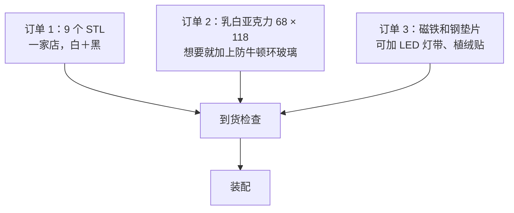

# 物料清单与采购

[English](bom.md) · **简体中文** · [日本語](bom.ja.md)

> 做一台 NeoBox 要买的全部东西——到了 v5 这份清单变短了，因为整机不需要任何工具、任何紧固件——每一项都写清了能让你避开错误版本的规格，并附上可直接复制给中国、日本及其他地区店家的下单话术。

**目录：**[造价](#造价) · [本仓库不替你买的东西](#本仓库不替你买的东西) · [工具与耗材](#工具与耗材) · [打印件](#打印件) · [采购件](#采购件) · [磁铁](#磁铁) · [买对规格](#买对规格) · [光源](#光源) · [下单顺序](#下单顺序) · [给店家的话术](#给店家的话术) · [到货检查](#到货检查)

---

## 造价

价格为参考价，取自 2026 年 8 月的中国电商平台（淘宝／1688），单位人民币。

| 分组 | 包含内容 | 价格（CNY） |
|---|---|---|
| 3D 打印 | 9 个打印件，白色与黑色 PLA | 50–110 |
| 扩散板 | 乳白亚克力，2 mm，切 68 × 118 mm | 5–10 |
| 磁铁与垫片 | 32 颗钕磁铁、4 片钢垫片 | 10–20 |
| **整台箱子，不含闪光灯** | 以上全部，各一份 | **CNY 65–140 · JPY 1,500–3,000** |

> [!NOTE]
> 逐行按极值相加正好是 CNY 65–140，其中大头是打印单。这个数字大约只有 v4（CNY 250–420）的三分之一：螺杆、螺母、热熔铜螺母、海绵条、过线圈和喷漆全没了，每个打印件也都缩小了。手上有 v4 的话，把旧扩散板裁小续用，亚克力这一行就直接归零。JPY 那个数字是同一台箱子折成日元的结果，不是在日本本地逐项采购的报价。

另计、且从不含在上述总价里的是三件可选升级：[防牛顿环玻璃](#采购件) CNY 15–30、[USB LED 灯带](#采购件) CNY 10–20、[植绒贴](#采购件) CNY 5–10——三件全买约 CNY 30–60。

---

## 本仓库不替你买的东西

NeoBox 只是一个光源。它是[相机翻拍](glossary.zh-CN.md#相机翻拍)（camera scanning，用数码相机拍摄胶片，而不是把胶片送进扫描仪）这套方案的一半，另一半得你自己准备。

| 你必须已经有、或者另外去买 | 它负责什么 |
|---|---|
| 机身 | 任何能手动曝光、能出 raw 的机身 |
| 具备微距能力的镜头 | 你要拍的画幅最小只有 24 × 36 mm，普通镜头对不到这么近 |
| 翻拍台（copy stand），或带横臂或可倒置中轴的三脚架 | 把相机端正地架在胶片正上方，而且高度可重复 |
| 闪光灯与引闪套装 | 任何功率手动可调的热靴闪光灯都行——参考组合与价格见[光源](#光源) |
| 装在相机热靴上的引闪发射器 | 参考引闪套装自带——但那套本来就不算在箱子的造价里 |
| 快门线或遥控器 | 曝光的时候不至于碰到相机 |
| 反相（inversion）软件 | 把 raw 负片转成正像 |

> [!IMPORTANT]
> CNY 65–140 买到的只有箱子。它不含闪光灯和引闪（参考组合两件合计 CNY 350–550），也不含上表里任何相机端的器材。下任何一单之前，先读[入门指南](getting-started.zh-CN.md#你需要自备的器材)里"你需要自备的器材"一节。

相机端怎么选、怎么用，写在[扫描文档](scanning.zh-CN.md#相机端器材)里。本页只管构成箱子的那些零件。

---

## 工具与耗材

这一节头一次列不出任何硬性要求。v5 整机没有螺丝、没有胶水、没有喷漆、也不需要任何工具：磁铁用手压入，其余零件全靠放置到位。下面留在桌上的东西是用箱子时要的，不是装箱子时要的。

| 工具或耗材 | 用来做什么 | 规格 |
|---|---|---|
| 吹气球 | 吹扩散板、插片和[片门](glossary.zh-CN.md#片门)——买了防牛顿环玻璃的话，装进去之前也要吹 | 皮吹球，不要用高压气罐 |
| 约 30 mm 的小平面镜 | 平行度校准：把镜子放在台面上，在取景器里让镜头自己的倒影居中 | 任何平整的镜子边角料 |
| 棉手套，或者洗干净的手 | 只捏片条的边缘 | — |
| 钢尺或卡尺 | 本页末尾的到货检查 | 200 mm 就够量 154.8 mm 的零件 |

32 颗又小又强的磁铁，动手之前仍然值得先读一遍：[装配文档](assembly.zh-CN.md#工具与安全)里的"工具与安全"。

---

## 打印件


*图纸尚在按 v5 重新生成——所有尺寸以本页文字为准。*

整机共 **9 个打印件**——白 2 件、黑 7 件，全部免支撑。

| 文件 | 颜色 | 外形（mm） | 是什么 |
|---|---|---|---|
| main-body.stl | 白 | 124.8 × 154.8 × 75.6 | 主箱：箱底加三面墙，前面完全敞开 |
| cover-stage.stl | 白 | 124.8 × 154.8 × 10.0 | 顶盖台：顶盖与胶片台合并成的一个零件 |
| film-holder-135-base.stl | 黑 | 94 × 120 × 5 | 135 夹底座，窗口 25 × 37 |
| film-holder-135-lid.stl | 黑 | 94 × 120 × 3 | 135 夹上盖 |
| film-holder-120-base.stl | 黑 | 94 × 120 × 5 | 120 夹底座，窗口 57 × 85（6×9 整格） |
| film-holder-120-lid.stl | 黑 | 94 × 120 × 3 | 120 夹上盖 |
| pressure-window-135.stl | 黑 | 64 × 95 × 2 | 135 压片窗插片 |
| pressure-window-120.stl | 黑 | 64 × 95 × 2 | 120 压片窗插片 |
| mask-6x6.stl | 黑 | 94 × 80 × 1 | 6×6 遮幅插片，垫在 120 底座下方 |

打印规格直接写进订单：普通 PLA，层高一律 0.2 mm，填充 15%，任何文件都不加[支撑](glossary.zh-CN.md#支撑)。所有零件平面朝下打印，只有两个夹上盖顶面朝下。层高、[填充](glossary.zh-CN.md#填充)和每个零件的参数卡，都在[打印文档](printing.zh-CN.md#打印参数)里。本页只告诉你要下什么单。

> [!IMPORTANT]
> 每个文件都放得进 **160 × 160 mm** 的[打印床](glossary.zh-CN.md#打印床尺寸)：整机最大的外形只有 154.8 mm。v4 那条 280 × 300 mm 的要求没有了，旧文档里关于 220 mm 打印床的告警也一并作废——任何常见的爱好级打印机都能在家打完整套。

> [!WARNING]
> 白色耗材必须是**哑光**的。两个白色件就是混光腔本身：闪光在这些墙面上反弹好几次才到扩散板，丝面和亮面白料会把灯头映成一块亮斑。内壁永远不喷漆、不做涂层，所以亮面的件打出来没法补救，只能换哑光料重打。要明确告诉店家这是硬性要求，不是偏好：说"最好用哑光"，机器上装着什么料就给你打什么料。

白色和黑色放在同一单里打是常规做法——一家店、一个订单、两种颜色。付款前先问清楚换料要不要另外收费。mask-6x6.stl 只在拍 6×6 时用，但它只费一克料，没有理由不放进同一单。

---

## 采购件

### 要买什么

| 项目 | 规格 | 数量 | 价格（CNY） |
|---|---|---|---|
| 乳白亚克力扩散板 | 2 mm，切 68 × 118 mm | 1（下单买 2 片） | 5–10 |
| 钕磁铁 | Ø8 × 2 mm，N35，普通轴向充磁圆片 | 32（多买几颗备用） | 8–15 |
| 钢垫片 | 10 × 10 × 1 mm 方片，或 Ø10 × 1 mm 圆片 | 4 | 2–5 |
| 防牛顿环玻璃——可选 | 64 × 95 × 2 mm，单面 AN 处理；一片两幅面通用 | 1 | 15–30 |
| USB LED 灯带——可选 | 5 V USB，两段 120 mm | 1 | 10–20 |
| 黑色植绒贴——可选 | 背胶，A5 | 1 | 5–10 |

前三行就是默认构型的全部采购件——整机没有一处螺纹。后三行是没有它们箱子照样能用的升级件：防牛顿环玻璃用一片玻璃替掉两个打印的压片窗插片、两幅面通用；LED 灯带贴在箱内侧壁作常亮定位灯；植绒贴消掉窗口四周台面的反光。

两个下单提示。**扩散板买 2 片**：乳白亚克力在运输途中容易崩边，它又正好处在光路上；多切一片几乎不要钱，重走一轮物流却要一周。从 v4 升级的话，旧的 110 × 130 mm 扩散板就是同样的 2 mm 乳白料——任何亚克力店都能帮你裁成 68 × 118 mm，这一行就从订单里划掉了。**磁铁多买几颗备用**：过盈压入最怕崩了边的磁铁，而 N35 圆片一颗只要几毛钱。

### 分地区搜索词

同一个零件，词用错就搜不出来，所以每一行都给了三地的说法。

| 项目 | 中国（淘宝／1688） | 日本（Amazon.jp／Monotaro／Yodobashi） | 其他地区（英文） |
|---|---|---|---|
| 乳白亚克力扩散板 | `乳白亚克力板 定制 2mm` | `乳半アクリル板 2mm 切断` | `opal acrylic sheet 2 mm cut to size` |
| 钕磁铁 | `钕磁铁 8x2mm N35` | `ネオジム磁石 丸型 8×2` | `neodymium disc magnet 8 × 2 mm N35` |
| 钢垫片 | `铁片 10x10x1` 或 `M5平垫片 外径10 铁` | `平座金 M5 外径10 鉄・ユニクロ` | `mild steel shim 10 × 10 × 1 mm` / `M5 steel washer, 10 mm OD` |
| 防牛顿环玻璃 | `防牛顿环玻璃 定制` | `アンチニュートンガラス` | `anti-Newton glass, cut to size` |
| USB LED 灯带 | `USB LED灯带 5V 线控调光 自然白` | `USB LEDテープライト 5V 調光 昼白色` | `USB LED strip 5 V dimmable neutral white` |
| 黑色植绒贴 | `黑色植绒布 背胶 A5` | `植毛シート 黒 粘着` | `self-adhesive black flocking sheet` |
| 3D 打印代打 | `3D打印 代打 PLA` | `3Dプリント 出力代行 PLA` | JLC3DP、PCBWay、Craftcloud，或者本地的创客空间 |

---

## 磁铁

32 颗 Ø8 × 2 mm 的 N35 磁铁，四个夹件（两个底座、两个上盖）每件 8 颗。全部用手过盈压入磁孔，整机没有一滴胶水。

| 作用 | 怎么实现 |
|---|---|
| 把胶片夹合紧 | 上盖 8 颗与底座 8 颗一一相对，每个夹子构成 8 对相吸磁铁 |
| 把夹子吸在顶盖台上 | 底座磁铁隔着夹底板，吸住嵌平在顶盖台沉孔里的 4 片钢垫片；掀起就脱开——换幅面只要几秒 |

CNY 8–15 就能连备用一起买齐 32 颗。底座磁铁吸的对象就是那 [4 片钢垫片](#采购件)，所以这两行该放进同一单：省掉垫片，夹子就没有任何东西把它固定在台面上。

> [!WARNING]
> 这种磁铁隔着一层皮肉相吸时夹得很疼，散落的钕磁铁对儿童和宠物更是严重的误吞风险。备用的请放进有盖的盒子。磁铁不标极性，而过盈压入并不比胶水好拆多少：每一对底座磁铁和上盖磁铁先凑在一起确认相吸，在压入**之前**把朝上的面标好。压反了的磁铁会把上盖顶开而不是吸住，挖出来通常连磁孔一起报废。具体步骤见[第 1 步——压入磁铁](assembly.zh-CN.md#第-1-步压入磁铁)里的"第 5 步——装胶片夹的磁铁"。

---

## 买对规格

六种把钱花出去、收到的东西却用不了的方式。

| 零件 | 常犯的错 | 下单时要讲明什么 |
|---|---|---|
| [乳白](glossary.zh-CN.md#乳白)亚克力扩散板 | 买成磨砂亚克力 | 乳白是整块板体都呈乳浊状，光在板内散射；磨砂只是透明亚克力把一面打毛，会把灯头映出来。要说"乳白、导光扩散、2 mm"，并给出 68 × 118 mm 的切割尺寸。板越浓，损失的光越多、匀度越好——闪光灯的功率有的是富余。 |
| 钕磁铁 | 厚度买错 | 磁孔是按 Ø8 × 2 mm 的普通轴向充磁圆片开的。3 mm 的会凸出来把上盖顶开；1 mm 的陷得太深吸不住。N35 就是普通牌号，足够用——N52 更贵，多出来的吸力用不上。 |
| 钢垫片 | 买成不锈钢 | 多数不锈钢几乎不被磁铁吸住，而这四片存在的唯一意义就是给磁铁一个吸附面。要碳钢或镀锌件，厚 1 mm 不能再厚——沉孔深 1 mm，垫片必须与台面齐平。10 × 10 方片或 Ø10 圆片都行。 |
| 防牛顿环玻璃 | 买成磨砂玻璃 | 防牛顿环玻璃是扫描仪和放大机的配件：一面带着肉眼几乎看不出的细微蚀纹，既压住牛顿环又不扩散影像。磨砂玻璃是扩散片，会毁掉锐度。要指明"单面防牛顿环处理，64 × 95 × 2 mm"。 |
| USB LED 灯带 | 买成 12 V 的 | 必须是 USB 供电的 5 V——任何接市电的东西都别靠近箱子。两段 120 mm 贴在箱内侧壁作常亮定位灯，任何可裁剪的 5 V 灯带都行。 |
| 黑色植绒贴 | 买成毛毡或亮面贴纸 | 植绒贴是表面带绒毛的背胶贴片；毛毡太厚，亮面贴纸反光。要哑光黑、背胶——一张 A5 就够贴满窗口四周的台面。 |

---

## 光源

| 项目 | 规格 | 价格（CNY） |
|---|---|---|
| 热靴闪光灯，任何品牌（参考型号：NEEWER TT560） | 硬性要求只有功率手动可调；参考机 TT560：[闪光指数](glossary.zh-CN.md#闪光指数) GN38，[手动 1/1–1/128](glossary.zh-CN.md#手动出力档位) 整档，≈ 5600 K | 200–300 |
| ZENIKO T1 引闪套装，或任何 2.4 GHz 套装 | 发射器＋接收器 | 150–250 |

闪光灯从来不进箱子。它平躺在桌面上，灯头怼在主箱完全敞开的前口，向白色混光腔里打光；接收器就留在灯上、留在箱外。旧版的那些限制正是因为这个摆法而消失的：无线信号毫无遮挡，换电池不用碰箱子，改功率直接在灯上拨。

选闪光灯真正要紧的只有一条：**功率能手动调**。[TTL](glossary.zh-CN.md#ttl) 和 [HSS](glossary.zh-CN.md#hss) 在这里毫无用处——别为它们花钱——而 v4 的第二条要求"灯头能转 90°"随着封闭箱体一起消失了：灯平躺着水平直射。

> [!NOTE]
> v4 那条警告——"公开的 STL 只适配 TT560，别的灯都不行"——已经不存在了。箱子的任何尺寸都不再取决于闪光灯机身，也就没有长度、厚度限制可查。TT560 留在表里只是作为便宜、好买的参考机型，不是要求；手上有什么手动灯就用什么。

---

## 下单顺序

三个订单，可以同一天全部发出——互相不等。



| 订单 | 常见货期 | 什么时候下 |
|---|---|---|
| 1——9 个 STL | 2–5 天，加物流 | 最先下——它是最长的一环 |
| 2——乳白亚克力，按尺寸切 | 3–7 天 | 同一天，与 1 并行 |
| 3——磁铁和钢垫片 | 次日到几天 | 随时 |
| 防牛顿环玻璃、LED 灯带、植绒贴（可选） | 3–7 天 | 跟订单 2、3 一起，或者等箱子跑通再说——打印插片本来就是默认方案 |

没有谁卡谁：v4 那条"先量顶盖立柱孔、再买热熔铜螺母"的规矩随着热熔铜螺母一起消失了。外包打印还想上个保险的话，可以先让店家打一副 135 夹试试片条能不能滑动——见[打印文档](printing.zh-CN.md#先打一副-135-胶片夹)的"先打一副 135 胶片夹"。零件小成这样，这一步只是锦上添花，不再是当年的关卡。

付款前要问打印店的三个问题：

- [ ] 有没有**哑光**白色 PLA 的现货？
- [ ] 会不会照写好的 0.2 层高打，而不是悄悄换成店里的默认参数？
- [ ] 白色和黑色放在一单里，换料要不要另外收费？

> [!TIP]
> 包装仍然要紧。让店家给打印件裹厚气泡膜——壁厚只有 2.4 mm——再让亚克力夹在打印件中间运输，乳白亚克力最容易崩边。

---

## 给店家的话术

可以直接复制粘贴的下单说明，每一份都用店家读得懂的语言写成。它们与[打印文档](printing.zh-CN.md#找代打服务下单)里"找代打服务下单"一节是一致的，那边把同一套要求按零件逐个列了一遍；改了一处，另一处也要跟着改。

九个文件全部免支撑，唯一不直观的摆放是两个夹上盖：成品的顶面朝下贴床。下面每份话术都写明了这一点——切片软件不会替你摆。

<details>
<summary>3D 打印下单说明——中国（淘宝／1688），中文</summary>

```
共 9 个 STL 文件，单位毫米，请勿缩放。
普通 PLA：白色 2 件、黑色 7 件。白色必须是哑光料
（丝面／亮面会把灯头映成亮斑）。
层高一律 0.2，填充 15%，全部免支撑。
摆放：全部平面朝下；只有两个夹上盖
（film-holder-135-lid / film-holder-120-lid）成品顶面朝下贴床。

白色 PLA 2 件：
  main-body.stl        124.8×154.8×75.6
  cover-stage.stl      124.8×154.8×10
黑色 PLA 7 件：
  film-holder-135-base.stl   94×120×5
  film-holder-135-lid.stl    94×120×3
  film-holder-120-base.stl   94×120×5
  film-holder-120-lid.stl    94×120×3
  pressure-window-135.stl    64×95×2
  pressure-window-120.stl    64×95×2
  mask-6x6.stl               94×80×1

最大件 154.8mm，160×160 打印床即可，不需要大尺寸机器。
```

店家嫌啰嗦时，只需咬住这两句：

```
层高 0.2、填充 15%、全部免支撑、平面朝下
（只有两个夹上盖顶面朝下）。白色必须哑光。
```

如需保险，可先让店家打一副 135 夹（夹底座＋夹上盖）试片条滑动，合适再打其余。搜索词：`3D打印 代打 PLA`

</details>

<details>
<summary>3D 打印下单说明——日本，日文</summary>

```
合計 9 ファイルです。単位はミリ、スケール変更は不可。
普通の PLA：白 2 点、黒 7 点。白はマット必須です
（シルク／光沢はストロボの発光部が明るい斑点として写り込みます）。
積層ピッチは全ファイル 0.2 mm、
インフィル 15 %、全ファイル サポート不要。
置き方：すべて平らな面をプレートに。ただしホルダー蓋 2 点
（film-holder-135-lid / film-holder-120-lid）のみ、
仕上がりの上面をプレートに向けてください。

白 PLA 2 点：
  main-body.stl        124.8×154.8×75.6
  cover-stage.stl      124.8×154.8×10
黒 PLA 7 点：
  film-holder-135-base.stl   94×120×5
  film-holder-135-lid.stl    94×120×3
  film-holder-120-base.stl   94×120×5
  film-holder-120-lid.stl    94×120×3
  pressure-window-135.stl    64×95×2
  pressure-window-120.stl    64×95×2
  mask-6x6.stl               94×80×1

最大のパーツは 154.8 mm。ビルドプレートは 160×160 mm で足ります。
```

先方が細かい指定を嫌う場合は、この二点だけ守ってもらってください。

```
積層ピッチは全ファイル 0.2 mm、インフィル 15 %、サポート不要、
すべて平面をプレートに（ホルダー蓋 2 点のみ上面を下に）。白はマット必須。
```

念のため、まず 135 のホルダー底＋蓋を 1 組だけ出力し、フィルムが滑ることを確認してから残りを発注するのも手です。検索ワード：`3Dプリント 出力代行 PLA`

</details>

<details>
<summary>3D 打印下单说明——其他地区，英文</summary>

```
9 STL files. Millimetres. Do not scale.
Plain PLA: 2 white parts, 7 black parts. White must be MATTE -
silk or gloss reproduces the flash head as a bright spot on the film.
0.2 mm layers on every file, 15% infill,
no supports on any file.
Placement: every part flat face down, except the two lids
(film-holder-135-lid, film-holder-120-lid): their finished TOP face
goes on the plate.

White PLA, 2 parts:
  main-body.stl        124.8 x 154.8 x 75.6
  cover-stage.stl      124.8 x 154.8 x 10
Black PLA, 7 parts:
  film-holder-135-base.stl   94 x 120 x 5
  film-holder-135-lid.stl    94 x 120 x 3
  film-holder-120-base.stl   94 x 120 x 5
  film-holder-120-lid.stl    94 x 120 x 3
  pressure-window-135.stl    64 x 95 x 2
  pressure-window-120.stl    64 x 95 x 2
  mask-6x6.stl               94 x 80 x 1

Largest part 154.8 mm: a 160 x 160 mm bed is enough.
```

想上保险的话：先打一个 135 夹底座和夹上盖，确认片条能滑动，再下其余七个文件的单。

</details>

<details>
<summary>乳白亚克力与防牛顿环玻璃切割说明——中文、日文、英文</summary>

中国（淘宝／1688）——亚克力：

```
乳白半透明亚克力 2mm 厚，68×118mm，切 2 块。
要乳白（板体本身扩散），不要磨砂透明板。
```

中国——防牛顿环玻璃（可选）：

```
防牛顿环玻璃，单面 AN 处理，2mm 厚，裁 64×95mm 一片。
要扫描仪／放大机用的防牛顿环玻璃，不是磨砂玻璃。
```

日本——亚克力：

```
乳半（乳白半透明）アクリル 厚 2 mm、68×118 mm に 2 枚切断してください。
表面をつや消しにした透明板ではなく、板そのものが光を拡散する
乳半材でお願いします。
```

日本——防牛顿环玻璃（可选）：

```
アンチニュートンガラス（片面 AN 処理）、厚 2 mm、64×95 mm に 1 枚。
すりガラスではなく、スキャナや引き伸ばし機に使う
アンチニュートンガラスでお願いします。
```

其他地区——亚克力：

```
Opal (white translucent, light-diffusing) acrylic, 2 mm thick,
cut 2 pieces at 68 x 118 mm.
Opal, not frosted clear - the sheet itself must diffuse, not just its surface.
```

其他地区——防牛顿环玻璃（可选）：

```
Anti-Newton glass, single-side AN treatment, 2 mm thick,
one piece cut to 64 x 95 mm.
Scanner / enlarger AN glass - not ground or frosted glass.
```

这几份都不需要图纸；切割尺寸就是全部规格。

</details>

### 店家推回来的时候

| 你会听到 | 它的意思 | 该怎么办 |
|---|---|---|
| "白色我只有亮面料的现货" | 这层光泽会在每一张片子上变成一块亮斑 | 等哑光料，或者把两个白色件挪到别家打。黑色件不受影响。 |
| "要不要挖空／把壁减薄，省点料？" | 未经允许的模型改动 | 不要。壁厚 2.4 mm、底厚 3.0 mm 是设计值。 |
| "0.12 或者 0.16 层高更好看" | 悄悄改规格 | 全部文件 0.2 mm——设计的高度网格就是 0.2，更粗的层高会让台阶落不到层边界上。除此之外什么都不改。 |
| "保险起见，到处都加支撑吧" | 朝向胶片的表面会留下疤痕 | 任何文件都不要支撑。每个零件都是按免支撑设计的。 |

---

## 到货检查

在压入任何一颗磁铁之前，先做完这些检查。打印服务最常见的事故仍然是切片软件上"缩放至适配打印床"忘了关——拿钢尺一量就能抓住它。

- [ ] **主箱**——外形 124.8 × 154.8 mm，从箱底到墙顶 75.6 mm。短了就说明文件被缩放过：整单退掉。
- [ ] **顶盖台**——124.8 × 154.8 mm；不用使劲就能搁上箱壁，四个定位榫各自落进榫槽。
- [ ] **胶片夹**——上盖能平贴在底座上；一段片条能在底座[滑槽](glossary.zh-CN.md#滑槽)里顺畅滑动。
- [ ] **压片窗插片**——能落进各自底座的元件台阶（元件台阶）并放平。
- [ ] **扩散板**——整片均匀乳浊，没有透亮的窗口，也没有亮斑；能放进顶盖台底面的暗槽。保护膜留到装配时再撕，撕的时候**两面**都要撕。
- [ ] **钢垫片**——磁铁吸得住（吸不住就是不锈钢的：退货）；放进沉孔后与台面齐平，不凸出。
- [ ] **磁铁**——每颗底座磁铁和上盖磁铁逐对确认相吸，在压入任何一颗之前把朝上的面标好。
- [ ] **防牛顿环玻璃（如果买了）**——64 × 95 mm，一面有隐约的哑光 AN 处理。
- [ ] **LED 灯带（如果买了）**——接 USB 充电宝能亮。

有任何一项没过，先去[排障文档](troubleshooting.zh-CN.md#打印)，别让它靠近装配台。全部打上勾之后：在家打印的接着看[打印文档](printing.zh-CN.md#装配前逐件检查)，不在家打印的直接进[装配](assembly.zh-CN.md)。

---

← [入门指南](getting-started.zh-CN.md) · [文档索引](../README.zh-CN.md#文档) · [打印](printing.zh-CN.md) →
