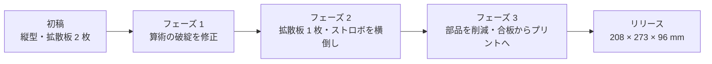

# 設計ログ

[English](design-log.md) · [简体中文](design-log.zh-CN.md) · **日本語**

> NeoBox がなぜこの形に落ち着いたのか。決定を下した順に並べた 24 件と、検討したうえで見送った 4 つのアイデアです。何かを改造する前に読んでください。

**目次：** [このログの読み方](#このログの読み方) · [フェーズ 1：初稿は成立しなかった](#フェーズ-1初稿は成立しなかった) · [フェーズ 2：32 リットルから約 5 リットルへ](#フェーズ-232-リットルから約-5-リットルへ) · [フェーズ 3：不要なものをすべて削る](#フェーズ-3不要なものをすべて削る) · [フェーズ 4：ストロボが箱を出る](#フェーズ-4ストロボが箱を出る) · [あえてやらなかったこと](#あえてやらなかったこと)

## このログの読み方

設計は 3 つのフェーズを通りました。算術の合わない初稿を立て直す段階、背の高い縦型を平たい横型へ潰す段階、そして不要と分かったものを片端から削る段階です。

> [!NOTE]
> ここに書かれた結論は、どれも実物を作って得たものではありません。**この箱はまだ一度も出力も撮影も均一性の測定もされていません。** 以下の判断はすべて CAD と計算の上で、あるいは出力業者とのやり取りの中で下したものです。挙げてある寸法はリリース版の形状であり、旧改訂の数値は再検証していないので繰り返しません。

各エントリは見出しになっているので、どれもほかのページからリンクできます。たとえば `design-log.ja.md#18-ホルダーを積層ピッチに量子化` のように書きます。

## フェーズ 1：初稿は成立しなかった

最初の仕様は、拡散板 2 層の下にストロボを足で立てて置く縦型の箱でした。その形は何一つ残っていませんが、そこで生まれたルールのうち 5 つは今も生きています。

*収録エントリ：[1](#1-高さが算術的に成立しなかった) · [2](#2-枠のない拡散板は光が漏れる) · [3](#3-最終拡散板より上を白にしたのは誤りだった) · [4](#4-発光部のセンタリングストッパー) · [5](#5-水平調整の荷重を受けられる天面) · [6](#6-ストレートな穴ではなく遮光ラビリンスの通気) · [7](#7-均一性を判定する前にフラットフィールド補正) · [8](#8-大判への布石)*

### 1. 高さが算術的に成立しなかった

初稿は 3 つの空隙を積み上げる構成でした——発光部から 1 枚目の拡散板まで、拡散板 2 枚のあいだで光を混ぜる空間、そして 2 枚目の上の黒いチャンバーです。足し合わせると、同じ文書が宣言していた内寸高さを超えていました。しかもその予算には、ストロボ本体そのものが入っていません。

修正は数値ではなく、方法でした。

> [!IMPORTANT]
> **高さは床から実測した層を積み上げて求め、そのうえで外形寸法を読み取ること。外形高さを先に決めて層を逆算してはいけません。** リリース版のスタックはこの方法で導いてあり、[design.ja.md](design.ja.md#2-寸法チェーン) に一覧してあります。

### 2. 枠のない拡散板は光が漏れる

拡散板は、それが収まる拡散チャンバーより小さいものでした。つまり光は板を通らずに縁を回り込めます。各拡散板には、発光する窓だけを開けた全幅のキャリアパネルを与えました。

**教訓：光に回り道がなくて初めて、拡散板は拡散板になる。**

### 3. 最終拡散板より上を白にしたのは誤りだった

最終拡散板より上の白い壁は、迷光をフィルムへ跳ね返してコントラストを下げます。この区間はつや消し黒に変えました。このルールはリリース版まで生き残っています——拡散板より上はすべて黒、下は無塗装の白いフィラメントのままです。

**教訓：拡散板より下は白、上は黒。**

### 4. 発光部のセンタリングストッパー

寝かせたスピードライトの発光部は、箱の中心線に乗ってくれません。そしてホットスポットは発光部について動きます。初稿には、光学系が前提としていた位置に発光部を置くためのストッパーが加わりました。リリース版では同じ仕事を手順で果たします——ストロボの周囲をなぞって床に線を引き、毎回同じ場所に戻るようにします。

**教訓：位置が光を左右する部品には、位置決め形状か目印か、どちらかを与える。**

### 5. 水平調整の荷重を受けられる天面

初稿は薄い板の天面に水平調整ねじを直接載せており、ねじは板を潰していたはずです。天面は、金属の受け点を持つ厚いパネルになりました。リリース版の天板もこの原則を保っています——3 個のインサートナットは、4 mm の天板そのものではなく、その裏側に立つ専用のポストに収まっています。

**教訓：水平調整点は荷重の通り道である。裏に材料を置く。**

### 6. ストレートな穴ではなく遮光ラビリンスの通気

ライトボックスにまっすぐな通気穴を開けるのは、肩書きを与えた光漏れです。初稿の通気口はラビリンスになりました。リリース版はさらに先へ進み、通気口を 1 つも持ちません——後述の[換気](#換気)を参照してください。

**教訓：筐体に開ける穴は、熱の判断である前に光学の判断。**

### 7. 均一性を判定する前にフラットフィールド補正

初稿の均一性目標は、レンズ自身の周辺減光と光源の本当のムラという別々のものを混同していました。[フラットフィールド補正 (flat-field correction)](glossary.ja.md#フラットフィールド補正-flat-field-correction)——何も載せない発光面を撮影し、そのコマで減光を割り戻す処理——が、この 2 つを切り分けます。光源そのものに対する目標は四隅で **±0.1 [EV](glossary.ja.md#ev-露出値)**、しかもこの補正の前ではなく後に適用される値です。

**教訓：公差は何を基準に測るのかまで書く。書かなければ誰も満たせない。**

### 8. 大判への布石

将来の 4×5 版に向けた確保は、箱の本体と同じ「ストロボの高さを数え忘れる」誤りを抱えていたので、スケーリングではなく層の足し算から計算し直しました。それでも確保にとどまります——リリース版の箱は 100 × 120 mm の開口を通して、35 mm と 6×9 までの 120 フィルムを扱います。

## フェーズ 2：32 リットルから約 5 リットルへ

3 つの決定が、縦型のキャビネットを机に載るものへ変えました。

*収録エントリ：[9](#9-拡散板-2-枚を-1-枚に) · [10](#10-縦置きから横倒しへ) · [11](#11-小型ストロボでは小さくならない)*

### 9. 拡散板 2 枚を 1 枚に

拡散層を 2 枚重ね、そのあいだに光を混ぜる空間を置く——これは均一な発光面を作る教科書どおりのやり方で、初稿があれほど背が高かった理由の大半でもありました。これを 1 枚に削りました。

この選択は、この箱を測って裏づけたものでは**ありません**。ライトパッドの上に直接フィルムを置き、1 枚の拡散面をそのすぐ下に置く——作者が現に使っているカメラスキャンの作業手順から持ち込んだ判断です。残った 1 枚の下で光を混ぜる距離は、引き継ぐのではなく広げました。2 層構成のすきまは 2 枚目へ光を供給するための値であり、そのまま写していれば、ストロボのホットスポットが発光面にそのまま焼き付いていたはずです。

**教訓：半分を削除した設計から写した寸法は、寸法ではなく残骸である。**

### 10. 縦置きから横倒しへ

箱の高さは依然として「足で立てたストロボ＋垂直方向に光を混ぜる距離」に人質を取られており、設置面積は拡散板 2 枚時代の遺物でした。ストロボを寝かせて横向きに発光させると、光を混ぜる距離は箱の奥行きへ移ります——ストロボ本体がすでに占めていた奥行きです。

この 1 つの変更で、体積は約 **32 リットルから約 5 リットル**になりました。リリース版は 208 × 273 × 96 mm、約 5.4 リットルです。途中の改訂では 45° の反射板で光を曲げていましたが、これは後に削除されました（[エントリ 16](#16-締結具と内部パーツの削除)）。

**教訓：箱が高すぎるときは、1 つの寸法が 2 つの仕事をしている場所を探して、横に倒す。**

### 11. 小型ストロボでは小さくならない

レイアウトを確定する前に 4 つの代替を検証しました——Godox TT350、iM30Pro、iT30Pro、KEKS KF-01。どれも箱を実質的に小さくしません。

小さいストロボにしても箱が小さくならない理由

縦型のレイアウトでは、光を混ぜる距離を決めるのは幾何であってストロボではありません。厚みゼロのストロボという思考実験でさえ、横型のレイアウトには勝てません。横型では、幅を決めるのは開口とフィルムステージです——中に何が入っていようと 208 mm です——そして奥行きは、ストロボ本体・トリガーのレシーバー・反射ゾーンが一列に並ぶことで決まります。小さいストロボは体積を買えず、出力の余裕とチャージ時間を失います。

そこで設計は、作者がすでに持っていた機材に固定されました。NEEWER TT560 スピードライトと ZENIKO T1 トリガーセットです。公開している STL はこのストロボにしか合いません。別のストロボの数値は [design.ja.md](design.ja.md#別のストロボへの一般化) の式で求まりますが、式はファイルの寸法を変えてはくれません。

**教訓：いま手に持っている部品を最適化する前に、実際にサイズを決めている寸法を見つける。**

## フェーズ 3：不要なものをすべて削る

9 件のエントリ。うち 3 件は、作者よりも注意深く図面を読んだ出力業者がきっかけです。

*収録エントリ：[12](#12-中間キャリアパネルと黒チャンバーの削除) · [13](#13-拡散板をフィルムステージの上へ) · [14](#14-縦置き運用のための確実な固定) · [15](#15-合板から-3d-プリントへ) · [16](#16-締結具と内部パーツの削除) · [17](#17-フィルム走行路) · [18](#18-ホルダーを積層ピッチに量子化) · [19](#19-1-層だけの段差をなくす) · [20](#20-向きの指示は作業者に見えるもので書く)*

### 12. 中間キャリアパネルと黒チャンバーの削除

拡散板が 1 枚になると、2 枚目を囲っていたキャリアパネルには囲うものがなく、その上の黒いチャンバーには内張りするものがありませんでした。どちらも削除し、拡散板は開口の真上へ、そして拡散チャンバーは一様な白になりました。135 と 120 のフィルムホルダーは、同じ改訂で設計・確定しています。

**教訓：部品を消すと、たいていそれを支えるために存在していた部品が宙に浮く。作り込み直す前に下流を確認する。**

### 13. 拡散板をフィルムステージの上へ

乳白アクリル拡散板を筐体の中から取り出し、フィルムステージの上——開口をまたいで載せ、フィルムホルダーの重さで平らに保たれる位置——へ移しました。フィルムから拡散板までは約 **4.3 mm** となり、この設計が手本にしたライトパッドの幾何と一致します。

これは塵とのトレードです。拡散板の上の粒子は、[撮影倍率 (magnification ratio)](glossary.ja.md#撮影倍率-magnification-ratio) 0.43×（6×6 をフルサイズで撮る場合）・f/8 のとき、フィルム面で径およそ 0.2 mm のぼやけた塊として写ります。反転したネガでは見えず、ポジでは見えます。それでも受け入れたのは、代償が公差ではなく手順に落ちるからです——セッションの最初に、拡散板の両面と[フィルムゲート (film gate)](glossary.ja.md#フィルムゲート-film-gate)をブロアーで払う。それだけです。直射防止のバッフルとそのブラケットも、同じときに消えました。

> [!NOTE]
> この改訂では、内部の内張りをパネルへの白塗装に置き換えてもいます。それは合板構造に属する話で、[エントリ 15](#15-合板から-3d-プリントへ) を生き延びませんでした。**プリントした箱の内側は塗装しないでください**——内部は設計上、無塗装の白いフィラメントです。

**教訓：光学的に正しい位置へ部品を動かすことは、その代償が手順に収まるなら、維持コストを払う価値がある。**

### 14. 縦置き運用のための確実な固定

箱を立てて使うには、重力で位置が決まっていた部品をすべて、確実に保持される部品に変える必要がありました。各ホルダー底のマグネット 4 個がフィルムステージ上の鉄ワッシャーに吸い付き、フィルムステージ自体は、天板のインサートナットにねじ込んだ寸切りボルト 3 本の上で、下ナットと上ナットに挟持されます。

本物の誤りが捕まったのはここです。ステージの穴は、ねじ穴として指定されていました。同じピッチの寸切りボルトにねじを切った板を組み合わせると差動ねじ (differential screw)になります——板と寸切りボルトが一緒に進むので、高さがまったく設定できません。穴は Ø6.5 mm のバカ穴 (clearance hole) になりました。

> [!CAUTION]
> フィルムステージの 3 つの穴には、絶対にタップを立てないでください。Ø6.5 mm のバカ穴が必須です——ねじを切った板は水平出しができませんし、後からもみ直すとたいてい板が使い物にならなくなります。

**教訓：締結方式は強度だけでなく、運動学の面からも点検する。**

### 15. 合板から 3D プリントへ

タブとスロットで組む合板シェルのレーザーカット図面を描いたところで、そもそも最初からプリントする箱のつもりだったと分かり、廃案にしました。

プリント化によって壁は 3 mm、床は 4 mm まで薄くなり、内部の塗装はすべて不要になり、木用のねじインサートは熱圧入の真鍮に替わり、ケーブルグランドの穴とアクセス開口はプリント後の加工ではなくプリントそのものの一部になりました。内部の光学寸法は 1 つも変わっていません。合板の DXF は `cad/legacy-plywood/` に残っていますが、これは部分的なパネルセットの歴史的記録であって、**組み立てられる代替案ではありません**。この箱に合板ルートは存在しません。

**教訓：光学がまだ部品ではなく数値であるうちに、製法を変える。**

### 16. 締結具と内部パーツの削除

天板を押さえていた M3 のポスト 6 本は、10 mm のスカートを持ち、ただ被せるだけの天板になりました。スカートが位置決め形状と遮光を兼ね、筐体を組み立てるためのねじは 1 本も残っていません。

続いて内部パーツが次々に消えました。引き出しトレイ（ストロボは床に直接寝ます）、そのブラケット、ストロボを縛るストラップ、そして最後に 45° の反射板です。奥の壁がすでに光の転向を担っており、内部パーツは 1 つ増えるごとに位置合わせが 1 つ増えるだけだからです。標準ビルドに残ったのは**プリント 8 点**、乳白アクリル拡散板 1 枚、寸切りボルト 3 本——オプションの 6×6 マスクを含めて STL は 9 ファイルです。

**教訓：いちばん安い部品は、そこに無い部品。**

### 17. フィルム走行路

一体型フィルムステージの最初の勘合チェックで、2 つのブロックがホルダーの両端——ちょうど溝の入口の正面——に座り、その頂面がフィルム面のすぐ下にあることが分かりました。フィルムストリップを通すことは不可能だったはずです。同じ点検で、前側の寸切りボルトが、フィルムの通り道の真ん中でフィルム高さまで立っていることも見つかりました。

どちらも、縮めるのではなく動かしました。ブロックは |x| = 40–60 mm の 4 つのコーナーブロックになり、これで溝の入口は両側とも全開です。前側の寸切りボルトは、ステージ中心を基準に (45, −100) mm へ移りました。この制約はいまや恒久的なものです——ホルダーの両端より外側では、|x| < 31 mm の内側にフィルム高さ付近まで立ち上がるものを置いてはいけません。31 mm は 120 フィルムの幅（約 62 mm）の半分です。この空間が[フィルム走行路 (run-out corridor)](glossary.ja.md#フィルム走行路-run-out-corridor)です。

**教訓：部品どうしのすきまだけでは足りない。動くワークが掃く走行路そのものを、1 つの部品として扱う。**

### 18. ホルダーを積層ピッチに量子化

出力業者はホルダーの露出した z 段差を実測し、図面が要求していた 0.12–0.16 mm の[積層ピッチ (layer height)](glossary.ja.md#積層ピッチ-layer-height)に難色を示しました。自分たちの標準である 0.2 mm では、その段差はきれいに出ない、というのです。業者が正しく、悪いのはプリンタではなく形状のほうでした。0.5 mm の段差は、一般的な積層ピッチのどの整数倍でもありません——2.5 層にスライスされ、切り上げるか切り下げるかはスライサーの裁量に委ねられます。

キャリブレーションを議論する代わりに、z 方向の形状をすべて 0.2 mm の整数倍へ再量子化しました。その結果、溝はフィルム面を動かさないまま **0.4 mm** になりました。同じ改訂で窓も片側およそ 0.5 mm 広げ——135 は 25 × 37 mm、120 は 57 × 85 mm——カメラの画面枠の個体差とプリンタの XY 公差を吸収させています。切り抜きは後処理で行ってください。

**教訓：製造プロセスが表現できない寸法は、業者の限界ではなく設計のバグである。**

### 19. 1 層だけの段差をなくす

業者との 3 巡目です。0.2 mm のまま残っていた形状——ホルダー底の受けの逃げ、ホルダー蓋の裏の押さえリブ——は、標準の積層ピッチではちょうど 1 層分の高さです。理論上は出力できますが、1 層だけの段差はファーストレイヤーの潰れと吐出量のキャリブレーションに人質を取られるので、業者はもう少し高さが欲しいと求めてきました。

現在はすべて 0.4 mm、2 層分です。しかも効いてくるものは何一つ動かしていません。底板を 3.8 mm に薄くして、受けの頂面——フィルム面——を据え置いたまま逃げを倍にしました。ホルダー蓋の板とレールは一緒に上がり、押さえリブは深くなりながら、溝は 0.4 mm のままです。押さえリブにはレールとのあいだに 0.3 mm の逃げも与え、ホルダー蓋が食い込まないようにしました。フィルム面、溝、窓、外形、マグネットの間隔——いずれも変更なしです。

**教訓：露出する z 段差は 2 層を下回らせない。1 層は形状ではなく、表面の仕上がりである。**

### 20. 向きの指示は作業者に見えるもので書く

業者から、図面の向きの指示——溝のある面を名指しした初版の文言で、いまはどの文書からも削除済み——が実際にはどの面を指すのかと質問が来ました。プリントの物理から答えを導き直したところ、その指示自体が誤りだと判明しました。あの向きではホルダー底が 2 本のレールの頂で立ち、フィルムが載る受けが宙に浮きます——平らでなければならない唯一の面を[サポート (supports)](glossary.ja.md#サポート-supports)の上に築くことになります。

ホルダーの全パーツの正しい向きは、平らな面を下にし、形状を上へ伸ばし、サポートは一切使わないことです。ただしスライサーは自分ではそこへ行き着きません——`film-holder-*-lid.stl` は押さえリブを下にして読み込まれるので、読み込んだあとに X 軸まわりに 180° 回転させる必要があります。発注文面はすべて、作業者に見える特徴でパーツを置く方式に改めました（「長いリブが 2 本ある面を上に」）。サポート位置も明記します。[printing.ja.md](printing.ja.md#9-点のパーツ) のパーツごとのカードも、同じルールに従っています。

**教訓：読み手に見えない面を名指しした指示は、指示ではない。指させる特徴を名指しする。**

## フェーズ 4：ストロボが箱を出る

フェーズ 3 は、リリースされた 208 × 273 × 96 mm の箱で 3 フェーズの歴史を締めくくりました。そのあと、箱は実際に作られました。v4 は出力業者にプリントしてもらい、約 1,200 人民元かかりました。そして、その実物を手に持って行った実験が、設計をもう一度こじ開けました。以下の 4 件は 2026-08-14 に追記したもので、設計を **v5** へ進めます。

> [!NOTE]
> [このログの読み方](#このログの読み方)にある注記はこれらのエントリより前に書かれたもので、いまは 1 つの修正が要ります——**v4 はプリントされ、手に取って使われました。v5 はまだです。** v5 は一度も出力も撮影も均一性の測定もされていません。下記で報告する v4 の手持ちでの観察を除けば、v5 の数値はすべて CAD と計算です（`cad/neobox.blend`）。

*収録エントリ：[21](#21-ストロボを箱の外へ前面は全開に) · [22](#22-フィルム押さえは交換式インサート方式に収束) · [23](#23-ねじの全廃) · [24](#24-天板とフィルムステージの一体化と薄肉化)*

### 21. ストロボを箱の外へ、前面は全開に

v4 の設置面積は、「ストロボは箱の中に住む」という前提の上に立っていました。奥行きはストロボ本体・トリガーのレシーバー・反射ゾーンが一列に並んだ長さで（[エントリ 11](#11-小型ストロボでは小さくならない)）、アクセスパネルはそれらに手を届かせるために存在していました。ところが、プリントされた v4 実機での手持ちテストで分かったことがあります。ストロボを箱の中に据えず、ただ開口に構えて白いチャンバーへ発光させても、フィルム開口の光は目視で十分に均一だったのです。校正された測定ではありません——[エントリ 7](#7-均一性を判定する前にフラットフィールド補正) のフラットフィールドの規律は引き続き有効です——それでも、ストロボ格納部に引導を渡すには十分でした。光を混ぜているのは白い壁であって、ストロボの周りの囲いではなかったのです。

v5 では、ストロボは最初から最後まで箱に入りません。机の上に寝かせ、発光部を**全開の前面（オープンフロント）**——前壁はそもそも存在しません——に突き当てて、チャンバーの中へ発光させます。ZENIKO T1 のレシーバーもストロボと一緒に箱の外に残ります。電波の通りが良く、電池交換で何かを開ける必要もありません。特定の 1 台のための車庫だったものは、ただ光を混ぜるためのチャンバーになりました。

- 本体の箱は 208 × 273 × 96 mm から **124.8 × 154.8 × 73 mm** へ。プリント材料はおよそ 65 % 減。
- アクセスパネルは削除。箱の中に、手を届かせる相手がもういません。
- **ホットシューのストロボなら何でも使えます。** STL はもう TT560 の寸法を形状に刻んでいません。TT560 は単なる参考機種になりました。
- 最大パーツは長さ 154.8 mm。160 × 160 mm のビルドプレートで全部品が出力できます。旧文書の 220 mm ベッドの注意書きは失効です。

代償として、開いた前面からは環境光が入ります。それでも受け入れました。ストロボの発光量は室内光を圧倒するからです——薄暗い部屋で撮影し、天井照明が開口へ直接差し込まないようにしてください。

**教訓：箱の中へ光を向けるだけの部品は、箱の中に住む必要がない。**

### 22. フィルム押さえは交換式インサート方式に収束

v4 はホルダー蓋の裏の押さえリブと 0.4 mm の溝でフィルムを平らにしていました（[エントリ 18](#18-ホルダーを積層ピッチに量子化)・[19](#19-1-層だけの段差をなくす)）。v5 ではこの問いを最初から開け直し、生き残れなかった 3 つの答えを経て着地しました。

- **押さえリブ、まずは持ち越し。** リブは窓の四辺でしかフィルムを拘束できず、全画面の平面性へ向かうガラスというアップグレード路線が手招きし続けていました。
- **持ち上げるガラス蓋。** 窓の上に任意で載せ、コマを送るたびに持ち上げるガラス。テンポで却下です。[エントリ 13](#13-拡散板をフィルムステージの上へ) が受け入れたのはセッションに 1 回で済む代償でした。コマごとにガラスを持ち上げるのは代償を 1 コマごとに払うことで、36 枚撮り 1 本ではワークフロー全体で最も遅い工程になります。
- **フォームによる吊り。** エレメントを蓋の裏のフォームで押さえる案。寿命で却下です。フォームは経年劣化し、予圧は年々抜けていきます。
- **インサートのプラットフォーム。** ホルダー底の外レールが **4.6 mm のエレメント段**を一周持ち、その段に交換式の押さえエレメントを落とし込みます——標準はプリントの**押さえ窓インサート**、アップグレードは 1 枚の**アンチニュートンガラス**。エレメントは一度据えたら二度と触りません。フィルムは 4.2 mm の受けに載り、エレメントの下面は 4.6 mm——つまり **0.4 mm のチャネル**が四辺にも画面全体にも通り、コマ送りはリーダーをつまんで引き抜くだけです。蓋も開けず、エレメントも持ち上げず、カールは滑り抜けるあいだにエレメントの下面で平らに押さえられます。

CAD 上の数値では、インサート方式でフィルムが窓の中で持ち上がれるのは最大およそ 0.28 mm——等倍・f/8 での被写界深度およそ ±0.4 mm の中に収まります。ガラス方式なら画面全体に連続で蓋ができます。**64 × 95 × 2 mm** のガラス 1 枚が両フォーマット共通です。135 の底がレールを二重に持つからです——内レールが幅の狭いフィルムを案内し、外レールは 120 の底と同じエレメント段を共有します。インサートはフォーマットごと、ガラスはこの 1 枚だけです。

**教訓：作業者の動作はセッション単位ではなくコマ単位で予算を組む。二度と動かさない部品こそ、位置がずれない部品である。**

### 23. ねじの全廃

v4 はフィルムステージを 3 本の M6 寸切りボルトの上下ナットで挟み、ボルトはインサートナットにねじ込まれ、ナットを回して水平を出していました（[エントリ 14](#14-縦置き運用のための確実な固定)）。v5 はその一式を丸ごと削除します——寸切りボルト 3 本、ナット 6 個、インサートナット、そして機体のあらゆるねじの嵌め合いを。理由は 2 つの確信です。

- **プラスチックにねじを担わせない。** 真鍮のインサートを使っても、ねじの荷重は結局その周りのプラスチックに落ちます。プリントした機械のねじ結合は、どれも摩耗する箇所であると同時に公差の積み重ねです（[エントリ 5](#5-水平調整の荷重を受けられる天面) のポストは、その仕組みに仕えるためだけの機構でした）。
- **水平出しは箱ではなくカメラ側の仕事。** フィルムステージに小さな鏡を置き、ファインダーを覗きます。レンズ自身の反射像が中心に来たとき、センサーはフィルム面と平行です。このひと目の確認は、本当に大事な 2 面を直接そろえ、ついでに箱のプリント公差まで吸収します——ボルトをいくら回しても同じことはできません。ボルトが調整できるのは箱であって、その上のカメラを見ることはできないからです。

ねじが退場したあと、組み立ては重力とマグネットだけです。天板ステージは箱の壁の上に載り、壁の頂の 4 つの**位置決めダボ**が四隅の**ダボ穴**へ落ちて位置が決まります。置き方は 1 通り、締めるものは皆無、組み立てに工具は 1 本も要りません。エントリ 14 の CAUTION は v4 のハードウェアには引き続き有効です。v5 には、そもそもタップを立てるステージ穴が存在しません。

**教訓：調整は誤差が見える場所に置く。箱のねじは推測し、フィルム面の鏡は見る。**

### 24. 天板とフィルムステージの一体化と薄肉化

v4 試作の請求書——約 1,200 人民元——は、この設計が受け取った中で最も鋭いレビューでした。出力業者は体積に課金します。壁の 1 枚 1 枚が請求項目なのです。v5 はグラム数へ直接切り込みます。

- **壁 2.4 mm・床 3.0 mm**（それまでは 3 と 4）。ねじの嵌め合いが消えたので（[エントリ 23](#23-ねじの全廃)）、締結の荷重を受ける壁も板もありません。シェルの仕事は、立っていること、白いこと、天板ステージの位置を決めること——それだけです。
- **天板とフィルムステージは 1 部品に統合——天板ステージ**です。壁の上に載る 1 枚の板が、ホルダーの受けトレイ・採光窓・アクリルの収まりをすべて持ちます。ビルド最大級のパーツが 1 つ消え、2 部品のあいだの継ぎ目も一緒に消えました。
- **アクリル拡散板は 68 × 118 mm に縮小**（v4 は 110 × 130。旧材はアクリル店で裁ち直して続用できます）。
- **鉄ワッシャーは 10 × 10 mm のスチールシム 4 枚**になり、天板ステージのざぐりに沈んで面一に収まります。

すべてのパーツは引き続きサポートなし・平らな面を下にして出力します。9 ファイル一式の見積もりは **300–350 g** のフィラメント——ほかの v5 の数値と同じく机上の見積もりですが、次の請求書が答え合わせをしてくれます。

**教訓：プリント体積は結果ではなく仕様である。ほかの寸法と同じように、予算を 1 行与える。**

## あえてやらなかったこと

検討に値するとして俎上に載せ、そのうえで見送った 4 つの変更です。このどれかを提案しようとしているなら、まずここから読んでください。

*[LED パネル](#ストロボの代わりに高演色-led-パネル) · [2 枚目の拡散板](#2-枚目の拡散板) · [天板の一体化](#天板を本体と一体化する) · [換気](#換気)*

### ストロボの代わりに高演色 LED パネル

箱を有意に小さくできる唯一の変更です——高さ約 100 mm、約 4 リットル。LED パネルはそれ自体がすでに面光源で、光を混ぜる距離をほとんど必要としないからです。

それでもストロボを採って、この案は見送りました。閉じた箱の中ではストロボの発光そのものが露光のすべてなので、振動もシャッターショックも問題でなくなり、ベース ISO・f/8 でも出力に余裕が残ります。とはいえアクセスパネルは、フィルム面もカメラの高さも動かさずに、後から LED パネルへ換装できる寸法にしてあります。

### 2 枚目の拡散板

拡散板が 2 枚あれば均一性は上がります。現在の設計で 2 枚目とそのチャンバーを復活させると、高さが約 **43 mm** 増えます。再検討に値するのは、4×5 版を作るとき、あるいはポジに対して 1 枚では力不足だと分かったときだけです。

### 天板を本体と一体化する

出力できるかどうかだけで却下しました。閉じた中空の箱は、拡散チャンバーの天井に 202 × 267 mm の無支持スパンを作ります。FDM ではこれを[ブリッジ (bridging)](glossary.ja.md#ブリッジ-bridging)できません。内部にサポートを詰めるしかありませんが、それは 190 × 76 mm のアクセス開口からしか取り出せず、光学的な天井に傷跡が残ります。ほかの面を下にして出力しても、問題が移動するだけです。

そもそも得られるものがありません。天板はもともと締結具なしで付いており、そのスカートが遮光を担っています。継ぎ目のない案が 1 つだけ本当に成立します——天板をビルドプレートに置き、そこから壁を立ち上げ、アクセスパネルを床面へ移す構成です。ただしこれは天面の継ぎ目を底面の継ぎ目に替えるだけで、しかも全体をモデリングし直すことになります。天板が緩く感じるなら、一体化するより、スカートに小さなタッピンねじを 2 本通すほうがずっと優れています。

### 換気

プロトタイプでは省きました。低いデューティサイクルで使うスピードライトはほとんど発熱しませんし、穴はどれも光漏れの候補です。セッションが熱を持つようなら、ロールとロールのあいだにアクセスパネルを抜いてください。

---

← [設計](design.ja.md#設計) · [ドキュメント一覧](../README.ja.md#ドキュメント) · [用語集](glossary.ja.md#用語集) →
