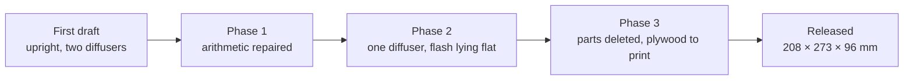

# Design log

**English** · [简体中文](design-log.zh-CN.md) · [日本語](design-log.ja.md)

> Why NeoBox ended up this shape: twenty decisions in the order they were taken, and the four ideas that were considered and turned down. Read it before you modify anything.

**Contents:** [How to read this log](#how-to-read-this-log) · [Phase 1: the first draft did not close](#phase-1-the-first-draft-did-not-close) · [Phase 2: from 32 litres to about 5](#phase-2-from-32-litres-to-about-5) · [Phase 3: removing everything unnecessary](#phase-3-removing-everything-unnecessary) · [Things deliberately not done](#things-deliberately-not-done)

## How to read this log

The design moved through three phases: repairing a first draft whose arithmetic did not close, collapsing a tall upright box into a flat horizontal one, and then deleting everything that turned out to be unnecessary.

> [!NOTE]
> Nothing here was settled by building anything. **The box has never been printed, photographed or evenness-tested.** Every decision below was reached in CAD and arithmetic, or in correspondence with a print vendor. Dimensions quoted are the released geometry; figures from superseded revisions are not repeated, because they were never re-verified.

Each entry is a heading, so any of them can be linked from elsewhere — for example `design-log.md#18-layer-quantised-holders`.

## Phase 1: the first draft did not close

The first specification was an upright box that stood the flash on its foot under two diffuser layers. None of it survives, but five of the rules it produced do.

*Entries: [1](#1-the-height-was-arithmetically-impossible) · [2](#2-unframed-diffusers-leak) · [3](#3-all-white-was-wrong-above-the-last-diffuser) · [4](#4-a-centring-stop-for-the-flash-head) · [5](#5-a-top-that-could-carry-the-levelling-load) · [6](#6-light-labyrinth-vents-instead-of-straight-holes) · [7](#7-flat-field-before-judging-evenness) · [8](#8-the-large-format-provision)*

### 1. The height was arithmetically impossible

The draft called for three stacked air gaps — flash head to the first diffuser, a mixing space between the two diffusers, and a black chamber above the second. Added up, they came to more than the interior height the same document declared, and that budget did not include the flash itself.

The fix was not a number, it was a method.

> [!IMPORTANT]
> **Build the height by summing measured layers from the floor upward, then read off the outer dimension. Never fix the outer height first and back-calculate the layers.** The released stack is derived that way; it is set out in [design.md](design.md#2-dimension-chain).

### 2. Unframed diffusers leak

The diffuser sheets were smaller than the cavity they sat in, so light could pass around the edges instead of through them. Each diffuser was given a full-width carrier panel with only the emitting window open.

**Lesson: a diffuser is only a diffuser if light has no way around it.**

### 3. All-white was wrong above the last diffuser

White walls above the final diffuser bounce stray light back down onto the film and lower contrast. That section became matte black. The rule survives into the released design: everything above the diffuser is black, everything below it is bare white filament.

**Lesson: white below the diffuser, black above it.**

### 4. A centring stop for the flash head

A speedlight lying down does not place its head on the centreline of the box, and the hot spot follows the head. The draft gained a stop that put the head where the optics assumed it was. In the released box the same job is done procedurally: draw a line on the floor around the flash so that it returns to the same place every time.

**Lesson: if a part's position changes the light, give it either a location feature or a mark.**

### 5. A top that could carry the levelling load

The draft carried the levelling screws directly on a thin sheet top, which they would have crushed. The top became a thicker panel with metal load points. The released top cover keeps the principle: the three [heat-set inserts](glossary.md#heat-set-insert) sit in dedicated posts underneath, not in the 4 mm cover plate itself.

**Lesson: a levelling point is a load path. Put material behind it.**

### 6. Light-labyrinth vents instead of straight holes

A straight ventilation hole in a light box is a light leak with a job title. The draft's vents became labyrinths. The released design goes further and has none at all — see [Ventilation](#ventilation) below.

**Lesson: a hole in an enclosure is an optical decision before it is a thermal one.**

### 7. Flat-field before judging evenness

The draft's evenness target confused two different things: the lens's own vignetting and real unevenness in the light source. [Flat-field correction](glossary.md#flat-field-correction) — photographing the bare lit surface and using that frame to divide out the falloff — separates them. The target for the source itself is **±0.1 [EV](glossary.md#ev) corner to corner**, and it applies after that correction, not before.

**Lesson: state what a tolerance is measured against, or nobody can meet it.**

### 8. The large-format provision

The reservation for a future 4×5 version carried the same missing-flash-height error as the main box, so it was recalculated from the layer sum rather than scaled. It remains a reservation only: the released box covers 35 mm and 120 film up to 6×9 through a 100 × 120 mm aperture.

## Phase 2: from 32 litres to about 5

Three decisions took the design from an upright cabinet to something that sits on a desk.

*Entries: [9](#9-two-diffusers-became-one) · [10](#10-upright-became-lying-flat) · [11](#11-smaller-flashes-do-not-help)*

### 9. Two diffusers became one

Two diffusing layers with a mixing space between them is the textbook way to build an even emitting surface, and it is most of why the first draft was so tall. It was cut to one sheet.

That choice is **not** validated by any measurement of this box. It is carried across from the author's existing camera-scanning workflow, which lays film directly on a light pad with a single diffusing surface close underneath. The mixing distance below the remaining sheet was then increased rather than inherited: the gap in the two-layer design existed to feed the second layer, and copying it across would have printed the flash's hot spot straight onto the emitting surface.

**Lesson: a dimension copied out of a design you have just deleted half of is not a dimension, it is a leftover.**

### 10. Upright became lying flat

The box was still hostage to the flash standing on its foot plus a vertical mixing distance, while the footprint was a leftover from the two-diffuser era. Laying the flash flat and firing it sideways moved the mixing distance into the depth of the box — depth the flash body already occupied.

That single change took the volume from about **32 litres to about 5**; the released box is 208 × 273 × 96 mm, about 5.4 litres. An interim revision turned the light with a 45° reflector plate, which was itself deleted later ([entry 16](#16-fasteners-and-internal-parts-deleted)).

**Lesson: when a box is too tall, find the dimension that is doing two jobs and turn it sideways.**

### 11. Smaller flashes do not help

Four alternatives were checked before the layout was frozen: the Godox TT350, the iM30Pro, the iT30Pro and the KEKS KF-01. None of them shrinks the box meaningfully.

Why a smaller flash does not make a smaller box

In an upright layout the mixing distance is set by geometry, not by the flash: a thought experiment with a zero-thickness flash still loses to the horizontal layout. In the horizontal layout the width is set by the aperture and the film stage — 208 mm, whatever flash is inside — and the depth is set by the flash body, the trigger receiver and the reflection zone lying end to end. A smaller flash buys no volume and costs power headroom and recycle time.

The design was therefore fixed on hardware the author already owned: a NEEWER TT560 speedlight and a ZENIKO T1 trigger set. The published STLs fit that flash only. The formulas in [design.md](design.md#generalising-to-another-flash) give the numbers for a different one, but they do not resize the files.

**Lesson: find the dimension that actually sets the size before optimising the part you happen to be holding.**

## Phase 3: removing everything unnecessary

Nine entries, three of them provoked by a print vendor reading the drawings more carefully than the author had.

*Entries: [12](#12-the-mid-level-carrier-panel-and-black-chamber-came-out) · [13](#13-the-diffuser-moved-above-the-film-stage) · [14](#14-positive-fastening-for-use-on-end) · [15](#15-plywood-became-3d-printing) · [16](#16-fasteners-and-internal-parts-deleted) · [17](#17-the-film-run-out-corridor) · [18](#18-layer-quantised-holders) · [19](#19-no-single-layer-steps) · [20](#20-orientation-instructions-must-name-what-the-operator-can-see)*

### 12. The mid-level carrier panel and black chamber came out

With one diffuser left, the carrier panel that had framed the second one had nothing to frame, and the black chamber above it had nothing to line. Both were deleted, the diffuser went directly over the aperture, and the cavity became uniformly white. The 135 and 120 film holders were designed and released in the same revision.

**Lesson: deleting a part usually orphans the parts that existed to support it. Check downstream before re-detailing.**

### 13. The diffuser moved above the film stage

The opal acrylic diffuser was lifted out of the enclosure and onto the film stage, resting over the aperture and held flat by the weight of the film holder. Film-to-diffuser distance became about **4.3 mm**, which matches the light-pad geometry the design was modelled on.

That is a dust trade. A particle on the diffuser projects as a soft blob about 0.2 mm across at the film plane at 0.43× [magnification](glossary.md#magnification-ratio) — the 6×6-on-full-frame case — and f/8: invisible on inverted negatives, visible on slides. It was accepted because the cost lands in a routine rather than in a tolerance: blow both faces of the diffuser and the [film gate](glossary.md#film-gate) at the start of every session. The anti-direct-light baffle and its brackets went at the same time.

> [!NOTE]
> That revision also replaced the interior liners with white paint on the panels. That belonged to the plywood construction and did not survive [entry 15](#15-plywood-became-3d-printing). **Do not paint the inside of the printed box** — the interior is bare white filament by design.

**Lesson: moving a part to where it works optically can be worth a maintenance cost, provided the cost lands in a routine.**

### 14. Positive fastening for use on end

For the box to work stood on end, every gravity-located part had to become positively held: four magnets in each holder base pulling onto steel washers on the film stage, and the film stage itself clamped between a lower nut and an upper nut on three studs screwed into the top cover's heat-set inserts.

This is where a real error was caught. The stage holes had been specified as threaded. A threaded plate on a stud of the same pitch is a [differential screw](glossary.md#differential-screw): the plate and the stud advance together, so the height cannot be set at all. They became Ø6.5 mm clearance holes.

> [!CAUTION]
> Never tap the three film-stage holes. Ø6.5 mm clearance holes are mandatory — a tapped plate cannot be levelled, and re-drilling one afterwards usually ruins the plate.

**Lesson: check a fastening scheme for kinematics, not only for strength.**

### 15. Plywood became 3D printing

A laser-cut plywood shell with tab-and-slot joints was drawn, then abandoned once it was clear the intent had been a printed box all along.

Printing collapsed the walls to 3 mm and the floor to 4 mm, removed all interior painting, replaced threaded inserts in wood with heat-set brass, and made the cable gland and the access opening part of the print rather than operations after it. No internal optical dimension changed. The plywood DXFs are still in `cad/legacy-plywood/`, but they are a historical record of a partial panel set — **not a buildable alternative**. There is no plywood route to this box.

**Lesson: change the process while the optics are still numbers rather than parts.**

### 16. Fasteners and internal parts deleted

Six M3 posts holding the top cover down became a top cover with a 10 mm skirt that simply drops on: the skirt is both the location feature and the light trap, and no screws hold the enclosure together at all.

Then the internal parts went one after another — the drawer tray (the flash lies on the floor), its brackets, the strap that held the flash, and finally the 45° reflector plate, because the far wall already performs the turn and every internal part is one more thing to align. What remains in the default build is **eight printed parts**, one opal acrylic diffuser and three studs: nine STL files including the optional 6×6 mask.

**Lesson: the cheapest part is the one that is not there.**

### 17. The film run-out corridor

The first fit-check of the integrated film stage found two blocks sitting centred on the holder ends — exactly across the channel mouths — with their tops just below the film plane. A film strip could never have been threaded through. The same sweep found the front stud rising to film height in the middle of the path the film has to travel.

Both were moved rather than shrunk. The blocks became four corner blocks at |x| = 40–60 mm, which leaves both channel mouths fully open, and the front stud moved to (45, −100) mm relative to the stage centre. The constraint is now permanent: nothing may rise near film height inside |x| < 31 mm — half the width of 120 film, which is about 62 mm across — beyond the ends of the holder. That volume is the [run-out corridor](glossary.md#run-out-corridor).

**Lesson: clearance between parts is not enough. The moving workpiece needs its own swept corridor, treated as a part.**

### 18. Layer-quantised holders

The print vendor measured the holder's exposed z-steps and pushed back on the 0.12–0.16 mm [layer heights](glossary.md#layer-height) the drawings asked for: at their default 0.2 mm layers, they said, the steps would not come out cleanly. They were right, and the fault was in the geometry rather than the printer. A 0.5 mm step is not a multiple of any common layer height — it slices to two and a half layers and rounds up or down at the slicer's discretion.

Rather than argue about calibration, every z-feature was requantised to a multiple of 0.2 mm, which took the channel to **0.4 mm** without moving the film plane. The windows grew about 0.5 mm per side in the same pass — 25 × 37 mm for 135, 57 × 85 mm for 120 — to absorb camera-gate variance and printer XY tolerance. Crop in post.

**Lesson: a dimension the manufacturing process cannot represent is a design bug, not a vendor limitation.**

### 19. No single-layer steps

Vendor round three. The features still left at 0.2 mm — the land relief on the holder bases, the pressure strips under the holder lids — are exactly one layer tall at the default layer height. Printable in theory, but a single-layer step is hostage to first-layer squish and flow calibration, and the vendor asked for more height.

All of them now measure 0.4 mm, two layers, without disturbing anything that matters. The base plate thinned to 3.8 mm so that the land tops — the film plane — stayed put while the relief doubled; the lid plate and the rails rose together so that the pressure strips deepened while the channel stayed 0.4 mm. The strips also gained 0.3 mm of side clearance to the rails so the holder lid cannot wedge. Film plane, channel, windows, outline and magnet spacing: all unchanged.

**Lesson: no exposed z-step under two layers. One layer is a surface finish, not a feature.**

### 20. Orientation instructions must name what the operator can see

The vendor asked which face the drawings' orientation note — a first-revision phrase naming the channel side and since deleted from every document — actually referred to. Re-deriving the answer from print physics exposed the note itself as wrong: it would have stood the holder base on its two rail crests and left the film-bearing lands hanging over air, so the one surface that has to be flat would have been built on [supports](glossary.md#supports).

The correct orientation for every holder part is flat face down with the features growing upward and no supports at all — but a slicer will not get there by itself: `film-holder-*-lid.stl` loads with the pressure strips down and must be rotated 180° about X after import. Every vendor script now places parts by a feature the operator can see ("the face with the two long ridges goes up") and states support locations explicitly. The per-part cards in [printing.md](printing.md#the-nine-parts) follow the same rule.

**Lesson: an instruction that names a face the reader cannot see is not an instruction. Name a feature they can point at.**

## Things deliberately not done

Four changes that were considered on their merits and turned down. If you are about to propose one of these, start here.

*[LED panel](#a-high-cri-led-panel-instead-of-a-flash) · [second diffuser](#a-second-diffuser) · [fusing the top cover on](#fusing-the-top-cover-into-the-main-body) · [ventilation](#ventilation)*

### A high-CRI LED panel instead of a flash

The only change that would make the box meaningfully smaller — about 100 mm tall and roughly 4 litres — because an LED panel is already an area source and needs almost no mixing distance.

It was declined in favour of the flash. Inside a closed box the flash pulse is the entire exposure, so vibration and shutter shock stop mattering, and there is power in reserve at base ISO and f/8. The access panel is nevertheless sized so that an LED panel could be retrofitted later without moving the film plane or the camera height.

### A second diffuser

Two diffusers would improve uniformity. Restoring the second sheet and its chamber costs about **43 mm** of height in the current design. Worth reconsidering only for a 4×5 version, or for slide film if a single sheet proves marginal.

### Fusing the top cover into the main body

Rejected on printability alone. A closed hollow box puts a 202 × 267 mm unsupported ceiling over the cavity, which FDM cannot [bridge](glossary.md#bridging). It would need internal supports that could only be extracted through the 190 × 76 mm access opening, leaving scars across the optical ceiling. Printing on any other face just moves the problem.

The saving would be nil in any case: the top cover already attaches without fasteners, and its skirt is the light trap. One seam-free variant would genuinely work — print with the top plate on the build plate, walls rising from it, and the access panel moved to the floor — but it trades a top seam for a bottom seam and means remodelling everything. If the top cover ever feels loose, two small self-tapping screws through the skirt beat fusing it.

### Ventilation

Omitted in the prototype. A speedlight at low duty cycle produces little heat, and every hole is a potential light leak. Pull the access panel between rolls if a session runs hot.

---

← [Design](design.md#design) · [Documentation index](../README.md#documentation) · [Glossary](glossary.md#glossary) →
