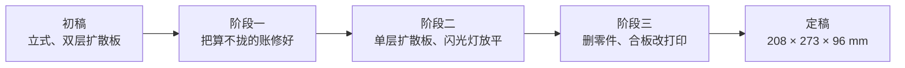

# 设计日志

[English](design-log.md) · **简体中文** · [日本語](design-log.ja.md)

> NeoBox 为什么长成这样：按决策发生的顺序记录二十项决定，以及四个经过权衡后被否决的想法。动手改造之前请先读这一篇。

**目录：** [如何阅读本日志](#如何阅读本日志) · [阶段一——初稿的账根本算不拢](#阶段一初稿的账根本算不拢) · [阶段二——从 32 升到约 5 升](#阶段二从-32-升到约-5-升) · [阶段三——删掉一切非必需](#阶段三删掉一切非必需) · [特意没有做的事](#特意没有做的事)

## 如何阅读本日志

设计走过三个阶段：修复一份账算不拢的初稿；把高高的立式箱压扁成扁平的卧式箱；再把事后证明并不必要的东西一件件删掉。

> [!NOTE]
> 这里的每一条结论都不是靠做出实物得到的。**这只箱子从未被打印、拍照或实测过均匀度。** 以下所有决定都是在 CAD 与算术里、或者在与打印服务商的往来中得出的。文中引用的尺寸都是定稿几何；被取代的旧改版里的数字不再重复，因为那些数字从未重新核验过。

每一个条目都是一个标题，所以任何一条都可以从别处链接过来——例如 `design-log.zh-CN.md#18-夹子按层高量化`。

## 阶段一——初稿的账根本算不拢

最初的规格是一只立式箱：闪光灯竖着立在两层扩散板下面。那个形态一点都没留下来，但它催生的五条规则留下来了。

*收录条目：[1](#1-高度在算术上就不成立) · [2](#2-没有围板的扩散板会漏光) · [3](#3-最后一层扩散板以上用白色是错的) · [4](#4-给灯头加一个居中挡块) · [5](#5-撑得住调平载荷的顶板) · [6](#6-用迷宫式通风口取代直通孔) · [7](#7-判断均匀度之前先做平场校正) · [8](#8-大画幅预留)*

### 1. 高度在算术上就不成立

初稿把三段气隙叠在一起——灯头到第一层扩散板、两层扩散板之间的混光空间、第二层以上的黑腔。加起来已经超过同一份文档自己宣称的内净高，而且这笔预算里根本没有算上闪光灯本身。

修正的不是一个数字，而是一套方法。

> [!IMPORTANT]
> **高度要从底板往上，把实测的各层相加得出，然后再读出外形尺寸。绝不允许先定外形高度再倒推分层。** 定稿的层叠就是这样推出来的，[design.zh-CN.md](design.zh-CN.md#2-尺寸链) 里有完整列表。

### 2. 没有围板的扩散板会漏光

扩散板比它所在的腔体小，于是光可以绕过板边走，而不是穿过板。每层扩散板都补上了整幅载板，只留出发光的那块面积。

**教训：只有当光无路可绕时，扩散板才算扩散板。**

### 3. 最后一层扩散板以上用白色是错的

最后一层扩散板以上的白壁，会把杂光反射回胶片、压低反差。那一段改成了哑光黑。这条规则一直活到定稿：扩散板以上一律是黑的，以下一律是裸露的白色耗材。

**教训：扩散板以下用白，以上用黑。**

### 4. 给灯头加一个居中挡块

闪光灯平躺时，灯头不会落在箱子的中心线上，而热点跟着灯头走。初稿因此加了一个挡块，把灯头放到光学设计假定它所在的位置上。定稿里同一件事改用流程来做：沿着闪光灯的轮廓在底板上画一圈线，让它每次都回到同一个位置。

**教训：位置会改变光的零件，要么给它一个定位特征，要么给它一个记号。**

### 5. 撑得住调平载荷的顶板

初稿把调平螺丝直接压在一块薄板顶面上，螺丝会把它压陷。顶面改成了带金属承力点的厚板。定稿的顶盖保留了这条原则：三个[热熔铜螺母](glossary.zh-CN.md#热熔铜螺母)装在顶盖下方专门的柱子里，而不是装在 4 mm 厚的盖板本身上。

**教训：调平点是一条受力路径，背后要有材料。**

### 6. 用迷宫式通风口取代直通孔

在灯箱上开一个直通的通风孔，等于给漏光安了个职称。初稿的通风口改成了迷宫式。定稿更进一步，一个通风口都没有——见下文的[通风](#通风)。

**教训：壳体上的孔，先是一个光学决定，然后才是一个散热决定。**

### 7. 判断均匀度之前先做平场校正

初稿的均匀度指标把两件不同的事混为一谈：镜头自身的暗角，和光源本身真实的不均匀。[平场校正](glossary.zh-CN.md#平场校正)——拍摄裸露的发光面，再用这一帧把衰减除掉——能把两者分开。针对光源本身的指标是**四角之间 ±0.1 [EV](glossary.zh-CN.md#ev)**，而且它是在这一步校正之后才成立的，不是之前。

**教训：写清楚一个公差是相对什么测出来的，否则没有人能满足它。**

### 8. 大画幅预留

为将来的 4×5 版本所做的预留，带着和主箱一样漏算闪光灯高度的错误，所以它是按分层相加重新算过的，不是按比例缩放的。它至今仍然只是一个预留：定稿的箱子通过一个 100 × 120 mm 的开口，覆盖 35 mm 胶片和 6×9 以内的 120 胶片。

## 阶段二——从 32 升到约 5 升

三个决定，把设计从一只立柜变成了一件放得上书桌的东西。

*收录条目：[9](#9-双层扩散板变成单层) · [10](#10-从立式到卧式) · [11](#11-更小的闪光灯帮不上忙)*

### 9. 双层扩散板变成单层

两层扩散层、中间隔一段混光空间，这是做出均匀发光面的教科书做法，也是初稿之所以那么高的主要原因。它被削减成了一层。

这个选择**没有**经过对这只箱子的任何实测验证。它是从作者现有的相机翻拍工作流里搬过来的——那套流程把胶片直接放在灯板上，下面紧贴着单一的一层扩散面。剩下这一层下方的混光距离则是加大了，而不是照搬：双层设计里的那段间距是用来给第二层供光的，照抄过来只会把闪光灯的热点直接印在发光面上。

**教训：从一个你刚刚删掉一半的设计里抄来的尺寸不是尺寸，是残留。**

### 10. 从立式到卧式

箱子的高度依然被「竖着立的闪光灯 + 垂直方向的混光距离」绑架，而占地面积则是双层扩散板时代的遗留。把闪光灯放平、朝侧面打光，混光距离就转进了箱子的深度方向——那段深度本来就被灯身占着。

仅这一个改动，就把体积从约 **32 升降到约 5 升**；定稿的箱子是 208 × 273 × 96 mm，约 5.4 升。中间有一版改版用一块 45° 反射板把光转折，那块板后来也被删掉了（[第 16 条](#16-删掉紧固件和内部零件)）。

**教训：箱子太高的时候，去找那个身兼两职的尺寸，把它放倒。**

### 11. 更小的闪光灯帮不上忙

布局定案之前核验过四个替代品：神牛 TT350、iM30Pro、iT30Pro、KEKS KF-01。没有一个能实质缩小箱子。

为什么更小的闪光灯换不来更小的箱子

在立式布局里，混光距离由几何决定，与闪光灯无关：就算做一个厚度为零的闪光灯的思想实验，也仍然赢不了卧式布局。在卧式布局里，宽度由开口和胶片台决定——不管里面装的是哪只灯，都是 208 mm——深度则由闪光灯灯身、触发器接收端和反射区首尾相接决定。更小的灯买不到体积，却要付出功率余量和回电时间。

设计因此锁定在作者手上已有的器材上：一只 NEEWER TT560 机顶闪，加一套 ZENIKO T1 触发器。**公开的 STL 只适配这一只闪光灯。**[design.zh-CN.md](design.zh-CN.md#换用其他闪光灯) 里的公式能算出换一只灯之后的数字，但公式不会帮你改文件的尺寸。

**教训：在优化你手里正好拿着的那个零件之前，先找出真正决定尺寸的那个尺寸。**

## 阶段三——删掉一切非必需

九个条目，其中三个是打印服务商比作者更仔细地读图纸读出来的。

*收录条目：[12](#12-中层载板与黑腔一起删除) · [13](#13-扩散板移到胶片台上) · [14](#14-为竖着使用而改成确实固定) · [15](#15-木板--3d-打印) · [16](#16-删掉紧固件和内部零件) · [17](#17-胶片的走片通道) · [18](#18-夹子按层高量化) · [19](#19-不留单层台阶) · [20](#20-朝向指示必须说操作员看得见的东西)*

### 12. 中层载板与黑腔一起删除

扩散板只剩一层之后，原本给第二层做框的中层载板没有东西可框了，它上面的黑腔也没有东西可衬了。两者一起删除，扩散板直接盖在开口上，混光腔变成通体白色。135 和 120 胶片夹在同一版里设计并定稿。

**教训：删掉一个零件，通常会让那些为支撑它而存在的零件失去意义。重新细化之前，先检查下游。**

### 13. 扩散板移到胶片台上

乳白亚克力扩散板被从壳体里取了出来，移到胶片台上——搁在开口之上，靠胶片夹自身的重量压平。胶片到扩散板的距离变成约 **4.3 mm**，与本设计所参照的灯板几何一致。

这是一笔灰尘上的交易。落在扩散板上的一颗颗粒，在 0.43× [放大倍率](glossary.zh-CN.md#放大倍率)（也就是全画幅拍 6×6 的情形）和 f/8 下，会在胶片平面上投出一个直径约 0.2 mm 的柔和斑点：反相后的负片上看不出来，正片上看得出来。之所以接受，是因为代价落在一套例行动作上，而不是落在公差上——每次开工先把扩散板两面和[片门](glossary.zh-CN.md#片门)都吹干净。防直射挡板和它的支架也在同一批里删掉了。

> [!NOTE]
> 那一版也用板材直接刷白漆取代了内衬。那属于合板结构，没有活过[第 15 条](#15-木板--3d-打印)。**不要给打印出来的主箱内部刷漆**——内壁按设计就是原色白色耗材。

**教训：把一个零件挪到光学上正确的位置，只要代价落在例行动作里，就值得付这份维护成本。**

### 14. 为竖着使用而改成确实固定

箱子要能立起来用，每一个靠重力就位的零件都必须改成确实被固定住：每个夹底座上的四颗磁铁吸在胶片台的铁垫片上；胶片台本身夹在下螺母与上螺母之间，三根螺杆旋入顶盖的热熔铜螺母。

真正的错误是在这里抓出来的。胶片台的孔原本被指定成螺纹孔。同螺距的螺纹板配上螺杆构成一个[差动螺旋](glossary.zh-CN.md#差动螺旋)：板和螺杆一起前进，高度根本无从设定。它们改成了 Ø6.5 mm 光孔。

> [!CAUTION]
> 绝对不要给胶片台的三个孔攻丝。Ø6.5 mm 光孔是强制要求——攻了丝的板没法调平，事后再扩孔通常会把整块板废掉。

**教训：紧固方案要按运动学来检查，而不只是按强度检查。**

### 15. 木板 → 3D 打印

激光切割、卡扣榫拼接的合板壳画完之后，才认清本意从头到尾就是一只打印出来的箱子，于是废案。

改用打印之后，壁厚收到 3 mm、底板收到 4 mm，内部油漆全部取消，木用螺纹嵌件换成了热熔铜螺母，过线孔和抽口也从打印后的工序变成了打印件本身的一部分。内部光学尺寸一个都没变。合板 DXF 仍留在 `cad/legacy-plywood/`，但那只是一套不完整面板的历史存档——**不是可以照着做的替代方案**。这个箱子没有合板路线。

**教训：趁光学还只是一堆数字、还没变成零件的时候，把工艺换掉。**

### 16. 删掉紧固件和内部零件

压住顶盖的六根 M3 立柱，变成了一只带 10 mm 裙边、直接扣上去的顶盖：裙边既是定位特征又是光陷阱，而且整个壳体再也没有一颗螺丝。

接着内部零件一个接一个消失——抽屉托盘（闪光灯直接躺在底板上）、它的支架、绑住闪光灯的扎带，最后是那块 45° 反射板，因为远端墙壁本来就完成了转向，而每多一个内部零件，就多一样要对齐的东西。默认配置里剩下的是**八个打印件**、一块乳白亚克力扩散板和三根螺杆：含可选 6×6 遮罩在内共九个 STL 文件。

**教训：最便宜的零件是那个根本不存在的零件。**

### 17. 胶片的走片通道

一体化胶片台的首次装配审查发现，两个挡块正坐在夹子两端的中央——恰好挡在滑槽口正对面——顶面就在胶片平面下方一点点。片条根本不可能穿进去。同一轮排查还发现，前螺杆在胶片必经的路径正中间立到了胶片高度。

两者都是挪走，而不是缩小。挡块变成了 |x| = 40–60 mm 处的四角挡块，这样两个滑槽口都完全敞开；前螺杆挪到相对胶片台中心的 (45, −100) mm。约束就此固定：在夹子两端之外、|x| < 31 mm 的范围内（31 是半宽——120 胶片约 62 mm 宽），任何东西都不得升到接近胶片高度。该体积就是[走片通道](glossary.zh-CN.md#走片通道)。

**教训：零件之间有间隙还不够。运动的工件需要有它自己的扫掠通道，而且要当成一个零件来对待。**

### 18. 夹子按层高量化

打印服务商实测了夹子上暴露的 z 向台阶，并对图纸要求的 0.12–0.16 mm [层高](glossary.zh-CN.md#层高)提出异议：用他们默认的 0.2 mm 层高，这些台阶打不干净。他们是对的，而且毛病出在几何上，不在打印机上。0.5 mm 的台阶不是任何常用层高的整数倍——它会被切成两层半，向上取整还是向下取整，全看切片器的裁量。

与其争论校准，不如把每一个 z 向特征都重新量化到 0.2 mm 的整数倍，于是滑槽变成 **0.4 mm**，而胶片平面纹丝未动。同一轮里开窗每边放大约 0.5 mm——135 是 25 × 37 mm，120 是 57 × 85 mm——用来吸收相机片门差异和打印机 XY 公差。多出来的边后期裁掉。

**教训：制造工艺表达不出来的尺寸是设计缺陷，不是服务商的局限。**

### 19. 不留单层台阶

服务商的第三轮反馈。仍然停留在 0.2 mm 的那些特征——夹底座上承托的下沉、夹上盖下面的压条——在默认层高下恰好只有一层高。理论上打得出来，但单层台阶完全被首层压扁量和流量校准绑架，服务商希望多给一点高度。

现在它们全都是 0.4 mm、两层，而且一切要紧的东西都没有被动过：底板减薄到 3.8 mm，让承托顶面——也就是胶片平面——保持原位，而下沉翻了一倍；夹上盖的盖板和导轨一起抬高，压条加深而滑槽仍是 0.4 mm。压条对导轨还留了 0.3 mm 的侧向间隙，防止夹上盖卡死。胶片平面、滑槽、开窗、外形、磁铁间距：全部未变。

**教训：暴露的 z 向台阶不得少于两层。一层是表面质感，不是特征。**

### 20. 朝向指示必须说操作员看得见的东西

服务商问图纸上那条朝向说明——一句 v1 时代、点名滑槽那一侧、如今已从所有文档中删除的话——到底指的是哪个面。从打印物理重新推导答案，反而暴露出这条说明本身就是错的：照它摆，夹底座会立在两条导轨的脊上，承托胶片的承托面悬在空中——那个唯一必须平整的面，反而要建在[支撑](glossary.zh-CN.md#支撑)上。

所有胶片夹零件的正确朝向都是平面朝下、特征向上生长、全程免支撑——但切片器不会自己找到这个方向：`film-holder-*-lid.stl` 载入时压条朝下，导入后必须绕 X 轴旋转 180°。现在给服务商的每一份文案，都改成按操作员看得见的特征来摆放零件（「带两条长凸条的面朝上」），并明确写出支撑位置。[printing.zh-CN.md](printing.zh-CN.md#九个零件) 里逐件的卡片也遵循同一条规则。

**教训：指名一个读者看不见的面的指示，不是指示。要指名一个他们能用手指出来的特征。**

## 特意没有做的事

四个经过认真权衡之后被否决的改动。如果你正打算提其中之一，先从这里读起。

*[LED 灯板](#用高显色-led-灯板取代闪光灯) · [第二层扩散板](#第二层扩散板) · [把顶盖打成一体](#把顶盖与主箱打成一体) · [通风](#通风)*

### 用高显色 LED 灯板取代闪光灯

这是唯一能让箱子明显变小的改动——高约 100 mm、约 4 升——因为 LED 灯板本身就已经是面光源，几乎不需要混光距离。

最终还是选了闪光灯，否决了它。在一只封闭的箱子里，闪光脉冲就是全部曝光，于是振动和快门震动都不再要紧，而且在基准 ISO 和 f/8 下还有功率余量。即便如此，抽口盖板的尺寸仍然是按「日后可以换装 LED 灯板」留的：换装时不必移动胶片平面，也不必改相机高度。

### 第二层扩散板

两层扩散板确实能改善均匀度。在当前设计里，把第二层和它的腔体加回来，要付出约 **43 mm** 的高度。只有做 4×5 版本、或者正片证明单层不够用时，才值得重新考虑。

### 把顶盖与主箱打成一体

仅因可打印性就被否决。一只封闭的中空箱子，会在混光腔上方形成 202 × 267 mm 的无支撑天花板，FDM 无法[桥接](glossary.zh-CN.md#桥接)。那就必须打内部支撑，而支撑只能从 190 × 76 mm 的抽口里掏出来，还会在光学顶面上留下疤痕。换任何一个面朝下打印，都只是把问题挪个地方。

何况收益为零：顶盖本来就不靠紧固件固定，它的裙边就是光陷阱。确实有一个无缝方案能成立——把顶板放在打印床上、四壁从它向上生长、把抽口盖板挪到底面——但这等于用底面的缝换掉顶面的缝，而且意味着整套重建模。如果顶盖日后觉得松，穿过裙边打两颗小自攻螺丝，远胜过一体成型。

### 通风

原型里省略了。低占空比下工作的机顶闪几乎不发热，而每一个孔都是潜在的漏光点。如果一次连拍下来箱子发烫，在换卷的间隙把抽口盖板拔下来即可。

---

← [设计](design.zh-CN.md#设计) · [文档索引](../README.zh-CN.md#文档) · [术语表](glossary.zh-CN.md#术语表) →
