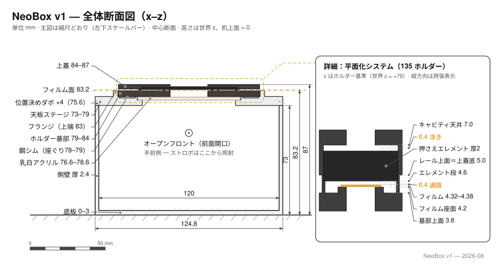
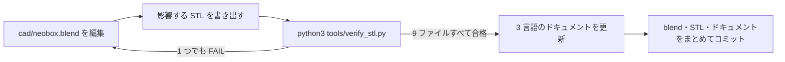

# 設計

[English](design.md) · [简体中文](design.zh-CN.md) · **日本語**

> エンジニアリングの参照資料です。どの寸法がどこから来ているのか、どの数字が光学的でどの数字が構造的なのか、ひとつ変えると何が起きるのか、そして CAD ソースを開き、編集し、書き出し直して検証するまでを扱います。

**目次：** [1. 光路](#1-光路) · [2. 寸法チェーン](#2-寸法チェーン) · [3. 光学上の判断](#3-光学上の判断) · [4. 天板ステージ](#4-天板ステージ) · [5. フィルムホルダー](#5-フィルムホルダー) · [6. 筐体](#6-筐体) · [7. フォーカス用ライト](#7-フォーカス用ライト) · [8. ストロボの運用](#8-ストロボの運用) · [9. 位置合わせと再現性](#9-位置合わせと再現性) · [10. 4×5 への布石](#10-45-への布石) · [11. ソースファイルを扱う](#11-ソースファイルを扱う)

参考ストロボ：**NEEWER TT560** スピードライト 1 灯と **ZENIKO T1** 2.4 GHz トリガーセット。あくまで参考であって、前提ではありません。ストロボは箱の**外**、机の上に横たわるので、本書のどの寸法もストロボには依存しません。マニュアルで発光量を設定できるスピードライトなら何でも使えます。

| 表記 | 本書での意味 |
|---|---|
| 寸法 | ミリメートル。幅 × 奥行 × 高さ（X × Y × Z）の順に書く |
| `z` | 机の面を 0 とした絶対高さ。箱は机に直接立つので、本体の外底面からの高さでもある |
| パーツローカル z | [§2](#2-寸法チェーン) の積層量子化の表は、各パーツ自身のプリント底面から測る。使う箇所で明記する |
| XY 座標 | 箱の中心から測った値。箱の中心は採光窓の中心でもある |
| STL バウンディングボックス | 「STL バウンディングボックス」と明記した箇所だけの意味。値の大きい順に並んでいるので、X × Y × Z の順とは限らない |
| 出典 | 以下の数値はすべて `cad/neobox.blend` か、書き出し済みの STL ファイルから読んだもの。自分で読む手順は [§11](#11-ソースファイルを扱う) |

> [!IMPORTANT]
> ジオメトリは Blender 上で寸法を照合し、書き出した STL ファイルを数値で検証してあります。**この箱はまだ一度も、出力も組み立ても撮影も実測もされていません。** 本書に出てくる性能値はすべて結果ではなく設計目標です。拡散のためのマージンも、≤ 0.28 mm という平面保持の上限も、被写界深度によるカバーも同じです。均一性は測られておらず、本書のどこにも測ったかのような記述はありません。

---

## 1. 光路



机から上へ、順に積み上げると：

**机に横たわるストロボ → 完全に開いた前面 → 白い拡散チャンバー 120 × 150 × 70 → 天板ステージの採光窓 62 × 95 → 乳白アクリル 68 × 118 × 2、上面 78.6 → 空気 4.6 mm → フィルム面 z = 83.2。**

ストロボは箱の中にいません。箱と同じ机の上に横たわり、発光部を**オープンフロント（前面開口）**に寄せて、水平にチャンバーへ発光します。箱の前面には、壁がそもそもありません。TT560 の発光面は 60 × 45、中心は机から 31 mm で、高さ 70 mm の開口に余裕をもって収まります。

**フィルムに向けられている光は一切ありません。** 採光窓はチャンバーの天井、ビームと直角の位置にあり、光は素地のままの白い PLA で何度も拡散反射してからでなければ窓に届きません。これが内部を、シェードをかぶせたランプではなく[積分キャビティ (integrating cavity)](glossary.ja.md#積分キャビティ-integrating-cavity) にしています。光は 62 × 95 の窓を抜け、そのすぐ上、天板ステージに埋め込まれた[乳白 (opal)](glossary.ja.md#乳白-opal) アクリル 1 枚で最後の均しを受けます。

オープンフロントこそが v1 の設計変更のすべてです。実際に出力したプロトタイプ（社内第 4 版）はストロボを密閉した箱に収めており、その厄介ごとはすべてそこから生じていました：箱の高さはストロボの厚みから導出され、発光量のダイヤルに触るためのアクセスパネルが要り、配線のためのケーブルグランドが要り、公開 STL は特定の 1 機種にしか合いませんでした。ストロボが外に出れば、その全部が消えます：どのメーカーのストロボでも使え、レシーバーは電波の通りがよく電池交換もしやすい机の上に残り、パネルもグランドも換気の問題も存在しなくなります（[§6](#6-筐体)）。対価は、環境光がチャンバーに入り得ることです。このトレードは黙認ではなく織り込み済みです：同調速度において、閃光のパルスは室内の環境光よりはるかに明るいからです（[§8](#8-ストロボの運用)）。

> [!NOTE]
> **薄暗い部屋で撮影し、天井の照明が開口へ直射しないようにしてください。** パルスが環境光を圧倒するのは設計の前提ですが、開いた前面へまっすぐ向いた明るいランプだけは、そのマージンをただで削る唯一の置き方です。

---

## 2. 寸法チェーン

プロトタイプの箱はストロボから導出されており、その数字はプロトタイプとともに失効しました。v1 はその結びつきを断ちます：ストロボは箱に入らないので、寸法チェーンはもはや製品カタログから始まりません。机から始まり、パーツの上にパーツを重ねて、重力で上へ伸びていきます。

### プリントパーツ

STL は 9 ファイル。白 2 点、黒 7 点、すべてサポート不要です：

| STL | 色 | 外形 (mm) | 内容 |
|---|---|---|---|
| `main-body.stl` | 白 | 124.8 × 154.8 × 75.6 | 本体：底 3.0、左右と奥の壁 2.4、前面は全開。側壁の上面に位置決めダボ 2.4 × 12 × 2.6 を 4 個 |
| `cover-stage.stl` | 白 | 124.8 × 154.8 × 10.0 | 天板ステージ：壁に載る 6 mm 板。採光窓・アクリル溝・ワッシャーポケット・ホルダートレイを持つ（[§4](#4-天板ステージ)） |
| `film-holder-135-base.stl` | 黒 | 94 × 120 × 5 | 135 ホルダー底：窓 25 × 37、内側のガイドレール、4.6 のエレメント段を持つ外レール（[§5](#5-フィルムホルダー)） |
| `film-holder-135-lid.stl` | 黒 | 94 × 120 × 3 | 135 ホルダー蓋：窓 25 × 37、エレメントの収まるキャビティ、マグネットポケット 8 |
| `film-holder-120-base.stl` | 黒 | 94 × 120 × 5 | 120 ホルダー底：窓 57 × 85（6×9 フルコマ）、溝幅 62、外レールと段は 135 と同一 |
| `film-holder-120-lid.stl` | 黒 | 94 × 120 × 3 | 120 ホルダー蓋：窓 57 × 85、それ以外は 135 の蓋と同じ |
| `pressure-window-135.stl` | 黒 | 64 × 95 × 2 | 押さえ窓インサート 135（窓 25 × 37） |
| `pressure-window-120.stl` | 黒 | 64 × 95 × 2 | 押さえ窓インサート 120（窓 57 × 85） |
| `mask-6x6.stl` | 黒 | 94 × 80 × 1 | 6×6 マスク（窓 56.5 × 56.5）。トレイの中、120 の底の下に敷く |

どのパーツも平らな面を下にしてプリントします。ホルダー蓋 2 点だけは**上面を下**にします。最長のパーツは 154.8 mm なので、160 × 160 のビルドプレートで足ります。積層ピッチ・向き・スライサー設定は[プリントの資料](printing.ja.md)にあります。

### 高さ

アセンブリ全体がひとつの重力スタックです。ワールド z、机 = 0：

| 層 | z 範囲 | 備考 |
|---|---|---|
| 机 | 0 | ストロボと箱は同じ面に立つ |
| 本体の底板 | 0 – 3.0 | |
| 拡散チャンバー | 3.0 – 73.0 | 内寸 120 × 150 × 70、前面は開いている |
| 天板ステージの板 | 73.0 – 79.0 | 壁の上面に載る 6 mm 板。デッキ面は 79.0 |
| 乳白アクリル | 76.6 – 78.6 | 溝に収まり、上面はデッキより 0.4 低い |
| 鉄ワッシャー | 78.0 – 79.0 | ポケットに収まり、デッキと面一 |
| トレイのフランジ | 79.0 – 83.0 | ホルダー座を囲む縁。高さ 4 |
| ホルダー底 | 79.0 – 84.0 | フランジの内側、デッキの上に立つ |
| **フィルム面** | **83.2** | 受けの上面。どちらのフォーマットでも同じ高さ |
| 押さえエレメント | 83.6 – 85.6 | インサートまたは AN ガラス。4.6 の段に載る |
| ホルダー蓋 | 84.0 – 87.0 | 組み上がりの総高 87 |

### 幅と奥行

本体の外形は 124.8 × 154.8。壁は 2.4 で前面は開いているので、内部チャンバーは **120 × 150 × 70**、オープンフロントはチャンバーの断面そのまま 120 × 70 です。62 × 95 の採光窓は中央にあり、窓の縁から最寄りの壁までの白壁マージンは **x 方向 29 mm、y 方向 27.5 mm**。これが拡散のためのマージンです。設計として意図的に余裕をもたせた値であり、下限は求められておらず、実測もありません。

### 別のストロボへの一般化

導出し直すものは何もありません。ストロボのカタログ値を箱の高さに変換していたプロトタイプの式は、入力そのものが消えたので式ごと消えました：**v1 の箱のどの寸法も、いかなるストロボのいかなる寸法も符号化していません。** 代わりのストロボに必要なのは、マニュアルで発光量を設定できること、そして横に寝かせた発光部が開口へ水平に発光できることだけです。TT560 の発光面 60 × 45・中心高さ 31 は参考値であって上限ではありません。レシーバーも箱の外なので、トリガーの機種も同様に自由です。ストロボを替えても `cad/neobox.blend` にも STL にも触りません（[§11](#11-ソースファイルを扱う)）。

### 積層ピッチへの量子化

**この設計でプリントされる z 方向の形状はすべて 0.2 mm のちょうど整数倍で、露出する水平の段差はどれも 0.4 mm（2 層）を下回りません。** 各パーツは自身のプリントの向きで、自身のプリント底面から量子化されています：

| パーツ（基準 = プリント底面） | z の段 |
|---|---|
| 本体 | 0 · 3.0 底板の上面 · 73.0 壁の上面 · 75.6 ダボの上面 |
| 天板ステージ | 0 · 2.8 ダボ穴の天井 · 3.6 アクリル溝の底 · 5.0 ワッシャーポケットの底 · 6.0 デッキ · 10.0 フランジの上面 |
| ホルダー底（両フォーマット共通） | 0 · 2.2 マグネットポケットの底 · 3.8 板面 · **4.2 受け** · **4.6 エレメント段** · 5.0 レールの上面 |
| ホルダー蓋（上面を下にしてプリント） | 0 · 1.0 キャビティの天井 · 3.0 蓋の下面（アセンブリ座標では 8.0 / 7.0 / 5.0） |
| インサート／マスク | 平板、2.0 ／ 1.0 |

このグリッドの意味：0.2 mm の[積層ピッチ (layer height)](glossary.ja.md#積層ピッチ-layer-height)なら、上の段はすべて層の境界にぴたりと載るので、プリントされた 0.4 の段差は本物の 0.4 であって、スライサーの丸めの産物ではありません。0.1 mm もこのグリッドを割り切れますが、0.12 と 0.16 は割り切れません。この理屈はプロトタイプのホルダーで生まれ、そのまま引き継がれています（[設計ログ](design-log.ja.md#18-ホルダーを積層ピッチに量子化)の第 18 項）。v1 で新しいのは、ホルダーだけでなく設計全体がこれに従うことです。発注時のプリント仕様は全パーツ 0.2 です（[プリントの資料](printing.ja.md)）。検証スクリプトは書き出しのたびにグリッドと最小段差を強制します（[§11](#11-ソースファイルを扱う)）。

---

## 3. 光学上の判断

**最後の拡散層は、天板ステージに埋め込んだ乳白板 1 枚。** アクリル（購入部品、68 × 118 × 2）は 69 × 119・深さ 2.4 の溝に落とし込みます：横のクリアランスは各 0.5 mm、上面はデッキより 0.4 低くなります。ホルダーはデッキの上に立つので、**アクリルには何も触れません**。アクリルは光学の層であって構造の層ではなく、フィルム面の高さは終始プリントされたプラスチックを介して伝わり、アクリルを経由しません。取り出すときは、ホルダーを外し、箱の開口から手を入れて採光窓越しに突き上げます。

**アクリルの上の塵は写りません。** アクリルそのものが拡散して発光する面だからです：その上に載った粒子は光源の一部であって、光源とレンズの間に立つ物体ではなく、輪郭を投影できません。ときどき拭けば十分で、セッションごとの儀式は要りません。（オプションのガラスの上の塵は正反対のケースです。[§5](#5-フィルムホルダー) を参照。）

**拡散のマージン。** 窓から壁まで（x 29、y 27.5）が、チャンバーが窓を均一に満たせるかどうかを決める数字です。意図的に余裕をもたせた設計マージンで、下限は求められておらず、実測の裏付けもありません。

**チャンバー内は白一色、つや消しのみ。** 白い PLA そのものが拡散面です。内側は塗装しないでください。白いパーツにシルクや光沢のフィラメントも使わないこと。鏡面の壁は光を散らさず、発光部をホットスポットとして再現してしまいます。

**アクリルより上はすべて黒。** ホルダー・インサート・マスクは黒でプリントし、拡散層より上の迷光は反射させず吸収させます。オプションとして、デッキに A5 の黒い植毛シートを貼れば最後のぎらつきも消せます（[部品表](bom.ja.md)）。

**環境光は締め出すのではなく、許容する。** オープンフロントは室内光を通します。設計の答えは運用側にあります（薄暗い部屋、開口へ直射するランプを置かない、カメラは同調速度で）。残った環境光はパルスがはるかに上回るからです（[§8](#8-ストロボの運用)）。

**内部に調整パーツは置かない。** 光路のどこにも反射板もバッフルも水平出しの金物もありません。チャンバーは素の白壁だけです。内部パーツは 1 つ増えるごとに、位置を合わせる手間が 1 つ、ずれる原因が 1 つ増えます。均一性は[フラットフィールド補正 (flat-field correction)](glossary.ja.md#フラットフィールド補正-flat-field-correction)をかけたテストフレームで確認します。この補正が、レンズの周辺減光と光源そのもののムラを切り分けてくれます（[組み立ての資料](assembly.ja.md)）。

---

## 4. 天板ステージ

天板ステージは、プロトタイプの天板とフィルムステージを 1 枚の白い板に統合したものです。かつての蓋 1 枚・ステージ 1 枚・寸切りボルト 3 本・ナット 6 個・インサートナット 3 個が、いまはプリントパーツ 1 点です。壁の上面に直接載り、チャンバーより上の光学系すべてを受け持ちます。

この 1 パーツが持っているもの：

- **板体**：124.8 × 154.8、全高 10。構造板は 6 mm で、デッキ面は z = 79.0 に来ます。四隅のダボ穴（深さ 2.8）が本体の高さ 2.6 のダボにかぶさり、縦方向に 0.2 の逃げ。板は壁の上面に座り、ダボの上には決して載りません。ダボは XY の位置決めだけを受け持ちます。
- **採光窓**：62 × 95、中央、板を貫通。
- **アクリル溝**：69 × 119、深さ 2.4、底は 76.6、デッキ側に開口。乳白板は上から落とし込み、上面はデッキより 0.4 低く収まります（[§3](#3-光学上の判断)）。
- **トレイ**：94.6 × 120.6 のホルダー座を囲む高さ 4 のフランジで、上面は 83.0。ホルダーを片側 0.3 mm で位置決めし、その上面はフィルム面より 0.2 低い位置で、ホルダーから出たフィルムの尾を受け支えます（[§5](#5-フィルムホルダー)）。
- **ワッシャーポケット**：(±41, ±12) に 4 個、10.6 角・深さ 1.0。それぞれに 10 × 10 × 1 の鉄ワッシャー（または Ø10 × 1 の円板）を落とし込むとデッキと面一になります：ホルダー底のマグネットの受け座で、ホルダーはトレイにぱちんと吸い付いて動かなくなります。プロトタイプで接着していたワッシャーと同じ仕事を、接着なしでやります。

動かすときは、フランジをつまんで持ち上げます。天板ステージ全体が一体で箱から外れます。

**水平出しの金物がないのは、設計そのものであって欠落ではありません。** プロトタイプは 3 本の M6 寸切りでフィルムステージを箱に対して水平にしていました。v1 は寸切りもナットもインサートも、その手順ごと削除しました。

<details>
<summary>なぜ水平出しはカメラ側へ移ったのか</summary>

この設計では、プラスチックは決してねじを受け持ちません。FDM でプリントしたねじは弱く、荷重でクリープします。プロトタイプはすでに真鍮のインサートと鋼の寸切りでそれを避けていましたが、v1 はそれすら不要にしました。

より深い理由はこうです：意味のある平行はただひとつ、**フィルム面とセンサー**の平行であって、ステージを箱に対して水平にしてもそれは直接には得られません。プロトタイプで 3 つのナットを回し終えても、カメラをステージに正対させる作業は残っていました。v1 は、意味のあるその一手だけを残しました。フィルムステージに小さな鏡を置き、ファインダーを覗きながら、レンズ自身の反射が中央に来るまでカメラを動かします：中央に来た瞬間、センサーは鏡と平行であり、したがって鏡が載っているフィルム面と平行です（[鏡を使う方法](assembly.ja.md#ステップ-7--カメラ側で平行を出す鏡の方法)）。

鏡はプリントされたスタック全体の*最終結果*（底板・壁・板体・ホルダー）の上に載っているので、その下にあるすべてのプリント公差は、この一度の位置合わせで吸収されます。箱がどこかの基準まで平らである必要はありません。カメラのほうが、フィルム面が実際にある場所へ合わせに行くのです。

</details>

---

## 5. フィルムホルダー

フォーマットごとにホルダー 1 組。ホルダー底とホルダー蓋、どちらも 94 × 120 で、天板ステージのトレイに立ちます。フォーマットの変更は、1 組を持ち上げてもう 1 組を下ろすだけ：マグネットが外れて吸い直すまで 5 秒ほどで、ほかには何も動きません。コマ送りは、閉じたままのホルダーからフィルムを引き抜く動作で、1 本の途中でホルダーを開けることはありません。

| 項目 | 135 ホルダー | 120 ホルダー |
|---|---|---|
| 外形（底・蓋とも） | 94 × 120 | 94 × 120 |
| ホルダー底／蓋の板厚 | 5 ／ 3 | 5 ／ 3 |
| [窓 (window)](glossary.ja.md#窓-window)（底・蓋・インサートで共通） | 25 × 37 | 57 × 85（6×9 に対応） |
| フィルムの通り幅 | 内レールの間 35.4 | 溝の壁の間 62.0 |
| エレメント段（[下記](#フィルムの平面保持)） | 高さ 4.6、x 31 – 32.2 | 同一 |
| マグネット Ø8 × 2 | 底に 8 個 + 蓋に 8 個 | 同じ |

**窓は名目のコマに対して片側あたり約 0.5 mm 大きく開けてあります**（135 の名目は 24 × 36、120 の名目は 56 × 84）。カメラごとの画面枠のばらつきと、プリンタの XY 公差を吸収するためです。コマに合わせたトリミングは後処理で行います。[フィルムの装填](scanning.ja.md#フィルムの装填)を参照してください。

### フィルムの平面保持

フィルム面は[受け (land)](glossary.ja.md#受け-land)の上面です。窓を**四辺すべて**で囲む細い台で、ホルダー底の底面から 4.2。フィルムの厚みは 0.12 – 0.18 なので、その上面は 4.32 – 4.38 に来ます。そのすぐ上の 0.2 グリッドの段が **4.6** で、4.6 はまさに、エレメント段がその上に載るものの下面を置く高さです。この 3 つの数字がシステムのすべてです：

**受け 4.2 → フィルム上面 4.32 – 4.38 → エレメント下面 4.6。**

これで窓の四辺の受けの上に 0.4 mm の通り道ができ、エレメントの下ならどこでもフィルムは 0.22 – 0.28 mm だけ自由に浮けます。エレメントとは、段に載せる 64 × 95 × 2 の板のことです。交換式であることの根拠はここにあります：

- **標準：プリントの押さえ窓インサート**（フォーマットごとに 1 枚）。窓の周囲を一周する硬い天井が、縁での浮きを ≤ 0.28 に抑えます。開いた窓の真上ではフィルムは拘束されませんが、等倍・f/8 の被写界深度は約 ±0.4 mm あり、残った反りを覆います。
- **アップグレード：アンチニュートンガラス 1 枚、64 × 95 × 2、両フォーマット共用。** フルコマを連続して覆う天井：どの位置でも ≤ 0.28 mm。つや消し（AN）面を下にして、光沢のあるフィルムベース側に当てるので[ニュートンリング (Newton rings)](glossary.ja.md#ニュートンリング-newton-rings)は出ません。乳剤面は下の開いた窓を向き、何にも触れません。

**なぜガラス 1 枚でサンドイッチが完成するのか：** 昔ながらのガラスキャリアが 2 枚のガラスを必要とするのは、スタックの底面を定義するものがほかにないからです。ここでは底面がプリントされていて、受けが 4.2 の高さで四辺からフィルムを支えます。だから上にガラスを 1 枚置けばサンドイッチは閉じます。手入れすべきガラス面は半分になり、乳剤の下にはガラスが 1 枚もありません。

**なぜ 1 枚のガラスが両フォーマットに合うのか：** どちらの底も外レールの断面が同一だからです。エレメント段が x 31 – 32.2・高さ 4.6、その外の段が 32.2 – 33.5・高さ 5.0 で、エレメントの横方向を位置決めします。つまり同じ 64 × 95 の座が両方に存在します。135 の底では、細いストリップを導く内レール（±17.7 – 19.7）が 64 幅の板と干渉するため、|y| < 48 の中央部を丸ごと省き、両端に 12 mm のガイドだけを残してあります：ガラスはその切れ目から段の上へ落ち、ガイドが長手方向のずれを挟み止めます。

エレメントは一度据えたら、以後は手を触れません。コマ送りは、ホルダーから突き出たフィルムの先端をつまんで引くだけです。反った部分はエレメントの下面をくぐるときに押し伸ばされます。蓋のキャビティ（64.8 × 96、天井 7.0）は 0.4 の浮きしろを残してエレメントを囲みます：蓋はエレメントの位置を決めますが、決して押し付けません。エレメントの高さは常に段がプリントした 4.6 のままで、力で作った嵌合ではありません。装填の向きの目安：**ガラスなら反りを上に**（ガラスが押し伸ばします）、**インサートなら反りを下に**。ホルダーから出たフィルムはトレイのフランジに掛かり、その上面はフィルム面より 0.2 低い位置にあります。挟むのではなく、支えるだけです。長いストリップは尾側を手で支えてください。

> [!CAUTION]
> **ガラスの下面は焦点面からわずか 0.2 mm で、そこに載った塵はほぼピントの合った状態で写ります。** ガラスを据える前に両面をブロワーで吹いてください。箱の中で塵が写る面はここだけです。アクリルは正反対で、生まれつき塵に強い面です（[§3](#3-光学上の判断)）。

**マグネット。** Ø8 × 2 の N35 を圧入します（接着剤はどこにも使いません）。1 パーツに 8 個、両セットで 32 個。底のマグネットは板面から 0.4 突き出し、蓋のマグネットは蓋の下面と面一。閉じたとき両者の面は 0.8 離れていて**決して接触しません**。だから蓋は常にプリントされたレールの上面に座り、通り道の高さはマグネットの積み上がりではなく、プリントされた数字のままです。極性は、底と蓋のすべての位置が引き合うように組にすること：圧入の前に必ず相手のマグネットと吸着を確かめてください。圧入したマグネットは二度と抜けません。

**6×6 と 6×4.5。** 6×6 では `mask-6x6.stl`（94 × 80 × 1、窓 56.5 × 56.5）をトレイの中、120 の底の*下*に敷きます：ホルダー 1 組がまるごと 1 mm 高くなりますが、これは正常です。ピントを合わせ直して続けてください。6×4.5 に専用マスクはありません。後処理でトリミングします。

> [!NOTE]
> **マウント済みのスライドは対象外です。** 紙マウントやプラマウントは 0.4 mm の通り道より何倍も厚く、ホルダーに入りません。NeoBox が扱えるのは素のフィルムストリップだけで、6×9 までです。

---

## 6. 筐体

**本体**は一体でプリントする 1 パーツ：底板 3.0、左・右・奥の壁 2.4、そして前面には壁がありません。側壁の上面に位置決めダボが 4 個（2.4 × 12 × 2.6）立ち、天板ステージの四隅のダボ穴と噛み合います。

**オープンフロントが削除したもの。** プロトタイプにアクセスパネルが要ったのは、ストロボの発光量ダイヤルが遮光された箱の中にあったからです。配線が遮光壁を貫くからケーブルグランドが要り、熱の逃げ場がないから換気にも答えが要りました。v1 の箱の中には、手を伸ばす相手がそもそもいません：ストロボもレシーバーもその電池も机の上にあり、発光量の変更は指先ひとつ、フォーカス用ライトのケーブルは開口からそのまま外へ出て、チャンバーは外気に通じています。3 つの問題は、前の壁と一緒に消えました。

**ねじなし、接着剤なし、工具なし。** この設計のどこにも、プラスチックに噛み込むねじ山はありません。すべての結合は、ダボ穴に入るダボか、重力か、マグネットです：天板ステージはダボで位置が決まり自重で座り、ホルダーはマグネットでワッシャーに吸い付き、蓋はマグネットで底に吸い付き、エレメントは重力で段に載っています。マグネットは圧入、ワッシャーは置くだけ。組み立てとは順番に積むことで、数分で終わります（[組み立ての資料](assembly.ja.md)）。

> [!NOTE]
> **このビルド全体の締結部品の一覧は：ねじ 0 本、接着剤 0 滴。** プロトタイプに最後まで残っていた 2 つの接着箇所（ホルダーのマグネットと鉄ワッシャー）も消えました：v1 のマグネットは締まりばめで、ワッシャーはポケットに収まっています。

> [!WARNING]
> **重力スタックは、傾けて運んではいけません。** 組み上がった箱は、位置が合っているだけで、固定されてはいません：机の上を水平に滑らせるか、分解して別々に運んでください。天板ステージはフランジをつまめば一動作で外れます。

### 各部の位置一覧

XY は箱の中心から、z は机から。`cad/neobox.blend` から読んだ値です。

| 部位 | XY | z | 寸法 |
|---|---|---|---|
| オープンフロント | 前面 | 3.0 – 73.0 | チャンバーの全断面、120 × 70 |
| 位置決めダボ 4 個 | 側壁の上面 | 73.0 – 75.6 | 2.4 × 12 × 2.6 |
| ダボ穴 4 個 | 天板ステージの下面 | 深さ 2.8 | ダボに対し縦 0.2 の逃げ |
| 採光窓 | 中央 | 板を貫通、73.0 – 79.0 | 62 × 95 |
| アクリル溝 | 中央 | 底 76.6、79.0 のデッキへ開口 | 69 × 119、深さ 2.4 |
| ワッシャーポケット 4 個 | (±41, ±12) | 78.0 – 79.0 | 10.6 角、深さ 1.0 |
| トレイのフランジ | 94.6 × 120.6 の座を囲む | 79.0 – 83.0 | 縁、高さ 4 |

> [!TIP]
> ダボとダボ穴の嵌め合いは、FDM の通常の誤差に収まる寸法です。エレファントフット、XY の膨らみ、反りのどれもがここを食い潰します。天板ステージがきつい、あるいはガタつくときの対処はスライサーの設定であって、ファイルの編集ではありません。[きつい場合と緩い場合の対処](printing.ja.md#きつい場合と緩い場合の対処)を参照してください。

---

## 7. フォーカス用ライト

内蔵のフォーカス用ライトはなく、筐体の中に電気部品は一切ありません。構図合わせとピント合わせは普通の室内光で足ります。薄暗い部屋でもフィルムのディテールは十分見えますし、オープンフロントへ直接差し込まない限りどんな照明でも構いません。撮影の瞬間は、部屋の光をストロボが圧倒します。

---

## 8. ストロボの運用

マニュアル発光量のみ、通常シンクロ、[RAW](glossary.ja.md#raw) で撮影します。[TTL](glossary.ja.md#ttl-through-the-lens-調光) 調光はここでは無意味です（被写体は永遠に変わらないので、発光量は一度マニュアルで決めれば終わりです）。そして [HSS](glossary.ja.md#hss-ハイスピードシンクロ) が解決する問題は、[同調速度 (sync speed)](glossary.ja.md#同調速度-sync-speed)以下には存在しません。どちらにもお金を払わないでください。

**パルスがそのまま露光です。** 前面が開いていても、薄暗い部屋なら、同調速度の 1 回の露光が拾う環境光はパルスに比べて無視できます。つまりストロボ自身の発光時間が実効シャッターになり、三脚で耐えられるどんな定常光の露光時間より桁違いに短くなります。振動もシャッターショックも床の揺れも、問題でなくなります。

**シャッター速度：推奨は 1/125 秒。** フォーカルプレーンシャッターの同調速度は通常 1/160 – 1/250 とされますが、安価な 2.4 GHz トリガーの遅延がそこから約 1 段を食います。だから 1/125 です。本当の限界を超えたときの症状は見間違えようがありません：画面を横切る、縁のくっきりした暗い帯です。

> [!IMPORTANT]
> **電子シャッターでは、たいていストロボがそもそも発光しません。** ボタンを押しても何も起きないときは、まずここを確認してください。詳しくは[露出](scanning.ja.md#露出)にあります。

発光量の変更は指先ひとつです。ストロボは目の前の机に横たわっていて、開けるものも、乱すものもありません。レシーバーはその隣、箱の外にあり、電波の通り道はきれいで、電池交換は何にも触れません。実際には発光量はテストフレームで一度決めたら、あとは触りません。露出の手順は[露出](scanning.ja.md#露出)にあります。

---

## 9. 位置合わせと再現性

フィルム面は**どちらのフォーマットでも** z = 83.2 に固定です（6×6 マスクは 120 の 1 組を 1 mm 持ち上げます。ピントを合わせ直すだけで、ほかは何も変わりません）。135 と 120 で変わるのは必要な撮影倍率、したがってカメラの高さであって、フィルムの高さではありません。カメラの高さは、フィルム面の高さにレンズの[ワーキングディスタンス](glossary.ja.md#ワーキングディスタンス-working-distance)を足して求めます。計算は[カメラの高さとスタンド](scanning.ja.md#カメラの高さとスタンド)にあります。

**平行出しは一度の位置合わせ：鏡を使う方法です。** フィルムステージに小さな鏡を置き、ファインダーの中でレンズ自身の反射を中央に持ってきます。その瞬間、センサーはフィルム面と平行になり、その下のスタック全体のプリント公差も同じ一手で吸収されています（[鏡を使う方法](assembly.ja.md#ステップ-7--カメラ側で平行を出す鏡の方法)、理由は [§4](#4-天板ステージ)）。箱に水平出しの金物がひとつもないのは、まさにこのためです。

カメラが決まったら、動かすのは箱のほうです。カメラを振り直すのではなく、机の上で箱をずらしてコマを中央に持ってきます。ストロボは開口へ軽く寄せ直すだけです。決まったら位置を再現できるようにしておきます。ベースボードに位置決めピンを 2 本打つか、箱の外形を鉛筆でなぞるか、どちらでも構いません。あわせて、フォーマットごとに使ったポールの高さも書き留めておきます。

**平行が先、均一性が後。** ストロボは振動を止めますが、センサーと平行になっていないフィルム面を直すことはできません。まず鏡を使う方法、それから[フラットフィールド補正](glossary.ja.md#フラットフィールド補正-flat-field-correction)をかけたテストフレームで均一性を確認します。

---

## 10. 4×5 への布石

**4×5 のジオメトリはまだ導出していません。** この節は仕様ではなく方法です。

作るのであれば、こう進めます。

1. 採光窓はシートの寸法に余裕を足して決め、チャンバーの内寸は窓に四周の拡散マージンを足して決めます。v1 のマージン（29 と 27.5）はこのビルドでの値であって、確立された下限ではありません。4×5 のスケールでは試行錯誤を見込み、大きくなったチャンバーを満たすためにより大きなストロボが要ると見ておくこと。あの大きさでの均一性は何も検証されていません。
2. 平面保持のサンドイッチは維持します：板面から 0.4 立ち上がる四辺の受け、そのさらに 0.4 上のエレメント段、z 方向の形状はすべて 0.2 グリッド、露出する段差は 0.4 以上（[§5](#5-フィルムホルダー)）。シートは 1 枚ずつ装填するので、引き抜きのコマ送りやガイドといったストリップ固有の細部は持ち越しません。受けとエレメントの原理だけを持ち越します。
3. オープンフロントの構成と、ねじなしの重力スタックはそのまま使えます：導出すべきは「より大きな箱」であって、「別の種類の箱」ではありません。

---

## 11. ソースファイルを扱う

`cad/neobox.blend` が、このリポジトリで唯一のジオメトリのソースです。9 つの STL ファイルはすべてここから生成されており、blend ファイルを通さずに STL へ届いた変更は、次に誰かが書き出し直した時点で失われます。

### ファイルを開く

| 項目 | 値 |
|---|---|
| Blender のバージョン | **3.0 以降。** ファイルは Zstandard 圧縮で、3.0 より前の Blender ではそもそも読めません。ファイルヘッダーには、最後に保存したバージョンとして **Blender 5.2** が記録されています |
| 単位系 | メートル法、unit scale 0.001、長さの単位はミリメートル。**Blender の 1 単位が 1 mm** |
| シーンの配置 | アセンブリは組み付いた位置のままモデリングしてあり、z の基準は本書と同じです：机（箱の外底面）が z = 0。120 のホルダー 1 組はアセンブリの脇 x = 200 に、6×6 マスクは x = 350 に置いてあります |

### コレクション構成

```
Scene Collection
├── 焦点                       ビューのターゲット用の empty
├── Collection                 Camera、Light：レンダリング用の足場
├── NeoBox_混光箱_TT560定稿     筐体、天板ステージ、モックアップ
├── 胶片夹_135                  135 のホルダー 1 組。組み付いた位置にある
├── 胶片夹_120                  120 のホルダー 1 組。x = 200 に置いてある
└── 打印小件                    6×6 マスク。x = 350 に置いてある
```

### どのオブジェクトがどの STL になるか

| STL ファイル | Blender のオブジェクト | 内容 |
|---|---|---|
| `main-body.stl` | `主箱_底3mm`、`主箱_左壁`、`主箱_右壁`、`主箱_后壁` | **4 オブジェクト**：底板、左壁、右壁、奥壁。前面が開いているので、まぐさも前柱も要らない |
| `cover-stage.stl` | `顶盖台一体_窗62x95` | 天板ステージ、一体、窓 62 × 95 |
| `film-holder-135-base.stl` | `135夹_底座_94x120_平底` | 135 のホルダー底、平底 |
| `film-holder-135-lid.stl` | `135夹_上盖_94x120` | 135 のホルダー蓋 |
| `film-holder-120-base.stl` | `120夹_底座_94x120_平底` | 120 のホルダー底、平底 |
| `film-holder-120-lid.stl` | `120夹_上盖_94x120` | 120 のホルダー蓋 |
| `pressure-window-135.stl` | `压片窗插片_135_64x95x2` | 押さえ窓インサート 135 |
| `pressure-window-120.stl` | `压片窗插片_120_64x95x2` | 押さえ窓インサート 120 |
| `mask-6x6.stl` | `6x6插片_94x80x1` | 6×6 マスク |

### 書き出してはいけないモックアップ

シーンにあるそれ以外のすべては、収まりと光路を見るためのモックアップで、どれ 1 つプリントも書き出しもしません：ストロボ本体とその発光面、T1 レシーバー、光路を示す矢印 4 本、135 と 120 のフィルムストリップのモックアップ、乳白アクリル、AN ガラス、鉄ワッシャー 4 枚、テキストラベル、そしてカメラ／ライト／ビューターゲットという足場です。

> [!CAUTION]
> **マテリアル名はフィラメントの色を表していません。** マテリアルスロットはレンダリングのためのものです。たとえば `NB_alu` は、削除されたプロトタイプのアルミステージの残骸です。色は必ず[9 点のパーツ](printing.ja.md#9-点のパーツ)から取り、マテリアルスロットからは絶対に取らないでください。

### 書き出しの約束

STL はすべて、**アセンブリのワールド座標のまま**書き出しています。途中で原点を戻したり、向きを変えたりはしません。

| ファイル | 書き出したファイルの中での位置 |
|---|---|
| `main-body.stl` | z 0 – 75.6、XY は中央 |
| `cover-stage.stl` | z 73 – 83、XY は中央 |
| `film-holder-135-base.stl` ／ `-lid.stl` | z 79 – 84 ／ 84 – 87、組み付いた位置のまま |
| `pressure-window-135.stl` | z 83.6 – 85.6、組み付いた位置のまま |
| `film-holder-120-base.stl` ／ `-lid.stl` | x 153 – 247、z 0 – 5 ／ 5 – 8 に置いてある |
| `pressure-window-120.stl` | x 168 – 232、z 4.6 – 6.6 に置いてある |
| `mask-6x6.stl` | x 303 – 397、z 0 – 1 に置いてある |

スライサーは各ファイルをバウンディングボックスでビルドプレートに落とします。9 ファイルのうち 7 つは、読み込んだ時点でプリント面を下にして寝ています。ホルダー蓋の 2 つだけは違います。**上面を下**にしてプリントするパーツなので、インポート後に裏返す必要があります。必要な回転量は、[9 点のパーツ](printing.ja.md#9-点のパーツ)のパーツカードにそれぞれ書いてあります。

### 再書き出しの手順

コマンド 1 本で 9 ファイルすべてを再生成します。これは公開中の STL を作ったパイプラインをリポジトリに収めたものであり、サポートされる唯一の書き出し方法です：

```
blender --background cad/neobox.blend --python tools/export_stl.py
```

（`blender` は Blender インストール内の実行ファイルです。4.x／5.x のどれでも動きます。リポジトリのルートで実行し、続けて `python3 tools/verify_stl.py` を走らせてください。）

このスクリプトが必要な理由は、プリント部品が**互いに食い込むシェルとしてモデリングされている**からです。意図的に 0.2 – 0.5 mm 重ねてあります：壁は床へ、フランジは天板ステージの板へ、レールはホルダー底へ沈み込んでいます。これはソースをパラメトリックで編集しやすく保つための作りです。スクリプトは出力ファイルごとに、ソースオブジェクトを複製し、ルースパーツで分割し、EXACT ソルバーのブーリアン結合で 1 つのソリッドにまとめ、ブーリアンの残渣を溶接で除去し、水密を自己検査してから、アセンブリのワールド座標のまま書き出します。シーン自体には一切手を触れません。素のオブジェクトを File → Export → STL するとマルチシェルのファイルになり、その内部面が検証スクリプトの積層グリッド検査で不合格になります。

再生成したファイルは公開ファイルと**バイト単位では一致しないことがあります**（三角形分割は Blender のバージョン間で安定しません）が、幾何は完全に同一です。審判は検証スクリプトです：バウンディングボックス・水密・積層グリッド・最小段差の 4 項目がすべて合格であること。

<details>
<summary>手動での書き出し（スクリプトが使えない場合の代替）</summary>

1. **1 つの出力ファイルに対応するオブジェクトを選択します。** 上の対応表のとおりに選びます。*チェックポイント：*選択したオブジェクトの数が表と一致すること。本体は 4 つ、それ以外は 1 つずつ。
2. **本体だけでなく、どの部品も 1 つのソリッドにします。** 単一オブジェクトの部品も、内部はマルチシェルであり得ます。必要なものを join し、ルースパーツで分割してブーリアン結合し、距離 0.02 mm で頂点をマージ、1° の限定的溶解でブーリアン残渣を取り除きます。*チェックポイント：*部品が連続した 1 枚のシェルになり、検証スクリプトが「非多様体エッジなし」と報告すること。
3. **書き出します。** File → Export → STL、*Selection Only* にチェック、scale 1.00、forward Y、up Z。座標軸の変換はしないこと：ファイルの中の数値が、Blender の中の数値と一致していなければなりません。*チェックポイント：*書き出したファイルを読み込み直すと、パーツが元の位置にぴたりと戻ること。
4. **同じパスへ上書きします。** `stl/white-pla/` か `stl/black-pla/` の下に、ファイル名はそのままで。*チェックポイント：*`git status` に出るのが変更されたファイルであって、新規ファイルではないこと。
5. **コミットの前に検証します。** *チェックポイント：*`python3 tools/verify_stl.py` が `all 9 files pass` と表示し、終了コード 0 で終わること。

</details>



### 検証スクリプトを走らせる

`tools/verify_stl.py` は、依存関係のない素の Python 3 です。リポジトリのルートで実行します。

```
python3 tools/verify_stl.py
```

`stl/` 以下のすべての `.stl` をたどり、ファイルごとに 4 つの不変条件を確認します。

| 確認項目 | 何を保証するか |
|---|---|
| watertight | すべてのエッジがちょうど 2 つの三角形に共有されていること。穴のない閉じたソリッド |
| layer grid | 水平面がすべて、そのパーツ自身の底面から 0.2 mm の整数倍の高さにあること |
| minimum step | 露出する水平の段差が、0.4 mm（0.2 で 2 層）を下回らないこと |
| bounding box | パーツの寸法が、ドキュメントに書いてあるとおりのままであること |

段差を探すとき 1 mm² 未満の水平面は無視するので、モデリング上の細片が誤検出を起こすことはありません。出力はファイルごとに 1 行と、合計が 1 行。どれかが失敗すると終了コードが 0 以外になるため、このスクリプトでコミットをゲートできます。

```
ok    film-holder-120-base.stl  [94.0, 120.0, 5.0]  256 triangles
...
all 9 files pass
```

公開しているバウンディングボックスは、スクリプト冒頭の `EXPECTED` テーブルに、値の大きい順で並べてあります。**公開している寸法を意図して変えたときは、同じコミットで `EXPECTED` も直してください**。さもないと、変えたつもりのパーツで検証が落ち、変えていないパーツのほうは黙って通ってしまいます。

### ストロボを変更する

プロトタイプでは、この見出しの下に導出し直しのチェックリストがありました。v1 では、変えるものがありません：**箱のどの寸法もストロボを符号化していない**ので、別のストロボ（別のトリガーでも）にしても `cad/neobox.blend` にも STL にも触りません。新しいストロボに必要なのは、マニュアルの発光量設定と、横に寝かせてオープンフロントへ水平に発光できる発光部だけです。交換したら、露出のテストフレームを撮り直して作業を続けてください（[§8](#8-ストロボの運用)）。

### `cad/` のその他のファイル

- `film-stage-aluminium-3mm.dxf`：プロトタイプのアルミ製フィルムステージ。履歴として残してあるだけです。v1 にフィルムステージはありません：このパーツは天板ステージに統合され、現在の設計でこのファイルから切り出すものは何もありません。
- `legacy-plywood/`：合板版の DXF。履歴として残してあるだけです。2 ファイルを合わせてもシェルとして完結しておらず、現在の設計でここから切り出すものは何もありません。

コントリビューションのルール（何がソースで何が生成物か、そして 3 言語をそろえる要件）は [CONTRIBUTING.md](../CONTRIBUTING.md#source-of-truth-vs-generated-files) にあります。

---

← [用語集](glossary.ja.md) · [ドキュメント一覧](../README.ja.md#ドキュメント) · [設計ログ](design-log.ja.md) →
