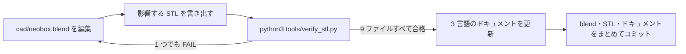

# 設計

[English](design.md) · [简体中文](design.zh-CN.md) · **日本語**

> エンジニアリングの参照資料です。どの寸法がどこから来ているのか、どの数字が光学的でどの数字が構造的なのか、ひとつ変えると何が起きるのか、そして CAD ソースを開き、編集し、書き出し直して検証するまでを扱います。

**目次：** [1. 光路](#1-光路) · [2. 寸法チェーン](#2-寸法チェーン) · [3. 光学上の判断](#3-光学上の判断) · [4. フィルムステージ](#4-フィルムステージ) · [5. フィルムホルダー](#5-フィルムホルダー) · [6. 筐体](#6-筐体) · [7. フォーカス用ライト](#7-フォーカス用ライト) · [8. ストロボの運用](#8-ストロボの運用) · [9. 位置合わせと再現性](#9-位置合わせと再現性) · [10. 4×5 への布石](#10-45-への布石) · [11. ソースファイルを扱う](#11-ソースファイルを扱う)

作例構成：**NEEWER TT560** スピードライト 1 灯と、**ZENIKO T1** 2.4 GHz トリガーセット。

| 表記 | 本書での意味 |
|---|---|
| 寸法 | ミリメートル。幅 × 奥行 × 高さ（X × Y × Z）の順に書く |
| `z` | 本体の**外底面**を 0 とした絶対高さ |
| XY 座標 | 箱の中心から測った値。箱の中心はフィルムステージの中心でもある |
| STL バウンディングボックス | 「STL バウンディングボックス」と明記した箇所だけの意味。値の大きい順に並んでいるので、X × Y × Z の順とは限らない |
| 出典 | 以下の数値はすべて `cad/neobox.blend` か、書き出し済みの STL ファイルから読んだもの。自分で読む手順は [§11](#11-ソースファイルを扱う) |

> [!IMPORTANT]
> ジオメトリは Blender 上で寸法を照合し、書き出した STL ファイルを数値で検証してあります。**この箱はまだ一度も、出力も組み立ても撮影も実測もされていません。** 本書に出てくる性能値はすべて結果ではなく設計目標です——四隅で ±0.1 [EV](glossary.ja.md#ev-露出値) という均一性も、3–5 段の筐体損失も、塵のボケの見積もりも同じです。ストロボのチャージ時間、1 時間あたりの撮影枚数、単 3 電池 1 セットあたりの発光回数は分かっておらず、本書のどこにもそれを知っているかのような記述はありません。

---

## 1. 光路


下から順に積み上げると、こうなります。

**底板 4 → 横倒しのストロボ 55 → 白い拡散チャンバーのヘッドルーム 33 → 天板 4**（ここまでが 96 mm の箱）**→ フィルムステージ → 拡散板 2 → フィルムホルダー → フィルム面は約 120.3。**

ストロボの発光部は 90° 回してあり、箱の長手方向、奥の壁に向かって光ります。**フィルムに向けられている光は一切ありません。** 光は素地のままの白い PLA で何度も拡散反射してからでなければ開口に届かず、これが内部を、シェードをかぶせたランプではなく[積分キャビティ (integrating cavity)](glossary.ja.md#積分キャビティ-integrating-cavity) にしています。

光は天板の 100 × 120 開口から出て、フィルムステージに載せた[乳白 (opal)](glossary.ja.md#乳白-opal) アクリル拡散板 1 枚で、最後の均しを受けます。

> [!WARNING]
> **ストロボのワイドパネルは装着しないでください。発光部を上に向けるのも禁止です。** ズームは 35–50 mm に設定し、ビームが開口へ直接こぼれるのではなく奥の壁に当たるようにします。反射を経ずに拡散板へ届いたビームは、発光部の形をそのまま画面に写し込みます。

---

## 2. 寸法チェーン

### 高さ

96 mm の箱は、下から順に 4 つの層の合計です。

| 層 | z 範囲 | 高さ |
|---|---|---|
| 底板 | 0 – 4 | 4 |
| 横倒しのストロボ（TT560） | 4 – 59 | 55 |
| 白い拡散チャンバーのヘッドルーム | 59 – 92 | 33 |
| 天板 | 92 – 96 | 4 |
| **箱の高さ** | **0 – 96** | **96** |

天板より上は、光学系のスタックです。

| 層 | z 範囲 | 備考 |
|---|---|---|
| フィルムステージの板 | 109 – 114 | どちらの版でも上面は 114 |
| 拡散板 | 114 – 116 | 2 mm 乳白アクリル。ステージに載せるだけ |
| ホルダー底 | 116 – 121 | 底面は平ら。拡散板を押さえる |
| **フィルム面** | **≈ 120.3** | 受けの上面 120.2 に、フィルムの厚み約 0.14 を足した高さ |
| ホルダー蓋 | 120.6 – 124 | 押さえリブの下端が 120.6 |

そして、それを支える取り付け金物です。

| 部品 | z 範囲 | 備考 |
|---|---|---|
| M6 [インサートナット](glossary.ja.md#インサートナット-heat-set-insert) | 86 | 天板の 3 本のポストに 1 個ずつ |
| M6 × 35 寸切りボルト | 86 – 120 | 全ねじ。インサートナットにねじ込む |
| 下ナット | 105 – 109 | ステージの高さを決める。水平出しの調整はここ |
| 上ナット | 114 – 118 | ステージを下ナットへ押し付けて締結する |
| コーナーブロック | 114 – 120 | フィルムステージと一体でプリントされる |

したがってフィルム面は、天板の上面から約 24.3 mm 上にあります。このオフセットはステージの幾何で決まっており、ストロボを変えても動きません——ただしその下の箱の高さは変わるので、別のストロボにすればフィルム面ごと動き、カメラの高さは取り直しになります。[カメラの高さとスタンド](scanning.ja.md#カメラの高さとスタンド)を参照してください。

### 奥行

| 項目 | mm | 決めているもの |
|---|---|---|
| アクセスパネル側のクリアランス | 2.5 | 構造 |
| ZENIKO T1 レシーバー | 30 | このトリガー |
| TT560 のストロボ本体 | 190 | このストロボ |
| 反射ゾーン（発光部から奥の壁まで） | 44.5 | **光学** |
| **内寸の奥行** | **267** | |
| 壁 3 mm × 2 | 6 | 構造 |
| **外寸の奥行** | **273** | |

レシーバーはストロボの手前で、自分の脚で箱の床に立っており、この 30 mm が奥行の寸法チェーンに加わります。ストロボの上には載せません。

### 幅

| 項目 | mm | 決めているもの |
|---|---|---|
| 開口 | 100 | フィルムフォーマット |
| 白壁のマージン（左右各約 50） | 102 | **光学** |
| **内寸の幅** | **202** | |
| 壁 3 mm × 2 | 6 | 構造 |
| **外寸の幅** | **208** | |

幅は、開口の寸法に、拡散チャンバーが左右均等に光で満たされるために必要な白壁のマージンを足したもので決まります。ストロボには依存しません。だからこそ下の式でも 208 のまま固定です。

### 別のストロボへの一般化

```
高さ = ストロボの厚み + 41        （横に寝かせ、発光部を 90° 回した状態で実測）
奥行 = ストロボの長さ + レシーバーの長さ + 53
幅   = 208                        （固定）
```

どちらの定数も魔法の数字ではなく、上の表の行を足しただけのものです。

| 定数 | 内訳 | 光学的な項 |
|---|---|---|
| `+41` | 底板 4 ＋ 拡散チャンバーのヘッドルーム 33 ＋ 天板 4 | 33 |
| `+53` | アクセスパネル側のクリアランス 2.5 ＋ 反射ゾーン 44.5 ＋ 壁 3 × 2 | 44.5 |

構造的な項（4、4、2.5、3 × 2）は壁と板の厚みです。削れば剛性か遮光性が落ちるだけで、それ以上のことは起きません。

**光学的な 2 項、33 と 44.5 こそが、寸法を引き直した箱でも光がきちんと混ざるかどうかを決める数字です。** どちらも下限は求まっておらず、検証もされていません。

一般則ではなく、このビルドでの値として扱ってください。ここを削るなら、均一性のキャリブレーションをやり直す前提で見積もり、高さ約 43 mm を払って 2 枚目の拡散板を戻す用意もしておくことです（[§3](#3-光学上の判断)）。

ストロボは立てた状態ではなく、**横に寝かせ、発光部をすでに 90° 回した状態**で実測してください。**外形の高さを先に決めて層を逆算するのは厳禁です**——それこそが初稿を物理的に組み立て不能にした、まさにその間違いです（[設計ログ](design-log.ja.md#1-高さが算術的に成立しなかった)の第 1 項）。

> [!WARNING]
> **公開している STL ファイルが合うのは TT560 だけです。** 上の式は新しい数字を出してくれますが、ファイルの寸法までは変えてくれません。別のストロボを使うということは、`cad/neobox.blend` を編集して書き出し直すということです（[§11](#11-ソースファイルを扱う)）。
>
> 代わりのストロボに必要な条件は、発光部が 90° 回ること、マニュアルで発光量を設定できること、横に寝かせた状態で全長 190 mm 以下・厚み 55 mm 以下であること。この枠を外れるなら、筐体を引き直すことになります。

---

## 3. 光学上の判断

**拡散板は 2 枚ではなく 1 枚。** 散乱・拡散・最終発光面という 2 層構成のほうが均一性は上ですが、各層にそれぞれ拡散のための距離が要ります。現在の設計で 2 枚目の拡散板とそのチャンバーを戻すと、高さが**約 43 mm** 増えます。1 枚に減らしたのは、フィルムのすぐ近くに乳白 1 枚という構成が、作者が現に使っているライトパッドのワークフローそのものだからです。根拠はそれであって、この箱での試験ではありません（[設計ログ](design-log.ja.md#9-拡散板-2-枚を-1-枚に)の第 9 項）。

**拡散板は天板の下ではなく、フィルムステージの上。** 開口を覆うようにステージへ載せ、フィルムホルダーの自重で平らに保たれます——固定具は一切ありません。ホルダーを持ち上げれば両面とも清掃できます。これが次の段落で効いてきます。

**フィルムと拡散板の間は約 4.3 mm。** 本設計で唯一の、意図した妥協です。

[撮影倍率 (magnification ratio)](glossary.ja.md#撮影倍率-magnification-ratio) 0.43×——[撮影倍率とレンズの選択](scanning.ja.md#撮影倍率とレンズの選択)の表でいう、フルサイズで 6×6 を撮る場合——で f/8 のとき、拡散板の上に載った塵は、フィルム面で直径約 0.2 mm の淡いボケとして投影されます。[反転 (inversion)](glossary.ja.md#反転-inversion) したネガではまず見えず、ポジでは気づくレベルです。

対策は機構ではなく手順です。**セッションのたびに、拡散板の両面と[フィルムゲート (film gate)](glossary.ja.md#フィルムゲート-film-gate)をブロワーで吹くこと。** 間隔を空ければ解決しますが、それはこの設計がいま削ったばかりの高さを、そっくり返すことになります。

**開口のマージン。** 100 × 120 の開口は 6×9 のコマ（56 × 84）に対して短辺で 22 mm、長辺で 18 mm の余裕があり、開口そのものが周辺減光を起こすことはありません。大きければ良いというものでもなく、開口を広げると斜めの迷光がフィルムベースを抜けてコントラストを下げます。

**内部は白一色、つや消しのみ。** 白い PLA そのものが拡散面です。内側は塗装しないでください。シルクや光沢のフィラメントも使わないこと——鏡面の壁は光を散らさず、発光部をホットスポットとして再現してしまいます。黒いストロボ本体は開口の真下にあり、そのままでは暗いパッチとして写るので、**ストロボ本体の上面に白い紙を貼ってください**（発光部は塞がないこと）。

**拡散板より上はすべて黒。** 迷光を跳ね返さず、吸収させるためです。

**内部に調整パーツは置かない。** 旧版には 45° の反射板と直射防止バッフルがありましたが、どちらも削除しました。奥の壁がすでに光の向きを変える役目を果たしていますし、内部パーツは 1 つ増えるごとに、位置を合わせる手間が 1 つ、ずれる原因が 1 つ増えます。均一性の追い込みは箱の外から行います——[キャリブレーション](assembly.ja.md#キャリブレーション)を参照してください。目標は**[フラットフィールド補正 (flat-field correction)](glossary.ja.md#フラットフィールド補正-flat-field-correction)後の、四隅の差で ±0.1 EV**。この補正が、レンズの周辺減光と光源そのもののムラを切り分けてくれます。

---

## 4. フィルムステージ

フィルムステージは、箱の上にある光学系すべてを載せて水平を出す板です。

| 版 | 材質 | 形状 | ファイル |
|---|---|---|---|
| プリント版 | 黒の PLA または PETG | 200 × 230、板厚 5 mm。上面に 4 つのコーナーブロックを一体でプリントし、全体では 11 mm まで立ち上がる。STL バウンディングボックスは 230 × 200 × 11 | `stl/black-pla/film-stage-printed.stl` |
| アップグレード版 | 3 mm 5052 アルミ、黒アルマイト | 外形 200 × 230、開口 100 × 120、Ø6.5 のバカ穴 3 か所 | `cad/film-stage-aluminium-3mm.dxf` |

どちらも上面が **z = 114** に来るので、互換です。アルミ板は 2 mm 薄いぶん、下ナットを 2 mm 高い位置に設定します。上面はやはり 114 に来て、その上にあるものは何ひとつ動きません。

DXF では 3 つの穴が (145, 15)、(30, 180)、(170, 180) にあり、板の中心は (100, 115) です——プリント版とまったく同じ配置。**手前の穴は意図的に中心から外してあります。** 理由は下のフィルム走行路にあります。

> [!CAUTION]
> **ステージの穴には絶対にねじを切らないでください。** ねじを切った板を、同じピッチの寸切りボルトに通すと[差動ねじ (differential screw)](glossary.ja.md#差動ねじ-differential-screw)になります。寸切りを回すと板が同じ量だけ進み、かつ同じ量だけ戻るので、高さは永遠に変わりません。穴は Ø6.5 の[バカ穴 (clearance hole)](glossary.ja.md#バカ穴とタップ穴-clearance-hole-vs-tapped-hole)のままにしてください。プリントした穴がきつく出たら、さらって広げること——そこにねじを立ててはいけません。これはリリース前に捕まえた、実際にあった仕様ミスです（[設計ログ](design-log.ja.md#14-縦置き運用のための確実な固定)の第 14 項）。

**3 点で水平を出し、確実に締結する。** 全ねじの M6 × 35 寸切りボルトを、天板のポストに埋めた M6 インサートナットへねじ込みます。フィルムステージは Ø6.5 のバカ穴で寸切りに落とし込み、高さを決める下ナットと、上ナットとで挟み込みます。水平出しとは、上ナットを緩めて下ナットを回すことです。**手前のナットがピッチ、奥の 2 本がロール。** 手順は[フィルムステージの水平出し](assembly.ja.md#フィルムステージの水平出し)にあります。

<details>
<summary>なぜ 4 点ではなく 3 点なのか、そしてなぜ手前の寸切りボルトが中心から外れているのか</summary>

3 点は平面をちょうど 1 つに決めます。3 つのナットがどの高さにあっても、ステージの姿勢は完全に決まり、3 本すべてが荷重を受け、どこもガタつきません。

4 点目は過拘束です。4 点が完全に同一平面上にない限り——現実には決してそうなりません——剛体の板は 3 点にしか触れず、4 点目を無理に接触させれば板が曲がります。その曲がりこそが、守ろうとしていた平面度そのものを損ないます。4 本脚のテーブルはガタつき、三脚はガタつきません。

調整そのものに対称性は関係ありません。手前のナットは奥の 2 本を軸にステージを回すので、これがピッチです。奥の 2 本を互いに逆へ回せばロールになります。手前の寸切りボルトが中心から外れているぶん、奥のナットを片方だけ動かしたときにわずかな連成が出ますが、もう 1 巡すれば収束します。

ステージは 1 つのナットに載っているのではなく 2 つのナットで挟まれているので、フィルムを通すときにどこを手で押しても傾きません。箱を縦置きで使えるのも、これがあるからです。

</details>

**寸切りボルトの位置**は、ステージ中心から見て手前 **(45, −100)**、奥 **(±70, +65)**。3 本の寸切りとそのナットは、ホルダー外形 110 × 170 から最低でも 9 mm 離れており、それと同じくらい重要なこととして、[フィルム走行路](glossary.ja.md#フィルム走行路-run-out-corridor)の外に出ています。

フィルムはホルダーの両端から滑り出るので、ホルダーの端より外側、**|x| < 31** の範囲には、フィルム高さの付近まで立ち上がるものがあってはいけません。31 は 120 フィルムの*半*幅です——120 フィルムの幅は約 62 mm なので、走行路の幅は 62 mm になります。手前の寸切りボルトはもともと (0, −100)、つまり走行路のど真ん中にあり、まさにこの理由で横へずらしました（[設計ログ](design-log.ja.md#17-フィルム走行路)の第 17 項）。おかげでホルダー側には、金物を避ける切り欠きが 1 つも要りません。

ステージの上面に載るもの：

- **コーナーブロック 4 個。** |x| = 40–60、|y| = 70–90 にあり、ホルダーを X と Y に位置決めします。四隅だけに置いてあるので、溝の入口は両側とも完全に開いたままです——両端の中央にブロックを 1 個ずつ置いた旧配置は、フィルムの通り道を完全に塞いでいました。
- **Ø12 鉄ワッシャー 4 枚。** (±25, ±75) に接着し、マグネットの座にします。箱を縦置きで使う場合にだけ必要です。

アルミ板にはプリント一体のブロックがなく、ブロック単体の STL も用意していません——`cad/neobox.blend` の中で、ブロックはステージのオブジェクトに融合されています。Blender でその形状を分離して（ブロックの面を選択し、**P → 選択物**）単体で書き出すか、6 mm の端材から L 字の小片を 4 つ切り出して上の座標に接着してください。モデル上のブロックは z 114 – 120 なので、5 mm の材料では 1 mm 足りません。

---

## 5. フィルムホルダー

スライド式の溝を持つ、プリント 2 パーツのサンドイッチです。フィルムストリップは 0.4 mm の[溝 (channel)](glossary.ja.md#溝-channel)に収まり、横へ滑らせてコマを送ります。1 本の途中でホルダーを開けることはありません。支えるのは画面外の縁だけで、画面部分は下に 0.4 mm、上に約 0.25 mm の空気を挟んで浮いています。画に触れるものは何もありません。

| 項目 | 135 ホルダー | 120 ホルダー |
|---|---|---|
| 外形（2 パーツとも） | 110 × 170 | 110 × 170 |
| [溝](glossary.ja.md#溝-channel)の幅——フィルムが滑る隙間 | 35.4 | 62.0 |
| [窓 (window)](glossary.ja.md#窓-window)——撮影のために覗く穴 | 25 × 37 | 57 × 85（6×9 に対応） |
| [受け (land)](glossary.ja.md#受け-land)——フィルムの縁が載る段、片側あたり | 4.7 | 2.25 |
| 溝の高さ | 0.4 | 0.4 |
| ホルダー底／ホルダー蓋の板厚 | 3.8 ／ 3 | 3.8 ／ 3 |
| マグネット Ø6 × 2 | 1 台あたり 12 個 | 1 台あたり 12 個 |

z 方向のチェーンは、**ホルダー底の底面**を基準に測ります——フィルム面を決めているのが、この基準面です。

| 部位 | ホルダー底の底面からの高さ |
|---|---|
| ホルダー底の板の上面 | 3.8 |
| 受けの上面——**ここがフィルム面** | 4.2（板から 0.4 立ち上がる） |
| [レール (rail)](glossary.ja.md#レール-rail)の上面——ホルダー蓋が載る 0.8 の側壁 | 5.0（受けから 0.8 の段） |
| ホルダー蓋の押さえリブ、下面 | 4.6 → **溝 ＝ 0.4** |
| ホルダー蓋の板 | 5.0 – 8.0 |

押さえリブとレールの間には片側 0.3 mm の隙間があり、ホルダー蓋が食い込んで固着しないようにしてあります。

**窓は名目のコマに対して、片側あたり約 0.5 mm 大きく開けてあります**——135 の名目は 24 × 36、120 の名目は 56 × 84——カメラごとの画面枠のばらつきと、プリンタの XY 公差を吸収するためです。コマに合わせたトリミングは後処理で行います。[フィルムの装填](scanning.ja.md#フィルムの装填)を参照してください。

**マグネットは 1 台あたり 12 個、役割は 2 つ。** 片方だけが任意なので、この区別が効いてきます。

| 役割 | 1 台あたりの個数 | ポケット | 必要になる場面 |
|---|---|---|---|
| 開閉用 | 8 個——引き合う 4 組 | ホルダー底の (±45, ±75) と、ホルダー蓋の対応する 4 か所 | **すべてのビルドで。** これがないとホルダー蓋は自重だけで押さえられることになり、平置きなら足りても、縦置きでは足りません |
| ホルダー底とステージの吸着用 | 4 個 | ホルダー底の (±25, ±75)。鉄ワッシャーに吸い付く | 箱を縦置きで使う場合のみ |

**ホルダーの z 方向の形状はすべて 0.2 mm のちょうど整数倍で、露出する段差はどれも 2 層を下回りません**——受けの立ち上がり 0.4、レールの段 0.8、溝 0.4。したがって既定の 0.2 mm の[積層ピッチ (layer height)](glossary.ja.md#積層ピッチ-layer-height)で、そのまま正しく出ます。0.1 mm でも割り切れますが、0.12 と 0.16 では割り切れません。経緯は[設計ログ](design-log.ja.md#18-ホルダーを積層ピッチに量子化)の第 18 項です。

2 パーツとも、平らな面を下にして、リブが上へ伸びる向きでプリントします。[サポート (supports)](glossary.ja.md#サポート-supports)はどこにも要りません。ホルダー底が平らなのは、拡散板に直接載って押さえるからです。X と Y の位置決めはステージのコーナーブロックが行い、ホルダー底は行いません。

6×4.5 と 6×6 では、120 の窓の上に `stl/black-pla/mask-6x6.stl`——平面で 80 × 110、厚さ 1 mm——を載せます。

> [!NOTE]
> **マウント済みのスライドは対象外です。** 紙マウントやプラマウントは 0.4 mm の溝より何倍も厚く、ホルダーに入りません。NeoBox が扱えるのは素のフィルムストリップだけで、6×9 までです。

---

## 6. 筐体

**本体**——一体でプリントする 1 パーツ。底板 4 mm、壁 3 mm、右の壁に Ø12 のケーブルグランド穴、前の壁に 190 × 76 のアクセス開口があります。

**天板**——10 mm のスカート（縁を一周する垂れ壁）で壁にかぶさり、片側の公称クリアランスは 0.3 mm です。スカートは位置決めの機能*であり、同時に*ライトトラップでもあります。下面の 3 本のポストが M6 インサートナットを保持します。ねじはありません。

**アクセスパネル**——200 × 78 の面板の裏に 186 × 72 × 4 のプラグとハンドルが付いた、全体で奥行 16 mm のパーツです。プラグは 190 × 76 のアクセス開口へ全周約 2 mm のクリアランスで入り、その隙間はプラグに巻いた EVA フォームで埋まります。摩擦が保持し、フォームが光を止めます。発光量を変えるときや電池を替えるときは、これを引き抜いてストロボに手を伸ばします。上縁は天板のスカートとの間に 2 mm のクリアランスがあるので、天板を外す必要は一度もありません。

**換気**——プロトタイプにはありません。低いデューティで使うスピードライトの発熱はわずかで、穴は 1 つ残らず光漏れです。セッション中に熱がこもったら、ロールの合間にアクセスパネルを抜いてください。天板をそのまま本体と一体にしていない理由は[設計ログ](design-log.ja.md#あえてやらなかったこと)にあります。

> [!NOTE]
> **この箱は、ねじでも構造用の接着剤でも組み立てません。** ビルド全体で接着剤を使うのは、ホルダーのマグネットと、取り付けるのであれば 4 枚の鉄ワッシャーだけです。構造として接着している箇所は 1 つもありません。

### 各部の位置一覧

XY は箱の中心から、z は外底面から。`cad/neobox.blend` から読んだ値です。

| 部位 | XY | z 範囲 | 寸法 |
|---|---|---|---|
| 開口（天板） | 中央 | 92 – 96 | 100 × 120 |
| 開口（フィルムステージ） | 中央 | 109 – 114 | 100 × 120 |
| 天板のポスト 3 本 | (45, −100)、(±70, +65) | 84 – 92 | Ø14 のボス。M6 インサートナット用の下穴あり |
| ステージのバカ穴 3 か所 | 同じ 3 か所 | 109 – 114 | Ø6.5 |
| コーナーブロック 4 個 | \|x\| 40–60、\|y\| 70–90 | 114 – 120 | L 字 |
| 鉄ワッシャー 4 枚 | (±25, ±75) | ステージ上面 114 の上 | Ø12 |
| アクセス開口（前壁） | x ±95 | 4 – 80 | 190 × 76 |
| ケーブルグランド（右壁） | y −60 | z 25 が中心 | Ø12 |

> [!TIP]
> 天板の片側 0.3 mm のクリアランスは、FDM の通常の誤差に収まる大きさです。エレファントフット、XY の膨らみ、反りのどれもがここを食い潰します。天板がきつい、あるいはガタつくときの対処はスライサーの設定であって、ファイルの編集ではありません——[きつい場合と緩い場合の対処](printing.ja.md#きつい場合と緩い場合の対処)を参照してください。

---

## 7. フォーカス用ライト

調光できる 5 V の USB LED ストリップを、側壁の内側、**z = 50** あたりに貼ります——開口より下で、フィルムへの直射線から外れた位置なので、拡散チャンバーを照らしても画には写り込みません。取り付けはアクセス開口から手を入れて行い、天板を持ち上げてその上の、水平を出したステージを乱すことがないようにします。

インライン調光器は箱の**外**に置き、ケーブルは Ø12 のグランドから出します。作業中は低い輝度で点けっぱなしにしてください。閃光のパルスが完全に上回るので、1 コマごとに消す必要はありません。1 本撮り終えたら消します。

**筐体の中に、商用電源で動くものは一切入れません。** ストリップは USB のモバイルバッテリーか充電器から給電します。

---

## 8. ストロボの運用

マニュアル発光量のみ、ズーム固定、通常シンクロ、[RAW](glossary.ja.md#raw) で撮影します。閉じた箱の中では [TTL](glossary.ja.md#ttl-through-the-lens-調光) 調光も [HSS](glossary.ja.md#hss-ハイスピードシンクロ) も役に立ちません——そこにお金を払わないでください。カメラは[同調速度 (sync speed)](glossary.ja.md#同調速度-sync-speed)以下に留めます。

閉じた箱の中では環境光が何も寄与しないため、**閃光のパルスがそのまま露光になります**——実用出力で 1/1,000 – 1/20,000 秒。これは、連続光の LED パネルなら[ベース ISO](glossary.ja.md#ベース-iso) 100・f/8 で必要になる 1/15 – 1/60 秒という実シャッター時間より、1–3 桁短い実効シャッターです。振動もシャッターショックも床の揺れも、問題でなくなります。

> [!IMPORTANT]
> **電子シャッターでは、たいていストロボがそもそも発光しません。** ボタンを押しても何も起きないときは、まずここを確認してください。詳しくは[露出](scanning.ja.md#露出)にあります。

測光の出発点は ISO 100、f/5.6–f/8。そこから筐体の損失ぶんとして、発光量を 3–5 段足します。**この範囲は実測ではなく見積もりです**——この箱を測光した人はまだいません。テストフレームから詰めてください。

TT560 の[マニュアル発光量](glossary.ja.md#マニュアル発光量-manual-power-fraction)は 1/1 から 1/128 まで 1 段刻みの 8 段しかないので、露出の微調整はストロボではなく、絞りの 1/3 段で行います。T1 は発光量を遠隔で変えられないため、出力を変えるにはアクセスパネルを抜くことになります——実際にはキャリブレーションのときに一度決めたら、あとは触りません。トリガーはケーブルではなくレシーバーで行います。同期ケーブルのほうが好みなら、同じ Ø12 のグランドを通せます。

ストロボ、トリガー、フォーカス用ライト、カメラの電源は、[電源](assembly.ja.md#電源)に表でまとめてあります。

---

## 9. 位置合わせと再現性

フィルム面は**どちらのフォーマットでも**約 120.3 mm に固定です。135 と 120 で変わるのは必要な撮影倍率、したがってカメラの高さであって、フィルムの高さではありません。カメラの高さは、フィルム面の高さにレンズの[ワーキングディスタンス](glossary.ja.md#ワーキングディスタンス-working-distance)を足して求めます。計算は[カメラの高さとスタンド](scanning.ja.md#カメラの高さとスタンド)にあります。

カメラの水平を出したら、あとは箱のほうを動かします。カメラを振り直すのではなく、ベースボードの上で箱をずらしてコマを中央に持ってくる、ということです。決まったら位置を再現できるようにしておきます——ベースボードに位置決めピンを 2 本打つか、箱の外形を鉛筆でなぞるか、どちらでも構いません——そして、フォーマットごとに使ったポールの高さを書き留めておきます。

**平行が先、均一性が後。** ストロボは振動を止めますが、センサーと平行になっていないフィルム面を直すことはできません。3 つのナットでステージの水平を出し、[鏡を使う方法](assembly.ja.md#鏡を使う方法)でカメラを正対させてから、均一性のキャリブレーションに進んでください。

---

## 10. 4×5 への布石

**4×5 のジオメトリはまだ導出していません。** この節は仕様ではなく方法です。以前の草稿には、出典をたどれない窓と筐体の数字が載っていましたが、繰り返すのではなく削除しました。

作るのであれば、こう進めます。

1. まずストロボを決め、そこから高さを 1 層ずつ数え直す——[§2](#2-寸法チェーン) とまったく同じやり方で。外形の高さを先に決めて逆算してはいけません。
2. 開口は、コマの寸法に、100 × 120 の開口が 6×9 に与えているのと同じ余裕を足して決め、内寸の幅は、開口に左右各約 50 mm の白壁を足して決めます。
3. あのコマサイズでは 1 枚拡散の構成がかなり無理をしていると考え、2 枚目の拡散板とそのチャンバーを——高さ約 43 mm を——戻す前提で見積もってください。
4. あの大きさの拡散チャンバーを均一に満たすには、ストロボ 2 灯かベアバルブのヘッドが要ると見ておくこと。

天板から上のフィルム面のオフセット、ステージの金物、水平出しの方式は、そのまま持ち越せます。ホルダーは持ち越せません。4×5 のシートには別のサンドイッチが必要で、[§5](#5-フィルムホルダー) の z チェーンに合わせて導出します——受けの上面はホルダー底の底面から 4.2、溝は 0.4、z 方向の形状はすべて 0.2 の整数倍、露出する段差は 0.4 を下回らないこと。

---

## 11. ソースファイルを扱う

`cad/neobox.blend` が、このリポジトリで唯一のジオメトリのソースです。9 つの STL ファイルと図面はすべてここから生成されており、blend ファイルを通さずに STL へ届いた変更は、次に誰かが書き出し直した時点で失われます。

### ファイルを開く

| 項目 | 値 |
|---|---|
| Blender のバージョン | **3.0 以降。** ファイルは Zstandard 圧縮で、3.0 より前の Blender ではそもそも読めません。ファイルヘッダーには、最後に保存したバージョンとして **Blender 5.2 LTS** が記録されています |
| 単位系 | メートル法、unit scale 0.001、長さの単位はミリメートル——**Blender の 1 単位が 1 mm** |
| シーンの配置 | アセンブリ全体が組み付いた位置のままモデリングしてあり、z の基準は本書と同じです：箱の外底面が z = 0 |

### コレクション構成

```
Scene Collection
├── 焦点                       z 58 に置いた empty。ビューのターゲット用
├── Collection                 Camera、Light——レンダリング用の足場
├── NeoBox_混光箱_TT560定稿     34 オブジェクト：筐体、ステージ、金物、モックアップ
├── 胶片夹_135                  135 のホルダー底とホルダー蓋、それにフィルムストリップのモックアップ
├── 胶片夹_120                  120 のホルダー底とホルダー蓋。アセンブリの脇、x = 200 に置いてある
└── 打印小件                    6×6 マスク。x = 350 に置いてある
```

### どのオブジェクトがどの STL になるか

| STL ファイル | Blender のオブジェクト | 内容 |
|---|---|---|
| `main-body.stl` | `主箱_底4mm`、`主箱_左壁`、`主箱_右壁`、`主箱_后壁`、`主箱_前上段`、`主箱_前柱L`、`主箱_前柱R` | **7 オブジェクト**：底板、左壁、右壁、奥壁、アクセス開口の上に架かるまぐさ、そしてその両脇の前柱 2 本 |
| `top-cover.stl` | `顶盖_裙边式_开口100x120` | 天板、スカート付き、開口 100 × 120 |
| `access-panel.stl` | `抽口盖板_插塞式` | アクセスパネル、プラグ式 |
| `film-stage-printed.stl` | `胶片台_打印版_角块一体_200x230x5` | フィルムステージ、コーナーブロック一体——名前は `x5` だが、パーツ全体では 11 mm |
| `film-holder-135-base.stl` | `135夹_底座_110x170_平底` | 135 のホルダー底、平底 |
| `film-holder-135-lid.stl` | `135夹_上盖_110x170` | 135 のホルダー蓋 |
| `film-holder-120-base.stl` | `120夹_底座_110x170_平底` | 120 のホルダー底、平底 |
| `film-holder-120-lid.stl` | `120夹_上盖_110x170` | 120 のホルダー蓋 |
| `mask-6x6.stl` | `6x6插片_80x110x1` | オプションの 6×6 マスク |

### 書き出してはいけないモックアップ

メインのコレクションにある 34 オブジェクトのうち 24 は、収まりと光路を見るために置いてあるものです。1 つもプリントしません。

- `闪光灯_TT560平躺75x190x55` と `闪光灯_发光面`——ストロボ本体と、その発光面
- `ZENIKO_T1接收器`——レシーバー
- `M6x35全牙螺杆_1…3`、`M6下锁紧螺母_1…3`、`M6锁紧螺母_1…3`——寸切りボルト、下ナット、上ナット
- `磁吸铁垫片_1…4`——鉄ワッシャー 4 枚
- `扩散板_110x130x2_胶片台上`——乳白アクリル拡散板（購入部品、110 × 130 × 2）
- `LED灯带_左` と `LED灯带_右`——左右の壁それぞれに置いたフォーカス用ライトの候補位置。部品表で買うのは 1 本だけ
- `光路1…4`——光路を示す矢印 4 本
- `标签_定稿`——テキストラベル

このコレクションに残る 10 オブジェクトが、上の対応表に挙げたプリントパーツです。モックアップはもう 1 つ、このコレクションの外にあります：`胶片示意_135负片` という 135 のフィルムストリップで、`胶片夹_135` コレクションの中にホルダー底・ホルダー蓋と並んで置いてあり、これも書き出しません。

> [!CAUTION]
> **マテリアル名はフィラメントの色を表していません。** フィルムステージと 2 つのホルダー底には `NB_flash` が付いています。`NB_black` と `NB_stage` はどのオブジェクトにも割り当てられていません。`NB_wood` と `NB_drawer` は、削除済みのサブアセンブリが残した残骸です。色は必ず[9 点のパーツ](printing.ja.md#9-点のパーツ)から取り、マテリアルスロットからは絶対に取らないでください。

### 書き出しの約束

STL はすべて、**アセンブリのワールド座標のまま**書き出しています——途中で原点を戻したり、向きを変えたりはしません。

| ファイル | 書き出したファイルの中での位置 |
|---|---|
| `main-body.stl` | z 0 – 92、XY は中央 |
| `top-cover.stl` | z 82 – 96、スカートの下端から板の上面まで |
| `access-panel.stl` | 前壁の位置に立ったまま：y −148.5 – −132.5、z 2 – 80 |
| `film-stage-printed.stl` | z 109 – 120 |
| `film-holder-135-base.stl` ／ `-lid.stl` | z 116 – 121 ／ 120.6 – 124 |
| `film-holder-120-base.stl` ／ `-lid.stl` | x 145 – 255、z 0 – 8 に置いてある |
| `mask-6x6.stl` | x 310 – 390、z 0 – 1 に置いてある |

スライサーは各ファイルをバウンディングボックスでビルドプレートに落とすので、9 ファイルのうち 4 つ——天板、アクセスパネル、そしてホルダー蓋 2 つ——は、プリントの向きでは読み込まれず、インポート後に置き直す必要があります。天板とホルダー蓋 2 つは上下逆に読み込まれ、アクセスパネルは立った状態（バウンディングボックス 200 × 16 × 78）で読み込まれるので寝かせます。必要な回転量は、[9 点のパーツ](printing.ja.md#9-点のパーツ)のパーツカードにそれぞれ書いてあります。

### 再書き出しの手順

1. **1 つの出力ファイルに対応するオブジェクトを選択します。** 上の対応表のとおりに選びます。*チェックポイント：*選択したオブジェクトの数が表と一致すること——本体は 7 つ、それ以外は 1 つずつ。
2. **本体だけは 1 つのソリッドにします。** 7 オブジェクトを join してブーリアン合体します。公開しているファイルは 198 三角形の連続した 1 枚のシェルであって、7 個のばらばらな箱ではありません。*チェックポイント：*検証スクリプトが「非多様体エッジなし」と報告すること。
3. **書き出します。** File → Export → STL、*Selection Only* にチェック、scale 1.00、forward Y、up Z。座標軸の変換はしないこと：ファイルの中の数値が、Blender の中の数値と一致していなければなりません。*チェックポイント：*書き出したファイルを読み込み直すと、パーツが元の位置にぴたりと戻ること。
4. **同じパスへ上書きします。** `stl/white-pla/` か `stl/black-pla/` の下に、ファイル名はそのままで。*チェックポイント：*`git status` に出るのが変更されたファイルであって、新規ファイルではないこと。
5. **コミットの前に検証します。** *チェックポイント：*`python3 tools/verify_stl.py` が `all 9 files pass` と表示し、終了コード 0 で終わること。



### 検証スクリプトを走らせる

`tools/verify_stl.py` は、依存関係のない素の Python 3 です。リポジトリのルートで実行します。

```
python3 tools/verify_stl.py
```

`stl/` 以下のすべての `.stl` をたどり、ファイルごとに 4 つの不変条件を確認します。

| 確認項目 | 何を保証するか |
|---|---|
| watertight | すべてのエッジがちょうど 2 つの三角形に共有されていること——穴のない閉じたソリッド |
| layer grid | 水平面がすべて、そのパーツ自身の底面から 0.2 mm の整数倍の高さにあること |
| minimum step | 露出する水平の段差が、0.4 mm——0.2 で 2 層——を下回らないこと |
| bounding box | パーツの寸法が、ドキュメントに書いてあるとおりのままであること |

段差を探すとき 1 mm² 未満の水平面は無視するので、モデリング上の細片が誤検出を起こすことはありません。出力はファイルごとに 1 行と、合計が 1 行。どれかが失敗すると終了コードが 0 以外になるため、このスクリプトでコミットをゲートできます。

```
ok    film-holder-135-base.stl  [110.0, 170.0, 5.0]  1124 triangles
...
all 9 files pass
```

公開しているバウンディングボックスは、スクリプト冒頭の `EXPECTED` テーブルに、値の大きい順で並べてあります。**公開している寸法を意図して変えたときは、同じコミットで `EXPECTED` も直してください**——さもないと、変えたつもりのパーツで検証が落ち、変えていないパーツのほうは黙って通ってしまいます。

### ストロボを変更する

この順序で作業してください。微調整ではなく、導出し直すことです。

- [ ] 新しいストロボを横に寝かせ、発光部を 90° 回した状態で実測する。レシーバーも測る。
- [ ] [§2](#2-寸法チェーン) の式で、高さ・奥行・幅を計算し直す。
- [ ] 底板、左右と奥の 3 枚の壁、前壁の 3 パーツを新しい内寸に合わせる。天板とそのポスト、アクセスパネルはそれに追随する。
- [ ] z = 96 より上には手を触れない——ステージ、拡散板、ホルダーは変わらない。
- [ ] 書き出して検証し、カメラの高さを取り直す。箱の高さと一緒に、フィルム面が動いているため。

### `cad/` のその他のファイル

- `film-stage-aluminium-3mm.dxf`——アルミステージの外形、開口、3 つの穴。blend ファイルから書き出したものではなく手で保守しているので、ステージへの変更は両方に反映する必要があります。
- `legacy-plywood/`——合板版の DXF。履歴として残してあるだけです。2 ファイルを合わせてもシェルとして完結しておらず、現在の設計でここから切り出すものは何もありません。

コントリビューションのルール——何がソースで何が生成物か、そして 3 言語をそろえる要件——は [CONTRIBUTING.md](../CONTRIBUTING.md#source-of-truth-vs-generated-files) にあります。

---

← [用語集](glossary.ja.md) · [ドキュメント一覧](../README.ja.md#ドキュメント) · [設計ログ](design-log.ja.md) →
