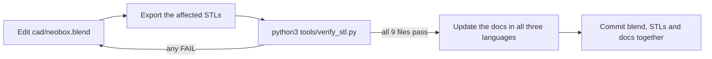

# Design

**English** · [简体中文](design.zh-CN.md) · [日本語](design.ja.md)

> The engineering reference: where every dimension comes from, which numbers are optical and which are structural, what happens if you change one, and how to open, edit, re-export and verify the CAD source.

**Contents:** [1. Light path](#1-light-path) · [2. Dimension chain](#2-dimension-chain) · [3. Optical decisions](#3-optical-decisions) · [4. Film stage](#4-film-stage) · [5. Film holders](#5-film-holders) · [6. Enclosure](#6-enclosure) · [7. Focus light](#7-focus-light) · [8. Flash operation](#8-flash-operation) · [9. Repositioning and repeatability](#9-repositioning-and-repeatability) · [10. 4×5 reservation](#10-45-reservation) · [11. Working with the source](#11-working-with-the-source)

Reference build: a **NEEWER TT560** speedlight with a **ZENIKO T1** 2.4 GHz trigger set.

| Convention | What it means here |
|---|---|
| Dimensions | Millimetres, written width × depth × height (X × Y × Z) |
| `z` | Absolute height above the **outer bottom** of the main body |
| XY positions | Measured from the centre of the box, which is also the centre of the film stage |
| STL bounding box | Quoted only where it is labelled as such — it is sorted largest first and is often not in X × Y × Z order |
| Source | Every number below is read from `cad/neobox.blend` or from the exported STL files. [§11](#11-working-with-the-source) explains how to read them yourself |

> [!IMPORTANT]
> The geometry is verified dimensionally in Blender and numerically in the exported STL files. **The box has never been printed, built, photographed or measured.** Every performance figure in this document is a design target, not a result: the ±0.1 [EV](glossary.md#ev) evenness figure, the 3–5 stop enclosure loss, the dust-blur estimate. Flash recycle time, frames per hour and pops per set of AA cells are unknown, and nothing here claims otherwise.

---

## 1. Light path


The stack, bottom to top:

**floor 4 → flash lying flat 55 → white cavity headroom 33 → top cover 4** (that is the 96 mm box) **→ film stage → diffuser 2 → film holder → film plane at about 120.3.**

The flash head is turned 90° so it fires along the length of the box at the far wall. **Nothing is aimed at the film.** Light reaches the aperture only after several diffuse bounces off the bare white PLA, which is what makes the interior an [integrating cavity](glossary.md#integrating-cavity) rather than a lamp with a shade.

It leaves through the 100 × 120 aperture in the top cover and gets its final smoothing from one [opal](glossary.md#opal) acrylic diffuser resting on the film stage.

> [!WARNING]
> **Do not fit the flash's wide-angle diffuser panel, and do not point the head upward.** Set the flash zoom to 35–50 mm so the beam lands on the far wall instead of spilling straight at the aperture. A beam that reaches the diffuser without bouncing puts the shape of the flash head into the picture.

---

## 2. Dimension chain

### Height

The 96 mm box is a sum of four layers, in order from the bottom:

| Layer | z range | Height |
|---|---|---|
| Floor | 0 – 4 | 4 |
| Flash lying flat (TT560) | 4 – 59 | 55 |
| White cavity headroom | 59 – 92 | 33 |
| Top cover plate | 92 – 96 | 4 |
| **Box height** | **0 – 96** | **96** |

Above the cover, the optical stack:

| Layer | z range | Note |
|---|---|---|
| Film stage plate | 109 – 114 | top face at 114 in both stage versions |
| Diffuser | 114 – 116 | 2 mm opal acrylic, resting on the stage |
| Holder base | 116 – 121 | flat bottom, pressing on the diffuser |
| **Film plane** | **≈ 120.3** | land tops at 120.2 plus about 0.14 of film |
| Holder lid | 120.6 – 124 | pressure strips reach down to 120.6 |

And the mounting hardware that holds it there:

| Item | z range | Note |
|---|---|---|
| M6 [heat-set insert](glossary.md#heat-set-insert) | at 86 | one in each of the three top-cover posts |
| M6 × 35 stud | 86 – 120 | fully threaded, screwed into the insert |
| Lower nut | 105 – 109 | sets the stage height — this is the levelling adjustment |
| Upper nut | 114 – 118 | clamps the stage down onto the lower nut |
| Corner blocks | 114 – 120 | printed integral with the film stage |

The film plane therefore sits about 24.3 mm above the top face of the cover. That offset is fixed by the stage geometry and does not change with the flash — but the box height underneath it does, so a different flash moves the film plane and the camera has to be re-set. See [scanning.md](scanning.md#camera-height-and-the-stand).

### Depth

| Term | mm | Set by |
|---|---|---|
| Clearance at the access panel | 2.5 | structural |
| ZENIKO T1 receiver | 30 | this trigger |
| TT560 body | 190 | this flash |
| Reflection zone, flash head to far wall | 44.5 | **optical** |
| **Interior depth** | **267** | |
| Two walls at 3 | 6 | structural |
| **Outer depth** | **273** | |

The receiver stands on the box floor on its own foot, in front of the flash, and takes those 30 mm out of the chain. It is not carried on the flash.

### Width

| Term | mm | Set by |
|---|---|---|
| Aperture | 100 | film format |
| White wall margin, about 50 each side | 102 | **optical** |
| **Interior width** | **202** | |
| Two walls at 3 | 6 | structural |
| **Outer width** | **208** | |

Width is set by the aperture plus the white margin the cavity needs to fill evenly on either side. It is independent of the flash, which is why it stays at 208 in the formulas below.

### Generalising to another flash

```
height = flash thickness + 41        (measure it LYING FLAT, head at 90°)
depth  = flash length + receiver length + 53
width  = 208                         (fixed)
```

Neither constant is magic. Both are sums of rows from the tables above:

| Constant | Decomposes into | Optical terms |
|---|---|---|
| `+41` | 4 floor + 33 cavity headroom + 4 top cover plate | 33 |
| `+53` | 2.5 access clearance + 44.5 reflection zone + 2 × 3 walls | 44.5 |

The structural terms (4, 4, 2.5, 2 × 3) are wall and plate thicknesses; shrink them and you lose stiffness or light-tightness, nothing more.

**The two optical terms, 33 and 44.5, are the numbers that decide whether a re-derived box still mixes evenly.** No minimum has been established for either, and neither has been tested.

Treat them as this build's values, not as general rules: if you cut into them, budget for re-doing the evenness calibration, and be ready to restore the second diffuser at a cost of about 43 mm ([§3](#3-optical-decisions)).

Measure the flash lying flat with its head already rotated to 90°, not standing. **Never fix the outer height first and back-calculate the layers** — that is precisely the error that made the first draft physically unbuildable ([design log entry 1](design-log.md#1-the-height-was-arithmetically-impossible)).

> [!WARNING]
> **The published STL files fit the TT560 and nothing else.** The formulas give you the new numbers; they do not resize the files. A different flash means editing `cad/neobox.blend` and re-exporting ([§11](#11-working-with-the-source)).
>
> A substitute flash needs: a head that rotates 90°, manual power control, a body no longer than 190 mm and no thicker than 55 mm lying flat. Outside that, the enclosure has to be re-derived.

---

## 3. Optical decisions

**One diffuser, not two.** A two-layer stack — scatter, mix, final surface — gives better uniformity, but each layer needs its own mixing distance. In the current design, restoring the second diffuser and its chamber costs **about 43 mm** of height. It was dropped because a single opal sheet close to the film is what the author's existing light-pad workflow already delivers; that is the validation, not a test of this box ([design log entry 9](design-log.md#9-two-diffusers-became-one)).

**The diffuser sits above the film stage, not under the top cover.** It rests on the stage over the aperture and is held flat by the weight of the film holder — no fixings at all. Lifting the holder exposes both faces for cleaning, which matters because of the next paragraph.

**Film-to-diffuser distance is about 4.3 mm.** This is the design's one deliberate compromise.

At 0.43× — the 6×6-on-full-frame case from the [magnification](glossary.md#magnification-ratio) table in [scanning.md](scanning.md#magnification-and-lens-choice) — and f/8, a dust particle on the diffuser projects as a soft blob about 0.2 mm across at the film plane. That is essentially invisible on an inverted negative and noticeable on a slide.

The mitigation is procedural, not mechanical: **blow both faces of the diffuser and the [film gate](glossary.md#film-gate) at the start of every session.** Opening the gap would work, and would give back exactly the height the design just removed.

**Aperture margins.** The 100 × 120 aperture clears a 6×9 frame (56 × 84) by 22 mm on the short axis and 18 mm on the long axis, so the opening itself cannot vignette. Bigger is not better: a larger opening lets more oblique stray light through the film base and lowers contrast.

**All-white interior, matte only.** The white PLA *is* the mixing surface. Do not paint the inside, and do not use silk or glossy filament — a specular wall reproduces the flash head as a hot spot instead of scattering it. The black flash body sits directly under the aperture and would otherwise print as a dark patch, so **tape a piece of white paper to the top face of the flash body**, not over the head.

**Everything above the diffuser is black** so that stray light is absorbed rather than bounced back into the film.

**No internal adjusters.** Earlier revisions carried a 45° reflector plate and an anti-direct-light baffle. Both are gone: the far wall already performs the turn, and every internal part is one more thing to align and one more thing to knock out of place. Evenness is trimmed from outside instead — see [assembly.md](assembly.md#calibration). The target is **±0.1 EV corner to corner, measured after [flat-field correction](glossary.md#flat-field-correction)**, which separates lens vignetting from real source unevenness.

---

## 4. Film stage

The film stage is the levelled plate that carries everything optical above the box.

| Version | Material | Geometry | File |
|---|---|---|---|
| Printed | Black PLA or PETG | 200 × 230 plate, 5 mm thick, with the four corner blocks printed integral on top, rising to 11 mm overall. STL bounding box 230 × 200 × 11 | `stl/black-pla/film-stage-printed.stl` |
| Upgrade | 3 mm 5052 aluminium, black anodised | Outline 200 × 230, aperture 100 × 120, 3 × Ø6.5 clearance holes | `cad/film-stage-aluminium-3mm.dxf` |

Both present their top face at **z = 114**, so they are interchangeable. The aluminium plate is 2 mm thinner, so its lower nuts are set 2 mm higher; the top face still lands at 114 and nothing above it moves.

In the DXF the three holes are at (145, 15), (30, 180) and (170, 180), with the plate centre at (100, 115) — the same pattern as the printed part. **The front hole is deliberately off-centre**; see the run-out corridor below.

> [!CAUTION]
> **Never tap the stage holes.** A threaded plate on a threaded stud of the same pitch is a [differential screw](glossary.md#differential-screw): turning the stud advances the plate and retracts it by the same amount, and the height never changes at all. The holes must stay [clearance holes](glossary.md#clearance-hole-vs-tapped-hole) at Ø6.5. If a printed hole comes out tight, open it out — do not cut a thread in it. This was a real specification error, caught before release ([design log entry 14](design-log.md#14-positive-fastening-for-use-on-end)).

**Three-point levelling, positively connected.** Fully threaded M6 × 35 studs screw into the M6 heat-set inserts in the top-cover posts. The stage drops over the studs through its Ø6.5 clearance holes and is clamped between a lower nut, which sets the height, and an upper nut. Levelling means slackening the upper nut and turning the lower one: **front nut = pitch, rear pair = roll.** The full procedure is in [assembly.md](assembly.md#levelling-the-stage).

<details>
<summary>Why three points and not four, and why the front stud is off-centre</summary>

Three points define a plane exactly. Whatever the three nut heights are, the stage is fully determined, all three studs carry load, and nothing rocks.

A fourth point over-constrains it. Unless all four are perfectly coplanar — they never are — a rigid plate touches only three of them, and forcing the fourth into contact means bending the plate. Bending is exactly the flatness you were trying to protect. Four-legged tables wobble; tripods do not.

Symmetry is irrelevant to the adjustment itself. The front nut rotates the stage about the rear pair, which is pitch. The rear pair turned against each other is roll. The off-centre front stud only adds a little cross-coupling when a single rear nut is moved, and one more pass converges it.

Because the stage is clamped between two nuts rather than resting on one, hand pressure anywhere on it while threading film cannot tip it — which is also what allows the box to be stood on end.

</details>

**Stud positions**, relative to the stage centre: front **(45, −100)**, rear **(±70, +65)**. All three studs and their nuts clear the 110 × 170 holder outline by at least 9 mm, and — just as important — they stay out of the [film run-out corridor](glossary.md#run-out-corridor).

Film slides out through both open ends of the holder, so nothing may rise near film height inside **|x| < 31** beyond the holder ends. That is the *half*-width of 120 film, which is about 62 mm wide, so the corridor is 62 mm across. The front stud originally sat at (0, −100), dead centre in that corridor, and was moved sideways for exactly this reason ([design log entry 17](design-log.md#17-the-film-run-out-corridor)). As a result the holders need no cut-outs for any of the hardware.

On top of the stage:

- **Four corner blocks**, at |x| = 40–60 and |y| = 70–90, locating the holder in X and Y. They sit only at the corners so both channel mouths stay completely open — an earlier layout with a block centred on each end blocked the film path entirely.
- **Four Ø12 steel washers** at (±25, ±75), glued on as magnet seats. Only needed if you will stand the box on end.

The aluminium plate has no printed-in blocks, and there is no separate block STL to export — in `cad/neobox.blend` the blocks are fused into the single stage object. Either separate that geometry in Blender (select the block faces, **P → Selection**) and export it on its own, or cut four L-pieces from 6 mm scrap — the modelled blocks run z 114 – 120, so 5 mm stock leaves them 1 mm short — and glue them at the coordinates above.

---

## 5. Film holders

A sliding-channel sandwich in two printed parts. The film strip sits in a 0.4 mm [channel](glossary.md#channel) and is advanced by sliding it sideways; the holder is never opened mid-roll. Only the non-image edges are supported — the image area floats, with 0.4 mm of air below it and about 0.25 mm above. Nothing touches the picture.

| Feature | 135 holder | 120 holder |
|---|---|---|
| Outline, both parts | 110 × 170 | 110 × 170 |
| [Channel](glossary.md#channel) width — the gap the film slides in | 35.4 | 62.0 |
| [Window](glossary.md#window) — the hole you photograph through | 25 × 37 | 57 × 85 (covers 6×9) |
| [Land](glossary.md#land) — the ledge each film edge rests on, per side | 4.7 | 2.25 |
| Channel height | 0.4 | 0.4 |
| Base plate / lid plate thickness | 3.8 / 3 | 3.8 / 3 |
| Magnets Ø6 × 2 | 12 per holder | 12 per holder |

The z chain, measured from the **bottom of the holder base** — this is the datum that fixes the film plane:

| Feature | Height above the base bottom |
|---|---|
| Base plate top | 3.8 |
| Land top — **this is the film plane** | 4.2 (0.4 of relief above the plate) |
| [Rail](glossary.md#rail) top — the 0.8 side wall the lid sits on | 5.0 (0.8 step above the land) |
| Lid pressure strips, underside | 4.6 → **channel = 0.4** |
| Lid plate | 5.0 – 8.0 |

The pressure strips have 0.3 mm of side clearance to the rails so the lid cannot wedge.

**Windows are deliberately about 0.5 mm oversize per side** against the nominal frame — 135 is nominally 24 × 36, 120 is nominally 56 × 84 — to absorb camera-gate variance between bodies and printer XY tolerance. You crop to the frame in post; see [scanning.md](scanning.md#loading-film).

**Magnets, 12 per holder, in two roles.** The classification matters because only one of them is optional:

| Role | Count per holder | Pockets | Needed when |
|---|---|---|---|
| Closure | 8 — four attracting pairs | (±45, ±75) in the base, four matching in the lid | **Every build.** Without them the lid is held only by its own weight, which is enough lying flat and not enough on end |
| Base-to-stage | 4 | (±25, ±75) in the base, pulling onto the steel washers | Only if you will stand the box on end |

**Every holder z-feature is an exact multiple of 0.2 mm and no exposed step is under two layers** — land relief 0.4, rail step 0.8, channel 0.4. The parts therefore print true at the default 0.2 mm [layer height](glossary.md#layer-height); 0.1 mm also divides them, 0.12 and 0.16 do not. The reasoning is [design log entry 18](design-log.md#18-layer-quantised-holders).

Both parts print flat face down with the ridges growing upward, no [supports](glossary.md#supports) anywhere. The base is flat because it presses directly on the diffuser; X and Y location comes from the stage corner blocks, not from the base.

For 6×4.5 and 6×6, add `stl/black-pla/mask-6x6.stl` — 80 × 110 in plan, 1 mm thick — over the 120 window.

> [!NOTE]
> **Mounted slides are out of scope.** A cardboard or plastic slide mount is many times thicker than the 0.4 mm channel and cannot enter the holder. NeoBox takes bare film strips only, up to 6×9.

---

## 6. Enclosure

**Main body** — one printed piece. 4 mm floor, 3 mm walls, a Ø12 cable-gland hole in the right wall, and a 190 × 76 access opening in the front wall.

**Top cover** — drops over the walls on a 10 mm skirt (the downstand rim around its edge) with a nominal 0.3 mm side clearance per side. The skirt is the location feature *and* the light trap. Three posts underneath carry the M6 heat-set inserts. No screws.

**Access panel** — a 200 × 78 face with a 186 × 72 × 4 plug behind it and a handle, 16 mm deep overall. The plug enters the 190 × 76 opening with about 2 mm of clearance all round, taken up by a strip of EVA foam wrapped around it: friction holds it, foam blocks the light. Pull it to reach the flash for a power change or new cells. Its top edge clears the cover skirt by 2 mm, so the cover never has to come off.

**Ventilation** — none in the prototype. A speedlight at low duty cycle produces little heat, and every hole is a light leak. If a session runs hot, pull the access panel between rolls. Why the cover is not simply fused into the body is in the [design log](design-log.md#things-deliberately-not-done).

> [!NOTE]
> **No screws and no structural glue hold this box together.** The only adhesive anywhere in the build is cyanoacrylate on the holder magnets and, if you fit them, the four steel washers. Nothing structural is glued.

### Feature location schedule

XY from the centre of the box; z from the outer bottom. Read from `cad/neobox.blend`.

| Feature | XY | z range | Size |
|---|---|---|---|
| Aperture, top cover | centred | 92 – 96 | 100 × 120 |
| Aperture, film stage | centred | 109 – 114 | 100 × 120 |
| Top-cover posts, 3 | (45, −100), (±70, +65) | 84 – 92 | Ø14 boss, bored for the M6 heat-set insert |
| Stage clearance holes, 3 | same three positions | 109 – 114 | Ø6.5 |
| Corner blocks, 4 | \|x\| 40–60, \|y\| 70–90 | 114 – 120 | L-shaped |
| Steel washers, 4 | (±25, ±75) | on the stage top at 114 | Ø12 |
| Access opening, front wall | x ±95 | 4 – 80 | 190 × 76 |
| Cable gland, right wall | y −60 | centred at z 25 | Ø12 |

> [!TIP]
> The cover's 0.3 mm side clearance is inside normal FDM error: elephant foot, XY expansion and warp all eat into it. If the cover binds or rattles, the remedy is a slicer setting, not a file edit — see [printing.md](printing.md#if-it-came-out-tight-or-loose).

---

## 7. Focus light

A dimmable 5 V USB LED strip, stuck to the inside of a side wall at about **z = 50** — below the aperture and out of the direct line to the film, so it lights the cavity without appearing in it. Fit it by reaching in through the access opening, so you never have to lift the cover and disturb the levelled stage above it.

The inline dimmer stays **outside** the box, and the cable leaves through the Ø12 gland. Run it at low brightness continuously while you work: the flash pulse overwhelms it completely, so it does not need switching off between frames. Switch it off at the end of a roll.

**Nothing mains-powered goes inside the enclosure.** Power the strip from a USB power bank or charger.

---

## 8. Flash operation

Manual power only, fixed zoom, normal sync, shoot [raw](glossary.md#raw). [TTL](glossary.md#ttl) metering and [HSS](glossary.md#hss) are useless in a closed box — do not pay for them. The camera stays at or below its [sync speed](glossary.md#sync-speed).

Inside the closed box ambient light contributes nothing, so **the flash pulse *is* the exposure**: 1/1,000 – 1/20,000 s at working power. That is an effective shutter one to three orders of magnitude shorter than the 1/15 – 1/60 s of real shutter time a continuous LED panel would need at [base ISO](glossary.md#base-iso) 100 and f/8. Vibration, shutter shock and floor rumble stop mattering.

> [!IMPORTANT]
> **An electronic shutter will usually not fire a flash at all.** If nothing happens when you press the button, that is the first thing to check. Details in [scanning.md](scanning.md#exposure).

Metering start point: ISO 100, f/5.6–f/8, then add 3–5 stops of flash power for the enclosure's loss. **That range is an estimate, not a measurement** — nobody has metered this box. Work from a test frame.

The TT560 has eight full-stop steps of [manual power](glossary.md#manual-power-fraction), 1/1 to 1/128, so fine exposure adjustment is done with the aperture in 1/3 stops, not with the flash. The T1 cannot remote-control power, so a power change means pulling the access panel — in practice it is set once during calibration and left alone. Trigger with the receiver rather than a cable; a sync cable can share the Ø12 gland if you prefer one.

Power sources for the flash, trigger, focus light and camera are tabulated in [assembly.md](assembly.md#power).

---

## 9. Repositioning and repeatability

The film plane is fixed at about 120.3 mm for **both** formats. What changes between 135 and 120 is the magnification you need, and therefore the camera height — not the height of the film. Work the camera height out from the film plane plus your lens's [working distance](glossary.md#working-distance); the arithmetic is in [scanning.md](scanning.md#camera-height-and-the-stand).

Once the camera is levelled, the box itself is what moves: slide it on the baseboard to centre the frame, rather than re-aiming the camera. When you are satisfied, make the position repeatable — two locating pins on the baseboard, or a pencil outline of the box footprint, either works — and write down the column height you used for each format.

**Parallelism first, evenness second.** A flash freezes vibration; it cannot fix a film plane that is not parallel to the sensor. Level the stage on its three nuts, then square the camera to it with the mirror method in [assembly.md](assembly.md#the-mirror-method), then calibrate evenness.

---

## 10. 4×5 reservation

**No 4×5 geometry has been derived.** This section is a method, not a specification; earlier drafts carried window and enclosure figures that could not be traced to any source, and they have been removed rather than repeated.

If you want to build one:

1. Choose the flash first and recount the height layer by layer from it, exactly as in [§2](#2-dimension-chain). Never fix the outer height and work backwards.
2. Size the aperture from the frame plus the same clearance the 100 × 120 aperture gives 6×9, then set the interior width from the aperture plus about 50 mm of white wall on each side.
3. Assume the single-diffuser structure is under real strain at that frame size, and budget the second diffuser and its chamber back in — about 43 mm of height.
4. Expect to need two flashes or a bare-tube head to fill a cavity that size evenly.

The film-plane offset above the cover, the stage hardware and the levelling scheme all carry over unchanged. The holders do not: a 4×5 sheet needs a different sandwich, derived against the z chain in [§5](#5-film-holders) — land top at 4.2 above the base bottom, channel 0.4, every z-feature a multiple of 0.2, no exposed step under 0.4.

---

## 11. Working with the source

`cad/neobox.blend` is the only source of geometry in this repository. The nine STL files and the drawings are generated from it, and a change that reaches the STLs without going through the blend file is lost the next time anyone re-exports.

### Opening the file

| Property | Value |
|---|---|
| Blender version | **3.0 or newer.** The file is Zstandard-compressed, which pre-3.0 Blender cannot read at all. The file header records **Blender 5.2 LTS** as the version it was last saved with |
| Unit system | Metric, unit scale 0.001, length unit millimetres — **one Blender unit is one millimetre** |
| Scene layout | The whole assembly is modelled in place, on the same z datum this document uses: the outer bottom of the box is z = 0 |

### The collection tree

```
Scene Collection
├── 焦点                       an empty at z 58, used as a view target
├── Collection                 Camera, Light — render scaffolding
├── NeoBox_混光箱_TT560定稿     34 objects: the enclosure, the stage, the hardware and the mock-ups
├── 胶片夹_135                  135 holder base + lid, and a film strip mock-up
├── 胶片夹_120                  120 holder base + lid, parked beside the assembly at x = 200
└── 打印小件                    the 6×6 mask, parked at x = 350
```

### Which objects make each STL

| STL file | Blender object(s) | Gloss |
|---|---|---|
| `main-body.stl` | `主箱_底4mm`, `主箱_左壁`, `主箱_右壁`, `主箱_后壁`, `主箱_前上段`, `主箱_前柱L`, `主箱_前柱R` | **seven objects**: floor, left wall, right wall, rear wall, the lintel over the access opening, and the two front posts beside it |
| `top-cover.stl` | `顶盖_裙边式_开口100x120` | top cover, skirted, aperture 100 × 120 |
| `access-panel.stl` | `抽口盖板_插塞式` | access panel, plug type |
| `film-stage-printed.stl` | `胶片台_打印版_角块一体_200x230x5` | film stage, corner blocks integral — the name says `x5`, the part is 11 mm overall |
| `film-holder-135-base.stl` | `135夹_底座_110x170_平底` | 135 holder base, flat-bottomed |
| `film-holder-135-lid.stl` | `135夹_上盖_110x170` | 135 holder lid |
| `film-holder-120-base.stl` | `120夹_底座_110x170_平底` | 120 holder base, flat-bottomed |
| `film-holder-120-lid.stl` | `120夹_上盖_110x170` | 120 holder lid |
| `mask-6x6.stl` | `6x6插片_80x110x1` | optional 6×6 mask |

### What is a mock-up and must never be exported

Twenty-four of the 34 objects in the main collection are there to show fit and light path. None of them is printed:

- `闪光灯_TT560平躺75x190x55` and `闪光灯_发光面` — the flash body and its emitting face
- `ZENIKO_T1接收器` — the receiver
- `M6x35全牙螺杆_1…3`, `M6下锁紧螺母_1…3`, `M6锁紧螺母_1…3` — studs, lower nuts, upper nuts
- `磁吸铁垫片_1…4` — the four steel washers
- `扩散板_110x130x2_胶片台上` — the opal acrylic diffuser (a bought part, 110 × 130 × 2)
- `LED灯带_左` and `LED灯带_右` — candidate focus-light positions on either side wall; the BOM buys one strip
- `光路1…4` — the four light-path arrows
- `标签_定稿` — a text label

The other ten objects in that collection are the printed parts listed in the mapping table above. One further mock-up sits outside it: `胶片示意_135负片`, a 135 film strip, lives in the `胶片夹_135` collection beside the holder base and lid, and is not exported either.

> [!CAUTION]
> **Material names do not tell you the filament colour.** The film stage and both holder bases carry `NB_flash`; `NB_black` and `NB_stage` are not assigned to anything; `NB_wood` and `NB_drawer` are left over from sub-assemblies that were deleted. Take colours from [printing.md](printing.md#the-nine-parts), never from the material slot.

### The export convention

Every STL is exported **in assembly world space** — nothing is re-zeroed or re-oriented on the way out.

| File | Where it sits inside the exported file |
|---|---|
| `main-body.stl` | z 0 – 92, centred on XY |
| `top-cover.stl` | z 82 – 96, skirt bottom to plate top |
| `access-panel.stl` | in the front wall, standing on edge: y −148.5 – −132.5, z 2 – 80 |
| `film-stage-printed.stl` | z 109 – 120 |
| `film-holder-135-base.stl` / `-lid.stl` | z 116 – 121 / 120.6 – 124 |
| `film-holder-120-base.stl` / `-lid.stl` | parked at x 145 – 255, z 0 – 8 |
| `mask-6x6.stl` | parked at x 310 – 390, z 0 – 1 |

A slicer drops each file onto the build plate by its bounding box, which is why four of the nine files — the top cover, the access panel and both holder lids — do not arrive in their print orientation and have to be reoriented after import. The top cover and both lids load upside down; the access panel loads standing on edge (bounding box 200 × 16 × 78) and has to be laid flat. The required rotation is on each part card in [printing.md](printing.md#the-nine-parts).

### Re-exporting

One command regenerates all nine files. It is the committed form of the pipeline that produced the published STLs, and it is the only supported way to export:

```
blender --background cad/neobox.blend --python tools/export_stl.py
```

(`blender` is the binary inside your Blender installation; any 4.x/5.x build works. Run it from the repository root, then `python3 tools/verify_stl.py`.)

The script matters because the printable parts are **modelled as overlapping shells** — the walls sink 0.5 mm into the floor, the corner blocks into the stage, the posts into the top cover. That is deliberate: it keeps the source parametric and easy to edit. For every output file the script copies the source objects, splits them into shells, boolean-unions the shells into one solid (EXACT solver), welds away the boolean slivers, checks the result is watertight, and exports it in assembly world space — the scene itself is never touched. A naive File → Export → STL of the raw objects produces multi-shell files whose internal faces fail the verifier's layer-grid check.

Regenerated files may differ from the published ones **byte for byte** (triangulation is not stable across Blender versions) while being geometrically identical. The verifier is the referee: bounding box, watertightness, layer grid and minimum step must all pass.

<details>
<summary>Manual export, if you cannot run the script</summary>

1. **Select the objects** for one output file, using the mapping table above. *Checkpoint:* the number of selected objects matches the table — seven for the main body, one for everything else.
2. **Make it one solid — every part, not just the main body.** The single-object parts are still multi-shell inside (the top cover alone is eleven shells: plate, skirt strips, posts). Join what needs joining, separate by loose parts, boolean-union the shells, then merge vertices by distance (0.02 mm) and run a limited dissolve (1°) to remove the boolean slivers. *Checkpoint:* the part is one connected shell and the verify script reports no non-manifold edges.
3. **Export.** File → Export → STL, with *Selection Only*, scale 1.00, forward Y, up Z. No axis conversion: the numbers in the file must be the numbers in Blender. *Checkpoint:* re-importing the file puts the part back exactly where it was.
4. **Write it to the same path** under `stl/white-pla/` or `stl/black-pla/`, keeping the filename. *Checkpoint:* `git status` shows a modified file, not a new one.
5. **Verify** before you commit anything. *Checkpoint:* `python3 tools/verify_stl.py` prints `all 9 files pass` and exits 0.

</details>



### Running the verifier

`tools/verify_stl.py` is plain Python 3 with no dependencies. Run it from the repository root:

```
python3 tools/verify_stl.py
```

It walks every `.stl` under `stl/` and checks four invariants per file:

| Check | What it enforces |
|---|---|
| watertight | Every edge is shared by exactly two triangles — a closed solid, no holes |
| layer grid | Every horizontal face sits on a 0.2 mm multiple above that part's own base |
| minimum step | No exposed horizontal step below 0.4 mm, which is two layers at 0.2 |
| bounding box | The part still measures what the documentation says it measures |

Horizontal faces smaller than 1 mm² are ignored when hunting for steps, so modelling slivers do not raise false alarms. Output is one line per file plus a total, and the exit status is non-zero if anything fails, so the script can gate a commit:

```
ok    film-holder-135-base.stl  [110.0, 170.0, 5.0]  1124 triangles
...
all 9 files pass
```

The published bounding boxes live in the `EXPECTED` table at the top of the script, sorted largest first. **If you change a published dimension on purpose, edit `EXPECTED` in the same commit** — otherwise the check fails on the part you meant to change and quietly passes on the part you did not.

### Changing the flash

Work in this order, and re-derive rather than nudge:

- [ ] Measure the new flash lying flat with the head at 90°, and the receiver.
- [ ] Recompute height, depth and width with the formulas in [§2](#2-dimension-chain).
- [ ] Resize the floor, the three full walls and the three front-wall pieces to the new interior; the cover, its posts and the access panel follow.
- [ ] Leave everything above z = 96 alone — the stage, diffuser and holders do not change.
- [ ] Re-export, verify, and re-check the camera height, because the film plane has moved with the box height.

### Other files in `cad/`

- `film-stage-aluminium-3mm.dxf` — the aluminium stage outline, aperture and three holes. Maintained by hand, not exported from the blend file, so a change to the stage has to be applied to both.
- `legacy-plywood/` — DXFs from the plywood revision, kept for history only. Between them the two files do not describe a complete shell, and nothing in the current design is cut from them.

Contribution rules — what is source, what is generated, and the three-language requirement — are in [CONTRIBUTING.md](../CONTRIBUTING.md#source-of-truth-vs-generated-files).

---

← [Glossary](glossary.md) · [Documentation index](../README.md#documentation) · [Design log](design-log.md) →
