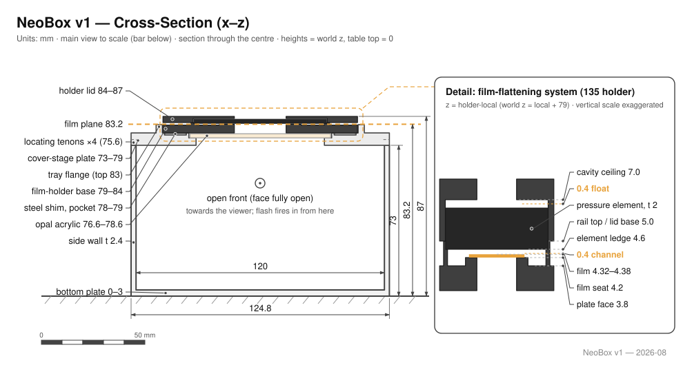
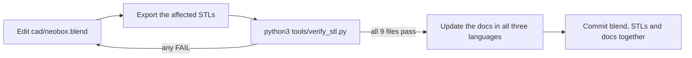

# Design

**English** · [简体中文](design.zh-CN.md) · [日本語](design.ja.md)

> The engineering reference: where every dimension comes from, which numbers are optical and which are structural, what happens if you change one, and how to open, edit, re-export and verify the CAD source.

**Contents:** [1. Light path](#1-light-path) · [2. Dimension chain](#2-dimension-chain) · [3. Optical decisions](#3-optical-decisions) · [4. Cover-stage](#4-cover-stage) · [5. Film holders](#5-film-holders) · [6. Enclosure](#6-enclosure) · [7. Focus light](#7-focus-light) · [8. Flash operation](#8-flash-operation) · [9. Repositioning and repeatability](#9-repositioning-and-repeatability) · [10. 4×5 reservation](#10-45-reservation) · [11. Working with the source](#11-working-with-the-source)

Reference flash: a **NEEWER TT560** speedlight with a **ZENIKO T1** 2.4 GHz trigger set. It is a reference, not a requirement. The flash lies on the desk *outside* the box, so no dimension in this document depends on it; any speedlight with manual power control works.

| Convention | What it means here |
|---|---|
| Dimensions | Millimetres, written width × depth × height (X × Y × Z) |
| `z` | Absolute height above the desk. The box stands directly on the desk, so this is also the height above the outer bottom of the main body |
| Part-local z | The layer-quantisation tables in [§2](#2-dimension-chain) measure each part from its own print-bed face instead; stated where used |
| XY positions | Measured from the centre of the box, which is also the centre of the light window |
| STL bounding box | Quoted only where it is labelled as such; it is sorted largest first and is often not in X × Y × Z order |
| Source | Every number below is read from `cad/neobox.blend` or from the exported STL files. [§11](#11-working-with-the-source) explains how to read them yourself |

> [!IMPORTANT]
> The geometry is verified dimensionally in Blender and numerically in the exported STL files. **The box has never been printed, built, photographed or measured.** Every performance figure in this document is a design target, not a result: the mixing margins, the ≤ 0.28 mm flatness bound, the depth-of-field coverage. No evenness has been measured, and nothing here claims otherwise.

---

## 1. Light path



The stack, desk upward:

**flash lying flat on the desk → the fully open front → white cavity 120 × 150 × 70 → light window 62 × 95 in the cover-stage → opal acrylic 68 × 118 × 2, top face at 78.6 → 4.6 mm of air → film plane at z = 83.2.**

The flash is not inside the box. It lies flat on the same desk the box stands on, its head against the **open front** (the front face of the box has no wall at all) and fires horizontally into the cavity. The TT560's emitting face is 60 × 45 with its centre 31 mm above the desk, well inside the 70 mm-tall opening.

**Nothing is aimed at the film.** The light window is in the ceiling of the cavity, at right angles to the beam, so light reaches it only after several diffuse bounces off the bare white PLA. That is what makes the interior an [integrating cavity](glossary.md#integrating-cavity) rather than a lamp with a shade. It leaves through the 62 × 95 window and gets its final smoothing from one [opal](glossary.md#opal) acrylic sheet recessed into the cover-stage directly above.

The open front is the whole v5 architecture in one move. The v4 box sealed the flash inside, and everything difficult about v4 followed from that: the box height was derived from the flash's thickness, an access panel was needed to reach the power dial, a cable gland to pass wires, and the published STLs fitted one flash model and no other. With the flash outside, all of it disappears: any brand of flash works, the receiver stays on the desk where its radio signal is clean and its batteries are reachable, and there is no panel, gland or ventilation question left to answer ([§6](#6-enclosure)). The price is that ambient light can enter the cavity. That trade is accepted, not ignored: the flash pulse is far brighter than room ambient at sync speed ([§8](#8-flash-operation)).

> [!NOTE]
> **Work in a dim room, and keep ceiling lamps from shining straight into the opening.** The pulse overwhelms ambient light by design, but a bright lamp aimed into the open front is the one geometry that erodes that margin for free.

---

## 2. Dimension chain

In v4 the box was derived from the flash, and its numbers died with it. v5 severs the link: the flash never enters the box, so the chain no longer starts at a product's datasheet. It starts at the desk and runs upward, part stacked on part, by gravity.

### The printed parts

Nine STL files, two white and seven black, all printed without supports:

| STL | Colour | Overall (mm) | What it is |
|---|---|---|---|
| `main-body.stl` | white | 124.8 × 154.8 × 75.6 | Main box: 3.0 floor, 2.4 left/right/rear walls, front fully open; four locating tenons 2.4 × 12 × 2.6 on the side-wall tops |
| `cover-stage.stl` | white | 124.8 × 154.8 × 10.0 | Cover-stage: 6 mm plate seated on the walls, with light window, acrylic recess, washer pockets and holder tray ([§4](#4-cover-stage)) |
| `film-holder-135-base.stl` | black | 94 × 120 × 5 | 135 holder base: 25 × 37 window, inner guide rails, outer rails with the 4.6 element ledge ([§5](#5-film-holders)) |
| `film-holder-135-lid.stl` | black | 94 × 120 × 3 | 135 holder lid: 25 × 37 window, element cavity, 8 magnet pockets |
| `film-holder-120-base.stl` | black | 94 × 120 × 5 | 120 holder base: 57 × 85 window (full 6×9), 62 channel, same outer rails and ledge as the 135 |
| `film-holder-120-lid.stl` | black | 94 × 120 × 3 | 120 holder lid: 57 × 85 window, otherwise identical to the 135 lid |
| `pressure-window-135.stl` | black | 64 × 95 × 2 | Pressure-window insert, 135 (window 25 × 37) |
| `pressure-window-120.stl` | black | 64 × 95 × 2 | Pressure-window insert, 120 (window 57 × 85) |
| `mask-6x6.stl` | black | 94 × 80 × 1 | 6×6 mask (window 56.5 × 56.5), laid in the tray under the 120 base |

Every part prints flat face down; the two lids print top face down. The largest part is 154.8 mm long, so a 160 × 160 print bed is enough. Layer heights, orientation cards and slicer settings are in [printing.md](printing.md).

### Height

The whole assembly is one gravity stack. World z, desk = 0:

| Layer | z range | Note |
|---|---|---|
| Desk | 0 | the flash and the box stand on the same surface |
| Main-body floor | 0 – 3.0 | |
| Cavity | 3.0 – 73.0 | interior 120 × 150 × 70, open at the front |
| Cover-stage plate | 73.0 – 79.0 | 6 mm plate seated on the wall tops; deck face at 79.0 |
| Opal acrylic | 76.6 – 78.6 | in its recess, top face 0.4 below the deck |
| Steel washers | 78.0 – 79.0 | in their pockets, flush with the deck |
| Tray flange | 79.0 – 83.0 | rim around the holder seat, 4 high |
| Holder base | 79.0 – 84.0 | stands on the deck inside the flange |
| **Film plane** | **83.2** | land top; the same height for both formats |
| Pressure element | 83.6 – 85.6 | insert or AN glass on the 4.6 ledge |
| Holder lid | 84.0 – 87.0 | total assembled height 87 |

### Width and depth

The main body is 124.8 × 154.8 outside; the walls are 2.4, the front is open, so the interior cavity is **120 × 150 × 70** and the open front is the cavity's full 120 × 70 cross-section. The 62 × 95 light window is centred, which leaves **29 mm of white wall in x and 27.5 mm in y** between the window edge and the nearest wall: the mixing margin. It is deliberately generous by design; no minimum has been established, and nothing has been measured.

### Generalising to another flash

There is nothing to re-derive. The v4 formulas that turned a flash datasheet into a box height are gone because the input is gone: **no dimension of the v5 box encodes any dimension of any flash.** A substitute flash needs manual power control and a head that can lie flat and fire level into the open front. The TT560's emitting face, 60 × 45 with its centre 31 above the desk, is the reference, not a limit. The receiver stays outside too, so the trigger model is equally free. Swapping flashes touches neither `cad/neobox.blend` nor the STLs ([§11](#11-working-with-the-source)).

### Layer quantisation

**Every printed z-feature in this design is an exact multiple of 0.2 mm, and no exposed horizontal step is under 0.4 mm (two layers).** Each part is quantised in its own print orientation, measured from its own print-bed face:

| Part (datum = print-bed face) | z stations |
|---|---|
| Main body | 0 · 3.0 floor top · 73.0 wall top · 75.6 tenon top |
| Cover-stage | 0 · 2.8 notch ceiling · 3.6 acrylic-recess floor · 5.0 washer-pocket floor · 6.0 deck · 10.0 flange top |
| Holder bases (both formats) | 0 · 2.2 magnet-pocket floor · 3.8 plate face · **4.2 land** · **4.6 element ledge** · 5.0 rail top |
| Holder lids (printed top face down) | 0 · 1.0 element-cavity ceiling · 3.0 lid underside (assembly-local 8.0 / 7.0 / 5.0) |
| Inserts / mask | flat plates, 2.0 / 1.0 |

The point of the grid: at a 0.2 mm [layer height](glossary.md#layer-height) every one of those stations lands exactly on a layer boundary, so a printed 0.4 step is a true 0.4 step, not a slicer rounding. 0.1 mm also divides the grid; 0.12 and 0.16 do not. The reasoning dates from the v4 holders and carries over unchanged ([design log entry 18](design-log.md#18-layer-quantised-holders)); what is new in v5 is that the whole design obeys it, not just the holders. The print order spec pins every file at 0.2 ([printing.md](printing.md)). The verifier enforces the grid and the minimum step on every export ([§11](#11-working-with-the-source)).

---

## 3. Optical decisions

**One opal sheet, recessed into the cover-stage, is the final diffuser.** The acrylic (a bought part, 68 × 118 × 2) drops into a 69 × 119 recess 2.4 deep: 0.5 mm of side clearance, top face 0.4 below the deck. Because the holder stands on the deck, **nothing ever touches the acrylic**: it is an optical layer, not a structural one, and the film plane is referenced through printed plastic, never through it. To lift it out, take the holder off and push the sheet up through the light window from inside the box.

**Dust on the acrylic does not image.** The acrylic is itself the diffuse emitting surface: a particle sitting on it is part of the source, not an object between the source and the lens, so it cannot project an outline onto the film. Wipe the sheet periodically and move on; no per-session ritual. (Dust on the optional glass is the opposite case; see [§5](#5-film-holders).)

**Mixing margins.** The window-to-wall margins, 29 in x and 27.5 in y, are the numbers that decide how well the cavity fills the window evenly. They are design margins, chosen generous, with no established minimum and no measurement behind them.

**All-white cavity, matte only.** The white PLA *is* the mixing surface. Do not paint the inside, and do not print the white parts in silk or glossy filament: a specular wall reproduces the flash head as a hot spot instead of scattering it.

**Everything above the acrylic is black.** The holders, inserts and mask print in black so stray light above the diffuser is absorbed, not bounced back into the film. An optional A5 black flocking sticker on the deck kills the last of the glare ([bom.md](bom.md)).

**Ambient light is tolerated, not sealed out.** The open front admits room light; the design answer is operational (dim room, no lamp aimed into the opening, camera at sync speed), because the pulse dwarfs what remains ([§8](#8-flash-operation)).

**No internal adjusters.** No reflector plates, no baffles, no levelling hardware anywhere in the light path: the cavity is bare white walls and nothing else. Every internal part would be one more thing to align and one more thing to knock out of place. Verify evenness with a [flat-field-corrected](glossary.md#flat-field-correction) test frame, which separates lens vignetting from real source unevenness ([assembly.md](assembly.md)).

---

## 4. Cover-stage

The cover-stage is v4's top cover and film stage merged into a single white plate: one printed part where there used to be a cover, a stage, three studs, six nuts and three heat-set inserts. It seats directly on the wall tops and carries everything optical above the cavity.

What the one part carries:

- **The plate**: 124.8 × 154.8, 10 overall, a 6 mm structural plate whose deck face lands at z = 79.0. Four corner notches, 2.8 deep, drop over the main body's 2.6 tenons with 0.2 of vertical clearance. The plate seats on the wall tops, never on the tenons; the tenons only pin it in XY.
- **The light window**: 62 × 95, centred, straight through the plate.
- **The acrylic recess**: 69 × 119, 2.4 deep, floor at 76.6, open to the deck. The opal sheet drops in from above and sits 0.4 below the deck ([§3](#3-optical-decisions)).
- **The tray**: a flange rim around a 94.6 × 120.6 seat, 4 high, top at 83.0. It locates the holder with 0.3 mm per side and its top face catches the film tail 0.2 below the film plane ([§5](#5-film-holders)).
- **The washer pockets**: four, 10.6 square and 1.0 deep, at (±41, ±12). A 10 × 10 × 1 steel washer (or a Ø10 × 1 disc) drops into each, flush with the deck: ferrous seats for the holder-base magnets, so the holder snaps down onto the tray and stays put. It is the same job v4's glued washers did, now without glue.

To move it, pinch the flange and lift; the whole cover-stage comes off the box in one piece.

**There is no levelling hardware, and that is the design, not an omission.** v4 levelled its film stage against the box on three M6 studs; v5 deletes the studs, the nuts, the inserts and the procedure.

<details>
<summary>Why levelling moved to the camera end</summary>

Plastic never carries a thread in this design. FDM-printed threads are weak and creep under load; v4 already avoided them with brass inserts and steel studs, and v5 removes the need for even those.

The deeper reason: the only parallelism that matters is **film plane to sensor**, and levelling the stage against the box never delivered that directly; after v4's three-nut ritual you still had to square the camera to the stage. v5 keeps only the step that matters. Lay a small mirror on the film stage, look through the viewfinder, and move the camera until the reflection of its own lens is centred: when it is, the sensor is parallel to the mirror, and therefore to the film plane the mirror is lying on ([assembly.md](assembly.md#step-7--level-at-the-camera-the-mirror-method)).

Because the mirror lies on the *result* of the whole printed stack (floor, walls, plate, holder), every print tolerance underneath it is absorbed in that single alignment. The box does not need to be flat to a target; the camera meets the film plane wherever it actually is.

</details>

---

## 5. Film holders

One holder set per format: a base and a lid, both 94 × 120, standing in the cover-stage tray. Changing format means lifting one set off and dropping the other in: the magnets release and re-seat in about five seconds, and nothing else moves. The film is advanced by pulling the strip through the closed holder; it is never opened mid-roll.

| Feature | 135 holder | 120 holder |
|---|---|---|
| Outline, base and lid | 94 × 120 | 94 × 120 |
| Base / lid thickness | 5 / 3 | 5 / 3 |
| [Window](glossary.md#window) (base, lid and insert) | 25 × 37 | 57 × 85 (covers 6×9) |
| Film guide width | 35.4 between the inner rails | 62.0 between the channel walls |
| Element ledge ([§ below](#the-flattening-system)) | 4.6 high, at x 31 – 32.2 | identical |
| Magnets Ø8 × 2 | 8 in the base + 8 in the lid | same |

**Windows are deliberately about 0.5 mm oversize per side** against the nominal frame (135 is nominally 24 × 36, 120 is nominally 56 × 84) to absorb camera-gate variance between bodies and printer XY tolerance. You crop to the frame in post; see [scanning.md](scanning.md#loading-film).

### The flattening system

The film plane is the top of the [land](glossary.md#land), a ledge framing the window **on all four sides**, at 4.2 above the base bottom. Film is 0.12 – 0.18 thick, so its top face lies at 4.32 – 4.38. The next 0.2-grid station above that is **4.6**, and 4.6 is exactly where the element ledge places the underside of whatever rests on it. Those three numbers are the whole system:

**land 4.2 → film top 4.32 – 4.38 → element underside 4.6.**

That makes a 0.4 mm channel over the land on all four sides of the window, and 0.22 – 0.28 mm of free lift for the film anywhere under the element. The element is whatever 64 × 95 × 2 plate you set on the ledge; that is what makes the system interchangeable:

- **Default: the printed pressure-window insert**, one per format. A hard ceiling all round the window perimeter holds lift to ≤ 0.28 there; over the open window the film is unconstrained, but at 1:1 and f/8 the depth of field is about ±0.4 mm, which covers the residual bow.
- **Upgrade: one anti-Newton glass, 64 × 95 × 2, shared by both formats.** A continuous ceiling over the full frame: ≤ 0.28 mm at any position. Its matte (AN) face goes down, against the glossy film base, so no [Newton rings](glossary.md#newton-rings) form; the emulsion faces the open window below and touches nothing.

**Why a single glass completes the sandwich:** a classical glass carrier needs two glasses because nothing else defines the bottom of the stack. Here the bottom is printed (the land frame supports the film on all four sides at 4.2), so one glass on top closes the sandwich, with half the glass surfaces to keep clean and no glass at all under the emulsion.

**Why one glass fits both formats:** both bases carry an identical outer-rail profile: the element ledge at x 31 – 32.2, 4.6 high, and an outer step at 32.2 – 33.5, 5.0 high, which locates the element sideways. The same 64 × 95 seat therefore exists in both. In the 135 base, the inner guide rails at ±17.7 – 19.7 that steer the narrow strip would foul a 64-wide plate, so their middle is omitted over |y| < 48, leaving 12 mm guide stubs at each end: the glass drops through the gap onto the ledge, and the stubs bracket it lengthwise.

The element is seated once and then never handled. Advancing film means gripping the leader where it protrudes from the holder and pulling; a bowed section is ironed flat as it slides under the element. The lid's cavity (64.8 × 96, ceiling at 7.0) captures the element with 0.4 of float: the lid locates it but never presses on it, so the element's height remains the ledge's printed 4.6, not a force fit. Loading advice: **glass mode, bow up** (the glass flattens it); **insert mode, bow down**. Film that leaves the holder drapes onto the tray flange, whose top sits 0.2 below the film plane: a support, not a pinch. Hand-support the tail of a long strip.

> [!CAUTION]
> **The glass underside sits 0.2 mm from the focal plane, so dust on it lands essentially in focus.** Blow both faces of the glass before seating it; it is the one surface in the box where dust images. The acrylic, by contrast, is self-forgiving ([§3](#3-optical-decisions)).

**Magnets.** Ø8 × 2 N35, press-fitted (no glue anywhere), 8 per part, 32 across both sets. The base magnets stand 0.4 proud of the plate face; the lid magnets sit flush with the lid underside; closed, the faces are 0.8 apart and **never touch**, so the lid always seats on the printed rail tops and the channel height stays a printed number, not a magnet stack-up. Polarity must be paired so that every base–lid position attracts: check each magnet against its mate before pressing it home; a press-fitted magnet does not come back out.

**6×6 and 6×4.5.** For 6×6, lay `mask-6x6.stl` (94 × 80 × 1, window 56.5 × 56.5) in the tray *under* the 120 base: the whole set rides 1 mm higher, which is normal; refocus and carry on. 6×4.5 has no dedicated mask; crop in post.

> [!NOTE]
> **Mounted slides are out of scope.** A cardboard or plastic slide mount is many times thicker than the 0.4 mm channel and cannot enter the holder. NeoBox takes bare film strips only, up to 6×9.

---

## 6. Enclosure

**Main body** is one printed piece: a 3.0 floor, three 2.4 walls (left, right, rear), and no front wall at all. Four locating tenons, 2.4 × 12 × 2.6, stand on the side-wall tops and engage the cover-stage's corner notches.

**What the open front deleted.** v4 needed an access panel because the flash's power dial lived inside a sealed box, a cable gland because wires had to cross a light-tight wall, and a ventilation answer because heat had nowhere to go. In v5 there is nothing inside to reach: flash, receiver and their batteries all sit on the desk, a power change is a fingertip away, the focus light's cable simply walks out through the opening, and the cavity is open air. All three problems left with the front wall.

**No screws, no glue, no tools.** No thread engages plastic anywhere in the design. Every joint is a tenon in a notch, gravity, or a magnet: the cover-stage locates on tenons and holds by weight, the holder holds by magnets on washers, the lid by magnets on the base, the element by gravity in its ledge. The magnets press-fit; the washers drop in loose. Assembly is stacking, in order, and is over in minutes ([assembly.md](assembly.md)).

> [!NOTE]
> **The fastener inventory of the entire build is: zero screws, zero adhesive.** Even v4's two glue points (holder magnets and steel washers) are gone: v5's magnets are interference-fitted and its washers sit in pockets.

> [!WARNING]
> **A gravity stack must not be carried tilted.** Assembled, the box is aligned, not attached: move it flat across the desk, or move the pieces separately; the cover-stage lifts off by its flange in one motion.

### Feature location schedule

XY from the centre of the box; z from the desk. Read from `cad/neobox.blend`.

| Feature | XY | z | Size |
|---|---|---|---|
| Open front | front face | 3.0 – 73.0 | full cavity cross-section, 120 × 70 |
| Locating tenons, 4 | side-wall tops | 73.0 – 75.6 | 2.4 × 12 × 2.6 |
| Corner notches, 4 | cover-stage underside | 2.8 deep | 0.2 vertical clearance over the tenons |
| Light window | centred | through the plate, 73.0 – 79.0 | 62 × 95 |
| Acrylic recess | centred | floor 76.6, open to the deck at 79.0 | 69 × 119, 2.4 deep |
| Washer pockets, 4 | (±41, ±12) | 78.0 – 79.0 | 10.6 square, 1.0 deep |
| Tray flange | around the 94.6 × 120.6 seat | 79.0 – 83.0 | rim, 4 high |

> [!TIP]
> The tenon-and-notch fit is sized inside normal FDM error: elephant foot, XY expansion and warp all eat into it. If the cover-stage binds or rattles, the remedy is a slicer setting, not a file edit; see [printing.md](printing.md#if-it-came-out-tight-or-loose).

---

## 7. Focus light

Optional: two 120 mm segments of dimmable 5 V USB LED strip, stuck to the inside of the side walls, a dim, always-on positioning light so you can see the frame between pops. The flash overwhelms it completely, so it never needs switching off between frames; switch it off at the end of a roll.

The cable leaves through the open front, and the inline dimmer stays outside with it. **Nothing mains-powered goes inside the enclosure**: power the strip from a USB power bank or charger.

---

## 8. Flash operation

Manual power only, normal sync, shoot [raw](glossary.md#raw). [TTL](glossary.md#ttl) metering is useless here (the scene never changes, so power is set once, manually), and [HSS](glossary.md#hss) solves a problem that does not exist at or below [sync speed](glossary.md#sync-speed). Do not pay for either.

**The pulse is the exposure.** Even with the open front, in a dim room the ambient light a sync-speed exposure collects is negligible next to the pulse, so the flash's own duration acts as the effective shutter, orders of magnitude shorter than any tripod-safe continuous-light exposure. Vibration, shutter shock and floor rumble stop mattering.

**Shutter speed: 1/125 s is the recommendation.** Focal-plane shutters typically sync at 1/160 – 1/250, and a cheap 2.4 GHz trigger's latency costs about one stop of that; hence 1/125. The symptom of pushing past the real limit is unmistakable: a clean-edged dark band across the frame.

> [!IMPORTANT]
> **An electronic shutter will usually not fire a flash at all.** If nothing happens when you press the button, that is the first thing to check. Details in [scanning.md](scanning.md#exposure).

Power changes are a fingertip away: the flash is on the desk in front of you, nothing to open, nothing to disturb. The receiver sits beside it, outside the box, where its radio path is clean and a battery swap touches nothing. In practice power is set once, from a test frame, and left alone; exposure procedure is in [scanning.md](scanning.md#exposure).

---

## 9. Repositioning and repeatability

The film plane is fixed at z = 83.2 for **both** formats (the 6×6 mask lifts the 120 set by 1 mm; refocus, nothing else changes). What changes between 135 and 120 is the magnification you need, and therefore the camera height, not the height of the film. Work the camera height out from the film plane plus your lens's [working distance](glossary.md#working-distance); the arithmetic is in [scanning.md](scanning.md#camera-height-and-the-stand).

**Parallelism is one alignment: the mirror method.** Lay a small mirror on the film stage and centre the reflection of your own lens in the viewfinder: the sensor is then parallel to the film plane, and every print tolerance in the stack below has been absorbed in the same move ([assembly.md](assembly.md#step-7--level-at-the-camera-the-mirror-method), and the reasoning in [§4](#4-cover-stage)). This is why the box carries no levelling hardware at all.

Once the camera is set, the box is what moves: slide it on the desk to centre the frame rather than re-aiming the camera; the flash just gets nudged back against the opening. When you are satisfied, make the position repeatable (two locating pins on the baseboard or a pencil outline of the footprint, either works) and write down the column height you used for each format.

**Parallelism first, evenness second.** A flash freezes vibration; it cannot fix a film plane that is not parallel to the sensor. Mirror method first, then a [flat-field-corrected](glossary.md#flat-field-correction) test frame to check evenness.

---

## 10. 4×5 reservation

**No 4×5 geometry has been derived.** This section is a method, not a specification.

If you want to build one:

1. Size the light window from the sheet plus clearance, then the cavity from the window plus a mixing margin on every side. v5's margins of 29 and 27.5 are this build's values, not established minima; at 4×5 scale expect to iterate, and expect a bigger flash to be needed to fill the larger cavity. Nothing about evenness at that size has been tested.
2. Keep the flattening sandwich: a four-sided land at 0.4 above the plate face, an element ledge exactly 0.4 above the land, every z-feature on the 0.2 grid, no exposed step under 0.4 ([§5](#5-film-holders)). Sheets load one at a time, so the strip-feed details (pull-through advance, guide stubs) do not carry over; the land-plus-element principle does.
3. The open-front architecture and the screwless gravity stack carry over unchanged: derive a bigger box, not a different kind of box.

---

## 11. Working with the source

`cad/neobox.blend` is the only source of geometry in this repository. The nine STL files are generated from it, and a change that reaches the STLs without going through the blend file is lost the next time anyone re-exports.

### Opening the file

| Property | Value |
|---|---|
| Blender version | **3.0 or newer.** The file is Zstandard-compressed, which pre-3.0 Blender cannot read at all. The file header records **Blender 5.2** as the version it was last saved with |
| Unit system | Metric, unit scale 0.001, length unit millimetres: **one Blender unit is one millimetre** |
| Scene layout | The assembly is modelled in place, on the same z datum this document uses: the desk (the outer bottom of the box) is z = 0. The 120 holder set is parked beside the assembly at x = 200 and the 6×6 mask at x = 350 |

### The collection tree

```
Scene Collection
├── 焦点                       an empty, used as a view target
├── Collection                 Camera, Light: render scaffolding
├── NeoBox_混光箱_TT560定稿     the enclosure, the cover-stage and the mock-ups
├── 胶片夹_135                  the 135 holder set, assembled in place
├── 胶片夹_120                  the 120 holder set, parked at x = 200
└── 打印小件                    the 6×6 mask, parked at x = 350
```

### Which objects make each STL

| STL file | Blender object(s) | Gloss |
|---|---|---|
| `main-body.stl` | `主箱_底3mm`, `主箱_左壁`, `主箱_右壁`, `主箱_后壁` | **four objects**: floor, left wall, right wall, rear wall; the open front needs no lintel or posts |
| `cover-stage.stl` | `顶盖台一体_窗62x95` | cover-stage, one piece, window 62 × 95 |
| `film-holder-135-base.stl` | `135夹_底座_94x120_平底` | 135 holder base, flat-bottomed |
| `film-holder-135-lid.stl` | `135夹_上盖_94x120` | 135 holder lid |
| `film-holder-120-base.stl` | `120夹_底座_94x120_平底` | 120 holder base, flat-bottomed |
| `film-holder-120-lid.stl` | `120夹_上盖_94x120` | 120 holder lid |
| `pressure-window-135.stl` | `压片窗插片_135_64x95x2` | pressure-window insert, 135 |
| `pressure-window-120.stl` | `压片窗插片_120_64x95x2` | pressure-window insert, 120 |
| `mask-6x6.stl` | `6x6插片_94x80x1` | 6×6 mask |

### What is a mock-up and must never be exported

Everything else in the scene is a mock-up, there to show fit and light path, and none of it is printed or exported: the flash body and its emitting face, the T1 receiver, the two LED-strip candidates, the four light-path arrows, the 135 and 120 film-strip mock-ups, the opal acrylic, the AN glass, the four steel washers, a text label, and the camera/light/view-target scaffolding.

> [!CAUTION]
> **Material names do not tell you the filament colour.** The material slots exist for the renders: `NB_alu`, for one, survives from the deleted v4 aluminium stage. Take colours from [printing.md](printing.md#the-nine-parts), never from the material slot.

### The export convention

Every STL is exported **in assembly world space**: nothing is re-zeroed or re-oriented on the way out.

| File | Where it sits inside the exported file |
|---|---|
| `main-body.stl` | z 0 – 75.6, centred on XY |
| `cover-stage.stl` | z 73 – 83, centred on XY |
| `film-holder-135-base.stl` / `-lid.stl` | z 79 – 84 / 84 – 87, in place on the assembly |
| `pressure-window-135.stl` | z 83.6 – 85.6, in place |
| `film-holder-120-base.stl` / `-lid.stl` | parked at x 153 – 247, z 0 – 5 / 5 – 8 |
| `pressure-window-120.stl` | parked at x 168 – 232, z 4.6 – 6.6 |
| `mask-6x6.stl` | parked at x 303 – 397, z 0 – 1 |

A slicer drops each file onto the build plate by its bounding box. Seven of the nine files arrive lying on their print face already; the two holder lids do not: they print **top face down** and have to be flipped after import. The required rotation is on each part card in [printing.md](printing.md#the-nine-parts).

### Re-exporting

One command regenerates all nine files. It is the committed form of the pipeline that produced the published STLs, and it is the only supported way to export:

```
blender --background cad/neobox.blend --python tools/export_stl.py
```

(`blender` is the binary inside your Blender installation; any 4.x/5.x build works. Run it from the repository root, then `python3 tools/verify_stl.py`.)

The script matters because the printable parts are **modelled as overlapping shells**, interpenetrating by 0.2 – 0.5 mm on purpose: the walls sink into the floor, the flange into the cover-stage plate, the rails into the holder bases. That keeps the source parametric and easy to edit. For every output file the script copies the source objects, splits them into shells, boolean-unions the shells into one solid (EXACT solver), welds away the boolean slivers, checks the result is watertight, and exports it in assembly world space; the scene itself is never touched. A naive File → Export → STL of the raw objects produces multi-shell files whose internal faces fail the verifier's layer-grid check.

Regenerated files may differ from the published ones **byte for byte** (triangulation is not stable across Blender versions) while being geometrically identical. The verifier is the referee: bounding box, watertightness, layer grid and minimum step must all pass.

<details>
<summary>Manual export, if you cannot run the script</summary>

1. **Select the objects** for one output file, using the mapping table above. *Checkpoint:* the number of selected objects matches the table: four for the main body, one for everything else.
2. **Make it one solid: every part, not just the main body.** Single-object parts can still be multi-shell inside. Join what needs joining, separate by loose parts, boolean-union the shells, then merge vertices by distance (0.02 mm) and run a limited dissolve (1°) to remove the boolean slivers. *Checkpoint:* the part is one connected shell and the verify script reports no non-manifold edges.
3. **Export.** File → Export → STL, with *Selection Only*, scale 1.00, forward Y, up Z. No axis conversion: the numbers in the file must be the numbers in Blender. *Checkpoint:* re-importing the file puts the part back exactly where it was.
4. **Write it to the same path** under `stl/white-pla/` or `stl/black-pla/`, keeping the filename. *Checkpoint:* `git status` shows a modified file, not a new one.
5. **Verify** before you commit anything. *Checkpoint:* `python3 tools/verify_stl.py` prints `all 9 files pass` and exits 0.

</details>



### Running the verifier

`tools/verify_stl.py` is plain Python 3 with no dependencies. Run it from the repository root:

```
python3 tools/verify_stl.py
```

It walks every `.stl` under `stl/` and checks four invariants per file:

| Check | What it enforces |
|---|---|
| watertight | Every edge is shared by exactly two triangles: a closed solid, no holes |
| layer grid | Every horizontal face sits on a 0.2 mm multiple above that part's own base |
| minimum step | No exposed horizontal step below 0.4 mm, which is two layers at 0.2 |
| bounding box | The part still measures what the documentation says it measures |

Horizontal faces smaller than 1 mm² are ignored when hunting for steps, so modelling slivers do not raise false alarms. Output is one line per file plus a total, and the exit status is non-zero if anything fails, so the script can gate a commit:

```
ok    film-holder-120-base.stl  [94.0, 120.0, 5.0]  256 triangles
...
all 9 files pass
```

The published bounding boxes live in the `EXPECTED` table at the top of the script, sorted largest first. **If you change a published dimension on purpose, edit `EXPECTED` in the same commit**; otherwise the check fails on the part you meant to change and quietly passes on the part you did not.

### Changing the flash

In v4 this heading introduced a re-derivation checklist. In v5 there is nothing to change: **no dimension of the box encodes the flash**, so a different flash (or a different trigger) touches neither `cad/neobox.blend` nor the STLs. The new flash needs manual power control and a head that can lie flat and fire level into the open front; after swapping, redo the metering test frame and carry on ([§8](#8-flash-operation)).

### Other files in `cad/`

- `film-stage-aluminium-3mm.dxf`: the v4 aluminium film stage, kept for history only. v5 has no film stage: the part was merged into the cover-stage, and nothing in the current design is cut from this file.
- `legacy-plywood/`: DXFs from the plywood revision, kept for history only. Between them the two files do not describe a complete shell, and nothing in the current design is cut from them.

Contribution rules (what is source, what is generated, and the three-language requirement) are in [CONTRIBUTING.md](../CONTRIBUTING.md#source-of-truth-vs-generated-files).

---

← [Glossary](glossary.md) · [Documentation index](../README.md#documentation) · [Design log](design-log.md) →
