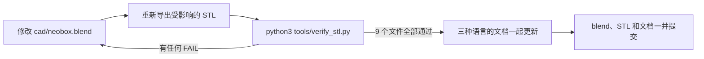

# 设计

[English](design.md) · **简体中文** · [日本語](design.ja.md)

> 工程参考：每一个尺寸从哪里来，哪些数字是光学的、哪些是结构的，改动其中一个会发生什么，以及怎么打开、修改、重新导出并校验 CAD 源文件。

**目录：**[1. 光路](#1-光路) · [2. 尺寸链](#2-尺寸链) · [3. 光学决策](#3-光学决策) · [4. 胶片台](#4-胶片台) · [5. 胶片夹](#5-胶片夹) · [6. 壳体](#6-壳体) · [7. 对焦灯](#7-对焦灯) · [8. 闪光灯用法](#8-闪光灯用法) · [9. 复位与重复性](#9-复位与重复性) · [10. 4×5 预留](#10-45-预留) · [11. 使用源文件](#11-使用源文件)

参考配置：一只 **NEEWER TT560** 机顶闪，配一套 **ZENIKO T1** 2.4 GHz 触发器。

| 约定 | 在本文里的含义 |
|---|---|
| 尺寸 | 单位毫米，一律写成 宽 × 深 × 高（X × Y × Z） |
| `z` | 从主箱**外底面**起算的绝对高度 |
| XY 坐标 | 从箱体中心起算，箱体中心也就是胶片台中心 |
| STL 包围盒 | 只在明确写了「STL 包围盒」的地方才是这个含义——它按数值从大到小排序，往往不是 X × Y × Z 的顺序 |
| 数据来源 | 下文每一个数字都读自 `cad/neobox.blend` 或导出的 STL 文件。[§11](#11-使用源文件) 讲了怎么自己去读 |

> [!IMPORTANT]
> 几何在 Blender 里做过尺寸核对，导出的 STL 文件也做过数值校验。**这只箱子从未被打印、装配、拍照或实测过。** 本文里所有性能数字都是设计目标，不是结果：四角之间 ±0.1 [EV](glossary.zh-CN.md#ev) 的均匀度、3–5 档的箱体损耗、灰尘投影的估算，全部如此。闪光灯回电时间、每小时能拍多少张、一组 AA 电池能打多少次，这些都不知道，本文也没有任何地方声称知道。

---

## 1. 光路


自下而上的叠层：

**底板 4 → 闪光灯平躺 55 → 白色混光腔净空 33 → 顶盖 4**（这就是 96 mm 的箱体高度）**→ 胶片台 → 扩散板 2 → 胶片夹 → 胶片面约在 120.3。**

灯头转过 90°，沿箱体长度方向朝远端箱壁发光。**没有任何光是对着胶片打的。** 光要在裸白 PLA 壁面上漫反射好几次才走得到开口——正是这一点让箱子内部成为一个[混光腔](glossary.zh-CN.md#混光腔)（integrating cavity），而不是一盏带灯罩的灯。

光从顶盖上 100 × 120 的开口射出，再由一块搁在胶片台上的[乳白](glossary.zh-CN.md#乳白)（opal）亚克力扩散板完成最后一道柔化。

> [!WARNING]
> **不要装闪光灯自带的广角扩散片，也不要把灯头朝上。** 把闪光灯变焦设在 35–50 mm，让光束落在远端箱壁上，而不是直接漫到开口上去。没经过反弹就到达扩散板的光束，会把灯头的形状原样印进画面里。

---

## 2. 尺寸链

### 高度

96 mm 的箱体高度是四层之和，自下而上：

| 层 | z 范围 | 高度 |
|---|---|---|
| 底板 | 0 – 4 | 4 |
| 闪光灯平躺（TT560） | 4 – 59 | 55 |
| 白色混光腔净空 | 59 – 92 | 33 |
| 顶盖板 | 92 – 96 | 4 |
| **箱体高度** | **0 – 96** | **96** |

顶盖以上是光学叠层：

| 层 | z 范围 | 说明 |
|---|---|---|
| 胶片台板 | 109 – 114 | 两种胶片台的顶面都在 114 |
| 扩散板 | 114 – 116 | 2 mm 乳白亚克力，直接搁在胶片台上 |
| 夹底座 | 116 – 121 | 底面是平的，压在扩散板上 |
| **胶片面** | **≈ 120.3** | 承托顶面 120.2，加上约 0.14 的片厚 |
| 夹上盖 | 120.6 – 124 | 压条最低伸到 120.6 |

把它撑在那个高度上的五金件：

| 件 | z 范围 | 说明 |
|---|---|---|
| M6 [热熔铜螺母](glossary.zh-CN.md#热熔铜螺母) | 86 处 | 顶盖的三根立柱里各一颗 |
| M6 × 35 螺杆 | 86 – 120 | 全牙，旋进热熔铜螺母 |
| 下螺母 | 105 – 109 | 决定胶片台高度——调平调的就是它 |
| 上螺母 | 114 – 118 | 把胶片台向下压死在下螺母上 |
| 四角挡块 | 114 – 120 | 与胶片台一体打印 |

于是胶片面比顶盖顶面高出约 24.3 mm。这个偏移量由胶片台一侧的几何决定，换闪光灯也不会变——但它下面的箱体高度会变，所以换一只闪光灯就等于把胶片面整体挪了位置，相机高度必须重设。见[翻拍扫描的相机高度与支架](scanning.zh-CN.md#相机高度与支架)。

### 深度

| 项 | mm | 由什么决定 |
|---|---|---|
| 抽口盖板处的余量 | 2.5 | 结构 |
| ZENIKO T1 接收器 | 30 | 这套触发器 |
| TT560 灯体 | 190 | 这只闪光灯 |
| 反射区，灯头到远端箱壁 | 44.5 | **光学** |
| **内腔深度** | **267** | |
| 两道 3 mm 壁 | 6 | 结构 |
| **外形深度** | **273** | |

接收器立在箱体底板上，靠自己的底脚站在闪光灯前面，占掉尺寸链里的那 30 mm。它不是挂在闪光灯上的。

### 宽度

| 项 | mm | 由什么决定 |
|---|---|---|
| 开口 | 100 | 画幅 |
| 白壁余量，两侧各约 50 | 102 | **光学** |
| **内腔宽度** | **202** | |
| 两道 3 mm 壁 | 6 | 结构 |
| **外形宽度** | **208** | |

宽度由开口尺寸，加上混光腔在两侧各自需要的白壁余量决定。它跟闪光灯没有关系——所以下面的公式里，宽度始终是 208。

### 换用其他闪光灯

```
高 = 闪光灯厚度 + 41        （按平躺、灯头已转到 90° 的状态量）
深 = 闪光灯长度 + 接收器长度 + 53
宽 = 208                    （固定）
```

这两个常数并不神秘，都是上面表格里几行的和：

| 常数 | 拆开是什么 | 其中的光学项 |
|---|---|---|
| `+41` | 4 底板 + 33 混光腔净空 + 4 顶盖板 | 33 |
| `+53` | 2.5 抽口余量 + 44.5 反射区 + 2 × 3 壁厚 | 44.5 |

结构项（4、4、2.5、2 × 3）都是壁厚和板厚；把它们改薄，损失的只是刚度或遮光性，仅此而已。

**真正决定重新推导出来的箱子还能不能混匀光的，是 33 和 44.5 这两个光学项。** 这两个值都没有确定过下限，也都没有实测验证过。

请把它们当作这一台的取值，而不是通用规则：如果你要动它们，就要把重做均匀度校准的工夫算进预算，并且做好恢复第二块扩散板、为此多付出约 43 mm 高度的准备（[§3](#3-光学决策)）。

量闪光灯时要让它平躺、灯头已经转到 90°，不要按立着的姿态量。**绝不要先把外形高度定死再倒推分层**——初稿在物理上装不起来，错的就是这一步（[设计日志第 1 条](design-log.zh-CN.md#1-高度在算术上就不成立)）。

> [!WARNING]
> **发布的这套 STL 文件只适配 TT560，别的都不行。** 公式只能给你新的数字，不会替你改文件。换闪光灯就意味着要改 `cad/neobox.blend` 并重新导出（[§11](#11-使用源文件)）。
>
> 替代的闪光灯必须满足：灯头能转 90°、能手动调出力、灯体长度不超过 190 mm、平躺时厚度不超过 55 mm。超出这个范围，整个壳体就得重新推导。

---

## 3. 光学决策

**一块扩散板，不是两块。** 双层结构——先打散、再混光、最后一道发光面——均匀性确实更好，但每一层都要有自己的混光距离。在现在这个设计里，把第二块扩散板和它的腔体加回来，要多付出**约 43 mm** 的高度。之所以砍掉，是因为「单块乳白板贴近胶片」正是作者现有的观片灯板（light pad）工作流已经做到的效果；验证依据是那套工作流，不是对这只箱子的测试（[设计日志第 9 条](design-log.zh-CN.md#9-双层扩散板变成单层)）。

**扩散板在胶片台之上，不在顶盖之下。** 它搁在胶片台上盖住开口，靠胶片夹的自重压平——一个固定件也没有。掀开胶片夹，两面都露出来可以擦，而这一点很要紧，原因见下一段。

**胶片到扩散板约 4.3 mm。** 这是整个设计里唯一一处主动的妥协。

在 0.43×——也就是[翻拍扫描](scanning.zh-CN.md#放大倍率与镜头选择)那张[放大倍率](glossary.zh-CN.md#放大倍率)（magnification）表里 6×6 拍全画幅的那一档——加上 f/8 的条件下，扩散板上一粒灰在胶片面上投出的是一块约 0.2 mm 宽的柔斑。这在[反相](glossary.zh-CN.md#反相)（inversion）后的负片上基本看不出来，在正片上则能察觉。

对策是流程性的，不是机械性的：**每次开工前，把扩散板的两面和[片门](glossary.zh-CN.md#片门)（film gate）都用气吹吹一遍。** 把间距拉开当然也管用，代价刚好就是这个设计刚刚省下来的那点高度。

**开口余量。** 100 × 120 的开口比 6×9 画幅（56 × 84）短边多 22 mm、长边多 18 mm，所以开口本身不可能造成暗角。但更大并不更好：开口越大，越多斜向杂光穿过片基，反差越低。

**内部全白，而且只能哑光。** 白色 PLA 本身*就是*那层混光面。不要在内部涂装，也不要用丝绸或高光耗材——镜面壁会把灯头复制成一个热点，而不是把它打散。黑色的灯体正好在开口的正下方，不处理的话会在画面里变成一块暗斑，所以**在灯体上表面贴一张白纸**，注意别盖住灯头。

**扩散板以上的一切都是黑的**，这样杂光会被吸收，而不是反弹回胶片上。

**没有任何内部调节件。** 早期版本装过 45° 反射斜板和防直射挡板，现在都没有了：远端箱壁本身就完成了转向，而每多一个内部零件，就多一样要对齐、也多一样会被碰歪的东西。均匀度改从外部去修——见[装配文档的校准](assembly.zh-CN.md#校准)。指标是**四角之间 ±0.1 EV，且要在做完[平场校正](glossary.zh-CN.md#平场校正)（flat-field correction）之后测量**，平场校正的作用是把镜头暗角和光源本身的不均分开。

---

## 4. 胶片台

胶片台就是那块调平了的板，箱体上面所有光学件都由它承载。

| 版本 | 材料 | 几何 | 文件 |
|---|---|---|---|
| 打印版 | 黑色 PLA 或 PETG | 200 × 230 的板，厚 5 mm，四个四角挡块与板一体打印在顶面，最高处到 11 mm。STL 包围盒 230 × 200 × 11 | `stl/black-pla/film-stage-printed.stl` |
| 升级版 | 3 mm 5052 铝板，黑色阳极氧化 | 外形 200 × 230，开口 100 × 120，3 × Ø6.5 光孔 | `cad/film-stage-aluminium-3mm.dxf` |

两个版本的顶面都在 **z = 114**，所以可以互换。铝板薄 2 mm，把它的下螺母调高 2 mm 即可；顶面照样落在 114，上面的一切都不用动。

DXF 里三个孔的坐标是 (145, 15)、(30, 180) 和 (170, 180)，板中心在 (100, 115)——和打印版是同一套孔位。**前面那个孔是刻意偏置的**，原因见下面的走片通道。

> [!CAUTION]
> **绝不要给胶片台的孔攻丝。** 攻了丝的板配上同螺距的螺杆，就是一副[差动螺旋](glossary.zh-CN.md#差动螺旋)（differential screw）：转动螺杆时，板前进多少就同时后退多少，高度根本不会变。这三个孔必须保持为 Ø6.5 的[光孔](glossary.zh-CN.md#光孔与螺纹孔)（clearance hole），不能是螺纹孔。打印出来偏紧就把孔扩一下——不要在里面切螺纹。这是一个真实发生过的规格错误，在发布前被抓住（[设计日志第 14 条](design-log.zh-CN.md#14-为竖着使用而改成确实固定)）。

**三点调平，而且是正连接。** M6 × 35 全牙螺杆旋进顶盖立柱里的 M6 热熔铜螺母。胶片台通过自己的 Ø6.5 光孔套在螺杆上，被下螺母（定高度）和上螺母夹住。调平就是松开上螺母、转动下螺母：**前螺母管俯仰，后面一对管滚转。** 完整流程在[装配文档的调平胶片台](assembly.zh-CN.md#调平胶片台)。

<details>
<summary>为什么是三点而不是四点，前螺杆又为什么偏置</summary>

三个点恰好唯一确定一个平面。不管三颗螺母各在什么高度，胶片台的姿态都是完全确定的，三根螺杆全部受力，什么都不会晃。

加第四个点就是过约束。除非四点绝对共面——现实中永远做不到——刚性板只会接触其中三点，强行让第四点也接触，就等于把板拧弯。而弯曲恰恰破坏了你本来想保护的平面度。四条腿的桌子会晃，三脚架不会。

对称性和调节本身无关。前螺母让胶片台绕后面那对螺杆转动，这就是俯仰；后面两颗反向转，就是滚转。前螺杆偏置带来的影响，只是单独动一颗后螺母时会多一点交叉耦合，再走一轮就收敛了。

还有一点：胶片台是被两颗螺母夹住的，不是搁在一颗上面的，所以穿片时手压在台面任何位置都不会把它压歪——箱子能立起来用，靠的也是这一条。

</details>

**螺杆位置**，相对胶片台中心：前 **(45, −100)**，后 **(±70, +65)**。三根螺杆连同螺母，与 110 × 170 的胶片夹轮廓净距都在 9 mm 以上；同样要紧的是，它们全都躲开了[走片通道](glossary.zh-CN.md#走片通道)。

片条是从胶片夹两端的敞口滑出去的，所以在夹子端头以外、**|x| < 31** 的范围内，不允许有任何东西升到胶片高度附近。31 是 120 胶片的*半*宽，120 胶片约 62 mm 宽，所以这条通道有 62 mm 宽。前螺杆最初在 (0, −100)，正好卡在通道正中，就是为此才横移的（[设计日志第 17 条](design-log.zh-CN.md#17-胶片的走片通道)）。这样一来，胶片夹不需要为任何五金件开缺口。

胶片台上面还有：

- **四角挡块四个**，位于 |x| = 40–60、|y| = 70–90，负责胶片夹的 X、Y 定位。它们只待在四角，两个滑槽口才能完全敞开——早先的布局是每端中央各一块，结果把片条通道整个堵死了。
- **Ø12 铁垫片四片**，在 (±25, ±75)，粘上去当磁吸座。只有打算把箱子立起来用时才需要。

铝板上没有一体打印的挡块，也没有单独的挡块 STL 可以导出——在 `cad/neobox.blend` 里，挡块是和胶片台融成同一个对象的。要么在 Blender 里把这部分几何分出来（选中挡块的面，**P → Selection**）单独导出，要么用 6 mm 的边角料切四个 L 形件——建模的挡块占 z 114 – 120，用 5 mm 板会差 1 mm——按上面的坐标粘上去。

---

## 5. 胶片夹

滑槽式的三明治结构，两个打印件。片条待在 0.4 mm 高的[滑槽](glossary.zh-CN.md#滑槽)里，横向抽动来过片；整卷拍完中途都不用开夹。被承托的只有非影像区的片边，影像区是悬空的：下方留 0.4 mm 空气，上方约 0.25 mm。没有任何东西碰到画面。

| 特征 | 135 夹 | 120 夹 |
|---|---|---|
| 外形，两件相同 | 110 × 170 | 110 × 170 |
| [滑槽](glossary.zh-CN.md#滑槽)宽——片条穿过的那条缝 | 35.4 | 62.0 |
| [开窗](glossary.zh-CN.md#开窗)——供拍摄的那个孔 | 25 × 37 | 57 × 85（覆盖 6×9） |
| [承托](glossary.zh-CN.md#承托)——片边搁着的那条窄台，单侧 | 4.7 | 2.25 |
| 滑槽高 | 0.4 | 0.4 |
| 夹底座板厚／夹上盖板厚 | 3.8 ／ 3 | 3.8 ／ 3 |
| 磁铁 Ø6 × 2 | 每副 12 颗 | 每副 12 颗 |

z 向尺寸链，从**夹底座底面**起算——这个基准面决定了胶片面的位置：

| 特征 | 距夹底座底面的高度 |
|---|---|
| 夹底座板顶面 | 3.8 |
| 承托顶面——**这就是胶片面** | 4.2（比板面高出 0.4 的台阶） |
| [导轨](glossary.zh-CN.md#导轨)顶面——夹上盖搁在这道 0.8 高的侧壁上 | 5.0（比承托高 0.8 的台阶） |
| 夹上盖压条底面 | 4.6 → **滑槽 = 0.4** |
| 夹上盖板 | 5.0 – 8.0 |

压条与导轨之间留了 0.3 mm 的侧向间隙，夹上盖才不会卡死。

**开窗每边刻意比标称画幅大出约 0.5 mm**——135 标称 24 × 36，120 标称 56 × 84——用来吸收不同机身片门的差异和打印机的 XY 公差。最终构图靠后期裁切，见[翻拍扫描的装片](scanning.zh-CN.md#装片)。

**磁铁每副 12 颗，分两种用途。** 分清楚很重要，因为只有其中一种是可选的：

| 用途 | 每副数量 | 磁槽位置 | 什么时候需要 |
|---|---|---|---|
| 盖合 | 8——四对相吸 | 夹底座上 (±45, ±75) 四处，夹上盖上对应四处 | **每一台都装。** 不装的话，夹上盖只靠自重压着，平放够用，立起来不够 |
| 底座吸台 | 4 | 夹底座上 (±25, ±75)，向下吸住铁垫片 | 只有打算把箱子立起来用时才需要 |

**胶片夹的每一个 z 向特征都是 0.2 mm 的整数倍，暴露台阶一律不少于两层**——承托台阶 0.4，导轨台阶 0.8，滑槽 0.4。所以这两个件在默认 0.2 mm [层高](glossary.zh-CN.md#层高)（layer height）下能精确成型；0.1 mm 也整除，0.12 和 0.16 不整除。理由见[设计日志第 18 条](design-log.zh-CN.md#18-夹子按层高量化)。

两个件都是平的那一面朝下打，凸起的部分向上生长，全程不需要[支撑](glossary.zh-CN.md#支撑)（supports）。夹底座是平的，因为它要直接压在扩散板上；X、Y 定位来自胶片台的四角挡块，不靠底座自己。

拍 6×4.5 和 6×6 时，在 120 开窗上加一片 `stl/black-pla/mask-6x6.stl`——平面尺寸 80 × 110，厚 1 mm。

> [!NOTE]
> **装框幻灯片不在支持范围内。** 纸框或塑料框的厚度是 0.4 mm 滑槽的许多倍，根本进不去。NeoBox 只收裸片条，最大到 6×9。

---

## 6. 壳体

**主箱**——一体打印件。底板 4 mm，壁厚 3 mm，右侧壁上一个 Ø12 过线孔，前壁上一个 190 × 76 的抽口。

**顶盖**——靠一圈 10 mm 高的裙边（边缘那圈下垂的壁）罩在箱壁外面，单边名义间隙 0.3 mm。裙边既是定位特征，*也是*遮光结构。底下三根立柱里各嵌一颗 M6 热熔铜螺母。没有螺丝。

**抽口盖板**——200 × 78 的面板，背面带一个 186 × 72 × 4 的插塞和一个把手，总深 16 mm。插塞插进 190 × 76 的抽口，四周约留 2 mm 间隙，由缠在插塞上的一圈 EVA 海绵条填满：摩擦力把它固定住，海绵负责挡光。要改闪光灯出力或者换电池，就把它拔出来。它的上缘与顶盖裙边之间还有 2 mm 净距，所以顶盖永远不用摘。

**通风**——原型没有。机顶闪在低占空比下几乎不发热，而每开一个孔就是一处漏光。真要拍热了，就在换卷的间隙把抽口盖板拔下来。顶盖为什么不干脆和主箱打成一体，见[设计日志](design-log.zh-CN.md#特意没有做的事)。

> [!NOTE]
> **这只箱子的结构里没有螺丝，也没有结构胶。** 整台装配中唯一用到的胶水，是粘胶片夹磁铁的 502，以及——如果你要装的话——那四片铁垫片。没有任何受力部位是靠粘的。

### 特征位置总表

XY 从箱体中心起算，z 从外底面起算。数据读自 `cad/neobox.blend`。

| 特征 | XY | z 范围 | 尺寸 |
|---|---|---|---|
| 开口，顶盖 | 居中 | 92 – 96 | 100 × 120 |
| 开口，胶片台 | 居中 | 109 – 114 | 100 × 120 |
| 顶盖立柱，3 根 | (45, −100)、(±70, +65) | 84 – 92 | Ø14 凸台，内部镗孔容纳 M6 热熔铜螺母 |
| 胶片台光孔，3 个 | 与上面三根立柱同位置 | 109 – 114 | Ø6.5 |
| 四角挡块，4 个 | \|x\| 40–60，\|y\| 70–90 | 114 – 120 | L 形 |
| 铁垫片，4 片 | (±25, ±75) | 粘在 114 处的胶片台顶面 | Ø12 |
| 抽口，前壁 | x ±95 | 4 – 80 | 190 × 76 |
| 过线孔，右侧壁 | y −60 | 中心在 z 25 | Ø12 |

> [!TIP]
> 顶盖那 0.3 mm 的单边间隙，落在 FDM 的正常误差范围之内：象足、XY 膨胀和翘曲都会吃掉它。顶盖扣不动或者晃，要改的是切片参数，不是模型文件——见[打印文档里的偏紧偏松处理](printing.zh-CN.md#打紧了或打松了怎么办)。

---

## 7. 对焦灯

一条可调光的 5 V USB LED 灯带，贴在侧壁内侧约 **z = 50** 处——低于开口，也不在射向胶片的直线上，所以它只照亮混光腔，自己不会出现在画面里。装的时候手从抽口伸进去，这样就不必掀顶盖、惊动上面已经调平的胶片台。

线控调光器留在箱**外**，线从 Ø12 过线孔引出去。工作时让它低亮度一直开着：闪光脉冲会把它完全压过去，所以不需要每张之间开开关关。一卷拍完再关。

**箱内不放任何接市电的东西。** 灯带用 USB 充电宝或充电头供电。

---

## 8. 闪光灯用法

只用手动出力、固定变焦、普通同步，拍 [raw](glossary.zh-CN.md#raw)。在一只封闭的箱子里，[TTL](glossary.zh-CN.md#ttl) 测光和 [HSS](glossary.zh-CN.md#hss) 毫无用处——别为它们花钱。相机快门始终保持在[同步速度](glossary.zh-CN.md#同步速度)（sync speed）以内。

箱子关上以后，环境光的贡献是零，所以**闪光脉冲本身*就是*曝光**：工作出力下是 1/1,000 – 1/20,000 s。这个等效快门，比连续光 LED 面板在[基准 ISO](glossary.zh-CN.md#基准-iso) 100、f/8 下所需的 1/15 – 1/60 s 真实快门时间短了一到三个数量级。振动、快门震动、地面传来的抖动，从此都不再是问题。

> [!IMPORTANT]
> **电子快门通常根本引不了闪。** 按下快门什么都没发生，这是第一个要检查的地方。细节见[翻拍扫描的曝光](scanning.zh-CN.md#曝光)。

测光起点：ISO 100、f/5.6–f/8，然后为箱体损耗加 3–5 档闪光出力。**这个范围是估算，不是实测**——没有人给这只箱子测过光。请从一张试拍开始推。

TT560 的[手动出力](glossary.zh-CN.md#手动出力档位)有 1/1 到 1/128 共八个整档，所以曝光微调靠光圈的 1/3 档来做，不靠闪光灯。T1 不能遥控出力，改出力就要拔抽口盖板——实际使用中，出力在校准时定一次，之后就不动了。引闪用接收器，不用线；如果你偏好有线，同步线可以和电源线共用那个 Ø12 过线孔。

闪光灯、触发器、对焦灯和相机各自的供电方式，列在[装配文档的供电表](assembly.zh-CN.md#供电)里。

---

## 9. 复位与重复性

**两种画幅**的胶片面都固定在约 120.3 mm。135 和 120 之间变的是需要的放大倍率，因而变的是相机高度——不是胶片的高度。相机高度要用胶片面高度加上镜头的[工作距离](glossary.zh-CN.md#工作距离)算出来，算法在[翻拍扫描的相机高度与支架](scanning.zh-CN.md#相机高度与支架)。

相机一旦调平，之后动的是箱子：在翻拍台底板上推动箱体来把画幅摆正居中，而不是重新去瞄相机。位置满意之后，把它变成可复现的——在翻拍台底板上打两个定位销，或者用铅笔描出箱子的轮廓，两种都行——再把每种画幅对应的翻拍台立柱高度记下来。

**先平行度，后均匀度。** 闪光能冻结振动，却治不好一个与传感器不平行的胶片面。先用三颗螺母把胶片台调平，再用[装配文档里的镜子法](assembly.zh-CN.md#镜子法)把相机摆正，最后才校准均匀度。

---

## 10. 4×5 预留

**4×5 的几何还没有推导过。** 这一节给的是方法，不是规格；早期的稿子里写过一些开窗和壳体的数字，但它们追溯不到任何来源，所以被删掉了，而不是继续照抄。

如果你想做一台：

1. 先选闪光灯，再完全按 [§2](#2-尺寸链) 的做法逐层重算高度。绝不要先定外形高度再往回推。
2. 开口尺寸从画幅出发，加上 100 × 120 开口给 6×9 留的同样余量；再由开口加两侧各约 50 mm 的白壁，定出内腔宽度。
3. 就当单层扩散结构在那个画幅下已经很吃力，把第二块扩散板和它的腔体重新算进预算——约 43 mm 高度。
4. 要把那么大的混光腔照匀，多半得用两只闪光灯或者一只裸管灯头。

胶片面相对顶盖的偏移量、胶片台五金件和整套调平方案都可以原样沿用。胶片夹不行：4×5 页片需要另一副三明治，要照着 [§5](#5-胶片夹) 的 z 向尺寸链重新推——承托顶面在夹底座底面以上 4.2，滑槽 0.4，每个 z 向特征都是 0.2 的整数倍，暴露台阶不低于 0.4。

---

## 11. 使用源文件

`cad/neobox.blend` 是本仓库里唯一的几何来源。九个 STL 文件和全部图纸都由它生成，任何绕过 blend 文件、直接改到 STL 上的改动，下一次有人重新导出时就会丢失。

### 打开文件

| 项目 | 值 |
|---|---|
| Blender 版本 | **3.0 或更新。** 文件是 Zstandard 压缩的，3.0 以前的 Blender 根本读不了。文件头记录的最后保存版本是 **Blender 5.2 LTS** |
| 单位系统 | 公制，unit scale 0.001，长度单位毫米——**一个 Blender 单位就是一毫米** |
| 场景布局 | 整个装配体是就位建模的，用的就是本文这套 z 基准：箱体外底面为 z = 0 |

### 集合（collection）树

```
Scene Collection
├── 焦点                       z 58 处的一个 empty，用作视图目标
├── Collection                 Camera、Light——渲染用的脚手架
├── NeoBox_混光箱_TT560定稿     34 个对象：壳体、胶片台、五金件和示意件
├── 胶片夹_135                  135 夹底座 + 夹上盖，外加一段片条示意件
├── 胶片夹_120                  120 夹底座 + 夹上盖，停放在装配体旁边 x = 200 处
└── 打印小件                    6×6 插片，停放在 x = 350 处
```

### 每个 STL 由哪些对象组成

| STL 文件 | Blender 对象 | 说明 |
|---|---|---|
| `main-body.stl` | `主箱_底4mm`、`主箱_左壁`、`主箱_右壁`、`主箱_后壁`、`主箱_前上段`、`主箱_前柱L`、`主箱_前柱R` | **七个对象**：底板、左壁、右壁、后壁、抽口上方的门楣，以及门楣两侧的两根前柱 |
| `top-cover.stl` | `顶盖_裙边式_开口100x120` | 顶盖，裙边式，开口 100 × 120 |
| `access-panel.stl` | `抽口盖板_插塞式` | 抽口盖板，插塞式 |
| `film-stage-printed.stl` | `胶片台_打印版_角块一体_200x230x5` | 胶片台，四角挡块一体——名字里写的是 `x5`，零件整体高 11 mm |
| `film-holder-135-base.stl` | `135夹_底座_110x170_平底` | 135 夹底座，平底 |
| `film-holder-135-lid.stl` | `135夹_上盖_110x170` | 135 夹上盖 |
| `film-holder-120-base.stl` | `120夹_底座_110x170_平底` | 120 夹底座，平底 |
| `film-holder-120-lid.stl` | `120夹_上盖_110x170` | 120 夹上盖 |
| `mask-6x6.stl` | `6x6插片_80x110x1` | 可选的 6×6 插片 |

### 哪些是示意件，绝不能导出

主集合里 34 个对象中有 24 个是用来看装配关系和光路的，一个都不打印：

- `闪光灯_TT560平躺75x190x55` 和 `闪光灯_发光面`——灯体和它的发光面
- `ZENIKO_T1接收器`——接收器
- `M6x35全牙螺杆_1…3`、`M6下锁紧螺母_1…3`、`M6锁紧螺母_1…3`——螺杆、下螺母、上螺母
- `磁吸铁垫片_1…4`——四片铁垫片
- `扩散板_110x130x2_胶片台上`——乳白亚克力扩散板（外购件，110 × 130 × 2）
- `LED灯带_左` 和 `LED灯带_右`——两侧壁上各一个候选的对焦灯位置；物料清单里只买一条
- `光路1…4`——四支光路箭头
- `标签_定稿`——一个文字标签

该集合里另外十个对象，就是上面映射表里的打印件。还有一个示意件在它外面：`胶片示意_135负片`，一段 135 片条，和夹底座、夹上盖一起待在 `胶片夹_135` 集合里，同样不导出。

> [!CAUTION]
> **材质名不代表耗材颜色。** 胶片台和两个夹底座挂的都是 `NB_flash`；`NB_black` 和 `NB_stage` 没有指派给任何对象；`NB_wood` 和 `NB_drawer` 是已删除子装配体留下的残余。颜色一律以[打印文档的九个零件](printing.zh-CN.md#九个零件)为准，绝不要看材质槽。

### 导出约定

每个 STL 都是**按装配体的世界坐标**导出的——导出过程中没有任何归零或改向。

| 文件 | 它在导出文件里所处的位置 |
|---|---|
| `main-body.stl` | z 0 – 92，XY 居中 |
| `top-cover.stl` | z 82 – 96，从裙边底缘到盖板顶面 |
| `access-panel.stl` | 就在前壁上，立着：y −148.5 – −132.5，z 2 – 80 |
| `film-stage-printed.stl` | z 109 – 120 |
| `film-holder-135-base.stl` ／ `-lid.stl` | z 116 – 121 ／ 120.6 – 124 |
| `film-holder-120-base.stl` ／ `-lid.stl` | 停放在 x 145 – 255，z 0 – 8 |
| `mask-6x6.stl` | 停放在 x 310 – 390，z 0 – 1 |

切片软件是按包围盒把文件落到打印床上的，所以九个文件里有四个——顶盖、抽口盖板和两个夹上盖——导入后并不是打印朝向，必须重新摆放。顶盖和两个夹上盖导入时是倒着的；抽口盖板导入时立着（STL 包围盒 200 × 16 × 78），要放倒。每个零件需要转多少，写在[打印文档的九个零件](printing.zh-CN.md#九个零件)那一节的零件卡片上。

### 重新导出

1. **选中一个输出文件对应的对象**，照上面的映射表来。*检查点：*选中的对象数量和表里对得上——主箱七个，其余每个文件一个。
2. **只有主箱要合成一个实体。** 把七个对象 join 起来再做布尔并集；发布的文件是一层连通的壳，198 个三角面，不是七个散开的盒子。*检查点：*校验脚本报告没有非流形边。
3. **导出。** File → Export → STL，勾 *Selection Only*，scale 1.00，forward Y，up Z。不要做任何坐标轴转换：文件里的数字必须和 Blender 里的数字一致。*检查点：*把文件重新导入，零件正好回到原来的位置。
4. **写回原路径**，`stl/white-pla/` 或 `stl/black-pla/` 下面，文件名不变。*检查点：*`git status` 显示的是一个被修改的文件，不是一个新文件。
5. **提交之前先校验。** *检查点：*`python3 tools/verify_stl.py` 打印 `all 9 files pass` 并以 0 退出。



### 运行校验脚本

`tools/verify_stl.py` 是纯 Python 3，没有任何依赖。在仓库根目录运行：

```
python3 tools/verify_stl.py
```

它会遍历 `stl/` 下的每一个 `.stl`，对每个文件检查四条不变量：

| 检查项 | 它保证什么 |
|---|---|
| watertight | 每条边恰好被两个三角面共用——闭合实体，没有破洞 |
| layer grid | 每个水平面都落在该零件自身基准面以上 0.2 mm 的整数倍处 |
| minimum step | 没有低于 0.4 mm 的暴露水平台阶，也就是 0.2 层高下的两层 |
| bounding box | 零件的实际尺寸仍然和文档写的一致 |

找台阶时会忽略小于 1 mm² 的水平面，这样建模留下的碎片不会误报。输出是每个文件一行加一个合计，只要有任何一项失败退出码就非零，所以这个脚本可以用来卡提交：

```
ok    film-holder-135-base.stl  [110.0, 170.0, 5.0]  1124 triangles
...
all 9 files pass
```

对外公布的包围盒数据存在脚本顶部的 `EXPECTED` 表里，按数值从大到小排序。**如果你是有意改动了某个已公布的尺寸，请在同一个 commit 里改 `EXPECTED`**——否则你想改的那个零件会检查失败，而你没打算改的那个零件反倒悄悄通过了。

### 换闪光灯

按这个顺序做，而且要重新推导，不要凑：

- [ ] 按平躺、灯头转 90° 的状态实测新闪光灯，接收器也量。
- [ ] 用 [§2](#2-尺寸链) 的公式重算高、深、宽。
- [ ] 按新的内腔尺寸改底板、三面整壁和前壁的三个部件；顶盖、顶盖立柱和抽口盖板跟着走。
- [ ] z = 96 以上的东西一律不动——胶片台、扩散板和胶片夹都不变。
- [ ] 重新导出、校验，并重新核对相机高度，因为胶片面已经跟着箱体高度移动了。

### `cad/` 里的其他文件

- `film-stage-aluminium-3mm.dxf`——铝制胶片台的外形、开口和三个孔。它是手工维护的，不是从 blend 文件导出的，所以改动胶片台时两边都要改。
- `legacy-plywood/`——胶合板版本留下的 DXF，只作历史保存。这两个文件加起来也描述不出一个完整的壳体，现在的设计里没有任何零件是按它们切的。

贡献规则——哪些是源文件、哪些是生成物，以及三语同步的要求——在 [CONTRIBUTING.md（英文）](../CONTRIBUTING.md#source-of-truth-vs-generated-files)。

---

← [术语表](glossary.zh-CN.md) · [文档索引](../README.zh-CN.md#文档) · [设计日志](design-log.zh-CN.md) →
