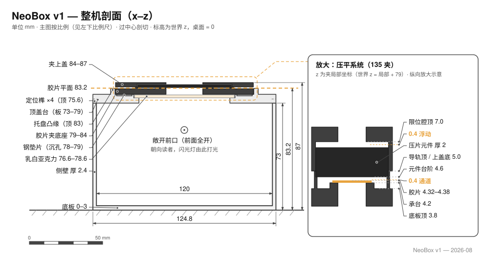
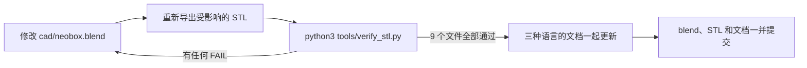

# 设计

[English](design.md) · **简体中文** · [日本語](design.ja.md)

> 工程参考：每一个尺寸从哪里来，哪些数字是光学的、哪些是结构的，改动其中一个会发生什么，以及怎么打开、修改、重新导出并校验 CAD 源文件。

**目录：**[1. 光路](#1-光路) · [2. 尺寸链](#2-尺寸链) · [3. 光学决策](#3-光学决策) · [4. 顶盖台](#4-顶盖台) · [5. 胶片夹](#5-胶片夹) · [6. 壳体](#6-壳体) · [7. 对焦灯](#7-对焦灯) · [8. 闪光灯用法](#8-闪光灯用法) · [9. 复位与重复性](#9-复位与重复性) · [10. 4×5 预留](#10-45-预留) · [11. 使用源文件](#11-使用源文件)

参考闪光灯：一只 **NEEWER TT560** 机顶闪，配一套 **ZENIKO T1** 2.4 GHz 触发器——只是参考，不是前提。闪光灯平躺在箱**外**的桌面上，本文没有任何一个尺寸依赖于它；任何能手动调出力的机顶闪都可以用。

| 约定 | 在本文里的含义 |
|---|---|
| 尺寸 | 单位毫米，一律写成 宽 × 深 × 高（X × Y × Z） |
| `z` | 从桌面起算的绝对高度。箱子直接立在桌面上，所以这也是从主箱外底面起算的高度 |
| 零件自身 z | [§2](#2-尺寸链) 的层高量化表按每个零件自己的打印底面起算——用到的地方会注明 |
| XY 坐标 | 从箱体中心起算，箱体中心也就是透光窗中心 |
| STL 包围盒 | 只在明确写了「STL 包围盒」的地方才是这个含义——它按数值从大到小排序，往往不是 X × Y × Z 的顺序 |
| 数据来源 | 下文每一个数字都读自 `cad/neobox.blend` 或导出的 STL 文件。[§11](#11-使用源文件) 讲了怎么自己去读 |

> [!IMPORTANT]
> 几何在 Blender 里做过尺寸核对，导出的 STL 文件也做过数值校验。**这只箱子从未被打印、装配、拍照或实测过。** 本文里所有性能数字都是设计目标，不是结果：混光余量、≤ 0.28 mm 的压平上限、景深覆盖，全部如此。均匀度没有实测过，本文也没有任何地方声称测过。

---

## 1. 光路



*这套图纸还没有按 v5 重新生成——图上画的仍是上一版（封闭箱体）的结构。以下文字才是权威。*

自桌面向上的叠层：

**闪光灯平躺在桌面 → 完全敞开的前口 → 白色混光腔 120 × 150 × 70 → 顶盖台上的透光窗 62 × 95 → 乳白亚克力 68 × 118 × 2，顶面在 78.6 → 4.6 mm 空气 → 胶片面 z = 83.2。**

闪光灯不在箱子里。它平躺在与箱子同一张桌面上，灯头怼着**敞开前口**——箱体前面根本没有墙——水平向腔内发光。TT560 的发光面是 60 × 45，中心离桌面 31 mm，稳稳落在 70 mm 高的箱口范围之内。

**没有任何光是对着胶片打的。** 透光窗开在混光腔的顶上，与光束成直角，光要在裸白 PLA 壁面上漫反射好几次才走得到窗口——正是这一点让箱子内部成为一个[混光腔](glossary.zh-CN.md#混光腔)（integrating cavity），而不是一盏带灯罩的灯。光从 62 × 95 的窗口射出，再由嵌在顶盖台里的那块[乳白](glossary.zh-CN.md#乳白)（opal）亚克力完成最后一道柔化。

敞开前口就是 v5 的全部架构变化。v4 把闪光灯封在箱内，v4 一切麻烦都由此而来：箱体高度要从灯体厚度推导、要开抽口才够得着出力拨盘、要留过线孔穿线，发布的 STL 也只适配一款闪光灯。灯一出箱，这些全部消失——任何品牌的闪光灯都能用，接收器留在桌面上，信号干净、换电池不碰箱子，抽口、盖板、过线孔和通风问题都不复存在（[§6](#6-壳体)）。代价是环境光可以进入混光腔。这个交换是算过账的，不是装看不见：在同步速度下，闪光脉冲远比室内环境光亮（[§8](#8-闪光灯用法)）。

> [!NOTE]
> **在昏暗的房间里拍摄，并且别让顶灯直射箱口。** 脉冲压过环境光是设计前提，但一盏正对敞开前口的亮灯，是唯一能白白吃掉这个余量的摆法。

---

## 2. 尺寸链

v4 的箱子是从闪光灯推导出来的，那些数字也随它一起作废了。v5 切断了这条线：闪光灯根本不进箱，尺寸链不再从某款产品的规格表开始，而是从桌面开始，一件叠一件，靠重力向上生长。

### 打印件

九个 STL 文件——白色两件、黑色七件，全部免支撑：

| STL | 颜色 | 外形 (mm) | 内容 |
|---|---|---|---|
| `main-body.stl` | 白 | 124.8 × 154.8 × 75.6 | 主箱：底 3.0，左右后三壁 2.4，前面全开；侧壁顶四个定位榫 2.4 × 12 × 2.6 |
| `cover-stage.stl` | 白 | 124.8 × 154.8 × 10.0 | 顶盖台：6 mm 板搁在箱壁上，带透光窗、亚克力暗槽、垫片沉孔和夹座托盘（[§4](#4-顶盖台)） |
| `film-holder-135-base.stl` | 黑 | 94 × 120 × 5 | 135 夹底座：开窗 25 × 37，内侧导轨，外轨带 4.6 元件台阶（[§5](#5-胶片夹)） |
| `film-holder-135-lid.stl` | 黑 | 94 × 120 × 3 | 135 夹上盖：开窗 25 × 37，元件限位腔，8 个磁孔 |
| `film-holder-120-base.stl` | 黑 | 94 × 120 × 5 | 120 夹底座：开窗 57 × 85（整格 6×9），通道宽 62，外轨与台阶和 135 完全相同 |
| `film-holder-120-lid.stl` | 黑 | 94 × 120 × 3 | 120 夹上盖：开窗 57 × 85，其余与 135 上盖一样 |
| `pressure-window-135.stl` | 黑 | 64 × 95 × 2 | 135 压片窗插片（窗 25 × 37） |
| `pressure-window-120.stl` | 黑 | 64 × 95 × 2 | 120 压片窗插片（窗 57 × 85） |
| `mask-6x6.stl` | 黑 | 94 × 80 × 1 | 6×6 遮幅插片（窗 56.5 × 56.5），垫在托盘里 120 底座下方 |

每个零件都是平的那一面朝下打印；两个上盖**顶面朝下**。最大件长 154.8 mm，160 × 160 的打印床就够。层高、摆放方向和切片参数见[打印文档](printing.zh-CN.md)。

### 高度

整个装配就是一摞重力堆叠。世界坐标 z，桌面 = 0：

| 层 | z 范围 | 说明 |
|---|---|---|
| 桌面 | 0 | 闪光灯和箱子立在同一张桌面上 |
| 主箱底板 | 0 – 3.0 | |
| 混光腔 | 3.0 – 73.0 | 内腔 120 × 150 × 70，前面敞开 |
| 顶盖台板 | 73.0 – 79.0 | 6 mm 板搁在壁顶上，台面在 79.0 |
| 乳白亚克力 | 76.6 – 78.6 | 嵌在暗槽里，顶面比台面低 0.4 |
| 钢垫片 | 78.0 – 79.0 | 落在沉孔里，与台面齐平 |
| 托盘凸缘 | 79.0 – 83.0 | 围着夹座的一圈边，高 4 |
| 夹底座 | 79.0 – 84.0 | 立在凸缘围出的台面上 |
| **胶片面** | **83.2** | 承台顶面——两种画幅同一高度 |
| 压片元件 | 83.6 – 85.6 | 插片或防牛顿环玻璃，搁在 4.6 台阶上 |
| 夹上盖 | 84.0 – 87.0 | 装配总高 87 |

### 宽度与深度

主箱外形 124.8 × 154.8；壁厚 2.4，前面敞开，所以内腔是 **120 × 150 × 70**，敞开前口就是内腔完整的 120 × 70 截面。62 × 95 的透光窗居中，窗口边缘到最近箱壁的白壁余量是 **x 方向 29 mm、y 方向 27.5 mm**——这就是混光余量。它是刻意留得宽裕的设计余量；下限没有确定过，也没有任何实测。

### 换用其他闪光灯

没有任何东西需要重新推导。v4 那套把闪光灯规格表换算成箱体高度的公式没有了，因为输入本身没有了：**v5 箱体的任何尺寸都不编码任何闪光灯的任何尺寸。** 替代的闪光灯只需要能手动调出力、灯头能平躺着水平对准敞开前口——TT560 的发光面 60 × 45、中心离桌 31，是参考，不是限制。接收器同样在箱外，触发器的型号也同样自由。换闪光灯既不用动 `cad/neobox.blend`，也不用动 STL（[§11](#11-使用源文件)）。

### 层高量化

**这个设计里每一个打印出来的 z 向特征都是 0.2 mm 的整数倍，暴露的水平台阶一律不低于 0.4 mm——两层。** 每个零件按自己的打印方向量化，从自己的打印底面起算：

| 零件（基准 = 打印底面） | z 特征位 |
|---|---|
| 主箱 | 0 · 3.0 底板顶 · 73.0 壁顶 · 75.6 榫顶 |
| 顶盖台 | 0 · 2.8 榫槽顶 · 3.6 亚克力槽底 · 5.0 垫片孔底 · 6.0 台面 · 10.0 凸缘顶 |
| 夹底座（两幅面同） | 0 · 2.2 磁孔底 · 3.8 板面 · **4.2 承台** · **4.6 元件台阶** · 5.0 导轨顶 |
| 夹上盖（顶面朝下打印） | 0 · 1.0 限位腔顶 · 3.0 盖底——装配坐标 8.0 / 7.0 / 5.0 |
| 插片／遮幅片 | 平板，2.0 ／ 1.0 |

这张网格的意义：在 0.2 mm [层高](glossary.zh-CN.md#层高)下，上面每一个特征位都正好落在层边界上，打印出来的 0.4 台阶就是真正的 0.4，而不是切片软件四舍五入的产物。0.1 mm 也整除这张网格；0.12 和 0.16 不整除。这套推理源自 v4 的胶片夹，原样沿用（[设计日志第 18 条](design-log.zh-CN.md#18-夹子按层高量化)）；v5 的新意在于整个设计都服从它，而不只是夹子。下单打印规格是所有件一律 0.2（[打印文档](printing.zh-CN.md)）。校验脚本对每次导出都强制检查网格和最小台阶（[§11](#11-使用源文件)）。

---

## 3. 光学决策

**最后一道扩散层是一块嵌在顶盖台里的乳白板。** 亚克力（外购件，68 × 118 × 2）落进 69 × 119、深 2.4 的暗槽：四周各 0.5 mm 间隙，顶面比台面低 0.4。因为胶片夹立在台面上，**永远没有东西碰到亚克力**——它是光学层，不是结构层，胶片面的高度全程经由打印塑料传递，从不经过它。要取出来，掀掉夹子，从箱口伸手经透光窗向上一顶。

**亚克力上的灰尘不会成像。** 亚克力本身就是漫射发光面：落在它上面的颗粒是光源的一部分，不是挡在光源和镜头之间的物体，投不出轮廓。定期擦拭即可——不需要每次开工的仪式。（可选玻璃上的灰尘是完全相反的情况，见 [§5](#5-胶片夹)。）

**混光余量。** 窗到壁的余量——x 29、y 27.5——是决定腔体能不能把窗口照匀的数字。它们是刻意留宽的设计余量，没有确定过下限，也没有实测依据。

**腔内全白，而且只能哑光。** 白色 PLA 本身*就是*那层混光面。不要在内部涂装，白色件也不要用丝绸或高光耗材——镜面壁会把灯头复制成一个热点，而不是把它打散。

**亚克力以上的一切都是黑的。** 夹子、插片和遮幅片都用黑色打印，扩散层以上的杂光被吸收，而不是反弹回胶片。可选项：在台面贴一张 A5 黑色植绒贴，消掉最后一点眩光（[物料清单](bom.zh-CN.md)）。

**环境光是被容忍的，不是被封死的。** 敞开前口会放进室内光；设计给出的答案是操作性的——昏暗房间、别让灯直射箱口、快门保持在同步速度——因为剩下那点环境光被脉冲远远压过（[§8](#8-闪光灯用法)）。

**没有任何内部调节件。** 光路里没有反射板、没有挡板、没有调平五金——混光腔就是四面裸白墙，别无他物。每多一个内部零件，就多一样要对齐、也多一样会被碰歪的东西。均匀度用一张做过[平场校正](glossary.zh-CN.md#平场校正)的测试片来验证，平场校正能把镜头暗角和光源本身的不均分开（[装配文档](assembly.zh-CN.md)）。

---

## 4. 顶盖台

顶盖台是 v4 的顶盖和胶片台合并成的一块白色板——过去的一个盖、一块台、三根螺杆、六颗螺母、三颗热熔铜螺母，现在是一个打印件。它直接搁在箱壁顶上，承载混光腔以上的全部光学件。

这一个零件身上带着什么：

- **板体**——124.8 × 154.8，总高 10：6 mm 的结构板，台面落在 z = 79.0。四角榫槽深 2.8，罩住主箱 2.6 高的定位榫，竖向留 0.2 间隙——板搁在壁顶上，永远不压在榫上；榫只负责 XY 定位。
- **透光窗**——62 × 95，居中，贯穿板体。
- **亚克力暗槽**——69 × 119，深 2.4，槽底在 76.6，向台面开口。乳白板从上方落入，顶面比台面低 0.4（[§3](#3-光学决策)）。
- **托盘**——围着 94.6 × 120.6 夹座的一圈凸缘，高 4，顶在 83.0。它给夹子留每边 0.3 mm 的定位间隙，顶面还在比胶片面低 0.2 处托住伸出的片尾（[§5](#5-胶片夹)）。
- **垫片沉孔**——四个，10.6 见方、深 1.0，位于 (±41, ±12)。每孔放入一片 10 × 10 × 1 钢垫片（或 Ø10 × 1 圆片），与台面齐平：给夹底座的磁铁当铁座，夹子啪地吸落在托盘上不再乱动——和 v4 那四片粘上去的垫片干的是同一件事，只是不再用胶。

要挪动它，捏住凸缘一提——整个顶盖台一体离箱。

**没有调平五金，这是设计本身，不是缺漏。** v4 用三根 M6 螺杆把胶片台对着箱体调平；v5 把螺杆、螺母、铜螺母连同那套流程一起删掉了。

<details>
<summary>为什么调平挪到了相机端</summary>

这个设计里塑料从不承担螺纹。FDM 打印的螺纹既弱又会蠕变；v4 已经在用铜螺母加钢螺杆回避它，v5 则连这些都不再需要。

更深一层的原因是：唯一要紧的平行度是**胶片面对传感器**，而对着箱体调平胶片台从来就没有直接给出过这件事——v4 拧完三颗螺母，还是得把相机对着台面摆正。v5 只保留了真正要紧的那一步。在胶片台上放一面小镜子，看着取景器移动相机，直到镜头自己的倒影居中：居中的那一刻，传感器就平行于镜面，也就平行于镜子所躺的胶片面（[装配文档的镜子法](assembly.zh-CN.md#第-7-步相机端调平镜子法)）。

因为镜子躺在整摞打印件的*最终结果*上——底板、箱壁、板体、夹子——它下面的所有打印公差都在这一次对齐里被吸收了。箱子不需要平到某个指标；相机会在胶片面实际所在的位置迎上去。

</details>

---

## 5. 胶片夹

每种画幅一副夹子——夹底座加夹上盖，都是 94 × 120，立在顶盖台的托盘里。换画幅就是掀走一副、放下另一副：磁吸松开再吸合，前后五秒，其余什么都不动。过片是把片条从合着的夹子里抽过去——整卷中途从不开夹。

| 特征 | 135 夹 | 120 夹 |
|---|---|---|
| 外形，两件相同 | 94 × 120 | 94 × 120 |
| 夹底座／夹上盖板厚 | 5 ／ 3 | 5 ／ 3 |
| [开窗](glossary.zh-CN.md#开窗)——底座、上盖与插片同窗 | 25 × 37 | 57 × 85（覆盖 6×9） |
| 走片宽度 | 内轨之间 35.4 | 通道壁之间 62.0 |
| 元件台阶（[见下](#压平系统)） | 高 4.6，位于 x 31 – 32.2 | 完全相同 |
| 磁铁 Ø8 × 2 | 底座 8 颗 + 上盖 8 颗 | 相同 |

**开窗每边刻意比标称画幅大出约 0.5 mm**——135 标称 24 × 36，120 标称 56 × 84——用来吸收不同机身片门的差异和打印机的 XY 公差。最终构图靠后期裁切，见[翻拍扫描的装片](scanning.zh-CN.md#装片)。

### 压平系统

胶片面就是[承台](glossary.zh-CN.md#承托)的顶面——一圈**四边环绕**开窗的窄台——在底座底面以上 4.2。胶片厚 0.12 – 0.18，顶面因此落在 4.32 – 4.38。再往上最近的 0.2 网格位是 **4.6**，而 4.6 恰好就是元件台阶托住任何搁在上面之物底面的高度。这三个数就是整套系统：

**承台 4.2 → 胶片顶 4.32 – 4.38 → 元件底 4.6。**

于是开窗四边的承台上方各有一条 0.4 mm 通道，元件之下的任何位置胶片都有 0.22 – 0.28 mm 的自由起伏量。元件就是你搁在台阶上的那块 64 × 95 × 2 的板——可互换性正来自于此：

- **默认——打印压片窗插片**，每幅面一片。窗口四周一圈硬限位，把边缘起伏压到 ≤ 0.28；开窗正上方胶片虽然无约束，但 1:1、f/8 时景深约 ±0.4 mm，足以覆盖残余的拱起。
- **升级——一片防牛顿环玻璃，64 × 95 × 2，两幅面通用。** 整幅画面连续封顶：任何位置 ≤ 0.28 mm。磨砂（AN）面朝下贴着光亮的片基，不起[牛顿环](glossary.zh-CN.md#牛顿环)；药膜面朝着下方敞开的窗口，不接触任何东西。

**为什么单片玻璃就能凑齐三明治：** 传统玻璃夹片器要两片玻璃，因为没有别的东西来定义叠层的底面。这里的底面是打印出来的——承台在 4.2 处从四边托住胶片——所以顶上加一片玻璃就把三明治合上了：要保持干净的玻璃面少了一半，药膜下方更是一片玻璃都没有。

**为什么一片玻璃能通吃两种画幅：** 两个底座的外轨轮廓完全相同——元件台阶在 x 31 – 32.2、高 4.6，外档在 32.2 – 33.5、高 5.0，负责元件的横向定位——同一个 64 × 95 的座在两个底座里都存在。135 底座上，引导窄片条的内轨（±17.7 – 19.7）会顶住 64 宽的板，所以内轨在 |y| < 48 的中段整个断开，只在两端各留 12 mm 导向段：玻璃从缺口落到台阶上，导向段顺势在长度方向上把它框住。

元件放进去一次，之后就不再碰。过片是捏住伸出夹外的片头直接抽拉；拱起的部位滑过元件底面时被顺势压平。上盖的限位腔——64.8 × 96，顶在 7.0——以 0.4 的浮动余量罩住元件：上盖给它定位，却从不压它，元件的高度始终是台阶打印出来的 4.6，不是压出来的配合。装片方向建议：**玻璃模式拱面朝上**（让玻璃把它压平）；**插片模式拱面朝下**。伸出夹外的胶片搭在托盘凸缘上，凸缘顶比胶片面低 0.2——是托，不是夹；长片条请用手托住尾端。

> [!CAUTION]
> **玻璃底面离焦平面只有 0.2 mm，落在上面的灰尘几乎就在焦点上。** 装玻璃之前把两面都用气吹吹净——这是箱子里唯一会让灰尘成像的表面。亚克力则恰恰相反，天生免疫（[§3](#3-光学决策)）。

**磁铁。** Ø8 × 2 N35，过盈压入——全程无胶——每件 8 颗，两副共 32 颗。底座磁铁凸出板面 0.4；上盖磁铁与盖底齐平；合上后两组磁面相距 0.8，**永不接触**，所以上盖永远坐在打印的导轨顶上，通道高度始终是打印出来的数字，而不是磁铁叠出来的。极性必须配对，让每一对底座–上盖位置都相吸：压入前逐颗与对位磁铁验吸——压进去的磁铁是取不出来的。

**6×6 与 6×4.5。** 拍 6×6 时，把 `mask-6x6.stl`——94 × 80 × 1，窗 56.5 × 56.5——垫进托盘、放在 120 底座*下方*：整副夹子抬高 1 mm，属于正常，重新对焦即可。6×4.5 没有专用遮幅片——后期裁切。

> [!NOTE]
> **装框幻灯片不在支持范围内。** 纸框或塑料框的厚度是 0.4 mm 通道的许多倍，根本进不去。NeoBox 只收裸片条，最大到 6×9。

---

## 6. 壳体

**主箱**——一体打印件：底板 3.0，左、右、后三面壁 2.4，前面根本没有墙。侧壁顶上立着四个定位榫，2.4 × 12 × 2.6，与顶盖台的四角榫槽配合。

**敞开前口删掉了什么。** v4 需要抽口盖板，因为闪光灯的出力拨盘封在不透光的箱子里；需要过线孔，因为线要穿过一面遮光墙；还要回答通风问题，因为热量无处可去。v5 的箱内没有任何需要伸手去够的东西：闪光灯、接收器和它们的电池都在桌面上，改出力抬手就到，对焦灯的线直接从箱口走出去，腔体本身就通着空气。三个问题和那面前墙一起消失了。

**无螺丝、无胶水、无工具。** 整个设计里没有任何螺纹咬进塑料。每一处连接不是榫入槽、就是重力、就是磁吸：顶盖台靠榫定位、靠自重压住，夹子靠磁铁吸在垫片上，上盖靠磁铁吸在底座上，元件靠重力躺在台阶里。磁铁压入，垫片散放。装配就是按顺序往上摞，几分钟完事（[装配文档](assembly.zh-CN.md)）。

> [!NOTE]
> **整台装配的紧固件清单是：零颗螺丝、零滴胶水。** 连 v4 仅剩的两处用胶——夹子磁铁和铁垫片——也没有了：v5 的磁铁是过盈压入的，垫片是落在沉孔里的。

> [!WARNING]
> **重力堆叠不能斜着搬。** 组装态的箱子是对齐的，不是连接的：要么贴着桌面平移，要么拆开来分件搬——顶盖台捏住凸缘一提就整体离箱。

### 特征位置总表

XY 从箱体中心起算，z 从桌面起算。数据读自 `cad/neobox.blend`。

| 特征 | XY | z | 尺寸 |
|---|---|---|---|
| 敞开前口 | 前面 | 3.0 – 73.0 | 内腔完整截面，120 × 70 |
| 定位榫，4 个 | 侧壁顶 | 73.0 – 75.6 | 2.4 × 12 × 2.6 |
| 榫槽，4 个 | 顶盖台底面 | 深 2.8 | 罩榫，竖向留 0.2 间隙 |
| 透光窗 | 居中 | 贯穿板体，73.0 – 79.0 | 62 × 95 |
| 亚克力暗槽 | 居中 | 槽底 76.6，向 79.0 的台面开口 | 69 × 119，深 2.4 |
| 垫片沉孔，4 个 | (±41, ±12) | 78.0 – 79.0 | 10.6 见方，深 1.0 |
| 托盘凸缘 | 围 94.6 × 120.6 夹座 | 79.0 – 83.0 | 一圈边，高 4 |

> [!TIP]
> 榫与榫槽的配合尺寸落在 FDM 的正常误差范围之内：象足、XY 膨胀和翘曲都会吃掉它。顶盖台扣不动或者晃，要改的是切片参数，不是模型文件——见[打印文档里的偏紧偏松处理](printing.zh-CN.md#打紧了或打松了怎么办)。

---

## 7. 对焦灯

可选件：两段 120 mm 的可调光 5 V USB LED 灯带，贴在侧壁内侧——一盏常亮的低亮度定位灯，让你在两次闪光之间看得见画幅。闪光会把它完全压过去，所以不需要每张之间开开关关；一卷拍完再关。

线从敞开前口走出去，线控调光器也留在箱外。**箱内不放任何接市电的东西**——灯带用 USB 充电宝或充电头供电。

---

## 8. 闪光灯用法

只用手动出力、普通同步，拍 [raw](glossary.zh-CN.md#raw)。[TTL](glossary.zh-CN.md#ttl) 测光在这里毫无用处——场景永远不变，出力手动定一次就够——而 [HSS](glossary.zh-CN.md#hss) 解决的问题在[同步速度](glossary.zh-CN.md#同步速度)以内根本不存在。都别为它们花钱。

**闪光脉冲本身就是曝光。** 就算前口敞开，在昏暗房间里，一次同步速度的曝光收进来的环境光与脉冲相比可以忽略，于是闪光自身的持续时间就是等效快门——比任何三脚架能撑住的连续光曝光短几个数量级。振动、快门震动、地面传来的抖动，从此都不再是问题。

**快门速度：推荐 1/125 s。** 焦平面快门的同步速度通常标 1/160 – 1/250，而廉价 2.4 GHz 引闪器的延迟大约要吃掉一档——所以是 1/125。超过真实极限的症状一目了然：画面上一条边缘干净利落的暗带。

> [!IMPORTANT]
> **电子快门通常根本引不了闪。** 按下快门什么都没发生，这是第一个要检查的地方。细节见[翻拍扫描的曝光](scanning.zh-CN.md#曝光)。

改出力抬手就到——闪光灯就躺在你面前的桌上，没有东西要打开，也没有东西会被碰乱。接收器就在它旁边、箱子外面，信号路径干净，换电池什么都不碰。实际使用中，出力靠一张试拍定一次，之后不再动；曝光流程在[翻拍扫描的曝光](scanning.zh-CN.md#曝光)。

---

## 9. 复位与重复性

**两种画幅**的胶片面都固定在 z = 83.2（6×6 遮幅片把 120 那副抬高 1 mm——重新对焦即可，其余不变）。135 和 120 之间变的是需要的放大倍率，因而变的是相机高度——不是胶片的高度。相机高度要用胶片面高度加上镜头的[工作距离](glossary.zh-CN.md#工作距离)算出来，算法在[翻拍扫描的相机高度与支架](scanning.zh-CN.md#相机高度与支架)。

**平行度就是一次对齐：镜子法。** 在胶片台上放一面小镜子，让取景器里镜头自己的倒影居中——传感器随即平行于胶片面，其下整摞零件的打印公差也在同一个动作里被吸收（[装配文档的镜子法](assembly.zh-CN.md#第-7-步相机端调平镜子法)，推理见 [§4](#4-顶盖台)）。这正是箱体上一件调平五金都没有的原因。

相机一旦调好，之后动的是箱子：在桌面上推动箱体来把画幅摆正居中，而不是重新去瞄相机——闪光灯顺手往箱口一靠就位。位置满意之后，把它变成可复现的——在底板上打两个定位销，或者用铅笔描出箱子的轮廓，两种都行——再把每种画幅对应的立柱高度记下来。

**先平行度，后均匀度。** 闪光能冻结振动，却治不好一个与传感器不平行的胶片面。先做镜子法，再拍一张做过[平场校正](glossary.zh-CN.md#平场校正)的测试片检查均匀度。

---

## 10. 4×5 预留

**4×5 的几何还没有推导过。** 这一节给的是方法，不是规格。

如果你想做一台：

1. 透光窗从页片尺寸加余量定出，内腔再由窗口加四周的混光余量定出。v5 的余量——29 和 27.5——是这一台的取值，不是已确立的下限；到 4×5 的尺度要做好迭代的准备，也要预计需要更大的闪光灯才能照满更大的腔体。那个尺寸上的均匀度没有任何实测。
2. 保留压平三明治：四边承台高出板面 0.4，元件台阶再高出承台 0.4，每个 z 向特征都在 0.2 网格上，暴露台阶不低于 0.4（[§5](#5-胶片夹)）。页片是一张一张装的，抽拉过片和导向段这些片条专属的细节不必照搬；承台加元件的原理照搬即可。
3. 敞开前口的架构和无螺丝的重力堆叠原样沿用：要推导的是一只更大的箱子，不是另一种箱子。

---

## 11. 使用源文件

`cad/neobox.blend` 是本仓库里唯一的几何来源。九个 STL 文件都由它生成（图纸尚待按 v5 重新生成），任何绕过 blend 文件、直接改到 STL 上的改动，下一次有人重新导出时就会丢失。

### 打开文件

| 项目 | 值 |
|---|---|
| Blender 版本 | **3.0 或更新。** 文件是 Zstandard 压缩的，3.0 以前的 Blender 根本读不了。文件头记录的最后保存版本是 **Blender 5.2** |
| 单位系统 | 公制，unit scale 0.001，长度单位毫米——**一个 Blender 单位就是一毫米** |
| 场景布局 | 装配体就位建模，z 基准与本文一致：桌面——也就是箱体外底面——为 z = 0。120 那副夹子停放在装配体旁 x = 200 处，6×6 遮幅片停放在 x = 350 处 |

### 集合（collection）树

```
Scene Collection
├── 焦点                       一个 empty，用作视图目标
├── Collection                 Camera、Light——渲染用的脚手架
├── NeoBox_混光箱_TT560定稿     壳体、顶盖台和示意件
├── 胶片夹_135                  135 那副夹子，就位装配
├── 胶片夹_120                  120 那副夹子，停放在 x = 200
└── 打印小件                    6×6 遮幅片，停放在 x = 350
```

### 每个 STL 由哪些对象组成

| STL 文件 | Blender 对象 | 说明 |
|---|---|---|
| `main-body.stl` | `主箱_底3mm`、`主箱_左壁`、`主箱_右壁`、`主箱_后壁` | **四个对象**：底板、左壁、右壁、后壁——前面敞开，不再需要门楣和前柱 |
| `cover-stage.stl` | `顶盖台一体_窗62x95` | 顶盖台，一体件，窗 62 × 95 |
| `film-holder-135-base.stl` | `135夹_底座_94x120_平底` | 135 夹底座，平底 |
| `film-holder-135-lid.stl` | `135夹_上盖_94x120` | 135 夹上盖 |
| `film-holder-120-base.stl` | `120夹_底座_94x120_平底` | 120 夹底座，平底 |
| `film-holder-120-lid.stl` | `120夹_上盖_94x120` | 120 夹上盖 |
| `pressure-window-135.stl` | `压片窗插片_135_64x95x2` | 135 压片窗插片 |
| `pressure-window-120.stl` | `压片窗插片_120_64x95x2` | 120 压片窗插片 |
| `mask-6x6.stl` | `6x6插片_94x80x1` | 6×6 遮幅插片 |

### 哪些是示意件，绝不能导出

场景里其余的一切都是看装配关系和光路用的示意件，一件也不打印、不导出：闪光灯灯体和它的发光面、T1 接收器、两条候选位置的 LED 灯带、四支光路箭头、135 和 120 的胶片示意条、乳白亚克力、防牛顿环玻璃、四片钢垫片、一个文字标签，以及相机／灯光／视图目标这些脚手架。

> [!CAUTION]
> **材质名不代表耗材颜色。** 材质槽是为渲染服务的——比如 `NB_alu` 就是已删除的 v4 铝制胶片台留下的残余。颜色一律以[打印文档的九个零件](printing.zh-CN.md#九个零件)为准，绝不要看材质槽。

### 导出约定

每个 STL 都是**按装配体的世界坐标**导出的——导出过程中没有任何归零或改向。

| 文件 | 它在导出文件里所处的位置 |
|---|---|
| `main-body.stl` | z 0 – 75.6，XY 居中 |
| `cover-stage.stl` | z 73 – 83，XY 居中 |
| `film-holder-135-base.stl` ／ `-lid.stl` | z 79 – 84 ／ 84 – 87，在装配位上 |
| `pressure-window-135.stl` | z 83.6 – 85.6，在装配位上 |
| `film-holder-120-base.stl` ／ `-lid.stl` | 停放在 x 153 – 247，z 0 – 5 ／ 5 – 8 |
| `pressure-window-120.stl` | 停放在 x 168 – 232，z 4.6 – 6.6 |
| `mask-6x6.stl` | 停放在 x 303 – 397，z 0 – 1 |

切片软件是按包围盒把文件落到打印床上的。九个文件里有七个导入时就已经打印面朝下躺平；两个夹上盖不是——它们要**顶面朝下**打印，导入后必须翻面。每个零件需要转多少，写在[打印文档的九个零件](printing.zh-CN.md#九个零件)那一节的零件卡片上。

### 重新导出

一条命令再生成全部九个文件。它就是产出已发布 STL 的那套管线的入库版本，也是唯一受支持的导出方式：

```
blender --background cad/neobox.blend --python tools/export_stl.py
```

（`blender` 指你 Blender 安装目录里的可执行文件，4.x／5.x 都可以。在仓库根目录运行，跑完接着 `python3 tools/verify_stl.py`。）

这个脚本之所以必要，是因为可打印零件都是**用互相嵌入的壳体建模的**——刻意互相咬进 0.2 – 0.5 mm：墙体沉入箱底、凸缘沉入顶盖台板、导轨沉入夹底座。这样源文件才能保持参数化、容易修改。脚本对每个输出文件做的是：复制源对象、按松散壳体拆分、用 EXACT 求解器把壳体布尔并集成单一实体、焊掉布尔残渣、自检水密，再按装配体世界坐标导出——场景本身自始至终不被改动。直接 File → Export → STL 导出原始对象，得到的是多壳体文件，其内部假面过不了校验脚本的层高网格检查。

再生成的文件与已发布文件**逐字节比可能不同**（三角剖分在 Blender 版本之间并不稳定），但几何完全一致。裁判是校验脚本：外形、水密、层高网格、最小台阶四项全过才算数。

<details>
<summary>手动导出（跑不了脚本时的后备）</summary>

1. **选中一个输出文件对应的对象**，照上面的映射表来。*检查点：*选中的对象数量和表里对得上——主箱四个，其余每个文件一个。
2. **每个零件都要合成单一实体——不只是主箱。** 单对象的零件内部同样可能是多壳体。该 join 的 join，按松散块拆分后做布尔并集，再按距离合并顶点（0.02 mm）、跑一次 1° 的有限溶解清掉布尔残渣。*检查点：*零件是一层连通的壳，校验脚本报告没有非流形边。
3. **导出。** File → Export → STL，勾 *Selection Only*，scale 1.00，forward Y，up Z。不要做任何坐标轴转换：文件里的数字必须和 Blender 里的数字一致。*检查点：*把文件重新导入，零件正好回到原来的位置。
4. **写回原路径**，`stl/white-pla/` 或 `stl/black-pla/` 下面，文件名不变。*检查点：*`git status` 显示的是一个被修改的文件，不是一个新文件。
5. **提交之前先校验。** *检查点：*`python3 tools/verify_stl.py` 打印 `all 9 files pass` 并以 0 退出。

</details>



### 运行校验脚本

`tools/verify_stl.py` 是纯 Python 3，没有任何依赖。在仓库根目录运行：

```
python3 tools/verify_stl.py
```

它会遍历 `stl/` 下的每一个 `.stl`，对每个文件检查四条不变量：

| 检查项 | 它保证什么 |
|---|---|
| watertight | 每条边恰好被两个三角面共用——闭合实体，没有破洞 |
| layer grid | 每个水平面都落在该零件自身基准面以上 0.2 mm 的整数倍处 |
| minimum step | 没有低于 0.4 mm 的暴露水平台阶，也就是 0.2 层高下的两层 |
| bounding box | 零件的实际尺寸仍然和文档写的一致 |

找台阶时会忽略小于 1 mm² 的水平面，这样建模留下的碎片不会误报。输出是每个文件一行加一个合计，只要有任何一项失败退出码就非零，所以这个脚本可以用来卡提交：

```
ok    film-holder-120-base.stl  [94.0, 120.0, 5.0]  256 triangles
...
all 9 files pass
```

对外公布的包围盒数据存在脚本顶部的 `EXPECTED` 表里，按数值从大到小排序。**如果你是有意改动了某个已公布的尺寸，请在同一个 commit 里改 `EXPECTED`**——否则你想改的那个零件会检查失败，而你没打算改的那个零件反倒悄悄通过了。

### 换闪光灯

在 v4，这个标题下面是一份重新推导的清单。在 v5，没有任何东西需要改：**箱体的任何尺寸都不编码闪光灯**，换一只闪光灯——或者换一套触发器——既不碰 `cad/neobox.blend` 也不碰 STL。新闪光灯只要能手动调出力、灯头能平躺着水平对准敞开前口；换完重拍一张测光试片，继续干活（[§8](#8-闪光灯用法)）。

### `cad/` 里的其他文件

- `film-stage-aluminium-3mm.dxf`——v4 的铝制胶片台，只作历史保存。v5 没有胶片台：这个零件已并入顶盖台，现在的设计里没有任何东西按它切。
- `legacy-plywood/`——胶合板版本留下的 DXF，只作历史保存。这两个文件加起来也描述不出一个完整的壳体，现在的设计里没有任何零件是按它们切的。

贡献规则——哪些是源文件、哪些是生成物，以及三语同步的要求——在 [CONTRIBUTING.md（英文）](../CONTRIBUTING.md#source-of-truth-vs-generated-files)。

---

← [术语表](glossary.zh-CN.md) · [文档索引](../README.zh-CN.md#文档) · [设计日志](design-log.zh-CN.md) →
