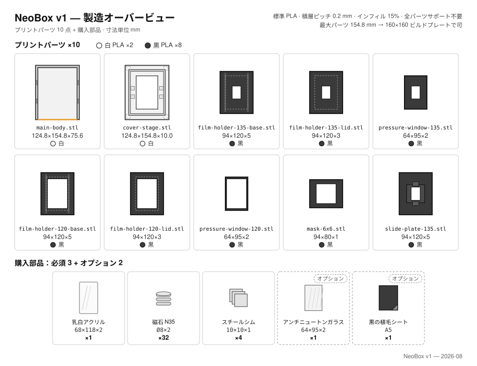
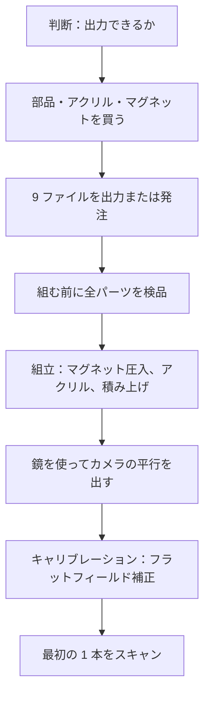

# はじめに

[English](getting-started.md) · [简体中文](getting-started.zh-CN.md) · **日本語**

> お金を使う前に読んでください。NeoBox とは何か、自分に作れるのか、すでに何を持っている必要があるのか、いくらかかり、どれだけ時間がかかり、どの順番で進めるのか。

**目次：** [このプロジェクトはあなた向きか](#このプロジェクトはあなた向きか) · [カメラスキャンとは](#カメラスキャンとは) · [すでに持っている必要があるもの](#すでに持っている必要があるもの) · [費用と所要時間](#費用と所要時間) · [ロードマップ](#ロードマップ) · [必要なスキル](#必要なスキル) · [よくある質問](#よくある質問) · [用語を調べる場所](#用語を調べる場所)

---

## このプロジェクトはあなた向きか

NeoBox は、カメラの下に置いて 135 判と 120 判（最大 6×9）のネガを撮影する、すなわち[カメラスキャン](glossary.ja.md#カメラスキャン-camera-scanning) (camera scanning) するための、3D プリント可能なストロボ光源ボックスです。組み上がった状態で設置面積 124.8 × 154.8 mm、高さ 87 mm。床ではなく、机の上に収まるサイズです。

素のクリップオンストロボは机の上に寝かせ、発光部を筐体の**完全に開いた前面（オープンフロント）**に突き当てて、内部へ水平に発光させます。フィルムに向いている光は 1 本もありません。光は白い[拡散チャンバー](glossary.ja.md#積分キャビティ-integrating-cavity) (integrating cavity) の壁で何度も拡散反射したあと、62 × 95 mm の採光窓と、フィルム直下の[乳白](glossary.ja.md#乳白-opal) (opal) アクリル[拡散板](glossary.ja.md#拡散板-diffuser)を通って、上向きに抜けていきます。前面が開いているぶん室内光も入るので、薄暗い部屋で作業し、天井照明が開口部に直接差し込まないようにしてください。閃光の光量は室内光よりはるかに大きいので、それで足ります。

構成は聞いた印象よりも小さくまとまっています。

- **プリントパーツ 9 点**（白 2 点・黒 7 点）。STL 9 ファイルはすべてサポート不要で、平らな面を下にして出力します。
- **乳白アクリル拡散板 1 枚**、68 × 118 × 2 mm。天板ステージのポケットに落とし込むだけ。
- **マグネット 32 個と鉄ワッシャー 4 枚**：Ø8 × 2 mm の N35 円板をフィルムホルダーの各パーツに圧入し、10 × 10 × 1 mm のワッシャーを天板ステージに面一で沈めます。
- **ねじなし、ねじ山なし、接着なし、工具なし。** 筐体は重力とマグネットだけで組み上がり、水平出しは箱ではなくカメラ側で行います。

> [!IMPORTANT]
> これは最初の公開リリースです。形状は Blender ソース上で寸法検証済みで、STL 9 ファイルはいずれも水密な単一ソリッド、すべての水平面が 0.2 mm グリッドに乗っています。ただしこの形状の箱は、**まだ一度も出力も撮影も実測も均一性テストもされていません。** あなたが作れば、あなたが最初の 1 人です。

**作るべき人。** すでにフィルムで撮っていて、スタンドに載せられるカメラを持っている人。振動が問題にならない[ベース ISO](glossary.ja.md#ベース-iso) (base ISO)・f/8 の撮影がしたい人。パーツ 9 点の出力とマグネットの圧入が苦にならない人。締める・はんだ付けする・接着する作業は一切ありません。

**やめておくべき人。** 3D プリンタも出力サービスも使えない人。構造部品はすべてプリントで、公開ファイルに代替ルートはありません。4×5 が必要な人と、フィルムがスライドマウントに入っている人も対象外です。どちらも非対応なので、[よくある質問](#よくある質問)を参照してください。

> [!WARNING]
> **ビルドプレートの事前確認。** 最大の 2 点 `main-body.stl` と `cover-stage.stl` の設置面積はどちらも 124.8 × 154.8 mm。160 × 160 mm の[ビルドプレート](glossary.ja.md#ビルドプレートのサイズ-bed-size)があれば全パーツを出力でき、いまどきのデスクトップ機ならまず足ります。サポートはどのパーツにも不要で、向きのルールはただ 1 つ、ホルダーの蓋 2 点だけは天面を下に、それ以外は平らな底面を下にして出力します。160 × 160 mm に届かない場合は、ほかにお金を使う前に外注のあてを付けてください。

お金を動かす前に確定させることが 3 つあります。

- [ ] 設置面積 124.8 × 154.8 mm のパーツを自分で出力できるか、出力してもらえるか。要は、160 × 160 mm のビルドプレートに手が届くかどうか。
- [ ] **マニュアル発光**できるクリップオンストロボを、持っているか、これから買うか。メーカーは問いません。箱の外に置くだけです。
- [ ] マクロ撮影できるレンズと、箱の真上でカメラをフィルム面と平行に保持できるものを持っているか。

3 つとも「はい」なら[部品表](bom.ja.md#工具と消耗品)へ進んでください。1 つ目が「いいえ」なら、ここで終わりです。

## カメラスキャンとは

カメラスキャンとは、ネガをスキャナに通す代わりに、背面から照らしたネガをデジタルカメラで撮影することです。フィルムは均一に光る面の上のホルダーに収まり、カメラは真上から見下ろし、撮影した [RAW](glossary.ja.md#raw) ファイルを後から[反転](glossary.ja.md#反転-inversion) (inversion) させます。

フラットベッドスキャナと比べた場合のトレードオフは、セットアップの手間と引き換えに速度を得ることです。リグを合わせ込むのに一晩かかりますが、それ以降は 1 コマがシャッター 1 回です。ラボスキャンと比べると、ネガは手元に残り、色の判断はすべて自分の側に残ります。

NeoBox が担当するのは、そのうち光源側の半分だけです。ライトパッドを置き換えるものであって、どのカメラを使うかについては何も言いません。ただしカメラ側は本当に作業量があり、それは[スキャン](scanning.ja.md#カメラ側の機材)ドキュメントに書いてあります。

## すでに持っている必要があるもの

以下にプリントパーツはありません。ストロボとトリガーは参考機種として[部品表](bom.ja.md#工具と消耗品)に載っていますが、それ以外はあらかじめ持っている必要があり、本プロジェクトでは金額を出しません。

| 必要なもの | なぜ必要か | 費用 |
|---|---|---|
| マニュアル露出と RAW が使えるカメラ | 露出は手で決め、1 本のあいだ一度も変えないため | 本書では算定しない |
| マクロ撮影できるレンズ | フルサイズのセンサーを 135 のコマで埋めるには[撮影倍率](glossary.ja.md#撮影倍率-magnification-ratio) (magnification ratio) 1:1 が要る。1:1 マクロなら本機が扱う全フォーマットをカバーでき、大きいフォーマットほど倍率は低くて済む | 本書では算定しない |
| [複写スタンド](glossary.ja.md#複写スタンド-copy-stand) (copy stand)、または水平・反転できるセンターポールを持つ三脚 | フィルム面は箱の設置面から 83.2 mm 上に来る。カメラはその上に、フィルム面と平行に構える必要がある | 本書では算定しない |
| マニュアル発光できるクリップオンストロボ | 光源そのもの。机に寝かせて発光部を開口部に当てるだけで、箱の中には入らない。メーカーは問わず、NEEWER TT560 は参考機種にすぎない | 部品表を参照 |
| ラジオトリガーのセット | 送信機はカメラのホットシューに。受信機はストロボと一緒に箱の外に残るので、電波が筐体に遮られず、電池交換で箱に触れる必要もない。参考機種：ZENIKO T1 | 部品表を参照 |
| リモートレリーズ | コマとコマのあいだ、カメラに手を触れないため | 本書では算定しない |
| 反転ソフトウェア | 撮影した RAW をポジに変えるため | 本書では算定しない |
| ブロアーと小さな平面鏡 | ブロアーはフィルムと（使うなら）ガラスをホコリから守る。平面鏡は水平出しの道具そのもので、鏡に映るレンズ自身の像を中央に合わせて使う | [部品表](bom.ja.md#工具と消耗品)に一覧 |

> [!NOTE]
> カメラ側は意図的に値段を出していません。マクロレンズとスタンドは、すでに持っていれば 0 円、そうでなければプロジェクトの残り全部より高くつくこともあります。ここで金額を書いても、根拠のない数字をでっち上げるだけです。大事なのは、部品を発注する前にそれらが手元にあることです。

ストロボが使えるかどうかを決めるのは、**マニュアル発光できるか**、その 1 点だけです。本体の寸法は関係なく、発光部が回る必要もありません。開口部の前に寝かせるだけだからです。[TTL](glossary.ja.md#ttl-through-the-lens-調光) も [HSS](glossary.ja.md#hss-ハイスピードシンクロ) もここでは無意味なので、そこにお金を払わないでください。

## 費用と所要時間

価格はすべて[部品表](bom.ja.md#工具と消耗品)にまとめてあります。このページでは支出を仕分けるだけです。

| 何を買うのか | 費用 |
|---|---|
| 構造にかかわるすべて：PLA プリントパーツ 9 点、乳白アクリル、マグネット 32 個、鉄ワッシャー 4 枚 | 部品表に記載 |
| クリップオンストロボ（マニュアル発光できるホットシュー機ならどれでも） | 参考機種を部品表に記載 |
| ラジオトリガーのセット | 参考機種を部品表に記載 |
| オプション：アンチニュートンガラス、植毛シート | 部品表に記載 |
| カメラ、レンズ、スタンド、レリーズ、ソフトウェア | 本書では算定しない |

出力は小さな仕事です。154.8 mm より長いパーツはなく、普通の PLA で足り、全パーツがサポート不要で、積層ピッチ 0.2 mm、インフィル 15% です。

| 工程 | 目安の所要時間 | 備考 |
|---|---|---|
| 3D プリント（自宅または出力サービス） | 数日 | ほぼ必ずクリティカルパス。2 色構成、サポートの除去なし |
| 乳白アクリルの指定寸法カット | 数日 | 68 × 118 × 2 mm の指定カット。プロトタイプ時代の 110 × 130 mm 板があれば、切り直して使い回せる |
| マグネットと鉄ワッシャー | たいてい最初に届く | すべて規格品で、特注はなし |
| 組立 | 数分 | 工具不要。作業の大半はマグネット 32 個の圧入 |
| 最初のセットアップ | 一晩 | 鏡でカメラの平行出し、そのあと均一性の確認 |

> [!TIP]
> 3 つの発注はリードタイムがまったく違うので、順番にではなく同じ日にまとめて出してください。クリティカルパスはほぼ必ず出力です。

## ロードマップ

| ステップ | 実際にやること | 解説ドキュメント |
|---|---|---|
| 判断 | ビルドプレートのサイズ（160 × 160 mm で足りる）、ストロボの有無、すでに持っているもの | このページ |
| 購入 | 部品と消耗品、発注用の文面、到着時の受け入れ検査 | [部品表](bom.ja.md#工具と消耗品) |
| 出力 | STL 9 ファイルを普通の PLA で出力。[積層ピッチ](glossary.ja.md#積層ピッチ-layer-height) 0.2 mm、インフィル 15%、サポートなし | [出力](printing.ja.md#出力サービスへの発注) |
| パーツ検品 | 組む前に測る。いま見つかった不良は再出力で済むが、後で見つかると組立ごとやり直しになる | [出力](printing.ja.md#組み立てる前に各パーツを確認する) |
| 組立 | マグネット 32 個をホルダーのパーツに圧入し、アクリルとワッシャーを天板ステージに収め、全体を積み上げる。工具は使わない | [組立](assembly.ja.md#組立手順) |
| 平行出し | フィルム面に小さな鏡を置き、レンズ自身の映り込みが中央に来るまでカメラを動かす。調整するのはカメラで、箱ではない | [組立](assembly.ja.md#ステップ-7--カメラ側で平行を出す鏡の方法) |
| キャリブレーション | フィルムなしの発光面を撮影し、まず[フラットフィールド補正](glossary.ja.md#フラットフィールド補正-flat-field-correction) (flat-field correction) をかけてから均一性を判断する | [撮影](scanning.ja.md#フラットフィールド補正と反転) |
| 最初の 1 本 | カメラの高さ、ピント、発光量、フィルムの装填、撮影、反転 | [スキャン](scanning.ja.md#フィルムの装填) |
| うまくいかないとき | 症状 → 原因の候補 → 対処。全工程分 | [トラブルシューティング](troubleshooting.ja.md#プリント) |

## 必要なスキル

特別なものは何もありません。スライサーのデフォルトプロファイルに従えて、フィルムのまわりで手を清潔に保てるなら作れます。ドライバーもスパナもはんだごても接着剤も出番がなく、CAD 作業も一切不要です。設計は特定のストロボ機種に縛られていません。

つまずきやすいのは 2 か所だけで、どちらもそこに到達する前に 2 回読んでおく価値があります。

**マグネットの極性。** Ø8 × 2 mm のマグネット 32 個を、1 パーツあたり 8 個ずつ圧入します。どのマグネットも相手側パーツのマグネットと引き合う向きでなければならず、圧入は抜き戻すことを想定した嵌合ではありません。押し込む前に、すでに収めた相手側と極性を必ず突き合わせてください。

**平行出し。** フィルム面は水平であれば足りるのではなく、センサーと**平行**でなければなりません。しかもこの設計では、箱の側に調整機構はありません。フィルムの位置に小さな平面鏡を置き、レンズ自身の映り込みが画面のど真ん中に来るまでカメラを動かします。中央に来た瞬間、センサーはフィルム面と平行になり、その下にあるプリントパーツの公差もまとめて吸収されています。平行が先、均一性が後です。

なぜ連続光の LED パネルではなくストロボを設計の中心に据えたのか

閃光パルスこそが露光です。薄暗い部屋なら、拡散チャンバーを経て届く閃光の光量は、開いた前面から入る室内光を圧倒します。しかもパルスは実シャッター時間のほんの一瞬で終わるので、振動もシャッターショックも床の揺れも、関係がなくなります。

利点はそれだけではありません。全コマがまったく同じ光量を受けるので、反転プロファイルは 1 本のロールに 1 つで済みます。ベース ISO・f/8 という動作点も、キセノン管が出す本当に連続したデイライトバランスのスペクトルも、ストロボを選んだからこそのものです。

## よくある質問

**誰かが実際に作ったのですか。** いいえ。v1 の形状は CAD 上で寸法検証済み、書き出したファイルも数値検証済みですが、この形状の箱は 1 台も出力も撮影も実測も均一性テストもされていません。出力されたことがあるのは旧プロトタイプだけで、v1 と共通する部品はほぼありません。光学に関する記述はすべて、実測ではなく筋の通った推論として読んでください。

**ストロボの代わりに LED パネルを使えますか。** 公開ファイルのままでは使えません。LED 版は公開しておらず、採用しなかった理由は上の折りたたみブロックにあります。部品表のオプション LED ストリップはポジションライトであって、露光用の光源ではありません。

**手持ちのストロボは入りますか。** 使えます。そもそも箱に入れないからです。ストロボは机に寝かせ、発光部を完全に開いた前面に当てるだけなので、本体の寸法は一切関係ありません。マニュアル発光できるクリップオンストロボならどれでも使えます。NEEWER TT560 は、光路設計の基準にした参考機種にすぎません。

**マグネットは必要ですか。** 必要です。32 個全部と、鉄ワッシャー 4 枚もです。各蓋の 8 個が各ベースの 8 個と引き合ってホルダーを閉じ、ベース側のマグネットは天板ステージに面一で沈めたワッシャーもつかみます。ホルダーがステージに固定されるのも、5 秒でフォーマットを入れ替えられるのも、この磁力のおかげです。なければ、すべてが自重で載っているだけになります。

**220 × 220 mm のビルドプレートで出力できますか。** できます。全パーツ、余裕をもって収まります。設置面積が 124.8 × 154.8 mm を超えるパーツはないので 160 × 160 mm でも足り、サポートが要るパーツもありません。

**アンチニュートンガラスは必要ですか。** いいえ。標準の押さえはフォーマットごとの押さえ窓インサート（プリント品）です。窓の四辺が固い規制面になり、フィルムの浮き上がりは最大でも 0.28 mm で、等倍・f/8 での被写界深度およそ ±0.4 mm に完全に収まります。1 枚で両フォーマット共通のアンチニュートンガラス（64 × 95 × 2 mm）はアップグレードで、画面全体を連続して押さえます。すりガラス面がフィルムベースの光沢面に接するため[ニュートンリング](glossary.ja.md#ニュートンリング-newton-rings)は出ず、乳剤面は下の開口に向くので何にも触れません。

> [!CAUTION]
> ガラスを使う場合、ガラス下面は焦点面から 0.2 mm しか離れていないので、そこに付いたホコリはそのまま写ります。エレメントは一度収めたら動かしません。収める前にブロアーで吹いてください。対照的に、乳白アクリルの上のホコリは決して写りません。発光面そのものの上にあるからで、ときどき拭けば十分です。

**4×5 は使えますか。** いいえ。フィルム窓は 135 用が 25 × 37 mm、120 用が 57 × 85 mm（6×9 がまるごと 1 コマ）で、ホルダー自体も 94 × 120 mm しかありません。公開ファイルにシートフィルムを扱えるものはありません。

**マウント済みスライドは使えますか。** いいえ。135 用の通路は高さ 0.4 mm、素のフィルムストリップ用の寸法です。マウントに入ったスライドは入りません。マウントなしのポジフィルムは問題ありません。

**コマ送りとフォーマットの切り替えはどうやるのですか。** コマ送りは引き抜きです。ホルダーから出ているフィルムの先端をつまんで、そのまま引きます。押さえエレメントの下をすべる間にフィルムの反りは押しならされ、1 本撮り終えるまでホルダーを開けることはありません。フォーマットの切り替えは、ホルダーを持ち上げて別のホルダーを載せるだけ。マグネットが位置を決めてくれるので 5 秒ほどです。6×6 はマスクを 120 ベースの下に敷きます。ホルダー全体が 1 mm 持ち上がりますが、それで正常です。6×4.5 専用のマスクはないので、後処理でトリミングしてください。長いストリップの後端はトレイのフランジに載り、フィルム面よりわずかに低い位置で支えられるので、先のほうには手を添えてください。装填と取り扱いは[スキャン](scanning.ja.md#フィルムの装填)で扱います。

## 用語を調べる場所

このプロジェクトは、フィルム写真・光学・FDM 出力という 3 つの分野の語彙を大量に使い、しかも 1 つの文の中で混ぜます。どの用語も[用語集](glossary.ja.md#カメラスキャン-camera-scanning)に 1 行ずつ、一度だけ定義してあります。

言葉に引っかかったら、まずそこを見てください：[拡散チャンバー](glossary.ja.md#積分キャビティ-integrating-cavity)、[フラットフィールド補正](glossary.ja.md#フラットフィールド補正-flat-field-correction)、[同調速度 (sync speed)](glossary.ja.md#同調速度-sync-speed)、[ガイドナンバー](glossary.ja.md#ガイドナンバー-gn)、[サポート (supports)](glossary.ja.md#サポート-supports)、[積層ピッチ](glossary.ja.md#積層ピッチ-layer-height)、[ワーキングディスタンス (working distance)](glossary.ja.md#ワーキングディスタンス-working-distance)、[ニュートンリング](glossary.ja.md#ニュートンリング-newton-rings)、[ベース ISO](glossary.ja.md#ベース-iso)、[EV](glossary.ja.md#ev-露出値)。

寸法そのものではなく、その寸法に至った理由を知りたいときは、[設計](design.ja.md#3-光学上の判断)ドキュメントに工学的な根拠が、[設計ログ](design-log.ja.md#設計ログ)に試して却下した案の記録があります。

---

← [README](../README.ja.md) · [ドキュメント一覧](../README.ja.md#ドキュメント) · [部品表](bom.ja.md) →
