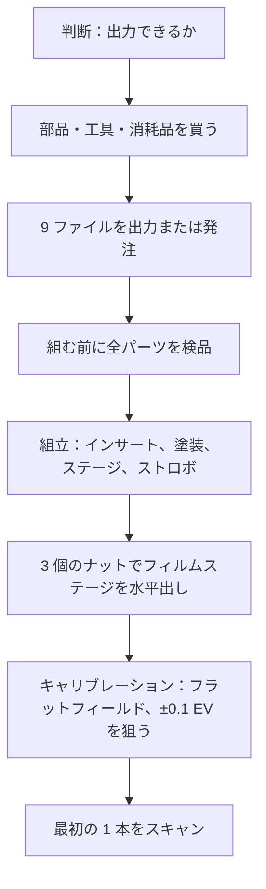

# はじめに

[English](getting-started.md) · [简体中文](getting-started.zh-CN.md) · **日本語**

> お金を使う前に読んでください。NeoBox とは何か、自分に作れるのか、すでに何を持っている必要があるのか、いくらかかり、どれだけ時間がかかり、どの順番で進めるのか。

**目次：** [このプロジェクトはあなた向きか](#このプロジェクトはあなた向きか) · [カメラスキャンとは](#カメラスキャンとは) · [すでに持っている必要があるもの](#すでに持っている必要があるもの) · [費用と所要時間](#費用と所要時間) · [ロードマップ](#ロードマップ) · [必要なスキル](#必要なスキル) · [よくある質問](#よくある質問) · [用語を調べる場所](#用語を調べる場所)

---

## このプロジェクトはあなた向きか

NeoBox は、カメラの下に置いて 135 判と 120 判（最大 6×9）のネガを撮影する——[カメラスキャン](glossary.ja.md#カメラスキャン-camera-scanning) (camera scanning) する——ための、3D プリント可能なストロボ光源ボックスです。完成した筐体は 208 × 273 × 96 mm（幅 × 奥行 × 高さ）、容積は約 5.4 L。

素のクリップオンストロボを箱の底に寝かせて置き、奥の壁に向けて水平に発光させます。フィルムに向けて光を当てるものは何もありません。光は白い[拡散チャンバー](glossary.ja.md#積分キャビティ-integrating-cavity) (integrating cavity) の中で数回拡散反射したあと、フィルムホルダーの真下にある 1 枚の[乳白](glossary.ja.md#乳白-opal) (opal) アクリル[拡散板](glossary.ja.md#拡散板-diffuser)を通ってはじめて届きます。

構成は聞いた印象よりも小さくまとまっています。

- **標準構成でプリントパーツ 8 点。** オプションの 6×6 マスクを含めて、STL は合計 9 ファイル。
- **乳白アクリル拡散板 1 枚**、110 × 130 × 2 mm。フィルムステージの上に載せるだけ。
- **M6 寸切りボルト 3 本、ナット 6 個、インサートナット 3 個。** ほかに EVA フォーム、グロメット 2 個、USB LED ストリップ。
- **構造用の接着剤はどこにも使わず、筐体を留めるねじも 1 本もありません**——天板は上から載せるだけです。

> [!IMPORTANT]
> これはプロトタイプ公開です。形状は Blender ソース上で寸法検証済みで、STL 9 ファイルはいずれも水密な単一ソリッド、すべての水平面が 0.2 mm グリッドに乗っています。ただしこの箱は、**まだ一度も出力も撮影も実測も均一性テストもされていません。** あなたが作れば、あなたが最初の 1 人です。

**作るべき人。** すでにフィルムで撮っていて、スタンドに載せられるカメラを持っている人。振動が問題にならない[ベース ISO](glossary.ja.md#ベース-iso) (base ISO)・f/8 の撮影がしたい人。パーツ 8 点を出力してナット 6 個を回すのが苦にならない人。

**やめておくべき人。** 3D プリンタも出力サービスも使えない人——構造部品はすべてプリントで、公開ファイルに代替ルートはありません。4×5 が必要な人と、フィルムがスライドマウントに入っている人も対象外です。どちらも非対応なので、[よくある質問](#よくある質問)を参照してください。

> [!WARNING]
> **ビルドプレートの可否判定。** 最大の 2 点には、最低でも 280 × 300 mm の出力可能領域が必要です。書き出したままの `main-body.stl` は STL バウンディングボックスで 273 × 208 × 92 mm、`top-cover.stl` は 279.6 × 214.6 × 14 mm——効いてくるのは本体ではなく天板のほうです。220 × 220 mm や 256 × 256 mm の機種（Bambu X1C/P1S、Prusa MK4）では、**この 2 点はどちらも出力できません。** その 2 点だけ外注するか、残り 7 点を自宅で出力してください。何よりも先に、[ビルドプレートのサイズ](glossary.ja.md#ビルドプレートのサイズ-bed-size)がこれを決めます。

お金を動かす前に確定させることが 3 つあります。

- [ ] 279.6 × 214.6 mm の設置面積を持つパーツを、自分で出力できるか、出力してもらえるか。
- [ ] **マニュアル発光**でき、発光部が 90° 回るクリップオンストロボを、持っているか、これから買うか。
- [ ] マクロ撮影できるレンズと、箱の真上でカメラをフィルム面と平行に保持できるものを持っているか。

3 つとも「はい」なら[部品表](bom.ja.md#工具と消耗品)へ進んでください。1 つ目が「いいえ」なら、ここで終わりです。

## カメラスキャンとは

カメラスキャンとは、ネガをスキャナに通す代わりに、背面から照らしたネガをデジタルカメラで撮影することです。フィルムは均一に光る面の上のホルダーに収まり、カメラは真上から見下ろし、撮影した [RAW](glossary.ja.md#raw) ファイルを後から[反転](glossary.ja.md#反転-inversion) (inversion) させます。

フラットベッドスキャナと比べた場合のトレードオフは、セットアップの手間と引き換えに速度を得ることです。リグを合わせ込むのに一晩かかりますが、それ以降は 1 コマがシャッター 1 回です。ラボスキャンと比べると、ネガは手元に残り、色の判断はすべて自分の側に残ります。

NeoBox が担当するのは、そのうち光源側の半分だけです。ライトパッドを置き換えるものであって、どのカメラを使うかについては何も言いません——ただしカメラ側は本当に作業量があり、それは[スキャン](scanning.ja.md#カメラ側の機材)ドキュメントに書いてあります。

## すでに持っている必要があるもの

以下はどれもプロジェクトに含まれず、CNY 250–420 のビルド費用にも含まれていません。

| 必要なもの | なぜ必要か | 費用 |
|---|---|---|
| マニュアル露出と RAW が使えるカメラ | 露出は手で決め、1 本のあいだ一度も変えないため | 本書では算定しない |
| マクロ撮影できるレンズ | フルサイズのセンサーを 135 のコマで埋めるには[撮影倍率](glossary.ja.md#撮影倍率-magnification-ratio) (magnification ratio) 1.0× が要る。1:1 マクロなら本機が扱う全フォーマットをカバーでき、大きいフォーマットほど倍率は低くて済む | 本書では算定しない |
| [複写スタンド](glossary.ja.md#複写スタンド-copy-stand) (copy stand)、または水平・反転できるセンターポールを持つ三脚 | フィルム面は箱の設置面から約 120.3 mm 上に来る。カメラはその上に、フィルム面と平行に構える必要がある | 本書では算定しない |
| マニュアル発光でき、発光部が 90° 回るクリップオンストロボ | 光源そのもの。参考構成：NEEWER TT560、190 × 75 × 55 mm、[ガイドナンバー](glossary.ja.md#ガイドナンバー-gn) (GN) 38、マニュアル 1/1–1/128（1 段刻み） | ≈ CNY 200–300 |
| ラジオトリガーのセット | 送信機をカメラのホットシューに、受信機を箱の中に。参考構成：ZENIKO T1、39 × 38 × 29.5 mm | ≈ CNY 150–250 |
| リモートレリーズ | コマとコマのあいだ、カメラに手を触れないため | 本書では算定しない |
| 反転ソフトウェア | 撮影した RAW をポジに変えるため | 本書では算定しない |
| 手工具と消耗品 | はんだごて、M6 スパナ、デザインナイフ、接着剤、マスキングテープ、つや消し黒スプレー、ブロアー、小さな平面鏡 | [部品表](bom.ja.md#工具と消耗品)に一覧 |

> [!NOTE]
> カメラ側は意図的に値段を出していません。マクロレンズとスタンドは、すでに持っていれば 0 円、そうでなければプロジェクトの残り全部より高くつくこともあります——ここで金額を書いても、根拠のない数字をでっち上げるだけです。大事なのは、部品を発注する前にそれらが手元にあることです。

ストロボが使えるかどうかを決めるのは 2 点だけです。**マニュアル発光**と、90° に回る発光部。閉じた箱の中では [TTL](glossary.ja.md#ttl-through-the-lens-調光) も [HSS](glossary.ja.md#hss-ハイスピードシンクロ) も無意味です——そこにお金を払わないでください。

## 費用と所要時間

| 何を買うのか | 費用 |
|---|---|
| 部品表に載っているすべて——プリントパーツ、乳白アクリル、寸切りボルト、ナット、インサートナット、フォーム、グロメット、LED ストリップ、電池 | ≈ 5,500–9,000 円（CNY 250–420） |
| クリップオンストロボ（上の金額には含まない） | ≈ CNY 200–300 |
| トリガーセット（上の金額には含まない） | ≈ CNY 150–250 |
| アルミ製フィルムステージ——オプション、後から追加できる | ≈ CNY 80–200 |
| カメラ、レンズ、スタンド、レリーズ、ソフトウェア | 本書では算定しない |

出力の費用の大半はフィラメントです。ビルド全体でおよそ 1–1.3 kg、うち白がおよそ 0.7–0.95 kg、黒がおよそ 0.25–0.4 kg。

| 工程 | 目安の所要時間 | 備考 |
|---|---|---|
| 3D プリント（出力サービスに発注） | 2–5 日 | 135 用ホルダーを 1 点だけ先に出すと、これが 2 回に分かれる |
| 乳白アクリルの指定寸法カット | 3–7 日 | 2–3 枚まとめて注文する。安価だが傷つきやすい |
| 金物——寸切りボルト、ナット、インサートナット、フォーム、グロメット | 通常は翌日 | 最初に注文すれば最初に届く |
| 組立 | ≈ 15 分 | 塗装の乾燥時間は含まない |
| 最初のキャリブレーション | 一晩 | 平行出しが先、均一性が後 |

> [!TIP]
> 3 つの発注はリードタイムがまったく違うので、順番にではなく同じ日にまとめて出してください。クリティカルパスはほぼ必ず出力です。

## ロードマップ

| ステップ | 実際にやること | 解説ドキュメント |
|---|---|---|
| 判断 | ビルドプレートのサイズ、ストロボの適合、すでに持っているもの | このページ |
| 購入 | 部品・工具・消耗品、発注用の文面、到着時の受け入れ検査 | [部品表](bom.ja.md#工具と消耗品) |
| 出力 | STL 9 ファイル——標準構成の 8 点にオプションの 6×6 マスク 1 点。[積層ピッチ](glossary.ja.md#積層ピッチ-layer-height) (layer height) はすべて 0.2 mm | [出力](printing.ja.md#出力サービスへの発注) |
| パーツ検品 | 組む前に測る。いま見つかった不良は再出力で済むが、後で見つかると組立ごとやり直しになる | [出力](printing.ja.md#組み立てる前に各パーツを確認する) |
| 組立 | [インサートナット](glossary.ja.md#インサートナット-heat-set-insert) (heat-set insert) 3 個、外面の塗装、寸切りボルトとナット、底に寝かせたストロボ | [組立](assembly.ja.md#組立手順) |
| 水平出し | [フィルムステージ](design.ja.md#4-フィルムステージ)の下の 3 個のナット。前 1 個がピッチ、後ろ 2 個がロール | [組立](assembly.ja.md#フィルムステージの水平出し) |
| キャリブレーション | フィルムなしの発光面を撮影し、まず[フラットフィールド補正](glossary.ja.md#フラットフィールド補正-flat-field-correction) (flat-field correction) をかけ、四隅の差 ±0.1 EV 程度を狙う | [組立](assembly.ja.md#キャリブレーション) |
| 最初の 1 本 | カメラの高さ、ピント、発光量、フィルムの装填、撮影、反転 | [スキャン](scanning.ja.md#フィルムの装填) |
| うまくいかないとき | 症状 → 原因の候補 → 対処。全工程分 | [トラブルシューティング](troubleshooting.ja.md#プリント) |

## 必要なスキル

特別なものは何もありません。スライサーのデフォルトプロファイルに従えて、スパナが使えて、フィルムのまわりで手を清潔に保てるなら作れます。ストロボを変えないかぎり CAD 作業は不要です。

つまずきやすいのは 2 か所だけで、どちらもそこに到達する前に 2 回読んでおく価値があります。

**インサートナット。** M6 真鍮インサート 3 個を、はんだごてで天板のポストに埋め込みます。PLA なら 200–250 °C 程度。まっすぐ入れることが肝心で、インサートが傾けば寸切りボルトが傾き、寸切りボルトが傾けばフィルムステージの水平が出せなくなります。フランジが面一になったところで止めてください。

**平行出し。** フィルム面は水平であれば足りるのではなく、センサーと**平行**でなければなりません。ストロボは振動を止められますが、傾いたフィルム面は直せません。方法は、小さな平面鏡をフィルム面に置き、鏡に映った自分のカメラが画面のど真ん中に来るまでカメラを動かすというものです。平行が先、均一性が後です。

なぜ連続光の LED パネルではなくストロボを設計の中心に据えたのか

閉じた箱の中では環境光の寄与がゼロなので、露光を決めるのは閃光パルス**そのもの**です——実用出力で 1/1,000–1/20,000 秒。これは、ISO 100・f/8 で LED パネルが必要とする 1/15–1/60 秒の実シャッターより 1–3 桁短い実効シャッターです。振動もシャッターショックも床の揺れも、関係がなくなります。

そこから 3 つの帰結が続きます。ベース ISO・f/8 を出力に余裕をもって使えること。全コマがまったく同じ光量を受けるので、反転プロファイルが 1 本のロールに 1 つで済むこと。そしてキセノン管が、約 5600 K の本当に連続したデイライトスペクトルを出すこと。

LED パネルなら箱はもっと小さくなります——高さ約 100 mm、容積約 4 L——それ自体がすでに面光源だからです。上の理由で採用しませんでしたが、アクセスパネルの寸法は、後から LED パネルを組み込んでもフィルム面の高さもカメラの高さも動かさずに済むように取ってあります。

## よくある質問

**誰かが実際に作ったのですか。** いいえ。形状は CAD 上で寸法検証済み、書き出したファイルも数値検証済みですが、実物の箱はまだ 1 台も存在しません。光学に関する記述はすべて、実測ではなく筋の通った推論として読んでください。

**ストロボの代わりに LED パネルを使えますか。** 公開ファイルのままでは使えません——LED 版は公開していません。採用しなかった理由は上の折りたたみブロックにあります。後付けの余地は形状としては確保してありますが、STL には反映していません。

**手持ちのストロボは入りますか。** 公開している STL が対応するのは NEEWER TT560 だけです。代替機に求められるのは、90° に回る発光部、マニュアル発光、そして寝かせた状態で全長 190 mm 以下・厚み 55 mm 以下であること。それ以外は筐体寸法を導出し直し、`cad/neobox.blend` から書き出し直す必要があります——式は新しい数値を教えてくれますが、ファイルの寸法までは変えてくれません。[別のストロボへの一般化](design.ja.md#別のストロボへの一般化)を参照してください。

**マグネットは必要ですか。** おおむね必要です。クランプ用の 16 個——ホルダー 1 台あたり 8 個、引き合う 4 ペア——は各フィルムホルダーを閉じた状態に保つもので、すべてのビルドで推奨します。これがないとホルダー蓋は自重だけで載っている状態になり、寝かせて使う分には足りても、縦置きでは足りません。残る 8 個（ホルダー底からフィルムステージへ）と鉄ワッシャー 4 枚は、箱を縦置きするときにだけ必要です。

**220 × 220 mm のビルドプレートで出力できますか。** 全部は無理です。本体と天板が収まりません——この 2 点は外注し、残り 7 点を自宅で出力してください。プリント版フィルムステージは 230 × 200 mm なので、220 × 220 mm のプレートでは実効エリアを実測してから判断してください。このページ冒頭の警告を参照してください。

**アルミ製フィルムステージは必要ですか。** いいえ。プリント版もアルミ版も上面が z = 114 mm に来るので互換で、後から入れ替えられます。アルミ版は 5052 の 3 mm 板、黒アルマイト、`cad/film-stage-aluminium-3mm.dxf` から作ります。

> [!CAUTION]
> どちらのステージを使う場合でも、3 か所の Ø6.5 mm 穴は**バカ穴 (clearance hole) であって、絶対にタップを立ててはいけません。** ねじを切った板と、同じピッチのねじが入ったインサートを組み合わせると差動ねじ (differential screw) になり、ステージの高さがまったく調整できなくなります。

**4×5 は使えますか。** いいえ。開口は 100 × 120 mm、フィルムホルダーは 110 × 170 mm で、公開ファイルにシートフィルムを扱えるものはありません。大判版は設計ドキュメントに構想としてのみ記述があります。

**マウント済みスライドは使えますか。** いいえ。135 用の溝は高さ 0.4 mm・幅 35.4 mm で、素のフィルムストリップ用の寸法です。マウントに入ったスライドは入りません。マウントなしのポジは問題ありませんが、拡散板の上のホコリは、反転したネガでは見えないのにポジでは見えるという点に注意してください。

**ホルダーには一度に何コマ入りますか。** ホルダーの外形は 110 × 170 mm で、コマ送りは溝の中でフィルムストリップを横方向にスライドさせて行います。1 本撮り終わるまでホルダーを開けることはありません。装填、ストリップの長さ、取り扱いは[スキャン](scanning.ja.md#フィルムの装填)で扱います。

## 用語を調べる場所

このプロジェクトは、フィルム写真・光学・FDM 出力という 3 つの分野の語彙を大量に使い、しかも 1 つの文の中で混ぜます。どの用語も[用語集](glossary.ja.md#カメラスキャン-camera-scanning)に 1 行ずつ、一度だけ定義してあります。

言葉に引っかかったら、まずそこを見てください：[拡散チャンバー](glossary.ja.md#積分キャビティ-integrating-cavity)、[フラットフィールド補正](glossary.ja.md#フラットフィールド補正-flat-field-correction)、[同調速度 (sync speed)](glossary.ja.md#同調速度-sync-speed)、[ガイドナンバー](glossary.ja.md#ガイドナンバー-gn)、[インサートナット](glossary.ja.md#インサートナット-heat-set-insert)、[サポート (supports)](glossary.ja.md#サポート-supports)、[積層ピッチ](glossary.ja.md#積層ピッチ-layer-height)、[ワーキングディスタンス (working distance)](glossary.ja.md#ワーキングディスタンス-working-distance)、[ニュートンリング](glossary.ja.md#ニュートンリング-newton-rings)、[ベース ISO](glossary.ja.md#ベース-iso)、[EV](glossary.ja.md#ev-露出値)。

寸法そのものではなく、その寸法に至った理由を知りたいときは、[設計](design.ja.md#3-光学上の判断)ドキュメントに工学的な根拠が、[設計ログ](design-log.ja.md#設計ログ)に試して却下した案の記録があります。

---

← [README](../README.ja.md) · [ドキュメント一覧](../README.ja.md#ドキュメント) · [部品表](bom.ja.md) →
