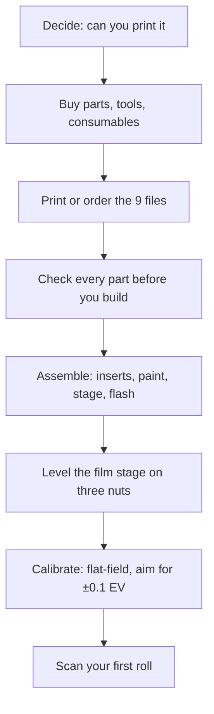

# Getting started

**English** · [简体中文](getting-started.zh-CN.md) · [日本語](getting-started.ja.md)

> Read this before you spend anything: what NeoBox is, whether you can build it, what you must already own, what it costs, how long it takes, and the order to do it in.

**Contents:** [Is this project for you?](#is-this-project-for-you) · [What camera scanning is](#what-camera-scanning-is) · [What you must already own](#what-you-must-already-own) · [What it costs and how long it takes](#what-it-costs-and-how-long-it-takes) · [The road map](#the-road-map) · [Skills you need](#skills-you-need) · [FAQ](#faq) · [Where to look things up](#where-to-look-things-up)

---

## Is this project for you?

NeoBox is a 3D-printable flash light source box that sits under your camera so you can photograph — [camera-scan](glossary.md#camera-scanning) — 35 mm and 120 negatives up to 6×9. The finished enclosure is 208 × 273 × 96 mm (width × depth × height), about 5.4 L.

A bare speedlight lies flat on the floor of the box and fires horizontally at the far wall. Nothing is aimed at the film. The light arrives only after several diffuse bounces inside the white [cavity](glossary.md#integrating-cavity), then passes through one [opal](glossary.md#opal) acrylic [diffuser](glossary.md#diffuser) directly under the film holder.

The whole build is smaller than it sounds:

- **8 printed parts** for the default build, plus an optional 6×6 mask — 9 STL files in total.
- **1 opal acrylic diffuser**, 110 × 130 × 2 mm, which simply rests on the film stage.
- **3 M6 studs, 6 nuts and 3 heat-set inserts**, plus EVA foam, 2 grommets and a USB LED strip.
- **No structural glue anywhere, and no screws hold the enclosure together** — the top cover drops on.

> [!IMPORTANT]
> This is a prototype release. The geometry is dimensionally verified in the Blender source, and all nine STL files are watertight single solids with every horizontal face on the 0.2 mm grid. But the box has **never been printed, photographed, measured or evenness-tested.** If you build one, you are the first.

**Build it if you** already shoot film and already own a camera you can put on a stand; want [base-ISO](glossary.md#base-iso), f/8 captures where vibration is irrelevant; and are happy to print eight parts and turn six nuts.

**Do not start if you** have neither a 3D printer nor access to a print service — every structural part is printed and there is no alternative route in the released files. Also skip it if you need 4×5, or if your film is in slide mounts; neither is supported, see the [FAQ](#faq).

> [!WARNING]
> **Build-plate go/no-go.** The two largest parts need a printable area of at least 280 × 300 mm. As exported, `main-body.stl` has an STL bounding box of 273 × 208 × 92 mm and `top-cover.stl` 279.6 × 214.6 × 14 mm — the top cover, not the main body, is the binding constraint. On a 220 × 220 or 256 × 256 mm machine (Bambu X1C/P1S, Prusa MK4) **neither of those two parts can be printed.** Outsource those two, or print the other seven at home. Your [bed size](glossary.md#bed-size) decides this before anything else does.

Three things to settle before any money moves:

- [ ] Can you print, or get printed, a part with a 279.6 × 214.6 mm footprint?
- [ ] Do you own — or will you buy — a speedlight with **manual power control** and a head that turns 90°?
- [ ] Do you own a macro-capable lens and something that holds the camera square above the box?

If all three are yes, continue to the [bill of materials](bom.md#tools-and-consumables). If the first is no, stop here.

## What camera scanning is

Camera scanning means photographing a backlit negative with a digital camera instead of running it through a scanner. The film sits in a holder above an evenly glowing surface, the camera looks straight down at it, and you [invert](glossary.md#inversion) the [raw](glossary.md#raw) file afterwards.

Against a flatbed, the trade is setup work for speed: aligning the rig takes an evening, but afterwards each frame is one shutter press. Against a lab scan, you keep the negative in your hands and the whole colour decision stays yours.

NeoBox is only the light source half of that. It replaces the light pad, and it says nothing about which camera you use — but the camera half is real work, and it is written up in [scanning](scanning.md#camera-side-equipment).

## What you must already own

None of the following is included in the project, and none of it is inside the CNY 250–420 build cost.

| You need | Why | Cost |
|---|---|---|
| A camera with manual exposure and raw | The exposure is set by hand and never changes across a roll | not costed here |
| A macro-capable lens | Filling a full-frame sensor with a 135 frame needs 1.0× [magnification](glossary.md#magnification-ratio); any 1:1 macro lens covers every format this box handles, at less than full magnification for the larger ones | not costed here |
| A [copy stand](glossary.md#copy-stand), or a tripod with a horizontal or reversible column | The film plane sits about 120.3 mm above whatever the box stands on; the camera must hang above that, square to it | not costed here |
| A speedlight with manual power and a 90° head | The light source. Reference build: NEEWER TT560, 190 × 75 × 55 mm, [GN38](glossary.md#guide-number), manual 1/1–1/128 in full stops | ≈ CNY 200–300 |
| A radio trigger set | Transmitter on the camera hot shoe, receiver in the box. Reference build: ZENIKO T1, 39 × 38 × 29.5 mm | ≈ CNY 150–250 |
| A remote release | Keeps your hand off the camera between frames | not costed here |
| Inversion software | Turns the raw capture into a positive | not costed here |
| Hand tools and consumables | Soldering iron, M6 spanner, hobby knife, glue, masking tape, matte black spray, rocket blower, a small flat mirror | listed in [bom](bom.md#tools-and-consumables) |

> [!NOTE]
> The camera side is deliberately not priced. A macro lens and a stand can cost anything from nothing, if you already own them, to more than the rest of the project combined — quoting a figure would be inventing one. What matters is that you have them before you order parts.

Only two things decide whether a flash is suitable: **manual power control** and a head that turns 90°. [TTL](glossary.md#ttl) and [HSS](glossary.md#hss) are useless inside a closed box — do not pay for them.

## What it costs and how long it takes

| What you are buying | Cost |
|---|---|
| Everything in the bill of materials — printed parts, opal acrylic, studs, nuts, inserts, foam, grommets, LED strip, cells | ≈ CNY 250–420 / JPY 5,500–9,000 |
| Speedlight (excluded from the figure above) | ≈ CNY 200–300 |
| Trigger set (excluded from the figure above) | ≈ CNY 150–250 |
| Aluminium film stage — optional upgrade, add it later | ≈ CNY 80–200 |
| Camera, lens, stand, release, software | not costed here |

Filament is the bulk of the printing line: about 1–1.3 kg for the whole build, roughly 0.7–0.95 kg white and 0.25–0.4 kg black.

| Stage | Typical elapsed time | Notes |
|---|---|---|
| 3D printing, ordered from a service | 2–5 days | Printing one 135 holder first splits this into two rounds |
| Opal acrylic cut to size | 3–7 days | Order 2–3 sheets; they are cheap and easy to scratch |
| Hardware — studs, nuts, inserts, foam, grommets | usually next day | Order this first, it arrives first |
| Assembly | ≈ 15 minutes | Not counting paint curing |
| First calibration | an evening | Parallelism, then evenness |

> [!TIP]
> The three orders have very different lead times, so place them on the same day rather than in sequence. The critical path is almost always the printing.

## The road map

| Step | What actually happens | Written up in |
|---|---|---|
| Decide | Bed size, flash compatibility, what you already own | this page |
| Buy | Parts, tools and consumables; vendor scripts; acceptance checks on arrival | [bom](bom.md#tools-and-consumables) |
| Print | Nine STL files — eight for the default build plus one optional 6×6 mask; 0.2 mm layers everywhere | [printing](printing.md#ordering-from-a-print-service) |
| Check parts | Measure before you build; a wrong part found now costs a reprint, found later costs the build | [printing](printing.md#check-each-part-before-you-assemble) |
| Assemble | Three [heat-set inserts](glossary.md#heat-set-insert), paint the outside, studs and nuts, flash on the floor | [assembly](assembly.md#assembly-steps) |
| Level | Three nuts under the [film stage](design.md#4-film-stage): front sets pitch, rear pair sets roll | [assembly](assembly.md#levelling-the-stage) |
| Calibrate | Photograph the bare lit surface, apply [flat-field correction](glossary.md#flat-field-correction) first, target about ±0.1 EV corner to corner | [assembly](assembly.md#calibration) |
| First roll | Camera height, focus, flash power, loading film, shooting, inverting | [scanning](scanning.md#loading-film) |
| Something is wrong | Symptom → likely cause → fix, for every stage | [troubleshooting](troubleshooting.md#printing) |

## Skills you need

Nothing exotic. If you can follow a slicer's default profile, use a spanner and keep your hands clean around film, you can build this. No CAD work is required unless you change the flash.

Two steps catch people out, and both are worth reading twice before you reach them:

**Heat-set inserts.** Three M6 brass inserts go into the top-cover posts with a soldering iron at about 200–250 °C for PLA. They must go in straight; a crooked insert gives a crooked stud, and a crooked stud gives a film stage you cannot level. Stop when the flange is flush.

**Parallelism.** The film plane must be parallel to the sensor, not merely horizontal. A flash freezes vibration but cannot fix a tilted film plane. The method is a small flat mirror laid on the film plane; you move the camera until its own reflection sits dead centre. Parallelism first, evenness second.

Why the design is built around a flash and not a continuous LED panel

Inside the closed box, ambient light contributes nothing, so the flash pulse **is** the exposure — 1/1,000 to 1/20,000 s at working power. That is an effective shutter one to three orders of magnitude shorter than the 1/15 to 1/60 s of real shutter time an LED panel needs at ISO 100 and f/8. Vibration, shutter shock and floor rumble stop mattering.

Three more consequences follow. You get base-ISO f/8 with power to spare; every frame receives identical output, so one inversion profile fits the whole roll; and a xenon tube gives a genuinely continuous daylight spectrum at about 5600 K.

An LED panel would make the box smaller — about 100 mm tall and about 4 L — because it is already a surface emitter. It was declined for the reasons above, and the access panel is sized so a panel could be retrofitted later without moving the film plane or the camera height.

## FAQ

**Has anyone built one?** No. The design is dimensionally verified in CAD and the exported files are numerically verified, but no physical box exists yet. Treat every optical claim as reasoned, not measured.

**Can I use an LED panel instead of a flash?** Not with the released files — no LED variant is published. The argument against it is in the collapsed block above; the retrofit path exists in the geometry but not in the STLs.

**Will my flash fit?** The published STLs fit the NEEWER TT560 only. A substitute must have a head that rotates 90°, manual power control, a body no longer than 190 mm and no thicker than 55 mm lying flat. Anything else means re-deriving the enclosure and re-exporting from `cad/neobox.blend` — the formulas give you the new numbers, they do not resize the files. See [generalising to another flash](design.md#generalising-to-another-flash).

**Do I need the magnets?** Mostly yes. The 16 closure magnets — 8 per holder, in four attracting pairs — clamp each film holder shut and are recommended for every build; without them the holder lid is held only by its own weight, which is enough lying flat but not on end. The other 8 base-to-stage magnets and the 4 steel washers are only needed if you will stand the box on end.

**Can I print this on a 220 × 220 mm build plate?** Not completely. The main body and the top cover exceed it — outsource those two and print the other seven at home. The printed film stage is 230 × 200 mm, so on a 220 × 220 mm plate measure your usable area before committing. See the warning at the top of this page.

**Do I need the aluminium film stage?** No. The printed stage and the aluminium one both present their top face at z = 114 mm, so they are interchangeable and you can upgrade later. The aluminium version is 3 mm 5052, black anodised, from `cad/film-stage-aluminium-3mm.dxf`.

> [!CAUTION]
> Whichever stage you use, its three Ø6.5 mm holes are **clearance holes — never tap them.** A threaded plate combined with a same-pitch threaded insert forms a differential screw, and the stage height then cannot be adjusted at all.

**Does it do 4×5?** No. The aperture is 100 × 120 mm and the film holders are 110 × 170 mm; nothing in the released files handles sheet film. A larger version is discussed in the design document as a reservation only.

**Does it do mounted slides?** No. The 135 channel is 0.4 mm high and 35.4 mm wide, sized for bare film strips. A slide in its mount will not enter it. Unmounted transparencies are fine — but note that dust on the diffuser is visible on positives in a way it is not on inverted negatives.

**How many frames does a holder take at once?** The holder outline is 110 × 170 mm and film is advanced by sliding it sideways through the channel; the holder is never opened mid-roll. Loading, strip length and handling are covered in [scanning](scanning.md#loading-film).

## Where to look things up

This project uses a lot of vocabulary from three different trades — film photography, optics and FDM printing — and mixes them in single sentences. Every term is defined once, in one line, in the [glossary](glossary.md#camera-scanning).

Start there whenever a word stops you: [integrating cavity](glossary.md#integrating-cavity), [flat-field correction](glossary.md#flat-field-correction), [sync speed](glossary.md#sync-speed), [guide number](glossary.md#guide-number), [heat-set insert](glossary.md#heat-set-insert), [supports](glossary.md#supports), [layer height](glossary.md#layer-height), [working distance](glossary.md#working-distance), [Newton rings](glossary.md#newton-rings), [base ISO](glossary.md#base-iso), [EV](glossary.md#ev).

For the reasoning behind a dimension rather than the dimension itself, the [design](design.md#3-optical-decisions) document holds the engineering, and the design log records what was tried and rejected.

---

← [README](../README.md) · [Documentation index](../README.md#documentation) · [Bill of materials](bom.md) →
