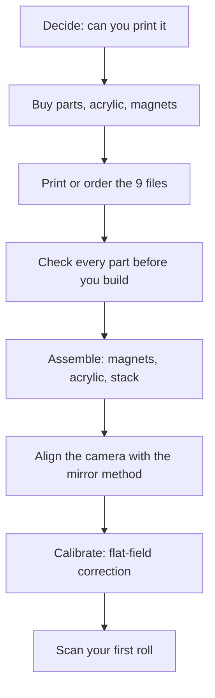

# Getting started

**English** · [简体中文](getting-started.zh-CN.md) · [日本語](getting-started.ja.md)

> Read this before you spend anything: what NeoBox is, whether you can build it, what you must already own, what it costs, how long it takes, and the order to do it in.

**Contents:** [Is this project for you?](#is-this-project-for-you) · [What camera scanning is](#what-camera-scanning-is) · [What you must already own](#what-you-must-already-own) · [What it costs and how long it takes](#what-it-costs-and-how-long-it-takes) · [The road map](#the-road-map) · [Skills you need](#skills-you-need) · [FAQ](#faq) · [Where to look things up](#where-to-look-things-up)

---

## Is this project for you?

NeoBox is a 3D-printable flash light source box that sits under your camera so you can photograph, or [camera-scan](glossary.md#camera-scanning), 35 mm and 120 negatives up to 6×9. The assembled stack has a 124.8 × 154.8 mm footprint and stands 87 mm tall: it lives on a desk, not on the floor.

A bare speedlight lies flat on the desk with its head against the box's fully open front, firing horizontally into the white [cavity](glossary.md#integrating-cavity). Nothing points at the film. The light bounces off the white walls several times, then leaves upward through a 62 × 95 mm window and one [opal](glossary.md#opal) acrylic [diffuser](glossary.md#diffuser) directly under the film. The open front also lets room light in: work in a dim room and keep ceiling lights from shining into the opening. The flash pulse is far stronger than anything the room adds.

The whole build is smaller than it sounds:

- **9 printed parts** (two white, seven black), all nine STL files support-free, each printed with its flat face down.
- **1 opal acrylic diffuser**, 68 × 118 × 2 mm, dropped into a pocket in the cover-stage.
- **32 magnets and 4 steel washers**: Ø8 × 2 mm N35 discs press-fitted into the film holder parts, and 10 × 10 × 1 mm washers that sit flush in the cover-stage.
- **No screws, no threads, no glue, no tools.** The box assembles by gravity and magnets, and levelling happens at the camera, not inside the box.

> [!IMPORTANT]
> This is a prototype release. The geometry is dimensionally verified in the Blender source, and all nine STL files are watertight single solids with every horizontal face on the 0.2 mm grid. But the box has **never been printed, photographed, measured or evenness-tested.** If you build one, you are the first.

**Build it if you** already shoot film and already own a camera you can put on a stand; want [base-ISO](glossary.md#base-iso), f/8 captures where vibration is irrelevant; and are happy to print nine parts and press in some magnets. There is nothing to screw, solder or glue.

**Do not start if you** have neither a 3D printer nor access to a print service: every structural part is printed and there is no alternative route in the released files. Also skip it if you need 4×5, or if your film is in slide mounts; neither is supported, see the [FAQ](#faq).

> [!WARNING]
> **Build-plate go/no-go.** The two largest parts, `main-body.stl` and `cover-stage.stl`, share a 124.8 × 154.8 mm footprint, so a 160 × 160 mm [bed](glossary.md#bed-size) prints the entire set, and any current desktop machine qualifies. Nothing needs supports; the one orientation rule is that the two holder lids print top face down while every other part prints flat bottom down. If you cannot reach a 160 × 160 mm bed, settle the outsourcing route before you spend anything else.

Three things to settle before any money moves:

- [ ] Can you reach a 160 × 160 mm bed, your own or a service's, for parts with a 124.8 × 154.8 mm footprint?
- [ ] Do you own, or will you buy, a hot-shoe speedlight with **manual power control**? Any brand; it sits outside the box.
- [ ] Do you own a macro-capable lens and something that holds the camera square above the box?

If all three are yes, continue to the [bill of materials](bom.md#tools-and-consumables). If the first is no, stop here.

## What camera scanning is

Camera scanning means photographing a backlit negative with a digital camera instead of running it through a scanner. The film sits in a holder above an evenly glowing surface, the camera looks straight down at it, and you [invert](glossary.md#inversion) the [raw](glossary.md#raw) file afterwards.

Against a flatbed, the trade is setup work for speed: aligning the rig takes an evening, but afterwards each frame is one shutter press. Against a lab scan, you keep the negative in your hands and the whole colour decision stays yours.

NeoBox is only the light source half of that. It replaces the light pad, and it says nothing about which camera you use. The camera half is real work, though, and it is written up in [scanning](scanning.md#camera-side-equipment).

## What you must already own

Nothing below is a printed part. The flash and the trigger appear in the [bill of materials](bom.md#tools-and-consumables) as reference picks; everything else you must already have, and none of it is costed by this project.

| You need | Why | Cost |
|---|---|---|
| A camera with manual exposure and raw | The exposure is set by hand and never changes across a roll | not costed here |
| A macro-capable lens | Filling a full-frame sensor with a 135 frame needs 1:1 [magnification](glossary.md#magnification-ratio); any 1:1 macro lens covers every format this box handles, at less than full magnification for the larger ones | not costed here |
| A [copy stand](glossary.md#copy-stand), or a tripod with a horizontal or reversible column | The film plane sits 83.2 mm above whatever the box stands on; the camera must hang above that, square to it | not costed here |
| A hot-shoe speedlight with manual power control | The light source. It lies flat on the desk with its head at the open front and never enters the box; any brand fits, and the NEEWER TT560 is only the reference pick | see the bill of materials |
| A radio trigger set | Transmitter on the camera hot shoe; the receiver stays outside with the flash, so the signal is never boxed in and batteries change without touching the box. Reference pick: ZENIKO T1 | see the bill of materials |
| A remote release | Keeps your hand off the camera between frames | not costed here |
| Inversion software | Turns the raw capture into a positive | not costed here |
| A rocket blower and a small flat mirror | The blower keeps film (and the optional glass) free of dust; the mirror is the levelling instrument: you centre the lens's own reflection in it | listed in [bom](bom.md#tools-and-consumables) |

> [!NOTE]
> The camera side is deliberately not priced. A macro lens and a stand can cost anything from nothing, if you already own them, to more than the rest of the project combined, so quoting a figure would be inventing one. What matters is that you have them before you order parts.

Only one thing decides whether a flash is suitable: **manual power control**. No dimension of it matters and the head does not need to tilt or swivel, because the flash simply lies at the opening. [TTL](glossary.md#ttl) and [HSS](glossary.md#hss) are useless here, so do not pay for them.

## What it costs and how long it takes

Prices live in one place, the [bill of materials](bom.md#tools-and-consumables); this page only sorts the spending into piles:

| What you are buying | Cost |
|---|---|
| Everything structural: nine PLA parts, the opal acrylic sheet, 32 magnets, 4 steel washers | priced in the bill of materials |
| A speedlight (any hot-shoe model with manual power control) | reference pick priced in the bill of materials |
| A radio trigger set | reference pick priced in the bill of materials |
| Optional upgrades: anti-Newton glass, LED positioning strip, flocking sheet | priced in the bill of materials |
| Camera, lens, stand, release, software | not costed here |

Printing is a small job: nothing is longer than 154.8 mm, plain PLA is fine, and every part goes down support-free: 0.2 mm layers, 15 % infill.

| Stage | Typical elapsed time | Notes |
|---|---|---|
| 3D printing, at home or from a service | days | usually the critical path; two colours, no supports to remove |
| Opal acrylic cut to size | days | 68 × 118 × 2 mm custom cut; a v4-era 110 × 130 mm sheet can be cut down and reused |
| Magnets and washers | usually the fastest order | stock sizes, nothing custom |
| Assembly | minutes | no tools; pressing in the 32 magnets is most of the work |
| First set-up | an evening | camera parallelism with the mirror, then an evenness check |

> [!TIP]
> The three orders have very different lead times, so place them on the same day rather than in sequence. The critical path is almost always the printing.

## The road map

| Step | What actually happens | Written up in |
|---|---|---|
| Decide | Bed size (160 × 160 mm is enough), flash on hand, what you already own | this page |
| Buy | Parts and consumables; vendor scripts; acceptance checks on arrival | [bom](bom.md#tools-and-consumables) |
| Print | Nine STL files in plain PLA: 0.2 mm [layers](glossary.md#layer-height), 15 % infill, no supports | [printing](printing.md#ordering-from-a-print-service) |
| Check parts | Measure before you build; a wrong part found now costs a reprint, found later costs the build | [printing](printing.md#check-each-part-before-you-assemble) |
| Assemble | Press 32 magnets into the holder parts, drop the acrylic and washers into the cover-stage, stack everything, no tools | [assembly](assembly.md#assembly-steps) |
| Align | A small mirror on the film plane; move the camera until its own lens reflection is centred; the camera levels, the box does not | [assembly](assembly.md#step-7--level-at-the-camera-the-mirror-method) |
| Calibrate | Photograph the bare glowing window and apply [flat-field correction](glossary.md#flat-field-correction) before judging evenness | [scanning](scanning.md#flat-field-and-inversion) |
| First roll | Camera height, focus, flash power, loading film, shooting, inverting | [scanning](scanning.md#loading-film) |
| Something is wrong | Symptom → likely cause → fix, for every stage | [troubleshooting](troubleshooting.md#printing) |

## Skills you need

Nothing exotic. If you can follow a slicer's default profile and keep your hands clean around film, you can build this. There is no screwdriver, spanner, soldering iron or glue anywhere in the build, and no CAD work at all; the design is not tied to any flash model.

Two steps catch people out, and both are worth reading twice before you reach them:

**Magnet polarity.** Thirty-two Ø8 × 2 mm magnets go into the holder parts, eight per part, as press-fits. Every magnet must attract its partner in the mating part, and an interference fit is not meant to come back out. Dry-check the polarity of each magnet against its already-seated partners before pressing it home.

**Parallelism.** The film plane must be parallel to the sensor, not merely horizontal, and in this design nothing on the box adjusts. Lay a small flat mirror where the film goes and move the camera until the reflection of its own lens sits dead centre in the frame. When it does, the sensor is parallel to the film plane, and every printed-part tolerance underneath has been absorbed in the same move. Parallelism first, evenness second.

Why the design is built around a flash and not a continuous LED panel

The flash pulse **is** the exposure. In a dim room, its output through the cavity dwarfs anything ambient light adds through the open front, and the pulse is over in a small fraction of any real shutter time, so vibration, shutter shock and floor rumble stop mattering.

Other things follow from the same choice. Every frame receives identical output, so one inversion profile fits the whole roll. Base-ISO, f/8 shooting is the design's working point, and a xenon tube gives a genuinely continuous, daylight-balanced spectrum.

The optional LED strip in the bill of materials does not change this argument: stuck to a wall inside the cavity, it is a positioning light, a steady glow for framing and advancing film, and plays no part in the exposure.

## FAQ

**Has anyone built one?** No. The v5 geometry is dimensionally verified in CAD and the exported files are numerically checked, but no physical box has ever been printed, photographed, measured or evenness-tested. Treat every optical claim as reasoned, not measured.

**Can I use an LED panel instead of a flash?** Not with the released files: no LED variant is published, and the argument against one is in the collapsed block above. The optional LED strip in the bill of materials is a positioning light only, never the exposure.

**Will my flash fit?** Yes. The flash never enters the box: it lies flat on the desk with its head at the fully open front, so no dimension of it matters. Any hot-shoe speedlight with manual power control works; the NEEWER TT560 is only the reference the light path was drawn around.

**Do I need the magnets?** Yes: all 32, plus the 4 steel washers. Eight magnets in each lid pull against eight in each base to clamp the holder shut, and the base magnets also grip the washers set flush in the cover-stage, which is what holds the holder to the stage and makes the five-second format swap possible. Without them, everything merely rests under its own weight.

**Can I print this on a 220 × 220 mm build plate?** Yes, the entire set, with room to spare. Nothing exceeds a 124.8 × 154.8 mm footprint, so even a 160 × 160 mm bed is enough, and no part needs supports.

**Do I need the anti-Newton glass?** No. The default pressure element is a printed insert per format: the window edges are hard limits and the film cannot bow more than 0.28 mm, inside the roughly ±0.4 mm depth of field at 1:1, f/8. The anti-Newton glass (64 × 95 × 2 mm, one sheet shared by both formats) is an upgrade that caps the whole frame continuously; its matte face rests on the film's glossy base, so no [Newton rings](glossary.md#newton-rings), and the emulsion faces the open window below, touching nothing.

> [!CAUTION]
> In glass mode the underside of the glass sits 0.2 mm from the focal plane, so a dust speck there lands in the image. The element goes in once and stays, so blow it clean before it goes in. Dust on the opal acrylic, by contrast, never images: it lies on the glowing surface itself, and an occasional wipe is enough.

**Does it do 4×5?** No. The film windows are 25 × 37 mm for 135 and 57 × 85 mm for 120 (a full 6×9), and the holders are 94 × 120 mm overall. Nothing in the released files handles sheet film.

**Does it do mounted slides?** No. The 135 channel is 0.4 mm high, sized for bare film strips; a slide in its mount will not enter it. Unmounted transparencies are fine.

**How do I advance film, and switch formats?** Advance by pulling: grip the strip where it leaves the holder and draw it through. The pressure element flattens any arch as the film slides under it, and the holder is never opened mid-roll. To switch formats, lift one holder off and set the other down; the magnets locate it, about five seconds. For 6×6, lay the mask under the 120 base; the holder rides 1 mm higher, which is normal. 6×4.5 has no dedicated mask, so crop in post. A long strip's tail rests on the tray flange just below the film plane, so give its far end a hand. Loading and handling are covered in [scanning](scanning.md#loading-film).

## Where to look things up

This project uses a lot of vocabulary from three different trades (film photography, optics and FDM printing) and mixes them in single sentences. Every term is defined once, in one line, in the [glossary](glossary.md#camera-scanning).

Start there whenever a word stops you: [integrating cavity](glossary.md#integrating-cavity), [flat-field correction](glossary.md#flat-field-correction), [sync speed](glossary.md#sync-speed), [guide number](glossary.md#guide-number), [supports](glossary.md#supports), [layer height](glossary.md#layer-height), [working distance](glossary.md#working-distance), [Newton rings](glossary.md#newton-rings), [base ISO](glossary.md#base-iso), [EV](glossary.md#ev).

For the reasoning behind a dimension rather than the dimension itself, the [design](design.md#3-optical-decisions) document holds the engineering, and the design log records what was tried and rejected.

---

← [README](../README.md) · [Documentation index](../README.md#documentation) · [Bill of materials](bom.md) →
