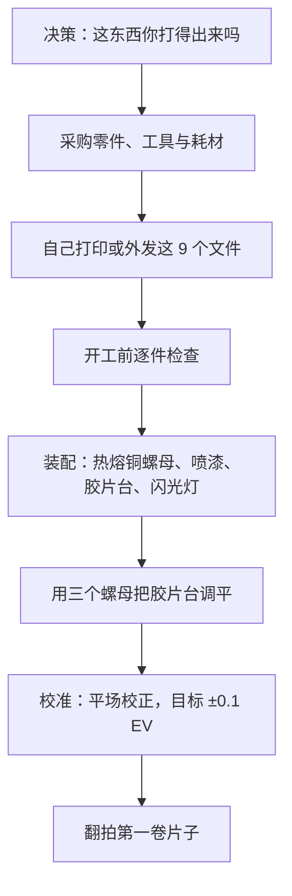

# 从这里开始

[English](getting-started.md) · **简体中文** · [日本語](getting-started.ja.md)

> 在花钱之前先读这一篇：NeoBox 是什么、你能不能做出来、需要自备哪些器材、总共要花多少钱和多长时间，以及各步骤的先后顺序。

**目录：** [本项目是否适合你](#本项目是否适合你) · [什么是相机翻拍](#什么是相机翻拍) · [你需要自备的器材](#你需要自备的器材) · [费用与时间](#费用与时间) · [整体流程](#整体流程) · [需要的技能](#需要的技能) · [常见问题](#常见问题) · [到哪里查资料](#到哪里查资料)

---

## 本项目是否适合你

NeoBox 是一只 3D 打印的闪光灯光源箱，放在相机下方，用来对 35 mm 和最大 6×9 的 120 底片做[相机翻拍](glossary.zh-CN.md#相机翻拍)（camera scanning，也叫 DSLR scanning）。装好后的整箱外形 208 × 273 × 96 mm（宽 × 深 × 高），约 5.4 L。

一只裸机顶闪光灯平躺在主箱底板上，朝对面的墙壁水平打光。没有任何光是直接对着胶片的。光要先在白色[混光腔](glossary.zh-CN.md#混光腔)（integrating cavity）里经过若干次漫反射，才穿过胶片夹正下方那一块[乳白](glossary.zh-CN.md#乳白)亚克力[扩散板](glossary.zh-CN.md#扩散板)（opal acrylic diffuser）。

整套东西比听上去要少：

- 默认配置 **8 个打印件**，外加一个可选的 6×6 遮罩——合计 9 个 STL 文件。
- **1 块乳白亚克力扩散板**，110 × 130 × 2 mm，直接搁在胶片台上。
- **3 根 M6 螺杆、6 个螺母、3 个热熔铜螺母**，再加 EVA 泡棉、2 个过线圈和一条 USB LED 灯带。
- **没有任何结构性粘接，壳体也不靠螺丝固定**——顶盖是直接扣上去的。

> [!IMPORTANT]
> 这是原型版本。几何尺寸已在 Blender 源文件中逐项核对，九个 STL 全部是水密单实体，每一个水平面都落在 0.2 mm 网格上。但这只箱子**从未被打印、拍摄、实测或做过均匀性测试**。你要是动手做了，你就是第一个。

**适合动手的人**：已经在拍胶片，手里有一台能架起来的相机；想要在[基准 ISO](glossary.zh-CN.md#基准-iso)（base ISO）、f/8 下拍摄，并且完全不用担心震动；不介意打印八个件、拧六个螺母。

**先别开始**：如果你既没有 3D 打印机，也找不到代打服务——所有受力件都是打印出来的，已发布的文件里没有第二条路。另外，如果你要拍 4×5，或者片子已经装在幻灯片框里，也请跳过，这两种都不支持，见[常见问题](#常见问题)。

> [!WARNING]
> **打印床尺寸是一道生死线。** 两个最大的件需要至少 280 × 300 mm 的可打印区域。按导出状态，`main-body.stl` 的 STL 包围盒是 273 × 208 × 92 mm，`top-cover.stl` 是 279.6 × 214.6 × 14 mm——卡尺寸的是顶盖，不是主箱。在 220 × 220 或 256 × 256 mm 的机器上（Bambu X1C/P1S、Prusa MK4），**这两个件都打不出来**。要么把这两件外发，要么另外七件自己在家打。[打印床](glossary.zh-CN.md#打印床尺寸)尺寸比任何别的因素都更早决定这件事。

花钱之前先把三件事定下来：

- [ ] 你能不能打印、或者找到人打印一个占地 279.6 × 214.6 mm 的件？
- [ ] 你有没有、或者会不会买一只**支持手动出力**、灯头能转 90° 的机顶闪光灯？
- [ ] 你有没有一支具备微距能力的镜头，以及能把相机端正地架在箱子正上方的东西？

三个都是「有」，就继续看[物料清单](bom.zh-CN.md#工具与耗材)。第一个是「没有」，到此为止。

## 什么是相机翻拍

相机翻拍就是用数码相机去拍一张背光的底片，而不是把它送进扫描仪。胶片架在一块均匀发光的表面之上，相机垂直向下拍，事后再把 [raw](glossary.zh-CN.md#raw) 文件[反相](glossary.zh-CN.md#反相)（inversion）。

跟平板扫描仪比，这笔买卖是拿前期调校换后期速度：把整套装置对齐要花一个晚上，但之后每一格就是按一次快门。跟送店冲扫比，底片始终在你自己手上，整个色彩判断也都归你。

NeoBox 只是这件事里「光源」的那一半。它取代的是看片灯板（light pad），至于你用什么相机，它一句都没管——而相机那一半是实打实的工作量，写在[翻拍](scanning.zh-CN.md#相机端器材)里。

## 你需要自备的器材

以下这些都不由本项目提供，也都不在 CNY 250–420 的制作成本里。

| 你需要 | 为什么 | 价格 |
|---|---|---|
| 一台能手动曝光、能出 raw 的相机 | 曝光是手动定死的，一卷之内不再改动 | 此处不计价 |
| 一支具备微距能力的镜头 | 用全画幅拍满一格 135，需要 1.0× 的[放大倍率](glossary.zh-CN.md#放大倍率)（magnification）；任何一支 1:1 微距镜都能覆盖本箱支持的全部画幅，画幅越大，用到的放大倍率越低，都不到 1:1 | 此处不计价 |
| 一台[翻拍台](glossary.zh-CN.md#翻拍台)（copy stand），或者带横臂、可倒置中轴的三脚架 | 胶片平面位于箱子落地面以上约 120.3 mm；相机必须悬在它正上方并与之平行 | 此处不计价 |
| 一只手动出力、灯头能转 90° 的机顶闪光灯 | 就是光源本身。参考配置：NEEWER TT560，190 × 75 × 55 mm，[闪光指数](glossary.zh-CN.md#闪光指数) GN38，手动 1/1–1/128 整档可调 | ≈ CNY 200–300 |
| 一套无线引闪器 | 发射端装在相机热靴上，接收端放在箱内。参考配置：ZENIKO T1，39 × 38 × 29.5 mm | ≈ CNY 150–250 |
| 一根快门线或遥控器 | 拍摄间隙手不碰相机 | 此处不计价 |
| 反相软件 | 把 raw 原片变成正像 | 此处不计价 |
| 手工具与耗材 | 电烙铁、M6 扳手、美工刀、胶水、遮蔽胶带、哑光黑喷漆、气吹、一小块平面镜 | 列在[物料清单](bom.zh-CN.md#工具与耗材)里 |

> [!NOTE]
> 相机那一侧是有意不计价的。一支微距镜和一套支架，本来就有就是零成本，也可能比这个项目其余部分加起来还贵——随便报一个数字就是在编。真正要紧的是：在下单买件之前，这些东西你得已经有了。

判断一只闪光灯合不合用，只看两点：**能不能手动调出力**，以及**灯头能不能转 90°**。[TTL](glossary.zh-CN.md#ttl) 和[高速同步（HSS）](glossary.zh-CN.md#hss)在一只封闭的箱子里毫无用处——别为它们花钱。

## 费用与时间

| 你买的是什么 | 费用 |
|---|---|
| 物料清单上的全部内容——打印件、乳白亚克力、螺杆、螺母、热熔铜螺母、泡棉、过线圈、LED 灯带、电池 | ≈ CNY 250–420 / JPY 5,500–9,000 |
| 机顶闪光灯（不含在上面那个数里） | ≈ CNY 200–300 |
| 引闪器套装（不含在上面那个数里） | ≈ CNY 150–250 |
| 铝制胶片台——可选升级，以后再加也行 | ≈ CNY 80–200 |
| 相机、镜头、支架、快门线、软件 | 此处不计价 |

打印这一项里耗材占大头：整套下来约 1–1.3 kg，其中白色约 0.7–0.95 kg，黑色约 0.25–0.4 kg。

| 阶段 | 通常耗时 | 说明 |
|---|---|---|
| 3D 打印，找代打服务 | 2–5 天 | 先只打一副 135 胶片夹，会把这一步拆成两轮 |
| 乳白亚克力定制切割 | 3–7 天 | 一次订 2–3 片；便宜，而且很容易刮花 |
| 五金——螺杆、螺母、热熔铜螺母、泡棉、过线圈 | 通常次日达 | 最先下单，也最先到 |
| 装配 | ≈ 15 分钟 | 不含喷漆干燥时间 |
| 第一次校准 | 一个晚上 | 先平行度，后均匀性 |

> [!TIP]
> 这三笔单子的交期差别很大，所以要同一天一起下，而不是办完一笔再办下一笔。关键路径几乎总是打印。

## 整体流程

| 步骤 | 实际在做什么 | 写在哪一篇 |
|---|---|---|
| 决策 | 打印床尺寸、闪光灯兼容性、你手里已经有什么 | 本页 |
| 采购 | 零件、工具与耗材；淘宝话术；到货验收 | [物料清单](bom.zh-CN.md#工具与耗材) |
| 打印 | 九个 STL 文件——默认配置八个，外加一个可选的 6×6 遮罩；全部 0.2 mm 层高 | [3D 打印](printing.zh-CN.md#找代打服务下单) |
| 逐件检查 | 开工前先量；现在发现件不对只是重打一件，装到一半才发现就是整台返工 | [3D 打印](printing.zh-CN.md#装配前逐件检查) |
| 装配 | 三个[热熔铜螺母](glossary.zh-CN.md#热熔铜螺母)、外表面喷漆、螺杆与螺母、闪光灯就位 | [装配](assembly.zh-CN.md#装配步骤) |
| 调平 | [胶片台](design.zh-CN.md#4-胶片台)下面的三个螺母：前面一个管俯仰，后面一对管横滚 | [装配](assembly.zh-CN.md#调平胶片台) |
| 校准 | 拍一张不放胶片的发光面，先做[平场校正](glossary.zh-CN.md#平场校正)（flat-field correction），目标四角之间约 ±0.1 EV | [装配](assembly.zh-CN.md#校准) |
| 第一卷 | 相机高度、对焦、闪光出力、装片、拍摄、反相 | [翻拍](scanning.zh-CN.md#装片) |
| 出问题了 | 症状 → 可能原因 → 处理，覆盖每一个阶段 | [排错](troubleshooting.zh-CN.md#打印) |

## 需要的技能

没什么冷门的。会照着切片软件的默认配置走、会用扳手、碰胶片时手是干净的，这东西你就做得出来。除非你要换闪光灯，否则完全不需要动 CAD。

有两步特别容易翻车，都值得在真正做到之前先读两遍：

**热熔铜螺母。** 三个 M6 黄铜热熔铜螺母要用电烙铁埋进顶盖底下的三根柱子里，PLA 大约 200–250 °C。它们必须埋正：螺母歪了螺杆就歪，螺杆歪了胶片台就调不平。看到法兰面与柱顶齐平就停手。

**平行度。** 胶片平面必须与传感器平行，而不只是水平。闪光灯能冻结震动，却救不了一个歪掉的胶片平面。做法是把一小块平面镜放在胶片平面上，一边从相机里看，一边挪相机，直到镜子里相机自己的影像正好落在画面正中。先平行度，后均匀性。

为什么整个设计围绕闪光灯，而不是常亮 LED 面板

箱子一关，环境光就贡献不了任何东西，于是**闪光脉冲本身就是曝光**——工作出力下是 1/1,000 到 1/20,000 s。这个等效快门，比 LED 面板在 ISO 100、f/8 下所需的 1/15 到 1/60 s 真实快门时间短一到三个数量级。机械震动、快门震动和地板传来的低频晃动就此不再重要。

由此还带来三条好处。基准 ISO 下用 f/8，出力还有富余；每一格得到的输出完全一致，所以一卷片子共用一条反相曲线；氙气灯管给出的是真正连续的日光光谱，约 5600 K。

换成 LED 面板，箱子会更小——高度约 100 mm，容积约 4 L——因为它本身就是面光源。出于上面的理由没有采用；不过抽口盖板的尺寸留够了余量，以后要改装一块 LED 面板，不必移动胶片平面，也不必改相机高度。

## 常见问题

**有人真做出来过吗？** 没有。设计在 CAD 里逐项核对过尺寸，导出的文件也做过数值校验，但目前还没有一只实体箱子。所有关于光学的说法都请当成推演结果，而不是实测结果。

**能不能用 LED 面板代替闪光灯？** 用已发布的这套文件不行——没有发布 LED 版本。不采用它的理由在上面那个折叠块里；几何上留了改装余地，STL 里没有。

**我的闪光灯装得进去吗？** 已发布的 STL 只适配 NEEWER TT560。要换别的，灯头必须能转 90°，必须支持手动出力，平放时机身长度不超过 190 mm、厚度不超过 55 mm。除此以外的情况，都意味着重新推导壳体尺寸并从 `cad/neobox.blend` 重新导出——公式只给你新的数字，它不会把文件改大改小。见[换用其他闪光灯](design.zh-CN.md#换用其他闪光灯)。

**磁铁一定要装吗？** 大部分要。16 颗闭合磁铁——每副胶片夹 8 颗，组成四对相吸——负责把夹底座和夹上盖压紧，建议每一台都装；不装的话夹上盖只靠自重压着，平放够用，箱体立起来就不够了。另外 8 颗夹底座对胶片台的磁铁和 4 片铁垫片，只有在你要把箱子立起来用时才需要。

**220 × 220 mm 的打印床能打吗？** 打不全。主箱和顶盖都超尺寸——把这两件外发，其余七件在家打。打印版胶片台是 230 × 200 mm，在 220 × 220 的床上要先量一下自己机器的实际可用区域再下决心。见本页开头的警告。

**铝制胶片台是必需的吗？** 不是。打印版和铝制版的上表面都落在 z = 114 mm，所以两者可以互换，以后再升级也行。铝制版是 3 mm 的 5052 铝板，黑色阳极氧化，出自 `cad/film-stage-aluminium-3mm.dxf`。

> [!CAUTION]
> 不管你用哪一种胶片台，它上面那三个 Ø6.5 mm 的孔都是**光孔（clearance hole）——绝对不要攻丝**。一块攻了丝的板配上同样螺距的螺纹件，就构成了一组差动螺旋（differential screw），胶片台的高度将完全无法调节。

**支持 4×5 吗？** 不支持。开口是 100 × 120 mm，胶片夹外形 110 × 170 mm，已发布的文件里没有任何东西能处理页片。更大的版本只作为预留写在设计文档里。

**支持装框的幻灯片吗？** 不支持。135 的滑槽高 0.4 mm、宽 35.4 mm，是按裸片条的尺寸做的，带框的幻灯片进不去。没装框的反转片没问题——但要注意，扩散板上的灰尘在正片上看得见，在反相后的负片上则看不出来。

**一副胶片夹一次能放几格？** 胶片夹外形 110 × 170 mm，进片方式是让片条在滑槽里横向滑动，一卷拍完之前不需要打开胶片夹。装片、片条长度和取放方式写在[翻拍](scanning.zh-CN.md#装片)里。

## 到哪里查资料

这个项目同时用到三个行当的词汇——胶片摄影、光学和 FDM 打印——而且经常一句话里混着用。每个词都在[术语表](glossary.zh-CN.md#相机翻拍)里用一行给出定义，只定义一次。

碰到读不下去的词就先去那里查：[混光腔](glossary.zh-CN.md#混光腔)、[平场校正](glossary.zh-CN.md#平场校正)、[同步速度](glossary.zh-CN.md#同步速度)（sync speed）、[闪光指数](glossary.zh-CN.md#闪光指数)、[热熔铜螺母](glossary.zh-CN.md#热熔铜螺母)、[支撑](glossary.zh-CN.md#支撑)（supports）、[层高](glossary.zh-CN.md#层高)、[工作距离](glossary.zh-CN.md#工作距离)（working distance）、[牛顿环](glossary.zh-CN.md#牛顿环)（Newton rings）、[基准 ISO](glossary.zh-CN.md#基准-iso)、[EV](glossary.zh-CN.md#ev)。

想知道的是某个尺寸背后的道理而不是尺寸本身，工程内容在[设计](design.zh-CN.md#3-光学决策)文档里；设计日志则记录了试过什么、又为什么放弃。

---

← [README](../README.zh-CN.md) · [文档索引](../README.zh-CN.md#文档) · [物料清单](bom.zh-CN.md) →
