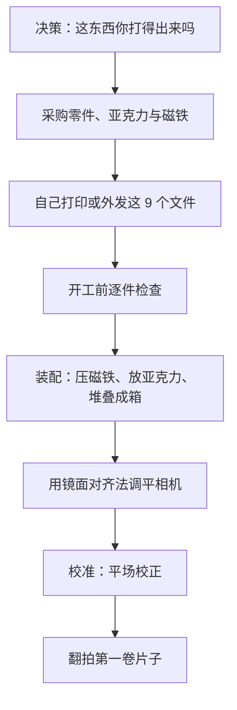

# 从这里开始

[English](getting-started.md) · **简体中文** · [日本語](getting-started.ja.md)

> 在花钱之前先读这一篇：NeoBox 是什么、你能不能做出来、需要自备哪些器材、总共要花多少钱和多长时间，以及各步骤的先后顺序。

**目录：** [本项目是否适合你](#本项目是否适合你) · [什么是相机翻拍](#什么是相机翻拍) · [你需要自备的器材](#你需要自备的器材) · [费用与时间](#费用与时间) · [整体流程](#整体流程) · [需要的技能](#需要的技能) · [常见问题](#常见问题) · [到哪里查资料](#到哪里查资料)

---

## 本项目是否适合你

NeoBox 是一只 3D 打印的闪光灯光源箱，放在相机下方，用来对 35 mm 和最大 6×9 的 120 底片做[相机翻拍](glossary.zh-CN.md#相机翻拍)（camera scanning，也叫 DSLR scanning）。组装好的整摞占地 124.8 × 154.8 mm、高 87 mm，放在桌面上用，不占地方。

一只裸机顶闪光灯平躺在桌面上，灯头怼着主箱**完全敞开的前口**，向腔内水平打光。没有任何光直接对着胶片。光要先在白色[混光腔](glossary.zh-CN.md#混光腔)（integrating cavity）里经过若干次漫反射，再向上穿过 62 × 95 mm 的透光窗和胶片正下方那块[乳白](glossary.zh-CN.md#乳白)亚克力[扩散板](glossary.zh-CN.md#扩散板)。前口是敞开的，环境光进得来：在昏暗的房间里拍，别让顶灯直射箱口。闪光的量远大于房间里那点光。

整套东西比听上去要少：

- **9 个打印件**（白色 2 件、黑色 7 件），九个 STL 全部免支撑，都是平面朝下打印。
- **1 块乳白亚克力扩散板**，68 × 118 × 2 mm，嵌进顶盖台的暗槽里。
- **32 颗磁铁加 4 片钢垫片**：Ø8 × 2 mm 的 N35 圆片过盈压进夹件，10 × 10 × 1 mm 的钢垫片沉在顶盖台里与台面齐平。
- **无螺丝、无螺纹、无粘接、无工具。** 整箱靠重力和磁吸组装；调平在相机端做，不在箱子上做。

> [!IMPORTANT]
> 这是第一个正式发布版。几何尺寸已在 Blender 源文件中逐项核对，九个 STL 全部是水密单实体，每一个水平面都落在 0.2 mm 网格上。但这套几何的箱子**从未被打印、拍摄、实测或做过均匀性测试**。你要是动手做了，你就是第一个。

**适合动手的人**：已经在拍胶片，手里有一台能架起来的相机；想要在[基准 ISO](glossary.zh-CN.md#基准-iso)、f/8 下拍摄，并且完全不用担心震动；不介意打印九个件、压几颗磁铁。要拧、要焊、要粘的东西，一样都没有。

**先别开始**：如果你既没有 3D 打印机，也找不到代打服务。所有受力件都是打印出来的，已发布的文件里没有第二条路。另外，如果你要拍 4×5，或者片子已经装在幻灯片框里，也请跳过，这两种都不支持，见[常见问题](#常见问题)。

> [!WARNING]
> **打印床尺寸先行确认。** 最大的两个件 `main-body.stl` 和 `cover-stage.stl` 占地同为 124.8 × 154.8 mm，一张 160 × 160 mm 的[打印床](glossary.zh-CN.md#打印床尺寸)就能打完整套，当下的桌面机基本都够。全部免支撑；唯一的方向规则是两个夹上盖顶面朝下打，其余全部平底朝下。如果你连 160 × 160 mm 的床都够不到，先把外发这条路落实，再花别的钱。

花钱之前先把三件事定下来：

- [ ] 你能不能打印、或者找到人打印占地 124.8 × 154.8 mm 的件？说白了，就是够不够得到一张 160 × 160 mm 的打印床。
- [ ] 你有没有、或者会不会买一只**支持手动出力**的热靴闪光灯？品牌不限，它待在箱子外面。
- [ ] 你有没有一支具备微距能力的镜头，以及能把相机端正地架在箱子正上方的东西？

三个都是「有」，就继续看[物料清单](bom.zh-CN.md#工具与耗材)。第一个是「没有」，到此为止。

## 什么是相机翻拍

相机翻拍就是用数码相机去拍一张背光的底片，而不是把它送进扫描仪。胶片架在一块均匀发光的表面之上，相机垂直向下拍，事后再把 [raw](glossary.zh-CN.md#raw) 文件[反相](glossary.zh-CN.md#反相)（inversion）。

跟平板扫描仪比，这笔买卖是拿前期调校换后期速度：把整套装置对齐要花一个晚上，但之后每一格就是按一次快门。跟送店冲扫比，底片始终在你自己手上，整个色彩判断也都归你。

NeoBox 只是这件事里「光源」的那一半。它取代的是看片灯板（light pad），至于你用什么相机，它一句都没管。而相机那一半是实打实的工作量，写在[翻拍](scanning.zh-CN.md#相机端器材)里。

## 你需要自备的器材

下面这些都不是打印件。闪光灯和引闪器以参考型号的身份列在[物料清单](bom.zh-CN.md#工具与耗材)里；其余的你必须已经有，本项目也一概不为它们计价。

| 你需要 | 为什么 | 价格 |
|---|---|---|
| 一台能手动曝光、能出 raw 的相机 | 曝光是手动定死的，一卷之内不再改动 | 此处不计价 |
| 一支具备微距能力的镜头 | 用全画幅拍满一格 135，需要 1:1 的[放大倍率](glossary.zh-CN.md#放大倍率)（magnification）；任何一支 1:1 微距镜都能覆盖本箱支持的全部画幅，画幅越大，用到的放大倍率越低 | 此处不计价 |
| 一台[翻拍台](glossary.zh-CN.md#翻拍台)（copy stand），或者带横臂、可倒置中轴的三脚架 | 胶片平面位于箱子落地面以上 83.2 mm；相机必须悬在它正上方并与之平行 | 此处不计价 |
| 一只支持手动出力的热靴闪光灯 | 就是光源本身。它平躺在桌面上、灯头怼着敞开前口，从不进箱；品牌不限，NEEWER TT560 只是参考型号 | 见物料清单 |
| 一套无线引闪器 | 发射端装在相机热靴上；接收端跟闪光灯一起留在箱外，信号不被箱体挡，换电池也不用碰箱子。参考型号：ZENIKO T1 | 见物料清单 |
| 一根快门线或遥控器 | 拍摄间隙手不碰相机 | 此处不计价 |
| 反相软件 | 把 raw 原片变成正像 | 此处不计价 |
| 一只气吹加一小块平面镜 | 气吹保证胶片（以及可选的玻璃）不落灰；平面镜是调平工具本身：让镜头自己的倒影在镜中居中 | 列在[物料清单](bom.zh-CN.md#工具与耗材)里 |

> [!NOTE]
> 相机那一侧是有意不计价的。一支微距镜和一套支架，本来就有就是零成本，也可能比这个项目其余部分加起来还贵，随便报一个数字就是在编。真正要紧的是：在下单买件之前，这些东西你得已经有了。

判断一只闪光灯合不合用，只看一点：**能不能手动调出力**。它的尺寸无所谓，灯头也不需要能转，因为它只是平躺在箱口而已。[TTL](glossary.zh-CN.md#ttl) 和[高速同步（HSS）](glossary.zh-CN.md#hss)在这里毫无用处，别为它们花钱。

## 费用与时间

价格都集中写在[物料清单](bom.zh-CN.md#工具与耗材)里，这一页只把开销分好堆：

| 你买的是什么 | 费用 |
|---|---|
| 全部结构件和箱内之物：九个 PLA 打印件、乳白亚克力、32 颗磁铁、4 片钢垫片 | 在物料清单中计价 |
| 机顶闪光灯（任何支持手动出力的热靴型号） | 参考型号在物料清单中计价 |
| 一套无线引闪器 | 参考型号在物料清单中计价 |
| 可选升级：防牛顿环玻璃、植绒贴 | 在物料清单中计价 |
| 相机、镜头、支架、快门线、软件 | 此处不计价 |

打印是件小活：没有任何件长过 154.8 mm，普通 PLA 就够，全部免支撑：层高 0.2 mm，填充 15%。

| 阶段 | 通常耗时 | 说明 |
|---|---|---|
| 3D 打印（自己打或找代打） | 数日 | 几乎总是关键路径；两种颜色，没有支撑要拆 |
| 乳白亚克力定制切割 | 数日 | 定制裁 68 × 118 × 2 mm；原型机时期的 110 × 130 mm 板可以让店家裁小续用 |
| 磁铁与钢垫片 | 通常最快到 | 全是现货规格，没有定制件 |
| 装配 | 几分钟 | 不用任何工具；压 32 颗磁铁占了大半工作量 |
| 第一次调校 | 一个晚上 | 先用镜子做相机端平行度，再查均匀性 |

> [!TIP]
> 这三笔单子的交期差别很大，所以要同一天一起下，而不是办完一笔再办下一笔。关键路径几乎总是打印。

## 整体流程

| 步骤 | 实际在做什么 | 写在哪一篇 |
|---|---|---|
| 决策 | 打印床尺寸（160 × 160 mm 就够）、闪光灯在不在手、你已经有什么 | 本页 |
| 采购 | 零件与耗材；淘宝话术；到货验收 | [物料清单](bom.zh-CN.md#工具与耗材) |
| 打印 | 九个 STL，普通 PLA：[层高](glossary.zh-CN.md#层高) 0.2 mm、填充 15%、无支撑 | [3D 打印](printing.zh-CN.md#找代打服务下单) |
| 逐件检查 | 开工前先量；现在发现件不对只是重打一件，装到一半才发现就是整台返工 | [3D 打印](printing.zh-CN.md#装配前逐件检查) |
| 装配 | 把 32 颗磁铁压进夹件，亚克力和钢垫片放进顶盖台，整箱堆叠起来，全程不用工具 | [装配](assembly.zh-CN.md#装配步骤) |
| 对齐 | 一小块平面镜放在胶片平面上，挪相机直到镜头自己的倒影居中；调的是相机，不是箱子 | [装配](assembly.zh-CN.md#第-7-步相机端调平镜子法) |
| 校准 | 拍一张不放胶片的发光面，先做[平场校正](glossary.zh-CN.md#平场校正)（flat-field correction），再谈均匀性 | [翻拍](scanning.zh-CN.md#平场校正与反相) |
| 第一卷 | 相机高度、对焦、闪光出力、装片、拍摄、反相 | [翻拍](scanning.zh-CN.md#装片) |
| 出问题了 | 症状 → 可能原因 → 处理，覆盖每一个阶段 | [排错](troubleshooting.zh-CN.md#打印) |

## 需要的技能

没什么冷门的。会照着切片软件的默认配置走、碰胶片时手是干净的，这东西你就做得出来。整个制作过程里没有螺丝刀、扳手、烙铁和胶水，也完全不需要动 CAD。设计不绑定任何一款闪光灯。

有两步特别容易翻车，都值得在真正做到之前先读两遍：

**磁铁极性。** 32 颗 Ø8 × 2 mm 磁铁要过盈压进夹件，每件 8 颗。每一颗都必须与对面件里的那颗相吸，而过盈配合压进去就没打算再取出来。所以每颗下压之前，先跟已经装好的对面磁铁比一下极性。

**平行度。** 胶片平面必须与传感器平行，而不只是水平。这套设计里，箱子上没有任何可调的东西。把一小块平面镜放在放胶片的位置，挪动相机，直到镜头自己的倒影正好落在画面正中。倒影一居中，传感器就与片平面平行了，下面所有打印件的公差也在同一步里被吸收掉。先平行度，后均匀性。

为什么整个设计围绕闪光灯，而不是常亮 LED 面板

闪光脉冲本身**就是**曝光。在昏暗的房间里，经混光腔打出来的闪光量远大于从敞开前口漏进来的环境光，而脉冲的持续时间只是任何真实快门时间的一个零头，机械震动、快门震动和地板传来的晃动就此不再重要。

好处还不止防震这一条。每一格得到的输出完全一致，一卷片子共用一条反相曲线。基准 ISO、f/8 就是这套设计的工作点，而氙气灯管给出的又是真正连续的日光平衡光谱。

## 常见问题

**有人真做出来过吗？** 没有。v1 的几何在 CAD 里逐项核对过尺寸，导出的文件也做过数值校验，但这套几何从来没有被打印、拍摄、实测或做过均匀性测试；打印过的只有旧原型机，它和 v1 几乎没有共同零件。所有关于光学的说法都请当成推演结果，而不是实测结果。

**能不能用 LED 面板代替闪光灯？** 用已发布的这套文件不行：没有发布 LED 版本，不采用的理由在上面那个折叠块里。物料清单里的可选 LED 灯带只是定位灯，从来不参与曝光。

**我的闪光灯装得进去吗？** 装得下，因为根本不用装进去。闪光灯平躺在桌面上、灯头怼着完全敞开的前口，它的任何尺寸都无关紧要。任何支持手动出力的热靴闪光灯都能用；NEEWER TT560 只是光路设计时参照的型号。

**磁铁一定要装吗？** 要，32 颗全装，4 片钢垫片也要。每个夹上盖里的 8 颗与夹底座里的 8 颗相吸，把夹子扣紧；底座磁铁同时吸住顶盖台里与台面齐平的钢垫片，夹子因此固定在台上，5 秒换画幅靠的也是它。不装的话，一切都只是靠自重搁着。

**220 × 220 mm 的打印床能打吗？** 能，整套都能，还很宽裕。没有任何件的占地超过 124.8 × 154.8 mm，所以 160 × 160 mm 的床就够，而且没有件需要支撑。

**防牛顿环玻璃是必需的吗？** 不是。默认压平元件是每个画幅一片的打印压片窗插片：窗口四边是硬限位，胶片最多拱起 0.28 mm，完全落在 1:1、f/8 下约 ±0.4 mm 的景深之内。防牛顿环玻璃（64 × 95 × 2 mm，一片两个画幅通用）是升级件，把整个画面连续封平；磨砂面贴着片基亮面，不起[牛顿环](glossary.zh-CN.md#牛顿环)，药膜面朝着下方的开窗，什么都不碰。

> [!CAUTION]
> 玻璃模式下，玻璃底面离焦平面只有 0.2 mm，落在那里的灰尘会直接进画面。元件装进去一次就不再动，所以装之前先用气吹吹干净。相比之下，乳白亚克力上的灰尘永远不会成像：它就落在发光面本身上，偶尔擦一擦就够了。

**支持 4×5 吗？** 不支持。胶片窗口 135 是 25 × 37 mm，120 是 57 × 85 mm（整格 6×9），夹子整体也只有 94 × 120 mm。已发布的文件里没有任何东西能处理页片。

**支持装框的幻灯片吗？** 不支持。135 的通道高 0.4 mm，是按裸片条的尺寸做的，带框的幻灯片进不去。没装框的反转片没问题。

**怎么过片、怎么换画幅？** 过片靠抽：捏住伸出夹外的片头直接拉。胶片滑过压平元件下方时，拱起的部位会被顺势压平，一卷拍完之前夹子不用打开。换画幅就是掀掉一副夹子、放上另一副，磁吸自动定位，5 秒钟的事。拍 6×6 时把遮幅插片垫在 120 底座下面，夹子整体会抬高 1 mm，属正常现象；6×4.5 没有专用遮幅，后期裁切。长片条的尾巴会搭在托盘凸缘上，比片平面略低，远端用手托一下。装片和取放写在[翻拍](scanning.zh-CN.md#装片)里。

## 到哪里查资料

这个项目同时用到三个行当的词汇（胶片摄影、光学和 FDM 打印），而且经常一句话里混着用。每个词都在[术语表](glossary.zh-CN.md#相机翻拍)里用一行给出定义，只定义一次。

碰到读不下去的词就先去那里查：[混光腔](glossary.zh-CN.md#混光腔)、[平场校正](glossary.zh-CN.md#平场校正)、[同步速度](glossary.zh-CN.md#同步速度)（sync speed）、[闪光指数](glossary.zh-CN.md#闪光指数)、[支撑](glossary.zh-CN.md#支撑)（supports）、[层高](glossary.zh-CN.md#层高)、[工作距离](glossary.zh-CN.md#工作距离)（working distance）、[牛顿环](glossary.zh-CN.md#牛顿环)（Newton rings）、[基准 ISO](glossary.zh-CN.md#基准-iso)、[EV](glossary.zh-CN.md#ev)。

想知道的是某个尺寸背后的道理而不是尺寸本身，工程内容在[设计](design.zh-CN.md#3-光学决策)文档里；设计日志则记录了试过什么、又为什么放弃。

---

← [README](../README.zh-CN.md) · [文档索引](../README.zh-CN.md#文档) · [物料清单](bom.zh-CN.md) →
