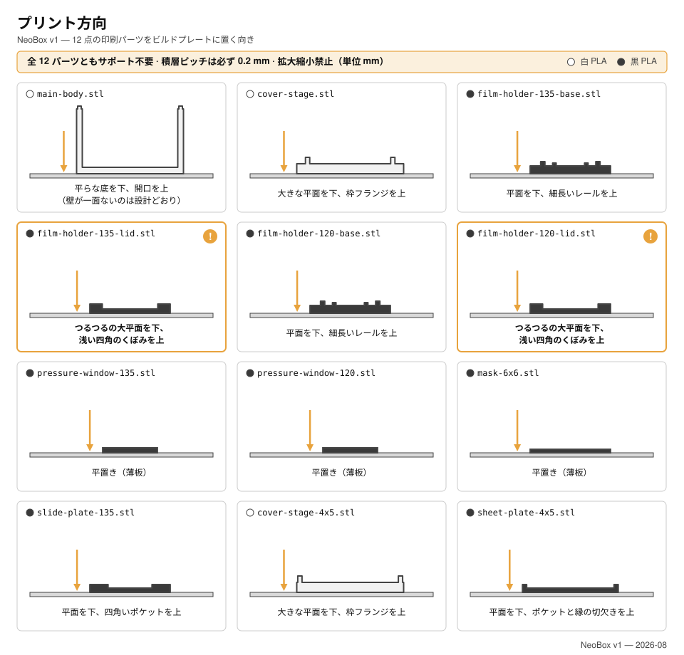

# 3D プリント

[English](printing.md) · [简体中文](printing.zh-CN.md) · **日本語**

> NeoBox の 9 点のパーツをどう出力するか。なぜほぼどのプリンタでも出せるのか、ビルド全体で共通の設定 1 組、ファイルごとのカード、そして組み立てに入る前に走らせる確認項目をまとめます。

**目次：** [お使いのプリンタで出力できるか](#お使いのプリンタで出力できるか) · [プリント設定](#プリント設定) · [フィラメント](#フィラメント) · [9 点のパーツ](#9-点のパーツ) · [まず 135 ホルダーを 1 組だけ出力する](#まず-135-ホルダーを-1-組だけ出力する) · [組み立てる前に各パーツを確認する](#組み立てる前に各パーツを確認する) · [きつい場合と緩い場合の対処](#きつい場合と緩い場合の対処) · [出力サービスへの発注](#出力サービスへの発注)

STL は 9 ファイル——**標準ビルドの 8 点＋オプションの 6×6 マスク 1 点**。うち白が 2 点、黒が 7 点です。すべて 1:1 のミリメートル・モデルで、すべてサポートなしで出力でき、フィラメントはセット全体でおよそ **300–350 g——v4 のほぼ 3 分の 1** です。


> [!CAUTION]
> スライサーにこれらのファイルをスケーリングさせないでください。「ビルドプレートに合わせて縮小」は出力の発注が失敗する最も多いパターンです。ファイルは最初から 1:1 であり、下の受け入れ検査はすべてそれが保たれている前提で書かれています。

> [!NOTE]
> この設計はまだ出力されていません——このページの記述はいずれも実機から得たものではありません。形状は CAD で検証済みです（権威は `cad/neobox.blend`）。リポジトリ内の SVG 図面は現在も旧世代 v4 の内容のままで、再生成の作業中です。数値と姿勢はすべてこのページの本文から取り、図からは取らないでください。

---

## お使いのプリンタで出力できるか

ほぼ間違いなく出力できます。ビルド最大のパーツ——本体と天板ステージ——はプレート上で 124.8 × 154.8 mm、最も高いのは 75.6 mm の本体です。**160 × 160 mm のビルドプレートがあればセット全体を出力できます**。つまり現行の小型機まで含めて、ほとんどすべてのデスクトップ機で足ります。v4 時代の大型パーツと筐体外注に関する警告は、v4 とともに廃止されました。

| パーツ | ビルドプレート上の設置面 | 高さ |
|---|---|---|
| `main-body.stl` | 124.8 × 154.8 | 75.6 |
| `cover-stage.stl` | 124.8 × 154.8 | 10.0 |
| `film-holder-*-base.stl`（2 点） | 94 × 120 | 5.0 |
| `film-holder-*-lid.stl`（2 点） | 94 × 120 | 3.0 |
| `pressure-window-*.stl`（2 点） | 64 × 95 | 2.0 |
| `mask-6x6.stl` | 94 × 80 | 1.0 |

---

## プリント設定

ビルド全体でこの設定 1 組です。このリポジトリの他の場所に出てくるプリント設定の記述は、すべてここを参照しています。

| 設定項目 | 値 | なぜその値か |
|---|---|---|
| スケール | 100 %、ミリメートル | ファイルはすでに 1:1 です。 |
| フィラメント | 通常の PLA——筐体 2 点は白、残りは黒 | [フィラメント](#フィラメント)を参照。 |
| [積層ピッチ](glossary.ja.md#積層ピッチ-layer-height)（layer height） | **全パーツ 0.2 mm** | 設計上の高さはすべて 0.2 mm グリッドに載っており、0.2 で出力すればどの面も層境界にちょうど乗ります。0.4 の段差は本物の 0.4 になります。 |
| [インフィル](glossary.ja.md#インフィル-infill)（infill） | 15 % | 自重以上の荷重を受けるパーツはありません。 |
| [サポート](glossary.ja.md#サポート-supports)（supports） | **どのパーツにも不要** | 全パーツが各カードの姿勢でサポートなしに出るよう設計されています。 |

> [!IMPORTANT]
> スライサーがどこかにサポートを提案してきたら、パーツの姿勢が間違っています——そのパーツのカードに戻ってください。[ブリッジ](glossary.ja.md#ブリッジ-bridging)（bridging）の調整も不要です。ビルド全体で最長のブリッジは、天板ステージ裏面のダボ穴の天井の 3.3 mm で、デフォルト設定で何事もなく渡れます。

<details>
<summary>なぜ形状を 0.2 mm に量子化しているのか、それで何が得られるのか</summary>

このプロジェクトの全パーツの背後にある製造ルールは、**各パーツの出力姿勢において、すべての水平面が 0.2 mm グリッドに乗り、露出する段差は 0.4 mm を下回らない**というものです。どちらの規則も、実際の出力発注の失敗から練り上げられたもので（[設計ログ 18 番](design-log.ja.md#18-ホルダーを積層ピッチに量子化)、姿勢については 20 番）、出力ショップがデフォルトプロファイルのまま流しても使えるパーツが出る理由でもあります。

| パーツ | ビルドプレートから測った水平面の高さ（mm） |
|---|---|
| `main-body.stl` | 0 · 3.0 · 73.0 · 75.6 |
| `cover-stage.stl` | 0 · 2.8 · 3.6 · 5.0 · 6.0 · 10.0 |
| ホルダー底（2 点） | 0 · 2.2 · 3.8 · 4.2 · 4.6 · 5.0 |
| ホルダー蓋（2 点、天面を下にして出力） | 0 · 1.0 · 3.0 |

どの数値も 0.2 の整数倍です。そしてビルド中で最も細かい露出段差——ホルダー底の 0.4 mm の受けとエレメント段——こそが、フィルム面を定義する 2 段です。だから仕様は全ファイルの積層ピッチを 0.2 mm に固定しています：どの面も層境界にちょうど乗り、0.4 の段差はきれいな 2 層になり、スライサーの丸めに委ねるものがなくなります。0.28 のような粗いピッチではグリッドが層境界の間に落ちます——わずかに安くはなりますが、ぼやけるのはフィルム面を支えるまさにその段差です。

</details>

**ノズル。** ビルド最小の形状はホルダー底の 0.4 mm の段差で、最も薄い壁は 2.4 mm です。標準の 0.4 mm ノズルですべてのパーツを出力できます。

---

## フィラメント

### 通常の PLA を 2 色

仕様はセット全体で通常の PLA です——エンジニアリング系フィラメントも、特殊な表面仕上げの材料も要りません。

**筐体 2 点は白。** 本体の内側そのものが反射面です。ストロボは完全に開いた前面（オープンフロント）から腔内に発光し、白い壁と天板ステージの白い裏面の間で何度も反射してからフィルムに届きます。白い生地の面が光学面**そのもの**です。

> [!IMPORTANT]
> 白は通常の白 PLA を使ってください——シルク・サテンなどの特殊仕上げは避けてください——そして内側の面には手を入れないこと。塗装・研磨・コーティングはいずれも不可です。白壁の生地のままの反射率は光学設計の一部です。

**フィルムの近くにある 7 点は黒。** フィルムが至近距離で「見る」もの——ホルダー底とホルダー蓋、押さえ窓インサート、マスク——はすべて黒で、迷光を吸収します。

**数量。** セット全体でおよそ **300–350 g**、v4 のほぼ 3 分の 1 です。各色 1 巻きで何度でも作れる量です。

---

## 9 点のパーツ



### パーツ各部の呼び方

ここでの出力指示は、必ず実物で見える特徴の名前を使い、見えない面は指しません。語の意味は次のとおりです。

| ここで使う語 | 実物のどこを見ているか |
|---|---|
| レール | ホルダー底の、フィルムの走る方向に通る 2 本の長い外側リブの一方 |
| 受け | レールの内側に沿う細い凸の棚。フィルムの両縁がここに載る |
| エレメント段 | レールに切られた 4.6 mm の段。押さえエレメントがここに載る |
| 溝 | 受けと押さえエレメントの間の 0.4 mm の隙間。フィルムはここを引き抜く |
| 窓 | 撮影のために開いた長方形の穴 |
| 押さえエレメント | エレメント段に載るもの。既定はプリントした押さえ窓インサート、アップグレードはオプションのアンチニュートンガラス |
| 位置決めダボ | 本体の側壁の上面にある 4 個の小さな凸の一つ |
| ダボ穴 | 天板ステージ裏面の四隅にある 4 個の受け口の一つ。位置決めダボがここに嵌まる |
| トレイフランジ | 天板ステージの上面に立ち上がる枠。フィルムホルダーはこの枠の中に座る |

> [!CAUTION]
> 姿勢の罠は 2 つ、パーツ族ごとに 1 つずつです。**ホルダー底**は平らな面を下にして出力します——レールのある面をビルドプレートに向けてはいけません。受けとエレメント段が宙に浮き、溝は出ません。**ホルダー蓋**は逆で、平らな**天面**を下にし、浅い凹みとマグネット穴が上を向くようにします。姿勢を誤ったホルダーはすでに一度ショップに届いています（[設計ログ 20 番](design-log.ja.md)）。下の各カードが見える特徴で置き方を指定しているのは、そのためです。

### [main-body.stl](../stl/white-pla/main-body.stl)

- **白。** 124.8 × 154.8 × 75.6——セット最大で、出力時間も最長のパーツです。
- **プレート上の姿勢：** 平らな底面を下に。3 面の壁が底から立ち上がり、4 面目——完全に開いた前面——には壁がそもそもありません。これは設計であって、壊れたファイルではありません。4 個の位置決めダボは側壁の上面に載っています。
- **サポート：不要。** オープンフロントは「無い」だけでオーバーハングではなく、このパーツに宙に浮く形状はありません。
- **注意：** 内側の面は光学面です。研磨も塗装も不可。

### [cover-stage.stl](../stl/white-pla/cover-stage.stl)

- **白。** 124.8 × 154.8 × 10.0。この 1 点が v4 の天板とフィルムステージを統合したパーツです。
- **プレート上の姿勢：** 四隅にダボ穴のある平らな面を下に。立ち上がるトレイフランジが上を向きます。
- **サポート：不要。** ダボ穴の天井が 3.3 mm のブリッジになります——これがビルド最長のブリッジで、それでも取るに足りません。
- **このパーツのその他：** 62 × 95 の透光窓、上面のすぐ下にある乳白アクリルの受け座、鋼シムを入れる小さな角形の座ぐり 4 個、フィルムホルダーを位置決めするトレイフランジ。

### [film-holder-135-base.stl](../stl/black-pla/film-holder-135-base.stl)

- **黒。** 94 × 120 × 5.0。窓 25 × 37。
- **プレート上の姿勢：** 平らな面を下、2 本の長いレールを上に。溝の両端には短いガイドリブがあり、フィルムを導き入れます。
- **サポート：不要。** マグネットポケットも段差もすべて上向きに開きます。
- **注意：** このパーツの受けとエレメント段がフィルム面を定義します——0.2 mm 積層を使うなら、効くのはここです。

### [film-holder-135-lid.stl](../stl/black-pla/film-holder-135-lid.stl)

- **黒。** 94 × 120 × 3.0。窓 25 × 37。
- **プレート上の姿勢：天面を下に。** 窓のほかに何もない平らな面をプレートに当て、浅い長方形の凹みと 8 個のマグネット穴のある面を上に向けます。
- **サポート：不要**——この姿勢では凹みもポケットもすべて上向きに開きます。

### [film-holder-120-base.stl](../stl/black-pla/film-holder-120-base.stl)

- **黒。** 94 × 120 × 5.0。窓 57 × 85——6×9 のフルフレーム——で、溝の幅は 62 mm。
- **プレート上の姿勢：** 平らな面を下、2 本の長いレールを上に。
- **サポート：不要。**
- **注意：** 135 の底と同じです——受けとエレメント段がフィルム面です。

### [film-holder-120-lid.stl](../stl/black-pla/film-holder-120-lid.stl)

- **黒。** 94 × 120 × 3.0。窓 57 × 85。
- **プレート上の姿勢：天面を下に**。135 の蓋とまったく同じで、凹みとマグネット穴が上です。
- **サポート：不要。**

### [pressure-window-135.stl](../stl/black-pla/pressure-window-135.stl)

- **黒。** 64 × 95 × 2.0、窓 25 × 37。135 の既定の押さえエレメントで、135 の底のエレメント段に載ります。
- **プレート上の姿勢：** 平置き、平らな底面を下に。
- **サポート：不要。**

### [pressure-window-120.stl](../stl/black-pla/pressure-window-120.stl)

- **黒。** 64 × 95 × 2.0、窓 57 × 85。120 の既定の押さえエレメントです。
- **プレート上の姿勢：** 平置き、平らな底面を下に。
- **サポート：不要。**
- **補足：** フォーマット別に分かれる押さえエレメントはこの 2 点のインサートだけです。オプションのアンチニュートンガラスは 64 × 95 の 1 枚で両フォーマットに共用できます。

### [mask-6x6.stl](../stl/black-pla/mask-6x6.stl)——オプション

- **黒。** 94 × 80 × 1.0、窓 56.5 × 56.5。
- **プレート上の姿勢：** 平置き。
- **サポート：不要。**
- **出力するのは** 6×6 を撮る場合だけです。120 の底の下、トレーの中に敷いて窓を正方形に絞ります。6×4.5 のマスクはありません——6×4.5 は後処理でトリミングします。

---

## まず 135 ホルダーを 1 組だけ出力する

残りのファイルに踏み切る前に、`film-holder-135-base.stl`・`film-holder-135-lid.stl`・`pressure-window-135.stl` を出力してください。セット中でも小さい部類の 3 点でありながら、この 3 点で重要な嵌合をひととおり試せます。マグネットポケット、エレメント段、0.4 mm の溝です。

この最初の 1 組で確認するのは 4 点です。

- **段。** 押さえ窓インサートが 4.6 mm のエレメント段に落ちて平らに座り、蓋がその上に閉じること。わずかな遊びは設計どおりです——蓋の凹みがエレメントの浮きを 0.4 mm 以内に制限します。
- **溝。** インサートを載せ蓋を閉じた状態で、フィルムストリップが引っかかりも擦れもなく引き抜けること。
- **マグネット。** Ø8 × 2 のマグネットが各ポケットに押し込めること。これは設計上の締まり嵌めです——押し込むと簡単には戻せないので、底側と蓋側のマグネットがどの向きで吸い合うかを、押し込む**前に**突き合わせて確かめておくこと。
- **平面度。** 底がガタつかずに座ること。フィルム面はこの上に載ります。

どれかが外れていたら、ここで直してください——[きつい場合と緩い場合の対処](#きつい場合と緩い場合の対処)を参照——そのうえで残りの黒パーツ、最後に白 2 点の順で出力します。

---

## 組み立てる前に各パーツを確認する

機械から降ろしたとき、あるいは出力サービスの箱から出したときに、以下の項目を確認してください。最初の 3 項目はスライサーがファイルをスケーリングした事故を捕まえます。

- [ ] `main-body.stl` の外形が 124.8 × 154.8 あること。
- [ ] `cover-stage.stl` が 124.8 × 154.8 で、4 個のダボ穴が自重で本体の 4 個の位置決めダボに落ち着くこと。
- [ ] フィルムホルダーの各パーツの外形が底・蓋とも 94 × 120 であること。
- [ ] 押さえ窓インサートが 64 × 95 で、対応する底のエレメント段に落ちること。
- [ ] Ø8 × 2 のマグネットが、底と蓋のすべてのポケットに押し込めること。
- [ ] インサートを入れ蓋を閉じた状態で、出力した各ホルダーをフィルムストリップが通り抜けること。
- [ ] 出力した場合：`mask-6x6.stl` が 94 × 80 で、120 の底の下のトレーに収まること。
- [ ] 本体の内側に研磨・磨き・塗装をしていないこと。生地のままの白い面が反射面です。

外れた項目には下に対処があります。あるいは[トラブルシューティング](troubleshooting.ja.md#プリント)を参照してください。

---

## きつい場合と緩い場合の対処

嵌合をきつい順に並べます。XY 方向の補正は PrusaSlicer と OrcaSlicer では *XY size compensation*、Cura では *Horizontal expansion* という名前です。小刻みに変えて、一度に出し直すのは 1 パーツだけ。セット全体を刷り直さないこと。

| 嵌合部 | 公称 | きつすぎる場合 | 緩すぎる場合 |
|---|---|---|---|
| 溝 | 受けと押さえエレメントの間 0.4 mm | まずエレメントがエレメント段に完全に座っているか確認し、受けの縁とエレメントの縁のバリをホビーナイフで取る。それでもフィルムが引っかかるなら、XY 補正に手を出す前に、底を 0.2 mm 積層で出し直す——受けと段が層境界にちょうど乗ります。 | わずかなガタは正常です。0.4 mm の溝に対しフィルムの厚みは約 0.12–0.18 mm しかなく、引き抜くときに溝がフィルムを平らに押さえて通します。 |
| 押さえエレメントとエレメント段 | 段の上に 64 × 95 | 細かいサンドペーパーで**エレメント側**の縁を軽く整える——削るのはエレメントだけで、段は絶対に削らない。 | 問題ありません。蓋の凹みがエレメントの浮きを 0.4 mm 以内に制限します。 |
| 天板ステージのダボ穴と位置決めダボ | ダボ 4 個、2.4 × 12 | ダボ穴の口をナイフで軽くさらう。足りなければ[エレファントフット](glossary.ja.md#エレファントフット-elephant-foot)（elephant foot）補正を有効にして出し直す。 | 無害です。ダボ穴は位置決めであり、保持しているのは重力です。 |
| マグネットポケット | Ø8 × 2 のマグネット | 締まり嵌めは設計どおりです——真っ直ぐ、しっかり押し込む。どうしても入らないときだけポケットの口をナイフでさらう。ネオジムマグネットを叩き込まないこと——欠けます。 | 瞬間接着剤を一滴。位置を決めるのはポケット、保持するのは接着剤です。 |

> [!CAUTION]
> きつい溝を緩めるために、受けやエレメント段を研磨・やすりがけ・「仕上げ」してはいけません。この 2 段が**フィルム面そのもの**であり、ここで取り除いた材料は取り返しのつかない平面度誤差になります。きつい溝はスライサー側（0.2 mm 積層、わずかな XY 補正）か、交換可能なエレメント側で直します。底の段には決して手を入れないこと。

---

## 出力サービスへの発注

プリンタがまったくなくても、これはもう小さな注文です。9 ファイル、通常の PLA がおよそ 300–350 g、サポートは一切なし、どのパーツも 160 × 160 mm のビルドプレートに収まります。検索ワードは `3Dプリント 出力代行 PLA`。次の文面をそのまま送ってください——全ファイル名を挙げ、オペレーターの画面で見える特徴で置き方を指定してあります。

```text
STL 9 ファイル：必須 8 点＋任意 1 点（mask-6x6）。
単位はミリ、1:1。スケール変更は不可。

通常の PLA。積層ピッチは全パーツ 0.2 mm。インフィル 15 %。サポートはどのパーツにも不要。
どのパーツも 160 x 160 mm のビルドプレートに収まります。

白 PLA - 2 点:
  main-body.stl        124.8 x 154.8 x 75.6。
                       平らな底面をプレートに、壁を上に。1 面だけ壁があり
                       ませんが、これは設計でありデータの破損ではありません。
                       内側の面は研磨・塗装・コーティングをしないでください。
  cover-stage.stl      124.8 x 154.8 x 10。
                       四隅に受け口のある平らな面をプレートに、立ち上がる
                       長方形の枠を上に。

黒 PLA - 6 点 + 任意 1 点:
  film-holder-135-base.stl  平らな面をプレートに、2 本の長いリブを上に。
  film-holder-120-base.stl  同じ配置。
  film-holder-135-lid.stl   平らな天面をプレートに。浅い凹みと 8 個の
  film-holder-120-lid.stl   マグネット穴のある面を上に。
  pressure-window-135.stl   薄い平板。平置き。
  pressure-window-120.stl   薄い平板。平置き。
  mask-6x6.stl（任意）      薄い平板。平置き。
```

**支払う前に 3 つ質問してください。** 出力サービスは先に注文を受けてから問題に気づきます。

1. 全ファイルを 100 % スケール・ミリ単位で出力しますか——「プレートに合わせて縮小」はしませんか。
2. 白のフィラメントは通常の白 PLA ですか——シルクでも光沢でもないもの。
3. 2 点のホルダー蓋を、文面どおり天面を下にして配置してもらえますか。

**ショップが設定に難色を示したら、**先方のデフォルトプロファイルに任せて構いません。デフォルトで通るように形状を量子化してあります——すべての水平面が 0.2 mm グリッドに乗り、露出段差は 0.4 mm 以上。譲れないのは「スケールしない」「姿勢は文面どおり」「サポートなし」の 3 点だけです。

この文面の各言語版——タオバオ向けの中国語、その他向けの英語——は[発注文面](bom.ja.md#発注文面)にあり、出力以外に買うものの調達先もそこにまとまっています。

---

← [部品表と調達](bom.ja.md) · [ドキュメント索引](../README.ja.md#ドキュメント) · [組み立て](assembly.ja.md) →
