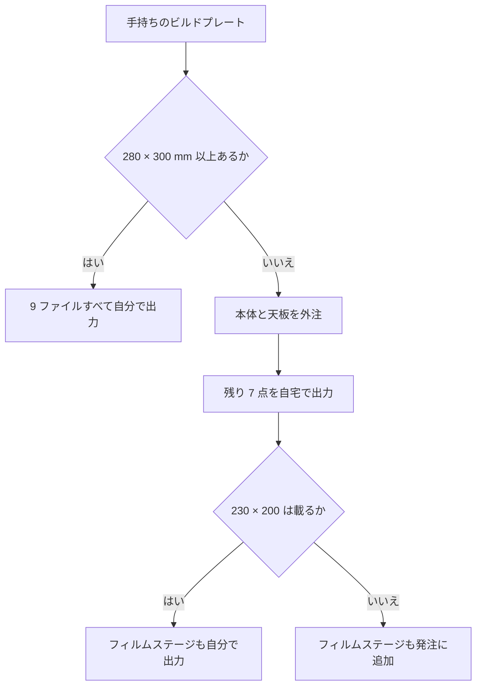

# 3D プリント

[English](printing.md) · [简体中文](printing.zh-CN.md) · **日本語**

> NeoBox の 9 点のパーツをどう出力するか。手持ちの機械でそもそも出せるのかの判定、ビルド全体で共通の設定 1 組、ファイルごとのカード、そして組み立てに入る前に走らせる確認項目をまとめます。

**目次：** [お使いのプリンタで出力できるか](#お使いのプリンタで出力できるか) · [プリント設定](#プリント設定) · [フィラメント](#フィラメント) · [9 点のパーツ](#9-点のパーツ) · [まず 135 ホルダーを 1 組だけ出力する](#まず-135-ホルダーを-1-組だけ出力する) · [組み立てる前に各パーツを確認する](#組み立てる前に各パーツを確認する) · [きつい場合と緩い場合の対処](#きつい場合と緩い場合の対処) · [出力サービスへの発注](#出力サービスへの発注)

STL は 9 ファイル——**標準ビルドの 8 点＋オプションの 6×6 マスク 1 点**。うち白が 3 点、黒が 6 点です。すべて 1:1 のミリメートル・モデルです。


> [!CAUTION]
> スライサーにこれらのファイルをスケーリングさせないでください。「ビルドプレートに合わせて縮小」は出力の発注が失敗する最も多いパターンで、273 mm のパーツはまさにそれを誘発します。載らないパーツがあるときの答えは、大きな機械であって小さなパーツではありません。

> [!NOTE]
> この設計はまだ出力されていません。形状は CAD と書き出し済みファイルの両方で検証済みで、全パーツが非多様体エッジ 0 の水密なシングルソリッド、かつ出力姿勢におけるすべての水平面が 0.2 mm グリッド上に乗っていることを `tools/verify_stl.py` で確認しています。このページの記述はいずれも実機から得たものではありません。

---

## お使いのプリンタで出力できるか

ここは可否の判定です。フィラメントを買う前に決着をつけてください。

制約になるのは **天板** の 214.6 × 279.6 mm であって、それよりわずかに小さい本体ではありません。この 2 点を出すには **280 × 300 mm 以上**の[ビルドプレート](glossary.ja.md#ビルドプレートのサイズ-bed-size)（bed size）が要ります。残りは小型機でも余裕があります。

| パーツ | ビルドプレート上の設置面 | 220 × 220 のプレート | 256 × 256 のプレート | 280 × 300 以上のプレート |
|---|---|---|---|---|
| `top-cover.stl` | 279.6 × 214.6 | 不可 | 不可 | 可 |
| `main-body.stl` | 273 × 208 | 不可 | 不可 | 可 |
| `film-stage-printed.stl` | 230 × 200 | 要確認——下記参照 | 可 | 可 |
| `access-panel.stl` | 200 × 78 | 可 | 可 | 可 |
| `film-holder-*`（4 点すべて） | 170 × 110 | 可 | 可 | 可 |
| `mask-6x6.stl` | 110 × 80 | 可 | 可 | 可 |

220 × 220 や 256 × 256 の機械——Bambu X1C や P1S、Prusa MK4——では、本体と天板は**出力できません**。この 2 点を外注し、残りを自宅で出力してください。プリント版フィルムステージは長辺が 230 mm なので、220 × 220 のプレートでは、出力に踏み切る前に自分の実効エリアを実測してください。それより大きければ余裕です。



本体に分割版はありません。白い[拡散チャンバー](glossary.ja.md#積分キャビティ-integrating-cavity)（integrating cavity）の中に接着シームがあれば、それは光漏れであり反射率の不連続でもあります。筐体はまさにそれを避けるために存在します。

---

## プリント設定

ビルド全体でこの設定 1 組です。このリポジトリの他の場所に出てくるプリント設定の記述は、すべてここを参照しています。

| 設定項目 | 値 | なぜその値か |
|---|---|---|
| スケール | 100 %、ミリメートル | ファイルはすでに 1:1 です。 |
| [積層ピッチ](glossary.ja.md#積層ピッチ-layer-height)（layer height） | **全パーツ 0.2 mm**。代替は 0.1 mm のみ | 全パーツのすべての水平面が 0.2 mm の整数倍です。 |
| [外周壁](glossary.ja.md#外周壁-perimeters)（perimeters） | 3 周以上 | 筐体の壁は 3 mm しかなく、遮光しなければなりません。 |
| [インフィル](glossary.ja.md#インフィル-infill)（infill） | 15–25 %。フィルムステージのみ **30 % 以上** | ステージはホルダーを支え、平面を保つ必要があります。 |
| [サポート](glossary.ja.md#サポート-supports)（supports） | 2 点のみ——各カード参照 | それ以外はサポートなしで出るよう設計しています。 |
| フィラメント | 筐体はつや消し白、フィルム周りはすべて黒 | 光沢はホットスポットを作り、黒は迷光を吸収します。 |

> [!WARNING]
> **積層 0.12 mm と 0.16 mm は絶対に使わないでください。** ホルダーの 0.4 mm 形状も天板の 2.0 mm 段差も割り切れず、スライサーはそれらの面を意図した高さから黙ってずらします。

<details>
<summary>なぜ 0.2 mm ならすべて割り切れるのか、0.16 mm で何が壊れるのか</summary>

ホルダーは、z 方向のすべての形状が 0.2 mm の整数倍で、露出する段差がどれも 2 層を下回らないように切り直してあります（[設計ログ 18 番](design-log.ja.md#18-ホルダーを積層ピッチに量子化)）。出力ショップがデフォルトプロファイルのまま流しても使える[溝](#パーツ各部の呼び方)が出るのは、そのためです。

| パーツ | 露出する最小段差 |
|---|---|
| フィルムホルダー（4 点すべて） | 0.4 mm |
| `mask-6x6.stl` | 1.0 mm |
| `top-cover.stl` | 2.0 mm |
| `access-panel.stl` | 3.0 mm |
| `main-body.stl` | 4.0 mm |
| `film-stage-printed.stl` | 5.0 mm |

0.2 はこの 6 つすべてを割り切ります。0.1 もすべて割り切ります。0.16 は 0.4・2.0・3.0・5.0・1.0 のいずれも割り切りません。0.12 は 0.4・2.0・1.0・5.0 を割り切りません。この量子化こそ現行ホルダー形状の要点です——スライサーで捨てないでください。

</details>

**ノズル。** ビルド中で最もタイトなのはフィルムの溝と受けの逃げの 0.4 mm、そして押さえリブとレールの間の側面クリアランス 0.3 mm——これがビルド最小の隙間です。黒パーツには 0.4 mm の形状をきれいに出せるノズルを使ってください。白の筐体 3 点には 2 mm を下回る形状がなく——本体 4.0、アクセスパネル 3.0、天板 2.0——太めのノズルでも問題ありません。

**大型の白パーツ 2 点の定着。** `main-body.stl` は 273 × 208 mm で壁は 3 mm、`top-cover.stl` はそれよりさらに大きい寸法です。ここで角が反るのは見た目の問題では済みません。天板は公称 0.3 mm の側面クリアランスで本体に載るので、縁が反ればその隙間を食い潰します。清掃したプレートに、家の中でいちばん風の当たらない場所で、機械が好む定着補助を使って出力してください。

**フィラメントの見積り。** **ビルド全体でおよそ 1–1.3 kg**——白がおよそ 0.7–0.95 kg、黒がおよそ 0.25–0.4 kg。これは合計であって、白パーツだけの量ではありません。

---

## フィラメント

### つや消し白は好みではなく要件

内側そのものが反射面です。箱の中には塗装もライナーもありません。白いフィラメントの生地が拡散面**そのもの**であり、ストロボはフィルムにではなく横向きにそこへ向けて発光します。

> [!IMPORTANT]
> シルク・サテン・光沢の白フィラメントは、光を散らす代わりにストロボの発光部をホットスポットとして再現します。仕上げはマットでなければなりません。これは後から直せない唯一のフィラメント特性です——内側は塗れません。塗装は光学設計全体が依存している反射率を変えてしまうからです。

### 黒パーツは PLA と PETG のどちらか

どちらでも成立します。PETG は丈夫で、1 本のフィルムごとに開閉するホルダーに向きます。PLA は平らに出るので、フィルムステージが求めるのはこちらです。黒を 1 巻きしか買わないなら PLA が安全な既定値です——ホルダーの下では、丈夫さより平面度のほうが効きます。

---

## 9 点のパーツ


### パーツ各部の呼び方

ここでの出力指示は、必ず実物で見える特徴の名前を使い、見えない面は指しません。語の意味は次のとおりです。

| ここで使う語 | 実物のどこを見ているか |
|---|---|
| レール | ホルダー底の長手方向に走る 2 本の長いリブ |
| 受け | 各レールのすぐ内側にある細い棚。フィルムの縁がここに載る |
| 溝 | 受けとホルダー蓋の間にある 0.4 mm の隙間。フィルムはここを通る |
| 窓 | 撮影のために開いた長方形の穴 |
| 押さえリブ | ホルダー蓋の裏面にある 2 本の短いリブ |
| コーナーブロック | フィルムステージの四隅にある L 字のブロック 4 個 |
| 立ち上がり縁 | 天板の外周を一周する高さ 10 mm の下向きの壁 |
| インサートポスト | 天板の裏側にある 3 本の丸い柱 |
| プラグ | アクセスパネルの裏面にある長方形の出っ張り |
| まぐさ | 本体のアクセス開口の上にある壁 |

> [!CAUTION]
> ホルダー底とホルダー蓋を、凸のある面をビルドプレート側に向けて出力しないでください。パーツをレールの頂点で立たせ、フィルムの受けを宙に浮かせることになり、溝は出ません。平らな面が必ず下です。この間違いはすでに一度ショップに届いており、設計ログ 20 番はそのために存在します。

### [main-body.stl](../stl/white-pla/main-body.stl)

- **白・つや消し。** STL バウンディングボックス 273 × 208 × 92。ソリッド体積 434 cm³——ビルド最大の体積なので、出力時間も最長と見てください。
- **読み込み後の回転：**不要。正しい向きで読み込まれます。
- **プレート上の姿勢：**平らな底面を下、拡散チャンバーの大きく開いた口を上。
- **サポート：必要。** 要るのは前面の壁のアクセス開口の上にある幅 190 mm のまぐさだけです——開口の全幅を無支持で渡す[ブリッジ](glossary.ja.md#ブリッジ-bridging)（bridging）になります。
- **このパーツのその他：**右側壁の Ø12 ケーブルグランド穴。こちらはサポート不要です。190 × 76 のアクセス開口には必要——上記のとおり。

### [top-cover.stl](../stl/white-pla/top-cover.stl)

- **白・つや消し。** STL バウンディングボックス 279.6 × 214.6 × 14。ソリッド体積 223 cm³。ビルド最大の設置面です。
- **読み込み後の回転：X 軸まわりに 180°。** 立ち上がり縁と柱が下向きで読み込まれるため、そのままでは上下逆に出力されます。
- **プレート上の姿勢：**大きな平面——100 × 120 の開口が貫通している面——を下。10 mm の立ち上がり縁と 3 本の丸いインサートポストが上を向きます。
- **サポート：**不要。
- **注意：**本体に対する 0.3 mm の側面クリアランスを決めているのがこの立ち上がり縁です。1 層目をきれいに出してください。

### [access-panel.stl](../stl/white-pla/access-panel.stl)

- **白・つや消し。** パーツ寸法 200 × 78 × 16。書き出し状態では立っており、STL バウンディングボックスは 200 × 16 × 78 です。ソリッド体積 108 cm³。
- **読み込み後の回転：**寝かせます。プラグ面がビルドプレートに接するように向けてください。
- **プレート上の姿勢：**裏面の長方形のプラグ（186 × 72 × 4）をプレートに、取っ手を上。
- **サポート：必要。** フェイス板がプラグより全周 3–7 mm 張り出しています。その庇の下にサポートが要ります——ほかは不要です。

### [film-holder-135-base.stl](../stl/black-pla/film-holder-135-base.stl)

- **黒。** STL バウンディングボックス 170 × 110 × 5.0（パーツ外形 110 × 170）。ソリッド体積 69 cm³。
- **読み込み後の回転：**不要。
- **プレート上の姿勢：**大きな平面を下、2 本の長いレールが上。溝幅 35.4 mm、窓 25 × 37。
- **サポート：**不要。

### [film-holder-135-lid.stl](../stl/black-pla/film-holder-135-lid.stl)

- **黒。** STL バウンディングボックス 170 × 110 × 3.4（パーツ外形 110 × 170）。ソリッド体積 54 cm³。
- **読み込み後の回転：X 軸まわりに 180°。** 押さえリブが下向きで読み込まれます。
- **プレート上の姿勢：**大きな平面を下、2 本の短い押さえリブが上。
- **サポート：**不要。

### [film-holder-120-base.stl](../stl/black-pla/film-holder-120-base.stl)

- **黒。** STL バウンディングボックス 170 × 110 × 5.0（パーツ外形 110 × 170）。ソリッド体積 53 cm³。
- **読み込み後の回転：**不要。
- **プレート上の姿勢：**大きな平面を下、2 本の長いレールが上。溝幅 62.0 mm、窓 57 × 85——6×9 まで覆えるのがこちらです。
- **サポート：**不要。

### [film-holder-120-lid.stl](../stl/black-pla/film-holder-120-lid.stl)

- **黒。** STL バウンディングボックス 170 × 110 × 3.4（パーツ外形 110 × 170）。ソリッド体積 42 cm³。
- **読み込み後の回転：X 軸まわりに 180°。** 135 の蓋と同じで、リブが下向きで読み込まれます。
- **プレート上の姿勢：**大きな平面を下、2 本の短い押さえリブが上。
- **サポート：**不要。

### [film-stage-printed.stl](../stl/black-pla/film-stage-printed.stl)

- **黒。** STL バウンディングボックス 230 × 200 × 11。板そのものは 200 × 230 × 5 で、四隅のコーナーブロックが一体成形され全体で 11 mm まで立ち上がります。ソリッド体積 174 cm³。
- **読み込み後の回転：**不要。
- **プレート上の姿勢：**平らな裏面を下、四隅のコーナーブロックが上。ブロックはモデルの一部であって欠陥ではありません——ショップから「削り取りましょうか」と言われることがあります。
- **サポート：**不要。
- **設定の例外：**インフィル 30 % 以上。独自の設定を持つのはこのパーツだけです。
- **注意：**Ø6.5 の穴 3 つは[バカ穴](glossary.ja.md#バカ穴とタップ穴-clearance-hole-vs-tapped-hole)（clearance hole）であり、ねじではありません。どの段階でも、誰も、ここにタップを立ててはいけません。

### [mask-6x6.stl](../stl/black-pla/mask-6x6.stl)——オプション

- **黒。** STL バウンディングボックス 110 × 80 × 1。ソリッド体積 5.6 cm³。
- **読み込み後の回転：**不要。厚さ 1 mm の平板なので、どちらの面が上でも構いません。
- **サポート：**不要。
- **出力するのは**6×4.5 か 6×6 を撮る場合で、120 の窓を絞りたいときだけです。

---

## まず 135 ホルダーを 1 組だけ出力する

残り 7 ファイルに踏み切る前に、`film-holder-135-base.stl` と `film-holder-135-lid.stl` を出力してください。69 cm³ と 54 cm³ でビルド中でも小さい部類でありながら、この 2 点でプロジェクト中のタイトな形状をひととおり試せます。その後は外側へ向かって進みます——残りの黒パーツ、そして体積が最大の白い大型 2 点を最後に。

この最初の 1 組で確認するのは 3 点です。

- **溝。** フィルムストリップがガタつきも引っかかりもなく滑ること。
- **マグネットポケット。** Ø6 × 2 のマグネットが押し込めて、そのまま留まること。接着する前に、底側と蓋側のマグネットを突き合わせて、どちらの向きで吸い合うか確かめておくこと。
- **平面度。** ホルダー底がガタつかずに座ること。ホルダー底は[乳白アクリル拡散板](glossary.ja.md#拡散板-diffuser)（opal acrylic diffuser）に直接載るので、ガタつく底はフィルム面の傾きを意味します。

3 点のどれかが外れていたら、フィラメントを 1 kg 使い切ってからではなく、ここで直してください——[きつい場合と緩い場合の対処](#きつい場合と緩い場合の対処)を参照。

---

## 組み立てる前に各パーツを確認する

機械から降ろしたとき、あるいは出力サービスの箱から出したときに、以下の項目を確認してください。最初の 4 項目はスライサーがファイルをスケーリングした事故を捕まえます。

- [ ] `top-cover.stl` が立ち上がり縁の外側で 279.6 × 214.6 あること。
- [ ] `main-body.stl` が外形 273 × 208 で、前面の壁のアクセス開口が 190 × 76 であること。
- [ ] `film-stage-printed.stl` が 200 × 230 で、板厚 5 mm、コーナーブロックが全体で 11 mm まで立ち上がっていること。
- [ ] フィルムホルダーの外形が底・蓋とも 110 × 170 であること。
- [ ] 天板が無理な力なしに自重で本体に落ち込むこと。
- [ ] M6 の寸切りボルトが、フィルムステージの Ø6.5 の穴 3 つすべてを自重で通り抜けること。**タップは立てないこと。**
- [ ] アクセスパネルのプラグが 190 × 76 のアクセス開口に全周クリアランスを持って入ること——約 2 mm で、これは EVA フォームが埋めます。
- [ ] Ø6 × 2 のマグネットが、ホルダー底とホルダー蓋のすべてのポケットに押し込めること。
- [ ] 出力したホルダーそれぞれの溝を、フィルムストリップが通り抜けること。
- [ ] 本体の内側に研磨・磨き・塗装をしていないこと。生地のままのつや消し白面が反射面です。

外れた項目には下に対処があります。あるいは[トラブルシューティング](troubleshooting.ja.md#プリント)を参照してください。

---

## きつい場合と緩い場合の対処

嵌合をきつい順に並べます。XY 方向の補正は PrusaSlicer と OrcaSlicer では *XY size compensation*、Cura では *Horizontal expansion* という名前です。小刻みに変えて、一度に出し直すのは 1 パーツだけ。セット全体を刷り直さないこと。

| 嵌合部 | 公称 | きつすぎる場合 | 緩すぎる場合 |
|---|---|---|---|
| 天板と本体 | 片側 0.3 mm | 立ち上がり縁の内側を最初の 2 層分だけ削り落とす。足りなければ[エレファントフット](glossary.ja.md#エレファントフット-elephant-foot)（elephant foot）補正を有効にして再出力。 | 自重で座っているなら問題なし。遮光をより確実にしたければ、壁の上縁にオプションの EVA テープを一周貼る。 |
| フィルムの溝 | 0.4 mm | まず溝の入口をホビーナイフで面取りする——たいていはこれで直ります。それでもフィルムが引っかかるなら、モデルを編集せず XY 補正をわずかにマイナスして再出力。 | フィルムがガタつく場合は XY 補正をわずかにプラスして再出力。ただしクリアランスは意図的なもので、0.4 mm の溝に対しフィルムの厚みは約 0.14 mm しかありません。 |
| アクセスパネルとアクセス開口 | 全周およそ 2 mm | EVA フォームを薄く切る。パネルは摩擦嵌合で、調整代はフォームの側です。 | EVA をもう一巻き足す。これのためにパネルを刷り直さないこと。 |
| マグネットポケット | Ø6 × 2 のマグネット | ナイフでポケットを少し広げる。ネオジムマグネットを力任せに押し込まないこと——欠けます。 | そのまま瞬間接着剤で固定。位置を決めるのはポケット、保持するのは接着剤です。 |
| フィルムステージの穴 | Ø6.5 | 6.5 mm のドリルを手で回してさらい、M6 の寸切りボルトが落ちるまで広げる。 | 無害です。板を挟持しているのは上下のナットであって、穴ではありません。 |

> [!CAUTION]
> フィルムステージの穴には絶対にタップを立てず、機械屋に「ねじにしておきましょう」と改良させないでください。下の[インサートナット](glossary.ja.md#インサートナット-heat-set-insert)（heat-set insert）にねじ込まれた寸切りボルトの上で板側にもねじが切られていると、それは[差動ねじ](glossary.ja.md#差動ねじ-differential-screw)（differential screw）になります。ナットを回しても、板は同一ピッチ 2 つの差——つまりゼロ——しか動きません。水平出しが機能しなくなり、直す方法は新しい板だけです。

---

## 出力サービスへの発注

プリンタがない場合——あるいはビルドプレートが 280 × 300 mm に届かない場合——は出力サービスが答えです。検索ワードは `3Dプリント 出力代行 大型 PLA`。

次の文面をそのまま送ってください。全ファイル名、オペレーターの画面で見える特徴による姿勢指定、そしてサポートが要る 2 か所だけを書いてあります。

```text
STL 9 ファイル：必須 8 点＋任意 1 点。単位はミリ、1:1。スケール変更は不可。

必須:
  1. 全ファイル積層ピッチ 0.2 mm。0.12 mm と 0.16 mm は不可。
  2. 各パーツは下記のとおりに配置。
  3. サポートは 2 か所のみ:
       - main-body.stl: 前面の壁にある幅 190 mm の開口の上辺。
       - access-panel.stl: フェイス板が庇になっている外周。
     ほかのパーツにサポートは不要。

白 PLA・マット - 3 点:
  main-body.stl        273 x 208 x 92。ビルドプレート 280 x 300 mm 以上が必要。
                       平らな底面をプレートに、大きな開口を上。
                       前面の壁にある幅 190 mm の開口の上辺にサポート。
  top-cover.stl        279.6 x 214.6 x 14。この注文で最大の設置面。
                       大きな平面をプレートに、10 mm の立ち上がり縁と
                       3 本の丸い柱を上に。サポート不要。
  access-panel.stl     200 x 78 x 16。読み込むと立っています - 寝かせてください。
                       裏面の長方形の出っ張りをプレートに、取っ手を上に。
                       庇になっている外周のみサポート。

黒 PLA - 5 点:
  film-holder-135-base.stl  平らな面をプレートに、2 本の長いレールを上に。
  film-holder-120-base.stl  同じ配置。サポート不要。
  film-holder-135-lid.stl   平らな面をプレートに、2 本の短いリブを上に。
  film-holder-120-lid.stl   同じ配置。サポート不要。蓋は 2 点ともリブが
                            下向きで読み込まれるので裏返してください。
  film-stage-printed.stl    200 x 230 の板。平らな面をプレートに、四隅の
                            コーナーブロックを上に。ブロックは設計上の形状
                            です - 削り取らないでください。インフィル 30 % 以上。

任意 - 1 点（黒 PLA）:
  mask-6x6.stl         110 x 80 x 1。平置き、どちらの面が上でも可。サポート不要。

推奨（難しければ御社のデフォルトで結構です）:
  外周 3 周以上。インフィルはフィルムステージ以外 15-25 %。
  マットのフィラメント。白はシルクや光沢を使わないでください。
  main-body.stl の内側は研磨・磨き・コーティングをしないでください。
```

**支払う前に 3 つ質問してください。** 出力サービスは先に注文を受けてから問題に気づきます。

1. どの機械で出力しますか。その実効ビルドエリアはいくつですか。
2. 273 × 208 × 92 を分割せずに一体で出力できますか。
3. **マット**の白 PLA はありますか——シルクでも光沢でもないもの。

どれか一つでも「いいえ」なら、そのショップに筐体は作れません。黒パーツなら任せられます。

**ショップが設定に難色を示したら、**積層が 0.2 mm か 0.1 mm で回るかぎり、先方のプロファイルに任せて構いません。ホルダー形状は、まさにデフォルトプロファイルで通るように 0.2 mm へ量子化してあります。積層ピッチ以外で譲れないのは、サポートの 2 か所と「スケールしない」ことだけです。

この文面の各言語版——タオバオ向けの中国語、国内サービス向けの日本語、その他向けの英語——は[発注文面](bom.ja.md#発注文面)にあり、出力以外に買うものの調達先もそこにまとまっています。

---

← [部品表と調達](bom.ja.md) · [ドキュメント索引](../README.ja.md#ドキュメント) · [組み立て](assembly.ja.md) →
