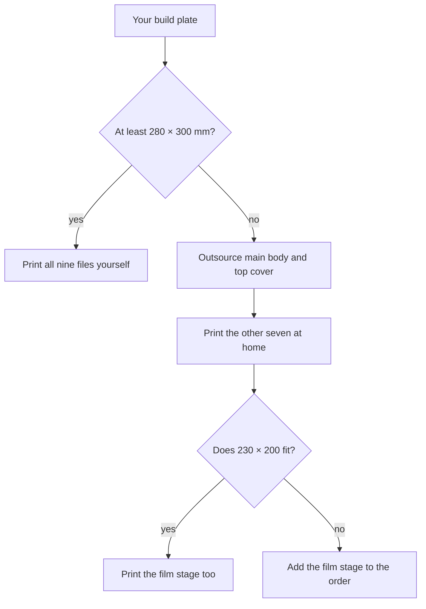

# Printing

**English** · [简体中文](printing.zh-CN.md) · [日本語](printing.ja.md)

> How to print the nine NeoBox parts: whether your machine can do it at all, one set of settings for the whole build, a card per file, and the checks to run before you assemble anything.

**Contents:** [Will it fit your printer?](#will-it-fit-your-printer) · [Print settings](#print-settings) · [Filament](#filament) · [The nine parts](#the-nine-parts) · [Print one 135 holder first](#print-one-135-holder-first) · [Check each part before you assemble](#check-each-part-before-you-assemble) · [If it came out tight or loose](#if-it-came-out-tight-or-loose) · [Ordering from a print service](#ordering-from-a-print-service)

Nine STL files: **eight for the default build plus one optional 6×6 mask**. Three are white, six are black. All are 1:1 in millimetres.


> [!CAUTION]
> Never let a slicer scale these files. "Scale to fit the build plate" is the single most common way a print order goes wrong, and a 273 mm part is exactly what triggers it. If a part will not fit, the answer is a bigger machine — not a smaller part.

> [!NOTE]
> This design has not been printed. The geometry is verified in CAD and in the exported files — every part is a watertight single solid with 0 non-manifold edges, and every horizontal face sits on the 0.2 mm grid in its print orientation, checked by `tools/verify_stl.py`. Nothing on this page comes from a machine.

---

## Will it fit your printer?

This is a go/no-go, so settle it before you buy filament.

The binding constraint is the **top cover** at 214.6 × 279.6 mm — not the main body, which is slightly smaller. Between them, those two parts need a [bed](glossary.md#bed-size) of **at least 280 × 300 mm**. Everything else is comfortable on a small machine.

| Part | Footprint on the build plate | 220 × 220 bed | 256 × 256 bed | ≥ 280 × 300 bed |
|---|---|---|---|---|
| `top-cover.stl` | 279.6 × 214.6 | No | No | Yes |
| `main-body.stl` | 273 × 208 | No | No | Yes |
| `film-stage-printed.stl` | 230 × 200 | Check — see below | Yes | Yes |
| `access-panel.stl` | 200 × 78 | Yes | Yes | Yes |
| `film-holder-*` (all four) | 170 × 110 | Yes | Yes | Yes |
| `mask-6x6.stl` | 110 × 80 | Yes | Yes | Yes |

On a 220 × 220 or 256 × 256 machine — a Bambu X1C or P1S, a Prusa MK4 — the main body and the top cover **cannot** be printed. Outsource those two and print the rest at home. The printed film stage is 230 mm on its long axis, so on a 220 × 220 bed measure your own usable area before committing; on anything larger it is comfortable.



There is no split version of the main body. A glued seam in the [cavity](glossary.md#integrating-cavity) is a light leak and a reflectance discontinuity, which is precisely what the enclosure exists to avoid.

---

## Print settings

One settings block for the whole build. Every other mention of a print setting in this repository refers back to here.

| Setting | Value | Why it is this value |
|---|---|---|
| Scale | 100 %, millimetres | The files are already 1:1. |
| [Layer height](glossary.md#layer-height) | **0.2 mm on every part**; 0.1 mm is the only alternative | Every horizontal face in every part is a multiple of 0.2 mm. |
| [Perimeters](glossary.md#perimeters) | ≥ 3 | The enclosure walls are 3 mm and have to be light-tight. |
| [Infill](glossary.md#infill) | 15–25 %; film stage **≥ 30 %** | The stage carries the holder and has to stay flat. |
| [Supports](glossary.md#supports) | Two parts only — see their cards | Everything else is designed to print support-free. |
| Filament | Matte white for the enclosure, black for everything near the film | Gloss makes a hot spot; black absorbs stray light. |

> [!WARNING]
> **Never use 0.12 mm or 0.16 mm layers.** They do not divide the holder's 0.4 mm features or the top cover's 2.0 mm step, and the slicer will quietly shift those faces off their intended height.

<details>
<summary>Why 0.2 mm divides everything, and what breaks at 0.16</summary>

The holders were re-cut so that every z-feature is a multiple of 0.2 mm and no exposed step is thinner than two layers ([design log entry 18](design-log.md#18-layer-quantised-holders)). That is what lets a print shop run its default profile and still get a working [channel](#part-vocabulary).

| Part | Minimum exposed step |
|---|---|
| Film holders (all four) | 0.4 mm |
| `mask-6x6.stl` | 1.0 mm |
| `top-cover.stl` | 2.0 mm |
| `access-panel.stl` | 3.0 mm |
| `main-body.stl` | 4.0 mm |
| `film-stage-printed.stl` | 5.0 mm |

0.2 divides all six. 0.1 divides all six. 0.16 divides none of 0.4, 2.0, 3.0, 5.0 or 1.0; 0.12 divides none of 0.4, 2.0, 1.0 or 5.0. The quantisation is the whole point of the current holder geometry — do not throw it away in the slicer.

</details>

**Nozzle.** The tightest features in the build are the film channel and the land relief at 0.4 mm, and the 0.3 mm side clearance between the pressure strips and the rails — the tightest feature in the build. Use a nozzle that resolves a 0.4 mm feature cleanly for the black parts. The three white enclosure parts have no feature under 2 mm — main body 4.0, access panel 3.0, top cover 2.0 — and are happy with a coarser nozzle.

**Bed adhesion on the two big white parts.** `main-body.stl` is 273 × 208 mm with 3 mm walls, and `top-cover.stl` is larger still. A lifted corner is not cosmetic here: the top cover sits on the main body with a nominal 0.3 mm side clearance, and a warped rim eats all of it. Print them on a clean plate, in the least draughty spot you have, and use whatever adhesion aid your machine likes.

**Filament budget.** About **1–1.3 kg for the whole build** — white about 0.7–0.95 kg, black about 0.25–0.4 kg. That is the total, not the white parts alone.

---

## Filament

### Matte white is a requirement, not a preference

The interior is the reflector. There is no paint and no liner inside the box: the bare white filament *is* the diffusing surface, and the flash fires sideways into it rather than at the film.

> [!IMPORTANT]
> Silk, satin and glossy white filaments reproduce the flash head as a hot spot instead of scattering it. The finish has to be matte. This is the one filament property you cannot fix later — you cannot paint the inside, because paint changes the reflectance the whole optical design depends on.

### PLA or PETG for the black parts

Either works. PETG is tougher, which suits a holder that is opened and closed once per roll; PLA prints flatter, which is what the film stage wants. If you only want to buy one black spool, PLA is the safer default — flatness under the holder matters more than toughness.

---

## The nine parts


### Part vocabulary

Print instructions here always name a feature you can see on the part, never a hidden face. This is what the words mean:

| Word used here | What you are looking at |
|---|---|
| Rail | One of the two long ridges running the length of a holder base |
| Land | The narrow shelf just inside each rail that the film edge rests on |
| Channel | The 0.4 mm gap between the land and the holder lid that the film slides through |
| Window | The rectangular hole you photograph through |
| Pressure strip | One of the two short ribs on the underside of a holder lid |
| Corner blocks | The four L-shaped blocks at the corners of the film stage |
| Rim | The 10 mm downstand wall around the edge of the top cover |
| Insert post | One of the three round pillars under the top cover |
| Plug | The raised rectangular boss on the back of the access panel |
| Lintel | The wall above the access opening in the main body |

> [!CAUTION]
> Never print a holder base or lid with the ridged side facing the build plate. It stands the part on its rail crests and leaves the film lands hanging over air, and the channel will not come out. The flat face always goes down. This mistake reached a vendor once already, and design log entry 20 exists because of it.

### [main-body.stl](../stl/white-pla/main-body.stl)

- **White, matte.** STL bounding box 273 × 208 × 92. Solid volume 434 cm³ — the largest volume in the build, so expect it to be the longest print.
- **Rotation after import:** none. It loads the right way up.
- **On the plate:** the flat floor down, the big open mouth of the cavity up.
- **Supports: yes.** The only place that needs them is the 190 mm lintel over the access opening in the front wall — an unsupported [bridge](glossary.md#bridging) across the full width of the opening.
- **Also on this part:** the Ø12 cable-gland hole in the right wall. It needs no support. The 190 × 76 access opening does — see above.

### [top-cover.stl](../stl/white-pla/top-cover.stl)

- **White, matte.** STL bounding box 279.6 × 214.6 × 14. Solid volume 223 cm³. Largest footprint in the build.
- **Rotation after import: 180° about X.** It loads rim-and-posts down, which would print it inverted.
- **On the plate:** the big flat face — the one with the 100 × 120 aperture through it — down. The 10 mm rim and the three round insert posts point up.
- **Supports:** none.
- **Watch:** the rim is what gives the 0.3 mm side clearance onto the main body. Keep the first layer tidy.

### [access-panel.stl](../stl/white-pla/access-panel.stl)

- **White, matte.** Part size 200 × 78 × 16. As exported it stands on edge — STL bounding box 200 × 16 × 78. Solid volume 108 cm³.
- **Rotation after import:** lay it down. Turn it so the plug face meets the build plate.
- **On the plate:** the raised rectangular plug (186 × 72 × 4) down against the plate; the handle points up.
- **Supports: yes.** The face plate overhangs the plug by 3–7 mm all the way round. That rim needs support underneath — nothing else does.

### [film-holder-135-base.stl](../stl/black-pla/film-holder-135-base.stl)

- **Black.** STL bounding box 170 × 110 × 5.0 (part outline 110 × 170). Solid volume 69 cm³.
- **Rotation after import:** none.
- **On the plate:** the big flat face down; the two long rails point up. Channel width 35.4 mm, window 25 × 37.
- **Supports:** none.

### [film-holder-135-lid.stl](../stl/black-pla/film-holder-135-lid.stl)

- **Black.** STL bounding box 170 × 110 × 3.4 (part outline 110 × 170). Solid volume 54 cm³.
- **Rotation after import: 180° about X.** It loads with the pressure strips pointing down.
- **On the plate:** the big flat face down; the two short pressure strips point up.
- **Supports:** none.

### [film-holder-120-base.stl](../stl/black-pla/film-holder-120-base.stl)

- **Black.** STL bounding box 170 × 110 × 5.0 (part outline 110 × 170). Solid volume 53 cm³.
- **Rotation after import:** none.
- **On the plate:** the big flat face down; the two long rails point up. Channel width 62.0 mm, window 57 × 85 — this is the one that covers 6×9.
- **Supports:** none.

### [film-holder-120-lid.stl](../stl/black-pla/film-holder-120-lid.stl)

- **Black.** STL bounding box 170 × 110 × 3.4 (part outline 110 × 170). Solid volume 42 cm³.
- **Rotation after import: 180° about X.** Same as the 135 lid — it loads strips-down.
- **On the plate:** the big flat face down; the two short pressure strips point up.
- **Supports:** none.

### [film-stage-printed.stl](../stl/black-pla/film-stage-printed.stl)

- **Black.** STL bounding box 230 × 200 × 11. The plate itself is 200 × 230 × 5; the four corner blocks are printed integral and rise to 11 mm overall. Solid volume 174 cm³.
- **Rotation after import:** none.
- **On the plate:** the flat underside down; the four corner blocks point up. They are part of the model, not a defect — a shop may offer to "clean them off".
- **Supports:** none.
- **Settings exception:** infill ≥ 30 %. This is the only part with its own setting.
- **Watch:** the three Ø6.5 holes are [clearance holes](glossary.md#clearance-hole-vs-tapped-hole), not threads. Nobody should tap them at any stage.

### [mask-6x6.stl](../stl/black-pla/mask-6x6.stl) — optional

- **Black.** STL bounding box 110 × 80 × 1. Solid volume 5.6 cm³.
- **Rotation after import:** none. It is a flat 1 mm plate, either way up.
- **Supports:** none.
- **Print it only if** you shoot 6×4.5 or 6×6 and want the 120 window masked down.

---

## Print one 135 holder first

Print `film-holder-135-base.stl` and `film-holder-135-lid.stl` before you commit to the other seven files. At 69 cm³ and 54 cm³ they are among the smallest parts in the build, and between them they exercise every tight feature in the project. Then work outward: the remaining black parts next, and the two large white parts — the biggest volumes — last.

Three things to check on that first pair:

- **The channel.** A film strip slides through smoothly, with no slop and no binding.
- **The magnet pockets.** A Ø6 × 2 magnet presses in and stays put. Before you glue anything, offer a base magnet and a lid magnet up to each other so you know which way round they attract.
- **Flatness.** The holder base sits flat with no rocking. The base presses directly on the [opal acrylic diffuser](glossary.md#diffuser), so a rocking base means a tilted film plane.

If any of the three is wrong, fix it here — see [If it came out tight or loose](#if-it-came-out-tight-or-loose) — rather than after 1 kg of filament.

---

## Check each part before you assemble

Run these as parts come off the machine or out of the box from a print service. The first four catch a slicer that scaled the file.

- [ ] `top-cover.stl` measures 279.6 × 214.6 across the rim.
- [ ] `main-body.stl` measures 273 × 208 outside, and the access opening in the front wall is 190 × 76.
- [ ] `film-stage-printed.stl` measures 200 × 230, with the plate 5 mm thick and the corner blocks rising to 11 mm overall.
- [ ] The film holders measure 110 × 170 in outline, base and lid alike.
- [ ] The top cover drops onto the main body under its own weight, without forcing.
- [ ] An M6 stud falls through all three Ø6.5 holes in the film stage under its own weight. **Do not tap them.**
- [ ] The access-panel plug enters the 190 × 76 access opening with clearance all round — about 2 mm, which the EVA foam will take up.
- [ ] Ø6 × 2 magnets press into every pocket in the holder base and lid.
- [ ] A film strip slides through the channel of each holder you printed.
- [ ] Nothing inside the main body has been sanded, polished or painted. The bare matte white surface is the reflector.

Anything that fails has a remedy below, or in [troubleshooting](troubleshooting.md#printing).

---

## If it came out tight or loose

Fits, in order of how tight they are. XY compensation is called *XY size compensation* in PrusaSlicer and OrcaSlicer and *Horizontal expansion* in Cura; change it in small steps and reprint one part, never the whole set.

| Fit | Nominal | Too tight | Too loose |
|---|---|---|---|
| Top cover onto main body | 0.3 mm per side | Scrape the first two layers off the inside of the rim; enable [elephant-foot](glossary.md#elephant-foot) compensation and reprint if that is not enough. | It still seats by its own weight. Run the optional EVA strip along the top of the wall for a tighter light seal. |
| Film channel | 0.4 mm | Deburr the channel mouths with a hobby knife first — that fixes most cases. If the film still binds, reprint with a small negative XY compensation instead of editing the model. | The film rattles: reprint with a small positive XY compensation. Some clearance is intended; the film is only about 0.14 mm thick in a 0.4 mm channel. |
| Access panel in the access opening | about 2 mm all round | Trim the EVA foam thinner. The panel is a friction fit and the foam is the adjustment. | Add another wrap of EVA. Do not reprint the panel for this. |
| Magnet pockets | Ø6 × 2 magnets | Ease the pocket with a knife. Never press a neodymium magnet in by force — it chips. | Glue them anyway with cyanoacrylate; the pockets locate, the glue holds. |
| Film-stage holes | Ø6.5 | Ream by hand with a 6.5 mm drill until an M6 stud drops through. | Harmless. The nuts above and below clamp the plate, not the hole. |

> [!CAUTION]
> Never tap the film-stage holes, and never let a machinist "improve" them into threads. A threaded plate running on a stud that is also threaded into the [heat-set insert](glossary.md#heat-set-insert) below forms a [differential screw](glossary.md#differential-screw): turning the nut moves the plate by the difference between two identical pitches, which is nothing. The levelling stops working and the only fix is a new plate.

---

## Ordering from a print service

If you have no printer — or a bed under 280 × 300 mm — a print service is the route. Send this text as-is. It names every file, the orientation by a feature the operator can see, and the only two places that need support.

```text
9 STL files: 8 required + 1 optional. Millimetres, 1:1. DO NOT SCALE.

MUST:
  1. Default 0.2 mm layers on every part. Never 0.12 or 0.16 mm.
  2. Place each part as written below.
  3. Support in two places only:
       - main-body.stl: the top edge of the 190 mm wide opening in the front wall.
       - access-panel.stl: the overhanging rim of the face plate.
     No other part needs support.

WHITE PLA, MATTE - 3 parts:
  main-body.stl        273 x 208 x 92, needs a bed of at least 280 x 300 mm.
                       Flat floor on the plate, big open mouth facing up.
                       Support the top edge of the 190 mm opening in the front wall.
  top-cover.stl        279.6 x 214.6 x 14. Largest footprint in the order.
                       Big flat face on the plate; the 10 mm rim and the three
                       round pillars point up. No support.
  access-panel.stl     200 x 78 x 16. The file loads standing on edge - lay it down.
                       The raised rectangular boss on the back goes on the plate,
                       the handle points up. Support the overhanging rim only.

BLACK PLA - 5 parts:
  film-holder-135-base.stl  Flat face on the plate, the two long ridges point up.
  film-holder-120-base.stl  Same placement. No support.
  film-holder-135-lid.stl   Flat face on the plate, the two short ribs point up.
  film-holder-120-lid.stl   Same placement. No support. Both lids load rib-side
                            down and must be turned over.
  film-stage-printed.stl    200 x 230 plate. Flat face on the plate, the four
                            corner blocks point up. The blocks are part of the
                            design - please do not remove them. Infill 30% or more.

OPTIONAL - 1 part (black PLA):
  mask-6x6.stl         110 x 80 x 1. Flat, either way up. No support.

PREFERRED (use your defaults if these are awkward):
  Perimeters 3 or more. Infill 15-25% except the film stage.
  Matte filament. The white parts must NOT be silk or glossy.
  Do not sand, polish or coat the inside of main-body.stl.
```

**Ask three questions before you pay.** Print services take the order first and discover the problem afterwards.

1. What machine will you print this on, and what is its usable build area?
2. Can you print 273 × 208 × 92 in one piece, without splitting it?
3. Do you have **matte** white PLA — not silk, not glossy?

If the answer to any of them is no, that shop cannot do the enclosure. It can still do the black parts.

**If the shop pushes back on the settings,** let them use their own profile, provided it runs 0.2 mm or 0.1 mm layers. The holder geometry was quantised to 0.2 mm precisely so that default profiles work. Beyond the layer height, only the two support locations and "do not scale" are load-bearing.

Vendor-language versions of this text — Chinese for Taobao, Japanese for Japanese services — are in [vendor scripts](bom.md#vendor-scripts), along with sourcing for everything you buy rather than print.

---

← [Bill of materials](bom.md) · [Documentation index](../README.md#documentation) · [Assembly](assembly.md) →
