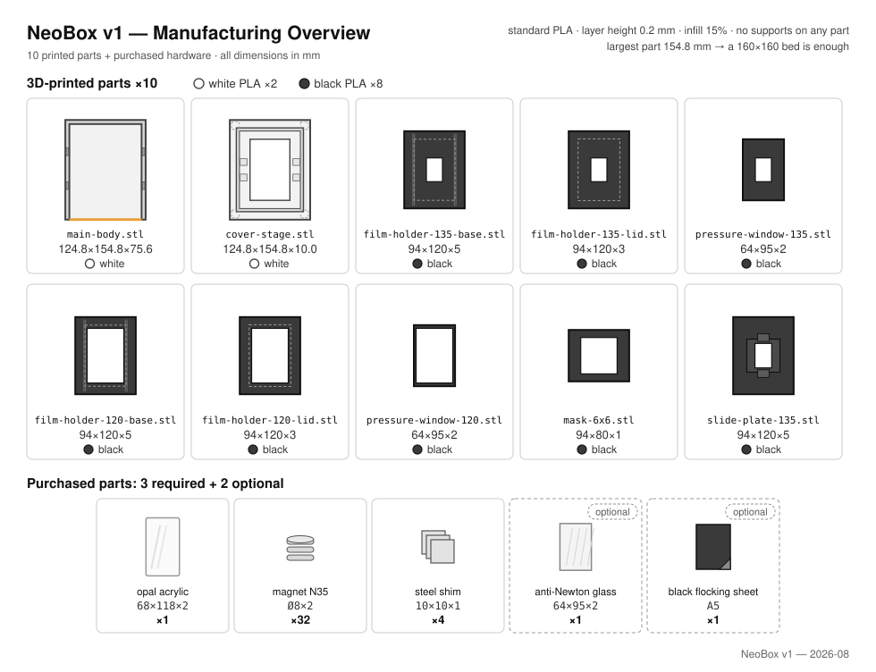
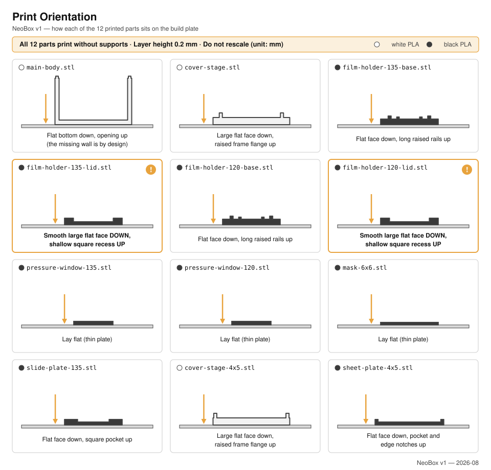

# Printing

**English** · [简体中文](printing.zh-CN.md) · [日本語](printing.ja.md)

> How to print the nine NeoBox parts: why almost any printer can, one set of settings for the whole build, a card per file, and the checks to run before you assemble anything.

**Contents:** [Will it fit your printer?](#will-it-fit-your-printer) · [Print settings](#print-settings) · [Filament](#filament) · [The nine parts](#the-nine-parts) · [Print one 135 holder first](#print-one-135-holder-first) · [Check each part before you assemble](#check-each-part-before-you-assemble) · [If it came out tight or loose](#if-it-came-out-tight-or-loose) · [Ordering from a print service](#ordering-from-a-print-service)

Nine STL files: **eight for the default build plus one optional 6×6 mask**. Two are white, seven are black. All are 1:1 in millimetres, all print without supports, and the whole set weighs about **300–350 g of filament — roughly a third of what v4 needed**.



> [!CAUTION]
> Never let a slicer scale these files. "Scale to fit the build plate" is the single most common way a print order goes wrong. The files are already 1:1, and every acceptance check below assumes they stayed that way.

> [!NOTE]
> This design has not been printed — nothing on this page comes from a machine. The geometry is verified in CAD (`cad/neobox.blend` is the authority).

---

## Will it fit your printer?

Yes, almost certainly. The largest parts in the build — the main body and the cover-stage — are 124.8 × 154.8 mm on the plate, and the tallest is the main body at 75.6 mm. **A 160 × 160 mm bed prints everything**, which today means practically every desktop machine, including the smallest current ones. The v4 warnings about oversized parts and outsourcing the enclosure went away with v4.

| Part | Footprint on the plate | Height |
|---|---|---|
| `main-body.stl` | 124.8 × 154.8 | 75.6 |
| `cover-stage.stl` | 124.8 × 154.8 | 10.0 |
| `film-holder-*-base.stl` (both) | 94 × 120 | 5.0 |
| `film-holder-*-lid.stl` (both) | 94 × 120 | 3.0 |
| `pressure-window-*.stl` (both) | 64 × 95 | 2.0 |
| `mask-6x6.stl` | 94 × 80 | 1.0 |

---

## Print settings

One settings block for the whole build. Every other mention of a print setting in this repository refers back to here.

| Setting | Value | Why it is this value |
|---|---|---|
| Scale | 100 %, millimetres | The files are already 1:1. |
| Filament | Plain PLA — white for the two enclosure parts, black for the rest | See [Filament](#filament). |
| [Layer height](glossary.md#layer-height) | **0.2 mm on every part** | Every height in the design sits on a 0.2 mm grid, so at 0.2 every face lands exactly on a layer boundary — a printed 0.4 step is a true 0.4 step. |
| [Infill](glossary.md#infill) | 15 % | Nothing carries a load beyond its own stack. |
| [Supports](glossary.md#supports) | **None, on any part** | Every part is designed to print support-free in the orientation on its card. |

> [!IMPORTANT]
> If your slicer proposes support anywhere, the part is oriented wrong — go back to its card. There is also no [bridging](glossary.md#bridging) to tune: the longest bridge in the whole build is the 3.3 mm roof of the locating notches under the cover-stage, which default settings clear without a thought.

<details>
<summary>Why the geometry is quantised to 0.2 mm, and what that buys you</summary>

The manufacturing rule behind every part in this project: **every horizontal face sits on a 0.2 mm grid in the part's print orientation, and no exposed step is thinner than 0.4 mm.** Both rules came out of real vendor orders going wrong ([design log entry 18](design-log.md#18-layer-quantised-holders), and entry 20 for orientation), and they are the reason a print shop's default profile produces a working part.

| Part | Horizontal faces, measured from the plate (mm) |
|---|---|
| `main-body.stl` | 0 · 3.0 · 73.0 · 75.6 |
| `cover-stage.stl` | 0 · 2.8 · 3.6 · 5.0 · 6.0 · 10.0 |
| Holder bases (both) | 0 · 2.2 · 3.8 · 4.2 · 4.6 · 5.0 |
| Holder lids (both, printed top face down) | 0 · 1.0 · 3.0 |

Every number is a multiple of 0.2, and the finest exposed steps in the build — the 0.4 mm land and ledge steps on the holder bases — are exactly the ones that define the film plane. That is why the spec pins the layer height to 0.2 mm on every file: each of those faces lands exactly on a layer boundary, a printed 0.4 step is two clean layers, and nothing is left to slicer rounding. A coarser layer such as 0.28 would drop the grid between boundaries — slightly cheaper, but it blurs exactly the steps the film plane depends on.

</details>

**Nozzle.** Nothing in the build is finer than the 0.4 mm steps on the holder bases, and no wall is thinner than 2.4 mm. A standard 0.4 mm nozzle handles every part.

---

## Filament

### Plain PLA, two colours

The spec is ordinary PLA throughout — no engineering filaments, no specialty finishes.

**White for the two enclosure parts.** The interior of the main body is the reflector: the flash fires into the fully open front and reaches the film only after bouncing between the white walls and the white underside of the cover-stage. The bare white surface *is* the optical surface.

> [!IMPORTANT]
> Use plain white PLA — not silk, satin or another specialty finish — and leave the interior faces untouched: no paint, no sanding, no coating. The reflectance of the bare white walls is part of the optical design.

**Black for the seven parts near the film.** Everything the film sees at close range — holder bases and lids, pressure windows, the mask — is black to absorb stray light.

**Quantity.** About **300–350 g for the whole set**, roughly a third of the v4 build. One spool of each colour covers it many times over.

---

## The nine parts



### Part vocabulary

Print instructions here always name a feature you can see on the part, never a hidden face. This is what the words mean:

| Word used here | What you are looking at |
|---|---|
| Rail | One of the two long outer ridges on a holder base, running the direction the film travels |
| Land | The narrow raised shelf along each rail that the film edges ride on |
| Element ledge | The 4.6 mm step cut into each rail that the pressure element sits on |
| Channel | The 0.4 mm gap between the land and the pressure element that the film slides through |
| Window | The rectangular hole you photograph through |
| Pressure element | Whatever sits on the element ledge: a printed pressure-window insert by default, or the optional anti-Newton glass |
| Tenon | One of the four small locating tabs on top of the main-body side walls |
| Notch | One of the four corner sockets in the underside of the cover-stage that the tenons locate into |
| Tray flange | The raised rim on top of the cover-stage that the film holder sits inside |

> [!CAUTION]
> Two orientation traps, one per part family. The holder **bases** print flat face down — never with the railed side toward the plate, or the lands and ledges hang over air and the channel will not come out. The holder **lids** are the opposite case: their flat **top** face goes down, so that the shallow recess and the magnet pockets face up. A misoriented holder reached a vendor once already ([design log entry 20](design-log.md)); that is why every card below places its part by a feature you can see.

### [main-body.stl](../stl/white-pla/main-body.stl)

- **White.** 124.8 × 154.8 × 75.6 — the biggest and longest print in the set.
- **On the plate:** the flat floor down. Three walls rise from it; the fourth side — the fully open front — has no wall at all, and that is the design, not a broken file. The four locating tenons ride on top of the side walls.
- **Supports: none.** The open front is an absence, not an overhang; nothing on this part hangs over air.
- **Watch:** the interior faces are optical. No sanding, no paint.

### [cover-stage.stl](../stl/white-pla/cover-stage.stl)

- **White.** 124.8 × 154.8 × 10.0. This single part replaces the v4 top cover and film stage.
- **On the plate:** the flat face with the four corner notches goes down; the raised tray flange faces up.
- **Supports: none.** The notch roofs bridge 3.3 mm — the longest bridges in the build, and still trivial.
- **On this part:** the 62 × 95 light window, the recessed seat for the opal acrylic just below the deck surface, four small square counterbores for the steel shims, and the tray flange that locates the film holder.

### [film-holder-135-base.stl](../stl/black-pla/film-holder-135-base.stl)

- **Black.** 94 × 120 × 5.0. Window 25 × 37.
- **On the plate:** flat face down; the two long rails point up. Short guide ribs at each end of the channel lead the film in.
- **Supports: none.** Every magnet pocket and every step opens upward.
- **Watch:** the land and the element ledge on this part define the film plane — this is where 0.2 mm layers pay off if you use them.

### [film-holder-135-lid.stl](../stl/black-pla/film-holder-135-lid.stl)

- **Black.** 94 × 120 × 3.0. Window 25 × 37.
- **On the plate: top face down.** The flat face with nothing on it but the window goes against the plate; the face with the shallow rectangular recess and the eight magnet pockets points up.
- **Supports: none** — in this orientation the recess and the pockets all open upward.

### [film-holder-120-base.stl](../stl/black-pla/film-holder-120-base.stl)

- **Black.** 94 × 120 × 5.0. Window 57 × 85 — a full 6×9 frame — with a 62 mm wide channel.
- **On the plate:** flat face down; the two long rails point up.
- **Supports: none.**
- **Watch:** same as the 135 base — the land and ledge are the film plane.

### [film-holder-120-lid.stl](../stl/black-pla/film-holder-120-lid.stl)

- **Black.** 94 × 120 × 3.0. Window 57 × 85.
- **On the plate: top face down**, exactly like the 135 lid: recess and magnet pockets up.
- **Supports: none.**

### [pressure-window-135.stl](../stl/black-pla/pressure-window-135.stl)

- **Black.** 64 × 95 × 2.0, window 25 × 37. The default pressure element for 135 — it sits on the element ledge of the 135 base.
- **On the plate:** lies flat, flat side down.
- **Supports: none.**

### [pressure-window-120.stl](../stl/black-pla/pressure-window-120.stl)

- **Black.** 64 × 95 × 2.0, window 57 × 85. The default pressure element for 120.
- **On the plate:** lies flat, flat side down.
- **Supports: none.**
- **Note:** the two pressure windows are the format-specific pressure elements. The optional anti-Newton glass upgrade is a single 64 × 95 sheet that serves both formats.

### [mask-6x6.stl](../stl/black-pla/mask-6x6.stl) — optional

- **Black.** 94 × 80 × 1.0, window 56.5 × 56.5.
- **On the plate:** lies flat.
- **Supports: none.**
- **Print it only if** you shoot 6×6: it goes into the tray under the 120 base and masks the window down to a square. There is no 6×4.5 mask — crop 6×4.5 in post.

---

## Print one 135 holder first

Print `film-holder-135-base.stl`, `film-holder-135-lid.stl` and `pressure-window-135.stl` before you commit to the rest. They are among the smallest parts in the set, and between them they exercise every fit that matters: the magnet pockets, the element ledge, and the 0.4 mm channel.

Four things to check on that first set:

- **The ledge.** The pressure window drops onto the 4.6 mm element ledge and sits flat, and the lid closes over it. A little play is by design — the lid's recess limits the element's float to 0.4 mm.
- **The channel.** With the insert seated and the lid closed, a strip of film pulls through smoothly — no binding, no scraping.
- **The magnets.** A Ø8 × 2 magnet presses into each pocket. The fit is a designed interference — check which way round the base and lid magnets attract *before* pressing them home, because they do not come back out easily.
- **Flatness.** The base sits flat with no rocking. It carries the film plane.

If any of these is wrong, fix it here — see [If it came out tight or loose](#if-it-came-out-tight-or-loose) — then print the remaining black parts, and the two white parts last.

---

## Check each part before you assemble

Run these as parts come off the machine or out of the box from a print service. The first three catch a slicer that scaled a file.

- [ ] `main-body.stl` measures 124.8 × 154.8 outside.
- [ ] `cover-stage.stl` measures 124.8 × 154.8, and its four notches settle onto the main body's four tenons under their own weight.
- [ ] Every holder part measures 94 × 120 in outline, base and lid alike.
- [ ] The pressure windows measure 64 × 95 and drop onto the element ledge of their base.
- [ ] Ø8 × 2 magnets press into every pocket in every base and lid.
- [ ] With the insert in and the lid closed, a film strip pulls through each holder you printed.
- [ ] If you printed it: `mask-6x6.stl` measures 94 × 80 and sits in the tray under the 120 base.
- [ ] Nothing inside the main body has been sanded, polished or painted. The bare white surface is the reflector.

Anything that fails has a remedy below, or in [troubleshooting](troubleshooting.md#printing).

---

## If it came out tight or loose

Fits, in order of how tight they are. XY compensation is called *XY size compensation* in PrusaSlicer and OrcaSlicer and *Horizontal expansion* in Cura; change it in small steps and reprint one part, never the whole set.

| Fit | Nominal | Too tight | Too loose |
|---|---|---|---|
| Film channel | 0.4 mm between land and pressure element | Check the element is fully seated on its ledge, then deburr the land edges and the element edges with a hobby knife. If film still binds, reprint the base at 0.2 mm layers — that lands the land and ledge exactly on layer boundaries — before reaching for XY compensation. | A slight rattle is normal: the film is only about 0.12–0.18 mm thick in a 0.4 mm channel, and the channel presses the film flat as it is pulled through. |
| Pressure element on its ledge | 64 × 95 on the ledge | Lightly ease the *element's* edges with fine sandpaper — the element, never the ledge. | Fine. The lid's recess limits the element's float to 0.4 mm. |
| Cover-stage notches on the tenons | four tenons, 2.4 × 12 | Ease the notch mouths with a knife; enable [elephant-foot](glossary.md#elephant-foot) compensation on a reprint if that is not enough. | Harmless. The notches locate the cover-stage; gravity holds it. |
| Magnet pockets | Ø8 × 2 magnets | The interference is designed — press squarely and firmly. If a magnet genuinely will not start, ease the pocket rim with a knife. Never hammer a neodymium magnet — it chips. | A drop of cyanoacrylate; the pocket locates, the glue holds. |

> [!CAUTION]
> Never sand, file or "clean up" the land or the element ledge to free a tight channel. Those two steps *are* the film plane — material removed there is a film-flatness error you cannot undo. A tight channel is fixed in the slicer (0.2 mm layers, a touch of XY compensation) or on the removable element, never on the base's steps.

---

## Ordering from a print service

Even with no printer at all this is now a small order: nine files, about 300–350 g of plain PLA, no supports, and every part fits a 160 × 160 mm bed. Send this text as-is — it names every file and places each one by a feature the operator can see.

```text
9 STL files: 8 required + 1 optional (mask-6x6). Millimetres, 1:1. DO NOT SCALE.

Plain PLA. Layer height 0.2 mm on every part. Infill 15%. NO SUPPORTS on any part.
Everything fits a 160 x 160 mm bed.

WHITE PLA - 2 parts:
  main-body.stl        124.8 x 154.8 x 75.6. Flat floor on the plate, walls up.
                       One side has no wall - that is the design, not an error.
                       Do not sand, paint or coat the inside faces.
  cover-stage.stl      124.8 x 154.8 x 10. The flat face with the four corner
                       sockets goes on the plate; the raised rectangular frame
                       faces up.

BLACK PLA - 6 parts + 1 optional:
  film-holder-135-base.stl  Flat face on the plate, the two long ridges up.
  film-holder-120-base.stl  Same placement.
  film-holder-135-lid.stl   FLAT TOP FACE on the plate. The face with the
  film-holder-120-lid.stl   shallow recess and eight magnet holes faces UP.
  pressure-window-135.stl   Thin flat plate, lies flat.
  pressure-window-120.stl   Thin flat plate, lies flat.
  mask-6x6.stl (OPTIONAL)   Thin flat plate, lies flat.
```

**Ask three questions before you pay.** Print services take the order first and discover the problem afterwards.

1. Will every file print at 100 % scale, in millimetres — no "scale to fit"?
2. Is the white filament plain PLA — not silk, not glossy?
3. Will you place the two holder lids top face down, exactly as written?

**If the shop pushes back on the settings,** let them run their default profile. The geometry is quantised so that defaults work — every horizontal face on a 0.2 mm grid, no exposed step under 0.4 mm. The only load-bearing instructions are "do not scale", the orientations, and "no supports".

Vendor-language versions of this text — Chinese for Taobao, Japanese for Japanese services — are in [vendor scripts](bom.md#vendor-scripts), along with sourcing for everything you buy rather than print.

---

← [Bill of materials](bom.md) · [Documentation index](../README.md#documentation) · [Assembly](assembly.md) →
