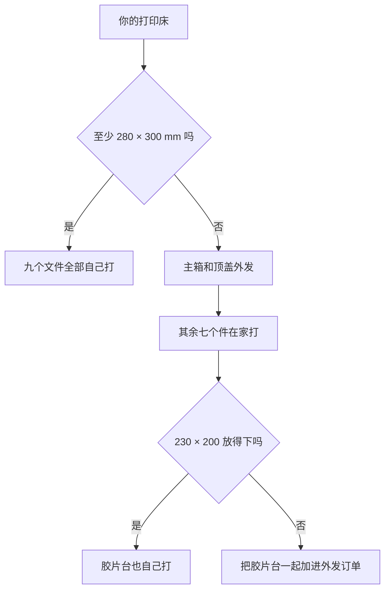

# 3D 打印

[English](printing.md) · **简体中文** · [日本語](printing.ja.md)

> 怎么把 NeoBox 的九个件打出来：先判断你的机器打不打得下，然后是一套通用参数、每个文件一张卡片，以及动手装配之前必须做完的检查。

**目录：** [你的打印机打得下吗](#你的打印机打得下吗) · [打印参数](#打印参数) · [耗材](#耗材) · [九个零件](#九个零件) · [先打一副 135 胶片夹](#先打一副-135-胶片夹) · [装配前逐件检查](#装配前逐件检查) · [打紧了或打松了怎么办](#打紧了或打松了怎么办) · [找代打服务下单](#找代打服务下单)

九个 STL 文件：**默认配置 8 个，外加 1 个可选的 6×6 遮罩**。三个白色，六个黑色。全部 1:1 毫米。


> [!CAUTION]
> 绝不要让切片软件缩放这些文件。「缩放到适合打印床」是代打订单出错最常见的一种方式，而 273 mm 的件恰好就是最容易触发它的那一个。件放不下时，答案是换一台更大的机器，不是把件改小。

> [!NOTE]
> 这个设计还没有真正打印出来过。几何尺寸在 CAD 里、也在导出的文件里逐项核对过——每个件都是水密单实体，非流形边为 0；在各自的打印朝向下，每一个水平面都落在 0.2 mm 网格上，由 `tools/verify_stl.py` 校验。本页没有任何一个数字来自实际机器。

---

## 你的打印机打得下吗

这是一道生死线，所以在买耗材之前先把它定下来。

卡尺寸的是**顶盖**，214.6 × 279.6 mm——不是主箱，主箱反而还小一点。这两个件加在一起，要求[打印床](glossary.zh-CN.md#打印床尺寸)至少 **280 × 300 mm**。其余的件在小机器上都很宽裕。

| 零件 | 在打印床上的占地 | 220 × 220 打印床 | 256 × 256 打印床 | ≥ 280 × 300 打印床 |
|---|---|---|---|---|
| `top-cover.stl` | 279.6 × 214.6 | 打不下 | 打不下 | 可以 |
| `main-body.stl` | 273 × 208 | 打不下 | 打不下 | 可以 |
| `film-stage-printed.stl` | 230 × 200 | 先量——见下文 | 可以 | 可以 |
| `access-panel.stl` | 200 × 78 | 可以 | 可以 | 可以 |
| `film-holder-*`（四个全部） | 170 × 110 | 可以 | 可以 | 可以 |
| `mask-6x6.stl` | 110 × 80 | 可以 | 可以 | 可以 |

在 220 × 220 或 256 × 256 的机器上——Bambu X1C、P1S，Prusa MK4——主箱和顶盖**都打不出来**。把这两件外发，其余在家打。打印版胶片台长边 230 mm，所以在 220 × 220 的床上要先量一下自己机器的实际可用区域再下决心；再大一档的机器就很宽裕了。



主箱没有分件版本。[混光腔](glossary.zh-CN.md#混光腔)（integrating cavity）里出现一道粘接缝，就等于一处漏光加一处反射率突变，而这个壳体存在的意义恰恰就是避免这两件事。

---

## 打印参数

整套构建只有这一组参数。仓库里其他任何地方提到打印参数，都回指这里。

| 参数 | 取值 | 为什么是这个值 |
|---|---|---|
| 缩放 | 100 %，毫米 | 文件本来就是 1:1。 |
| [层高](glossary.zh-CN.md#层高)（layer height） | **每个件都是 0.2 mm**；唯一的替代值是 0.1 mm | 所有件的每一个水平面都是 0.2 mm 的整数倍。 |
| [壁圈数](glossary.zh-CN.md#壁圈数)（perimeters） | ≥ 3 | 壳体壁厚只有 3 mm，而且必须不透光。 |
| [填充](glossary.zh-CN.md#填充)（infill） | 15–25 %；胶片台 **≥ 30 %** | 胶片台要承住胶片夹，还必须保持平面度。 |
| [支撑](glossary.zh-CN.md#支撑)（supports） | 只有两个件需要——见各自的卡片 | 其余的件都是按免支撑设计的。 |
| 耗材 | 壳体用哑光白，靠近胶片的一切用黑色 | 高光会形成热点；黑色吸收杂光。 |

> [!WARNING]
> **绝不要用 0.12 mm 或 0.16 mm 层高。** 它们既除不尽胶片夹的 0.4 mm 特征，也除不尽顶盖的 2.0 mm 台阶，切片软件会不声不响地把这些面挪离设计高度。

<details>
<summary>为什么 0.2 mm 能整除全部特征，以及 0.16 会坏在哪里</summary>

胶片夹重新切过一遍，使每一个 z 向特征都是 0.2 mm 的整数倍，且暴露台阶不薄于两层（[设计日志第 18 条](design-log.zh-CN.md)）。正因为如此，代打店用自己的默认配置也能打出一条能用的[滑槽](#零件术语)。

| 零件 | 最小暴露台阶 |
|---|---|
| 胶片夹（四件全部） | 0.4 mm |
| `mask-6x6.stl` | 1.0 mm |
| `top-cover.stl` | 2.0 mm |
| `access-panel.stl` | 3.0 mm |
| `main-body.stl` | 4.0 mm |
| `film-stage-printed.stl` | 5.0 mm |

0.2 能整除这六个数，0.1 也能。0.16 除不尽 0.4、2.0、3.0、5.0 和 1.0；0.12 除不尽 0.4、2.0、1.0 和 5.0。量化本身就是现在这套胶片夹几何的全部意义——别在切片软件里把它扔掉。

</details>

**喷嘴。** 全套里最精细的特征是 0.4 mm 的滑槽和承托退让，以及压条与导轨之间那 0.3 mm 的侧向间隙——最后这一处是整个构建里最紧的。黑色件请用能干净打出 0.4 mm 特征的喷嘴。三个白色壳体件没有任何小于 2 mm 的特征——主箱 4.0、抽口盖板 3.0、顶盖 2.0——用粗一点的喷嘴也无妨。

**两个大白件的床附着。** `main-body.stl` 是 273 × 208 mm、壁厚 3 mm，`top-cover.stl` 还要更大。翘边在这里不是外观问题：顶盖扣在主箱上，标称侧向间隙只有 0.3 mm，边缘一翘就全吃掉了。把它们打在干净的床面上，放在家里最不容易吹到穿堂风的地方，你的机器习惯用什么附着手段就用什么。

**耗材用量。** 整套约 **1–1.3 kg**——白色约 0.7–0.95 kg，黑色约 0.25–0.4 kg。这是全部用量，不是只算白色件。

---

## 耗材

### 哑光白是硬性要求，不是偏好

内壁就是反射面。箱内不喷漆、不贴内衬：裸露的白色耗材*本身*就是漫射面，而闪光灯是朝侧面打进去的，不是对着胶片打的。

> [!IMPORTANT]
> 丝面、缎面和亮面的白色耗材会把灯头映成一块热点，而不是把它打散。表面必须是哑光的。这是唯一一个事后补救不了的耗材属性——内壁不能喷漆，因为涂层会改变反射率，而整套光学设计正是建立在这个反射率之上。

### 黑色件用 PLA 还是 PETG

都行。PETG 更韧，适合一卷开合一次的胶片夹；PLA 打得更平，这正是胶片台想要的。黑色料只打算买一卷的话，PLA 是更稳妥的默认选择——胶片夹底下那块板的平面度，比韧性更要紧。

---

## 九个零件


### 零件术语

这里的打印说明一律用你在件上看得见的特征来描述朝向，绝不提看不见的面。这些词的意思是：

| 这里用的词 | 你看到的是什么 |
|---|---|
| 导轨 | 夹底座上沿长边通长的两条凸起中的一条 |
| 承托 | 每条导轨内侧那条窄台，片条的边缘就搁在上面 |
| 滑槽 | 承托与夹上盖之间那 0.4 mm 的缝，片条从这里穿过 |
| 开窗 | 供拍摄用的那个矩形孔 |
| 压条 | 夹上盖底面那两条短肋中的一条 |
| 四角挡块 | 胶片台四角上的四个 L 形块 |
| 裙边 | 顶盖四周那圈 10 mm 高的下垂墙 |
| 嵌件柱 | 顶盖底下那三根圆柱中的一根 |
| 插塞 | 抽口盖板背面凸起的那个矩形方台 |
| 门楣 | 主箱抽口上方的那段墙 |

> [!CAUTION]
> 绝不要把夹底座或夹上盖带导轨的那一面朝着打印床打。那等于让件立在导轨顶上，承托全部悬空，滑槽根本成不了形。永远是平的那一面朝下。这个错误已经在一家代打店身上发生过一次，设计日志第 20 条就是因此才写的。

### [main-body.stl](../stl/white-pla/main-body.stl)

- **白色，哑光。** STL 包围盒 273 × 208 × 92。实体体积 434 cm³——全套里体积最大的件，打印时间也最长。
- **导入后旋转：** 不需要，导入即是正朝向。
- **在床上：** 平底朝下，混光腔的大开口朝上。
- **支撑：需要。** 只有一处：前墙上抽口上方那道 190 mm 宽的门楣——一条横跨整个开口宽度的无支撑[桥接](glossary.zh-CN.md#桥接)（bridging）。
- **这个件上还有：** 右侧墙上 Ø12 的过线孔，它不需要支撑。190 × 76 的抽口需要，见上。

### [top-cover.stl](../stl/white-pla/top-cover.stl)

- **白色，哑光。** STL 包围盒 279.6 × 214.6 × 14。实体体积 223 cm³。全套里占地最大的件。
- **导入后旋转：绕 X 轴 180°。** 导入时裙边和嵌件柱朝下，直接打就是反的。
- **在床上：** 平的大面——就是开着 100 × 120 开口的那一面——朝下。10 mm 裙边和三根圆嵌件柱朝上。
- **支撑：** 不需要。
- **注意：** 顶盖扣在主箱上的那 0.3 mm 侧向间隙全靠这圈裙边。第一层要打干净。

### [access-panel.stl](../stl/white-pla/access-panel.stl)

- **白色，哑光。** 零件尺寸 200 × 78 × 16。导出状态是立着的——STL 包围盒 200 × 16 × 78。实体体积 108 cm³。
- **导入后旋转：** 放倒。转到插塞那一面贴着打印床。
- **在床上：** 凸起的矩形插塞（186 × 72 × 4）朝下贴床，把手朝上。
- **支撑：需要。** 面板比插塞四周各宽出 3–7 mm，这一圈悬空需要支撑；别处都不需要。

### [film-holder-135-base.stl](../stl/black-pla/film-holder-135-base.stl)

- **黑色。** STL 包围盒 170 × 110 × 5.0（零件外形 110 × 170）。实体体积 69 cm³。
- **导入后旋转：** 不需要。
- **在床上：** 平的大面朝下，两条长导轨朝上。滑槽宽 35.4 mm，开窗 25 × 37。
- **支撑：** 不需要。

### [film-holder-135-lid.stl](../stl/black-pla/film-holder-135-lid.stl)

- **黑色。** STL 包围盒 170 × 110 × 3.4（零件外形 110 × 170）。实体体积 54 cm³。
- **导入后旋转：绕 X 轴 180°。** 导入时两条压条是朝下的。
- **在床上：** 平的大面朝下，两条短压条朝上。
- **支撑：** 不需要。

### [film-holder-120-base.stl](../stl/black-pla/film-holder-120-base.stl)

- **黑色。** STL 包围盒 170 × 110 × 5.0（零件外形 110 × 170）。实体体积 53 cm³。
- **导入后旋转：** 不需要。
- **在床上：** 平的大面朝下，两条长导轨朝上。滑槽宽 62.0 mm，开窗 57 × 85——能覆盖 6×9 的就是这一个。
- **支撑：** 不需要。

### [film-holder-120-lid.stl](../stl/black-pla/film-holder-120-lid.stl)

- **黑色。** STL 包围盒 170 × 110 × 3.4（零件外形 110 × 170）。实体体积 42 cm³。
- **导入后旋转：绕 X 轴 180°。** 和 135 夹上盖一样，导入时压条朝下。
- **在床上：** 平的大面朝下，两条短压条朝上。
- **支撑：** 不需要。

### [film-stage-printed.stl](../stl/black-pla/film-stage-printed.stl)

- **黑色。** STL 包围盒 230 × 200 × 11。板本身是 200 × 230 × 5；四角挡块与板一体打印，最高处到 11 mm。实体体积 174 cm³。
- **导入后旋转：** 不需要。
- **在床上：** 平的底面朝下，四角挡块朝上。挡块是模型的一部分，不是缺陷——代打店可能会主动提出「帮你清掉」。
- **支撑：** 不需要。
- **参数例外：** 填充 ≥ 30 %。全套里只有这一个件有自己的参数。
- **注意：** 那三个 Ø6.5 的孔是[光孔](glossary.zh-CN.md#光孔与螺纹孔)（clearance hole），不是螺纹孔。任何阶段、任何人都不许攻丝。

### [mask-6x6.stl](../stl/black-pla/mask-6x6.stl)——可选

- **黑色。** STL 包围盒 110 × 80 × 1。实体体积 5.6 cm³。
- **导入后旋转：** 不需要。就是一块 1 mm 平板，哪一面朝上都行。
- **支撑：** 不需要。
- **只有在**你要拍 6×4.5 或 6×6、想把 120 开窗缩小时**才打它**。

---

## 先打一副 135 胶片夹

在决定打其余七个文件之前，先打 `film-holder-135-base.stl` 和 `film-holder-135-lid.stl`。两件分别只有 69 cm³ 和 54 cm³，属于全套里体积最小的几个件，而这两件合起来把整个项目所有紧配合特征都跑了一遍。之后再一圈圈往外做：剩下的黑色件排第二，两个大白件——体积最大的两个——放到最后。

第一副要检查三件事：

- **滑槽。** 片条在里面顺滑抽动，不旷也不卡。
- **磁铁孔。** Ø6 × 2 的磁铁能压进去并且待得住。点胶之前，先把一颗夹底座磁铁和一颗夹上盖磁铁凑到一起，弄清楚哪一面相吸。
- **平面度。** 夹底座平放不翘。夹底座是直接压在[乳白亚克力扩散板](glossary.zh-CN.md#扩散板)上的，底座一翘，胶片平面就是斜的。

三件里有任何一件不对，就在这里解决——见[打紧了或打松了怎么办](#打紧了或打松了怎么办)——不要等 1 kg 耗材打完之后再说。

---

## 装配前逐件检查

件从机器上下来、或者从代打店的包裹里拆出来时就把这些做掉。前四条是用来抓「切片软件缩放了文件」的。

- [ ] `top-cover.stl` 沿裙边量得 279.6 × 214.6。
- [ ] `main-body.stl` 外形量得 273 × 208，前墙上的抽口是 190 × 76。
- [ ] `film-stage-printed.stl` 量得 200 × 230，板厚 5 mm，四角挡块最高到 11 mm。
- [ ] 胶片夹外形量得 110 × 170，夹底座和夹上盖都一样。
- [ ] 顶盖靠自重就能落到主箱上，不需要硬压。
- [ ] 一根 M6 螺杆靠自重能穿过胶片台上全部三个 Ø6.5 孔。**不要攻丝。**
- [ ] 抽口盖板的插塞放进 190 × 76 的抽口后四周都有间隙——约 2 mm，由 EVA 泡棉填掉。
- [ ] Ø6 × 2 磁铁能压进夹底座和夹上盖上的每一个磁铁孔。
- [ ] 片条能穿过你打出来的每一副胶片夹的滑槽。
- [ ] 主箱内壁没有被打磨、抛光或喷涂过。裸露的哑光白表面就是反射面。

任何一条不过，下面有对应的处理办法，或者见[排错](troubleshooting.zh-CN.md#打印)。

---

## 打紧了或打松了怎么办

下表按配合的紧密程度从紧到松排列。XY 补偿在 PrusaSlicer 和 OrcaSlicer 里叫 *XY size compensation*，在 Cura 里叫 *Horizontal expansion*；每次只改一小步，只重打一个件，绝不整套重来。

| 配合部位 | 标称值 | 太紧 | 太松 |
|---|---|---|---|
| 顶盖扣主箱 | 每侧 0.3 mm | 把裙边内侧的头两层刮掉；还不够就打开[象足](glossary.zh-CN.md#象足)（elephant foot）补偿重打。 | 只要还能靠自重坐稳就行。想让遮光更严，就沿着壁顶贴那条可选的 EVA 条。 |
| 滑槽 | 0.4 mm | 先用美工刀把滑槽入口的毛刺修掉，多数情况到这一步就解决了。片条还是卡，就加一点 XY 负补偿重打，不要去改模型。 | 片条晃：加一点 XY 正补偿重打。留一点余量本来就是设计意图——片条厚度只有约 0.14 mm，槽高 0.4 mm。 |
| 抽口盖板配抽口 | 四周约 2 mm | 把 EVA 泡棉削薄。盖板靠摩擦固定，调节量在泡棉上。 | 再缠一层 EVA。不要为这个重打盖板。 |
| 磁铁孔 | Ø6 × 2 磁铁 | 用刀把孔口修一下。钕磁铁绝不能硬压——会崩角。 | 照样用 502 胶粘住；孔负责定位，胶负责固定。 |
| 胶片台的孔 | Ø6.5 | 用 6.5 mm 钻头手工铰一下，直到 M6 螺杆能自己掉下去。 | 无害。板是被上下两个螺母夹住的，不是靠孔。 |

> [!CAUTION]
> 绝不要给胶片台的孔攻丝，也绝不要让哪个师傅「顺手帮你改成螺纹孔」。一块攻了丝的板，配上一根同时旋进下方[热熔铜螺母](glossary.zh-CN.md#热熔铜螺母)的螺杆，就构成了一组[差动螺旋](glossary.zh-CN.md#差动螺旋)（differential screw）：拧螺母时，板移动的距离等于两个完全相同的螺距之差，也就是零。调平从此失效，唯一的补救办法是重做一块板。

---

## 找代打服务下单

没有打印机——或者打印床小于 280 × 300 mm——就走代打。淘宝搜索词：`3D打印 代打 大尺寸 PLA`。下面这段话原样复制发给店家即可。它点名了每一个文件，用操作员在屏幕上看得见的特征描述摆放朝向，并写明了仅有的两处需要支撑的位置。

```text
必打 8 个 STL，另有 1 个可选（mask-6x6），共 9 个文件。
单位毫米，请勿缩放。全部用默认 0.2 层高，绝不要用 0.12 或 0.16 层高。
白色必须是哑光料（丝面／亮面会把灯头映成亮斑）。

白色 PLA 3 件：
  - main-body.stl（主箱，外框 273×208×92，需要 ≥280×300 打印床）
    摆放：平底朝下、大开口朝上。导入即是这个朝向，不用旋转。
    支撑：只有正面竖墙上那个 190mm 宽方口的上边缘要支撑。
  - top-cover.stl（顶盖 279.6×214.6×14，本单里占地最大的件，需要 ≥280×300 打印床）
    摆放：导入时裙边和 3 个圆柱朝下，请绕 X 轴旋转 180°；
          平的大面朝下贴床，10 mm 裙边和 3 个圆柱朝上。免支撑。
  - access-panel.stl（抽口盖板 200×78×16）
    摆放：导入时是立着的，请放倒；背面凸起的方台朝下贴床，把手朝上。
    支撑：面板比方台宽一圈，这一圈悬空要支撑。

黑色 PLA 5 件：
  - film-holder-135-base.stl / film-holder-120-base.stl（两个夹底座）
    摆放：平的那面朝下，带两条长导轨（长凸条）的面朝上。免支撑。
  - film-holder-135-lid.stl / film-holder-120-lid.stl（两个夹上盖）
    摆放：导入时两条短压条朝下，请绕 X 轴旋转 180°；
          平的大面朝下，压条朝上。免支撑。
  - film-stage-printed.stl（胶片台 200×230，填充 ≥30%）
    摆放：平面朝下，四角 L 形挡块朝上（挡块是设计特征，不是缺陷）。

可选：mask-6x6.stl（110×80×1，拍 6×4.5 / 6×6 才用），黑色，平放，免支撑。

其余默认：壁 ≥3 圈、填充 15–25%。
main-body.stl 的内壁请勿打磨、抛光或喷涂——那层裸露的哑光白就是反射面。
```

**付款之前先问三个问题。** 代打店往往是先接单，后发现问题。

1. 这一单在哪台机器上打，实际可用打印区域是多大？
2. 273 × 208 × 92 能整体打吗，不切开？
3. 有没有**哑光**白色 PLA——不是丝面，也不是亮面？

任何一个答案是「没有」，这家店就做不了壳体。黑色件它还是能做。

**店家不愿意照参数走时，** 随他用自己的配置，只要层高是 0.2 mm 或 0.1 mm 就行。胶片夹的几何正是按 0.2 mm 量化设计的，图的就是让默认配置也能打准。除了层高，真正不能让的只有那两处支撑位置，以及「请勿缩放」。

其他语言版本的话术——发给日本代打服务的日文版、其余地区用的英文版——连同所有需要采购而不是打印的东西的货源，都在[店家话术](bom.zh-CN.md#给店家的话术)里。

---

← [物料清单](bom.zh-CN.md) · [文档索引](../README.zh-CN.md#文档) · [装配](assembly.zh-CN.md) →
