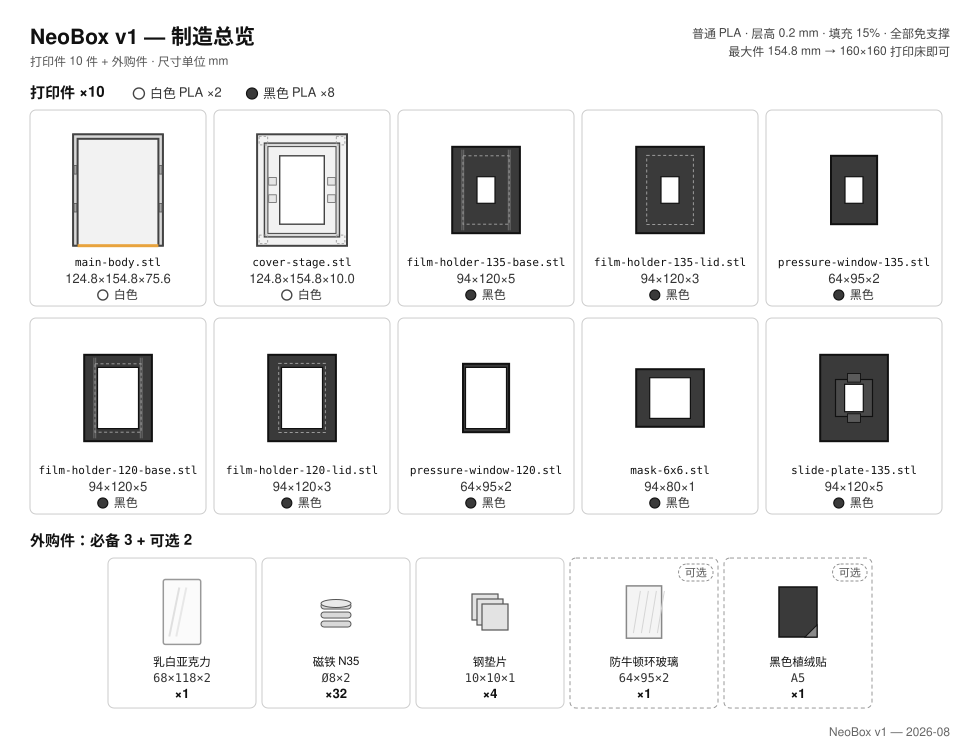
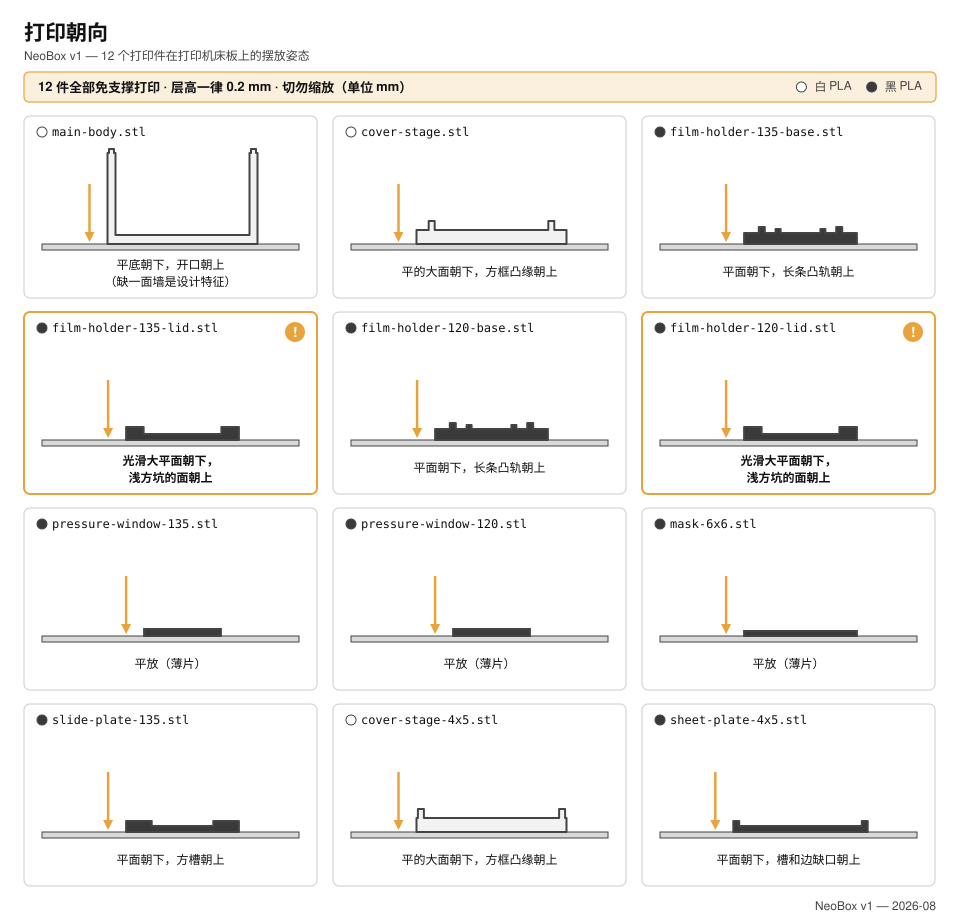

# 3D 打印

[English](printing.md) · **简体中文** · [日本語](printing.ja.md)

> 怎么把 NeoBox 的九个件打出来：为什么几乎任何打印机都行、一套通用参数、每个文件一张卡片，以及动手装配之前必须做完的检查。

**目录：** [你的打印机打得下吗](#你的打印机打得下吗) · [打印参数](#打印参数) · [耗材](#耗材) · [九个零件](#九个零件) · [先打一副 135 胶片夹](#先打一副-135-胶片夹) · [装配前逐件检查](#装配前逐件检查) · [打紧了或打松了怎么办](#打紧了或打松了怎么办) · [找代打服务下单](#找代打服务下单)

九个 STL 文件：**默认配置 8 个，外加 1 个可选的 6×6 遮幅插片**。两个白色，七个黑色。全部 1:1 毫米，全部免支撑，整套耗材约 **300–350 g，大约是原型机的三分之一**。



> [!CAUTION]
> 绝不要让切片软件缩放这些文件。「缩放到适合打印床」是代打订单出错最常见的一种方式。文件本来就是 1:1 的，下面所有验收检查都建立在这一点没被破坏之上。

> [!NOTE]
> 这个设计还没有真正打印出来过：本页没有任何一个数字来自实际机器。几何在 CAD 里核对过（权威是 `cad/neobox.blend`）。

---

## 你的打印机打得下吗

几乎一定打得下。全套最大的两个件是主箱和顶盖台，在床上占 124.8 × 154.8 mm；最高的是 75.6 mm 的主箱。**打印床有 160 × 160 mm 就能打完整套**，也就是说如今几乎所有桌面机、包括最小的那一档都够用。原型机时代关于超大件和外发壳体的告警，已经随原型机一起作废。

| 零件 | 在打印床上的占地 | 高度 |
|---|---|---|
| `main-body.stl` | 124.8 × 154.8 | 75.6 |
| `cover-stage.stl` | 124.8 × 154.8 | 10.0 |
| `film-holder-*-base.stl`（两个） | 94 × 120 | 5.0 |
| `film-holder-*-lid.stl`（两个） | 94 × 120 | 3.0 |
| `pressure-window-*.stl`（两个） | 64 × 95 | 2.0 |
| `mask-6x6.stl` | 94 × 80 | 1.0 |

---

## 打印参数

整套构建只有这一组参数。仓库里其他任何地方提到打印参数，都回指这里。

| 参数 | 取值 | 为什么是这个值 |
|---|---|---|
| 缩放 | 100 %，毫米 | 文件本来就是 1:1。 |
| 耗材 | 普通 PLA，两个壳体件白色，其余黑色 | 见[耗材](#耗材)。 |
| [层高](glossary.zh-CN.md#层高)（layer height） | **所有件 0.2 mm** | 设计里每个高度都落在 0.2 网格上：用 0.2 层高，每个面都正好落在层边界，0.4 的台阶打出来就是真正的 0.4。 |
| [填充](glossary.zh-CN.md#填充)（infill） | 15 % | 没有件承受自重以外的负载。 |
| [支撑](glossary.zh-CN.md#支撑)（supports） | **任何件都不要** | 每个件都按各自卡片上的朝向做了免支撑设计。 |

> [!IMPORTANT]
> 切片软件在任何地方提出要加支撑，就说明件摆错了朝向，回去看它的卡片。[桥接](glossary.zh-CN.md#桥接)（bridging）也没有任何要调的：全套最长的桥，是顶盖台底面榫槽顶那 3.3 mm，默认参数随手就过。

<details>
<summary>为什么几何按 0.2 mm 量化，这换来了什么</summary>

本项目每个零件背后的制造规则是：**在各自的打印朝向下，每一个水平面都落在 0.2 mm 网格上，且暴露台阶不薄于 0.4 mm。** 这两条规则都是从真实的代打订单翻车里迭代出来的（[设计日志第 18 条](design-log.zh-CN.md)，朝向问题见第 20 条），也是代打店用默认配置就能打出能用零件的原因。

| 零件 | 从打印床起算的水平面高度（mm） |
|---|---|
| `main-body.stl` | 0 · 3.0 · 73.0 · 75.6 |
| `cover-stage.stl` | 0 · 2.8 · 3.6 · 5.0 · 6.0 · 10.0 |
| 夹底座（两个） | 0 · 2.2 · 3.8 · 4.2 · 4.6 · 5.0 |
| 夹上盖（两个，顶面朝下打印） | 0 · 1.0 · 3.0 |

每个数都是 0.2 的整数倍；而全套最细的暴露台阶，即夹底座上 0.4 mm 的承台和元件台阶，恰恰就是定义胶片平面的那两级。所以规格把全部文件的层高定死在 0.2：每个面都正好落在层边界上，0.4 的台阶就是干净的两层，不给切片软件留任何四舍五入的空间。0.28 这类更粗的层高虽然省一点点，但会让网格落在层边界之间，糊掉的恰恰是胶片平面赖以成立的那些台阶。

</details>

**喷嘴。** 全套最细的特征是夹底座上那 0.4 mm 的台阶，最薄的墙是 2.4 mm。标准 0.4 mm 喷嘴什么件都能打。

---

## 耗材

### 普通 PLA，两种颜色

规格就是普通 PLA，全套通用：不需要工程料，也不要特殊表面效果的料。

**两个壳体件用白色。** 主箱内壁就是反射面：闪光灯从完全敞开的前口打进腔内，光在白墙和顶盖台的白色底面之间多次反弹之后才到达胶片。裸露的白色表面*本身*就是光学面。

> [!IMPORTANT]
> 白色请用普通白 PLA，不要丝绸、缎面或其他特殊表面效果的料；内壁保持原样：不喷漆、不打磨、不镀膜。白墙的裸面反射率是光学设计的一部分。

**靠近胶片的七个件用黑色。** 胶片近距离能「看到」的东西都是黑色，用来吸收杂光：夹底座、夹上盖、压片窗插片、遮幅插片。

**用量。** 整套约 **300–350 g**，大约是原型机的三分之一。每种颜色一卷料绰绰有余。

---

## 九个零件



### 零件术语

这里的打印说明一律用你在件上看得见的特征来描述朝向，绝不提看不见的面。这些词的意思是：

| 这里用的词 | 你看到的是什么 |
|---|---|
| 导轨 | 夹底座上沿走片方向通长的两条外侧凸起中的一条 |
| 承台 | 沿导轨内侧那条窄窄的凸台，片条两边就骑在上面 |
| 元件台阶 | 切在导轨里的那级 4.6 mm 台阶，压片元件搁在上面 |
| 通道 | 承台与压片元件之间那 0.4 mm 的缝，片条从这里抽过 |
| 开窗 | 供拍摄用的那个矩形孔 |
| 压片元件 | 搁在元件台阶上的东西：默认是打印的压片窗插片，升级是那片可选的防牛顿环玻璃 |
| 定位榫 | 主箱侧壁顶上四个小凸榫中的一个 |
| 榫槽 | 顶盖台底面四角的四个槽口中的一个，定位榫就插在里面 |
| 托盘凸缘 | 顶盖台台面上凸起的那圈围框，胶片夹就坐在框里 |

> [!CAUTION]
> 两个朝向陷阱，一个件族一个。**夹底座**平面朝下打：绝不要把带导轨的那面朝着打印床，否则承台和元件台阶全部悬空，通道根本成不了形。**夹上盖**正好反过来：平整的**顶面**朝下，让浅凹腔和磁铁孔朝上。摆错朝向的胶片夹已经在一家代打店身上发生过一次（[设计日志第 20 条](design-log.zh-CN.md)），下面每张卡片都用看得见的特征描述摆放，就是这个原因。

### [main-body.stl](../stl/white-pla/main-body.stl)

- **白色。** 124.8 × 154.8 × 75.6，全套最大、打印时间最长的件。
- **在床上：** 平底朝下。三面墙从底板上立起来；第四面就是完全敞开的前口，根本没有墙。这是设计如此，不是文件坏了。四个定位榫骑在侧壁顶上。
- **支撑：不需要。** 敞开的前口是「没有东西」，不是悬空；这个件上没有任何悬空结构。
- **注意：** 内壁是光学面。不打磨、不喷漆。

### [cover-stage.stl](../stl/white-pla/cover-stage.stl)

- **白色。** 124.8 × 154.8 × 10.0。这一个件合并了原型机的顶盖和胶片台。
- **在床上：** 带四角榫槽的平面朝下；凸起的托盘凸缘朝上。
- **支撑：不需要。** 榫槽顶要桥 3.3 mm，已经是全套最长的桥，仍然不值一提。
- **这个件上还有：** 62 × 95 的透光窗、台面下方那个搁乳白亚克力的暗槽、四个放钢垫片的小方沉孔，以及给胶片夹定位的托盘凸缘。

### [film-holder-135-base.stl](../stl/black-pla/film-holder-135-base.stl)

- **黑色。** 94 × 120 × 5.0。开窗 25 × 37。
- **在床上：** 平面朝下，两条长导轨朝上。通道两端各有一小段导向筋，把片条引进来。
- **支撑：不需要。** 所有磁铁孔和台阶都是朝上开口的。
- **注意：** 这个件上的承台和元件台阶定义了胶片平面：要是打算用 0.2 层高，收益就在这里。

### [film-holder-135-lid.stl](../stl/black-pla/film-holder-135-lid.stl)

- **黑色。** 94 × 120 × 3.0。开窗 25 × 37。
- **在床上：顶面朝下。** 除了开窗以外什么都没有的那个平面贴床；带浅矩形凹腔和八个磁铁孔的那一面朝上。
- **支撑：不需要。** 这个朝向下，凹腔和磁铁孔全部朝上开口。

### [film-holder-120-base.stl](../stl/black-pla/film-holder-120-base.stl)

- **黑色。** 94 × 120 × 5.0。开窗 57 × 85（整格 6×9），通道宽 62 mm。
- **在床上：** 平面朝下，两条长导轨朝上。
- **支撑：不需要。**
- **注意：** 和 135 底座一样：承台和元件台阶就是胶片平面。

### [film-holder-120-lid.stl](../stl/black-pla/film-holder-120-lid.stl)

- **黑色。** 94 × 120 × 3.0。开窗 57 × 85。
- **在床上：顶面朝下**，和 135 上盖完全一样：凹腔和磁铁孔朝上。
- **支撑：不需要。**

### [pressure-window-135.stl](../stl/black-pla/pressure-window-135.stl)

- **黑色。** 64 × 95 × 2.0，开窗 25 × 37。135 的默认压片元件，搁在 135 底座的元件台阶上。
- **在床上：** 平放，平底朝下。
- **支撑：不需要。**

### [pressure-window-120.stl](../stl/black-pla/pressure-window-120.stl)

- **黑色。** 64 × 95 × 2.0，开窗 57 × 85。120 的默认压片元件。
- **在床上：** 平放，平底朝下。
- **支撑：不需要。**
- **说明：** 两个压片窗插片是唯一分幅面的压片元件。可选的防牛顿环玻璃升级件是一片 64 × 95，两个幅面通用。

### [mask-6x6.stl](../stl/black-pla/mask-6x6.stl)——可选

- **黑色。** 94 × 80 × 1.0，开窗 56.5 × 56.5。
- **在床上：** 平放。
- **支撑：不需要。**
- **只有在**你要拍 6×6 时**才打它**：垫在 120 底座下方的托盘里，把开窗缩成正方形。没有 6×4.5 的遮幅，6×4.5 靠后期裁切。

---

## 先打一副 135 胶片夹

在决定打其余文件之前，先打 `film-holder-135-base.stl`、`film-holder-135-lid.stl` 和 `pressure-window-135.stl`。它们属于全套最小的几个件，而这三件合起来把所有要紧的配合都跑了一遍：磁铁孔、元件台阶、0.4 mm 的通道。

第一组要检查四件事：

- **台阶。** 压片窗插片落进 4.6 mm 元件台阶并且放得平，上盖能盖上。有一点点活动量是设计意图：上盖的凹腔把元件的浮动限制在 0.4 mm 以内。
- **通道。** 插片装好、上盖盖上之后，片条能顺滑地抽过，不卡、不刮。
- **磁铁。** Ø8 × 2 的磁铁能压进每一个孔。这是设计好的过盈配合。压到底*之前*先把底座磁铁和上盖磁铁凑到一起弄清哪面相吸，因为压进去就很难再取出来。
- **平面度。** 底座平放不翘。胶片平面就架在它上面。

有任何一件不对，就在这里解决（见[打紧了或打松了怎么办](#打紧了或打松了怎么办)），然后再打其余黑色件，两个白色件放到最后。

---

## 装配前逐件检查

件从机器上下来、或者从代打店的包裹里拆出来时就把这些做掉。前三条是用来抓「切片软件缩放了文件」的。

- [ ] `main-body.stl` 外形量得 124.8 × 154.8。
- [ ] `cover-stage.stl` 量得 124.8 × 154.8，四个榫槽靠自重就能落到主箱的四个定位榫上。
- [ ] 每个胶片夹零件外形都量得 94 × 120，夹底座和夹上盖一样。
- [ ] 压片窗插片量得 64 × 95，能落进各自底座的元件台阶。
- [ ] Ø8 × 2 磁铁能压进每个夹底座和夹上盖上的每一个磁铁孔。
- [ ] 插片装好、上盖盖上之后，片条能抽过你打出来的每一副胶片夹。
- [ ] 如果打了 `mask-6x6.stl`：量得 94 × 80，能垫进 120 底座下方的托盘。
- [ ] 主箱内壁没有被打磨、抛光或喷涂过。裸露的白色表面就是反射面。

任何一条不过，下面有对应的处理办法，或者见[排错](troubleshooting.zh-CN.md#打印)。

---

## 打紧了或打松了怎么办

下表按配合的紧密程度从紧到松排列。XY 补偿在 PrusaSlicer 和 OrcaSlicer 里叫 *XY size compensation*，在 Cura 里叫 *Horizontal expansion*；每次只改一小步，只重打一个件，绝不整套重来。

| 配合部位 | 标称值 | 太紧 | 太松 |
|---|---|---|---|
| 通道 | 承台与压片元件之间 0.4 mm | 先确认元件完全落进元件台阶，再用美工刀把承台边缘和元件边缘的毛刺修掉。片条还是卡，就先用 0.2 层高重打底座（那样承台和台阶正好落在层边界上），再考虑动 XY 补偿。 | 轻微晃动是正常的：0.4 mm 的通道里，片条厚度只有约 0.12–0.18 mm，抽片时通道会把片条压平带过。 |
| 压片元件配元件台阶 | 64 × 95 落台阶 | 用细砂纸轻轻修*元件*的边：只修元件，绝不修台阶。 | 无妨。上盖凹腔把元件浮动限制在 0.4 mm 以内。 |
| 顶盖台榫槽配定位榫 | 四个榫，2.4 × 12 | 用刀修一下榫槽口；还不够就打开[象足](glossary.zh-CN.md#象足)（elephant foot）补偿重打。 | 无害。榫槽负责定位，重力负责固定。 |
| 磁铁孔 | Ø8 × 2 磁铁 | 过盈本来就是设计好的：垂直、用力压到底。真压不进去就用刀修一下孔口。绝不要敲钕磁铁，会崩角。 | 点一滴 502；孔负责定位，胶负责固定。 |

> [!CAUTION]
> 绝不要为了让偏紧的通道松开而去打磨、锉削或「清理」承台和元件台阶。这两级台阶*就是*胶片平面：在这里去掉的材料，就是一笔无法撤销的压平误差。通道偏紧要在切片软件里解决（0.2 层高、一点 XY 补偿），或者修可更换的元件，绝不动底座上的台阶。

---

## 找代打服务下单

就算完全没有打印机，这也已经是一张小单：九个文件、约 300–350 g 普通 PLA、全程免支撑，每个件 160 × 160 mm 的打印床都放得下。淘宝搜索词：`3D打印 代打 PLA`。下面这段话原样复制发给店家即可。它点名了每一个文件，并用操作员看得见的特征描述摆放。

```text
共 9 个 STL 文件：必打 8 个，另有 1 个可选（mask-6x6）。
单位毫米，1:1，请勿缩放。

普通 PLA。所有件层高 0.2 mm。
填充 15%。任何件都不要加支撑。每个件 160 x 160 mm 的床都放得下。

白色 PLA 2 件：
  - main-body.stl（124.8 x 154.8 x 75.6）
    摆放：平底朝下贴床，墙朝上。有一面没有墙，这是设计如此，不是文件坏了。
    内壁请勿打磨、喷漆或镀膜。
  - cover-stage.stl（124.8 x 154.8 x 10）
    摆放：带 4 个角槽的平面朝下贴床，凸起的矩形围框朝上。

黑色 PLA 6 件 + 1 件可选：
  - film-holder-135-base.stl / film-holder-120-base.stl（两个夹底座）
    摆放：平面朝下，带两条长凸条的面朝上。
  - film-holder-135-lid.stl / film-holder-120-lid.stl（两个夹上盖）
    摆放：平整的顶面朝下贴床；带浅凹腔和 8 个磁铁孔的那一面朝上。
  - pressure-window-135.stl / pressure-window-120.stl（两个薄插片）
    摆放：平放。
  - mask-6x6.stl（可选，薄板）
    摆放：平放。
```

**付款之前先问三个问题。** 代打店往往是先接单，后发现问题。

1. 每个文件都按 100 % 缩放、毫米单位打，不会「缩放到适合打印床」吧？
2. 白色料是普通白 PLA 吗？不是丝绸料，也不是亮面料？
3. 两个夹上盖会照文字要求顶面朝下摆吗？

**店家不愿意照参数走时，** 随他用自己的默认配置。几何量化的目的就是让默认配置也能打准：每个水平面都在 0.2 mm 网格上，暴露台阶不小于 0.4 mm。真正不能让的只有「请勿缩放」、摆放朝向，和「不加支撑」。

其他语言版本的话术（发给日本代打服务的日文版、其余地区用的英文版），连同所有需要采购而不是打印的东西的货源，都在[店家话术](bom.zh-CN.md#给店家的话术)里。

---

← [物料清单](bom.zh-CN.md) · [文档索引](../README.zh-CN.md#文档) · [装配](assembly.zh-CN.md) →
