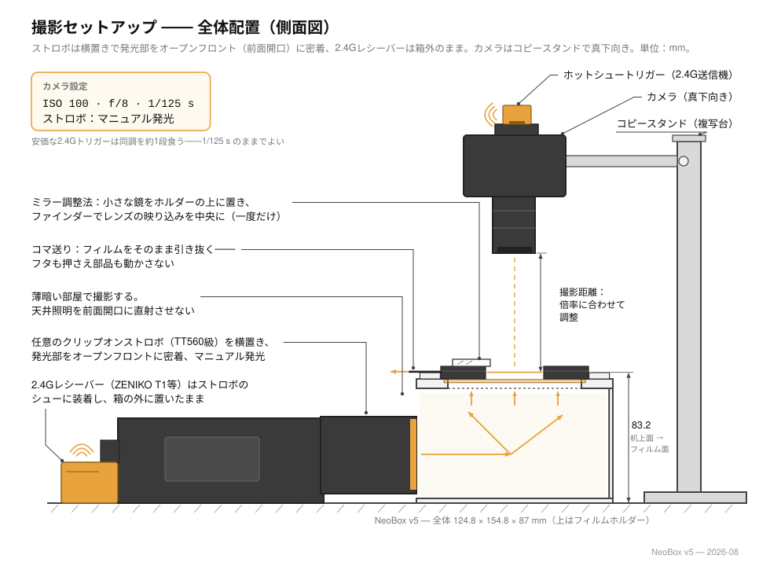
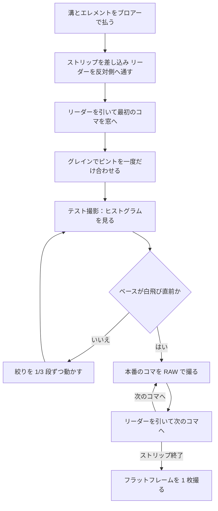

# スキャン

[English](scanning.md) · [简体中文](scanning.zh-CN.md) · **日本語**

> このプロジェクトのカメラ側の半分。箱の上に何を置くか、カメラをフィルムと平行に合わせる方法、ピントと露出、フィルムの装填とコマ送り、そして撮った RAW をどう処理するかを扱います。

**目次：** [始める前に](#始める前に) · [カメラ側の機材](#カメラ側の機材) · [撮影倍率とレンズの選択](#撮影倍率とレンズの選択) · [カメラの高さとスタンド](#カメラの高さとスタンド) · [平行出し](#平行出し) · [ピント](#ピント) · [露出](#露出) · [フィルムの装填](#フィルムの装填) · [1 本撮る](#1-本撮る) · [フラットフィールド補正と反転](#フラットフィールド補正と反転) · [おかしいと感じたら](#おかしいと感じたら)

## 始める前に

NeoBox は[カメラスキャン (camera scanning)](glossary.ja.md#カメラスキャン-camera-scanning) のための光源です——フィルムをスキャナーに通す代わりに、デジタルカメラで複写する方式のことです。この箱は乳白アクリルを通して 62 × 95 mm の透過窓を均一に照らし、その 4.6 mm 上にフィルムストリップを平らに保持します。そこから先、それを 1 つのファイルに変える作業はすべてカメラ側で行うものであり、そのどれもこのプロジェクトには含まれていません。

カメラを立てる前に、このリストを一通り確認してください。

- [ ] 箱の本体が机の上に立ち、**天板ステージ**が壁の位置決めダボの上に座っていて、乳白アクリルがその溝に収まり、保護フィルムが**両面とも**剥がしてある。
- [ ] 4 枚のスチールシムが天板ステージの座ぐりに収まり、面と揃っている。
- [ ] ストロボが机の上に平らに寝ていて、発光部が完全に開いた前面開口（オープンフロント）に付けてあり、箱の中へ向けて光る——クリップオンストロボならどのメーカーのものでも使えます。T1 受信機はストロボと一緒に箱の外に残す。
- [ ] 使うフォーマットのフィルムホルダーがトレイのフランジの内側に収まり、押さえエレメント——標準は押さえ窓インサート、カールの強いロールにはアンチニュートンガラス——がエレメント段に装着してある。
- [ ] 部屋が薄暗く、天井の照明がオープンフロントに直接差し込んでいない。
- [ ] 溝と押さえエレメントをブロアーで払ってある——ガラスモードでは、ガラスを入れる前に両面を払ってある。

> [!NOTE]
> この設計はまだ出力も組み立てもされていないため、以下に書かれていることはどれも実測結果ではありません。露出の数値は、そこからブラケットして探すための出発点であって、予測値ではありません。

## カメラ側の機材

| 機材 | ここでの役割 | 実際に効くポイント |
|---|---|---|
| カメラボディ | コマを記録する | マニュアル露出、RAW、拡大できるライブビュー、ホットシュー、そして**メカシャッター**（またはストロボが発光する[電子先幕シャッター (EFCS)](glossary.ja.md#efcs-先幕電子シャッター)） |
| マクロ撮影できるレンズ | センサーをコマで埋める | 使うフォーマットに足りる撮影倍率——下の表を参照 |
| [複写スタンド (copy stand)](glossary.ja.md#複写スタンド-copy-stand)、または水平・反転できるセンターポールを持つ三脚 | カメラを透過窓の真上に、直角に、動かないように保持する | まず剛性、次にポールの高さ |
| トリガーの送信機 | 箱の外、ストロボの上の受信機を作動させる | 買った受信機とペアになること。カメラのホットシューに載せる |
| リモートレリーズ、またはセルフタイマー | カメラに手を触れないため | ボディに触れずにシャッターを切れるものなら何でもよい |
| 反転ソフトウェア | RAW のネガをポジに変える | [フラットフィールド補正と反転](#フラットフィールド補正と反転)で扱う |
| 小さな平面鏡（30 mm 程度） | センサーをフィルム面と平行に合わせる | 平らで、フィルムホルダーの上に載る大きさであること |
| ブロアー・木綿の手袋または清潔な手 | ホコリと指紋 | 他の消耗品と一緒に一覧にある |

これらはどれもビルド費用の内側にはなく、ストロボも同様です。より広い一覧は[すでに持っている必要があるもの](getting-started.ja.md#すでに持っている必要があるもの)に、鏡・ブロアー・手袋は[工具と消耗品](bom.ja.md#工具と消耗品)にあります。

送信機はカメラのホットシューに載せ、受信機はストロボと一緒に箱の外、机の上に残します。両方が同じチャンネルにあり、両方に電気が残っていることが必要です——チャンネル不一致と受信機の電池切れは、どちらも真っ黒なコマのよくある原因です。ただし、その前にシャッター方式を確認してください。[露出](#露出)を参照。



## 撮影倍率とレンズの選択

[撮影倍率 (magnification ratio)](glossary.ja.md#撮影倍率-magnification-ratio) は、センサー上の像の大きさを被写体の大きさで割った値です。1.0× ではコマが等倍でセンサーに投影され、0.5× では縦横それぞれ半分の範囲しかセンサーを覆いません。

センサーをコマで埋めるために必要な撮影倍率——レンズを選ぶための概算です。

| フォーマット | コマ | フルサイズ (36 × 24) | APS-C (23.5 × 15.6) |
|---|---|---|---|
| 135 | 36 × 24 | 1.0×——1:1 マクロレンズ | 0.65× |
| 6×4.5 | 56 × 41.5 | 0.58× | 0.38× |
| 6×6 | 56 × 56 | 0.43× | 0.28× |
| 6×7 | 56 × 70 | 0.34× | 0.22× |
| 6×9 | 56 × 84 | 0.29× | 0.19× |

1:1 のマクロレンズがあれば、この表のすべての行をカバーできます——大きいフォーマットでは単に等倍より低い倍率を使うだけです。いちばん厳しいのはフルサイズで 135 を撮る場合で、ここだけは 1.0× をまるごと必要とします。

ホコリは倍率ではなく、どの面に載っているかで分けて考えます。乳白アクリルの上の粒はまったく像を結びません——拡散板そのものが発光面なので、その上に載ったものは光の一部になるだけです。ときどき拭けば十分です。像を結ぶのは、フィルム面かそのすぐ近くにあるホコリです。フィルム自体の上のホコリは常に写りますし、ガラスモードではアンチニュートンガラスの下面がフィルム面からわずか 0.2 mm なので、そこのホコリはそのまま画面に写り込みます。ガラスを入れる前にブロアーで払うのはそのためであり、[フィルムゲート (film gate)](glossary.ja.md#フィルムゲート-film-gate) と溝をストリップごとに払うのも同じ理由です。光学的な理屈は[設計](design.ja.md#3-光学上の判断)にあります。

## カメラの高さとスタンド

フィルム面は、**箱が載っている面から 83.2 mm 上**に来ます。この高さは設計で固定されていて、135 でも 120 でも同じです——どちらのフィルムホルダーもフィルムを同じ高さに差し出すので、フォーマットを替えても水平出しをやり直す必要はありません。唯一の例外は 6×6 のマスクで、120 のホルダー全体を 1 mm 持ち上げます——正常な動作です。ピントを合わせ直せば済みます。

カメラの高さは 2 つの数字から決まります。

```
レンズ先端から机面まで ＝ 83.2 mm ＋ 必要な倍率でのレンズのワーキングディスタンス
```

[ワーキングディスタンス (working distance)](glossary.ja.md#ワーキングディスタンス-working-distance) はレンズの性質であって、箱の性質ではありません。仕様を調べるか実測するかしてから、スタンドを確認してください。

| 買う前・決める前に確認すること | なぜ |
|---|---|
| ベースボードから測って、ポールの可動範囲が 83.2 mm ＋ ワーキングディスタンスに届くか | 1:1 のマクロレンズは、複写スタンドの通常の可動範囲をはるかに超える高さを要求することがある |
| 手を離したときに雲台が沈まないか | 沈みは、1 本のあいだにゆっくりピントがずれていく形で現れる |
| ベースボードが、箱の設置面積 124.8 × 154.8 mm より余裕を持って大きく、箱の手前にストロボを寝かせる机面が空いているか | 箱をまっすぐ置き、ストロボをオープンフロントに寝かせ、さらに手を入れる余地が要る |
| ポールが箱に干渉せずに、レンズの光軸が透過窓の中心まで届くか | センターポールを反転させる三脚は、箱を置きたいところにちょうど脚が来ることがよくある |

高さが決まったら、そこへ戻れるように記録してください。机やマットの上に箱の輪郭を印して——位置決めピン 2 本でも、単にテープでも構いません——フォーマットごとのポールの高さを書き留めます。フォーマットで変わるのは撮影倍率だけで、フィルム面は動きません。箱を動かすときは水平のまま持ち上げてください——組み上がったスタックは重力とマグネットで保たれていて、締結部品は 1 つもありません。

## 平行出し

> [!IMPORTANT]
> 平行が先、均一性が後です。ストロボの閃光は振動を凍結しますが、センサーに対して平行でないフィルム面は、箱の中の何をもっても救えません——どのコマも片側の縁が甘くなります。

目視ではなく、鏡を使います。

1. フィルムホルダーの上、フィルム面に小さな平面鏡を置きます。
   *チェックポイント：* 鏡が平らに載り、がたつかないこと。
2. カメラのライブビューで鏡を見ます。
   *チェックポイント：* レンズとカメラ前面が映って見えること。
3. その映り込みが画面のちょうど中央に来て、左右対称に見えるまでカメラを動かします。
   *チェックポイント：* 映り込んだレンズの鏡胴が同心に見え、片側へ押しやられた楕円になっていないこと。レンズの映り込みが真ん中に来たとき、センサーはフィルム面と平行です。
4. 補正は箱ではなくカメラ側で行います。複写スタンドの雲台の傾きを調整して——傾き調整がない雲台なら取り付け部に薄いシムを挟んで——もう一度確認します。2 巡で収束します。箱には水平出しの機構が一切ありません。このミラー法が、箱の印刷公差ごと吸収します。
   *チェックポイント：* すべてから手を離したあとも、映り込みが中央に留まっていること。

<details>
<summary>なぜ鏡で分かり、水準器では分からないのか</summary>

水準器が基準にしているのは重力です。しかしここで本当に必要なのは、センサー面がフィルム面と平行であることです。カメラは完全に水平のまま箱に対して傾いていられますし、逆に箱が水平でも、カメラが沈んだアームにぶら下がっていることがあります。

鏡はこの問題から重力を消します。鏡が光軸に対して垂直なときにだけ、鏡はレンズをその光軸に沿って映し返します。映り込みが中央で左右対称なら垂直であり、光軸に対して垂直ならセンサーと平行です。これはゼロ位法 (null test) なので、正解に近づくほど感度が上がります。
</details>

箱かカメラを動かしたら、そのたびに平行を取り直してください。以降の[毎セッションの手順](assembly.ja.md#フォーマット切り替えと日常の扱い)は、平行がすでに出ていることを前提にしています。

## ピント

1. オプションの LED ストリップ——箱の内壁に貼る 5 V USB の位置決め用常灯——を付けているなら点けます。なければ、フィルムのディテールが見える程度の弱い室内光を用意します。ただし、どの照明もオープンフロントに直接差し込まないこと。
   *チェックポイント：* 窓の中のフィルムのディテールが見えること。
2. ストリップを装填して、最初のコマを窓まで引き出します。
   *チェックポイント：* コマが窓の中央に収まり、コマの周囲に残る未露光の縁（レベート）が窓に入り込んでいないこと。
3. ライブビューにして 100 % まで拡大します。
   *チェックポイント：* 拡大表示が静止していて、コマ全体ではなくコマの小さな一部分が映っていること。
4. 写っている絵ではなく、**グレイン**にピントを合わせます。グレインはフィルム面にありますが、輪郭の甘い被写体はそうではありません。
   *チェックポイント：* 絵が単にシャープになるのではなく、グレインの粒がひとつひとつ分離して見えること。
5. 実際に使う絞りまで絞り込んで、中央と対角の 2 隅を見直します。
   *チェックポイント：* 中央でも両隅でもグレインが立っていること。どうしても 1 隅だけ良くならないなら、[平行出し](#平行出し)に戻ってください。
6. レンズをマニュアルフォーカスに切り替えるか、ピントリングをテープで固定して、そのセッション中はもう触りません。
   *チェックポイント：* ピントリングを軽く突いても何も起きないか、テープでしっかり止まっていること。

LED ストリップは撮影中も点けたままで構いません——ストロボの光が完全に圧倒します。見るためのもので、露光には関与しません。

## 露出

| 項目 | 値 | なぜ |
|---|---|---|
| モード | マニュアル | ここにはコマごとに変わってよいものが 1 つもない |
| ISO | [ベース ISO (base ISO)](glossary.ja.md#ベース-iso)——通常は 100 | ストロボの光量には余裕があるので、きれいなほうを取る |
| 絞り | まず f/5.6–f/8 | この箱での測光の出発点 |
| シャッター速度 | **1/125 秒**——カメラの[同調速度 (sync speed)](glossary.ja.md#同調速度-sync-speed)以下 | 同調速度より速いとシャッター幕がコマに影を落とす——フォーカルプレーンシャッターの上限は 1/160–1/250 で、安価な 2.4G トリガーはそこからさらに約 1 段ぶん食う。1/125 秒ならほぼすべてのカメラで安全で、余裕も残る |
| シャッター方式 | メカシャッター、または EFCS でもストロボが発光するならそれ | 下の警告を参照 |
| 記録形式 | [RAW](glossary.ja.md#raw) | 反転にはリニアなデータが要る |
| ホワイトバランス | 固定。値は何でもよい | 後処理でフィルムベースから取り直す |
| 手ぶれ補正 | オフ | スタンドの上では補正ユニットが動いてしまい、コマを甘くする |
| ストロボ | マニュアル発光 | ここでは [TTL](glossary.ja.md#ttl-through-the-lens-調光) も [HSS](glossary.ja.md#hss-ハイスピードシンクロ) も役に立たない |

> [!WARNING]
> 完全な電子シャッターでは、そもそもストロボが発光しないのが普通です。最初の 1 コマが真っ黒だったら、他の何より先にシャッター方式のメニューを確認してください。

実用発光量を見つける手順：

1. 出発点として、ストロボを 1/8 に設定します。マニュアル発光できるクリップオンストロボなら何でも使えます。参考機の TT560 の[マニュアル発光量 (manual power fraction)](glossary.ja.md#マニュアル発光量-manual-power-fraction) は 1/1 から 1/128 まで 1 段刻み——8 段階しかなく、その中間はありません。
   *チェックポイント：* ストロボのチャージ完了ランプが点くこと。
2. フィルムをフィルムホルダーに入れた状態で、テストを 1 コマ撮ります。
   *チェックポイント：* コマが真っ黒でないこと——発光しており、トリガーがペアリングできています。
3. ヒストグラムを読みます。画面でいちばん明るいのはコマ間の素抜けのフィルムベースなので、それが白飛びのすぐ手前に来るように露出します。
   *チェックポイント：* ヒストグラムの右端にフィルムベースのピークを見つけられ、端からどれだけ離れているかが分かること。
4. 粗い調整はストロボの発光量で、細かい調整は絞りの 1/3 段で行います。ストロボは 1 段刻みでしか動かないので、細かい詰めは絞りの仕事です。
   *チェックポイント：* 素抜けのフィルムベースがヒストグラムの右端のすぐ手前にあり、白飛び警告が出ていないこと。
5. そこで固定し、1 本のあいだそのままにします。
   *チェックポイント：* ストロボの発光量と絞りを書き留めてあること。

裸のストロボを測ったときの値に対して、箱の中の反射経路のぶん、数段の発光量を余計に払うことになると見込んでください。この設計には損失の実測値がありません——まだ作られていないからです——ので、1/8 はあくまで出発点として、ブラケットで探してください。

> [!TIP]
> ストロボと T1 受信機は箱の前の机の上にあります。発光量を変えるのに箱に触れる必要はなく、受信機の電池交換で何かを開ける必要もありません。発光量はキャリブレーションのときに一度決めてしまい、あとの微調整は絞りで行ってください。ニッケル水素電池は 2 セット用意してローテーションします。

<details>
<summary>なぜストロボの閃光そのものが露出になり、それでベース ISO で撮れるのか</summary>

箱の前面は開いていますが、暗い部屋ではそれは何も変えません。ストロボの閃光は、部屋が開口から漏らし込むどんな光よりも桁違いに明るいからです。ほぼ暗闇の中でシャッターが開き、ストロボが光り、シャッターが閉じる——つまり**閃光そのものが露出**であり、その持続時間は実用発光量で 1/1,000 から 1/20,000 秒です。

これは、連続光の LED パネルが ISO 100・f/8 で必要とする 1/15 から 1/60 秒という実シャッター時間より、1 桁から 3 桁短い実効シャッターです。振動もシャッターショックも床の揺れも、問題でなくなります。

作業していて実感する副次的な効果が 2 つあります。

- どのコマもまったく同じ光量を受けるので、反転の設定 1 つで 1 本まるごと通るのが普通です。
- キセノン管は約 5600 K の、本当に連続したデイライト相当のスペクトルを出します。カラーネガフィルムは、狭帯域の光源よりこちらのほうが素直です。
</details>

## フィルムの装填

> [!CAUTION]
> ストリップを入れるたびに、溝の両側の口と押さえエレメントをブロアーで払ってください——ガラスモードでは、ガラスを入れる前に両面を払ってください。フィルムは高さ 0.4 mm の空間を滑ります——そこに砂粒が 1 つ挟まれば、そこを引き抜いたコマすべてに傷が付きますし、傷の付いたネガは元に戻せません。

| ホルダーの寸法 (mm) | 135 | 120 |
|---|---|---|
| 溝幅 | 35.4 | 62.0 |
| 溝高さ | 0.4 | 0.4 |
| 窓 | 25 × 37 | 57 × 85（6×9 のフルコマ） |
| 外形（2 パーツとも） | 94 × 120 | 94 × 120 |

2 つの押さえモードは同じホルダーを共用し、フィルムの扱いはどちらでもまったく同じです。

- **押さえ窓インサート——標準。** フォーマットごとに 1 枚ある 64 × 95 × 2 のプリント枠で、窓の四辺すべてでフィルムを機械的に規制します。残るうねりは約 0.28 mm 以内で、1:1・f/8 での約 ±0.4 mm の被写界深度の内側に収まります。
- **アンチニュートンガラス——カールの強いロールのためのアップグレード。** 64 × 95 × 2 のガラス 1 枚が両フォーマット共用で、コマ全面を連続的に押さえ、どの位置も同じ 0.28 mm 以内に保ちます。つや消しの AN 面を**下**に向け、つやのあるフィルムベース面の上に載せます——この組み合わせでは[ニュートンリング (Newton rings)](glossary.ja.md#ニュートンリング-newton-rings) が出ません——エマルジョン面は下の開いた窓を向き、何にも触れません。

エレメントの装着は、モードごとに一度だけです。ストリップごとにやり直す必要はありません。

1. 押さえエレメントをブロアーで払い——ガラスモードでは特に下面を。フィルム面からわずか 0.2 mm なので、そこのホコリはそのまま画面に写ります——ホルダー底の 4.6 mm のエレメント段に収めます。
   *チェックポイント：* エレメントが段の中に平らに収まり、がたつかないこと。
2. ホルダー蓋を閉じます。開閉用のマグネットがサンドイッチを引き寄せて閉じ、蓋の内側の受け空間がエレメントをわずかな遊びを残して閉じ込めます。
   *チェックポイント：* ホルダー蓋が平らに座ること。
3. ホルダーを天板ステージのトレイのフランジの内側に収めます。ホルダー底のマグネットが、ステージに埋め込まれたスチールシムに吸い付きます。
   *チェックポイント：* ホルダーがフランジの内側でがたつかずに座ること。

そのうえで、ストリップごとに：

1. 溝を両側の口からブロアーで払います。
   *チェックポイント：* 光にかざして、溝に汚れが見えないこと。
2. どちらかの溝口からストリップを差し込み、先端（リーダー）が反対側から出てくるまで軽く送り込みます。標準は、つや消しの**エマルジョン面を下**、つやのあるベース面を上。ガイドレールがストリップをエレメントの下へ導き、ホルダーは閉じたままです。
   *チェックポイント：* 指の力だけでストリップが滑ること。決して無理に押し込まないこと。
3. 反りの向きに注意します。カールがはっきり残っているストリップは、インサートモードでは反りの凸側を**下**に、ガラスモードでは凸側を**上**にして装填します。それでエマルジョン面が上を向いてしまう場合、ライブビューで縁の文字が鏡像に読めます——フィルムと格闘せず、後処理で画像を反転してください。
   *チェックポイント：* ストリップが溝の中に平らに収まり、溝口で浮き上がっていないこと。
4. ホルダーの外に出ているリーダーをつまみ、最初のコマが窓の中央に来るまで引きます。
   *チェックポイント：* コマが中央に収まり、レベートの線が窓に入り込んでいないこと。

取り扱いの注意：

- **ストリップでも 1 本まるごとでも。** ホルダーより長いぶんは開いた両端からはみ出し、トレイのフランジの上に掛かります——フランジはフィルム面より 0.2 mm 低く作ってあり、まさに支えとして働きます。長いストリップでは、フランジの角で擦れないように、先のほうをもう一方の手で支えてください。
- **コマ送りはリーダーを引く。** 1 本の途中でフィルムホルダーを開けることはありません——外に出ている端をつまんで引くだけで、インサートモードでもガラスモードでも動作はまったく同じです。反って浮いた部分は、滑り抜けるときにエレメントの下面に押されて平らになります。
- **フォーマットの変更＝ホルダーの交換。** ホルダー全体をマグネットに逆らって持ち上げて外し、もう一方を収めるだけ——数秒で済み、水平出しのやり直しは何も要りません。
- **縁を持って扱う。** 清潔な手か木綿の手袋で。
- **6×6** は 120 のホルダーを使い、`mask-6x6.stl` をホルダー底の**下**、トレイの中に敷きます。ホルダー全体が 1 mm 高くなります——正常です。ピントを合わせ直してください。**6×4.5** には専用マスクがありません。120 の窓の中でフレーミングし、後処理でトリミングします。
- **マウント済みのスライドは入りません。** 溝は 0.4 mm で、スライドマウントはそれより厚いからです。

<details>
<summary>なぜフィルムが平らに保たれるのか、そしてなぜ必ず後処理でトリミングするのか</summary>

フィルムの縁はホルダー底の受け段に載り、その上面は押さえエレメントの下面より 0.4 mm 低い——つまり四辺とコマの全幅にわたって機械的に規制された通路です。インサートでは、画面領域には何ひとつ触れず、うねりは最大でも約 0.28 mm——1:1・f/8 での約 ±0.4 mm の被写界深度が覆います。アンチニュートンガラスでは、コマ全面が連続的に押さえられ、どの位置も同じ 0.28 mm 以内に保たれますが、それでもエマルジョンには何も触れません。ガラスのつや消し面がつやのあるベース面の上を滑る組み合わせでは[ニュートンリング (Newton rings)](glossary.ja.md#ニュートンリング-newton-rings) が出ず、エマルジョン面は下の開いた窓を向いているからです。

窓は名目のコマ寸法に対して、意図的に片側およそ 0.5 mm 大きく開けてあります（135 の名目は 24 × 36、120 の名目は 56 × 84）。これでカメラボディごとの画面枠の個体差と、ホルダーごとのプリンタの XY 公差を吸収します。その代償として、コマの周囲にレベートが細く写り込むので、後処理で切り落とします。形状の全体は[設計](design.ja.md#5-フィルムホルダー)にあります。
</details>

## 1 本撮る



1 コマあたりにやることは全部で、次のコマが窓の中央に来るまでリーダーを引き、手を離し、リモートレリーズでシャッターを切り、これを繰り返す——それだけです。

*コマごとのチェックポイント：* シャッターを切る前に、コマの縁やレベートの線が窓に入り込んでいないこと。

最初の 1 本で身に付けておく価値のある習慣：

- **1 本ごとにスレートを撮る。** 最初の 1 枚を撮る前に、その 1 本の ID を書いたカードを 1 コマ撮っておきます。リネームなしでファイルが 1 本ごとにまとまります。
- **フラットフレームはセッションの終わりにも撮る。** 始めだけでなく終わりにも撮っておけば、途中で何かがずれたかどうかが分かります。
- **1 本の途中で発光量を変えない。** ストロボは机の上にあって、つい手が届いてしまいます——我慢してください。一度変えれば、1 本 1 プロファイルという利点が壊れます。
- **ストリップを替えるたびにブロアー。** 毎回です。

撮影ペースを決めるのは、決めた発光量でのストロボのチャージ時間と、1 コマごとにどれだけ丁寧に確認するかです。1 時間あたり何コマという数字は本設計には存在しません。まだ作られていないからです。長いセッションでは、ニッケル水素電池を 2 セット用意してローテーションするのが実際的な運用です。

## フラットフィールド補正と反転

この順番でやってください。[フラットフィールド補正 (flat-field correction)](glossary.ja.md#フラットフィールド補正-flat-field-correction) が先、[反転 (inversion)](glossary.ja.md#反転-inversion) が後です——ポジになってからのフラットフィールド補正は良し悪しの判断がずっと難しく、補正していないコマを反転すれば周辺減光がそのまま焼き込まれます。

**フラットフレームを撮る。** フィルムホルダーにフィルムを入れず、他は何も触らないまま——同じ絞り、同じピント、同じ高さで——発光面そのものを RAW で撮ります。この 1 コマが、レンズの周辺減光と光源のムラをまとめて記録します。

**当てる。** すべてのコマをこのフラットフレームで割れば、その両方が一度に取り除かれます。あとに残るのは、光源そのものが何をしているかです。

**確認する。** 補正済みのフラットフレームで、四隅の小さなパッチと中央 1 か所をサンプルして比べます。実用的な受け入れ基準は、フラットフィールド補正後で四隅の差およそ ±0.1 [EV](glossary.ja.md#ev-露出値) です。この帯は端から端まで 0.2 EV 幅、リニアな比では 2^0.2 ≈ 1.15 ——つまり、リニアな RAW 値でいちばん明るいサンプルといちばん暗いサンプルの差が、およそ 15 % 以内に収まっているかを見ます。届かない場合の対処はカメラ側ではなく、光源側——ストロボがオープンフロントにどう付いているか——にあります。

この 2 つの仕事をこなすソフトウェア——実在して広く使われているという理由で挙げたもので、推奨ではありません。

| ツール | フラットフィールド補正 | 反転 |
|---|---|---|
| RawTherapee | Raw タブの Flat-Field ツール | Film Negative ツール |
| ART | RawTherapee と同じ系統 | フィルムネガに対応 |
| darktable | — | `negadoctor` モジュール |
| Capture One | LCC（レンズキャストキャリブレーション） | — |
| Lightroom ＋ Negative Lab Pro | プラグイン、または除算レイヤーで | Negative Lab Pro |

そのうえで反転します。

1. **ホワイトバランスを素抜けのフィルムベースで取る。** コマ間の未露光のレベートをサンプルします——カラーネガではそこがオレンジベースで、これを中和することが反転をうまく動かす鍵です。
   *チェックポイント：* レベートがオレンジではなく、ニュートラルグレーに近く読めること。
2. **反転する。** 選んだツールで実行します。
   *チェックポイント：* 全体にかぶりを残さず、ポジとして読めること。
3. **設定を 1 本にコピーする。** どのコマも同じ発光量を受けているので、反転のプロファイル 1 つで 1 本まるごと通るのが普通です。確定する前に、濃いコマ 1 枚と薄いコマ 1 枚で抜き取り確認をしてください。
   *チェックポイント：* 濃いコマも薄いコマも、白飛び・黒つぶれなく反転すること。
4. **コマにトリミングする。** 窓は設計として大きめなので、細く写ったレベートを切り落とします。
   *チェックポイント：* どの辺にもレベートの細片やホルダーの縁が残っていないこと。

**白黒フィルム**にはオレンジベースがありませんが、ベースをサンプルすれば、それでも使えるニュートラル基準になります。

## おかしいと感じたら

| 症状 | まず見る場所 |
|---|---|
| コマが完全に真っ黒 | シャッター方式（電子シャッターではストロボが発光しません）、同調速度、受信機の電池、トリガーのチャンネル |
| コマにきれいな暗い帯が出る | シャッターが実効同調速度を超えています——フォーカルプレーンシャッターの上限は 1/160–1/250 で、安価な 2.4G トリガーはさらに約 1 段ぶん食います。1/125 秒まで落としてください |
| 片側の縁だけ甘い | [平行出し](#平行出し)——ピントではありません |
| コマが変わっても同じ位置に出る淡い斑 | フィルム面のホコリ——フィルムの上か、ガラスモードならガラスの下面。払ってフラットフレームを撮り直す。拡散板自体のホコリは像を結びません |
| 1 本のあいだに露出が流れていく | 発光量が動いたか——ストロボは机の上にむき出しです——電池が消耗している |
| フラットフィールド補正後も隅のムラが残る | レンズではなく光源。発光部をオープンフロントに付け直して、フラットフレームを撮り直す |

症状・原因・対処の完全な表は——プリントや組立の不具合が撮影の問題として現れるものも含めて——[トラブルシューティング](troubleshooting.ja.md#撮影)にあります。

---

← [組立](assembly.ja.md) · [ドキュメント一覧](../README.ja.md#ドキュメント) · [トラブルシューティング](troubleshooting.ja.md) →
