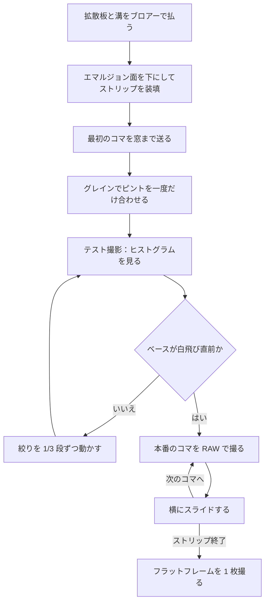

# スキャン

[English](scanning.md) · [简体中文](scanning.zh-CN.md) · **日本語**

> このプロジェクトのカメラ側の半分。箱の上に何を置くか、カメラをフィルムと平行に合わせる方法、ピントと露出、フィルムの装填とコマ送り、そして撮った RAW をどう処理するかを扱います。

**目次：** [始める前に](#始める前に) · [カメラ側の機材](#カメラ側の機材) · [撮影倍率とレンズの選択](#撮影倍率とレンズの選択) · [カメラの高さとスタンド](#カメラの高さとスタンド) · [平行出し](#平行出し) · [ピント](#ピント) · [露出](#露出) · [フィルムの装填](#フィルムの装填) · [1 本撮る](#1-本撮る) · [フラットフィールド補正と反転](#フラットフィールド補正と反転) · [おかしいと感じたら](#おかしいと感じたら)

## 始める前に

NeoBox は[カメラスキャン (camera scanning)](glossary.ja.md#カメラスキャン-camera-scanning) のための光源です——フィルムをスキャナーに通す代わりに、デジタルカメラで複写する方式のことです。この箱は 100 × 120 mm の**開口**を均一に照らし、その上にフィルムストリップを平らに保持するために設計してあります。均一性の目標は四隅の差でおよそ ±0.1 [EV](glossary.ja.md#ev-露出値)。そこから先、それを 1 つのファイルに変える作業はすべてカメラ側で行うものであり、そのどれもこのプロジェクトには含まれていません。

カメラを立てる前に、このリストを一通り確認してください。

- [ ] 箱が組み上がっていて、**フィルムステージ**の水平が出ていて、**上ナット**が固定されている。
- [ ] 乳白アクリル**拡散板**が開口の上に載っていて、保護フィルムが**両面とも**剥がしてある。
- [ ] ストロボが**箱の本体**の床に寝ていて、発光部が奥の壁へ 90° 回してあり、ストロボ本体の上面に白い紙を貼ってある。
- [ ] **アクセスパネル**が差し込まれ、**天板**が座っている。
- [ ] フォーカス用ライト——側壁の z = 50 付近に貼った 5 V USB の LED ストリップ——が点き、調光器は箱の外にある。
- [ ] 拡散板の両面と[フィルムゲート (film gate)](glossary.ja.md#フィルムゲート-film-gate) をブロアーで払ってある。

> [!NOTE]
> この設計はまだ出力も組み立てもされていないため、以下に書かれていることはどれも実測結果ではありません。露出の数値は、そこからブラケットして探すための出発点であって、予測値ではありません。

## カメラ側の機材

| 機材 | ここでの役割 | 実際に効くポイント |
|---|---|---|
| カメラボディ | コマを記録する | マニュアル露出、RAW、拡大できるライブビュー、ホットシュー、そして**メカシャッター**（またはストロボが発光する[電子先幕シャッター (EFCS)](glossary.ja.md#efcs-先幕電子シャッター)） |
| マクロ撮影できるレンズ | センサーをコマで埋める | 使うフォーマットに足りる撮影倍率——下の表を参照 |
| [複写スタンド (copy stand)](glossary.ja.md#複写スタンド-copy-stand)、または水平・反転できるセンターポールを持つ三脚 | カメラを開口の真上に、直角に、動かないように保持する | まず剛性、次にポールの高さ |
| トリガーの送信機 | 箱の中の受信機を作動させる | 買った受信機とペアになること。カメラのホットシューに載せる |
| リモートレリーズ、またはセルフタイマー | カメラに手を触れないため | ボディに触れずにシャッターを切れるものなら何でもよい |
| 反転ソフトウェア | RAW のネガをポジに変える | [フラットフィールド補正と反転](#フラットフィールド補正と反転)で扱う |
| 小さな平面鏡（30 mm 程度） | センサーをフィルム面と平行に合わせる | 平らで、フィルムホルダーの上に載る大きさであること |
| ブロアー・木綿の手袋または清潔な手 | ホコリと指紋 | 他の消耗品と一緒に一覧にある |

これらはどれも **JPY 5,500–9,000（CNY 250–420）** のビルド費用の内側にはなく、ストロボも同様です。より広い一覧は[すでに持っている必要があるもの](getting-started.ja.md#すでに持っている必要があるもの)に、鏡・ブロアー・手袋は[工具と消耗品](bom.ja.md#工具と消耗品)にあります。

送信機はカメラのホットシューに載せ、受信機はストロボと一緒に箱の中に残します。両方が同じチャンネルにあり、両方に電気が残っていることが必要です——チャンネル不一致と受信機の電池切れは、どちらも真っ黒なコマのよくある原因です。ただし、その前にシャッター方式を確認してください。[露出](#露出)を参照。


## 撮影倍率とレンズの選択

[撮影倍率 (magnification ratio)](glossary.ja.md#撮影倍率-magnification-ratio) は、センサー上の像の大きさを被写体の大きさで割った値です。1.0× ではコマが等倍でセンサーに投影され、0.5× では縦横それぞれ半分の範囲しかセンサーを覆いません。

センサーをコマで埋めるために必要な撮影倍率——レンズを選ぶための概算です。

| フォーマット | コマ | フルサイズ (36 × 24) | APS-C (23.5 × 15.6) |
|---|---|---|---|
| 135 | 36 × 24 | 1.0×——1:1 マクロレンズ | 0.65× |
| 6×4.5 | 56 × 41.5 | 0.58× | 0.38× |
| 6×6 | 56 × 56 | 0.43× | 0.28× |
| 6×7 | 56 × 70 | 0.34× | 0.22× |
| 6×9 | 56 × 84 | 0.29× | 0.19× |

1:1 のマクロレンズがあれば、この表のすべての行をカバーできます——大きいフォーマットでは単に等倍より低い倍率を使うだけです。いちばん厳しいのはフルサイズで 135 を撮る場合で、ここだけは 1.0× をまるごと必要とします。

[設計](design.ja.md#3-光学上の判断)のホコリの議論に出てくる 0.43× は、フルサイズで 6×6 を撮る場合の数字です。あそこでその値が引かれているのは、フィルムが拡散板のわずか約 4.3 mm 上にあるからです。拡散板の上のホコリの粒は、0.43×・f/8 のときフィルム面に直径およそ 0.2 mm の淡い斑として投影されます——ネガを反転してしまえば見えませんが、ポジでは見えます。対策は光学的なものではなく手順です——毎セッション、アクリルの両面とフィルムゲートをブロアーで払ってください。

## カメラの高さとスタンド

フィルム面は、**箱が載っている面から約 120.3 mm 上**に来ます。この高さは設計で固定されていて、135 でも 120 でも同じです——どちらのフィルムホルダーもフィルムを同じ高さに差し出すので、フォーマットを替えても水平出しをやり直す必要はありません。

カメラの高さは 2 つの数字から決まります。

```
レンズ先端から机面まで ＝ 120.3 mm ＋ 必要な倍率でのレンズのワーキングディスタンス
```

[ワーキングディスタンス (working distance)](glossary.ja.md#ワーキングディスタンス-working-distance) はレンズの性質であって、箱の性質ではありません。仕様を調べるか実測するかしてから、スタンドを確認してください。

| 買う前・決める前に確認すること | なぜ |
|---|---|
| ベースボードから測って、ポールの可動範囲が 120.3 mm ＋ ワーキングディスタンスに届くか | 1:1 のマクロレンズは、複写スタンドの通常の可動範囲をはるかに超える高さを要求することがある |
| 手を離したときに雲台が沈まないか | 沈みは、1 本のあいだにゆっくりピントがずれていく形で現れる |
| ベースボードが、箱の設置面積 208 × 273 mm より余裕を持って大きいか | 箱をまっすぐ置いたうえで、手を入れる余地が要る |
| ポールが箱に干渉せずに、レンズの光軸が開口の中心まで届くか | センターポールを反転させる三脚は、箱を置きたいところにちょうど脚が来ることがよくある |

高さが決まったら、そこへ戻れるように記録してください。机やマットの上に箱の輪郭を印して——位置決めピン 2 本でも、単にテープでも構いません——フォーマットごとのポールの高さを書き留めます。フォーマットで変わるのは撮影倍率だけで、フィルム面は動きません。

## 平行出し

> [!IMPORTANT]
> 平行が先、均一性が後です。ストロボの閃光は振動を凍結しますが、センサーに対して平行でないフィルム面は、箱の中の何をもっても救えません——どのコマも片側の縁が甘くなります。

目視ではなく、鏡を使います。

1. フィルムホルダーの上、フィルム面に小さな平面鏡を置きます。
   *チェックポイント：* 鏡が平らに載り、がたつかないこと。
2. カメラのライブビューで鏡を見ます。
   *チェックポイント：* レンズとカメラ前面が映って見えること。
3. その映り込みが画面のちょうど中央に来て、左右対称に見えるまでカメラを動かします。
   *チェックポイント：* 映り込んだレンズの鏡胴が同心に見え、片側へ押しやられた楕円になっていないこと。レンズの映り込みが真ん中に来たとき、センサーはフィルム面と平行です。
4. フィルムステージの 3 個のナット——前のナットがピッチ、後ろ 2 個がロール——を微調整して、もう一度確認します。2 巡で収束します。
   *チェックポイント：* すべてから手を離したあとも、映り込みが中央に留まっていること。

<details>
<summary>なぜ鏡で分かり、水準器では分からないのか</summary>

水準器が基準にしているのは重力です。しかしここで本当に必要なのは、センサー面がフィルム面と平行であることです。カメラは完全に水平のままフィルムステージに対して傾いていられますし、逆にフィルムステージが水平でも、カメラが沈んだアームにぶら下がっていることがあります。

鏡はこの問題から重力を消します。鏡が光軸に対して垂直なときにだけ、鏡はレンズをその光軸に沿って映し返します。映り込みが中央で左右対称なら垂直であり、光軸に対して垂直ならセンサーと平行です。これはゼロ位法 (null test) なので、正解に近づくほど感度が上がります。
</details>

箱かカメラを動かしたら、そのたびに平行を取り直してください。以降の[毎セッションの手順](assembly.ja.md#毎セッションの手順)は、平行がすでに出ていることを前提にしています。

## ピント

1. フォーカス用ライトを暗めで点けます。調光器は箱の外に置いたままです。
   *チェックポイント：* 開口がフィルムのディテールを見られる程度に照らされ、調光器が箱の外の手の届く位置にあること。
2. コマを 1 つ装填して、窓までスライドさせます。
   *チェックポイント：* コマが窓の中央に収まり、コマの周囲に残る未露光の縁（レベート）が窓に入り込んでいないこと。
3. ライブビューにして 100 % まで拡大します。
   *チェックポイント：* 拡大表示が静止していて、コマ全体ではなくコマの小さな一部分が映っていること。
4. 写っている絵ではなく、**グレイン**にピントを合わせます。グレインはフィルム面にありますが、輪郭の甘い被写体はそうではありません。
   *チェックポイント：* 絵が単にシャープになるのではなく、グレインの粒がひとつひとつ分離して見えること。
5. 実際に使う絞りまで絞り込んで、中央と対角の 2 隅を見直します。
   *チェックポイント：* 中央でも両隅でもグレインが立っていること。どうしても 1 隅だけ良くならないなら、[平行出し](#平行出し)に戻ってください。
6. レンズをマニュアルフォーカスに切り替えるか、ピントリングをテープで固定して、そのセッション中はもう触りません。
   *チェックポイント：* ピントリングを軽く突いても何も起きないか、テープでしっかり止まっていること。

フォーカス用ライトは撮影中も点けたままで構いません——ストロボの光が圧倒的に強いので、暗めのまま使ってください。フォーカス用ライトは見るためのもので、何かを露光するためのものではありません。

## 露出

| 項目 | 値 | なぜ |
|---|---|---|
| モード | マニュアル | ここにはコマごとに変わってよいものが 1 つもない |
| ISO | [ベース ISO (base ISO)](glossary.ja.md#ベース-iso)——通常は 100 | ストロボの光量には余裕があるので、きれいなほうを取る |
| 絞り | まず f/5.6–f/8 | この箱での測光の出発点 |
| シャッター速度 | **1/125 秒**——カメラの[同調速度 (sync speed)](glossary.ja.md#同調速度-sync-speed)以下 | 同調速度より速いとシャッター幕がコマに影を落とす。1/125 秒ならほぼすべてのカメラで安全で、ラジオトリガーの遅延ぶんの余裕も残る |
| シャッター方式 | メカシャッター、または EFCS でもストロボが発光するならそれ | 下の警告を参照 |
| 記録形式 | [RAW](glossary.ja.md#raw) | 反転にはリニアなデータが要る |
| ホワイトバランス | 固定。値は何でもよい | 後処理でフィルムベースから取り直す |
| 手ぶれ補正 | オフ | スタンドの上では補正ユニットが動いてしまい、コマを甘くする |
| ストロボ | マニュアル発光、ズーム 35–50 mm、ワイドパネルは**装着しない** | ここでは [TTL](glossary.ja.md#ttl-through-the-lens-調光) も [HSS](glossary.ja.md#hss-ハイスピードシンクロ) も役に立たない |

> [!WARNING]
> 完全な電子シャッターでは、そもそもストロボが発光しないのが普通です。最初の 1 コマが真っ黒だったら、他の何より先にシャッター方式のメニューを確認してください。

実用発光量を見つける手順：

1. 出発点として、ストロボを 1/8 に設定します。TT560 の[マニュアル発光量 (manual power fraction)](glossary.ja.md#マニュアル発光量-manual-power-fraction) は 1/1 から 1/128 まで 1 段刻み——8 段階しかなく、その中間はありません。
   *チェックポイント：* ストロボのチャージ完了ランプが点くこと。
2. フィルムをフィルムホルダーに入れた状態で、テストを 1 コマ撮ります。
   *チェックポイント：* コマが真っ黒でないこと——発光しており、トリガーがペアリングできています。
3. ヒストグラムを読みます。画面でいちばん明るいのはコマ間の素抜けのフィルムベースなので、それが白飛びのすぐ手前に来るように露出します。
   *チェックポイント：* ヒストグラムの右端にフィルムベースのピークを見つけられ、端からどれだけ離れているかが分かること。
4. 粗い調整はストロボの発光量で、細かい調整は絞りの 1/3 段で行います。ストロボは 1 段刻みでしか動かないので、細かい詰めは絞りの仕事です。
   *チェックポイント：* 素抜けのフィルムベースがヒストグラムの右端のすぐ手前にあり、白飛び警告が出ていないこと。
5. そこで固定し、1 本のあいだそのままにします。
   *チェックポイント：* ストロボの発光量と絞りを書き留めてあり、アクセスパネルが戻っていること。

筐体による損失を払うために、光源そのものを測ったときの値からおよそ **3–5 段**の発光量を足すことになると見込んでください。この幅は拡散チャンバーの損失の見積もりであって、実測値ではありません。

> [!TIP]
> 発光量を変えるにはアクセスパネルを抜くことになります——ZENIKO T1 はリモートで発光量を設定できません。発光量はキャリブレーションのときに一度決めてしまい、あとは絞りで作業してください。ニッケル水素電池は 2 セット用意してローテーションします。[電源](assembly.ja.md#電源)の表を参照。

<details>
<summary>なぜストロボの閃光そのものが露出になり、それでベース ISO で撮れるのか</summary>

閉じた箱の中では、環境光は何も寄与しません。暗闇の中でシャッターが開き、ストロボが光り、シャッターが閉じる——つまり**閃光そのものが露出**であり、その持続時間は実用発光量で 1/1,000 から 1/20,000 秒です。

これは、連続光の LED パネルが ISO 100・f/8 で必要とする 1/15 から 1/60 秒という実シャッター時間より、1 桁から 3 桁短い実効シャッターです。振動もシャッターショックも床の揺れも、問題でなくなります。

作業していて実感する副次的な効果が 2 つあります。

- どのコマもまったく同じ光量を受けるので、反転の設定 1 つで 1 本まるごと通るのが普通です。
- キセノン管は約 5600 K の、本当に連続したデイライト相当のスペクトルを出します。カラーネガフィルムは、狭帯域の光源よりこちらのほうが素直です。
</details>

## フィルムの装填

> [!CAUTION]
> ストリップを入れるたびに、溝と拡散板の両面、そしてフィルムゲートをブロアーで払ってください。溝の高さは 0.4 mm です——そこに砂粒が 1 つ挟まれば、そこを滑らせたコマすべてに傷が付きますし、傷の付いたネガは元に戻せません。

| ホルダーの寸法 (mm) | 135 | 120 |
|---|---|---|
| 溝幅 | 35.4 | 62.0 |
| 溝高さ | 0.4 | 0.4 |
| 窓 | 25 × 37 | 57 × 85（6×9 に対応） |
| 外形（2 パーツとも） | 110 × 170 | 110 × 170 |

手順：

1. **ホルダー蓋**を**ホルダー底**から外し、両方をブロアーで払います。
   *チェックポイント：* 光にかざして、溝と受けに汚れが見えないこと。
2. フィルムストリップを溝に入れます。つや消しの**エマルジョン面を下**（拡散板側）、つやのあるベース面を上（カメラ側）に向けます。
   *チェックポイント：* ライブビューで縁の文字が正しい向きに読めること。鏡像に読めるなら、ストリップが裏返しです。
3. 送り込む向きはどちらの端からでも構いません——**コーナーブロック**はフィルムステージ中心から |x| = 40–60 mm の位置にしかないので、両側の溝口は完全に開いたままです。
   *チェックポイント：* 指の力だけでストリップが滑ること。決して無理に押し込まないこと。
4. ホルダー蓋を閉じます。開閉用のマグネットがサンドイッチを引き寄せて閉じます。
   *チェックポイント：* ホルダー蓋が平らに座り、縁にフィルムを噛んでいないこと。
5. フィルムホルダーをコーナーブロックの内側に収めてフィルムステージに載せ、ホルダー底を拡散板に平らに当てます。
   *チェックポイント：* ホルダーががたつかず、その下で拡散板が平らに押さえられていること。

取り扱いの注意：

- **ストリップでも 1 本まるごとでも。** ホルダーの 170 mm より長いものは、両端の開いた口からそのままはみ出します。ランアウト回廊はそのためにあります——ホルダーの両端より外側では、中心線から |x| < 31 mm の範囲にフィルムの高さまで立ち上がるものを何も置かないでください。31 は半幅で、120 フィルムの幅はおよそ 62 mm です。
- **コマ送りは横にスライド。** 1 本の途中でフィルムホルダーを開けることはありません。開けることこそが、指紋を付け、フィルムを落とす原因です。
- **縁を持って扱う。** 清潔な手か木綿の手袋で。
- **カール。** 120 フィルムは幅方向のカールが残っていることがよくあります。強くカールしたストリップは、溝に無理やり入れるのではなく、スリーブの中で平らに落ち着かせてから装填してください。残ったぶんはホルダー蓋の押さえリブが平らにします。
- **6×4.5 と 6×6** は 120 のフィルムホルダーを使い、窓の上に `mask-6x6.stl` を載せます。
- **マウント済みのスライドは入りません。** 溝は 0.4 mm で、スライドマウントはそれより厚いからです。

<details>
<summary>なぜ画面に何も触れないのか、そしてなぜ必ず後処理でトリミングするのか</summary>

フィルムの縁は受けに載り、ホルダー蓋の押さえリブが同じ縁を押さえます。画面領域そのものは浮いていて、下に約 0.4 mm、上に約 0.25 mm のすきまがあります。そこには何も触れていません。[ニュートンリング (Newton rings)](glossary.ja.md#ニュートンリング-newton-rings) がここでは発生しえないのも同じ理由です——あの干渉縞はフィルムがガラスと光学的に密着していないと出ませんが、密着そのものがありません。

窓は名目のコマ寸法に対して、意図的に片側およそ 0.5 mm 大きく開けてあります（135 の名目は 24 × 36、120 の名目は 56 × 84）。これでカメラボディごとの画面枠の個体差と、ホルダーごとのプリンタの XY 公差を吸収します。その代償として、コマの周囲にレベートが細く写り込むので、後処理で切り落とします。形状の全体は[設計](design.ja.md#5-フィルムホルダー)にあります。
</details>

## 1 本撮る



1 コマあたりにやることは全部で、窓の中央にコマが来るまでスライドさせ、手を離し、リモートレリーズでシャッターを切り、これを繰り返す——それだけです。

*コマごとのチェックポイント：* シャッターを切る前に、コマの縁やレベートの線が窓に入り込んでいないこと。

最初の 1 本で身に付けておく価値のある習慣：

- **1 本ごとにスレートを撮る。** 最初の 1 枚を撮る前に、その 1 本の ID を書いたカードを 1 コマ撮っておきます。リネームなしでファイルが 1 本ごとにまとまります。
- **フラットフレームはセッションの終わりにも撮る。** 始めだけでなく終わりにも撮っておけば、途中で何かがずれたかどうかが分かります。
- **1 本の途中で発光量を変えない。** 変えるにはアクセスパネルを抜くことになりますし、1 本 1 プロファイルという利点が壊れます。
- **ストリップを替えるたびにブロアー。** 毎回です。

撮影ペースを決めるのは、決めた発光量でのストロボのチャージ時間と、1 コマごとにどれだけ丁寧に確認するかです。1 時間あたり何コマという数字は本設計には存在しません。まだ作られていないからです。長いセッションでは、ニッケル水素電池を 2 セット用意してローテーションするのが実際的な運用です。

## フラットフィールド補正と反転

この順番でやってください。[フラットフィールド補正 (flat-field correction)](glossary.ja.md#フラットフィールド補正-flat-field-correction) が先、[反転 (inversion)](glossary.ja.md#反転-inversion) が後です——ポジになってからのフラットフィールド補正は良し悪しの判断がずっと難しく、補正していないコマを反転すれば周辺減光がそのまま焼き込まれます。

**フラットフレームを撮る。** フィルムホルダーにフィルムを入れず、他は何も触らないまま——同じ絞り、同じピント、同じ高さで——発光面そのものを RAW で撮ります。この 1 コマが、レンズの周辺減光と光源のムラをまとめて記録します。

**当てる。** すべてのコマをこのフラットフレームで割れば、その両方が一度に取り除かれます。あとに残るのは、光源そのものが何をしているかです。

**確認する。** 補正済みのフラットフレームで、四隅の小さなパッチと中央 1 か所をサンプルして比べます。光源に対する設計目標は、フラットフィールド補正後で四隅の差およそ ±0.1 EV です。この帯は端から端まで 0.2 EV 幅、リニアな比では 2^0.2 ≈ 1.15 ——つまり、リニアな RAW 値でいちばん明るいサンプルといちばん暗いサンプルの差が、およそ 15 % 以内に収まっているかを見ます。届かない場合の対処はカメラ側ではなく、キャリブレーションの手順のほうにあります。

この 2 つの仕事をこなすソフトウェア——実在して広く使われているという理由で挙げたもので、推奨ではありません。

| ツール | フラットフィールド補正 | 反転 |
|---|---|---|
| RawTherapee | Raw タブの Flat-Field ツール | Film Negative ツール |
| ART | RawTherapee と同じ系統 | フィルムネガに対応 |
| darktable | — | `negadoctor` モジュール |
| Capture One | LCC（レンズキャストキャリブレーション） | — |
| Lightroom ＋ Negative Lab Pro | プラグイン、または除算レイヤーで | Negative Lab Pro |

そのうえで反転します。

1. **ホワイトバランスを素抜けのフィルムベースで取る。** コマ間の未露光のレベートをサンプルします——カラーネガではそこがオレンジベースで、これを中和することが反転をうまく動かす鍵です。
   *チェックポイント：* レベートがオレンジではなく、ニュートラルグレーに近く読めること。
2. **反転する。** 選んだツールで実行します。
   *チェックポイント：* 全体にかぶりを残さず、ポジとして読めること。
3. **設定を 1 本にコピーする。** どのコマも同じ発光量を受けているので、反転のプロファイル 1 つで 1 本まるごと通るのが普通です。確定する前に、濃いコマ 1 枚と薄いコマ 1 枚で抜き取り確認をしてください。
   *チェックポイント：* 濃いコマも薄いコマも、白飛び・黒つぶれなく反転すること。
4. **コマにトリミングする。** 窓は設計として大きめなので、細く写ったレベートを切り落とします。
   *チェックポイント：* どの辺にもレベートの細片やホルダーの縁が残っていないこと。

**白黒フィルム**にはオレンジベースがありませんが、ベースをサンプルすれば、それでも使えるニュートラル基準になります。

## おかしいと感じたら

| 症状 | まず見る場所 |
|---|---|
| コマが完全に真っ黒 | シャッター方式（電子シャッターではストロボが発光しません）、同調速度、受信機の電池、トリガーのチャンネル |
| 片側の縁だけ甘い | [平行出し](#平行出し)——ピントではありません |
| コマが変わっても同じ位置に出る淡い斑 | 拡散板のホコリ。両面をブロアーで払い、フラットフレームを撮り直す |
| 1 本のあいだに露出が流れていく | 発光量が変わったか、電池が消耗している |
| フラットフィールド補正後も隅のムラが残る | レンズではなく光源。キャリブレーションに戻る |

症状・原因・対処の完全な表は——プリントや組立の不具合が撮影の問題として現れるものも含めて——[トラブルシューティング](troubleshooting.ja.md#撮影)にあります。

---

← [組立](assembly.ja.md) · [ドキュメント一覧](../README.ja.md#ドキュメント) · [トラブルシューティング](troubleshooting.ja.md) →
