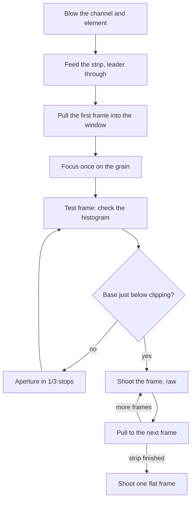

# Scanning

**English** · [简体中文](scanning.zh-CN.md) · [日本語](scanning.ja.md)

> The camera half of the project: what to put above the box, how to square the camera to the film, how to focus and expose, how to load and advance film, and what to do with the raw files afterwards.

**Contents:** [Before you start](#before-you-start) · [Camera-side equipment](#camera-side-equipment) · [Magnification and lens choice](#magnification-and-lens-choice) · [Camera height and the stand](#camera-height-and-the-stand) · [Parallelism](#parallelism) · [Focus](#focus) · [Exposure](#exposure) · [Loading film](#loading-film) · [Shooting a roll](#shooting-a-roll) · [Flat-field and inversion](#flat-field-and-inversion) · [When something looks wrong](#when-something-looks-wrong)

## Before you start

NeoBox is a light source for [camera scanning](glossary.md#camera-scanning): photographing film with a digital camera instead of feeding it through a scanner. The box lights a 62 × 95 mm window evenly through an opal-acrylic diffuser, with the film strip held flat 4.6 mm above it. Everything that turns that into a file happens on the camera side, and none of it ships with the project.

Work through this list before you set a camera up:

- [ ] The main body stands on the desk and the cover-stage sits on the wall tenons, with the opal acrylic in its recess and the protective film peeled from **both** faces.
- [ ] The four steel shims sit flush in their pockets in the cover-stage.
- [ ] The flash lies flat on the desk with its head at the fully open front, firing into the cavity; any hot-shoe flash works here. The T1 receiver stays with the flash, outside the box.
- [ ] The film holder for your format sits inside the tray flange, with its flattening element (the pressure-window insert by default, the AN glass for badly curled rolls) seated in its ledge.
- [ ] The room is dim, and no ceiling light shines straight into the open front.
- [ ] You have blown the channel and the flattening element with a rocket blower, and in glass mode both faces of the glass before it went in.

> [!NOTE]
> This design has not been printed or built, so nothing below is a measured result. Exposure figures are starting points to bracket from, not predictions.

## Camera-side equipment

| Item | What it does here | What actually matters |
|---|---|---|
| Camera body | Records the frame | Manual exposure, raw files, live view with magnification, a hot shoe, and a **mechanical shutter** (or [EFCS](glossary.md#efcs) that still fires flash) |
| Macro-capable lens | Fills the sensor with the frame | Enough magnification for your format; see the table below |
| [Copy stand](glossary.md#copy-stand), or a tripod with a horizontal or reversible column | Holds the camera square, still, and directly over the light window | Rigidity first, then enough column height |
| Trigger transmitter | Fires the receiver on the flash, outside the box | Must pair with the receiver you bought; goes on the camera hot shoe |
| Remote release, or the self-timer | Keeps your hand off the camera | Anything that trips the shutter without touching the body |
| Inversion software | Turns a raw negative into a positive | Covered in [Flat-field and inversion](#flat-field-and-inversion) |
| Small flat mirror, about 30 mm | Squares the sensor to the film plane | Flat and small enough to sit on the holder |
| Rocket blower · cotton gloves or clean hands | Dust and fingerprints | Listed with the other consumables |

None of this is inside the build cost, and neither is the flash. See [what you must already own](getting-started.md#what-you-must-already-own) for the wider list, and [tools and consumables](bom.md#tools-and-consumables) for the mirror, blower and gloves.

The transmitter goes on the camera's hot shoe; the receiver stays on the desk with the flash, outside the box. Both must be on the same channel and both need charge: an unpaired channel and a flat receiver battery are common causes of a black frame. Check the shutter type first, though: see [Exposure](#exposure).


## Magnification and lens choice

[Magnification ratio](glossary.md#magnification-ratio) is the size of the image on the sensor divided by the size of the subject. At 1.0× the frame is projected onto the sensor at life size; at 0.5× it covers half as much sensor in each direction.

Magnification needed to fill the sensor with the frame (approximate, for choosing a lens):

| Format | Frame | Full frame (36 × 24) | APS-C (23.5 × 15.6) |
|---|---|---|---|
| 135 | 36 × 24 | 1.0× (a 1:1 macro lens) | 0.65× |
| 6×4.5 | 56 × 41.5 | 0.58× | 0.38× |
| 6×6 | 56 × 56 | 0.43× | 0.28× |
| 6×7 | 56 × 70 | 0.34× | 0.22× |
| 6×9 | 56 × 84 | 0.29× | 0.19× |

Any 1:1 macro lens covers every row in this table; for the larger formats you simply use less than full magnification. The demanding case is 135 on full frame, which needs the full 1.0×.

Dust sorts by surface, not by magnification. A particle on the acrylic diffuser does not image at all. The diffuser is itself the glowing surface, so anything sitting on it just becomes part of the light; wipe it now and then. What does image is dust at or near the film plane: on the film itself, always, and in glass mode on the underside of the AN glass, which sits only 0.2 mm from the film. That is why the glass gets blown before it goes in, and why the [film gate](glossary.md#film-gate) and channel get blown before every strip. The optical reasoning is in [Design](design.md#3-optical-decisions).

## Camera height and the stand

The film plane sits at **83.2 mm above whatever surface the box stands on**. That height is fixed by the design and is the same for 135 and 120: both holders present the film at the same level, so you do not re-level anything when you change format. The one exception is the 6×6 mask, which lifts the 120 holder by 1 mm. That is normal; refocus and carry on.

Camera height follows from two numbers:

```
lens front to desk = 83.2 mm + the lens's working distance at the magnification you need
```

[Working distance](glossary.md#working-distance) is a property of your lens, not of the box. Look it up or measure it, then check the stand:

| Check before you buy or commit | Why |
|---|---|
| Column travel reaches 83.2 mm + working distance, measured from the baseboard | A macro lens at 1:1 can want far more height than a copy stand's normal range |
| The head does not sag when you let go | Sag shows up as a slow focus drift across a roll |
| The baseboard is comfortably larger than the box footprint of 124.8 × 154.8 mm, with clear desk in front for the flash | The box has to sit square, the flash has to lie at the open front, and your hands still need room |
| The lens axis can reach the centre of the light window without the column fouling the box | A reversible-column tripod often puts a leg exactly where the box wants to be |

Once the height is right, register it so you can return to it: mark the box's footprint on the desk or mat (two locating pins, or simply tape) and write down the column height for each format. Only magnification changes between formats; the film plane does not move. And if you have to move the box, lift it level: the assembled stack is held together by gravity and magnets, not fasteners.

## Parallelism

> [!IMPORTANT]
> Parallelism first, evenness second. The flash pulse freezes vibration, but nothing in the box can rescue a film plane that is not parallel to the sensor: one edge of every frame will be soft.

Use a mirror, not your eye:

1. Lay the small flat mirror on the film plane, on top of the holder.
   *Checkpoint:* the mirror lies flat and does not rock.
2. Look through the camera in live view at the mirror.
   *Checkpoint:* you can see the lens and the front of the camera reflected back at you.
3. Move the camera until that reflection sits exactly in the centre of the frame and looks symmetrical.
   *Checkpoint:* the reflected lens barrel is concentric, not an oval pushed to one side. When the reflection of the lens is dead centre, the sensor is parallel to the film plane.
4. Correct at the camera, not the box: tilt the copy-stand head, or shim its mount if it has no tilt adjustment, and re-check. Two passes converge. The box has no levelling hardware; the mirror method absorbs its printing tolerances along the way.
   *Checkpoint:* the reflection stays centred after you take your hands off everything.

<details>
<summary>Why the mirror works, and why a spirit level does not</summary>

A spirit level references gravity. What you actually need is the sensor plane parallel to the film plane, and the camera can be perfectly level while still tilted relative to the box, or the box can be level while the camera hangs off a sagging arm.

The mirror removes gravity from the problem. A mirror reflects the lens back along the optical axis only when the mirror is perpendicular to that axis. Centred and symmetrical reflection means perpendicular; perpendicular to the axis means parallel to the sensor. It is a null test, so it gets more sensitive as you get closer to correct.
</details>

Re-check parallelism whenever the box or the camera has been moved. The rest of the [session routine](assembly.md#formats-and-everyday-handling) assumes it is already right.

## Focus

1. Give the room just enough light to see film detail, keeping every lamp out of the open front's line of sight.
   *Checkpoint:* you can see film detail in the window.
2. Load a strip and pull the first frame into the window.
   *Checkpoint:* the frame sits centred in the window, with no rebate line intruding.
3. Go to live view and magnify to 100 %.
   *Checkpoint:* the magnified view is steady and shows one small patch of the frame, not the whole frame.
4. Focus on the **grain**, not on the picture. Grain is at the film plane; a soft-edged subject is not.
   *Checkpoint:* you can see individual grain clumps break up, not just a sharper picture.
5. Stop down to the aperture you will actually shoot at and re-check the centre and two opposite corners.
   *Checkpoint:* grain is crisp in the centre and in both corners. If one corner never comes good, go back to [Parallelism](#parallelism).
6. Switch the lens to manual focus, or tape the focus ring, and do not touch it again for the rest of the session.
   *Checkpoint:* nudging the focus ring does nothing, or the tape holds it fast.

## Exposure

| Setting | Value | Why |
|---|---|---|
| Mode | Manual | Nothing here should change frame to frame |
| ISO | [Base ISO](glossary.md#base-iso), usually 100 | The flash has power to spare, so take the clean option |
| Aperture | Start at f/5.6–f/8 | The metering start point for this box |
| Shutter | **1/125 s**, at or below your camera's [sync speed](glossary.md#sync-speed) | Above sync speed the curtain shades the frame: a focal-plane shutter tops out at 1/160–1/250, and a cheap 2.4G trigger eats about a stop of that. 1/125 s clears almost every camera and leaves margin |
| Shutter type | Mechanical, or EFCS if your camera still fires flash with it | See the warning below |
| File | [Raw](glossary.md#raw) | Inversion needs the linear data |
| White balance | Fixed, any value | You will set it off the film base in post |
| Stabilisation | Off | On a stand it hunts and softens frames |
| Flash | Manual power | [TTL](glossary.md#ttl) and [HSS](glossary.md#hss) do nothing useful here |

> [!WARNING]
> A fully electronic shutter will usually not fire a flash at all. If your first frame is black, check the shutter-type menu before you check anything else.

Finding the working power:

1. Set the flash to 1/8 power as a starting point. Any hot-shoe flash with manual power works here; the reference TT560 offers [manual power](glossary.md#manual-power-fraction) from 1/1 to 1/128 in full stops: eight steps, nothing in between.
   *Checkpoint:* the flash's ready lamp lights.
2. Shoot one test frame with film in the holder.
   *Checkpoint:* the frame is not black: the flash fired and the trigger is paired.
3. Read the histogram. The clear film base between frames is the brightest thing in the image; expose so it sits just below clipping.
   *Checkpoint:* you can find the film-base peak at the right-hand end of the histogram and see how far it sits from the edge.
4. Adjust coarsely with flash power, finely with the aperture in 1/3 stops. The flash only moves in full stops, so the aperture does the fine work.
   *Checkpoint:* the clear film base sits just below the right-hand edge of the histogram, with no clipping warning.
5. Lock it and leave it for the whole roll.
   *Checkpoint:* flash power and aperture are written down.

Expect to pay several stops of flash power over a bare-source reading for the bounce path through the box. This design has not been built, so no loss figure exists; treat 1/8 as nothing more than a start, and bracket.

> [!TIP]
> The flash and its T1 receiver sit on the desk in front of the box, so changing flash power never touches the box, and changing the receiver's batteries never opens anything. Settle power once during calibration and then do the fine work with the aperture. Keep two sets of NiMH cells in rotation.

<details>
<summary>Why the flash pulse is the exposure, and why that lets you shoot at base ISO</summary>

The front of the box is open, but in a dim room that changes nothing: the flash pulse is orders of magnitude brighter than anything the room leaks in through the opening. The shutter opens in near-darkness, the flash fires, the shutter closes. So the **flash pulse is the exposure**, and its duration is 1/1,000 to 1/20,000 s at working power.

That is an effective shutter one to three orders of magnitude shorter than the 1/15 to 1/60 s of real shutter time a continuous LED panel would need at ISO 100 and f/8. Vibration, shutter shock and floor rumble stop mattering.

Two further consequences you will feel while working:

- Every frame gets identical output, so one inversion setting usually fits the whole roll.
- The xenon tube gives a genuinely continuous, daylight-like spectrum of about 5600 K, which colour negative film is happier under than a narrow-band emitter.
</details>

## Loading film

> [!CAUTION]
> Blow the channel mouths and the flattening element before every strip, and in glass mode blow both faces of the glass before it goes in. The film runs through a 0.4 mm space; a grain of grit trapped in it scratches every frame you pull across it, and a scratched negative cannot be un-scratched.

| Holder feature (mm) | 135 | 120 |
|---|---|---|
| Channel width | 35.4 | 62.0 |
| Channel height | 0.4 | 0.4 |
| Window | 25 × 37 | 57 × 85 (a full 6×9 frame) |
| Outline, both parts | 94 × 120 | 94 × 120 |

Two flattening modes share the same holder, and the film handling is identical in both:

- **Pressure-window insert (the default).** A printed 64 × 95 × 2 frame, one per format, that hard-limits the film at all four edges of the window. Residual ripple stays within about 0.28 mm, inside the roughly ±0.4 mm depth of field at 1:1 and f/8.
- **AN glass (the upgrade for badly curled rolls).** One 64 × 95 × 2 sheet of anti-Newton glass serves both formats and caps the whole frame continuously, holding any point of it within the same 0.28 mm. The matte AN face goes **down**, riding on the shiny film base, a pairing that does not form [Newton rings](glossary.md#newton-rings), while the emulsion faces the open window below and touches nothing.

Set up once per mode, not per strip:

1. Blow the element and seat it in the 4.6 mm ledge on the holder base. In glass mode give the underside particular attention: it sits only 0.2 mm from the film plane, so any dust on it lands in the image.
   *Checkpoint:* the element lies flat in the ledge and does not rock.
2. Close the holder lid. The closure magnets pull the sandwich shut, and the lid's cavity holds the element captive with a little float.
   *Checkpoint:* the lid sits down flat.
3. Set the holder into the tray flange on the cover-stage; the magnets in its base seat against the steel shims let into the stage.
   *Checkpoint:* the holder sits inside the flange without rocking.

Then, per strip:

1. Blow the channel from both mouths.
   *Checkpoint:* the channel is visibly clean under a light.
2. Feed the strip into either channel mouth and push gently until the leader emerges from the far side. Emulsion (the dull face) goes down by default, shiny base up; the guide rails lead the strip under the element, and the holder stays closed.
   *Checkpoint:* the strip slides with finger pressure alone. Never force it.
3. Mind the bow. A strip with a pronounced curl goes bow **down** in insert mode and bow **up** in glass mode. If that puts the emulsion up, the edge markings will read mirrored in live view; flip the image in post rather than fighting the film.
   *Checkpoint:* the strip lies in the channel without lifting at the mouths.
4. Pinch the leader where it protrudes from the holder and pull until the first frame is centred in the window.
   *Checkpoint:* the frame sits centred, with no rebate line intruding.

Handling notes:

- **Strips or a whole roll.** Anything longer than the holder overhangs the open ends and drapes onto the tray flange, which runs 0.2 mm below the film plane exactly so it can act as a support. With a long strip, carry the far end in your free hand so it does not drag across the flange edge.
- **Advance by pulling the leader.** The holder is never opened mid-roll: pinch the protruding end and pull, the same motion in insert and glass mode alike. Any bowed patch is pressed flat against the element's underside as it slides through.
- **Changing format = changing the holder.** Lift the whole holder off the stage against its magnets and set the other one in. It takes a few seconds, and nothing needs re-levelling.
- **Handle by the edges**, with clean hands or cotton gloves.
- **6×6** uses the 120 holder with `mask-6x6.stl` laid **under** the base, in the tray; the holder rides 1 mm higher; normal, just refocus. **6×4.5** has no dedicated mask: frame it in the 120 window and crop in post.
- **Mounted slides do not fit.** The channel is 0.4 mm; a slide mount is not.

<details>
<summary>Why the film comes out flat, and why you always crop in post</summary>

The film's edges ride on the perch of the holder base, 0.4 mm below the underside of the flattening element: a hard-limited channel on all four sides and across the full width of the frame. With the insert, nothing touches the image area at all, and it can ripple by at most about 0.28 mm, which the roughly ±0.4 mm depth of field at 1:1 and f/8 covers. With the AN glass, the whole frame is capped continuously and any point of it is held within the same 0.28 mm, and still nothing touches the emulsion: the glass's matte face rides on the shiny base, a pairing that does not form [Newton rings](glossary.md#newton-rings), while the emulsion faces the open window below.

The windows are deliberately about 0.5 mm oversize per side against the nominal frame (135 nominal 24 × 36, 120 nominal 56 × 84). That absorbs camera-gate variance between film bodies and printer XY tolerance between holders. The cost is that you see a sliver of rebate around the frame and crop it off in post. Full geometry is in [Design](design.md#5-film-holders).
</details>

## Shooting a roll



Per frame, the whole job is: pull the leader until the next frame is centred in the window, take your hands off, trip the shutter with the remote release, repeat.

*Checkpoint per frame:* no frame edge or rebate line intrudes into the window before you fire.

Habits worth forming on the first roll:

- **Slate the roll.** Shoot one frame of a card with the roll's ID before the first image. Files then group by roll without renaming.
- **Shoot the flat frame at the end of the session too**, not just the start, so you can tell whether anything shifted.
- **Do not change flash power mid-roll.** The flash sits on the open desk where it is easy to nudge; resist, because one power change breaks the one-profile-per-roll advantage.
- **Blow between strips**, every time.

Throughput is set by the flash's recycle time at whatever power you settled on and by how carefully you check each frame. No frames-per-hour figure exists for this design, because it has not been built. Two sets of NiMH cells in rotation is the practical arrangement for a long session.

## Flat-field and inversion

Do these in order. [Flat-field correction](glossary.md#flat-field-correction) first, [inversion](glossary.md#inversion) second: flat-fielding a positive is much harder to judge, and inverting an uncorrected frame bakes the vignetting in.

**Shoot the flat frame.** With no film in the holder and everything else untouched (same aperture, same focus, same height), photograph the bare lit surface, raw. That one frame records lens vignetting and source unevenness together.

**Apply it.** Dividing every frame by the flat frame removes both at once. What is left is what the source itself is doing.

**Check it.** Sample a small patch in each of the four corners and one in the centre of a corrected flat frame and compare them. A practical acceptance band for the source is about ±0.1 [EV](glossary.md#ev) corner to corner, measured after flat-field correction. That band is 0.2 EV wide end to end, a linear ratio of 2^0.2 ≈ 1.15, so you are looking for under about 15 % spread between the brightest and the darkest sample in the linear raw values. If it misses, the remedy is at the light end (how the flash lies against the open front), not in the camera.

Software that does these two jobs, named because they exist and are in common use, not as endorsements:

| Tool | Flat-field | Inversion |
|---|---|---|
| RawTherapee | Flat-Field tool, Raw tab | Film Negative tool |
| ART | Same lineage as RawTherapee | Film negative support |
| darktable | — | `negadoctor` module |
| Capture One | LCC (lens cast calibration) | — |
| Lightroom + Negative Lab Pro | Via a plug-in or a divide layer | Negative Lab Pro |

Then invert:

1. **Set white balance off the clear film base.** Sample the unexposed rebate between frames: on colour negative that is the orange mask, and neutralising it is what makes the inversion behave.
   *Checkpoint:* the rebate reads close to neutral grey, not orange.
2. **Invert** with your chosen tool.
   *Checkpoint:* the frame reads as a positive, without an overall cast left across it.
3. **Copy the settings across the roll.** Because every frame received the same flash output, one inversion profile normally fits the whole roll. Spot-check a dense frame and a thin one before you commit.
   *Checkpoint:* the dense frame and the thin frame both invert without clipping.
4. **Crop to the frame.** The window is oversize by design, so trim the rebate sliver off.
   *Checkpoint:* no rebate sliver or holder edge is left on any side.

**Black-and-white film** has no orange mask, but sampling the base still gives you a usable neutral reference.

## When something looks wrong

| Symptom | Look here first |
|---|---|
| The frame is completely black | Shutter type (electronic shutter will not fire the flash), sync speed, receiver battery, trigger channel |
| A clean dark band across the frame | Shutter above the effective sync speed: focal-plane shutters top out at 1/160–1/250, and a cheap 2.4G trigger eats about a stop of that. Drop to 1/125 s |
| Soft along one edge only | [Parallelism](#parallelism), not focus |
| Soft blobs that stay put frame to frame | Dust at the film plane: on the film, or in glass mode on the glass underside. Blow and re-shoot the flat frame; dust on the diffuser itself does not image |
| Exposure drifts across the roll | Flash power got nudged (the flash sits on the open desk), or the cells are flat |
| Corners still uneven after flat-field correction | The source, not the lens: re-seat the flash head against the open front and re-shoot the flat frame |

The full symptom-cause-fix tables, including the printing and assembly faults that show up as capture problems, are in [Troubleshooting](troubleshooting.md#capture).

---

← [Assembly](assembly.md) · [Documentation index](../README.md#documentation) · [Troubleshooting](troubleshooting.md) →
