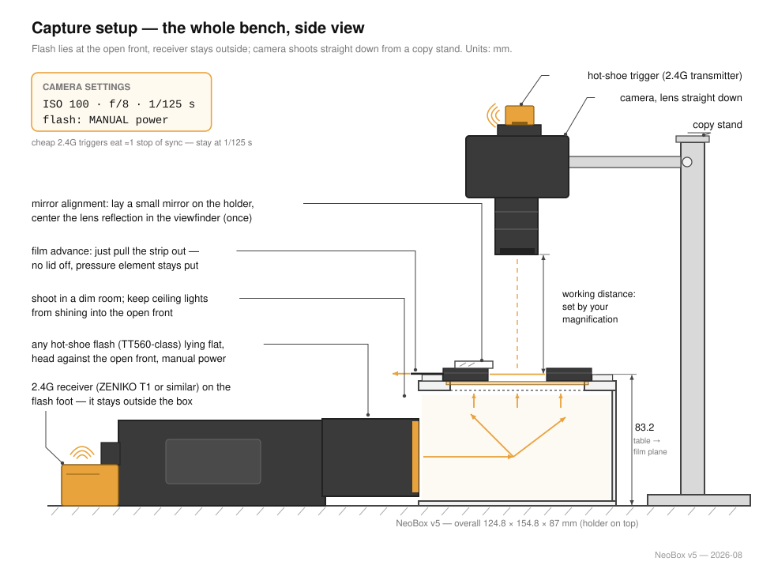
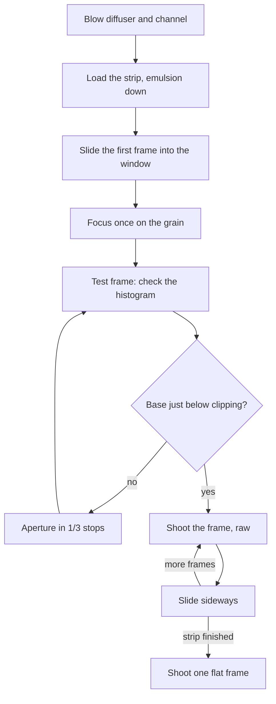

# Scanning

**English** · [简体中文](scanning.zh-CN.md) · [日本語](scanning.ja.md)

> The camera half of the project: what to put above the box, how to square the camera to the film, how to focus and expose, how to load and advance film, and what to do with the raw files afterwards.

**Contents:** [Before you start](#before-you-start) · [Camera-side equipment](#camera-side-equipment) · [Magnification and lens choice](#magnification-and-lens-choice) · [Camera height and the stand](#camera-height-and-the-stand) · [Parallelism](#parallelism) · [Focus](#focus) · [Exposure](#exposure) · [Loading film](#loading-film) · [Shooting a roll](#shooting-a-roll) · [Flat-field and inversion](#flat-field-and-inversion) · [When something looks wrong](#when-something-looks-wrong)

## Before you start

NeoBox is a light source for [camera scanning](glossary.md#camera-scanning) — photographing film with a digital camera instead of feeding it through a scanner. The box is designed to light a 100 × 120 mm aperture evenly — the target is about ±0.1 [EV](glossary.md#ev) corner to corner — with a film strip held flat above it. Everything that turns that into a file happens on the camera side, and none of it ships with the project.

Work through this list before you set a camera up:

- [ ] The box is assembled, the film stage is levelled, and the upper nuts are locked.
- [ ] The opal acrylic diffuser sits over the aperture with the protective film peeled from **both** faces.
- [ ] The flash lies on the floor of the main body, head turned 90° to the far wall, white paper taped to its top face.
- [ ] The access panel is plugged in and the top cover is seated.
- [ ] The focus light — the 5 V USB LED strip at about z = 50 on the side wall — works, with its dimmer outside the box.
- [ ] You have blown both faces of the diffuser and the [film gate](glossary.md#film-gate) with a rocket blower.

> [!NOTE]
> This design has not been printed or built, so nothing below is a measured result. Exposure figures are starting points to bracket from, not predictions.

## Camera-side equipment

| Item | What it does here | What actually matters |
|---|---|---|
| Camera body | Records the frame | Manual exposure, raw files, live view with magnification, a hot shoe, and a **mechanical shutter** (or [EFCS](glossary.md#efcs) that still fires flash) |
| Macro-capable lens | Fills the sensor with the frame | Enough magnification for your format — see the table below |
| [Copy stand](glossary.md#copy-stand), or a tripod with a horizontal or reversible column | Holds the camera square, still, and directly over the aperture | Rigidity first, then enough column height |
| Trigger transmitter | Fires the receiver inside the box | Must pair with the receiver you bought; goes on the camera hot shoe |
| Remote release, or the self-timer | Keeps your hand off the camera | Anything that trips the shutter without touching the body |
| Inversion software | Turns a raw negative into a positive | Covered in [Flat-field and inversion](#flat-field-and-inversion) |
| Small flat mirror, about 30 mm | Squares the sensor to the film plane | Flat and small enough to sit on the holder |
| Rocket blower · cotton gloves or clean hands | Dust and fingerprints | Listed with the other consumables |

None of this is inside the CNY 250–420 build cost, and neither is the flash. See [what you must already own](getting-started.md#what-you-must-already-own) for the wider list, and [tools and consumables](bom.md#tools-and-consumables) for the mirror, blower and gloves.

The transmitter goes on the camera's hot shoe; the receiver stays inside the box with the flash. Both must be on the same channel and both need charge — an unpaired channel and a flat receiver battery are both common causes of a black frame. Check the shutter type first, though: see [Exposure](#exposure).



## Magnification and lens choice

[Magnification ratio](glossary.md#magnification-ratio) is the size of the image on the sensor divided by the size of the subject. At 1.0× the frame is projected onto the sensor at life size; at 0.5× it covers half as much sensor in each direction.

Magnification needed to fill the sensor with the frame — approximate, for choosing a lens:

| Format | Frame | Full frame (36 × 24) | APS-C (23.5 × 15.6) |
|---|---|---|---|
| 135 | 36 × 24 | 1.0× — a 1:1 macro lens | 0.65× |
| 6×4.5 | 56 × 41.5 | 0.58× | 0.38× |
| 6×6 | 56 × 56 | 0.43× | 0.28× |
| 6×7 | 56 × 70 | 0.34× | 0.22× |
| 6×9 | 56 × 84 | 0.29× | 0.19× |

Any 1:1 macro lens covers every row in this table — for the larger formats you simply use less than full magnification. The demanding case is 135 on full frame, which needs the full 1.0×.

The 0.43× that appears in the dust argument in [Design](design.md#3-optical-decisions) is the 6×6-on-full-frame case. It is quoted there because film sits only about 4.3 mm above the diffuser: a dust particle on the diffuser projects as a soft blob about 0.2 mm across at the film plane at 0.43× and f/8 — invisible once a negative is inverted, visible on slides. The mitigation is procedural, not optical: blow both acrylic faces and the film gate every session.

## Camera height and the stand

The film plane sits at **about 120.3 mm above whatever surface the box stands on**. That height is fixed by the design and is the same for 135 and 120 — both holders present the film at the same level, so you do not re-level anything when you change format.

Camera height follows from two numbers:

```
lens front to desk = 120.3 mm + the lens's working distance at the magnification you need
```

[Working distance](glossary.md#working-distance) is a property of your lens, not of the box. Look it up or measure it, then check the stand:

| Check before you buy or commit | Why |
|---|---|
| Column travel reaches 120.3 mm + working distance, measured from the baseboard | A macro lens at 1:1 can want far more height than a copy stand's normal range |
| The head does not sag when you let go | Sag shows up as a slow focus drift across a roll |
| The baseboard is comfortably larger than the box footprint of 208 × 273 mm | The box has to sit square, with room for your hands |
| The lens axis can reach the centre of the aperture without the column fouling the box | A reversible-column tripod often puts a leg exactly where the box wants to be |

Once the height is right, register it so you can return to it: mark the box's footprint on the desk or mat — two locating pins, or simply tape — and write down the column height for each format. Only magnification changes between formats; the film plane does not move.

## Parallelism

> [!IMPORTANT]
> Parallelism first, evenness second. The flash pulse freezes vibration, but nothing in the box can rescue a film plane that is not parallel to the sensor — one edge of every frame will be soft.

Use a mirror, not your eye:

1. Lay the small flat mirror on the film plane, on top of the holder.
   *Checkpoint:* the mirror lies flat and does not rock.
2. Look through the camera in live view at the mirror.
   *Checkpoint:* you can see the lens and the front of the camera reflected back at you.
3. Move the camera until that reflection sits exactly in the centre of the frame and looks symmetrical.
   *Checkpoint:* the reflected lens barrel is concentric, not an oval pushed to one side. When the reflection of the lens is dead centre, the sensor is parallel to the film plane.
4. Trim the three stage nuts — front nut for pitch, rear pair for roll — and re-check. Two passes converge.
   *Checkpoint:* the reflection stays centred after you take your hands off everything.

<details>
<summary>Why the mirror works, and why a spirit level does not</summary>

A spirit level references gravity. What you actually need is the sensor plane parallel to the film plane, and the camera can be perfectly level while still tilted relative to the stage — or the stage can be level while the camera hangs off a sagging arm.

The mirror removes gravity from the problem. A mirror reflects the lens back along the optical axis only when the mirror is perpendicular to that axis. Centred and symmetrical reflection means perpendicular; perpendicular to the axis means parallel to the sensor. It is a null test, so it gets more sensitive as you get closer to correct.
</details>

Re-check parallelism whenever the box or the camera has been moved. The rest of the [session routine](assembly.md#session-routine) assumes it is already right.

## Focus

1. Switch on the focus light at low brightness. Its dimmer stays outside the box.
   *Checkpoint:* the aperture is lit well enough to see film detail, and the dimmer is still in reach outside the box.
2. Load one frame and slide it into the window.
   *Checkpoint:* the frame sits centred in the window, with no rebate line intruding.
3. Go to live view and magnify to 100 %.
   *Checkpoint:* the magnified view is steady and shows one small patch of the frame, not the whole frame.
4. Focus on the **grain**, not on the picture. Grain is at the film plane; a soft-edged subject is not.
   *Checkpoint:* you can see individual grain clumps break up, not just a sharper picture.
5. Stop down to the aperture you will actually shoot at and re-check the centre and two opposite corners.
   *Checkpoint:* grain is crisp in the centre and in both corners. If one corner never comes good, go back to [Parallelism](#parallelism).
6. Switch the lens to manual focus, or tape the focus ring, and do not touch it again for the rest of the session.
   *Checkpoint:* nudging the focus ring does nothing, or the tape holds it fast.

The focus light stays on while you shoot if you like — run it low, because the flash overwhelms it. It is there so you can see, not to expose anything.

## Exposure

| Setting | Value | Why |
|---|---|---|
| Mode | Manual | Nothing here should change frame to frame |
| ISO | [Base ISO](glossary.md#base-iso) — usually 100 | The flash has power to spare, so take the clean option |
| Aperture | Start at f/5.6–f/8 | The metering start point for this box |
| Shutter | At or below your camera's [sync speed](glossary.md#sync-speed) | Above it the shutter curtain shades the frame |
| Shutter type | Mechanical, or EFCS if your camera still fires flash with it | See the warning below |
| File | [Raw](glossary.md#raw) | Inversion needs the linear data |
| White balance | Fixed, any value | You will set it off the film base in post |
| Stabilisation | Off | On a stand it hunts and softens frames |
| Flash | Manual power, zoom 35–50 mm, **no** wide-angle diffuser panel fitted | [TTL](glossary.md#ttl) and [HSS](glossary.md#hss) do nothing useful here |

> [!WARNING]
> A fully electronic shutter will usually not fire a flash at all. If your first frame is black, check the shutter-type menu before you check anything else.

Finding the working power:

1. Set the flash to 1/8 power as a starting point. The TT560 offers [manual power](glossary.md#manual-power-fraction) from 1/1 to 1/128 in full stops — eight steps, nothing in between.
   *Checkpoint:* the flash's ready lamp lights.
2. Shoot one test frame with film in the holder.
   *Checkpoint:* the frame is not black — the flash fired and the trigger is paired.
3. Read the histogram. The clear film base between frames is the brightest thing in the image; expose so it sits just below clipping.
   *Checkpoint:* you can find the film-base peak at the right-hand end of the histogram and see how far it sits from the edge.
4. Adjust coarsely with flash power, finely with the aperture in 1/3 stops. The flash only moves in full stops, so the aperture does the fine work.
   *Checkpoint:* the clear film base sits just below the right-hand edge of the histogram, with no clipping warning.
5. Lock it and leave it for the whole roll.
   *Checkpoint:* flash power and aperture are written down, and the access panel is back in.

Expect to add roughly **3–5 stops** of flash power over a bare-source reading to pay for the enclosure. That range is an estimate of the cavity's loss, not a measurement.

> [!TIP]
> Changing flash power means pulling the access panel — the ZENIKO T1 cannot set power remotely. Settle power once during calibration and then work with the aperture. Keep two sets of NiMH cells in rotation; see the [power table](assembly.md#power).

<details>
<summary>Why the flash pulse is the exposure, and why that lets you shoot at base ISO</summary>

Inside a closed box, ambient light contributes nothing. The shutter is open in the dark, the flash fires, the shutter closes — so the **flash pulse is the exposure**, and its duration is 1/1,000 to 1/20,000 s at working power.

That is an effective shutter one to three orders of magnitude shorter than the 1/15 to 1/60 s of real shutter time a continuous LED panel would need at ISO 100 and f/8. Vibration, shutter shock and floor rumble stop mattering.

Two further consequences you will feel while working:

- Every frame gets identical output, so one inversion setting usually fits the whole roll.
- The xenon tube gives a genuinely continuous, daylight-like spectrum of about 5600 K, which colour negative film is happier under than a narrow-band emitter.
</details>

## Loading film

> [!CAUTION]
> Blow the channel, both faces of the diffuser, and the film gate before every strip. The channel is 0.4 mm high — a grain of grit trapped in it scratches every frame you slide across it, and a scratched negative cannot be un-scratched.

| Holder feature (mm) | 135 | 120 |
|---|---|---|
| Channel width | 35.4 | 62.0 |
| Channel height | 0.4 | 0.4 |
| Window | 25 × 37 | 57 × 85 (covers 6×9) |
| Outline, both parts | 110 × 170 | 110 × 170 |

Procedure:

1. Lift the holder lid off the holder base and blow both.
   *Checkpoint:* the channel and the lands are visibly clean under a light.
2. Lay the film strip into the channel with the **dull emulsion side down** toward the diffuser and the shiny base up toward the camera.
   *Checkpoint:* the edge markings read the right way round in live view. If they read mirrored, the strip is upside down.
3. Feed from whichever end suits you — both channel mouths stay fully open, because the corner blocks sit only at |x| = 40–60 mm from the stage centre.
   *Checkpoint:* the strip slides with finger pressure alone. Never force it.
4. Close the holder lid. The closure magnets pull the sandwich shut.
   *Checkpoint:* the holder lid sits down flat, with no film pinched at the edge.
5. Set the film holder on the film stage inside the corner blocks, base flat on the diffuser.
   *Checkpoint:* the holder does not rock, and the diffuser is held flat under it.

Handling notes:

- **Strips or a whole roll.** Anything longer than the 170 mm holder simply overhangs both open ends. That is what the run-out corridor is for: keep the space beyond the holder ends clear of anything that rises to film height within |x| < 31 mm of the centreline — 31 is the half-width, and 120 film is about 62 mm wide.
- **Advance by sliding sideways.** The holder is never opened mid-roll. Opening it is how film gets fingerprinted and dropped.
- **Handle by the edges**, with clean hands or cotton gloves.
- **Curl.** 120 film often keeps a curl across its width. Let a strongly curled strip relax flat in its sleeve before loading rather than fighting it into the channel; the holder lid's pressure strips flatten what remains.
- **6×4.5 and 6×6** use the 120 holder with `mask-6x6.stl` laid over the window.
- **Mounted slides do not fit.** The channel is 0.4 mm; a slide mount is not.

<details>
<summary>Why nothing touches the image, and why you always crop in post</summary>

The film's edges rest on the lands and the holder lid's pressure strips bear on the same edges. The image area itself floats — about 0.4 mm of clearance below and about 0.25 mm above. Nothing presses on it, which is also why [Newton rings](glossary.md#newton-rings) cannot form here: those interference fringes need film in optical contact with glass, and there is no contact.

The windows are deliberately about 0.5 mm oversize per side against the nominal frame (135 nominal 24 × 36, 120 nominal 56 × 84). That absorbs camera-gate variance between film bodies and printer XY tolerance between holders. The cost is that you see a sliver of rebate around the frame and crop it off in post. Full geometry is in [Design](design.md#5-film-holders).
</details>

## Shooting a roll



Per frame, the whole job is: slide until the frame is centred in the window, take your hands off, trip the shutter with the remote release, repeat.

*Checkpoint per frame:* no frame edge or rebate line intrudes into the window before you fire.

Habits worth forming on the first roll:

- **Slate the roll.** Shoot one frame of a card with the roll's ID before the first image. Files then group by roll without renaming.
- **Shoot the flat frame at the end of the session too**, not just the start, so you can tell whether anything shifted.
- **Do not change flash power mid-roll.** Doing so means opening the access panel, and it breaks the one-profile-per-roll advantage.
- **Blow between strips**, every time.

Throughput is set by the flash's recycle time at whatever power you settled on and by how carefully you check each frame. No frames-per-hour figure exists for this design, because it has not been built. Two sets of NiMH cells in rotation is the practical arrangement for a long session.

## Flat-field and inversion

Do these in order. [Flat-field correction](glossary.md#flat-field-correction) first, [inversion](glossary.md#inversion) second — flat-fielding a positive is much harder to judge, and inverting an uncorrected frame bakes the vignetting in.

**Shoot the flat frame.** With no film in the holder and everything else untouched — same aperture, same focus, same height — photograph the bare lit surface, raw. That one frame records lens vignetting and source unevenness together.

**Apply it.** Dividing every frame by the flat frame removes both at once. What is left is what the source itself is doing.

**Check it.** Sample a small patch in each of the four corners and one in the centre of a corrected flat frame and compare them. The design target for the source is about ±0.1 EV corner to corner, measured after flat-field correction. That band is 0.2 EV wide end to end, a linear ratio of 2^0.2 ≈ 1.15 — so you are looking for under about 15 % spread between the brightest and the darkest sample in the linear raw values. If it misses, the remedies are in the calibration sequence, not in the camera.

Software that does these two jobs — named because they exist and are in common use, not as endorsements:

| Tool | Flat-field | Inversion |
|---|---|---|
| RawTherapee | Flat-Field tool, Raw tab | Film Negative tool |
| ART | Same lineage as RawTherapee | Film negative support |
| darktable | — | `negadoctor` module |
| Capture One | LCC (lens cast calibration) | — |
| Lightroom + Negative Lab Pro | Via a plug-in or a divide layer | Negative Lab Pro |

Then invert:

1. **Set white balance off the clear film base.** Sample the unexposed rebate between frames — on colour negative that is the orange mask, and neutralising it is what makes the inversion behave.
   *Checkpoint:* the rebate reads close to neutral grey, not orange.
2. **Invert** with your chosen tool.
   *Checkpoint:* the frame reads as a positive, without an overall cast left across it.
3. **Copy the settings across the roll.** Because every frame received the same flash output, one inversion profile normally fits the whole roll. Spot-check a dense frame and a thin one before you commit.
   *Checkpoint:* the dense frame and the thin frame both invert without clipping.
4. **Crop to the frame.** The window is oversize by design, so trim the rebate sliver off.
   *Checkpoint:* no rebate sliver or holder edge is left on any side.

**Black-and-white film** has no orange mask, but sampling the base still gives you a usable neutral reference.

## When something looks wrong

| Symptom | Look here first |
|---|---|
| The frame is completely black | Shutter type (electronic shutter will not fire the flash), sync speed, receiver battery, trigger channel |
| Soft along one edge only | [Parallelism](#parallelism) — not focus |
| Soft blobs that stay put frame to frame | Dust on the diffuser; blow both faces and re-shoot the flat frame |
| Exposure drifts across the roll | Flash power was changed, or the cells are flat |
| Corners still uneven after flat-field correction | The source, not the lens — go back to calibration |

The full symptom-cause-fix tables, including the printing and assembly faults that show up as capture problems, are in [Troubleshooting](troubleshooting.md#capture).

---

← [Assembly](assembly.md) · [Documentation index](../README.md#documentation) · [Troubleshooting](troubleshooting.md) →
