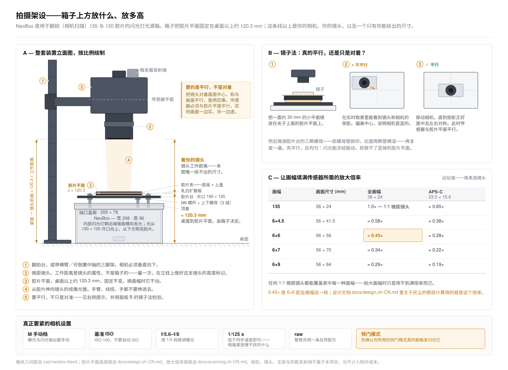
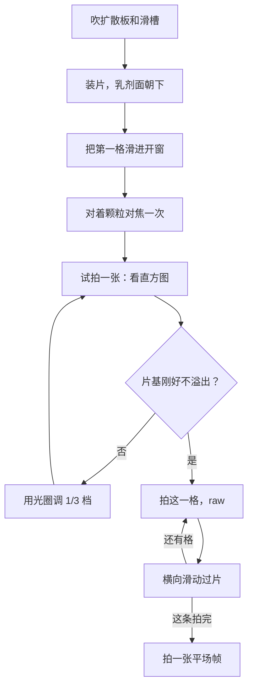

# 翻拍扫描

[English](scanning.md) · **简体中文** · [日本語](scanning.ja.md)

> 这个项目的相机那一半：箱子上面要架什么、怎么把相机调到与胶片面平行、怎么对焦和曝光、怎么装片和过片，以及拿到 raw 文件之后该做什么。

**目录：**[开工之前](#开工之前) · [相机端器材](#相机端器材) · [放大倍率与镜头选择](#放大倍率与镜头选择) · [相机高度与支架](#相机高度与支架) · [平行度](#平行度) · [对焦](#对焦) · [曝光](#曝光) · [装片](#装片) · [拍完一卷](#拍完一卷) · [平场校正与反相](#平场校正与反相) · [出问题的时候](#出问题的时候)

## 开工之前

NeoBox 是[相机翻拍](glossary.zh-CN.md#相机翻拍)（camera scanning）用的光源——用数码相机去拍胶片，而不是把胶片送进扫描仪。这只箱子要做的事，是把一个 100 × 120 mm 的开口照均匀，指标是四角之间约 ±0.1 [EV](glossary.zh-CN.md#ev)，片条平整地架在开口上方。从这里到一个数字文件之间的所有环节都在相机端完成，而相机端的东西，本项目一样都不提供。

架相机之前，先把这张单子走一遍：

- [ ] 箱子已装好，胶片台已调平，上螺母已锁紧。
- [ ] 乳白亚克力扩散板搁在开口上，**两面**的保护膜都已撕掉。
- [ ] 闪光灯平躺在主箱底板上，灯头转 90° 对着对面的墙，顶面贴了白纸。
- [ ] 抽口盖板已经塞回抽口，顶盖已经盖到位。
- [ ] 对焦灯——侧壁上 z 约 50 处那条 5 V USB LED 灯带——能亮，调光器在箱外。
- [ ] 你已经用气吹把扩散板两面和[片门](glossary.zh-CN.md#片门)（film gate）吹过一遍。

> [!NOTE]
> 本设计还没有被打印出来，也没有被实际搭建过，所以下文没有任何一个数字是实测结果。曝光参数是用来起步和包围曝光的起点，不是预测值。

## 相机端器材

| 器材 | 在这里干什么 | 真正要紧的地方 |
|---|---|---|
| 机身 | 记录画面 | 手动曝光、raw 文件、能放大的实时取景、热靴，以及**机械快门**（或者开了之后仍然能触发闪光的 [EFCS](glossary.zh-CN.md#efcs)） |
| 具备微距能力的镜头 | 用一格画幅填满传感器 | 够不够你那个规格所需的放大倍率——见下表 |
| [翻拍台](glossary.zh-CN.md#翻拍台)（copy stand），或者带横臂、可倒置中轴的三脚架 | 把相机方方正正、稳稳当当地吊在开口正上方 | 先看刚性，再看立柱高度够不够 |
| 引闪发射器 | 触发箱内的接收器 | 必须能和你买的那个接收器配对；装在相机热靴上 |
| 快门线，或者自拍延时 | 让手离开相机 | 只要能不碰机身就把快门放掉，用什么都行 |
| 反相软件 | 把 raw 负片变成正像 | 见[平场校正与反相](#平场校正与反相) |
| 一面约 30 mm 的小平面镜 | 把传感器调到与胶片面平行 | 要平，而且小到能搁在胶片夹上 |
| 气吹 · 棉手套或洗净的双手 | 灰尘和指纹 | 和其他耗材列在一起 |

这些东西都不在 CNY 250–420 的制作成本里，闪光灯也不在。更完整的清单见[你需要自备的器材](getting-started.zh-CN.md#你需要自备的器材)；镜子、气吹和手套列在[工具与耗材](bom.zh-CN.md#工具与耗材)里。

发射器装在相机热靴上，接收器和闪光灯一起留在箱内。两者必须设在同一频道，而且都要有电——频道没对上、接收器电池没电，都是画面全黑的常见原因。不过第一个该查的还是快门类型：见[曝光](#曝光)。



## 放大倍率与镜头选择

[放大倍率](glossary.zh-CN.md#放大倍率)（magnification）指的是像在传感器上的尺寸除以被摄物本身的尺寸。1.0× 时，一格画幅按原大投到传感器上；0.5× 时，它在每个方向上只占一半。

把一格画幅拍满传感器所需的放大倍率——近似值，用来挑镜头：

| 底片规格 | 画幅尺寸 | 全画幅（36 × 24） | APS-C（23.5 × 15.6） |
|---|---|---|---|
| 135 | 36 × 24 | 1.0×——一支 1:1 微距镜 | 0.65× |
| 6×4.5 | 56 × 41.5 | 0.58× | 0.38× |
| 6×6 | 56 × 56 | 0.43× | 0.28× |
| 6×7 | 56 × 70 | 0.34× | 0.22× |
| 6×9 | 56 × 84 | 0.29× | 0.19× |

任何一支 1:1 微距镜都覆盖表里的每一行——画幅越大，用到的放大倍率反而越低。最吃力的一档是全画幅拍 135，得用满 1.0×。

[设计](design.zh-CN.md#3-光学决策)里讨论灰尘时引用的 0.43×，就是全画幅拍 6×6 这一档。那里之所以引用它，是因为胶片距扩散板只有约 4.3 mm：扩散板上的一粒灰，在 0.43×、f/8 下投到胶片面上是一个直径约 0.2 mm 的柔边光斑——负片反相之后看不见，反转片上看得见。对策是流程上的，不是光学上的：每次开工都把亚克力两面和片门吹一遍。

## 相机高度与支架

胶片面位于**箱子落地面以上约 120.3 mm** 的高度。这个高度由设计固定，135 和 120 完全一样——两副胶片夹把胶片托在同一个高度上，所以换规格不需要重新调平任何东西。

相机高度由两个数字推出来：

```
镜头前端到桌面 = 120.3 mm + 镜头在所需放大倍率下的工作距离
```

[工作距离](glossary.zh-CN.md#工作距离)（working distance）是镜头自身的属性，与箱子无关。先查出来或者量出来，再按下表检查支架：

| 买之前、定下来之前先确认 | 为什么 |
|---|---|
| 立柱行程从底板算起，能够到 120.3 mm 加上工作距离 | 微距镜做到 1:1 时要的高度，常常超出翻拍台的常规行程 |
| 松手之后云台不下坠 | 下坠反映到画面上，就是一卷拍下来焦点在慢慢跑 |
| 底板明显大于箱子 208 × 273 mm 的占地 | 箱子要放正，还得给你的手留出余地 |
| 镜头光轴能落到开口中心，而立柱不会顶到箱子 | 倒置中轴的三脚架，常常把一条腿正好支在箱子该待的位置上 |

高度定好之后要记录下来，方便随时回到同一状态：在桌面或者垫子上标出箱子的占位——两根定位销，或者干脆贴胶带——再把每个规格对应的立柱高度写下来。换规格只改放大倍率，胶片面不动。

## 平行度

> [!IMPORTANT]
> 先保平行度，再谈均匀性。闪光脉冲能冻住震动，但箱子里没有任何东西能救回一个与传感器不平行的胶片面——那样每一格都会有一条边是虚的。

用镜子，别用眼睛：

1. 把那面小平面镜放在胶片面上，也就是搁在胶片夹上。
   *检查点：*镜子平放，不晃。
2. 用实时取景透过相机看这面镜子。
   *检查点：*你能看到镜头和相机正面被反射回来。
3. 移动相机，直到这个反射正好落在画面中心，而且看上去左右对称。
   *检查点：*反射出来的镜筒是同心的，不是被挤到一边的椭圆。镜头的反射落在正中的时候，传感器就与胶片面平行了。
4. 微调胶片台的三颗螺母——前面那颗管俯仰，后面那对管横滚——然后重新检查。两轮就能收敛。
   *检查点：*手从所有东西上拿开之后，反射仍然居中。

<details>
<summary>镜子为什么管用，而水平仪为什么不管用</summary>

水平仪参照的是重力。而你真正需要的是传感器平面与胶片面平行：相机可以完全水平，却仍然相对胶片台是歪的；胶片台也可以是水平的，而相机吊在一条正在下坠的横臂上。

镜子把重力从这道题里拿掉了。只有当镜面垂直于光轴时，镜子才会把镜头沿着光轴原样反射回来。反射居中且左右对称就意味着垂直，垂直于光轴就意味着平行于传感器。这是一个零位法，越接近正确它越灵敏。
</details>

箱子或者相机被动过之后，就重新校一次平行度。[每次开工](assembly.zh-CN.md#每次开工)里的流程，默认平行度已经是对的。

## 对焦

1. 把对焦灯开到低亮度。它的调光器留在箱外。
   *检查点：*开口的亮度够你看清胶片细节，而调光器仍在箱外伸手可及的地方。
2. 装一格片，滑进开窗。
   *检查点：*画幅在开窗里居中，没有片边线侵进来。
3. 进实时取景，放大到 100 %。
   *检查点：*放大后的画面是稳的，显示的是画幅上的一小块，不是一整格。
4. 对着**颗粒**对焦，不要对着画面内容对。颗粒长在胶片面上，画面里那些本来就边缘柔和的被摄物不在。
   *检查点：*你能分辨出一颗颗的颗粒团，而不只是「画面变清楚了」。
5. 收到你实际要拍的那档光圈，重新检查中心和两个对角。
   *检查点：*中心和两个角上的颗粒都是脆的。如果有一个角怎么都实不了，回到[平行度](#平行度)。
6. 把镜头切到手动对焦，或者拿胶带把对焦环粘住，这一场剩下的时间都不要再碰它。
   *检查点：*拨对焦环没有反应，或者胶带把它固定住了。

拍摄过程中对焦灯想一直开着也可以——开低一点，因为闪光会把它完全盖过去。它在那里是给你看的，不参与曝光。

## 曝光

| 项目 | 设置 | 为什么 |
|---|---|---|
| 模式 | 手动 | 这里没有任何东西该逐格变化 |
| ISO | [基准 ISO](glossary.zh-CN.md#基准-iso)（base ISO），通常是 100 | 闪光出力有富余，那就选画质最干净的那一档 |
| 光圈 | 从 f/5.6–f/8 起步 | 这只箱子的测光起点 |
| 快门 | 等于或低于相机的[同步速度](glossary.zh-CN.md#同步速度)（sync speed） | 快过它，快门帘会在画面上切出一条阴影 |
| 快门类型 | 机械快门；如果你的相机开了 EFCS 仍然能触发闪光，EFCS 也行 | 见下面的警告 |
| 文件 | [raw](glossary.zh-CN.md#raw) | 反相需要线性数据 |
| 白平衡 | 固定，取什么值都行 | 后期用片基来定 |
| 防抖 | 关 | 架在支架上时它会自己来回找补，反而把画面弄虚 |
| 闪光灯 | 手动出力，变焦 35–50 mm，**不要**装广角散光板 | [TTL](glossary.zh-CN.md#ttl) 和 [HSS](glossary.zh-CN.md#hss) 在这里没有任何用处 |

> [!WARNING]
> 全电子快门通常根本不会触发闪光。如果第一张全黑，先去菜单里查快门类型，再查别的。

找到工作出力：

1. 把闪光出力设到 1/8 起步。TT560 的[手动出力档位](glossary.zh-CN.md#手动出力档位)（manual power fraction）从 1/1 到 1/128，按整档分——一共八档，中间没有别的。
   *检查点：*闪光灯的充电完成指示灯亮起。
2. 胶片夹里放着片条，拍一张试拍。
   *检查点：*画面不是全黑——闪光灯响了，引闪也配对上了。
3. 看直方图。格与格之间那段透明片基是画面里最亮的东西；曝光到它刚好不溢出为止。
   *检查点：*你能在直方图右端找到片基那个峰，并看清它离右边缘还有多远。
4. 粗调用闪光出力，细调用光圈的 1/3 档。闪光灯只能整档跳，细活由光圈来做。
   *检查点：*透明片基落在直方图右边缘略靠里的位置，没有溢出警告。
5. 锁定，整卷都不再改。
   *检查点：*闪光出力和光圈都写了下来，抽口盖板也塞回去了。

相对于裸光源的读数，预计要**多加大约 3–5 档**闪光出力来抵消箱体的损耗。这个区间是对混光腔损耗的估计，不是实测值。

> [!TIP]
> 改闪光出力就得把抽口盖板抽出来——ZENIKO T1 没法远程调出力。出力在校准的时候一次定死，之后靠光圈干活。两套镍氢电池轮换用，见[供电表](assembly.zh-CN.md#供电)。

<details>
<summary>为什么说闪光脉冲就是曝光，以及它为什么让你能在基准 ISO 下拍</summary>

在一只闭合的箱子里，环境光的贡献是零。快门在黑暗中打开，闪光灯放光，快门关闭——所以**闪光脉冲就是曝光**，它在工作出力下的持续时间是 1/1,000 到 1/20,000 s。

这相当于一个有效快门，比连续发光的 LED 灯板在 ISO 100、f/8 下所需的 1/15 到 1/60 s 真实快门时间短一到三个数量级。振动、快门震动和地面传来的低频晃动都不再是问题。

干活的时候你还会感受到另外两个后果：

- 每一格得到的输出完全一样，所以一套反相参数通常够用一整卷。
- 氙气管给出的是真正连续、接近日光的光谱，约 5600 K，彩色负片在这种光下比在窄带光源下好伺候得多。
</details>

## 装片

> [!CAUTION]
> 每装一条片条之前，都要把滑槽、扩散板两面和片门吹一遍。滑槽只有 0.4 mm 高——卡在里面的一粒砂，会把你之后滑过去的每一格都划伤，而划伤的底片是修不回来的。

| 胶片夹特征（mm） | 135 | 120 |
|---|---|---|
| 滑槽宽度 | 35.4 | 62.0 |
| 滑槽高度 | 0.4 | 0.4 |
| 开窗 | 25 × 37 | 57 × 85（覆盖 6×9） |
| 外形，两件相同 | 110 × 170 | 110 × 170 |

步骤：

1. 把夹上盖从夹底座上取下来，两件都吹一遍。
   *检查点：*对着光看，滑槽和承托上没有肉眼可见的灰。
2. 把片条放进滑槽，**哑光的乳剂面朝下**对着扩散板，光亮的片基面朝上对着相机。
   *检查点：*实时取景里边缘字码的方向是正的。如果读起来是镜像的，说明片条装反了。
3. 从哪一头进片都行——两个滑槽口都是完全敞开的，因为四角挡块只落在距胶片台中心 |x| = 40–60 mm 的位置上。
   *检查点：*只用手指的力就能推动片条。绝对不要硬塞。
4. 盖上夹上盖，闭合磁铁会把这个三明治吸紧。
   *检查点：*夹上盖平整落位，边上没有夹住胶片。
5. 把胶片夹放到胶片台上、四角挡块围出的位置里，底面平贴在扩散板上。
   *检查点：*胶片夹不晃，扩散板被压平在下面。

取放要点：

- **片条也行，整卷也行。** 超出 170 mm 胶片夹的部分，从两头直接伸出去就是了。[走片通道](glossary.zh-CN.md#走片通道)就是为这个留的：胶片夹两端之外、距中心线 |x| < 31 mm 的范围内，不能有任何东西高到胶片的高度——31 是半宽，120 底片大约 62 mm 宽。
- **过片靠横向滑动。** 一卷拍完之前不打开胶片夹。打开就是指纹和掉片的来源。
- **拿片捏边**，手洗干净，或者戴棉手套。
- **卷曲。** 120 底片常常在宽度方向上留着弯。卷得厉害的片条，先让它在片袋里摊平放松，别硬按进滑槽；剩下的那点弯，交给夹上盖的压条压平。
- **6×4.5 和 6×6** 用 120 胶片夹，在开窗上盖一片 `mask-6x6.stl`。
- **装框幻灯片放不进去。** 滑槽只有 0.4 mm，幻灯片框远不止这个厚度。

<details>
<summary>为什么没有任何东西压到影像区，以及为什么一定要在后期裁切</summary>

胶片的两条边搁在承托上，夹上盖的压条也压在同样这两条边上。影像区本身是悬空的——下方约 0.4 mm 间隙，上方约 0.25 mm。没有任何东西压在它上面，这也是这里不可能出[牛顿环](glossary.zh-CN.md#牛顿环)（Newton rings）的原因：那种干涉条纹需要胶片与玻璃发生光学接触，而这里根本没有接触。

开窗相对标称画幅每边**刻意放大 0.5 mm 左右**（135 标称 24 × 36，120 标称 56 × 84）。这是为了吸收不同机身之间的片门差异，以及不同胶片夹之间的打印机 XY 公差。代价是画幅四周会露出一条片边，后期裁掉。完整几何见[设计](design.zh-CN.md#5-胶片夹)。
</details>

## 拍完一卷



每一格要做的全部事情是：滑到画幅在开窗里居中，手离开，用快门线放掉快门，重复。

*每格的检查点：*按快门之前，开窗里没有画幅边缘或者片边线侵进来。

第一卷就值得养成的习惯：

- **给这一卷打个板。** 第一张影像之前，先拍一张写着卷号的卡片。文件不用改名就自动按卷分组了。
- **收工时也拍一张平场帧**，不只是开工时拍，这样你才知道中途有没有东西动过。
- **一卷之中不要改闪光出力。** 改它就得抽出抽口盖板，而且会毁掉「一卷一套反相参数」这个便利。
- **每换一条片条都吹一遍。**

每小时能拍多少，取决于你定下的那个出力对应的闪光灯回电时间，以及你逐格检查得有多仔细。本设计没有任何张数／小时的数据，因为它还没有被搭建出来。长时间连续拍摄，实际做法是两套镍氢电池轮换。

## 平场校正与反相

按顺序来。先[平场校正](glossary.zh-CN.md#平场校正)（flat-field correction），后[反相](glossary.zh-CN.md#反相)（inversion）——正像上的平场很难判断，而给没做过平场的画面反相，等于把暗角一并固化进片子里。

**拍平场帧。** 胶片夹里不放胶片，其余一概不动——同一光圈、同一焦点、同一高度——拍一张裸露发光面的 raw。这一张同时记录了镜头暗角和光源本身的不均匀。

**套用它。** 把每一格除以这张平场帧，就能把两者一次去掉。剩下的，就是光源自己的表现。

**验一下。** 在校正后的平场帧上，四个角各取一小块、中心取一块，互相比较。光源本身的设计目标是四角之间约 ±0.1 EV，而且这是做完平场校正之后衡量的。这条容差带首尾合计 0.2 EV，线性比值 2^0.2 ≈ 1.15——所以你要找的是：线性 raw 数值里，最亮和最暗的采样之间相差不到大约 15 %。如果没达到，办法在校准流程里，不在相机上。

能干这两件事的软件——列出来只是因为它们确实存在、也确实常用，不构成推荐：

| 工具 | 平场校正 | 反相 |
|---|---|---|
| RawTherapee | Raw 选项卡里的 Flat-Field 工具 | Film Negative 工具 |
| ART | 与 RawTherapee 同源 | 支持负片反相 |
| darktable | — | `negadoctor` 模块 |
| Capture One | LCC（lens cast calibration） | — |
| Lightroom + Negative Lab Pro | 通过插件或者一个相除图层 | Negative Lab Pro |

然后反相：

1. **用透明片基定白平衡。** 取格与格之间未曝光的那段片边——彩色负片上那就是橙色片基，把它中性化，反相才会听话。
   *检查点：*片边读起来接近中性灰，不再发橙。
2. **反相**，用你选定的那个工具。
   *检查点：*画面读起来是正像，整体没有残留的色偏。
3. **把参数复制到整卷。** 因为每一格接受的闪光输出都相同，一套反相参数通常够用一整卷。定稿之前抽查一格厚的和一格薄的。
   *检查点：*厚的那格和薄的那格反相之后都不溢出。
4. **裁到画幅。** 开窗是故意做大的，把那条片边裁掉。
   *检查点：*四边都不留片边，也不留胶片夹的边缘。

**黑白胶片**没有橙色片基，但取片基采样一样能给出一个可用的中性参考。

## 出问题的时候

| 现象 | 先查这里 |
|---|---|
| 整张全黑 | 快门类型（电子快门不会触发闪光）、同步速度、接收器电池、引闪频道 |
| 只有一条边发虚 | [平行度](#平行度)——不是对焦 |
| 逐格位置都不变的柔边光斑 | 扩散板上有灰；两面都吹一遍，然后重拍平场帧 |
| 一卷拍下来曝光在漂 | 闪光出力被改过，或者电池快没电了 |
| 做完平场校正四角仍然不均 | 问题在光源不在镜头——回到校准 |

完整的现象—原因—处理表，包括那些以拍摄问题的形式暴露出来的打印和装配缺陷，在[故障排查](troubleshooting.zh-CN.md#拍摄)里。

---

← [装配](assembly.zh-CN.md) · [文档索引](../README.zh-CN.md#文档) · [故障排查](troubleshooting.zh-CN.md) →
