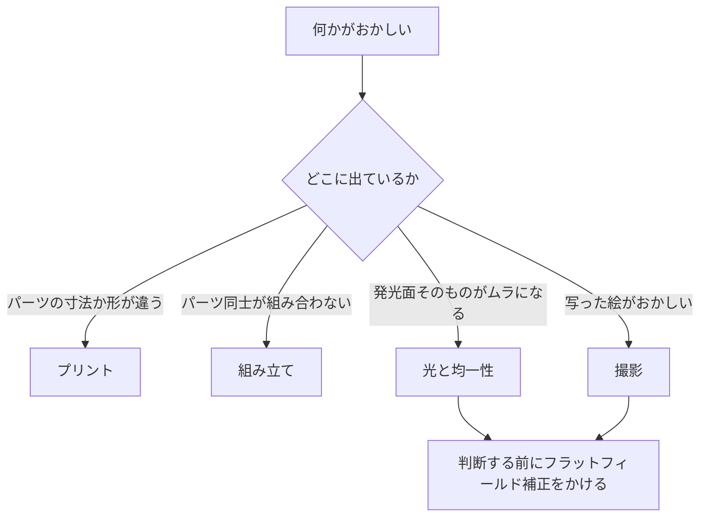

# トラブルシューティング

[English](troubleshooting.md) · [简体中文](troubleshooting.zh-CN.md) · **日本語**

> この設計が実際に起こしうる不具合を、症状・考えられる原因・対処の形でまとめます——出力中、組み立て中、光そのもの、そしてカメラ側。

**目次：** [このページの使い方](#このページの使い方) · [プリント](#プリント) · [組み立て](#組み立て) · [光と均一性](#光と均一性) · [撮影](#撮影) · [それでも解決しないとき](#それでも解決しないとき)

## このページの使い方

> [!NOTE]
> この設計はまだ出力も組み立てもされていません。以下の各行は、形状・材料・手順から導いた「起こりうる不具合」であって、修理記録から拾ったものではありません。ここに実測の結果は 1 つもありません。

変わった原因を探しに行く前に、まずここを確認してください。このページの症状のほとんどは、このどれかに行き着きます。

- [ ] すべてのパーツが[組み立てる前に各パーツを確認する](printing.ja.md#組み立てる前に各パーツを確認する)を通っていること——スライサーにスケーリングされたパーツが 1 つもないこと。
- [ ] 乳白アクリル拡散板の保護フィルムが**両面とも**剥がしてあること。
- [ ] ストロボが机の上に寝かせてあり、ヘッドがオープンフロント（前面開口）の中央に向いていて、ズームが最広角になっていること。
- [ ] 部屋が暗く、天井の照明が開口へ直接差し込んでいないこと。
- [ ] カメラが鏡の方法で正対させてあること——小さな鏡をステージに置き、ライブビューでレンズ自身の映り込みを中央に合わせる。
- [ ] ガラスモードの場合：今回のセッションで、アンチニュートンガラスの下面をブロアーで吹いてから段に戻してあること。

---

## プリント

| 症状 | 考えられる原因 | 対処 |
|---|---|---|
| パーツの実寸が [9 点のパーツ](printing.ja.md#9-点のパーツ)のカードより小さい | スライサーがビルドプレートに合わせて縮小した | 100 %・ミリメートルでスライスし直して出力し直してください。最大のパーツでも 154.8 mm で、160 × 160 のプレートに縮小なしで収まります——縮小されていたら、それは事故です。受け入れ確認もやり直すこと。 |
| 本体または天板ステージの角がビルドプレートから浮いた | 機械が冷えている、すきま風がある、またはプレートが汚れている | きれいなプレートの上、風の当たらない場所で、機械に合う定着補助を使って出力し直してください。角の浮きは見た目の問題ではありません——天板ステージは壁の上端に載り、フィルム面は天板ステージの上に立ちます。どちらかの面が反れば、その上のすべてが傾きます。 |
| パーツのオーバーハングが垂れて、がさがさになっている | 誤った向きでスライスされた | すべてのパーツはサポートなしで出力できますが、決められた向きでだけです：ホルダー底・インサート・本体・天板ステージは平らな底を下に——そして 2 つのホルダー蓋は**上面を下に**。向きを直して出力し直してください。出てしまったパーツを救う方法はありません。 |
| 白いパーツが光沢／シルクで返ってきた | シルクまたは光沢フィラメント | つや消しで出力し直すしかありません。生地のままの白い内面**が**反射面そのものであり、光沢だとストロボのヘッドがホットスポットとして写り込みます。内側を塗装するのは対処になりません。 |
| 段差の高さがパーツカードと合わない | [積層ピッチ](glossary.ja.md#積層ピッチ-layer-height)（layer height）が設計の 0.2 mm グリッドを割り切れない | ホルダー系のパーツは 0.2 mm で出力してください。フィルムの受けとエレメント段のあいだの 0.4 mm の段差がフィルムのクリアランスを決めていて、グリッドに乗ったときにだけ正しく出ます（[設計ログの項目 18「ホルダーを積層ピッチに量子化」](design-log.ja.md#18-ホルダーを積層ピッチに量子化)）。 |

> [!CAUTION]
> 別の向きで出すためにサポートを足さないでください。このビルドのパーツはすべて、決められた向きに限ってサポートレスになるよう設計されています。2 つのホルダー蓋は上面を下に、それ以外は平らな底を下に。このプロジェクトで姿勢を必ず「目で見える特徴」で言い表しているのは、このためです。

---

## 組み立て

| 症状 | 考えられる原因 | 対処 |
|---|---|---|
| 天板ステージが本体の上でがたつく、または 1 つの角が浮いている | 4 つの位置決めダボが全部はダボ穴に落ちていない、またはダボやダボ穴の縁の[エレファントフット](glossary.ja.md#エレファントフット-elephant-foot)（elephant foot） | 天板ステージを持ち上げてもう一度置き直し、4 つのダボが自重で落ち切るようにしてください。それでもがたつくなら、ダボの最初の 1 層をナイフで軽くさらうとたいてい直ります。押し込んだり、何かを挟んだりしないこと。 |
| ホルダー蓋が吸い付かず、逆に弾かれる | どれかのマグネット対が反発している——1 個が裏返しに圧入されている | 予備のマグネットを各位置にかざして、反発する場所を探してください。裏返しの 1 個は抜いて、裏返して、圧入し直すしかありません。次からは、マグネットがまだ 1 本の棒に重なっているうちに全部の同じ面へ印を付け——底側は印を上、蓋側は印を下——それから圧入を始めてください。 |
| 蓋（またはホルダー）を持ち上げると、ステージごと付いてくる | 真上への引き抜きは全部のマグネット対と同時に戦うことになり、しかもこのビルドにはねじ留めが 1 か所もない | 引き抜かずに、剥がしてください：蓋（またはホルダー）を 1 つの角から起こして、マグネット対を 1 組ずつ外します。 |
| ホルダーがステージに吸い付かない、または上で滑る | 4 枚のスチールワッシャーがステンレス——磁性がない——か、座ぐりに入っていない | 炭素鋼か亜鉛メッキのワッシャーを、座ぐり 1 つに 1 枚、ステージ面と面一に入れてください。新しいロットは、届いた日にマグネットで確認すること。 |
| マグネットが穴にすっと落ちて、圧入にならない | 穴が広く出た | 瞬間接着剤を一滴垂らし、穴の底まで沈めてください——マグネットが出っ張ると閉じの隙間が変わります。 |
| 6 × 6 マスクを入れると、ホルダー全体が 1 mm ほど高くなる | マスクは 120 の底の下に敷くものです | 不具合ではありません——設計どおりの挙動です。 |
| 拡散板が白濁した、または細かいひび割れだらけになった | アルコール、またはアンモニア系のガラスクリーナー | 新しい板に交換してください——68 × 118 × 2 mm の特注カットは安価で、v4 サイズの 110 × 130 の板を切り詰めて使うこともできます。 |
| 拡散板が袋から出した時点で、全体にくすんで乳白に見える | 片面に保護フィルムが残っている | 両面とも剥がしてください。片面だけ剥がしてもう片面を見落とすのは、よくあることです。 |

> [!CAUTION]
> 乳白アクリル拡散板を、アルコール・アンモニア・ガラスクリーナーで拭かないでください。表面が永久にひび割れ（クレージング）、ひび割れた板はもう均一な光源ではありません。使ってよいのはブロアーと乾いたマイクロファイバークロスだけです。

なぜこの箱にはねじが 1 本もないのか——それが対処にとって何を意味するか

このビルドにはねじ山が 1 つもありません。積み重ねは重力・位置決めダボ・マグネットで位置が決まり、本来なら締結具で抑え込むはずの公差は、代わりにカメラ側で吸収します：小さな鏡をステージに置き、ライブビューでレンズ自身の映り込みを中央に合わせれば、プラスチックがどんな小さな誤差を抱えていても、センサーはフィルム面と平行になります。

だからここでの機械的な対処は、いつでも「置き直す・剥がす・バリを取る」です——締める・挟む・接着するは決してしません。何かががたつくなら、それが収まっていない座を探すこと。押さえ付けないこと。

---

## 光と均一性

ここの判断はすべてフラットフレーム——フィルムを入れず、実際に使う絞りで RAW 撮影した発光面そのもの——の上で、しかも[フラットフィールド補正](glossary.ja.md#フラットフィールド補正-flat-field-correction)（flat-field correction）をかけたあとに行ってください。手順は[スキャン の「フラットフィールド補正と反転」](scanning.ja.md#フラットフィールド補正と反転)にあります。

| 症状 | 考えられる原因 | 対処 |
|---|---|---|
| 補正後も四隅がムラになる | ストロボのヘッドがオープンフロントの中央に向いていない、ズームが最広角になっていない、または部屋の光が混ざっている | この順で：ヘッドを開口の中央に合わせる。ズームを最広角にする。部屋を暗くする。 |
| 四隅がムラに見えるが、まだフラットフィールド補正をかけていない | レンズの周辺減光と光源本来のムラを、ひとまとめに読んでいる | 補正が先、判断が後です。 |
| ストロボのヘッドの形をそのまま再現した明るい斑が出る | 光沢またはシルクの白フィラメント、あるいは内面を研磨・磨き・塗装してしまった | [拡散チャンバー](glossary.ja.md#積分キャビティ-integrating-cavity)（integrating cavity）は生地のままのつや消し白フィラメントでなければなりません。新しいパーツを出す以外に対処はありません。 |
| 露出計の指示より全体が暗い | 反射で混ぜるチャンバーは光を失います——それが均一性の代償です | ISO を上げる前に、ストロボの発光量を上げてください。 |
| 画面全体が灰色にかぶって、コントラストが低い | 白いステージ面がホルダーの周囲から迷光を照り返している、または天井の照明が開口へ差し込んでいる | オプションの黒い植毛シートをステージ面に貼り、天井の照明が開口に当たらないようにしてください。ストロボの光量は環境光を圧倒します——ただし部屋が暗ければ、です。 |
| 前回のセッションから均一性が変わった | ストロボが机の上で動いた | テープか線でストロボの位置を印し、ヘッドが毎回、開口の前の同じ場所に戻るようにしてください。 |

> [!IMPORTANT]
> 均一性を追いかける前に、平行を出してください。ストロボは振動を凍結しますが、センサーに対して傾いたフィルム面は箱の中の何をもっても救えません——調整はすべてカメラ側、鏡の方法にあります。しかも傾いた面は、四隅を等倍で見比べ始めたときに輝度勾配として読めてしまいます。

---

## 撮影

| 症状 | 考えられる原因 | 対処 |
|---|---|---|
| コマが真っ黒 | 可能性の高い順に、完全電子シャッター、[同調速度](glossary.ja.md#同調速度-sync-speed)（sync speed）より速いシャッター、レシーバーの電池切れ、チャンネル不一致、送信機がホットシューに入り切っていない | ほかに手を付ける前に、この順で潰してください——ストロボもレシーバーも送信機もすべて箱の外にあるので、どれを確認するにも箱を開ける必要はありません。完全電子シャッターではストロボはたいてい発光すらしません。[EFCS](glossary.ja.md#efcs-先幕電子シャッター)（先幕電子シャッター）なら光ることもあります。 |
| コマの一部だけ写り、残りがきれいな暗い帯になる | シャッターがストロボに勝った：実際の同調上限より速い速度です。フォーカルプレーンシャッターの公称は 1/160–1/250 ですが、安価な 2.4G トリガーがそこから約 1 段ぶん食います | まず 1/125 s から。帯が消えたら速度を 1 段ずつ戻していき、帯が再び出たらその 1 段下で止めます。設定の表は[スキャン の「露出」](scanning.ja.md#露出)にあります。 |
| どのコマも片側だけ甘く、残りはシャープ | フィルム面がセンサーと平行になっていない | [スキャン の「平行出し」](scanning.ja.md#平行出し)にある鏡の方法で合わせます。これは決してピントの問題ではありません。 |
| コマの縁や隅が甘く、しかもコマごとに変わる | フィルムが平らになっていない——押さえエレメントが抑え切れなかったカール | 順番に：まず絞りを f/8–f/11 まで絞る——等倍・f/8 の被写界深度は約 ±0.4 mm あり、インサートでの浮き上がりは最大でも 0.28 mm です。次に装填の向きを確認する——押さえ窓インサートではふくらみを**下**に、ガラスではふくらみを**上**に。それでも頑固なフィルムが収まらないなら、アンチニュートンガラスへのアップグレードです——画面全体を連続した面で押さえます。 |
| どのコマにも同じ位置に、ぼんやりした暗い染みが出る | ガラスモード：ガラスの下面の埃。フィルム面まで 0.2 mm——写り込むのに十分な近さです | ガラスを外し、下面を吹いてから戻してください。これを毎セッション開始時の習慣にします。アクリルの上の埃は写り込み**ません**——拡散光源そのものの上に載っているからです——あちらは定期的に拭けば十分です。 |
| コマごとに露出がばらつく | 撮影の途中で発光量を変えた、または電池が減ってチャージ完了前に発光している | 発光量はキャリブレーションのときに一度決め、細かい調整は絞りの 1/3 段で行ってください。チャージ完了ランプを待つこと。ニッケル水素電池は 2 セット用意してローテーションします。 |
| 画面に干渉縞のリングが出る | ガラスモードでガラスが裏返し——アンチニュートンのすりガラス状の面は、フィルムのつやのあるベース面に接する**下向き**でなければなりません——または普通のガラスに置き換わっている | ガラスをすり面が下になるように入れ直してください。インサートモードではそもそもリングは出ません——下の解説を参照——インサートで出たなら、何か余計なものがフィルムに載っています。 |
| ストリップの全長にわたって傷が走る | 押さえエレメントの下の砂粒——フィルムはその下を 0.4 mm のクリアランスで滑り抜けます | ストリップを通す前に毎回、通路とエレメントの下面を吹いてください。 |
| ストリップが引き抜きの途中で重くなる、または詰まる | カールで浮いた縁が内レールの切れ目に引っかかった、または長いストリップの尻尾が垂れて引きずっている | ストリップをいったん戻し、まっすぐにして送り直してください——レールの両端に 12 mm のガイドがあるのは、まさにこのためです。長いストリップの尻尾は空いた手で支えます。フランジの上面が受けてくれます（フィルム面の 0.2 mm 下）が、長く垂れた分にはやはり手が要ります。 |
| ライブビューでエッジの文字が裏返しに読める | ストリップが裏返しに入っている | つや消しの乳剤面を下（光の側）、つやのあるベース面を上（カメラ側）に。手順の全体は[スキャン の「フィルムの装填」](scanning.ja.md#フィルムの装填)にあります。 |
| コマの周囲にフィルムのふちが細く写り込む | 窓は意図的に大きく作ってあります——24 × 36 のコマに対して 25 × 37、片側およそ 0.5 mm——カメラゲートの個体差とプリンタの公差を吸収するためです | 不具合ではありません。後処理で切り落としてください。 |
| マウント済みのスライドが入らない | このホルダーが受けるのはフィルムストリップだけです | マウント済みスライドはこの設計の対象外です。 |
| コマがセンサーいっぱいにならない | フォーマットとセンサーに対して[撮影倍率](glossary.ja.md#撮影倍率-magnification-ratio)（magnification ratio）が足りない | [スキャン の「撮影倍率とレンズの選択」](scanning.ja.md#撮影倍率とレンズの選択)にある表を参照してください。等倍マクロレンズが 1 本あれば、この箱が扱うすべてのフォーマットをカバーできます。 |

> [!CAUTION]
> ストリップを通す前に、毎回吹いてください。コマ送りは、フィルムを押さえエレメントの下で横に滑らせる方式です。砂粒が 1 つ挟まれば、そこを通るコマすべてに傷が入ります。傷の入ったネガは、元には戻せません。

このホルダーでニュートンリングが出うる場所と、出えない場所

[ニュートンリング](glossary.ja.md#ニュートンリング-newton-rings)（Newton rings）は、フィルムが滑らかで硬い面とほぼ密着したところに出る干渉縞です。

押さえ窓インサートでは、画面領域は何にも触れません：フィルムは縁で受けに載り、上のインサートまで 0.4 mm のクリアランスがあります。光学的な接触がどこにもないので、この現象は成り立ちようがありません。インサートモードでリングが見えたなら、何かが足されています——外し忘れたスリーブ、フィルムの上に置いたガラス板。

ガラスでは、接触こそが設計意図です——フィルムのつやのあるベース面がガラスに載ります——そして、すりガラス状のアンチニュートン面こそが干渉を散らす仕掛けです。すり面を下にしてベースに当て、乳剤面を下の開口に向ければ、リングは組み上がりません。したがってガラスモードでリングが出たなら、ガラスが裏返しか、アンチニュートンガラスが普通のガラスに置き換わっています。

---

## それでも解決しないとき

1. **箱側とカメラ側のどちらに原因があるかを切り分ける。** フラットフレームを撮ってください——フィルムを入れず、ほかは何も変えずに。補正後のフラットフレームがきれいなら箱は問題なく、原因はカメラ側です。きれいでなければ[光と均一性](#光と均一性)に戻ってください。
2. **受け入れ確認をやり直す。** [組み立てる前に各パーツを確認する](printing.ja.md#組み立てる前に各パーツを確認する)は、スケーリング・反り・きつすぎる嵌合を捕まえます。これこそ、以降の工程すべてを成り立たなくする不具合です。
3. **一度に 1 つだけ変える**——そのたびにフラットフレームを撮り直します。キャリブレーションの対処には意図的に順番が付いています。最後のものを最初にやると、最初のものが教えてくれたはずのことが隠れてしまいます。
4. **報告する。** この設計はまだ一度も作られていないので、実際の最初のビルドで起きた失敗は、誰にとっても新しい情報です。リポジトリは公開されています：<https://github.com/Neoanaloglab/Neobox>。

参考資料：パーツがなぜその形なのかは[設計](design.ja.md)、何を試して何を却下したのかは[設計ログ の「あえてやらなかったこと」](design-log.ja.md#あえてやらなかったこと)、このページで初めて見る用語は[用語集](glossary.ja.md)。

---

← [スキャン](scanning.ja.md) · [ドキュメント一覧](../README.ja.md#ドキュメント) · [用語集](glossary.ja.md) →
