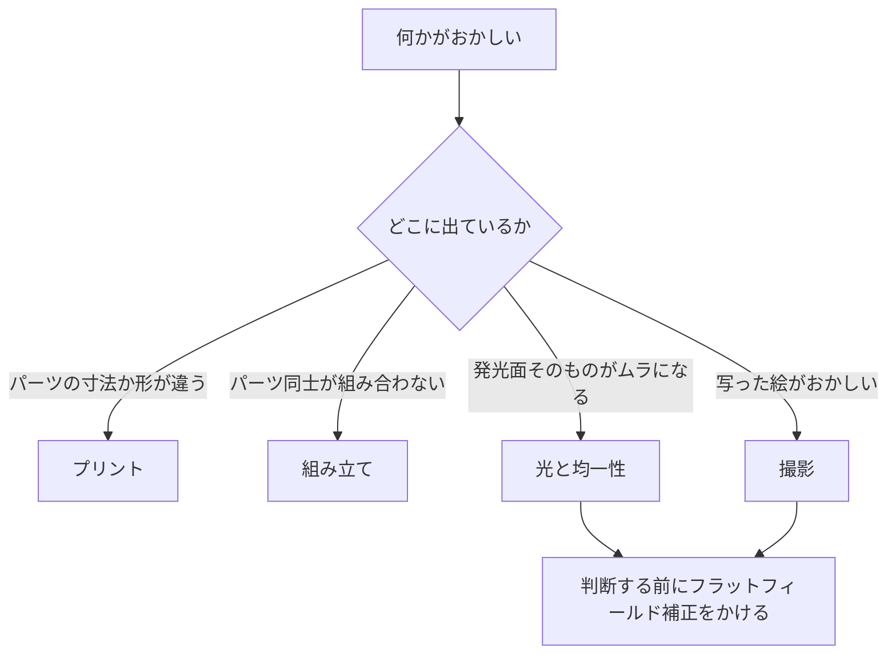

# トラブルシューティング

[English](troubleshooting.md) · [简体中文](troubleshooting.zh-CN.md) · **日本語**

> この設計が実際に起こしうる不具合を、症状・考えられる原因・対処の形でまとめます——出力中、組み立て中、光そのもの、そしてカメラ側。

**目次：** [このページの使い方](#このページの使い方) · [プリント](#プリント) · [組み立て](#組み立て) · [光と均一性](#光と均一性) · [撮影](#撮影) · [それでも解決しないとき](#それでも解決しないとき)

## このページの使い方

> [!NOTE]
> この設計はまだ出力も組み立てもされていません。以下の各行は、形状・材料・手順から導いた「起こりうる不具合」であって、修理記録から拾ったものではありません。ここに実測の結果は 1 つもありません。

変わった原因を探しに行く前に、まずここを確認してください。このページの症状のほとんどは、このどれかに行き着きます。

- [ ] すべてのパーツが[組み立てる前に各パーツを確認する](printing.ja.md#組み立てる前に各パーツを確認する)を通っていること——スライサーにスケーリングされたパーツが 1 つもないこと。
- [ ] フィルムステージが 3 本の寸切りボルトで水平出しされ、3 か所とも上下 2 個のナットが固定されていること。
- [ ] 乳白アクリル拡散板の保護フィルムが**両面とも**剥がしてあること。
- [ ] ストロボ本体の上面に白い紙が貼ってあり、ヘッドにはかかっていないこと。
- [ ] ストロボが寝かせてあり、ヘッドが奥の壁に向けて 90° 回してあり、ズームは 35–50 mm、ワイドパネルは**装着していない**こと。
- [ ] 拡散板の両面と[フィルムゲート](glossary.ja.md#フィルムゲート-film-gate)（film gate）を、今回のセッションでブロアーで吹いてあること。

---

## プリント

| 症状 | 考えられる原因 | 対処 |
|---|---|---|
| パーツの実寸が [9 点のパーツ](printing.ja.md#9-点のパーツ)のカードより小さい | スライサーがビルドプレートに合わせて縮小した | 100 %・ミリメートルでスライスし直して出力し直してください。受け入れ確認もやり直すこと——最初の 4 項目はまさにこれを捕まえるためにあります。 |
| 本体の角がビルドプレートから浮いた | 208 × 273 mm の PLA を壁厚 3 mm で、冷えた機械やすきま風のある場所で出した | きれいなプレートの上、風の当たらない場所で、機械に合う定着補助を使って出力し直してください。角の浮きは見た目の問題ではありません——縁が反ると、天板の 0.3 mm のクリアランスを丸ごと食い潰します。 |
| フィルムストリップが溝で引っかかる、あるいは入らない | 溝の入口のバリ、または 0.4 mm の溝が細く出た | まず両側の入口をホビーナイフで面取りしてください——たいていはこれで直ります。それでも引っかかるなら、XY 補正をわずかにマイナスにして、ホルダーを 1 つだけ出力し直します。数値とスライサーごとの名称は[きつい場合と緩い場合の対処](printing.ja.md#きつい場合と緩い場合の対処)にあります。 |
| フィルムが溝の中でガタつく | 溝が広く出た | XY 補正をわずかにプラスして出力し直してください。クリアランス自体は意図したものです——0.4 mm の溝に対して、フィルムの厚みは約 0.14 mm です。 |
| ホルダーの溝が使い物にならない——受けががさがさで、レールが潰れている | リブのある面をビルドプレートに向けて出力した | 平らな面を下、2 本の長いレールを上に向けて出力し直してください。出てしまったパーツを救う方法はありません。 |
| ホルダー蓋の押さえリブがサポートに埋まって届いた | `film-holder-135-lid.stl` と `film-holder-120-lid.stl` は押さえリブが下向きで読み込まれるのに、回転させなかった | 読み込み後に X 軸まわりに 180° 回転させ、出力し直してください。 |
| アクセスパネルが縦長の薄い板として出てきて、長辺の片面がざらざらしている | このファイルは立った状態で読み込まれ——STL バウンディングボックス 200 × 16 × 78——そのままスライスされた | 寝かせてください。裏面の出っ張った長方形のプラグ面をビルドプレートに接地させ、取っ手を上に、サポートは張り出した面板の縁の下だけに付けます。 |
| アクセス開口の天井が開口の中へ垂れ下がっている | 190 mm のまぐさにサポートがない。このビルドで唯一の本物の[ブリッジ](glossary.ja.md#ブリッジ-bridging)（bridging）です | その 1 か所だけサポートを付けて出力し直してください。 |
| フィルムステージがコーナーブロックなしで届いた | 出力サービスがサポートと勘違いして削り取った | コーナーブロックはモデルに元から含まれる、本体と一体の形状です。出力し直し、発注時にその旨を伝えてください——[出力サービスへの発注](printing.ja.md#出力サービスへの発注)の文面にはすでに書いてあります。 |
| フィルムステージが反っている | 200 × 230 の板に対して[インフィル](glossary.ja.md#インフィル-infill)（infill）が 30 % 未満 | インフィル 30 % 以上で出力し直してください。このサイズでは PETG より PLA のほうが平らに出ますし、平らであることこそフィルムステージの存在理由です。 |
| 白いパーツが光沢／シルクで返ってきた | シルクまたは光沢フィラメント | つや消しで出力し直すしかありません。生地のままの白い内面**が**反射面そのものであり、光沢だとストロボのヘッドがホットスポットとして写り込みます。内側の塗装は禁止なので、あとから補正することもできません。 |
| パーツカードの高さと合わない位置に段差が出る | 0.12 mm または 0.16 mm の[積層ピッチ](glossary.ja.md#積層ピッチ-layer-height)（layer height） | 0.2 mm で出力し直してください——代替は 0.1 mm だけです。0.12 も 0.16 も、ホルダーの 0.4 mm の形状を割り切れません（[設計ログの項目 18「ホルダーを積層ピッチに量子化」](design-log.ja.md#18-ホルダーを積層ピッチに量子化)）。 |

> [!CAUTION]
> ホルダー底とホルダー蓋を、リブのある面を下にして出力しないでください。パーツがレールの頂点で立ってしまい、フィルムの受けが空中に張り出し、0.4 mm の溝が形成されません。平らな面が必ず下です。このプロジェクトで姿勢を必ず「目で見える特徴」で言い表しているのは、このためです。

---

## 組み立て

| 症状 | 考えられる原因 | 対処 |
|---|---|---|
| [インサートナット](glossary.ja.md#インサートナット-heat-set-insert)（heat-set insert）が傾いて入った | こての温度が足りなかったか、軸からずれた方向に押した | 真鍮がすっと沈むまで再加熱し、まっすぐに直して、触らずに冷ましてください。フランジがポスト上面と面一になったところで止めます。PLA ではおよそ 200–250 °C。 |
| インサートがポストの中で空回りする | プラスチックがまだ温かいうちに試したか、下穴を溶かしすぎた | まず完全に冷ましてください——温かい PLA の中の真鍮は必ず回ります。冷えても回るなら、天板を出力し直す前に、フランジのきわに瞬間接着剤を一滴垂らしてみる価値はあります。 |
| 天板が本体にすとんとはまらない | 片側公称 0.3 mm はビルド中で最もきつい嵌合で、[エレファントフット](glossary.ja.md#エレファントフット-elephant-foot)（elephant foot）・反り・塗膜の厚みがそれを食い潰した | 嵌合面にはスプレー塗料を乗せないこと。縁の内側を最初の 2 層分だけ削り落とし、それで足りなければエレファントフット補正を有効にして出力し直します。無理に押し込まないでください——天板は自重で座らなければなりません。 |
| 天板は座るが、合わせ目から光が漏れる | 天板を締め付けているものがない。筐体はねじで留まっておらず、天板は重さだけで載っている | 天板を載せる前に、壁の上端にオプションの EVA フォームテープを一周貼ってください。 |
| アクセスパネルが落ちてくる | プラグは 190 × 76 のアクセス開口に対して 186 × 72 × 4——全周およそ 2 mm あり、それを埋めているのはフォームです | EVA フォームをもう一巻き足してください。箱を縦置きするなら、落ちないようにテープでも留めます。 |
| アクセスパネルが押し込めない | フォームが厚すぎる | EVA を薄く切ってください。パネルは摩擦嵌合で、調整代はフォームの側です。これのためにパネルを出力し直さないこと。 |
| M6 の寸切りボルトがフィルムステージの穴を通らない | Ø6.5 の[バカ穴](glossary.ja.md#バカ穴とタップ穴-clearance-hole-vs-tapped-hole)（clearance hole）が細く出た | 6.5 mm のドリルを手で回してさらい、寸切りボルトが自重で落ちるまで広げてください。 |
| ナットを回してもフィルムステージの高さが変わらなくなった | フィルムステージの穴にタップが立てられている | Ø6.5 のただのバカ穴が開いたフィルムステージに交換してください。ほかに戻す方法はありません——下の CAUTION を参照。 |
| フィルムステージががたついて落ち着かない | 3 本の寸切りボルト以外の何かが板に触れているか、板そのものが反っている | 下側から他のものをすべて取り除き、板の反りを確認してください。3 点が平面を決めます。4 点目の支持は助けになりません。 |
| 水平出しが収束しない | 上ナットが固定されていないか、ピッチとロールを同時に追いかけている | まず下ナット 3 個を同じ回転数に揃えます。そのうえで前のナットでピッチ、後ろ 2 個でロール。2 巡で収束します。上ナットを固定してください。 |
| ホルダー蓋がホルダー底から浮く | 閉じ用マグネットを省いたか、1 組が引き合わずに反発している | ホルダー 1 台につき閉じ用マグネット 8 個、引き合う 4 組です。接着**する前に**、各組を近づけて極性を確認してください。寝かせて使うぶんには蓋の自重で足りますが、縦置きでは足りません。 |
| マグネットが鉄ワッシャーに付かない | ワッシャーがステンレスで、磁性がない | 炭素鋼か亜鉛メッキのワッシャーに替えてください。新しいロットは、届いた日にマグネットで確認すること。 |
| 拡散板が白濁した、または細かいひび割れだらけになった | アルコール、またはアンモニア系のガラスクリーナー | 新しい板に交換してください。部品表が 110 × 130 × 2 の板を 1 枚ではなく 2–3 枚買うように書いてあるのは、このためです。 |
| 拡散板が袋から出した時点で、全体にくすんで乳白に見える | 片面に保護フィルムが残っている | 両面とも剥がしてください。片面だけ剥がしてもう片面を見落とすのは、よくあることです。 |

> [!CAUTION]
> フィルムステージの穴 3 つには絶対にタップを立てず、機械屋に「ねじにしておきましょう」と改良させないでください。下の[インサートナット](glossary.ja.md#インサートナット-heat-set-insert)（heat-set insert）にねじ込まれた寸切りボルトの上で、板側にもねじが切られていると、それは[差動ねじ](glossary.ja.md#差動ねじ-differential-screw)（differential screw）になります。ナットを回しても、板は同一ピッチ 2 つの差——つまりゼロ——しか動きません。水平出しが機能しなくなり、直す方法は新しい板だけです。

> [!CAUTION]
> 乳白アクリル拡散板を、アルコール・アンモニア・ガラスクリーナーで拭かないでください。表面が永久にひび割れます（クレージング）。しかもこの板はフィルムの約 4.3 mm 下という、あらゆる欠陥がほぼピントに乗る位置にあります。使ってよいのはブロアーと乾いたマイクロファイバークロスだけです。

なぜ 4 点目の支持はフィルムステージを良くせず、悪くするのか

3 点は平面を一意に決めます。4 点目を足すと板は過拘束になり、2 本の対角線のあいだでがたつくか、4 点目を締め込んだ結果そこへ届くまで板が曲がるかのどちらかになります。

悪いのは曲がるほうです。平面度こそフィルムステージが存在する理由のすべてだからです。皿状に歪んだ板は拡散板を傾け、フィルムは拡散板の約 4.3 mm 上にあるので、その誤差はほとんど減衰しないままフィルム面に届きます。

3 本の寸切りボルトが非対称に配置してあるのは、アルミ製フィルムステージの手前の穴が中心からずれているのと同じ理由です——前のナットでピッチ、後ろ 2 個でロール、片手につき 1 軸。議論の全体は[設計](design.ja.md#4-フィルムステージ)にあります。

---

## 光と均一性

ここの判断はすべてフラットフレーム——フィルムを入れず、実際に使う絞りで RAW 撮影した発光面そのもの——の上で、しかも[フラットフィールド補正](glossary.ja.md#フラットフィールド補正-flat-field-correction)（flat-field correction）をかけたあとに行ってください。手順は[スキャン の「フラットフィールド補正と反転」](scanning.ja.md#フラットフィールド補正と反転)にあります。

| 症状 | 考えられる原因 | 対処 |
|---|---|---|
| 画面の中央に、だいたい開口の形をした暗い矩形が出る | 黒いストロボ本体が 100 × 120 の開口の真下にあり、その上に白いものが何もない | ストロボ本体の上面に白い紙を貼ってください。ヘッドにはかけないこと。 |
| 四隅がムラに見えるが、まだフラットフィールド補正をかけていない | レンズの周辺減光と光源本来のムラを、ひとまとめに読んでいる | 補正が先、判断が後です。光源だけの目標は、四隅の差でおよそ ±0.1 [EV](glossary.ja.md#ev-露出値)。 |
| 補正後も、画面の片側だけ明るい | まずストロボの位置、次に奥の壁での跳ね返り | この順で。ストロボを中央に戻し、上面の白い紙を確認する。それでも奥側が明るいなら、奥の壁に白いカードを立てて角度を変える。 |
| その 2 つをやっても中央が明るい | 残った不均一 | キャリブレーション手順の最終手段です。拡散板の下面中央に、小さな半透明の減光ドットを貼ります。最後にやること。決して最初にやらないこと。 |
| ストロボのヘッドの形をそのまま再現した明るい斑が出る | 光沢またはシルクの白フィラメント、あるいは内面を研磨・磨き・塗装してしまった | [拡散チャンバー](glossary.ja.md#積分キャビティ-integrating-cavity)（integrating cavity）は生地のままのつや消し白フィラメントでなければなりません。新しいパーツを出す以外に対処はありません。 |
| 露出計の指示より全体が数段暗い | 拡散チャンバーで光を失っている。またはワイドパネルが付いている。またはズームが合っていない | パネルを外し、ストロボのズームを 35–50 mm にして、発光量を上げてください。出発点は ISO 100・f/5.6–f/8。筐体による損失は 3–5 段と見積もっています——実測ではありません。 |
| 画面全体にかぶるフレア。とくに画面の端が悪い | 天板の合わせ目やアクセスパネルから漏れた光が、箱の外側からレンズに入っている | 壁の上端とパネルのプラグの周りに EVA フォームを。この設計に換気孔が 1 つもないのも同じ理由です——穴という穴が光漏れです。 |
| フィルムホルダーの周囲に、素通しの光が縁のように出る | ホルダーがコーナーブロックの内側に収まっていない | コーナーブロックの内側へ、ホルダー底が拡散板に密着するように置き直してください。拡散板から上をすべて黒にしてあるのは迷光を吸わせるためで、明るい色のフィラメントで出したホルダーはそれを台無しにします。 |
| フォーカス用ライトが画面に写る、または色がかぶる | 明るくしすぎているか、フィルムへ直射が通る位置に貼ってある | 暗めで使い、側壁の z = 50 mm あたり——開口より下で、フィルムへの直射が通らない位置——に貼ってください。インライン調光器は箱の外に出したままにします。 |
| 前回のセッションから均一性が変わった | ストロボが動いた | 拡散チャンバーの床にストロボの輪郭線を引いて、毎回同じ場所に戻せるようにしてください。 |

> [!IMPORTANT]
> 均一性を追いかける前に、平行を出してください。ストロボは振動を凍結しますが、センサーに対して傾いたフィルム面は箱の中の何をもっても救えません。しかも傾いた面は、四隅を等倍で見比べ始めたときに輝度勾配として読めてしまいます。

---

## 撮影

| 症状 | 考えられる原因 | 対処 |
|---|---|---|
| コマが真っ黒 | 可能性の高い順に、完全電子シャッター、[同調速度](glossary.ja.md#同調速度-sync-speed)（sync speed）より速いシャッター、レシーバーの電池切れ、チャンネル不一致、送信機がホットシューに入り切っていない | ほかに手を付ける前に、この順で潰してください。完全電子シャッターではストロボはたいてい発光すらしません。[EFCS](glossary.ja.md#efcs-先幕電子シャッター)（先幕電子シャッター）なら光ることもあります。 |
| コマの一部だけ写り、残りがきれいな暗い帯になる | シャッターが同調速度より速く、幕がコマを覆った | カメラの同調速度以下で撮ってください。設定の表は[スキャン の「露出」](scanning.ja.md#露出)にあります。 |
| どのコマも片側だけ甘く、残りはシャープ | フィルム面がセンサーと平行になっていない | [スキャン の「平行出し」](scanning.ja.md#平行出し)にある鏡を使う方法で合わせます。これは決してピントの問題ではありません。 |
| 1 本撮っているあいだにシャープさがずれていく | ピントリングが動いた、またはスタンドのヘッドがカメラの重さで垂れてきている | ライブビュー 100 % で粒子にピントを合わせるのは一度だけ。合わせたらリングを固定するかテープで留めます。次の 1 本に入る前にスタンドのたわみを確認してください。 |
| どのコマにも同じ位置に、ぼんやりした染みが出る | フィルムの約 4.3 mm 下にある拡散板の埃 | アクリルの両面とフィルムゲートを吹いてから、フラットフレームを撮り直してください。そこにある粒子は、0.43 倍・f/8 でフィルム面に直径約 0.2 mm のぼんやりした染みとして投影されます——反転したネガでは見えず、ポジでは見えます。 |
| コマごとに露出がばらつく | 撮影の途中で発光量を変えた、または電池が減ってチャージ完了前に発光している | 発光量はキャリブレーションのときに一度決め、細かい調整は絞りの 1/3 段で行ってください。チャージ完了ランプを待つこと。ニッケル水素電池は 2 セット用意してローテーションします。 |
| 画面に干渉縞のリングが出る | ホルダーが原因ではありません。ここには画面領域に触れるものが 1 つもなく、下に 0.4 mm、上に約 0.25 mm の隙間を持って浮いています | フィルムとカメラのあいだ、またはフィルムと拡散板のあいだに足したものを外してください。下の解説を参照。 |
| ストリップの全長にわたって傷が走る | 0.4 mm の溝に入った砂粒 | ストリップを通す前に毎回、溝を吹いてください。入口はホビーナイフで一度面取りしておきます。 |
| ストリップが片側から入っていかない | ホルダーの端から先の[フィルム走行路](glossary.ja.md#フィルム走行路-run-out-corridor)（run-out corridor）に何かが立っている | 通路は空けておいてください。中心線の左右 31 mm 以内には、フィルム高さまで立ち上がるものを置かないこと。31 は半幅です——120 フィルムの幅は約 62 mm あります。 |
| スライドさせている途中で、120 フィルムが溝から浮き上がる | ストリップの幅方向のカール | 強くカールしたストリップは、装填前にスリーブの中で平らに落ち着かせてください。決して力任せに押し込まないこと。残ったカールは蓋の押さえリブが押さえます。撮り終わるまでホルダーを開けないでください。 |
| ライブビューでエッジの文字が裏返しに読める | ストリップが裏返しに入っている | つや消しの乳剤面を下（拡散板側）、つやのあるベース面を上（カメラ側）に。手順の全体は[スキャン の「フィルムの装填」](scanning.ja.md#フィルムの装填)にあります。 |
| コマの周囲にフィルムのふちが細く写り込む | 窓は片側およそ 0.5 mm 意図的に大きく作ってあります。カメラゲートの個体差とプリンタの公差を吸収するためです | 不具合ではありません。後処理で切り落としてください。 |
| マウント済みのスライドが入らない | 溝の高さが 0.4 mm しかない | このホルダーが受けるのはフィルムストリップだけです。マウント済みスライドはこの設計の対象外です。 |
| コマがセンサーいっぱいにならない | フォーマットとセンサーに対して[撮影倍率](glossary.ja.md#撮影倍率-magnification-ratio)（magnification ratio）が足りない | [スキャン の「撮影倍率とレンズの選択」](scanning.ja.md#撮影倍率とレンズの選択)にある表を参照してください。等倍マクロレンズが 1 本あれば、この箱が扱うすべてのフォーマットをカバーできます。 |

> [!CAUTION]
> ストリップを通す前に、毎回溝を吹いてください。高さは 0.4 mm、コマ送りはその中をフィルムが横滑りする方式で、砂粒が 1 つ挟まればそこを通るコマすべてに傷が入ります。傷の入ったネガは、元には戻せません。

このホルダーではニュートンリングが発生しない理由——出たとしたら何を見ているのか

[ニュートンリング](glossary.ja.md#ニュートンリング-newton-rings)（Newton rings）は、フィルムが硬く平らな面——ガラスキャリア、スキャナのプラテン、裏表を逆に入れたアンチニュートンガラス——とほぼ密着したところに出る干渉縞です。

このホルダーは画面領域に一度も触れません。フィルムの縁が受けに載り、蓋の押さえリブが同じ縁を押さえ、画面領域は下に 0.4 mm、上に約 0.25 mm のクリアランスを持って浮いています。光学的な接触がどこにもないので、この現象は成り立ちようがありません。

それでもリングが見えるなら、光路に何かが足されています——フィルムの上に置いたガラスの平面板、外し忘れたスリーブ、コーティングの傷んだフィルター。それを取り除いてください。

---

## それでも解決しないとき

1. **箱側とカメラ側のどちらに原因があるかを切り分ける。** フラットフレームを撮ってください——フィルムを入れず、ほかは何も変えずに。補正後のフラットフレームがきれいなら箱は問題なく、原因はカメラ側です。きれいでなければ[光と均一性](#光と均一性)に戻ってください。
2. **受け入れ確認をやり直す。** [組み立てる前に各パーツを確認する](printing.ja.md#組み立てる前に各パーツを確認する)は、スケーリング・反り・穴の細りを捕まえます。この 3 つこそ、以降の工程すべてを成り立たなくする不具合です。
3. **一度に 1 つだけ変える**——そのたびにフラットフレームを撮り直します。キャリブレーションの対処には意図的に順番が付いています。最後のものを最初にやると、最初のものが教えてくれたはずのことが隠れてしまいます。
4. **報告する。** この設計はまだ一度も作られていないので、実際の最初のビルドで起きた失敗は、誰にとっても新しい情報です。リポジトリは公開されています：<https://github.com/Neoanaloglab/Neobox>。

参考資料：パーツがなぜその形なのかは[設計](design.ja.md)、何を試して何を却下したのかは[設計ログ の「あえてやらなかったこと」](design-log.ja.md#あえてやらなかったこと)、このページで初めて見る用語は[用語集](glossary.ja.md)。

---

← [スキャン](scanning.ja.md) · [ドキュメント一覧](../README.ja.md#ドキュメント) · [用語集](glossary.ja.md) →
