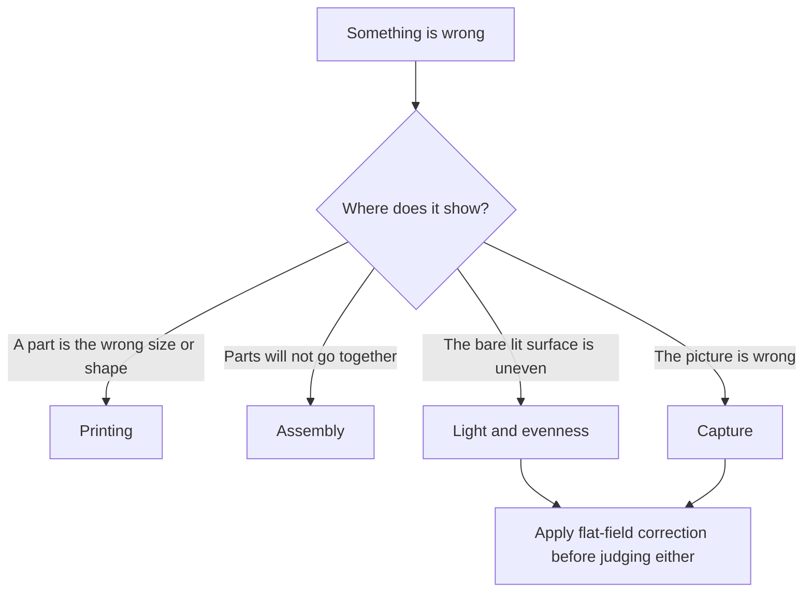

# Troubleshooting

**English** · [简体中文](troubleshooting.zh-CN.md) · [日本語](troubleshooting.ja.md)

> Symptom, likely cause and fix for the faults this design can actually produce — while printing, while building, in the light itself, and at the camera.

**Contents:** [How to use this page](#how-to-use-this-page) · [Printing](#printing) · [Assembly](#assembly) · [Light and evenness](#light-and-evenness) · [Capture](#capture) · [Still stuck](#still-stuck)

## How to use this page

> [!NOTE]
> This design has not been printed or built. Every row below is a fault the geometry, the materials or the procedure can produce — derived from the design, not from a repair log. Nothing here is a measured result.

Check these before you go looking for anything exotic. Most symptoms on this page trace back to one of them:

- [ ] Every part passed [the acceptance checks](printing.md#check-each-part-before-you-assemble) — nothing was scaled by a slicer.
- [ ] The film stage is levelled on its three studs and both nuts are locked at each one.
- [ ] The protective film is off **both** faces of the opal acrylic diffuser.
- [ ] White paper is taped to the top face of the flash body, and not over the head.
- [ ] The flash lies flat with its head turned 90° to the far wall, zoom 35–50 mm, wide-angle diffuser panel **not** fitted.
- [ ] Both faces of the diffuser and the [film gate](glossary.md#film-gate) have been blown this session.

---

## Printing

| Symptom | Likely cause | Fix |
|---|---|---|
| A part measures smaller than its card in [The nine parts](printing.md#the-nine-parts) | The slicer scaled it to fit the build plate | Reslice at 100 %, millimetres, and reprint. Re-run the acceptance checks — the first four exist to catch exactly this. |
| A corner of the main body has lifted off the build plate | 208 × 273 mm of PLA with 3 mm walls, on a cold or draughty machine | Reprint on a clean plate, out of the draught, with whatever adhesion aid your machine likes. A lifted corner is not cosmetic: a warped rim eats the whole 0.3 mm cover clearance. |
| A film strip binds or will not enter the channel | Burrs at the channel mouths, or the 0.4 mm channel came out undersize | Deburr both mouths with a hobby knife first — that fixes most cases. If it still binds, reprint one holder with a small negative XY compensation. Values and slicer names: [tight or loose](printing.md#if-it-came-out-tight-or-loose). |
| The film rattles in the channel | The channel came out oversize | Reprint with a small positive XY compensation. Some clearance is intended: the film is about 0.14 mm thick in a 0.4 mm channel. |
| A holder has no usable channel — the lands are ragged and the rails are crushed | The part was printed with the ridged side against the build plate | Reprint it flat face down, with the two long rails pointing up. Nothing recovers the part as printed. |
| A holder lid arrived with its pressure strips buried in support | `film-holder-135-lid.stl` and `film-holder-120-lid.stl` load strips-down and were not rotated | Rotate 180° about X after import, then reprint. |
| The access panel came out as a tall thin slab, rough down one long face | The file loads standing on edge — STL bounding box 200 × 16 × 78 — and was sliced as loaded | Lay it down: the raised rectangular plug face on the build plate, handle up, support under the overhanging rim only. |
| The ceiling of the access opening has drooped into the opening | No support under the 190 mm lintel, the one real [bridge](glossary.md#bridging) in the build | Reprint with support at that single location. |
| The film stage arrived without its corner blocks | A print service removed them, taking them for support | They are integral geometry. Reprint, and say so in the order — the vendor text in [Ordering from a print service](printing.md#ordering-from-a-print-service) already does. |
| The film stage is bowed | [Infill](glossary.md#infill) below 30 % under a 200 × 230 plate | Reprint at ≥ 30 % infill. PLA prints flatter than PETG at this size, and flatness is what the stage is for. |
| The white parts came back shiny or silky | Silk or glossy filament | They have to be reprinted in matte. The bare white interior *is* the reflector; a glossy one reproduces the flash head as a hot spot, and you cannot correct it afterwards because painting the inside is not allowed. |
| Steps appear at heights that do not match the part cards | 0.12 mm or 0.16 mm [layers](glossary.md#layer-height) | Reprint at 0.2 mm — 0.1 mm is the only alternative. Neither 0.12 nor 0.16 divides the holder's 0.4 mm features ([design log entry 18](design-log.md#18-layer-quantised-holders)). |

> [!CAUTION]
> Never print a holder base or lid with the ridged side down. It stands the part on its rail crests, leaves the film lands hanging over air, and the 0.4 mm channel does not form. The flat face always goes down. This is why orientation in this project is always described by a feature you can see.

---

## Assembly

| Symptom | Likely cause | Fix |
|---|---|---|
| A [heat-set insert](glossary.md#heat-set-insert) went in leaning | The iron was below temperature, or pushed off-axis | Reheat until the brass sinks freely, straighten it, then let it cool untouched. Stop when the flange is flush with the post. About 200–250 °C for PLA. |
| An insert turns in its post | You tried it while the plastic was still warm, or the bore was over-melted | Let it cool fully first — brass in warm PLA always turns. If it still turns cold, a drop of cyanoacrylate at the flange is worth trying before you reprint the top cover. |
| The top cover will not drop onto the main body | The fit is a nominal 0.3 mm per side, the tightest in the build; [elephant foot](glossary.md#elephant-foot), warp or paint thickness has eaten it | Keep spray paint off the mating faces. Scrape the first two layers from the inside of the rim; if that is not enough, reprint with elephant-foot compensation. Never force it — the cover must seat under its own weight. |
| The cover seats, but light escapes the seam | Nothing clamps it. No screws hold the enclosure together and the cover is held by gravity alone | Run the optional EVA foam strip along the top of the wall before dropping the cover on. |
| The access panel falls out | The plug is 186 × 72 × 4 in a 190 × 76 access opening — about 2 mm all round, and the foam is what takes it up | Add another wrap of EVA foam. If the box will stand on end, tape the panel as well so it cannot drop out. |
| The access panel will not push in | Too much foam | Trim the EVA thinner. The panel is a friction fit and the foam is the adjustment; do not reprint the panel for this. |
| An M6 stud will not pass through a film-stage hole | The Ø6.5 [clearance hole](glossary.md#clearance-hole-vs-tapped-hole) printed undersize | Ream it by hand with a 6.5 mm drill until the stud falls through under its own weight. |
| Turning a nut no longer changes the stage height | The stage holes have been tapped | Fit a stage with plain Ø6.5 clearance holes. Nothing else recovers it — see the caution below. |
| The film stage rocks and cannot be settled | Something is touching the plate besides the three studs, or the plate itself is bowed | Clear everything else away from underneath, and check the plate for bow. Three points define a plane; a fourth support does not help. |
| Levelling will not converge | The upper nuts are not locked, or pitch and roll are being chased at the same time | Run all three lower nuts to the same thread count first. Then the front nut for pitch, the rear pair for roll. Two passes converge. Lock the upper nuts. |
| The holder lid lifts off the holder base | The closure magnets were skipped, or a pair repels instead of attracting | Eight closure magnets per holder, in four attracting pairs. Offer each pair up to check polarity **before** gluing. Lying flat, the lid's own weight is enough; on end it is not. |
| A magnet will not hold on a steel washer | The washers are stainless, which is not magnetic | Replace them with carbon-steel or zinc-plated washers. Test any new batch with a magnet the day it arrives. |
| The diffuser has gone cloudy or is covered in fine cracks | Alcohol, or an ammonia-based glass cleaner | Fit a new sheet. This is why the bill of materials says to buy two or three 110 × 130 × 2 sheets rather than one. |
| The diffuser looks dull and milky all over, straight out of the packet | Protective film still on one face | Peel both faces. It is easy to remove one and miss the other. |

> [!CAUTION]
> Never tap the three film-stage holes, and never let a machinist "improve" them into threads. A threaded plate riding on a stud that is also threaded into the [heat-set insert](glossary.md#heat-set-insert) below forms a [differential screw](glossary.md#differential-screw): turning the nut moves the plate by the difference between two identical pitches, which is zero. Levelling stops working and the only fix is a new plate.

> [!CAUTION]
> Never clean the opal acrylic diffuser with alcohol, ammonia or glass cleaner. It crazes the surface permanently, and the sheet sits about 4.3 mm below the film where every defect is nearly in focus. A rocket blower and a dry microfibre cloth, nothing else.

Why a fourth support point makes the stage worse, not better

Three points define a plane exactly. Add a fourth and the plate is over-constrained: either it rocks between two diagonal pairs, or you tighten the fourth point and bend the plate to reach it.

Bending is the worse outcome, because flatness is the whole reason the stage exists. A dished plate tilts the diffuser, and the film sits about 4.3 mm above the diffuser — so the error arrives at the film plane almost undiminished.

The three studs are placed asymmetrically for the same reason the front hole in the aluminium stage is off-centre: front nut for pitch, rear pair for roll, one axis per hand. Full argument in [Design](design.md#4-film-stage).

---

## Light and evenness

Judge all of this on a flat frame — the bare lit surface, no film, shot raw at the working aperture — and only after [flat-field correction](glossary.md#flat-field-correction). The procedure is in [Flat-field and inversion](scanning.md#flat-field-and-inversion).

| Symptom | Likely cause | Fix |
|---|---|---|
| A dark rectangle in the middle of the frame, roughly aperture-shaped | The flash's black body sits directly under the 100 × 120 aperture with nothing white on it | Tape white paper to the top face of the flash body. Not over the head. |
| The corners look uneven, but you have not flat-fielded | Lens vignetting and source unevenness are being read as one thing | Correct first, judge second. The target for the source alone is about ±0.1 [EV](glossary.md#ev) corner to corner. |
| One end of the frame is brighter, after correction | Flash placement first, then the far-wall bounce | In this order: centre the flash and check the white paper patch; then, if the far end is still brighter, stand a white card at the far wall and change its angle. |
| The centre is still hot after both of those | Residual non-uniformity | The last resort in the calibration sequence: a small translucent attenuating dot at the centre of the diffuser underside. Last, never first. |
| A bright patch that reproduces the shape of the flash head | Glossy or silk white filament, or an interior that has been sanded, polished or painted | The [cavity](glossary.md#integrating-cavity) must be bare matte white filament. There is no fix short of new parts. |
| Everything is several stops darker than the meter suggested | The cavity costs light; or the wide-angle diffuser panel is fitted; or the zoom is wrong | Remove the panel, set flash zoom 35–50 mm, and add power. Start at ISO 100 and f/5.6–f/8; the enclosure loss is estimated at 3–5 stops, not measured. |
| Veiling flare, worst near the frame edges | Light escaping the cover seam or the access panel and reaching the lens from outside | EVA foam along the top of the wall and around the panel plug. This design has no ventilation holes for the same reason: every hole is a light leak. |
| A rim of raw light around the film holder | The holder is not sitting inside the corner blocks | Set it down inside them, holder base flat on the diffuser. Everything above the diffuser is black so stray light is absorbed — a holder in a light-coloured filament defeats that. |
| The focus light shows in the frame, or tints it | Run too bright, or stuck where it has a direct line to the film | Run it low and keep it on the side wall at about z = 50 mm, below the aperture and out of direct line to the film. The inline dimmer stays outside the box. |
| Evenness has changed since last session | The flash has moved | Draw a line on the floor of the cavity around the flash so it always returns to the same place. |

> [!IMPORTANT]
> Fix parallelism before you chase evenness. A flash freezes vibration, but nothing in the box can rescue a film plane that is not parallel to the sensor — and a tilted plane can read as a brightness gradient once you start pixel-peeping corners.

---

## Capture

| Symptom | Likely cause | Fix |
|---|---|---|
| The frame is completely black | In descending likelihood: a fully electronic shutter, a shutter faster than [sync speed](glossary.md#sync-speed), a flat receiver battery, a channel mismatch, a transmitter not seated in the hot shoe | Work down that list before touching anything else. An electronic shutter usually will not fire a flash at all; [EFCS](glossary.md#efcs) sometimes does. |
| Part of the frame is exposed, the rest is a clean dark band | The shutter was faster than sync speed, so the curtain shaded the frame | Shoot at or below your camera's sync speed. Settings table in [Exposure](scanning.md#exposure). |
| One edge of every frame is soft, the rest is sharp | The film plane is not parallel to the sensor | The mirror method in [Parallelism](scanning.md#parallelism). This is never a focus problem. |
| Sharpness drifts across a roll | The focus ring moved, or the stand head is sagging under the camera | Focus once on the grain at 100 % live view, then lock or tape the ring. Check the stand for sag before the next roll. |
| Soft blobs in the same place in every frame | Dust on the diffuser, about 4.3 mm below the film | Blow both acrylic faces and the film gate, then re-shoot the flat frame. A particle there projects as a soft blob about 0.2 mm across at the film plane at 0.43× and f/8 — invisible on an inverted negative, visible on a slide. |
| Exposure varies frame to frame | Flash power was changed mid-roll, or the cells are running down and the flash is firing before it has recycled | Settle power once during calibration and do the fine work with the aperture in 1/3 stops. Wait for the ready lamp. Keep two sets of NiMH cells in rotation. |
| Interference rings across the image | Not the holder. Nothing here touches the image area — it floats 0.4 mm clear below and about 0.25 mm above | Remove whatever was added between the film and the camera, or the film and the diffuser. See the note below. |
| A scratch runs the length of a strip | Grit in the 0.4 mm channel | Blow the channel before every strip, and deburr the mouths once with a hobby knife. |
| The strip will not feed in from one end | Something is standing in the film [run-out corridor](glossary.md#run-out-corridor) beyond the holder end | Keep the corridor clear: nothing may rise to film height within 31 mm either side of the centreline. 31 is the half-width — 120 film is about 62 mm wide. |
| 120 film lifts out of the channel while you slide it | Curl across the width of the strip | Let a strongly curled strip relax flat in its sleeve before loading, and never force it. The lid's pressure strips flatten what remains. Never open the holder mid-roll. |
| Edge markings read mirrored in live view | The strip is in upside down | Dull emulsion side down toward the diffuser, shiny base up toward the camera. Full sequence in [Loading film](scanning.md#loading-film). |
| A sliver of rebate shows around the frame | The windows are deliberately about 0.5 mm oversize per side, to absorb camera-gate variance and printer tolerance | Not a fault. Crop it off in post. |
| A mounted slide will not go in | The channel is 0.4 mm high | The holders take film strips only. Mounted slides are outside the scope of this design. |
| The frame does not fill the sensor | Not enough magnification for your format and sensor | The table in [Magnification and lens choice](scanning.md#magnification-and-lens-choice). Any 1:1 macro lens covers every format the box handles. |

> [!CAUTION]
> Blow the channel before every strip. It is 0.4 mm high, film is advanced by sliding sideways through it, and a single trapped grain of grit will scratch every frame that passes. A scratched negative cannot be un-scratched.

Why Newton rings cannot form in this holder — and what you are seeing if they appear

[Newton rings](glossary.md#newton-rings) are interference fringes that appear where film is in near-contact with a hard, flat surface — a glass carrier, a scanner platen, an anti-newton plate on the wrong side.

This holder never touches the image. The film's edges rest on the lands, the lid's pressure strips bear on the same edges, and the image area floats with 0.4 mm of clearance below and about 0.25 mm above. There is no optical contact anywhere, so the mechanism has nothing to work with.

If you see rings, something has been added to the stack — a glass flattener over the film, a sleeve left in place, a filter with a damaged coating. Take it out.

---

## Still stuck

1. **Prove which half is at fault.** Shoot a flat frame — no film, everything else untouched. If the corrected flat frame is clean, the box is fine and the problem is on the camera side. If it is not, stay in [Light and evenness](#light-and-evenness).
2. **Re-run the acceptance checks.** [Check each part before you assemble](printing.md#check-each-part-before-you-assemble) catches scaling, warp and undersized holes, and those three are the faults that make everything downstream unbuildable.
3. **Change one thing at a time**, and re-shoot the flat frame after each. The calibration remedies are deliberately ordered; applying the last one first hides what the first one would have told you.
4. **Report it.** This design has never been built, so the failures of a real first build are new information for everyone. The repository is public: <https://github.com/Neoanaloglab/Neobox>.

Reference material: [Design](design.md) for why a part is shaped the way it is, [Design log](design-log.md#things-deliberately-not-done) for what was tried and rejected, and the [Glossary](glossary.md) for any term on this page that is new to you.

---

← [Scanning](scanning.md) · [Documentation index](../README.md#documentation) · [Glossary](glossary.md) →
