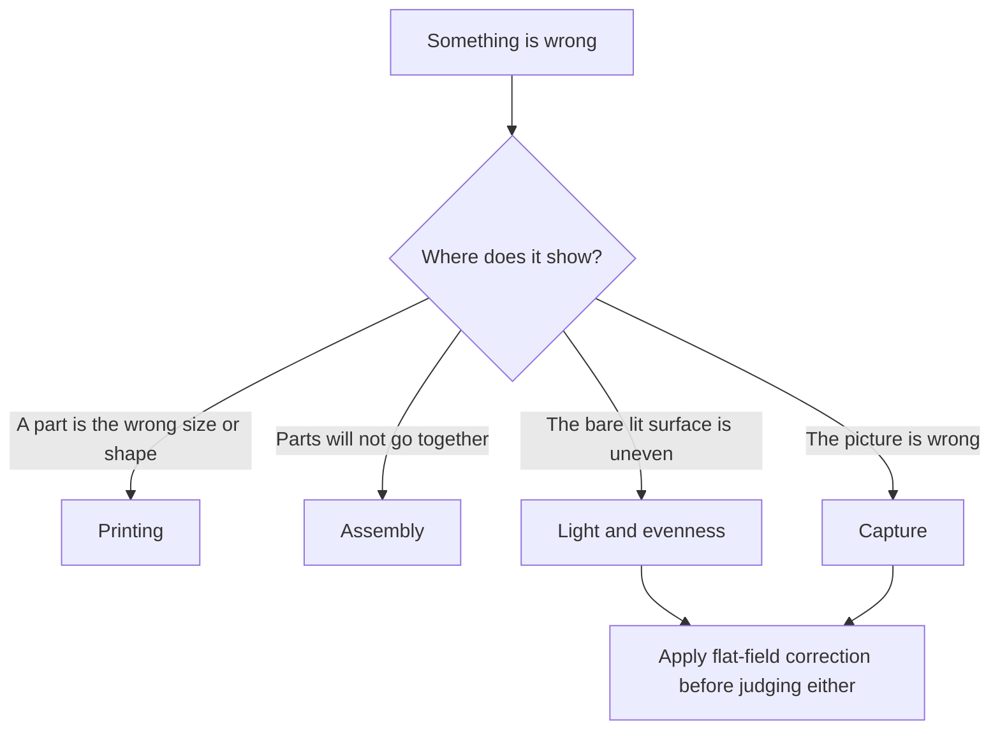

# Troubleshooting

**English** · [简体中文](troubleshooting.zh-CN.md) · [日本語](troubleshooting.ja.md)

> Symptom, likely cause and fix for the faults this design can actually produce — while printing, while building, in the light itself, and at the camera.

**Contents:** [How to use this page](#how-to-use-this-page) · [Printing](#printing) · [Assembly](#assembly) · [Light and evenness](#light-and-evenness) · [Capture](#capture) · [Still stuck](#still-stuck)

## How to use this page

> [!NOTE]
> This design has not been printed or built. Every row below is a fault the geometry, the materials or the procedure can produce — derived from the design, not from a repair log. Nothing here is a measured result.

Check these before you go looking for anything exotic. Most symptoms on this page trace back to one of them:

- [ ] Every part passed [the acceptance checks](printing.md#check-each-part-before-you-assemble) — nothing was scaled by a slicer.
- [ ] The protective film is off **both** faces of the opal acrylic diffuser.
- [ ] The flash lies flat on the desk with its head centred on the open front, zoom at its widest setting.
- [ ] The room is dim, and no ceiling light shines straight into the open front.
- [ ] The camera has been squared to the film plane with the mirror method — a small mirror on the stage, the lens's own reflection centred in live view.
- [ ] Glass mode only: the underside of the anti-Newton glass was blown clean before the glass went into its ledge this session.

---

## Printing

| Symptom | Likely cause | Fix |
|---|---|---|
| A part measures smaller than its card in [The nine parts](printing.md#the-nine-parts) | The slicer scaled it to fit the build plate | Reslice at 100 %, millimetres, and reprint. The largest part is 154.8 mm across and fits a 160 × 160 plate without scaling — so any scaling was an accident. Re-run the acceptance checks. |
| A corner of the main body or the cover-stage has lifted off the build plate | A cold or draughty machine, or a dirty plate | Reprint on a clean plate, out of the draught, with whatever adhesion aid your machine likes. A lifted corner is not cosmetic: the cover-stage rests on the wall tops and the film plane stands on the cover-stage, so warp at either face rocks everything above it. |
| A part has drooped, ragged overhangs | It was sliced in the wrong orientation | Every part prints support-free, but only one way up: flat base down for the holder bases, the inserts, the main body and the cover-stage — and **top face down** for the two holder lids. Reorient and reprint; nothing recovers the part as printed. |
| The white parts came back shiny or silky | Silk or glossy filament | They have to be reprinted in matte. The bare white interior *is* the reflector; a glossy one reproduces the flash head as a hot spot, and painting the inside is not the fix. |
| Steps and ledges sit at heights that do not match the part cards | A [layer height](glossary.md#layer-height) that does not divide the design's 0.2 mm grid | Print the holder parts at 0.2 mm. The 0.4 mm step between the film lands and the element ledge is what sets the film clearance, and it only comes out right on the grid ([design log entry 18](design-log.md#18-layer-quantised-holders)). |

> [!CAUTION]
> Never add support to force a different orientation. Every part in this build is support-free by design — in its stated orientation only. The two holder lids go top face down; everything else goes flat base down. Orientation in this project is always described by a feature you can see.

---

## Assembly

| Symptom | Likely cause | Fix |
|---|---|---|
| The cover-stage rocks on the main body, or sits proud at one corner | The four locating tenons are not all seated in their notches, or [elephant foot](glossary.md#elephant-foot) at a tenon or notch edge | Lift the cover-stage and set it down again so all four tenons drop home under its own weight. If it still rocks, a light knife pass on the first layer of the tenons usually clears it. Never force or shim it. |
| The holder lid pushes itself away instead of snapping shut | One or more magnet pairs repel — a magnet was pressed in flipped | Find the repelling spot by holding a spare magnet over each position in turn. The flipped one has to come out, be turned over and pressed back in. Next time, mark the same face of every magnet while they are still in one stack — mark up in the bases, mark down in the lids — before pressing any of them. |
| Lifting the lid — or the holder — brings the whole stage up with it | A straight vertical pull fights every magnet pair at once, and nothing in this build is screwed down | Peel, don't pull: tip the lid (or the holder) up from one corner so the pairs release one at a time. |
| The holder will not snap down onto the stage, or slides around on it | The four steel washers are stainless — which is not magnetic — or missing from their counterbores | Fit carbon-steel or zinc-plated washers, one in each counterbore, flush with the deck. Test any new batch with a magnet the day it arrives. |
| A magnet drops into its pocket loose instead of press-fitting | The pocket printed oversize | A drop of cyanoacrylate, and seat it to the pocket's full depth — a proud magnet changes the closing gap. |
| The whole holder sits about 1 mm high with the 6 × 6 mask fitted | The mask goes underneath the 120 base | Not a fault — the design does exactly this. |
| The diffuser has gone cloudy or is covered in fine cracks | Alcohol, or an ammonia-based glass cleaner | Fit a new sheet — 68 × 118 × 2 mm is a cheap custom cut, and a v4-size 110 × 130 sheet can be cut down to it. |
| The diffuser looks dull and milky all over, straight out of the packet | Protective film still on one face | Peel both faces. It is easy to remove one and miss the other. |

> [!CAUTION]
> Never clean the opal acrylic diffuser with alcohol, ammonia or glass cleaner. It crazes the surface permanently, and a crazed sheet is no longer an even source. A rocket blower and a dry microfibre cloth, nothing else.

Why nothing in this box screws down — and what that means for a fix

There is not a single thread in the build. The stack is located by gravity, tenons and magnets, and the tolerances that fasteners would normally fight are absorbed at the camera end instead: a small mirror on the stage, the lens's own reflection centred in live view, and the sensor is parallel to the film plane whatever small errors the plastic carries.

So mechanical fixes here are always *reseat, peel, deburr* — never tighten, shim or glue the stack. If something rocks, find the seat it is not sitting in; do not clamp it down.

---

## Light and evenness

Judge all of this on a flat frame — the bare lit surface, no film, shot raw at the working aperture — and only after [flat-field correction](glossary.md#flat-field-correction). The procedure is in [Flat-field and inversion](scanning.md#flat-field-and-inversion).

| Symptom | Likely cause | Fix |
|---|---|---|
| The corners are uneven after correction | The flash head is not centred on the open front, the zoom is not at its widest, or room light is mixing in | In this order: centre the head on the mouth of the box; set the zoom to its widest; dim the room. |
| The corners look uneven, but you have not flat-fielded | Lens vignetting and source unevenness are being read as one thing | Correct first, judge second. |
| A bright patch that reproduces the shape of the flash head | Glossy or silk white filament, or an interior that has been sanded, polished or painted | The [cavity](glossary.md#integrating-cavity) must be bare matte white filament. There is no fix short of new parts. |
| Everything is darker than the meter suggested | The bounce cavity costs light — that is the price of evenness | Add flash power before you add ISO. |
| The image is grey and veiled, low in contrast | The white deck reflecting stray light up around the holder, or a ceiling light shining into the open front | Stick the optional black flocking sheet onto the deck, and keep overhead light off the mouth of the box. The flash overwhelms ambient light — but only in a dim room. |
| Evenness has changed since last session | The flash has moved on the desk | Tape or trace its footprint so the head always returns to the same spot against the front opening. |

> [!IMPORTANT]
> Fix parallelism before you chase evenness. A flash freezes vibration, but nothing in the box can rescue a film plane that is not parallel to the sensor — the whole adjustment lives at the camera end, in the mirror method — and a tilted plane can read as a brightness gradient once you start pixel-peeping corners.

---

## Capture

| Symptom | Likely cause | Fix |
|---|---|---|
| The frame is completely black | In descending likelihood: a fully electronic shutter, a shutter faster than [sync speed](glossary.md#sync-speed), a flat receiver battery, a channel mismatch, a transmitter not seated in the hot shoe | Work down that list before touching anything else — flash, receiver and transmitter all live outside the box, so none of it means opening anything. An electronic shutter usually will not fire a flash at all; [EFCS](glossary.md#efcs) sometimes does. |
| Part of the frame is exposed, the rest is a clean dark band | The shutter beat the flash: a speed above the real sync limit. Focal-plane shutters sync at 1/160–1/250 on paper, and a budget 2.4G trigger costs about a stop of that | Start at 1/125 s. If the band goes, walk the speed back up until it returns, then stay one step below. Settings table in [Exposure](scanning.md#exposure). |
| One edge of every frame is soft, the rest is sharp | The film plane is not parallel to the sensor | The mirror method in [Parallelism](scanning.md#parallelism). This is never a focus problem. |
| The frame edges or corners are soft, and it varies frame to frame | The film is not lying flat — curl the pressure element has not fully tamed | In order: stop down to f/8–f/11 — at 1:1 and f/8 the depth of field is about ±0.4 mm, against rises of at most 0.28 mm with the insert; check the loading direction — bow **down** under the pressure-window insert, bow **up** under the glass; and if a stubborn film still shows it, the anti-Newton glass is the upgrade — it caps the whole frame continuously. |
| Soft dark blobs in the same place in every frame | Glass mode: dust on the underside of the glass, 0.2 mm from the film plane — close enough to image | Take the glass out and blow its underside before it goes back in; make that the habit at every session start. Dust on the acrylic does *not* image — it sits on the diffuse source itself — so a periodic wipe there is enough. |
| Exposure varies frame to frame | Flash power was changed mid-roll, or the cells are running down and the flash is firing before it has recycled | Settle power once during calibration and do the fine work with the aperture in 1/3 stops. Wait for the ready lamp. Keep two sets of NiMH cells in rotation. |
| Interference rings across the image | Glass mode with the glass in flipped — the frosted anti-Newton face must be **down**, against the film's shiny base — or a plain glass substituted for the AN one | Refit the glass frosted face down. In insert mode rings cannot form at all — see the note below — so rings there mean something extra is lying on the film. |
| A scratch runs the length of a strip | Grit under the pressure element — the film slides through beneath it with 0.4 mm of clearance | Blow the channel and the underside of the element before every strip. |
| The strip drags or jams while being pulled through | A curled edge catching at the break in the inner rails, or the tail of a long strip hanging off and dragging | Back the strip out and re-feed it straight — the rail ends carry 12 mm guides for exactly this. Support the tail of a long strip with your free hand; the flange top helps, 0.2 mm below the film plane, but a long overhang still wants a hand under it. |
| Edge markings read mirrored in live view | The strip is in upside down | Dull emulsion side down toward the light, shiny base up toward the camera. Full sequence in [Loading film](scanning.md#loading-film). |
| A sliver of rebate shows around the frame | The windows are deliberately oversize — 25 × 37 for a 24 × 36 frame, about 0.5 mm per side — to absorb camera-gate variance and printer tolerance | Not a fault. Crop it off in post. |
| A mounted slide will not go in | The holders take film strips only | Mounted slides are outside the scope of this design. |
| The frame does not fill the sensor | Not enough [magnification](glossary.md#magnification-ratio) for your format and sensor | The table in [Magnification and lens choice](scanning.md#magnification-and-lens-choice). Any 1:1 macro lens covers every format the box handles. |

> [!CAUTION]
> Blow before every strip. Film is advanced by pulling it sideways beneath the pressure element, and a single trapped grain of grit will scratch every frame that passes. A scratched negative cannot be un-scratched.

Where Newton rings can and cannot form in this holder

[Newton rings](glossary.md#newton-rings) are interference fringes that appear where film is in near-contact with a smooth, hard surface.

With the pressure-window insert, the image area touches nothing: the film rides on its edges with 0.4 mm of clearance to the insert above, so there is no optical contact and the mechanism has nothing to work with. Rings in insert mode mean something has been added to the stack — a sleeve left on, a loose glass laid over the film.

With the glass, contact is the point — the film's shiny base rests against the glass — and the frosted anti-Newton face is what breaks the interference up. Frosted face down against the base, emulsion facing the open window below, and rings cannot assemble. Rings in glass mode therefore mean the glass is in flipped, or a plain glass was substituted for the anti-Newton one.

---

## Still stuck

1. **Prove which half is at fault.** Shoot a flat frame — no film, everything else untouched. If the corrected flat frame is clean, the box is fine and the problem is on the camera side. If it is not, stay in [Light and evenness](#light-and-evenness).
2. **Re-run the acceptance checks.** [Check each part before you assemble](printing.md#check-each-part-before-you-assemble) catches scaling, warp and tight fits — the faults that make everything downstream unbuildable.
3. **Change one thing at a time**, and re-shoot the flat frame after each. The calibration remedies are deliberately ordered; applying the last one first hides what the first one would have told you.
4. **Report it.** This design has never been built, so the failures of a real first build are new information for everyone. The repository is public: <https://github.com/Neoanaloglab/Neobox>.

Reference material: [Design](design.md) for why a part is shaped the way it is, [Design log](design-log.md#things-deliberately-not-done) for what was tried and rejected, and the [Glossary](glossary.md) for any term on this page that is new to you.

---

← [Scanning](scanning.md) · [Documentation index](../README.md#documentation) · [Glossary](glossary.md) →
