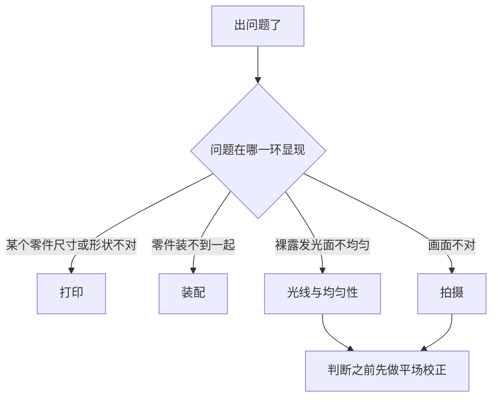

# 故障排查

[English](troubleshooting.md) · **简体中文** · [日本語](troubleshooting.ja.md)

> 这个设计真正可能产生的故障——打印时、装配时、光线本身，以及相机端——每一条都给出现象、可能原因和处理办法。

**目录：**[怎么用这一页](#怎么用这一页) · [打印](#打印) · [装配](#装配) · [光线与均匀性](#光线与均匀性) · [拍摄](#拍摄) · [还是搞不定](#还是搞不定)

## 怎么用这一页

> [!NOTE]
> 本设计还没有被打印出来，也没有被实际搭建过。下面每一行都是几何结构、材料或者流程本身能够造成的故障——从设计推导出来的，不是从维修记录里来的。这里没有任何一个数字是实测结果。

去找那些稀奇古怪的原因之前，先把下面这几条过一遍。这一页上的多数现象，最后都能追回到其中某一条：

- [ ] 每个零件都通过了[装配前逐件检查](printing.zh-CN.md#装配前逐件检查)——没有哪个被切片软件缩放过。
- [ ] 胶片台已经在三根螺杆上调平，每根上的两颗螺母都锁紧了。
- [ ] 乳白亚克力扩散板**两面**的保护膜都已经撕掉。
- [ ] 白纸贴在闪光灯灯身的上表面，而不是盖在灯头上。
- [ ] 闪光灯平躺着，灯头转 90° 对着对面的墙，变焦 35–50 mm，广角散光板**没有**装。
- [ ] 这次开工时，扩散板两面和[片门](glossary.zh-CN.md#片门)（film gate）都已经吹过一遍。

---

## 打印

| 现象 | 可能原因 | 处理办法 |
|---|---|---|
| 某个零件量出来比[九个零件](printing.zh-CN.md#九个零件)里那张卡片上的尺寸小 | 切片软件把它缩放到了打印床能放下的大小 | 按 100 % 比例、毫米单位重新切片并重打。再走一遍验收检查——前四条就是专门抓这件事的。 |
| 主箱有一个角从打印床上翘起来了 | 208 × 273 mm 的 PLA、3 mm 壁厚，机器又冷、又有穿堂风 | 换干净的床面、避开风口重打，用你机器习惯的那种粘床手段。翘角不是外观问题：变形的边缘会把顶盖那 0.3 mm 的间隙整个吃掉。 |
| 片条卡在滑槽里，或者根本推不进去 | 滑槽口有毛刺，或者 0.4 mm 的滑槽打小了 | 先用美工刀把两个槽口的毛刺修掉——多数情况到这一步就解决了。还是卡，就加一点 XY 负补偿重打一副。数值和各家切片软件里的叫法见[打紧了或打松了怎么办](printing.zh-CN.md#打紧了或打松了怎么办)。 |
| 片条在滑槽里晃 | 滑槽打大了 | 加一点 XY 正补偿重打。留一点余量本来就是设计意图：片条厚约 0.14 mm，槽高 0.4 mm。 |
| 某副胶片夹根本没有可用的滑槽——承托是毛的，导轨被压塌了 | 这个件是带凸起特征的那一面贴着打印床打的 | 平面朝下、两条长导轨朝上重打。已经打成这样的件没有任何补救办法。 |
| 夹上盖到手时，压条整个埋在支撑里 | `film-holder-135-lid.stl` 和 `film-holder-120-lid.stl` 导入时压条是朝下的，没有旋转过 | 导入后绕 X 轴旋转 180°，再重打。 |
| 抽口盖板打出来是一块又高又薄的板，有一个长面很粗糙 | 这个文件导入时是立着的——STL 外框 200 × 16 × 78——就照这个姿态切片了 | 把它放倒：背面凸起的方形插塞面贴打印床，把手朝上，只在面板悬空的那一圈边缘加支撑。 |
| 抽口的上沿垂塌下来，探进了抽口里 | 那道 190 mm 门楣下面没加支撑，它是全套里唯一一处真正的[桥接](glossary.zh-CN.md#桥接)（bridging） | 只在这一处加支撑重打。 |
| 胶片台到手时四角挡块不见了 | 代打店把它们当成支撑拆掉了 | 那是模型自带的实体结构。重打，并且在下单时说清楚——[找代打服务下单](printing.zh-CN.md#找代打服务下单)里那段话术已经写了这一条。 |
| 胶片台是弯的 | 200 × 230 的板下面[填充](glossary.zh-CN.md#填充)（infill）低于 30 % | 按 ≥ 30 % 填充重打。这个尺寸下 PLA 比 PETG 打得平，而胶片台要的就是平。 |
| 白色件回来是亮面或者丝面的 | 用了丝面或亮面耗材 | 只能换哑光料重打。裸露的白色内壁*就是*那面反射器；亮面会把灯头映成一块亮斑，而且事后无法补救，因为内壁不允许喷涂。 |
| 台阶出现的高度和零件卡片对不上 | 用了 0.12 mm 或者 0.16 mm [层高](glossary.zh-CN.md#层高)（layer height） | 按 0.2 mm 重打——唯一的替代值是 0.1 mm。0.12 和 0.16 都除不尽胶片夹上那些 0.4 mm 的特征（[设计日志第 18 条](design-log.zh-CN.md#18-夹子按层高量化)）。 |

> [!CAUTION]
> 绝不要把夹底座或者夹上盖带凸起特征的那一面朝下打印。那样零件是立在导轨的脊上，胶片承托整个悬空，0.4 mm 的滑槽根本成不了型。平面永远朝下。这也正是这个项目描述打印朝向时永远只用你看得见的特征的原因。

---

## 装配

| 现象 | 可能原因 | 处理办法 |
|---|---|---|
| [热熔铜螺母](glossary.zh-CN.md#热熔铜螺母)歪着沉进去了 | 烙铁温度不够，或者压的时候没沿着轴线 | 重新加热到铜件能自己往下沉，扶正，然后不要碰它，让它自己冷却。铜件的法兰与立柱端面齐平就停手。PLA 大约 200–250 °C。 |
| 铜螺母在立柱里空转 | 塑料还热着你就去动它，或者孔烧过头了 | 先让它彻底冷透——热 PLA 里的铜件一定会转。冷了还转，在法兰处点一滴 502 胶值得一试，实在不行才重打顶盖。 |
| 顶盖落不到主箱上 | 这处配合标称每侧 0.3 mm，是全套里最紧的一处；[象足](glossary.zh-CN.md#象足)（elephant foot）、变形或者漆膜厚度把它吃掉了 | 喷漆时别喷到配合面上。把裙边内侧的头两层刮掉；还不够就打开象足补偿重打。绝对不要硬压——顶盖必须靠自重坐下去。 |
| 顶盖坐到位了，但缝里漏光 | 没有任何东西夹住它。这个壳体没有螺丝，顶盖全靠自重压着 | 盖上去之前，沿着壁顶贴上那条可选的 EVA 泡棉条。 |
| 抽口盖板会掉出来 | 插塞是 186 × 72 × 4，抽口是 190 × 76——四周约 2 mm，全靠泡棉填掉 | 再缠一层 EVA 泡棉。如果箱子要立起来用，另外用胶带把盖板固定住，让它掉不下来。 |
| 抽口盖板推不进去 | 泡棉太厚了 | 把 EVA 削薄。盖板靠摩擦固定，调节量在泡棉上；不要为这个重打盖板。 |
| M6 螺杆穿不过胶片台上的孔 | Ø6.5 [光孔](glossary.zh-CN.md#光孔与螺纹孔)（clearance hole）打小了 | 用 6.5 mm 钻头手工铰，直到螺杆靠自重就能落下去。 |
| 拧螺母，胶片台的高度却不再变化 | 胶片台的孔被攻了丝 | 换一块孔是 Ø6.5 光孔的胶片台。除此之外没有别的办法——见下面的警告。 |
| 胶片台一直打晃，怎么都稳不下来 | 除了三根螺杆之外还有别的东西顶着台面，或者台面本身是弯的 | 把台面下方其他东西全部清掉，再检查板有没有弯。三点确定一个平面，加第四个支撑点不解决问题。 |
| 调平怎么都收敛不了 | 上螺母没锁紧，或者俯仰和横滚在同时追 | 先把三颗下螺母拧到相同圈数。然后前螺母管俯仰、后面那对管横滚。两轮就能收敛。最后锁紧上螺母。 |
| 夹上盖会从夹底座上翘起来 | 闭合磁铁没装，或者某一对是相斥的 | 每副胶片夹八颗闭合磁铁，组成四对相吸的磁对。点胶**之前**先把每一对凑到一起确认极性。平放时夹上盖自重就够了，立起来用就不够。 |
| 磁铁吸不住铁垫片 | 垫片是不锈钢的，不导磁 | 换成碳钢或者镀锌的垫片。新到的每一批，当天就拿磁铁试一下。 |
| 扩散板发白，或者布满细密裂纹 | 用了酒精，或者含氨的玻璃清洁剂 | 换一片新的。物料清单里让你一次买两三片 110 × 130 × 2 而不是一片，就是为了这个。 |
| 扩散板刚拆封就是一片灰蒙蒙的奶白 | 有一面的保护膜还没撕 | 两面都撕掉。撕掉一面、漏掉另一面是很容易发生的事。 |

> [!CAUTION]
> 绝不要给胶片台那三个孔攻丝，也绝不要让哪个师傅「顺手帮你改成螺纹孔」。一块攻了丝的板，骑在一根同时旋进下方[热熔铜螺母](glossary.zh-CN.md#热熔铜螺母)的螺杆上，就构成了一组[差动螺旋](glossary.zh-CN.md#差动螺旋)（differential screw）：拧螺母时，板移动的距离等于两个完全相同的螺距之差，也就是零。调平从此失效，唯一的补救办法是换一块新板。

> [!CAUTION]
> 绝不要用酒精、氨水或者玻璃清洁剂去擦乳白亚克力扩散板。它会让表面永久性地起细裂纹，而这块板就在胶片下方约 4.3 mm 处——那里的每一处瑕疵几乎都在焦内。只能用气吹和干的超细纤维布，别的一概不行。

为什么加第四个支撑点只会让胶片台更糟，而不是更好

三点唯一确定一个平面。加上第四点，板就被过约束了：要么它在两条对角之间来回跷，要么你把第四点拧到位，同时把板压弯。

压弯是更糟的那一种，因为胶片台存在的全部意义就是平。板一凹，扩散板就跟着斜，而胶片就浮在扩散板上方约 4.3 mm——误差几乎原封不动地传到胶片面上。

三根螺杆的位置是不对称的，理由和铝制胶片台上前面那个孔偏心是同一个：前螺母管俯仰，后面那对管横滚，一只手管一个轴。完整论证见[设计](design.zh-CN.md#4-胶片台)。

---

## 光线与均匀性

下面这些一律在平场帧上判断——胶片夹里不放胶片的裸露发光面，用工作光圈拍的 raw——而且要在[平场校正](glossary.zh-CN.md#平场校正)（flat-field correction）之后再判断。流程见[平场校正与反相](scanning.zh-CN.md#平场校正与反相)。

| 现象 | 可能原因 | 处理办法 |
|---|---|---|
| 画面中间有一块暗矩形，形状大致就是开口 | 闪光灯的黑色灯身正好在 100 × 120 的开口正下方，上面什么白的都没有 | 在闪光灯灯身的上表面贴一张白纸。别盖住灯头。 |
| 四角看着不均匀，但你还没做平场 | 镜头暗角和光源不均被当成同一回事在看 | 先校正，后判断。光源本身的目标是四角之间约 ±0.1 [EV](glossary.zh-CN.md#ev)。 |
| 校正之后，画面一头仍然更亮 | 先怀疑闪光灯的摆位，其次是对面墙的反弹 | 按这个顺序来：把闪光灯摆正居中，检查那张白纸；如果远端还是更亮，在对面墙立一张白卡，调它的角度。 |
| 上面两条都做过了，中心仍然偏亮 | 残余的不均匀 | 校准流程里的最后手段：在扩散板下表面的中心贴一小片半透明的减光点。最后才用，绝不先用。 |
| 有一块亮斑，形状能认出是灯头 | 白色耗材是亮面或者丝面的，或者内壁被打磨、抛光、喷涂过 | [混光腔](glossary.zh-CN.md#混光腔)（integrating cavity）必须是耗材本色的哑光白。除了换新件，没有别的办法。 |
| 整体比测光表给的读数暗好几档 | 混光腔本身就要吃光；或者广角散光板还装着；或者变焦档位不对 | 把散光板取下来，闪光变焦设到 35–50 mm，加出力。从 ISO 100、f/5.6–f/8 起步；箱体损耗估计在 3–5 档，不是实测值。 |
| 画面蒙上一层灰雾，越靠近边缘越明显 | 光从顶盖缝或者抽口盖板漏出去，再从箱外进到镜头里 | 壁顶和盖板插塞四周都贴上 EVA 泡棉。这个设计不开散热孔也是同一个道理：每一个孔都是一处漏光。 |
| 胶片夹周围露出一圈没经过胶片的光 | 胶片夹没有放进四角挡块围出的位置里 | 把它放进去，夹底座平贴在扩散板上。扩散板以上的一切都是黑的，为的就是吸掉杂光——用浅色耗材打的胶片夹会把这件事作废。 |
| 对焦灯拍进画面里了，或者把画面染上了色 | 开得太亮，或者装的位置能直接照到胶片 | 开低一点，装在侧壁 z ≈ 50 mm 处，位于开口下方，且照不到胶片。调光器留在箱外。 |
| 均匀性和上次开工时不一样了 | 闪光灯被挪动过 | 在混光腔底板上沿着闪光灯画一圈线，让它每次都回到同一个位置。 |

> [!IMPORTANT]
> 先解决平行度，再去追均匀性。闪光脉冲能冻住震动，但箱子里没有任何东西能救回一个与传感器不平行的胶片面——而一旦你开始放大到像素去抠四角，倾斜的胶片面读起来就像是一道亮度渐变。

---

## 拍摄

| 现象 | 可能原因 | 处理办法 |
|---|---|---|
| 整张画面全黑 | 按可能性从高到低：全电子快门、快门快过[同步速度](glossary.zh-CN.md#同步速度)（sync speed）、接收器电池没电、引闪频道没对上、发射器没在热靴里插实 | 先按这个顺序查完，再去动别的。全电子快门通常根本不会触发闪光；[EFCS](glossary.zh-CN.md#efcs) 有时候可以。 |
| 画面一部分有曝光，其余是一条干净的暗带 | 快门快过了同步速度，快门帘在画面上挡出了一条影 | 快门设在相机的同步速度或者更慢。参数表见[曝光](scanning.zh-CN.md#曝光)。 |
| 每一格都是同一条边发虚，其余是清晰的 | 胶片面与传感器不平行 | 用[平行度](scanning.zh-CN.md#平行度)里的镜子法。这永远不是对焦问题。 |
| 一卷拍下来清晰度在漂 | 对焦环被动过，或者支架云台在相机重量下慢慢下坠 | 在 100 % 实时取景下对着颗粒对焦一次，然后把对焦环锁住或者用胶带粘住。下一卷开拍前先检查支架有没有下坠。 |
| 每一格同一位置都有柔边光斑 | 扩散板上有灰，它就在胶片下方约 4.3 mm | 把亚克力两面和片门吹一遍，然后重拍平场帧。那里的一粒灰，在 0.43×、f/8 下投到胶片面上是一个直径约 0.2 mm 的柔边光斑——负片反相后看不见，反转片上看得见。 |
| 逐格曝光在变 | 一卷之中改过闪光出力，或者电池快没电、闪光灯还没回够电就被放掉了 | 出力在校准时一次定死，细活交给光圈的 1/3 档。等回电指示灯亮起再拍。两套镍氢电池轮换。 |
| 画面上出现一圈圈干涉环 | 不是胶片夹的问题。这里没有任何东西碰到影像区——下方留 0.4 mm 间隙，上方约 0.25 mm | 把你加在胶片与相机之间、或者胶片与扩散板之间的东西拿掉。见下面的说明。 |
| 一条片条上有一道贯穿全长的划痕 | 0.4 mm 的滑槽里进了砂粒 | 每装一条片条之前先吹滑槽，槽口的毛刺用美工刀修一次。 |
| 片条从某一头推不进去 | 有东西立在胶片夹端头之外的[走片通道](glossary.zh-CN.md#走片通道)里 | 保持通道畅通：中心线两侧各 31 mm 的范围内，不能有任何东西高到胶片的高度。31 是半宽——120 底片大约 62 mm 宽。 |
| 120 底片一边滑动一边从滑槽里翘出来 | 片条在宽度方向上有卷曲 | 卷得厉害的片条，先让它在片袋里摊平放松，绝不硬按。剩下的那点弯交给夹上盖的压条压平。一卷拍完之前不要打开胶片夹。 |
| 实时取景里边缘字码读起来是镜像的 | 片条装反了 | 哑光的乳剂面朝下对着扩散板，光亮的片基面朝上对着相机。完整步骤见[装片](scanning.zh-CN.md#装片)。 |
| 画幅四周露出一条片边 | 开窗是有意做大的，每侧约 0.5 mm，用来吸收相机片门的差异和打印机的公差 | 这不是故障。后期裁掉。 |
| 装框幻灯片塞不进去 | 滑槽只有 0.4 mm 高 | 胶片夹只吃片条。装框幻灯片不在这个设计的范围之内。 |
| 画幅填不满传感器 | 你这个画幅和传感器的组合所需的[放大倍率](glossary.zh-CN.md#放大倍率)（magnification）不够 | 见[放大倍率与镜头选择](scanning.zh-CN.md#放大倍率与镜头选择)里的表。任何一支 1:1 微距镜都能覆盖这只箱子支持的全部画幅。 |

> [!CAUTION]
> 每装一条片条之前都要吹滑槽。它只有 0.4 mm 高，而过片就是让片条从里面横向滑过去——卡在里面的一粒砂，会把之后经过的每一格都划伤。划伤的底片是修不回来的。

为什么这副胶片夹里不可能出牛顿环——真出现了又意味着什么

[牛顿环](glossary.zh-CN.md#牛顿环)（Newton rings）是胶片与坚硬平整表面近乎贴合时出现的干涉条纹——玻璃片夹、扫描仪的玻璃板、装反了的防牛顿环玻璃，都会产生它。

而这副胶片夹从不接触影像区。胶片的两条边搁在承托上，夹上盖的压条压在同样这两条边上，影像区整个悬空：下方 0.4 mm 间隙，上方约 0.25 mm。任何地方都没有光学接触，这个机制根本无从发生。

真看到了环，那就是有东西被加进了这个夹层——压在胶片上的玻璃压平板、忘了取出的片袋、镀膜受损的滤镜。把它拿掉。

---

## 还是搞不定

1. **先确定是哪一半出了问题。** 拍一张平场帧——不放胶片，其余一概不动。如果校正后的平场帧是干净的，箱子没问题，问题在相机端。如果不干净，就留在[光线与均匀性](#光线与均匀性)。
2. **把验收检查重跑一遍。**[装配前逐件检查](printing.zh-CN.md#装配前逐件检查)能抓出缩放、变形和孔径偏小，而这三样正是让后面一切都做不下去的故障。
3. **一次只改一件事**，每改一次就重拍一张平场帧。校准的那几个补救手段是有意排了顺序的；把最后一条先用上，就把第一条本来能告诉你的信息盖掉了。
4. **把它报上来。** 这个设计从来没有被实际搭建过，所以真实的第一次搭建暴露出来的问题，对所有人都是新信息。仓库是公开的：<https://github.com/Neoanaloglab/Neobox>。

参考资料：[设计](design.zh-CN.md)讲某个零件为什么长成这样，[设计日志](design-log.zh-CN.md#特意没有做的事)讲什么被试过又被否掉，这一页上任何一个你没见过的词都能在[术语表](glossary.zh-CN.md)里查到。

---

← [翻拍扫描](scanning.zh-CN.md) · [文档索引](../README.zh-CN.md#文档) · [术语表](glossary.zh-CN.md) →
